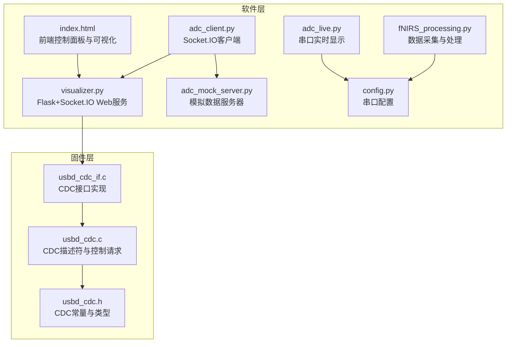
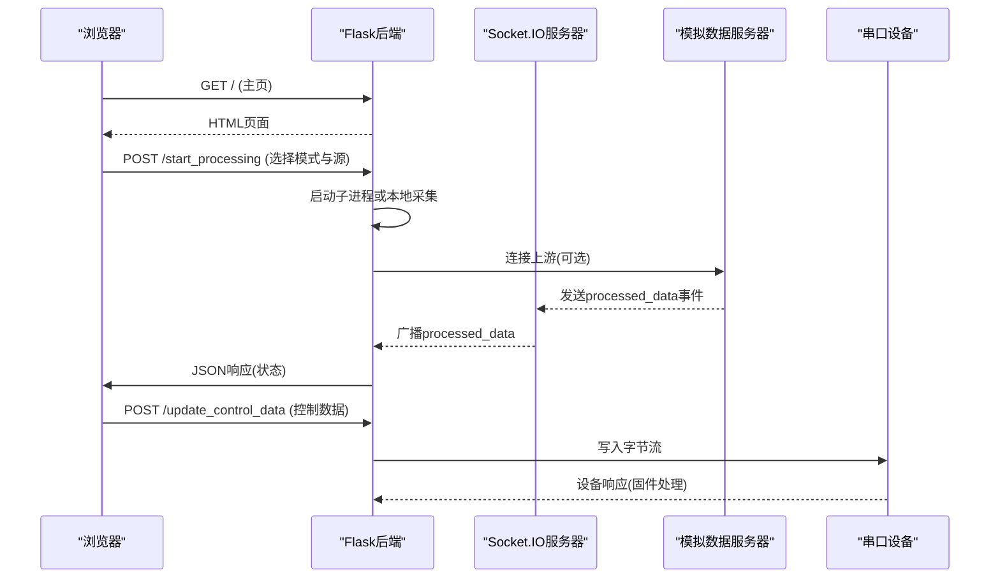
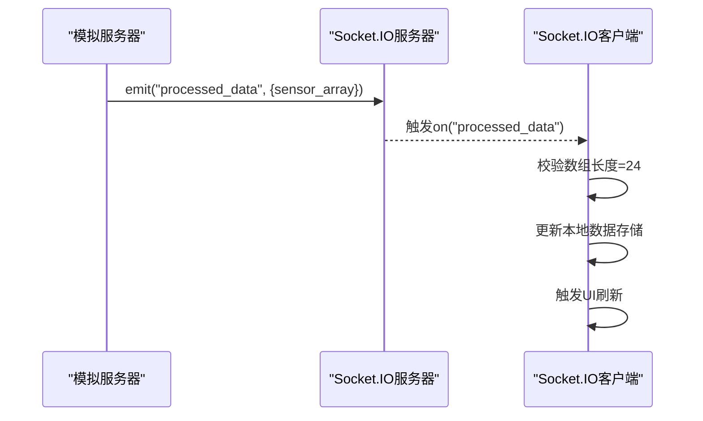
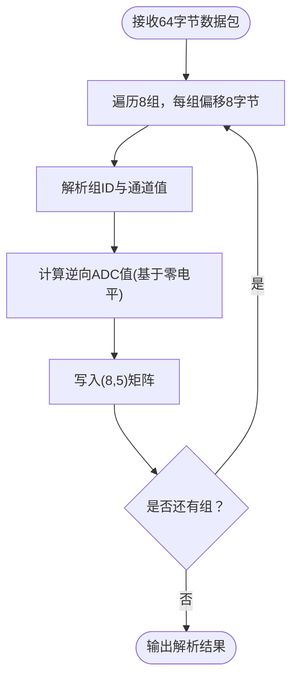
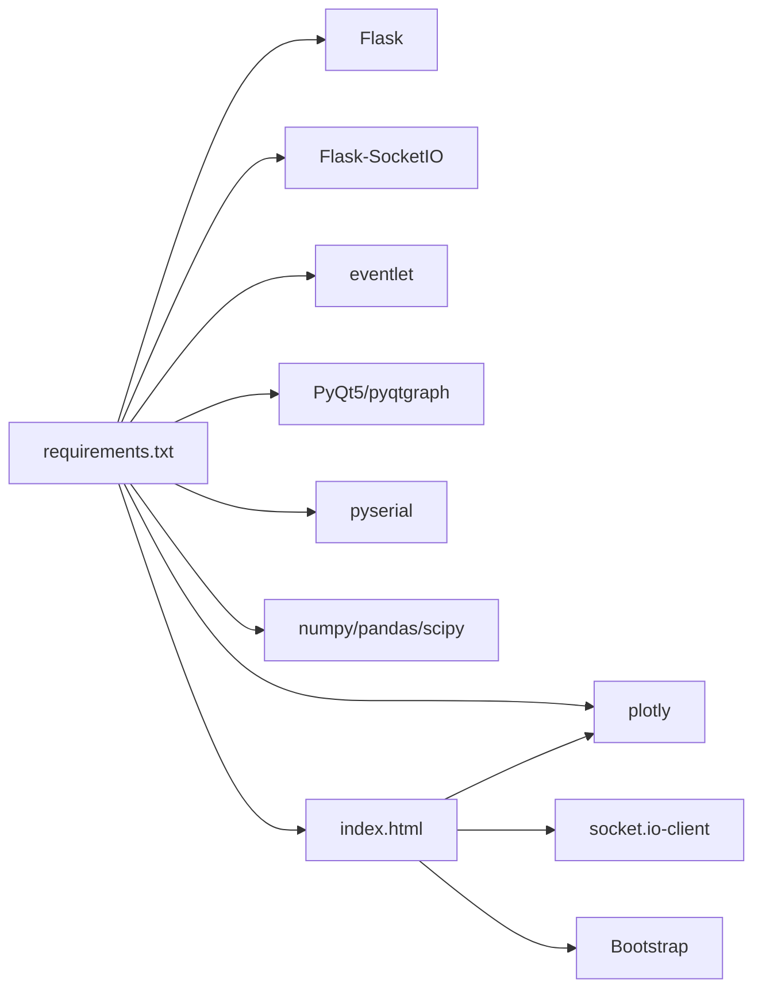

# API参考文档

<cite>
**本文档引用的文件**
- [visualizer.py](file://software/visualizer.py)
- [index.html](file://software/index.html)
- [adc_mock_server.py](file://software/adc_mock_server.py)
- [adc_client.py](file://software/adc_client.py)
- [adc_live.py](file://software/adc_live.py)
- [fNIRS_processing.py](file://software/fNIRS_processing.py)
- [config.py](file://software/config.py)
- [requirements.txt](file://software/requirements.txt)
- [usbd_cdc.h](file://firmware/STM32/fNIRS/Middlewares/ST/STM32_USB_Device_Library/Class/CDC/Inc/usbd_cdc.h)
- [usbd_cdc.c](file://firmware/STM32/fNIRS/Middlewares/ST/STM32_USB_Device_Library/Class/CDC/Src/usbd_cdc.c)
- [usbd_cdc_if.c](file://firmware/STM32/fNIRS/USB_DEVICE/App/usbd_cdc_if.c)
</cite>

## 目录
1. [简介](#简介)
2. [项目结构](#项目结构)
3. [核心组件](#核心组件)
4. [架构总览](#架构总览)
5. [详细组件分析](#详细组件分析)
6. [依赖关系分析](#依赖关系分析)
7. [性能考量](#性能考量)
8. [故障排除指南](#故障排除指南)
9. [结论](#结论)
10. [附录](#附录)

## 简介
本文件为fNIRS系统的API参考文档，覆盖以下方面：
- HTTP REST API接口：基于Flask路由定义、请求/响应格式、参数规范与错误码处理
- WebSocket实时通信接口：基于Socket.IO的连接管理、消息格式、事件类型与实时数据推送机制
- 串口通信协议：基于USB CDC的数据包格式、命令响应定义、协议版本兼容性与数据传输规范
- 完整端点清单：数据获取、设备控制、状态查询等
- 安全与版本管理：认证方法、速率限制与版本策略建议
- 集成示例：为API使用者提供可操作的集成指南

## 项目结构
软件侧主要由Web可视化服务（Flask + Socket.IO）、前端页面、串口数据采集与处理脚本组成；固件侧实现USB CDC设备功能。

**图表来源**
- [visualizer.py](file://software/visualizer.py#L589-L947)
- [index.html](file://software/index.html#L1-L750)
- [adc_mock_server.py](file://software/adc_mock_server.py#L1-L65)
- [adc_client.py](file://software/adc_client.py#L1-L181)
- [adc_live.py](file://software/adc_live.py#L1-L210)
- [fNIRS_processing.py](file://software/fNIRS_processing.py#L1-L496)
- [config.py](file://software/config.py#L1-L13)
- [usbd_cdc.h](file://firmware/STM32/fNIRS/Middlewares/ST/STM32_USB_Device_Library/Class/CDC/Inc/usbd_cdc.h#L45-L112)
- [usbd_cdc.c](file://firmware/STM32/fNIRS/Middlewares/ST/STM32_USB_Device_Library/Class/CDC/Src/usbd_cdc.c#L185-L248)
- [usbd_cdc_if.c](file://firmware/STM32/fNIRS/USB_DEVICE/App/usbd_cdc_if.c#L218-L262)

**章节来源**
- [visualizer.py](file://software/visualizer.py#L589-L947)
- [index.html](file://software/index.html#L1-L750)
- [usbd_cdc.h](file://firmware/STM32/fNIRS/Middlewares/ST/STM32_USB_Device_Library/Class/CDC/Inc/usbd_cdc.h#L45-L112)
- [usbd_cdc.c](file://firmware/STM32/fNIRS/Middlewares/ST/STM32_USB_Device_Library/Class/CDC/Src/usbd_cdc.c#L185-L248)
- [usbd_cdc_if.c](file://firmware/STM32/fNIRS/USB_DEVICE/App/usbd_cdc_if.c#L218-L262)

## 核心组件
- Web服务与REST API
  - 主页路由：返回前端页面
  - 控制接口：更新发射器与多路复用器状态
  - 处理控制：启动/停止数据采集与处理流程
  - 下载与可视化：导出CSV与静态/动画图
- 实时通信
  - 模拟服务器：周期性发送processed_data事件
  - 客户端：接收processed_data并驱动GUI更新
  - 上游客户端：从外部服务器订阅processed_data并入队
- 串口通信
  - 固件CDC：定义端点、线编码与控制请求
  - 软件侧：解析64字节数据包，按组/通道组织数据
  - 配置：串口号、波特率、超时

**章节来源**
- [visualizer.py](file://software/visualizer.py#L589-L947)
- [adc_mock_server.py](file://software/adc_mock_server.py#L1-L65)
- [adc_client.py](file://software/adc_client.py#L1-L181)
- [adc_live.py](file://software/adc_live.py#L1-L210)
- [fNIRS_processing.py](file://software/fNIRS_processing.py#L160-L186)
- [config.py](file://software/config.py#L7-L13)
- [usbd_cdc.h](file://firmware/STM32/fNIRS/Middlewares/ST/STM32_USB_Device_Library/Class/CDC/Inc/usbd_cdc.h#L45-L112)

## 架构总览
系统采用“前端控制面板 + Web服务 + Socket.IO实时通道 + 串口采集/处理”的分层架构。前端通过AJAX调用后端REST接口，后端通过Socket.IO向客户端推送实时数据；同时，后端将控制指令写入串口，由固件CDC接口转发到设备。

**图表来源**
- [index.html](file://software/index.html#L632-L723)
- [visualizer.py](file://software/visualizer.py#L646-L711)
- [adc_mock_server.py](file://software/adc_mock_server.py#L23-L64)

**章节来源**
- [index.html](file://software/index.html#L632-L723)
- [visualizer.py](file://software/visualizer.py#L646-L711)
- [adc_mock_server.py](file://software/adc_mock_server.py#L23-L64)

## 详细组件分析

### HTTP REST API接口
- 基础路径
  - 默认根路径：/，返回HTML页面
- 路由定义与行为
  - GET /
    - 返回前端页面
  - GET /update_graphs
    - 返回当前脑图JSON
  - GET /select_group/{group_id}
    - 高亮指定传感器组，返回更新后的脑图JSON
  - POST /update_emitter_states
    - 接收JSON对象{emitter_states: [...]}，更新全局状态
  - POST /update_control_data
    - 接收JSON对象，合并为控制数据，转换为字节写入串口（非演示模式）
  - POST /start_processing
    - 接收{mode: "live"|"record", sources?: [...] }，启动相应流程
  - POST /stop_processing
    - 终止子进程，重置串口连接
  - GET /download/{source}
    - 下载CSV文件（ADC或mBLL）
  - GET /view_static/{source}
    - 生成静态HTML图表（ADC或mBLL）
  - GET /view_animation/{source}
    - 启动动画脚本（ADC或mBLL）

- 请求/响应格式
  - Content-Type: application/json（除下载外）
  - 成功响应：标准键值对，如{"status": "..."}
  - 错误响应：{"status": "error", "message": "..."}，配合HTTP 4xx/5xx

- 参数规范
  - /select_group/{group_id}：group_id为整数，范围通常为1-8
  - /update_control_data：字节序列长度应与固件期望一致（见串口协议）
  - /start_processing：mode必须为"live"或"record"，sources在record模式下必填且至少包含一个有效源

- 错误码处理
  - 400：无效参数（如source不合法、缺少必需字段）
  - 500：内部错误（如启动子进程失败）

**章节来源**
- [visualizer.py](file://software/visualizer.py#L591-L732)
- [visualizer.py](file://software/visualizer.py#L714-L732)
- [visualizer.py](file://software/visualizer.py#L735-L896)
- [visualizer.py](file://software/visualizer.py#L899-L920)

### WebSocket实时通信接口
- 事件类型
  - processed_data：携带{"sensor_array": [24个数值]}
- 客户端连接
  - 模拟客户端：连接http://localhost:5000，监听processed_data
  - 上游客户端：在visualizer.py中以transports=['websocket']连接
- 数据格式
  - sensor_array为一维数组，长度24，按8个传感器组、每组3个通道排列
- 推送机制
  - 模拟服务器周期性生成三角波数据并广播
  - 可扩展为从串口读取真实数据后转发

**图表来源**
- [adc_mock_server.py](file://software/adc_mock_server.py#L56-L60)
- [adc_client.py](file://software/adc_client.py#L59-L65)

**章节来源**
- [adc_mock_server.py](file://software/adc_mock_server.py#L1-L65)
- [adc_client.py](file://software/adc_client.py#L1-L181)

### 串口通信协议（USB CDC）
- 端点与描述符
  - 数据端点：IN/OUT各一，中断命令端点用于CDC控制
  - 速率：FS默认64字节包，HS可达512字节
- 线编码与控制
  - 支持SET_LINE_CODING/GET_LINE_CODING等CDC命令
  - 控制线状态：SET_CONTROL_LINE_STATE
- 数据包格式（软件侧解析）
  - 单包64字节，包含8组数据
  - 每组8字节：[组ID(1)+短信号(2)+长信号1(2)+长信号2(2)+发射器状态(1)]
  - 软件解析后得到(8,5)矩阵，列含组ID、短/长通道逆向值、发射器状态
- 控制数据格式（软件→固件）
  - 字节序列长度需与固件期望一致
  - 包含发射器控制开关、多路复用器状态等

**图表来源**
- [fNIRS_processing.py](file://software/fNIRS_processing.py#L160-L186)
- [usbd_cdc.h](file://firmware/STM32/fNIRS/Middlewares/ST/STM32_USB_Device_Library/Class/CDC/Inc/usbd_cdc.h#L61-L74)
- [usbd_cdc.c](file://firmware/STM32/fNIRS/Middlewares/ST/STM32_USB_Device_Library/Class/CDC/Src/usbd_cdc.c#L185-L248)

**章节来源**
- [fNIRS_processing.py](file://software/fNIRS_processing.py#L160-L186)
- [usbd_cdc.h](file://firmware/STM32/fNIRS/Middlewares/ST/STM32_USB_Device_Library/Class/CDC/Inc/usbd_cdc.h#L45-L112)
- [usbd_cdc.c](file://firmware/STM32/fNIRS/Middlewares/ST/STM32_USB_Device_Library/Class/CDC/Src/usbd_cdc.c#L436-L478)
- [usbd_cdc_if.c](file://firmware/STM32/fNIRS/USB_DEVICE/App/usbd_cdc_if.c#L218-L262)

### 端点完整列表与用途
- 页面与控制
  - GET /：返回前端页面
  - GET /update_graphs：获取当前脑图
  - GET /select_group/{group_id}：高亮指定传感器组
  - POST /update_emitter_states：更新发射器状态
  - POST /update_control_data：下发控制数据至串口
- 处理流程
  - POST /start_processing：启动ADC或记录/处理流程
  - POST /stop_processing：停止流程并重置串口
- 数据导出与可视化
  - GET /download/{source}：下载CSV（ADC或mBLL）
  - GET /view_static/{source}：静态图表
  - GET /view_animation/{source}：启动动画脚本

**章节来源**
- [visualizer.py](file://software/visualizer.py#L591-L920)

## 依赖关系分析
- Python依赖
  - Flask、Flask-SocketIO、eventlet、PyQt5、pyqtgraph、pyserial、numpy、pandas、plotly、scipy等
- 前端依赖
  - Bootstrap、Plotly、jQuery、Socket.IO客户端
- 固件依赖
  - STM32 USB Device Library CDC类

**图表来源**
- [requirements.txt](file://software/requirements.txt#L1-L15)
- [index.html](file://software/index.html#L8-L12)
- [index.html](file://software/index.html#L305-L305)

**章节来源**
- [requirements.txt](file://software/requirements.txt#L1-L15)
- [index.html](file://software/index.html#L1-L750)

## 性能考量
- 实时性
  - Socket.IO使用eventlet异步模式，降低阻塞
  - 模拟服务器以固定间隔推送数据，便于前端渲染
- 串口吞吐
  - FS默认包大小64字节，注意批量读取与缓冲区管理
  - 解析函数按组循环处理，时间复杂度O(N)，适合高频数据
- 前端渲染
  - 使用定时器触发更新，避免过度重绘
  - 图表库支持增量更新，减少DOM操作

[本节为通用指导，无需特定文件引用]

## 故障排除指南
- 串口连接问题
  - 检查SERIAL_PORT、BAUD_RATE、TIMEOUT配置
  - 确认设备已连接且无其他进程占用
- Socket.IO连接失败
  - 确认模拟服务器或上游服务器已启动
  - 查看客户端重连日志与异常信息
- 处理流程异常
  - start_processing返回错误时检查模式与源参数
  - stop_processing会向子进程发送SIGUSR1信号，确保正确捕获

**章节来源**
- [config.py](file://software/config.py#L7-L13)
- [visualizer.py](file://software/visualizer.py#L690-L711)
- [adc_client.py](file://software/adc_client.py#L73-L78)

## 结论
本API参考文档梳理了fNIRS系统的Web服务、实时通信与串口协议的关键接口与数据流。通过REST API与Socket.IO，系统实现了从设备控制到实时数据可视化的完整链路；通过USB CDC协议，实现了稳定的上位机与固件间通信。建议在生产环境中补充认证、速率限制与版本化策略，并持续优化串口与网络带宽利用率。

[本节为总结，无需特定文件引用]

## 附录

### 认证与安全
- 当前实现未包含认证机制
- 建议在生产环境引入：
  - JWT或会话令牌
  - CORS白名单与HTTPS
  - 请求签名与防重放

[本节为通用建议，无需特定文件引用]

### 版本管理与兼容性
- 前端与后端版本解耦，可通过URL版本前缀管理
- 串口协议保持向后兼容，新增字段建议置于末尾
- Socket.IO事件名保持稳定，避免破坏客户端

[本节为通用建议，无需特定文件引用]

### 集成示例（步骤指引）
- 启动模拟数据服务
  - 运行模拟服务器，等待客户端连接
- 启动Web服务
  - 在8050端口运行Flask+Socket.IO服务
- 打开前端页面
  - 浏览器访问根路径，选择模式与源
- 下发控制指令
  - 通过POST /update_control_data下发控制字节流
- 获取数据
  - 通过下载或静态/动画视图获取CSV或图表

**章节来源**
- [adc_mock_server.py](file://software/adc_mock_server.py#L62-L64)
- [visualizer.py](file://software/visualizer.py#L943-L947)
- [index.html](file://software/index.html#L632-L723)