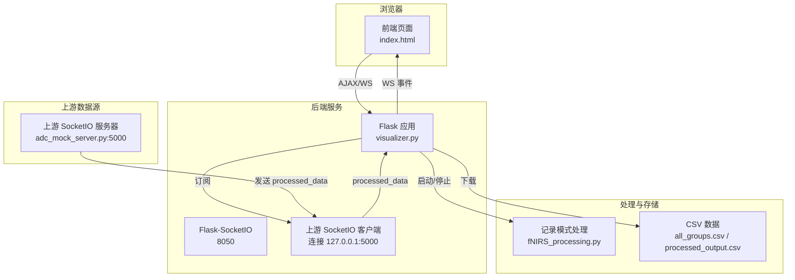
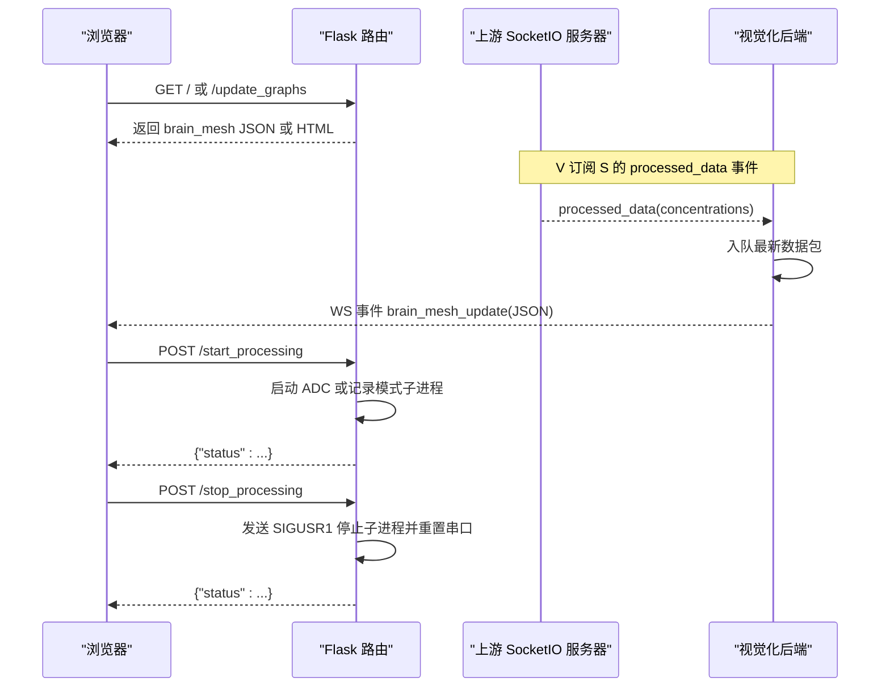
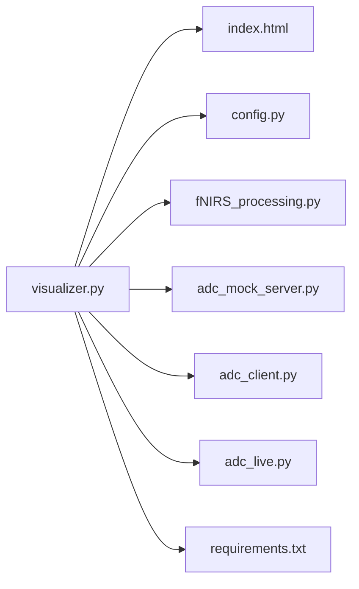

# HTTP REST API

<cite>
**本文引用的文件**
- [visualizer.py](file://software/visualizer.py)
- [index.html](file://software/index.html)
- [config.py](file://software/config.py)
- [requirements.txt](file://software/requirements.txt)
- [fNIRS_processing.py](file://software/fNIRS_processing.py)
- [adc_mock_server.py](file://software/adc_mock_server.py)
- [adc_client.py](file://software/adc_client.py)
- [adc_live.py](file://software/adc_live.py)
</cite>

## 目录
1. [简介](#简介)
2. [项目结构](#项目结构)
3. [核心组件](#核心组件)
4. [架构总览](#架构总览)
5. [详细组件分析](#详细组件分析)
6. [依赖关系分析](#依赖关系分析)
7. [性能考量](#性能考量)
8. [故障排查指南](#故障排查指南)
9. [结论](#结论)
10. [附录](#附录)

## 简介
本文件为 fNIRS 系统的 HTTP REST API 参考文档，覆盖基于 Flask 的 Web 服务端点，包括：
- 根路径：返回交互式可视化页面
- 图表更新：获取当前脑图数据
- 组选择：高亮特定传感器组
- 发射器状态更新：接收前端控制状态
- 控制数据更新：下发发射器与多路复用器控制字节
- 处理启动：启动 ADC 实时或记录流程
- 处理停止：停止后台处理并重置串口
- 文件下载：下载 ADC 或 mBLL 的 CSV 数据
- 静态图表查看：生成并返回 ADC/mBLL 的静态 HTML 图表
- 动画查看：启动 ADC/mBLL 动画脚本（无响应体）

本文件逐项说明各端点的 HTTP 方法、URL 模式、请求参数/体、响应数据结构、状态码、认证方式、错误处理策略，并提供客户端集成建议与最佳实践。

## 项目结构
- 后端服务：Flask + Flask-SocketIO，运行于端口 8050
- 前端页面：index.html 提供交互界面，通过 AJAX 调用后端 API
- 数据流：上游 SocketIO 服务器（端口 5000）推送处理后的浓度数据；后端将最新数据推送到前端 SocketIO 事件
- 处理链路：ADC 实时模式（本地串口或模拟）、记录模式（调用 fNIRS_processing.py 生成 CSV）

**图表来源**
- [visualizer.py](file://software/visualizer.py#L52-L58)
- [visualizer.py](file://software/visualizer.py#L925-L947)
- [adc_mock_server.py](file://software/adc_mock_server.py#L15-L65)
- [fNIRS_processing.py](file://software/fNIRS_processing.py#L1-L50)

**章节来源**
- [visualizer.py](file://software/visualizer.py#L52-L58)
- [visualizer.py](file://software/visualizer.py#L925-L947)
- [index.html](file://software/index.html#L468-L747)

## 核心组件
- Flask 应用与 SocketIO：提供 HTTP 路由与实时事件推送
- 上游 SocketIO 客户端：从本地 5000 端口订阅 processed_data 并入队
- 数据队列与锁：线程安全地缓存最新数据包，触发实时更新
- 控制数据：发射器与多路复用器控制字节，写入串口或模拟
- 处理子进程：启动/停止 ADC 实时或记录流程
- 静态资源：CSV 文件与静态 HTML 图表页面

**章节来源**
- [visualizer.py](file://software/visualizer.py#L52-L61)
- [visualizer.py](file://software/visualizer.py#L81-L104)
- [visualizer.py](file://software/visualizer.py#L374-L382)
- [visualizer.py](file://software/visualizer.py#L646-L711)

## 架构总览
后端采用“HTTP 路由 + SocketIO 实时推送”的混合架构：
- HTTP 路由用于配置、控制、数据下载与静态图表生成
- SocketIO 用于实时更新脑图与接收上游处理结果

**图表来源**
- [visualizer.py](file://software/visualizer.py#L591-L607)
- [visualizer.py](file://software/visualizer.py#L646-L711)
- [visualizer.py](file://software/visualizer.py#L925-L947)
- [adc_mock_server.py](file://software/adc_mock_server.py#L48-L65)

## 详细组件分析

### 根路径 '/'
- 方法：GET
- URL：/
- 请求参数：无
- 请求体：无
- 响应：HTML 页面（index.html）
- 状态码：200
- 说明：返回交互式可视化页面，包含 Plotly 图与控制面板

**章节来源**
- [visualizer.py](file://software/visualizer.py#L591-L597)
- [index.html](file://software/index.html#L1-L750)

### 图表更新 '/update_graphs'
- 方法：GET
- URL：/update_graphs
- 请求参数：无
- 请求体：无
- 响应：JSON 对象
  - 字段：brain_mesh（字符串，Plotly 图 JSON）
- 状态码：200
- 说明：返回当前脑图的最新 JSON 表示，前端可直接渲染

**章节来源**
- [visualizer.py](file://software/visualizer.py#L599-L607)

### 组选择 '/select_group/<int:group_id>'
- 方法：GET
- URL：/select_group/<group_id>
- 路径参数：group_id（整数，1-8）
- 请求参数：无
- 请求体：无
- 响应：JSON 对象
  - 字段：brain_mesh（字符串，Plotly 图 JSON）
- 状态码：200
- 说明：高亮指定传感器组（发射器与探测器），返回更新后的脑图

**章节来源**
- [visualizer.py](file://software/visualizer.py#L609-L616)

### 发射器状态更新 '/update_emitter_states'
- 方法：POST
- URL：/update_emitter_states
- 请求参数：无
- 请求体：JSON 对象
  - 字段：emitter_states（数组，长度 8，布尔值）
- 响应：JSON 对象
  - 字段：status（字符串："success"）
- 状态码：200
- 说明：更新全局发射器状态数组，前端据此更新颜色与 UI

**章节来源**
- [visualizer.py](file://software/visualizer.py#L618-L626)

### 控制数据更新 '/update_control_data'
- 方法：POST
- URL：/update_control_data
- 请求参数：无
- 请求体：JSON 对象
  - 字段：
    - emitter_control_override_enable（整数 0/1）
    - emitter_control_state（整数，枚举值）
    - emitter_pwm_control_h（整数，位掩码）
    - emitter_pwm_control_l（整数，位掩码）
    - mux_control_override_enable（整数 0/1）
    - mux_control_state（整数，枚举值）
- 响应：JSON 对象
  - 字段：status（字符串："success"）
- 状态码：200
- 说明：更新全局控制数据并写入串口（非演示模式）。枚举值与位掩码由前端生成。

**章节来源**
- [visualizer.py](file://software/visualizer.py#L628-L644)
- [index.html](file://software/index.html#L493-L549)

### 处理启动 '/start_processing'
- 方法：POST
- URL：/start_processing
- 请求参数：无
- 请求体：JSON 对象
  - 字段：
    - mode（字符串："live" 或 "record"）
    - sources（数组，仅 record 模式有效，元素为 "ADC"、"mBLL"）
- 响应：JSON 对象
  - 字段：status（字符串："ADC mode started" 或 "processing started" 或 "demo mode active, processing skipped"）
  - 错误时字段：status（"error"）、message（字符串）
- 状态码：200 或 400/500
- 说明：根据模式启动相应子进程；演示模式下 ADC 使用模拟服务器与客户端；记录模式下调用 fNIRS_processing.py

**章节来源**
- [visualizer.py](file://software/visualizer.py#L646-L687)
- [fNIRS_processing.py](file://software/fNIRS_processing.py#L1-L50)

### 处理停止 '/stop_processing'
- 方法：POST
- URL：/stop_processing
- 请求参数：无
- 请求体：无
- 响应：JSON 对象
  - 字段：status（字符串）
- 状态码：200
- 说明：向所有运行中的子进程发送 SIGUSR1 信号以优雅停止；随后重置串口连接

**章节来源**
- [visualizer.py](file://software/visualizer.py#L689-L711)

### 文件下载 '/download/<source>'
- 方法：GET
- URL：/download/<source>?filename=<自定义文件名>
- 路径参数：source（字符串："ADC" 或 "mBLL"）
- 查询参数：filename（字符串，可选，默认使用内置文件名）
- 请求体：无
- 响应：CSV 文件（二进制流）
- 状态码：200 或 400
- 说明：下载对应源的 CSV 文件；ADC 下载 all_groups.csv，mBLL 下载 processed_output.csv

**章节来源**
- [visualizer.py](file://software/visualizer.py#L714-L732)

### 静态图表查看 '/view_static/ADC'
- 方法：GET
- URL：/view_static/ADC
- 请求参数：无
- 请求体：无
- 响应：HTML 页面（包含多个 Plotly 图）
- 状态码：200
- 说明：加载 sample_data/all_groups.csv，按组生成静态折线图并返回 HTML

**章节来源**
- [visualizer.py](file://software/visualizer.py#L735-L806)

### 静态图表查看 '/view_static/mBLL'
- 方法：GET
- URL：/view_static/mBLL
- 请求参数：无
- 请求体：无
- 响应：HTML 页面（包含多个 Plotly 图）
- 状态码：200
- 说明：加载 sample_data/processed_output.csv，按组生成静态折线图并返回 HTML

**章节来源**
- [visualizer.py](file://software/visualizer.py#L808-L896)

### 动画查看 '/view_animation/ADC'
- 方法：GET
- URL：/view_animation/ADC
- 请求参数：无
- 请求体：无
- 响应：空响应体，状态码 204
- 说明：启动 ADC 动画脚本（可带演示模式参数）

**章节来源**
- [visualizer.py](file://software/visualizer.py#L899-L908)

### 动画查看 '/view_animation/mBLL'
- 方法：GET
- URL：/view_animation/mBLL
- 请求参数：无
- 请求体：无
- 响应：空响应体，状态码 204
- 说明：启动 mBLL 动画脚本（可带演示模式参数）

**章节来源**
- [visualizer.py](file://software/visualizer.py#L910-L920)

## 依赖关系分析

**图表来源**
- [visualizer.py](file://software/visualizer.py#L32-L32)
- [index.html](file://software/index.html#L1-L750)
- [config.py](file://software/config.py#L1-L13)
- [fNIRS_processing.py](file://software/fNIRS_processing.py#L1-L50)
- [adc_mock_server.py](file://software/adc_mock_server.py#L1-L65)
- [adc_client.py](file://software/adc_client.py#L1-L181)
- [adc_live.py](file://software/adc_live.py#L1-L200)
- [requirements.txt](file://software/requirements.txt#L1-L15)

**章节来源**
- [visualizer.py](file://software/visualizer.py#L32-L32)
- [requirements.txt](file://software/requirements.txt#L1-L15)

## 性能考量
- 数据队列容量：最多缓存 20 个数据包，避免内存膨胀
- 线程同步：使用锁保护队列访问，确保并发安全
- 实时更新：上游数据到达即触发图更新，减少延迟
- 进程管理：优雅停止子进程，避免资源泄漏
- 演示模式：ADC 模式使用模拟服务器与客户端，降低对真实设备的依赖

[本节为通用指导，不直接分析具体文件]

## 故障排查指南
- 串口相关错误
  - 症状：无法打开串口或写入失败
  - 排查：检查串口配置（端口、波特率、超时）与设备连接
  - 参考：串口初始化与重置逻辑
- 处理子进程异常
  - 症状：启动/停止失败或无响应
  - 排查：确认子进程已正确启动并监听 SIGUSR1；检查日志输出
- 上游 SocketIO 连接失败
  - 症状：无法接收 processed_data
  - 排查：确认上游服务器地址与端口；检查网络连通性
- 文件下载失败
  - 症状：下载 400 或空文件
  - 排查：确认 source 参数合法且 CSV 文件存在；检查文件名查询参数

**章节来源**
- [visualizer.py](file://software/visualizer.py#L562-L587)
- [visualizer.py](file://software/visualizer.py#L689-L711)
- [visualizer.py](file://software/visualizer.py#L925-L947)
- [visualizer.py](file://software/visualizer.py#L714-L732)

## 结论
该 API 以简洁的 HTTP 路由与 SocketIO 实时推送相结合，提供了完整的 fNIRS 数据可视化与控制能力。通过清晰的端点设计与错误处理策略，既满足演示场景也支持真实设备接入。建议客户端遵循统一的请求/响应格式与状态码约定，确保稳定集成。

[本节为总结性内容，不直接分析具体文件]

## 附录

### 认证与安全
- 当前实现未包含认证机制，建议在生产环境中引入：
  - Token 验证（如 JWT）
  - CORS 限制
  - HTTPS 传输
  - 请求速率限制

[本节为通用建议，不直接分析具体文件]

### 客户端集成指南与最佳实践
- 基本流程
  - 加载根路径页面，建立 SocketIO 连接以接收实时更新
  - 通过 AJAX 调用控制端点（如 /update_control_data、/start_processing、/stop_processing）
  - 使用 /download 下载 CSV，或访问 /view_static 查看静态图表
- 最佳实践
  - 在调用 /start_processing 前先调用 /update_control_data 以确保设备处于期望状态
  - 使用轮询或 SocketIO 事件结合，避免频繁重复请求
  - 对 /download 使用合适的文件名参数，便于用户保存
  - 在演示模式下，确保模拟服务器与客户端已启动

**章节来源**
- [index.html](file://software/index.html#L468-L747)
- [visualizer.py](file://software/visualizer.py#L628-L644)
- [visualizer.py](file://software/visualizer.py#L646-L711)
- [visualizer.py](file://software/visualizer.py#L714-L732)