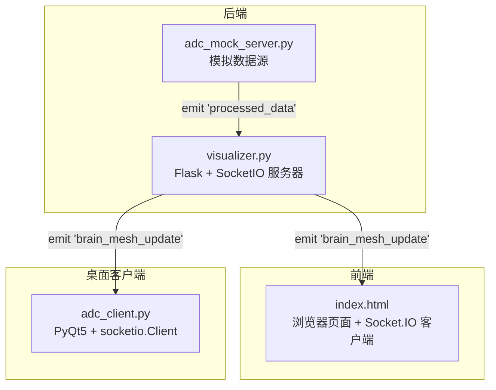
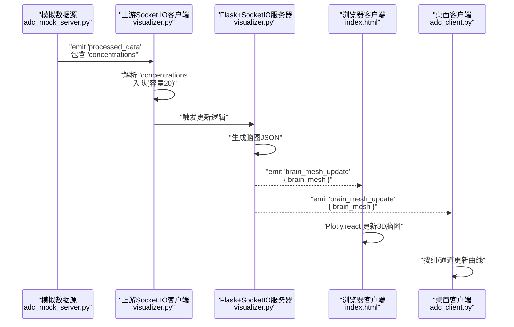
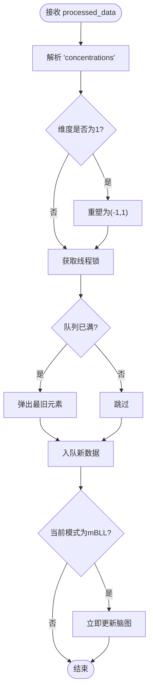
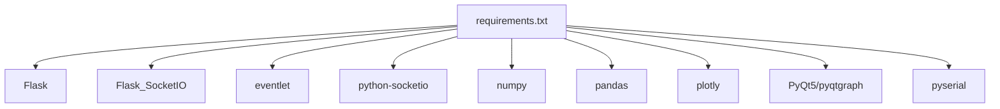

# WebSocket实时通信

<cite>
**本文引用的文件**
- [visualizer.py](file://software/visualizer.py)
- [adc_client.py](file://software/adc_client.py)
- [adc_mock_server.py](file://software/adc_mock_server.py)
- [index.html](file://software/index.html)
- [requirements.txt](file://software/requirements.txt)
- [config.py](file://software/config.py)
</cite>

## 目录
1. [简介](#简介)
2. [项目结构](#项目结构)
3. [核心组件](#核心组件)
4. [架构总览](#架构总览)
5. [详细组件分析](#详细组件分析)
6. [依赖关系分析](#依赖关系分析)
7. [性能考虑](#性能考虑)
8. [故障排除指南](#故障排除指南)
9. [结论](#结论)
10. [附录](#附录)

## 简介
本文件为fNIRS系统的WebSocket实时通信接口提供全面API文档，聚焦于Socket.IO连接建立与状态事件处理、实时数据推送机制（processed_data事件）、数据包格式与队列管理、客户端连接管理（连接建立、心跳检测、自动重连与错误处理）、消息格式示例、实时数据更新流程以及客户端集成代码示例与性能优化建议。文档基于仓库中的Python后端（Flask + Socket.IO）与前端（HTML + Socket.IO客户端）实现进行整理。

## 项目结构
本项目的实时通信涉及以下关键文件：
- 后端可视化服务：接收上游处理后的浓度数据，维护环形队列并向前端广播脑图更新事件
- 前端页面：通过Socket.IO订阅后端事件，渲染3D脑图
- 模拟数据源：向下游客户端推送传感器数组数据
- 客户端示例：演示如何在桌面应用中订阅processed_data事件并绘制曲线

图表来源
- [visualizer.py](file://software/visualizer.py#L52-L53)
- [adc_mock_server.py](file://software/adc_mock_server.py#L15-L16)
- [index.html](file://software/index.html#L333-L338)
- [adc_client.py](file://software/adc_client.py#L49-L78)

章节来源
- [visualizer.py](file://software/visualizer.py#L52-L53)
- [adc_mock_server.py](file://software/adc_mock_server.py#L15-L16)
- [index.html](file://software/index.html#L333-L338)
- [adc_client.py](file://software/adc_client.py#L49-L78)

## 核心组件
- 上游Socket.IO客户端（接收processed_data）
  - 在visualizer.py中创建并注册connect/disconnect事件处理器，监听上游服务器发送的processed_data事件
  - 将接收到的浓度数据放入线程安全的环形队列，最大容量20
- Flask + SocketIO服务器
  - 接收来自上游的processed_data，解析concentrations字段，更新3D脑图并广播brain_mesh_update事件
- 模拟数据源
  - 持续生成长度为24的传感器数组并通过processed_data事件推送到下游
- 前端Socket.IO客户端
  - 订阅brain_mesh_update事件，解析JSON并使用Plotly更新3D脑图
- 桌面客户端示例
  - 使用socketio.Client订阅processed_data事件，按组与通道组织数据并绘图

章节来源
- [visualizer.py](file://software/visualizer.py#L65-L95)
- [visualizer.py](file://software/visualizer.py#L541-L560)
- [adc_mock_server.py](file://software/adc_mock_server.py#L48-L60)
- [index.html](file://software/index.html#L333-L338)
- [adc_client.py](file://software/adc_client.py#L39-L85)

## 架构总览
下图展示从固件/处理模块到Web界面的完整数据流：

图表来源
- [adc_mock_server.py](file://software/adc_mock_server.py#L48-L60)
- [visualizer.py](file://software/visualizer.py#L81-L95)
- [visualizer.py](file://software/visualizer.py#L541-L560)
- [index.html](file://software/index.html#L333-L338)
- [adc_client.py](file://software/adc_client.py#L161-L171)

## 详细组件分析

### 上游Socket.IO客户端（接收processed_data）
- 连接建立与断开
  - 注册connect/disconnect事件处理器，记录日志
- 数据接收与队列管理
  - processed_data事件回调中解析concentrations字段
  - 使用线程锁保护环形队列，满载时丢弃最旧元素
  - 当处于mBLL模式时，立即调用更新函数
- 广播事件
  - 将最新脑图以JSON形式通过brain_mesh_update事件广播

图表来源
- [visualizer.py](file://software/visualizer.py#L81-L95)
- [visualizer.py](file://software/visualizer.py#L97-L104)
- [visualizer.py](file://software/visualizer.py#L94-L95)

章节来源
- [visualizer.py](file://software/visualizer.py#L67-L79)
- [visualizer.py](file://software/visualizer.py#L81-L95)
- [visualizer.py](file://software/visualizer.py#L97-L104)
- [visualizer.py](file://software/visualizer.py#L541-L560)

### Flask + SocketIO服务器（事件广播与路由）
- 事件广播
  - 处理最新数据后，通过socketio.emit广播brain_mesh_update事件
- 路由接口
  - 提供/update_graphs与/select_group/<int:group_id>等接口返回脑图JSON
- 控制面板
  - 支持POST /update_control_data接收控制数据并通过串口下发（非演示模式）

章节来源
- [visualizer.py](file://software/visualizer.py#L541-L560)
- [visualizer.py](file://software/visualizer.py#L599-L616)
- [visualizer.py](file://software/visualizer.py#L628-L644)

### 模拟数据源（向下游推送processed_data）
- 数据生成
  - 生成长度为24的三角波数组，周期性递增/递减
- 发送频率
  - 每次发送后sleep 0.0005秒，形成高频推送
- 事件推送
  - 通过socketio.emit('processed_data', {sensor_array})推送

章节来源
- [adc_mock_server.py](file://software/adc_mock_server.py#L30-L46)
- [adc_mock_server.py](file://software/adc_mock_server.py#L48-L60)

### 前端Socket.IO客户端（订阅brain_mesh_update）
- 订阅与更新
  - 创建io()实例，监听'brain_mesh_update'事件
  - 解析data.brain_mesh为JSON并使用Plotly.react更新容器
- 交互增强
  - 保存/恢复相机视角，响应布局变化

章节来源
- [index.html](file://software/index.html#L333-L338)
- [index.html](file://software/index.html#L592-L619)

### 桌面客户端示例（订阅processed_data）
- 连接与事件
  - 使用socketio.Client连接本地5000端口，注册connect/disconnect事件
  - 监听'processed_data'事件，提取sensor_array（应为长度24）
- 数据组织与绘图
  - 将24个值按8组×3通道组织，使用pyqtgraph更新曲线
- 刷新策略
  - 使用QTimer定时刷新，刷新间隔可调

章节来源
- [adc_client.py](file://software/adc_client.py#L47-L78)
- [adc_client.py](file://software/adc_client.py#L59-L65)
- [adc_client.py](file://software/adc_client.py#L161-L171)
- [adc_client.py](file://software/adc_client.py#L157-L159)

## 依赖关系分析
- Python运行时依赖
  - Flask、Flask_SocketIO、eventlet、python-socketio、numpy、pandas、plotly、PyQt5/pyqtgraph、pyserial等
- 版本约束
  - 使用requirements.txt统一管理依赖版本

图表来源
- [requirements.txt](file://software/requirements.txt#L1-L15)

章节来源
- [requirements.txt](file://software/requirements.txt#L1-L15)

## 性能考虑
- 队列容量与吞吐
  - 后端环形队列容量为20，满载时丢弃最旧数据，避免内存膨胀
- 推送频率与延迟
  - 模拟数据源以约0.0005秒间隔推送，确保高帧率实时显示
- 前端渲染
  - 使用Plotly.react增量更新，减少重绘成本；定时器刷新间隔可调
- 串口控制
  - 控制数据通过串口下发，需注意串口超时与缓冲区大小

章节来源
- [visualizer.py](file://software/visualizer.py#L58-L95)
- [adc_mock_server.py](file://software/adc_mock_server.py#L59-L60)
- [index.html](file://software/index.html#L607-L613)
- [config.py](file://software/config.py#L10-L12)

## 故障排除指南
- 连接问题
  - 确认上游Socket.IO客户端已正确注册connect/disconnect事件
  - 检查模拟数据源是否在运行且端口为5000
- 数据格式错误
  - processed_data事件必须包含concentrations字段；桌面客户端期望sensor_array字段
  - 若长度不为24或结构不符，客户端应打印错误信息并忽略该包
- 前端无更新
  - 检查浏览器控制台是否有'brain_mesh_update'事件监听与解析错误
  - 确保Plotly库已加载且容器ID正确
- 串口控制异常
  - 检查SERIAL_PORT、BAUD_RATE、TIMEOUT设置是否匹配硬件配置

章节来源
- [visualizer.py](file://software/visualizer.py#L67-L79)
- [adc_mock_server.py](file://software/adc_mock_server.py#L52-L60)
- [index.html](file://software/index.html#L333-L338)
- [config.py](file://software/config.py#L7-L12)

## 结论
本系统通过Flask+Socket.IO构建了从上游处理模块到Web与桌面客户端的实时数据通路。上游Socket.IO客户端负责接收processed_data并维护环形队列，后端服务器在收到新数据后生成3D脑图并通过brain_mesh_update事件广播给所有客户端。前端与桌面客户端分别以Plotly与pyqtgraph进行高效渲染。通过合理的队列容量、推送频率与前端增量更新策略，系统实现了低延迟的实时可视化体验。

## 附录

### API定义与消息格式

- processed_data事件（上游 -> 下游）
  - 字段
    - concentrations: 数组，长度为24（每组3通道 × 8组），数值类型为浮点数
  - 示例
    - { "concentrations": [ ... ] }

- brain_mesh_update事件（下游 -> 客户端）
  - 字段
    - brain_mesh: 字符串，包含Plotly图JSON
  - 示例
    - { "brain_mesh": "{\"data\":[...],\"layout\":{...}}" }

- processed_data事件（桌面客户端期望）
  - 字段
    - sensor_array: 数组，长度为24
  - 示例
    - { "sensor_array": [ ... ] }

章节来源
- [visualizer.py](file://software/visualizer.py#L81-L84)
- [visualizer.py](file://software/visualizer.py#L557-L559)
- [adc_client.py](file://software/adc_client.py#L59-L65)

### 客户端集成要点

- 浏览器端（index.html）
  - 引入Socket.IO客户端脚本
  - 创建io()实例并监听'brain_mesh_update'
  - 使用Plotly.react更新容器内容

- 桌面端（adc_client.py）
  - 使用socketio.Client连接本地5000端口
  - 注册connect/disconnect事件
  - 监听'processed_data'事件，按组/通道组织数据并更新曲线

章节来源
- [index.html](file://software/index.html#L304-L338)
- [adc_client.py](file://software/adc_client.py#L47-L78)
- [adc_client.py](file://software/adc_client.py#L161-L171)