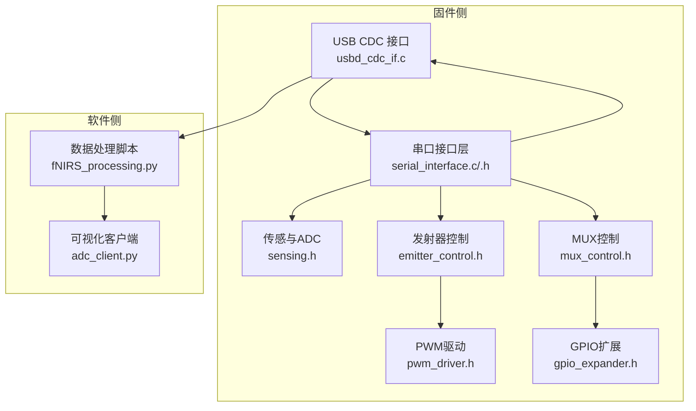
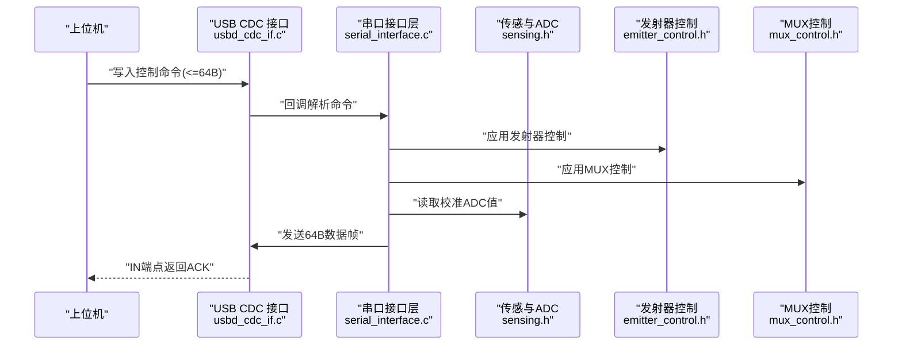
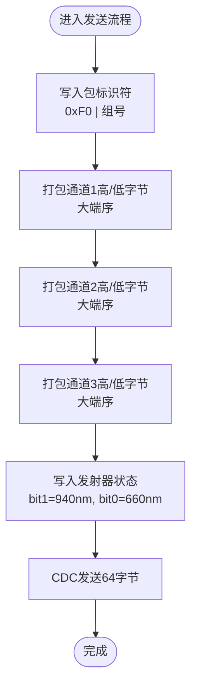
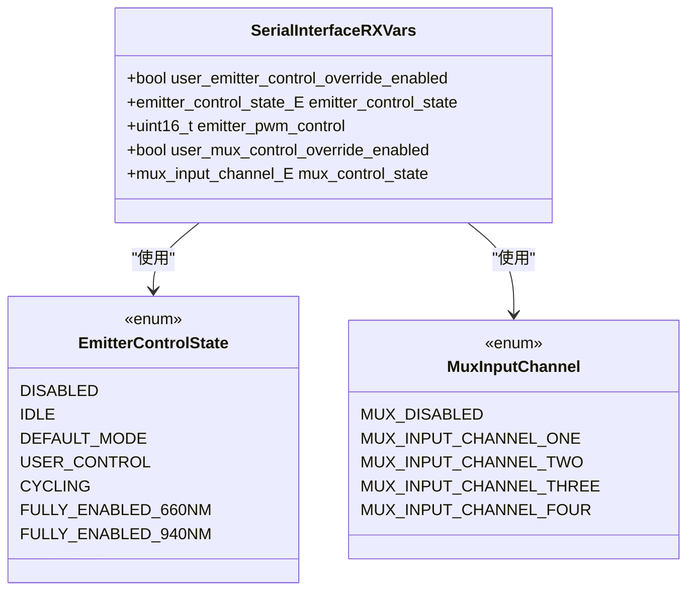
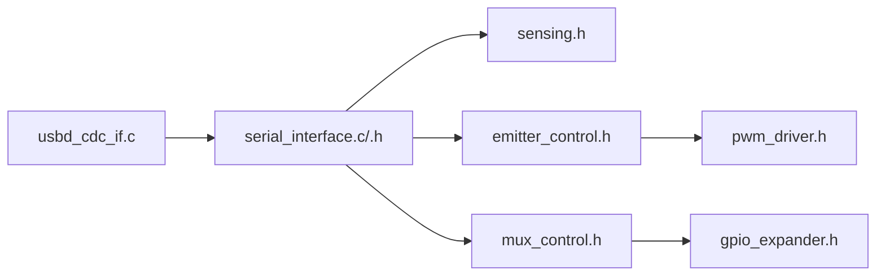

# 串口通信协议

<cite>
**本文引用的文件**   
- [serial_interface.h](file://firmware/STM32/fNIRS/Core/Inc/serial_interface.h)
- [serial_interface.c](file://firmware/STM32/fNIRS/Core/Src/serial_interface.c)
- [usbd_cdc_if.c](file://firmware/STM32/fNIRS/USB_DEVICE/App/usbd_cdc_if.c)
- [usbd_cdc.h](file://firmware/STM32/fNIRS/Middlewares/ST/STM32_USB_Device_Library/Class/CDC/Inc/usbd_cdc.h)
- [usbd_cdc.c](file://firmware/STM32/fNIRS/Middlewares/ST/STM32_USB_Device_Library/Class/CDC/Src/usbd_cdc.c)
- [emitter_control.h](file://firmware/STM32/fNIRS/Core/Inc/emitter_control.h)
- [mux_control.h](file://firmware/STM32/fNIRS/Core/Inc/mux_control.h)
- [sensing.h](file://firmware/STM32/fNIRS/Core/Inc/sensing.h)
- [pwm_driver.h](file://firmware/STM32/fNIRS/Core/Inc/pwm_driver.h)
- [gpio_expander.h](file://firmware/STM32/fNIRS/Core/Inc/gpio_expander.h)
- [fNIRS.ioc](file://firmware/STM32/fNIRS/fNIRS.ioc)
- [main.h](file://firmware/STM32/fNIRS/Core/Inc/main.h)
- [fNIRS_processing.py](file://software/fNIRS_processing.py)
- [adc_client.py](file://software/adc_client.py)
</cite>

## 目录
1. [简介](#简介)
2. [项目结构](#项目结构)
3. [核心组件](#核心组件)
4. [架构总览](#架构总览)
5. [详细组件分析](#详细组件分析)
6. [依赖关系分析](#依赖关系分析)
7. [性能考虑](#性能考虑)
8. [故障排查指南](#故障排查指南)
9. [结论](#结论)
10. [附录](#附录)

## 简介
本技术规范文档面向fNIRS系统的USB CDC串口通信协议，聚焦于以下目标：
- 数据包格式：64字节数据包结构、8个传感器组的组织方式、ADC值编码格式与数据类型定义
- 控制命令格式：发射器控制字节、MUX切换器状态、PWM控制参数、覆盖使能位
- 串口参数配置：波特率、超时、数据位与停止位等
- 协议版本兼容性：向后兼容性、版本标识与升级策略
- 完整数据包示例：不同模式下的数据格式与控制命令
- 错误处理机制：数据校验、重传机制与故障恢复
- 固件端与软件端实现细节对比、调试与测试方法

## 项目结构
本仓库包含固件（STM32）与软件（Python）两部分：
- 固件侧通过USB CDC设备类实现虚拟串口，负责采集ADC、控制发射器与MUX、打包发送数据帧
- 软件侧通过串口或SocketIO接收数据，解析并进行fNIRS信号处理

**图表来源**
- [usbd_cdc_if.c](file://firmware/STM32/fNIRS/USB_DEVICE/App/usbd_cdc_if.c#L138-L145)
- [serial_interface.c](file://firmware/STM32/fNIRS/Core/Src/serial_interface.c#L59-L81)
- [sensing.h](file://firmware/STM32/fNIRS/Core/Inc/sensing.h#L22-L44)
- [emitter_control.h](file://firmware/STM32/fNIRS/Core/Inc/emitter_control.h#L13-L38)
- [mux_control.h](file://firmware/STM32/fNIRS/Core/Inc/mux_control.h#L21-L40)
- [pwm_driver.h](file://firmware/STM32/fNIRS/Core/Inc/pwm_driver.h#L13-L62)
- [gpio_expander.h](file://firmware/STM32/fNIRS/Core/Inc/gpio_expander.h#L26-L35)
- [fNIRS_processing.py](file://software/fNIRS_processing.py#L160-L185)

**章节来源**
- [usbd_cdc_if.c](file://firmware/STM32/fNIRS/USB_DEVICE/App/usbd_cdc_if.c#L138-L145)
- [serial_interface.c](file://firmware/STM32/fNIRS/Core/Src/serial_interface.c#L59-L81)
- [fNIRS.ioc](file://firmware/STM32/fNIRS/fNIRS.ioc#L317-L324)

## 核心组件
- 串口接口层（serial_interface）
  - 负责解析上位机下发的控制命令、拼装传感器数据帧并通过CDC发送
  - 定义了RX/TX缓冲区索引与数据帧字段布局
- USB CDC接口（usbd_cdc_if）
  - 提供CDC初始化、接收回调、发送封装与传输完成回调
  - 暴露应用收发缓冲区，支持64字节Bulk数据包
- 发射器控制（emitter_control）
  - 定义发射器工作状态枚举、频率/占空比/相位更新接口
- MUX控制（mux_control）
  - 定义输入通道选择与覆盖使能逻辑
- 传感与ADC（sensing）
  - 定义8个传感器模块、ADC通道与温度传感器
- PWM驱动（pwm_driver）与GPIO扩展（gpio_expander）
  - 提供PWM设备配置、发射器开关与MUX控制底层接口

**章节来源**
- [serial_interface.h](file://firmware/STM32/fNIRS/Core/Inc/serial_interface.h#L12-L61)
- [serial_interface.c](file://firmware/STM32/fNIRS/Core/Src/serial_interface.c#L20-L81)
- [usbd_cdc_if.c](file://firmware/STM32/fNIRS/USB_DEVICE/App/usbd_cdc_if.c#L152-L297)
- [emitter_control.h](file://firmware/STM32/fNIRS/Core/Inc/emitter_control.h#L13-L48)
- [mux_control.h](file://firmware/STM32/fNIRS/Core/Inc/mux_control.h#L21-L49)
- [sensing.h](file://firmware/STM32/fNIRS/Core/Inc/sensing.h#L22-L61)
- [pwm_driver.h](file://firmware/STM32/fNIRS/Core/Inc/pwm_driver.h#L13-L73)
- [gpio_expander.h](file://firmware/STM32/fNIRS/Core/Inc/gpio_expander.h#L26-L46)

## 架构总览
USB CDC在设备端由STM32L4系列实现，使用FS模式，数据端点最大包为64字节。固件侧通过串口接口层将8组传感器数据打包为一个64字节帧，同时上报发射器状态；上位机侧通过串口或SocketIO接收并解析。

**图表来源**
- [usbd_cdc_if.c](file://firmware/STM32/fNIRS/USB_DEVICE/App/usbd_cdc_if.c#L261-L297)
- [serial_interface.c](file://firmware/STM32/fNIRS/Core/Src/serial_interface.c#L20-L81)
- [sensing.h](file://firmware/STM32/fNIRS/Core/Inc/sensing.h#L64-L68)
- [emitter_control.h](file://firmware/STM32/fNIRS/Core/Inc/emitter_control.h#L42-L48)
- [mux_control.h](file://firmware/STM32/fNIRS/Core/Inc/mux_control.h#L43-L49)

## 详细组件分析

### 数据包格式规范
- 帧长度与分组
  - 每个完整数据帧长度为64字节
  - 每个传感器组占用8字节，共8组，总计64字节
- 字段布局（每组8字节）
  - 字节0：包标识符（Packet Identifier）
    - 高4位固定为0xF，低4位为组号（0..7）
  - 字节1-2：通道1高/低字节（大端序）
  - 字节3-4：通道2高/低字节（大端序）
  - 字节5-6：通道3高/低字节（大端序）
  - 字节7：发射器状态（bit1=940nm，bit0=660nm）
- ADC值编码与数据类型
  - ADC原始值为12位（根据ADC配置），经校准后存储为16位无符号整型
  - 通道值按大端序拆分为高/低各1字节
- 组织方式
  - 按组顺序排列，组号从0到7依次填充
- 示例（概念性）
  - 假设组0通道值分别为A、B、C，则对应字节对为(A>>8)&0xFF, A&0xFF, (B>>8)&0xFF, B&0xFF, (C>>8)&0xFF, C&0xFF
  - 发射器状态字节为0b0000_0001表示仅660nm开启，0b0000_0010表示仅940nm开启，0b0000_0011表示两者均开

**图表来源**
- [serial_interface.c](file://firmware/STM32/fNIRS/Core/Src/serial_interface.c#L59-L81)

**章节来源**
- [serial_interface.c](file://firmware/STM32/fNIRS/Core/Src/serial_interface.c#L59-L81)
- [sensing.h](file://firmware/STM32/fNIRS/Core/Inc/sensing.h#L46-L61)

### 控制命令格式规范
- RX缓冲区索引（64字节）
  - 索引0：发射器覆盖使能（布尔）
  - 索引1：发射器控制状态（枚举）
  - 索引2-3：发射器PWM控制（16位，大端序）
  - 索引4：MUX覆盖使能（布尔）
  - 索引5：MUX输入通道（枚举）
  - 其余字节保留或未使用
- 解析与应用
  - 解析后写入用户变量，随后在状态机中生效
  - PWM控制位映射到具体PWM通道，发射器状态决定波形与占空比
- 参数映射
  - 每个传感器模块映射到两个PWM通道（660nm与940nm）
  - 通道映射公式：模块×2，偶数位对应660nm，奇数位对应940nm

**图表来源**
- [serial_interface.h](file://firmware/STM32/fNIRS/Core/Inc/serial_interface.h#L40-L51)
- [emitter_control.h](file://firmware/STM32/fNIRS/Core/Inc/emitter_control.h#L13-L24)
- [mux_control.h](file://firmware/STM32/fNIRS/Core/Inc/mux_control.h#L21-L30)

**章节来源**
- [serial_interface.h](file://firmware/STM32/fNIRS/Core/Inc/serial_interface.h#L12-L24)
- [serial_interface.c](file://firmware/STM32/fNIRS/Core/Src/serial_interface.c#L20-L32)
- [serial_interface.c](file://firmware/STM32/fNIRS/Core/Src/serial_interface.c#L9-L12)

### 串口参数配置
- USB CDC端点参数
  - 数据端点最大包大小：64字节（FS）
  - 控制端点大小：8字节
- 线编码（Line Coding）字段（CDC SET_LINE_CODING）
  - 位移：0~3为比特率（bDataBits为16位时单位为bps）
  - 位移：4为停止位格式（0=1, 1=1.5, 2=2）
  - 位移：5为奇偶校验（0=无，1=奇，2=偶，3=Mark，4=Space）
  - 位移：6为数据位（5,6,7,8或16）
- 实际配置建议
  - 数据位：16位（与线编码一致）
  - 停止位：1位
  - 校验：无
  - 比特率：依据系统时钟与定时器配置，确保采样率稳定
- 设备引脚与外设
  - USB OTG引脚：PA11/PA12
  - 外设：ADC1、I2C1/I2C2、TIM3/TIM4、SPI1、USART1

**章节来源**
- [usbd_cdc.h](file://firmware/STM32/fNIRS/Middlewares/ST/STM32_USB_Device_Library/Class/CDC/Inc/usbd_cdc.h#L62-L105)
- [usbd_cdc.c](file://firmware/STM32/fNIRS/Middlewares/ST/STM32_USB_Device_Library/Class/CDC/Src/usbd_cdc.c#L248-L265)
- [fNIRS.ioc](file://firmware/STM32/fNIRS/fNIRS.ioc#L139-L142)
- [fNIRS.ioc](file://firmware/STM32/fNIRS/fNIRS.ioc#L317-L324)

### 协议版本兼容性
- 版本标识
  - 当前实现未显式声明协议版本号
- 向后兼容性
  - 保持64字节帧长度与字段布局不变
  - 控制命令字段顺序与长度保持稳定
- 升级策略
  - 新增字段建议采用“高位保留+低位扩展”的方式
  - 通过线编码中的数据位字段（16位）承载扩展信息，避免破坏现有解析

**章节来源**
- [usbd_cdc.h](file://firmware/STM32/fNIRS/Middlewares/ST/STM32_USB_Device_Library/Class/CDC/Inc/usbd_cdc.h#L100-L105)
- [serial_interface.c](file://firmware/STM32/fNIRS/Core/Src/serial_interface.c#L59-L81)

### 数据包示例
- 概念示例（非代码片段）
  - 帧头：0xF0, 0xF1, ..., 0xF7（组号0..7）
  - 每组通道值：通道1高/低、通道2高/低、通道3高/低
  - 发射器状态：bit1=940nm，bit0=660nm
- 上位机解析（概念示例）
  - 将64字节按8字节分组，每组解析出通道值与发射器状态
  - 对通道值执行反相映射（零电平2050）以还原原始计数值

**章节来源**
- [serial_interface.c](file://firmware/STM32/fNIRS/Core/Src/serial_interface.c#L70-L77)
- [fNIRS_processing.py](file://software/fNIRS_processing.py#L160-L185)

### 错误处理机制
- 数据校验
  - 帧长固定为64字节，上位机应丢弃长度不匹配的数据
  - 反相映射用于检测异常值（超出合理范围时回退至零电平）
- 重传机制
  - CDC层未实现显式的请求重传；可通过上位机轮询或超时重读解决
- 故障恢复
  - 发送失败（USBD_BUSY）时，上位机应等待并重试
  - 接收端可设置超时，超时则清空缓冲并重新同步

**章节来源**
- [usbd_cdc_if.c](file://firmware/STM32/fNIRS/USB_DEVICE/App/usbd_cdc_if.c#L285-L297)
- [fNIRS_processing.py](file://software/fNIRS_processing.py#L51-L66)

### 固件端与软件端实现对比
- 固件端
  - 使用枚举与结构体管理状态，通过状态机更新PWM与MUX
  - 通过CDC发送固定长度帧，不包含校验和
- 软件端
  - 通过串口读取64字节并解析为8×5矩阵（组号、通道1/2/3、发射器状态）
  - 提供阈值滤波、带通滤波与MBLL处理流程

**章节来源**
- [serial_interface.c](file://firmware/STM32/fNIRS/Core/Src/serial_interface.c#L59-L81)
- [fNIRS_processing.py](file://software/fNIRS_processing.py#L160-L185)

### 调试与测试方法
- 固件侧
  - 使用HAL库CDC回调确认接收与发送状态
  - 通过调试输出观察发射器状态与MUX通道变化
- 软件侧
  - 使用串口工具验证帧长与字段顺序
  - 使用可视化脚本观察8组通道曲线
  - 使用模拟服务器生成稳定数据流进行联调

**章节来源**
- [usbd_cdc_if.c](file://firmware/STM32/fNIRS/USB_DEVICE/App/usbd_cdc_if.c#L261-L272)
- [adc_client.py](file://software/adc_client.py#L144-L176)

## 依赖关系分析
- 组件耦合
  - 串口接口层依赖传感、发射器与MUX模块
  - CDC接口层独立于业务逻辑，仅负责数据搬运
- 外部依赖
  - USB CDC中间件提供端点参数与控制命令处理
  - HAL库提供ADC、I2C、TIM等外设抽象

**图表来源**
- [usbd_cdc_if.c](file://firmware/STM32/fNIRS/USB_DEVICE/App/usbd_cdc_if.c#L138-L145)
- [serial_interface.c](file://firmware/STM32/fNIRS/Core/Src/serial_interface.c#L4-L6)
- [sensing.h](file://firmware/STM32/fNIRS/Core/Inc/sensing.h#L6-L7)
- [emitter_control.h](file://firmware/STM32/fNIRS/Core/Inc/emitter_control.h#L6-L7)
- [mux_control.h](file://firmware/STM32/fNIRS/Core/Inc/mux_control.h#L6-L8)
- [pwm_driver.h](file://firmware/STM32/fNIRS/Core/Inc/pwm_driver.h#L6-L7)
- [gpio_expander.h](file://firmware/STM32/fNIRS/Core/Inc/gpio_expander.h#L6-L6)

**章节来源**
- [serial_interface.c](file://firmware/STM32/fNIRS/Core/Src/serial_interface.c#L4-L6)
- [usbd_cdc_if.c](file://firmware/STM32/fNIRS/USB_DEVICE/App/usbd_cdc_if.c#L138-L145)

## 性能考虑
- 采样与时序
  - ADC通过DMA循环采集，定时器触发保证采样一致性
  - TIM3/TIM4配置用于触发ADC与MUX序列器
- 传输效率
  - 64字节Bulk包减少中断开销，适合高频数据流
  - 发射器状态仅1字节，不影响帧结构
- 功耗与稳定性
  - PWM驱动支持睡眠模式，可在空闲时降低功耗
  - I2C快速模式（Fast Mode）提升控制链路响应速度

**章节来源**
- [fNIRS.ioc](file://firmware/STM32/fNIRS/fNIRS.ioc#L307-L315)
- [pwm_driver.h](file://firmware/STM32/fNIRS/Core/Inc/pwm_driver.h#L69-L73)

## 故障排查指南
- 无法接收完整帧
  - 检查CDC发送状态是否返回USBD_BUSY
  - 确认上位机串口缓冲区足够且未溢出
- 数据异常
  - 核对线编码参数（数据位、停止位、校验）
  - 使用阈值滤波与反相映射定位异常通道
- 控制命令无效
  - 确认RX缓冲区字段顺序与长度正确
  - 检查发射器状态机与MUX覆盖使能逻辑

**章节来源**
- [usbd_cdc_if.c](file://firmware/STM32/fNIRS/USB_DEVICE/App/usbd_cdc_if.c#L285-L297)
- [fNIRS_processing.py](file://software/fNIRS_processing.py#L51-L66)
- [serial_interface.c](file://firmware/STM32/fNIRS/Core/Src/serial_interface.c#L20-L32)

## 结论
本协议以64字节固定帧为核心，清晰地组织8组传感器数据与发射器状态，结合USB CDC的可靠传输，满足fNIRS实时采集需求。通过线编码扩展与严格的字段布局，协议具备良好的向后兼容性与可维护性。建议在后续版本中引入显式版本号与校验和，进一步增强鲁棒性。

## 附录
- 关键宏与常量
  - 传感器模块到PWM通道映射：模块×2（偶数位=660nm，奇数位=940nm）
  - TX缓冲区索引计算：模块×每组字节数+字节偏移
- 相关文件路径
  - 固件：Core/Inc/serial_interface.h, Core/Src/serial_interface.c
  - USB CDC：USB_DEVICE/App/usbd_cdc_if.c, Middlewares/.../usbd_cdc.h/.c
  - 传感与控制：Core/Inc/sensing.h, emitter_control.h, mux_control.h, pwm_driver.h, gpio_expander.h
  - 软件：software/fNIRS_processing.py, software/adc_client.py