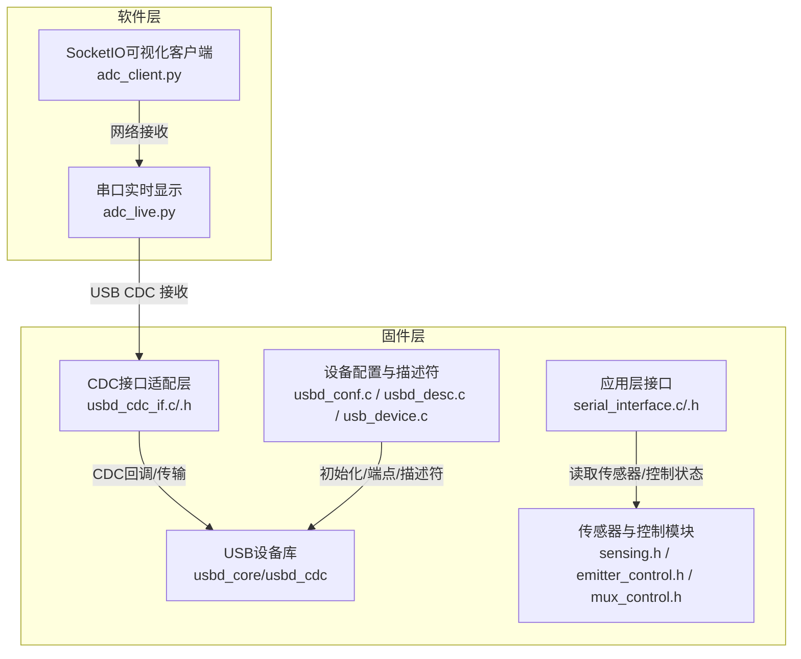
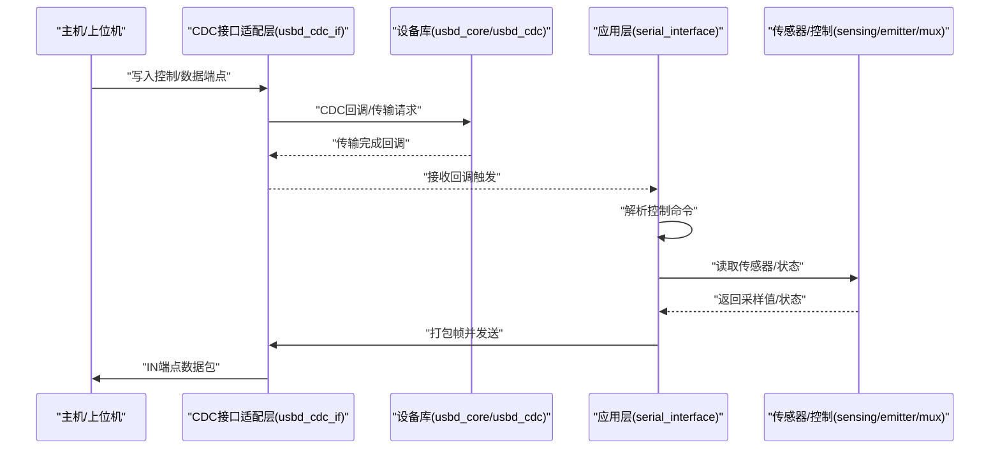
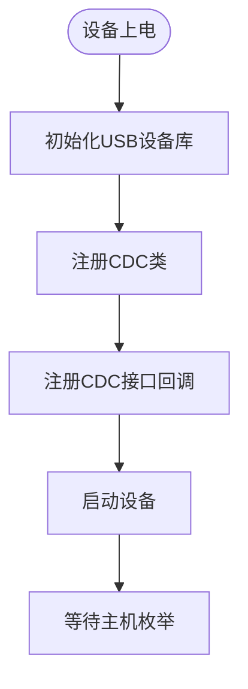
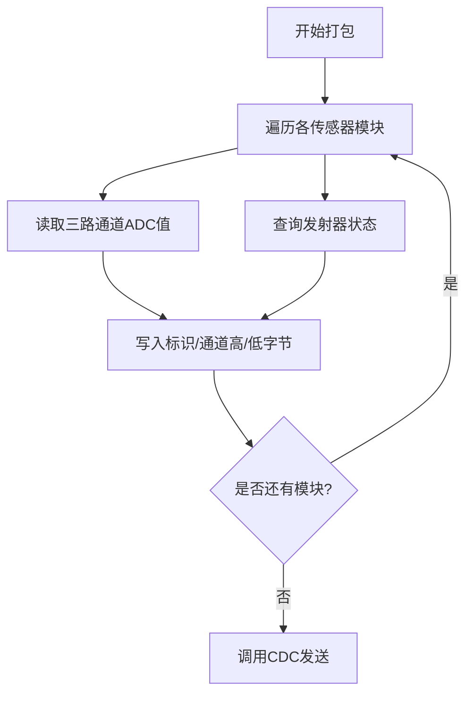
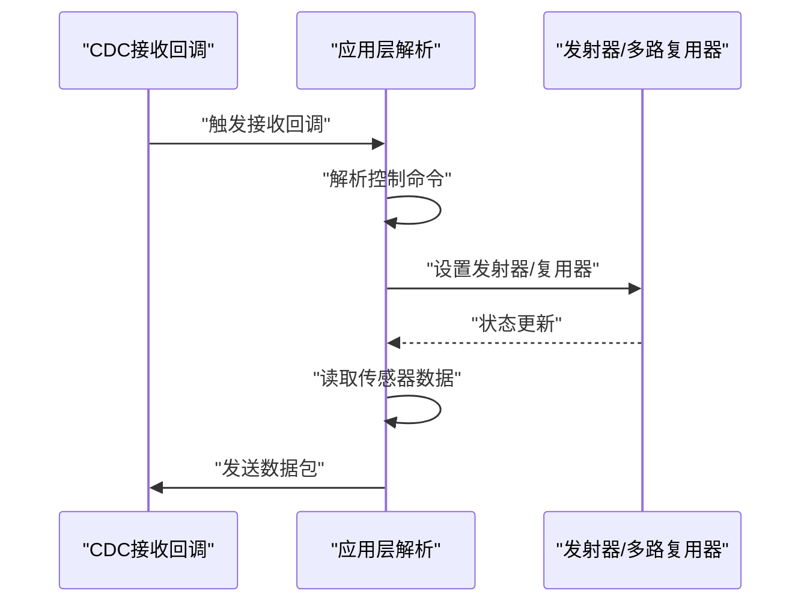
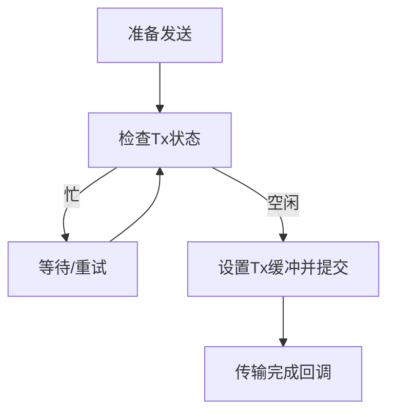
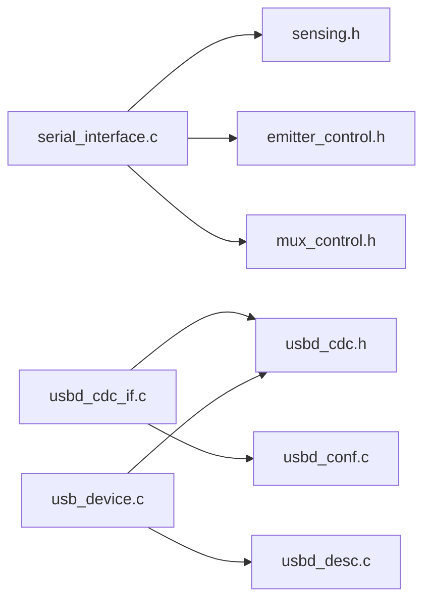

# 串口通信协议

<cite>
**本文引用的文件**
- [serial_interface.h](file://firmware/STM32/fNIRS/Core/Inc/serial_interface.h)
- [serial_interface.c](file://firmware/STM32/fNIRS/Core/Src/serial_interface.c)
- [usbd_cdc_if.c](file://firmware/STM32/fNIRS/USB_DEVICE/App/usbd_cdc_if.c)
- [usbd_cdc_if.h](file://firmware/STM32/fNIRS/USB_DEVICE/App/usbd_cdc_if.h)
- [usbd_cdc.h](file://firmware/STM32/fNIRS/Middlewares/ST/STM32_USB_Device_Library/Class/CDC/Inc/usbd_cdc.h)
- [usbd_conf.c](file://firmware/STM32/fNIRS/USB_DEVICE/Target/usbd_conf.c)
- [usbd_desc.c](file://firmware/STM32/fNIRS/USB_DEVICE/App/usbd_desc.c)
- [usb_device.c](file://firmware/STM32/fNIRS/USB_DEVICE/App/usb_device.c)
- [sensing.h](file://firmware/STM32/fNIRS/Core/Inc/sensing.h)
- [emitter_control.h](file://firmware/STM32/fNIRS/Core/Inc/emitter_control.h)
- [mux_control.h](file://firmware/STM32/fNIRS/Core/Inc/mux_control.h)
- [adc_live.py](file://software/adc_live.py)
- [adc_client.py](file://software/adc_client.py)
</cite>

## 目录
1. [简介](#简介)
2. [项目结构](#项目结构)
3. [核心组件](#核心组件)
4. [架构总览](#架构总览)
5. [详细组件分析](#详细组件分析)
6. [依赖关系分析](#依赖关系分析)
7. [性能考量](#性能考量)
8. [故障排查指南](#故障排查指南)
9. [结论](#结论)
10. [附录](#附录)

## 简介
本技术文档围绕 fNIRS 设备的 USB CDC 串口通信协议展开，覆盖从设备描述符与端点配置到数据包格式、命令解析与响应生成、实时数据传输与缓冲管理、以及安全性、错误处理与重传机制。同时提供协议调试工具使用与常见问题诊断方法，帮助开发者快速理解并高效集成该通信栈。

## 项目结构
该仓库采用分层组织：固件层（STM32 芯片侧）与软件层（上位机侧）。固件层基于 STM32CubeMX 生成的工程，使用 ST 官方 USB Device Library 的 CDC 类实现虚拟串口；软件层提供 Python 实时可视化与数据采集脚本。

图表来源
- [usbd_cdc_if.c](file://firmware/STM32/fNIRS/USB_DEVICE/App/usbd_cdc_if.c#L138-L145)
- [serial_interface.c](file://firmware/STM32/fNIRS/Core/Src/serial_interface.c#L59-L81)
- [usbd_conf.c](file://firmware/STM32/fNIRS/USB_DEVICE/Target/usbd_conf.c#L350-L394)
- [usbd_desc.c](file://firmware/STM32/fNIRS/USB_DEVICE/App/usbd_desc.c#L154-L181)
- [usb_device.c](file://firmware/STM32/fNIRS/USB_DEVICE/App/usb_device.c#L65-L91)
- [adc_live.py](file://software/adc_live.py#L18-L210)
- [adc_client.py](file://software/adc_client.py#L1-L181)

章节来源
- [usbd_cdc_if.c](file://firmware/STM32/fNIRS/USB_DEVICE/App/usbd_cdc_if.c#L1-L333)
- [serial_interface.c](file://firmware/STM32/fNIRS/Core/Src/serial_interface.c#L1-L82)
- [usbd_conf.c](file://firmware/STM32/fNIRS/USB_DEVICE/Target/usbd_conf.c#L1-L872)
- [usbd_desc.c](file://firmware/STM32/fNIRS/USB_DEVICE/App/usbd_desc.c#L1-L446)
- [usb_device.c](file://firmware/STM32/fNIRS/USB_DEVICE/App/usb_device.c#L1-L101)
- [adc_live.py](file://software/adc_live.py#L1-L210)
- [adc_client.py](file://software/adc_client.py#L1-L181)

## 核心组件
- USB CDC 接口适配层：负责 CDC 初始化、接收回调、发送状态检查与完成回调。
- 应用层串口接口：解析上位机下发的控制命令，封装传感器数据为固定长度帧并发送。
- 传感器与控制模块：提供传感器通道值、温度、发射器状态等数据读取与控制接口。
- 设备描述符与配置：定义设备类、端点、字符串描述符及初始化流程。

章节来源
- [usbd_cdc_if.h](file://firmware/STM32/fNIRS/USB_DEVICE/App/usbd_cdc_if.h#L50-L53)
- [serial_interface.h](file://firmware/STM32/fNIRS/Core/Inc/serial_interface.h#L12-L62)
- [sensing.h](file://firmware/STM32/fNIRS/Core/Inc/sensing.h#L13-L71)
- [emitter_control.h](file://firmware/STM32/fNIRS/Core/Inc/emitter_control.h#L13-L54)
- [mux_control.h](file://firmware/STM32/fNIRS/Core/Inc/mux_control.h#L13-L56)

## 架构总览
下图展示从主机到设备再到传感器数据链路的整体交互：

图表来源
- [usbd_cdc_if.c](file://firmware/STM32/fNIRS/USB_DEVICE/App/usbd_cdc_if.c#L261-L272)
- [usbd_cdc_if.c](file://firmware/STM32/fNIRS/USB_DEVICE/App/usbd_cdc_if.c#L285-L297)
- [serial_interface.c](file://firmware/STM32/fNIRS/Core/Src/serial_interface.c#L20-L32)
- [serial_interface.c](file://firmware/STM32/fNIRS/Core/Src/serial_interface.c#L59-L81)

## 详细组件分析

### USB CDC 设备配置与初始化
- 描述符与字符串：设备描述符、语言ID、厂商/产品/序列号字符串、配置与接口字符串由描述符文件生成。
- 端点与速度：全速（FS）端点配置，数据端点最大包大小为 64 字节，命令端点为 8 字节。
- 设备初始化：通过设备库初始化函数注册 CDC 类与接口，启动设备。
- BSP 层：USB OTG FS 引脚、电源、中断与 FIFO 配置在目标板支持文件中完成。

图表来源
- [usb_device.c](file://firmware/STM32/fNIRS/USB_DEVICE/App/usb_device.c#L65-L91)
- [usbd_conf.c](file://firmware/STM32/fNIRS/USB_DEVICE/Target/usbd_conf.c#L350-L394)
- [usbd_desc.c](file://firmware/STM32/fNIRS/USB_DEVICE/App/usbd_desc.c#L154-L181)

章节来源
- [usbd_desc.c](file://firmware/STM32/fNIRS/USB_DEVICE/App/usbd_desc.c#L65-L72)
- [usbd_cdc.h](file://firmware/STM32/fNIRS/Middlewares/ST/STM32_USB_Device_Library/Class/CDC/Inc/usbd_cdc.h#L43-L74)
- [usb_device.c](file://firmware/STM32/fNIRS/USB_DEVICE/App/usb_device.c#L65-L91)
- [usbd_conf.c](file://firmware/STM32/fNIRS/USB_DEVICE/Target/usbd_conf.c#L350-L394)

### 数据包格式设计
- 帧结构：每传感器模块占用固定字节数，包含标识、三路通道值与发射器状态。
- 帧头与索引：使用宏计算每个模块在缓冲中的起始偏移，确保紧凑布局。
- 发射器状态：以一位表示 940nm 与 660nm 通道状态。
- 包大小：根据模块数量与每模块字节数确定整包长度，便于一次性发送。

图表来源
- [serial_interface.c](file://firmware/STM32/fNIRS/Core/Src/serial_interface.c#L59-L81)
- [serial_interface.h](file://firmware/STM32/fNIRS/Core/Inc/serial_interface.h#L26-L38)

章节来源
- [serial_interface.h](file://firmware/STM32/fNIRS/Core/Inc/serial_interface.h#L26-L38)
- [serial_interface.c](file://firmware/STM32/fNIRS/Core/Src/serial_interface.c#L9-L12)
- [serial_interface.c](file://firmware/STM32/fNIRS/Core/Src/serial_interface.c#L59-L81)

### 串口通信接口实现
- 接收处理：CDC 接收回调将数据拷贝至全局接收缓冲，供应用层解析。
- 命令解析：应用层按预定义索引解析控制命令，更新发射器与多路复用器状态。
- 响应生成：应用层从传感器模块读取校准后的 ADC 值与状态，打包后发送。

图表来源
- [usbd_cdc_if.c](file://firmware/STM32/fNIRS/USB_DEVICE/App/usbd_cdc_if.c#L261-L272)
- [serial_interface.c](file://firmware/STM32/fNIRS/Core/Src/serial_interface.c#L20-L32)
- [serial_interface.c](file://firmware/STM32/fNIRS/Core/Src/serial_interface.c#L59-L81)

章节来源
- [usbd_cdc_if.c](file://firmware/STM32/fNIRS/USB_DEVICE/App/usbd_cdc_if.c#L261-L272)
- [serial_interface.c](file://firmware/STM32/fNIRS/Core/Src/serial_interface.c#L20-L32)

### 实时数据传输与缓冲管理
- 缓冲区大小：CDC 应用层缓冲区大小定义为 2048 字节，满足高频数据传输需求。
- 发送状态检查：发送前检查 CDC Tx 状态，避免覆盖未完成传输。
- 上位机接收：Python 实时脚本以固定包长（64 字节）解析并绘制数据。

图表来源
- [usbd_cdc_if.h](file://firmware/STM32/fNIRS/USB_DEVICE/App/usbd_cdc_if.h#L50-L53)
- [usbd_cdc_if.c](file://firmware/STM32/fNIRS/USB_DEVICE/App/usbd_cdc_if.c#L285-L297)
- [adc_live.py](file://software/adc_live.py#L16-L210)

章节来源
- [usbd_cdc_if.h](file://firmware/STM32/fNIRS/USB_DEVICE/App/usbd_cdc_if.h#L50-L53)
- [usbd_cdc_if.c](file://firmware/STM32/fNIRS/USB_DEVICE/App/usbd_cdc_if.c#L285-L297)
- [adc_live.py](file://software/adc_live.py#L16-L210)

### 错误处理与重传机制
- 发送忙状态：若 CDC Tx 状态非空闲，返回忙状态，上位机可稍后重试。
- 接收完整性：接收回调清零并复制数据，避免脏数据影响后续解析。
- 建议：可在应用层引入超时与计数器，实现简单重传策略（概念性建议，不对应具体代码）。

章节来源
- [usbd_cdc_if.c](file://firmware/STM32/fNIRS/USB_DEVICE/App/usbd_cdc_if.c#L285-L297)
- [usbd_cdc_if.c](file://firmware/STM32/fNIRS/USB_DEVICE/App/usbd_cdc_if.c#L261-L272)

### 协议安全性考虑
- 当前实现未包含加密或认证机制，属于明文串行通信。
- 建议：在上层增加校验和或 CRC，或在更高层引入 TLS/DTLS（概念性建议，不对应具体代码）。

## 依赖关系分析
- 应用层依赖传感器与控制模块接口，以获取数据与状态。
- CDC 接口适配层依赖设备库与 HAL 层，负责端点收发与状态管理。
- 设备库依赖目标板支持文件进行硬件初始化与中断处理。

图表来源
- [serial_interface.c](file://firmware/STM32/fNIRS/Core/Src/serial_interface.c#L1-L8)
- [usbd_cdc_if.c](file://firmware/STM32/fNIRS/USB_DEVICE/App/usbd_cdc_if.c#L22-L27)
- [usbd_conf.c](file://firmware/STM32/fNIRS/USB_DEVICE/Target/usbd_conf.c#L21-L27)
- [usb_device.c](file://firmware/STM32/fNIRS/USB_DEVICE/App/usb_device.c#L22-L28)
- [usbd_desc.c](file://firmware/STM32/fNIRS/USB_DEVICE/App/usbd_desc.c#L22-L25)

章节来源
- [serial_interface.c](file://firmware/STM32/fNIRS/Core/Src/serial_interface.c#L1-L8)
- [usbd_cdc_if.c](file://firmware/STM32/fNIRS/USB_DEVICE/App/usbd_cdc_if.c#L22-L27)
- [usbd_conf.c](file://firmware/STM32/fNIRS/USB_DEVICE/Target/usbd_conf.c#L21-L27)
- [usb_device.c](file://firmware/STM32/fNIRS/USB_DEVICE/App/usb_device.c#L22-L28)
- [usbd_desc.c](file://firmware/STM32/fNIRS/USB_DEVICE/App/usbd_desc.c#L22-L25)

## 性能考量
- 包大小与带宽：全速端点包大小为 64 字节，适合高频小包传输；应用层缓冲区为 2048 字节，可减少中断频率。
- DMA 与轮询：传感器数据读取路径需关注 DMA 与轮询策略，避免阻塞 USB 传输。
- 上位机渲染：Python 实时绘图存在 CPU 开销，建议在大数据量场景下降低刷新频率或采用更高效的可视化方案。

## 故障排查指南
- 无法枚举/连接不稳定：检查设备描述符与端点配置，确认目标板 USB 引脚与电源设置正确。
- 数据粘包/丢包：确认上位机按固定包长解析，应用层发送前检查 Tx 状态。
- 无数据输出：核对应用层是否正确解析控制命令并触发传感器读取与打包发送。
- 速率异常：评估包大小与刷新频率，必要时调整采样间隔或包合并策略。

章节来源
- [usbd_desc.c](file://firmware/STM32/fNIRS/USB_DEVICE/App/usbd_desc.c#L154-L181)
- [usbd_conf.c](file://firmware/STM32/fNIRS/USB_DEVICE/Target/usbd_conf.c#L350-L394)
- [usbd_cdc_if.c](file://firmware/STM32/fNIRS/USB_DEVICE/App/usbd_cdc_if.c#L285-L297)
- [adc_live.py](file://software/adc_live.py#L16-L210)

## 结论
该 fNIRS 串口通信协议以 USB CDC 为基础，结合应用层的数据打包与控制解析，实现了稳定的实时数据传输。通过明确的帧格式、缓冲区管理与状态检查，系统具备良好的可维护性与扩展性。建议在未来版本中引入数据校验与安全机制，以进一步提升可靠性与安全性。

## 附录
- 上位机脚本使用说明
  - 实时串口显示：运行 Python 脚本，配置串口号与波特率，脚本按固定包长解析并绘制 8 组通道数据。
  - SocketIO 可视化：运行客户端脚本，连接本地服务端，接收处理后的数据并可视化。

章节来源
- [adc_live.py](file://software/adc_live.py#L18-L210)
- [adc_client.py](file://software/adc_client.py#L1-L181)