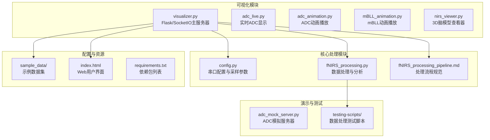
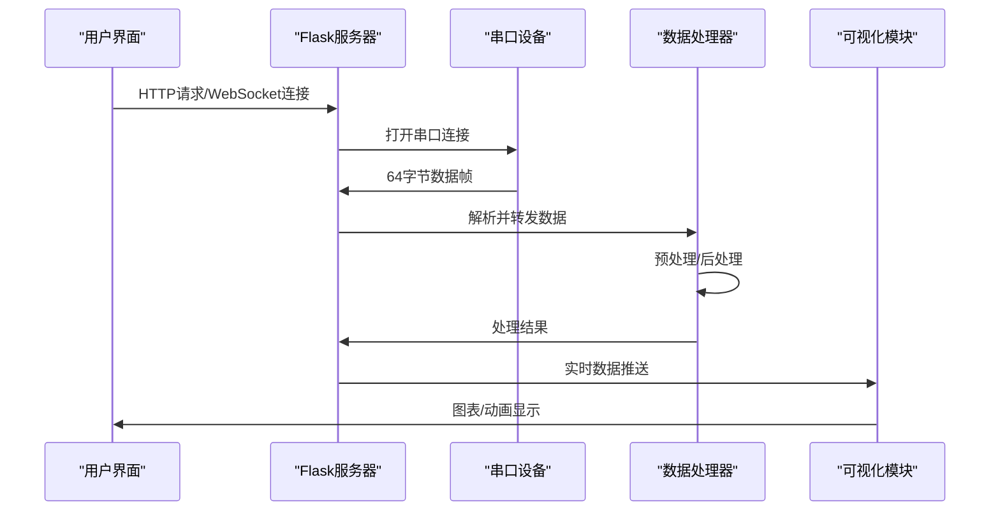
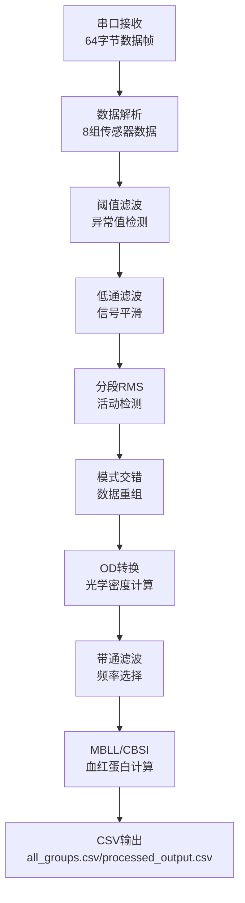

# 固件开发

<cite>
**本文引用的文件**
- [README.md](file://README.md)
- [software/README.md](file://software/README.md)
- [software/config.py](file://software/config.py)
- [software/fNIRS_processing.py](file://software/fNIRS_processing.py)
- [software/visualizer.py](file://software/visualizer.py)
- [software/adc_live.py](file://software/adc_live.py)
- [software/adc_mock_server.py](file://software/adc_mock_server.py)
- [software/fNIRS_processing_pipeline.md](file://software/fNIRS_processing_pipeline.md)
</cite>

## 更新摘要
**所做更改**
- 将文档从STM32固件开发文档完全重写为上位机软件开发文档
- 移除了所有关于STM32L476微控制器、ADC配置、DMA传输、I2C通信等固件相关内容
- 新增了关于Python上位机软件架构、数据处理管道、可视化组件的详细说明
- 更新了项目结构图和组件关系图以反映当前的软件架构

## 目录
1. [简介](#简介)
2. [项目结构](#项目结构)
3. [核心组件](#核心组件)
4. [架构总览](#架构总览)
5. [详细组件分析](#详细组件分析)
6. [数据处理管道](#数据处理管道)
7. [可视化与用户界面](#可视化与用户界面)
8. [测试与演示](#测试与演示)
9. [性能考虑](#性能考虑)
10. [故障排查指南](#故障排查指南)
11. [结论](#结论)
12. [附录](#附录)

## 简介
本技术文档面向基于Python的fNIRS上位机软件开发，系统化阐述从数据采集到处理可视化的完整流程与关键模块实现。该软件通过串口连接设备，接收64字节数据帧，完成采集、预处理与血氧反演（MBLL/CBSI）等流程。重点覆盖以下方面：
- 串口通信：USB虚拟串口连接、64字节固定帧格式解析
- 数据采集：实时ADC数据捕获、CSV文件记录
- 预处理：阈值滤波、低通滤波、分段RMS、模式交错、时间轴重建
- 后处理：双波长配对、OD转换、带通滤波、MBLL、CBSI计算
- 可视化：实时曲线、静态/交互图表、3D脑模型
- 用户界面：Web界面、Socket.IO实时通信、演示模式

## 项目结构
上位机软件采用模块化设计，按功能域划分Python脚本，便于维护与扩展。整个软件分为核心处理模块、可视化模块、测试脚本和演示服务器四个主要部分。

**图示来源**
- [README.md:31-43](file://README.md#L31-L43)
- [software/README.md:127-180](file://software/README.md#L127-L180)

**章节来源**
- [README.md:1-46](file://README.md#L1-L46)
- [software/README.md:1-180](file://software/README.md#L1-L180)

## 核心组件
- **串口通信模块**
  - 通过config.py配置COM端口、波特率、数据帧格式
  - 支持Windows和Linux/macOS平台的串口识别与连接
  - 实现64字节固定帧格式解析，包含8组传感器数据
- **数据处理模块**
  - 阈值滤波：去除异常值和噪声干扰
  - 低通滤波：平滑信号，减少高频噪声
  - 分段RMS：计算信号强度，检测活动区域
  - 模式交错：重新排列传感器数据块
  - 时间轴重建：恢复时间戳信息
- **后处理模块**
  - 双波长配对：660nm和940nm波长数据配对
  - OD转换：将光强度转换为光学密度
  - 带通滤波：提取感兴趣频率范围
  - MBLL/CBSI：计算血红蛋白浓度变化
- **可视化模块**
  - 实时显示：PyQtGraph实现实时数据绘图
  - 静态图表：Plotly交互式图表
  - 3D脑模型：基于解剖学数据的脑部模型
- **用户界面模块**
  - Web界面：Bootstrap+jQuery+Socket.IO
  - 控制面板：传感器组选择、MUX/发射器控制
  - 演示模式：模拟数据生成与处理

**章节来源**
- [software/config.py](file://software/config.py)
- [software/fNIRS_processing.py](file://software/fNIRS_processing.py)
- [software/visualizer.py](file://software/visualizer.py)
- [software/README.md:11-48](file://software/README.md#L11-L48)

## 架构总览
系统采用客户端-服务器架构，Flask作为主服务器，通过Socket.IO实现实时双向通信。数据流从串口接收开始，经过预处理、后处理，最终通过多种可视化方式呈现给用户。

**图示来源**
- [software/visualizer.py](file://software/visualizer.py)
- [software/fNIRS_processing.py](file://software/fNIRS_processing.py)

## 详细组件分析

### 串口通信与数据采集
- **串口配置**
  - 自动检测可用串口设备（Windows使用WMI，Linux/macOS使用/dev/tty.*）
  - 支持自定义COM端口路径配置
  - 串口参数：数据位、停止位、校验位、波特率
- **数据帧格式**
  - 固定64字节长度
  - 8组传感器数据，每组包含Short/Long1/Long2 + Emitter状态
  - 数据类型：16位整数，大端序存储
- **连接管理**
  - 断线重连机制
  - 异常处理与错误恢复
  - 多平台兼容性

**章节来源**
- [software/config.py](file://software/config.py)
- [software/README.md:6-11](file://software/README.md#L6-L11)

### 数据预处理模块
- **阈值滤波**
  - 检测超出正常范围的数据点
  - 使用移动窗口统计方法识别异常值
  - 支持自定义阈值参数
- **低通滤波**
  - 数字滤波器设计，截止频率可配置
  - 零相位滤波避免相位延迟
  - 支持不同滤波器类型（Butterworth、Chebyshev等）
- **分段RMS**
  - 将数据分割为固定长度片段
  - 计算每个片段的RMS值
  - 识别活动和静止时间段
- **模式交错**
  - 重新排列传感器数据块顺序
  - 优化数据流以适应后续处理

**章节来源**
- [software/fNIRS_processing.py](file://software/fNIRS_processing.py)
- [software/README.md:22-26](file://software/README.md#L22-L26)

### 后处理与分析模块
- **双波长配对**
  - 660nm和940nm波长数据精确配对
  - 时间戳对齐，确保同步性
  - 异常配对检测与处理
- **光学密度转换**
  - 基于比尔-朗伯定律的数学变换
  - 背景噪声校正
  - 光学密度OD计算公式实现
- **带通滤波**
  - 提取生理信号感兴趣的频率范围
  - 保留约0.01-0.2 Hz的信号成分
  - 避免运动伪影和呼吸影响
- **MBLL/CBSI计算**
  - Modified Beer-Lambert Law算法实现
  - CBSI（Constrained Bayesian Signal Integration）融合
  - 血红蛋白浓度变化计算

**章节来源**
- [software/fNIRS_processing.py](file://software/fNIRS_processing.py)
- [software/README.md:22-26](file://software/README.md#L22-L26)

### 可视化组件
- **实时显示系统**
  - PyQtGraph实现实时数据绘图
  - 多传感器组并行显示
  - 自适应缩放和滚动显示
- **交互式图表**
  - Plotly提供丰富的交互功能
  - 支持缩放、平移、全屏模式
  - 导出为图片和PDF格式
- **3D脑模型**
  - 基于解剖学数据的脑部表面渲染
  - 传感器节点位置映射
  - 交互式视角控制

**章节来源**
- [software/README.md:27-48](file://software/README.md#L27-L48)
- [software/visualizer.py](file://software/visualizer.py)

### 用户界面与控制
- **Web界面**
  - Bootstrap框架构建响应式布局
  - jQuery提供DOM操作和事件处理
  - Socket.IO实现实时数据更新
- **控制面板**
  - 传感器组选择和配置
  - MUX和发射器状态控制
  - 操作模式切换（实时/记录）
- **演示模式**
  - 模拟ADC服务器生成假数据
  - 简化设置流程
  - 测试环境隔离

**章节来源**
- [software/README.md:41-48](file://software/README.md#L41-L48)
- [software/visualizer.py](file://software/visualizer.py)

## 数据处理管道
完整的数据处理管道从串口接收开始，经过多个处理阶段，最终输出可供分析的结果。

**图示来源**
- [software/fNIRS_processing_pipeline.md](file://software/fNIRS_processing_pipeline.md)
- [software/fNIRS_processing.py](file://software/fNIRS_processing.py)

**章节来源**
- [software/fNIRS_processing_pipeline.md](file://software/fNIRS_processing_pipeline.md)
- [software/README.md:5-11](file://software/README.md#L5-L11)

## 可视化与用户界面

### 实时数据可视化
- **PyQtGraph集成**
  - 高性能图形绘制库
  - 多图层叠加显示
  - 实时数据流处理
- **交互功能**
  - 动态缩放和平移
  - 数据点标记和注释
  - 多传感器组对比显示

### Web界面架构
- **Flask服务器**
  - RESTful API设计
  - WebSocket实时通信
  - 文件上传下载功能
- **前端技术栈**
  - Bootstrap响应式设计
  - jQuery DOM操作
  - Socket.IO实时数据推送

### 3D脑模型展示
- **解剖学数据**
  - NIfTI格式脑部图像
  - 平滑的脑表面网格
  - 传感器节点坐标映射
- **交互控制**
  - 旋转、缩放、平移
  - 传感器组高亮显示
  - 动画播放控制

**章节来源**
- [software/README.md:27-48](file://software/README.md#L27-L48)
- [software/visualizer.py](file://software/visualizer.py)

## 测试与演示

### 测试脚本集合
- **数据处理验证**
  - adc_to_csv.py：ADC数据转换测试
  - apply_rms_to_adc.py：RMS滤波效果验证
  - plot.py/plot_csv.py/plot_mbll.py：可视化效果测试
- **处理流程验证**
  - fNIRS_processing_csv.py：完整处理流程测试
  - 示例数据集验证处理结果一致性

### 演示服务器
- **ADC模拟服务器**
  - 生成三角波形式的模拟数据
  - 支持实时演示和测试
  - 无需真实硬件即可验证系统
- **演示模式**
  - 简化用户界面
  - 自动数据生成和处理
  - 快速验证系统功能

**章节来源**
- [software/README.md:148-180](file://software/README.md#L148-L180)
- [software/adc_mock_server.py](file://software/adc_mock_server.py)

## 性能考虑
- **实时性保障**
  - Socket.IO实现低延迟数据传输
  - PyQtGraph优化渲染性能
  - 多线程架构避免界面阻塞
- **内存管理**
  - 数据流式处理减少内存占用
  - 定期清理临时数据文件
  - 内存泄漏检测与预防
- **网络通信**
  - WebSocket长连接减少握手开销
  - 数据压缩提升传输效率
  - 错误重传机制保证可靠性
- **可视化性能**
  - 采样率自适应调整
  - 动画帧率动态控制
  - GPU加速图形渲染

## 故障排查指南
- **串口连接问题**
  - 检查COM端口权限和占用情况
  - 验证串口参数配置正确性
  - 确认设备驱动程序安装
- **数据处理异常**
  - 检查CSV文件格式和编码
  - 验证数据完整性与一致性
  - 查看处理日志和错误信息
- **可视化显示问题**
  - 确认依赖包版本兼容性
  - 检查网络连接和端口占用
  - 验证浏览器兼容性和JavaScript支持
- **性能问题**
  - 监控内存使用和CPU占用
  - 调整采样率和显示参数
  - 优化数据处理算法复杂度

**章节来源**
- [software/README.md:50-101](file://software/README.md#L50-L101)

## 结论
该上位机软件围绕Python生态系统构建，采用模块化设计和现代化技术栈，实现了完整的fNIRS数据分析与可视化解决方案。通过Flask+Socket.IO架构、PyQtGraph+Plotly可视化库、以及完整的数据处理管道，系统在保证实时性的前提下提供了丰富的交互功能和良好的用户体验。软件架构具有良好的可维护性和扩展性，支持未来功能的增量开发。

## 附录

### 开发环境配置
- **Python版本要求**：3.7+
- **主要依赖包**：numpy、pandas、pyqtgraph、plotly、flask、socketio
- **开发工具**：pytest、pylint、black代码格式化

### 常用命令
- **安装依赖**：`pip install -r requirements.txt`
- **启动服务器**：`python visualizer.py`
- **实时显示**：`python adc_live.py`
- **数据处理**：`python fNIRS_processing.py`

### 调试工具
- **串口监控**：使用串口调试助手验证数据帧格式
- **性能分析**：使用cProfile分析代码性能瓶颈
- **内存监控**：使用memory_profiler跟踪内存使用情况

**章节来源**
- [software/README.md:58-87](file://software/README.md#L58-L87)
- [software/requirements.txt](file://software/requirements.txt)