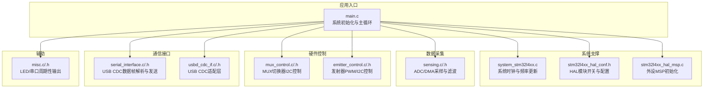
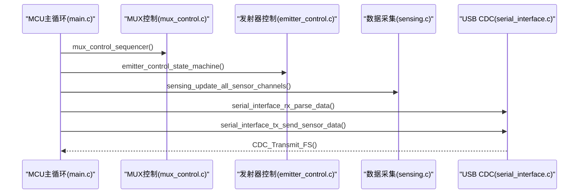
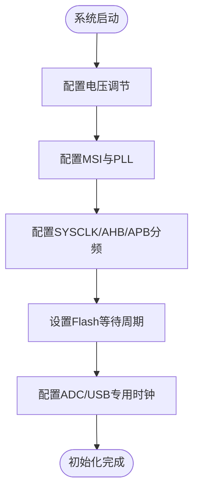
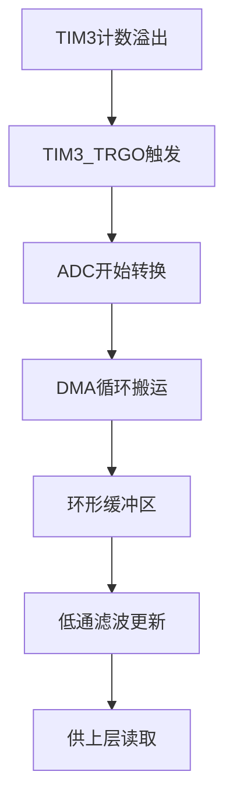
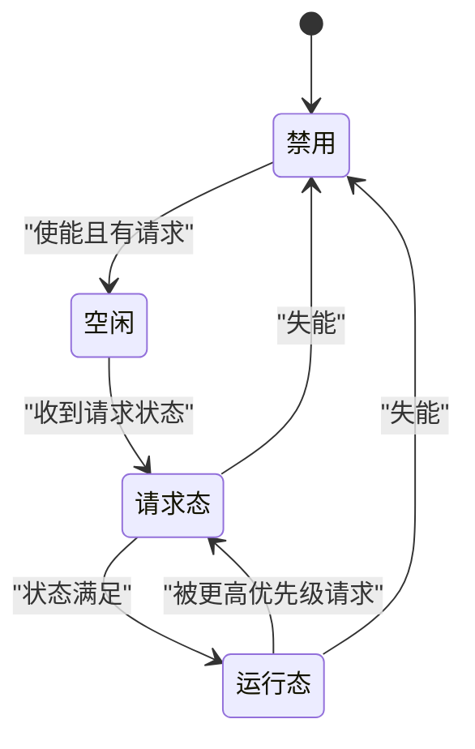
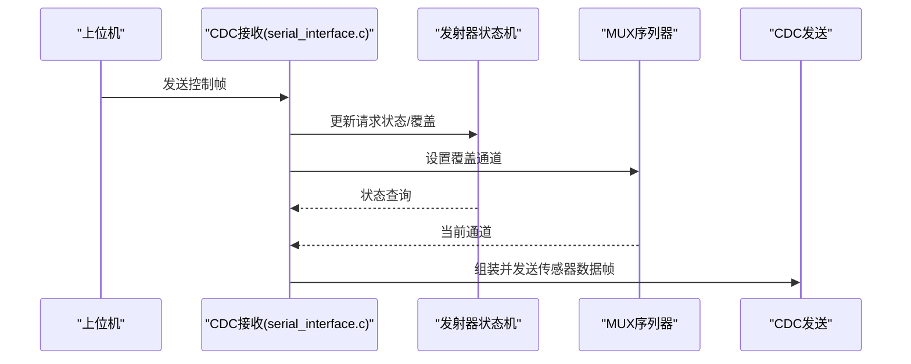
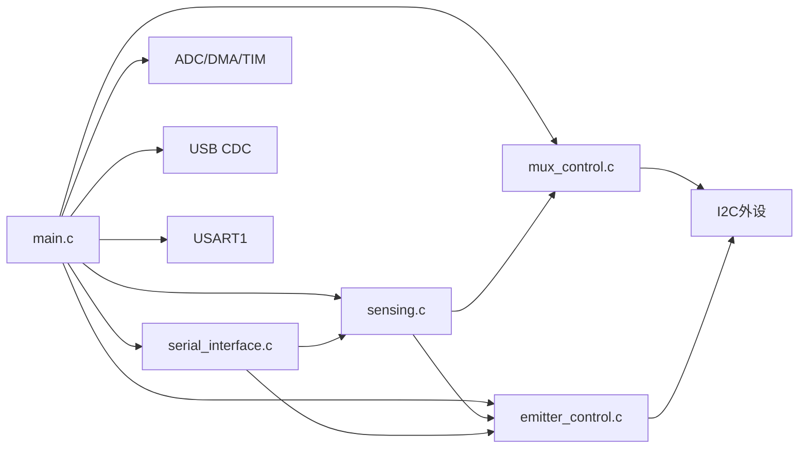

# 固件开发

<cite>
**本文引用的文件**
- [firmware/STM32/fNIRS/Core/Src/main.c](file://firmware/STM32/fNIRS/Core/Src/main.c)
- [firmware/STM32/fNIRS/Core/Src/system_stm32l4xx.c](file://firmware/STM32/fNIRS/Core/Src/system_stm32l4xx.c)
- [firmware/STM32/fNIRS/Core/Inc/main.h](file://firmware/STM32/fNIRS/Core/Inc/main.h)
- [firmware/STM32/fNIRS/Core/Inc/stm32l4xx_hal_conf.h](file://firmware/STM32/fNIRS/Core/Inc/stm32l4xx_hal_conf.h)
- [firmware/STM32/fNIRS/Core/Src/stm32l4xx_hal_msp.c](file://firmware/STM32/fNIRS/Core/Src/stm32l4xx_hal_msp.c)
- [firmware/STM32/fNIRS/Core/Inc/mux_control.h](file://firmware/STM32/fNIRS/Core/Inc/mux_control.h)
- [firmware/STM32/fNIRS/Core/Src/mux_control.c](file://firmware/STM32/fNIRS/Core/Src/mux_control.c)
- [firmware/STM32/fNIRS/Core/Inc/emitter_control.h](file://firmware/STM32/fNIRS/Core/Inc/emitter_control.h)
- [firmware/STM32/fNIRS/Core/Src/emitter_control.c](file://firmware/STM32/fNIRS/Core/Src/emitter_control.c)
- [firmware/STM32/fNIRS/Core/Inc/sensing.h](file://firmware/STM32/fNIRS/Core/Inc/sensing.h)
- [firmware/STM32/fNIRS/Core/Src/sensing.c](file://firmware/STM32/fNIRS/Core/Src/sensing.c)
- [firmware/STM32/fNIRS/Core/Inc/serial_interface.h](file://firmware/STM32/fNIRS/Core/Inc/serial_interface.h)
- [firmware/STM32/fNIRS/Core/Src/serial_interface.c](file://firmware/STM32/fNIRS/Core/Src/serial_interface.c)
- [firmware/STM32/fNIRS/Core/Inc/misc.h](file://firmware/STM32/fNIRS/Core/Inc/misc.h)
- [firmware/STM32/fNIRS/Core/Src/misc.c](file://firmware/STM32/fNIRS/Core/Src/misc.c)
</cite>

## 目录
1. [简介](#简介)
2. [项目结构](#项目结构)
3. [核心组件](#核心组件)
4. [架构总览](#架构总览)
5. [详细组件分析](#详细组件分析)
6. [依赖关系分析](#依赖关系分析)
7. [性能考虑](#性能考虑)
8. [故障排查指南](#故障排查指南)
9. [结论](#结论)
10. [附录](#附录)

## 简介
本技术文档面向基于STM32L476微控制器的fNIRS固件开发，系统化阐述从启动到运行的完整流程与关键模块实现，重点覆盖以下方面：
- 系统初始化：时钟配置、外设时钟与总线配置、中断优先级与NVIC设置
- 数据采集：ADC配置、DMA循环缓冲、多通道采样时序与滤波
- 硬件控制：发射器控制状态机、MUX切换器I2C驱动与时序控制
- 通信接口：USB CDC串口协议的数据帧格式、收发与实时传输
- 性能优化：中断优先级、DMA带宽、滤波算法与实时性保障
- 调试与排错：LED闪烁、串口打印、错误处理与常见问题定位

## 项目结构
固件采用分层组织方式，按功能域划分头文件与源文件，便于模块化维护与复用。

图示来源
- [firmware/STM32/fNIRS/Core/Src/main.c](file://firmware/STM32/fNIRS/Core/Src/main.c#L92-L181)
- [firmware/STM32/fNIRS/Core/Src/system_stm32l4xx.c](file://firmware/STM32/fNIRS/Core/Src/system_stm32l4xx.c#L197-L332)
- [firmware/STM32/fNIRS/Core/Inc/stm32l4xx_hal_conf.h](file://firmware/STM32/fNIRS/Core/Inc/stm32l4xx_hal_conf.h#L34-L94)
- [firmware/STM32/fNIRS/Core/Src/stm32l4xx_hal_msp.c](file://firmware/STM32/fNIRS/Core/Src/stm32l4xx_hal_msp.c#L64-L79)
- [firmware/STM32/fNIRS/Core/Src/sensing.c](file://firmware/STM32/fNIRS/Core/Src/sensing.c#L50-L84)
- [firmware/STM32/fNIRS/Core/Src/mux_control.c](file://firmware/STM32/fNIRS/Core/Src/mux_control.c#L146-L158)
- [firmware/STM32/fNIRS/Core/Src/emitter_control.c](file://firmware/STM32/fNIRS/Core/Src/emitter_control.c#L183-L189)
- [firmware/STM32/fNIRS/Core/Src/serial_interface.c](file://firmware/STM32/fNIRS/Core/Src/serial_interface.c#L59-L81)

章节来源
- [firmware/STM32/fNIRS/Core/Src/main.c](file://firmware/STM32/fNIRS/Core/Src/main.c#L92-L181)
- [firmware/STM32/fNIRS/Core/Inc/main.h](file://firmware/STM32/fNIRS/Core/Inc/main.h#L59-L79)

## 核心组件
- 系统初始化与时钟
  - 主频通过PLL由MSI源倍频得到，系统时钟、AHB/APB总线时钟、ADC与USB专用时钟由独立分频链路提供，确保模拟与高速接口稳定。
  - HAL配置启用ADC、I2C、SPI、TIM、UART、DMA等模块，MSP负责外设引脚与中断优先级设置。
- 数据采集模块
  - ADC1工作在扫描模式，8个通道依次采样；DMA以循环模式搬运至缓冲区，结合低通滤波降低噪声。
- 硬件控制模块
  - MUX通过两片GPIO扩展器（I2C）控制8路模拟开关，定时器触发切换序列；发射器控制通过PWM驱动芯片（I2C），支持多种工作模式与用户覆盖。
- 通信接口
  - USB CDC作为虚拟串口，定义固定长度数据帧，包含传感器通道值与发射器状态，周期性发送至上位机。
- 辅助功能
  - LED与串口周期性输出用于系统健康指示与调试信息。

章节来源
- [firmware/STM32/fNIRS/Core/Src/main.c](file://firmware/STM32/fNIRS/Core/Src/main.c#L187-L257)
- [firmware/STM32/fNIRS/Core/Inc/stm32l4xx_hal_conf.h](file://firmware/STM32/fNIRS/Core/Inc/stm32l4xx_hal_conf.h#L38-L94)
- [firmware/STM32/fNIRS/Core/Src/stm32l4xx_hal_msp.c](file://firmware/STM32/fNIRS/Core/Src/stm32l4xx_hal_msp.c#L87-L154)
- [firmware/STM32/fNIRS/Core/Src/sensing.c](file://firmware/STM32/fNIRS/Core/Src/sensing.c#L50-L84)
- [firmware/STM32/fNIRS/Core/Src/mux_control.c](file://firmware/STM32/fNIRS/Core/Src/mux_control.c#L146-L229)
- [firmware/STM32/fNIRS/Core/Src/emitter_control.c](file://firmware/STM32/fNIRS/Core/Src/emitter_control.c#L183-L278)
- [firmware/STM32/fNIRS/Core/Src/serial_interface.c](file://firmware/STM32/fNIRS/Core/Src/serial_interface.c#L59-L81)
- [firmware/STM32/fNIRS/Core/Src/misc.c](file://firmware/STM32/fNIRS/Core/Src/misc.c#L11-L68)

## 架构总览
系统以main.c为入口，完成外设初始化后进入主循环，周期性调度各子系统：MUX序列器、发射器状态机、数据采集与USB CDC发送，并通过串口接口接收上位机指令进行覆盖控制。

图示来源
- [firmware/STM32/fNIRS/Core/Src/main.c](file://firmware/STM32/fNIRS/Core/Src/main.c#L146-L178)
- [firmware/STM32/fNIRS/Core/Src/mux_control.c](file://firmware/STM32/fNIRS/Core/Src/mux_control.c#L170-L229)
- [firmware/STM32/fNIRS/Core/Src/emitter_control.c](file://firmware/STM32/fNIRS/Core/Src/emitter_control.c#L220-L278)
- [firmware/STM32/fNIRS/Core/Src/sensing.c](file://firmware/STM32/fNIRS/Core/Src/sensing.c#L73-L84)
- [firmware/STM32/fNIRS/Core/Src/serial_interface.c](file://firmware/STM32/fNIRS/Core/Src/serial_interface.c#L20-L81)

## 详细组件分析

### 系统初始化与时钟配置
- 电源与电压调节：启用电压调节以获得稳定内核供电。
- 振荡器与PLL：MSI作为源，经PLL倍频得到SYSCLK；同时配置PLLSAI1为ADC与USB提供专用时钟。
- 总线时钟：CPU、AHB、APB1、APB2分频设置，Flash等待周期根据频率调整。
- 外设时钟：ADC与USB通过PeriphCommonClock_Config单独配置，确保模拟与高速接口稳定。

图示来源
- [firmware/STM32/fNIRS/Core/Src/main.c](file://firmware/STM32/fNIRS/Core/Src/main.c#L187-L257)
- [firmware/STM32/fNIRS/Core/Src/system_stm32l4xx.c](file://firmware/STM32/fNIRS/Core/Src/system_stm32l4xx.c#L251-L317)

章节来源
- [firmware/STM32/fNIRS/Core/Src/main.c](file://firmware/STM32/fNIRS/Core/Src/main.c#L187-L257)
- [firmware/STM32/fNIRS/Core/Src/system_stm32l4xx.c](file://firmware/STM32/fNIRS/Core/Src/system_stm32l4xx.c#L197-L317)

### 数据采集模块（ADC/DMA/滤波）
- ADC配置：扫描模式、8通道、外部触发来自TIM3，DMA循环搬运原始ADC值到缓冲区。
- DMA设置：DMA1_Channel1，半字对半字，递增内存，循环模式，高优先级。
- 采样时序：TIM3作为主时钟源，TIM4作为采样触发源，通过TIM_TRGO连接实现同步。
- 数值处理：每通道采用低通滤波平滑，减少随机噪声影响。

图示来源
- [firmware/STM32/fNIRS/Core/Src/main.c](file://firmware/STM32/fNIRS/Core/Src/main.c#L530-L613)
- [firmware/STM32/fNIRS/Core/Src/stm32l4xx_hal_msp.c](file://firmware/STM32/fNIRS/Core/Src/stm32l4xx_hal_msp.c#L87-L154)
- [firmware/STM32/fNIRS/Core/Src/sensing.c](file://firmware/STM32/fNIRS/Core/Src/sensing.c#L50-L84)

章节来源
- [firmware/STM32/fNIRS/Core/Src/main.c](file://firmware/STM32/fNIRS/Core/Src/main.c#L264-L387)
- [firmware/STM32/fNIRS/Core/Src/stm32l4xx_hal_msp.c](file://firmware/STM32/fNIRS/Core/Src/stm32l4xx_hal_msp.c#L87-L154)
- [firmware/STM32/fNIRS/Core/Src/sensing.c](file://firmware/STM32/fNIRS/Core/Src/sensing.c#L45-L84)

### 硬件控制模块（MUX与发射器）
- MUX控制
  - 两片GPIO扩展器通过I2C控制8路模拟开关，映射到4个输入通道与禁用态。
  - 定时器触发序列器，按固定节拍轮询切换通道，支持用户覆盖模式。
- 发射器控制
  - PWM驱动芯片通过I2C配置，支持禁用、空闲、默认模式、用户控制、循环模式以及仅660nm或940nm全开模式。
  - 状态机根据使能标志与请求状态迁移，周期性更新PWM占空比与相位。

图示来源
- [firmware/STM32/fNIRS/Core/Src/emitter_control.c](file://firmware/STM32/fNIRS/Core/Src/emitter_control.c#L220-L278)
- [firmware/STM32/fNIRS/Core/Inc/emitter_control.h](file://firmware/STM32/fNIRS/Core/Inc/emitter_control.h#L13-L38)

章节来源
- [firmware/STM32/fNIRS/Core/Src/mux_control.c](file://firmware/STM32/fNIRS/Core/Src/mux_control.c#L146-L229)
- [firmware/STM32/fNIRS/Core/Src/emitter_control.c](file://firmware/STM32/fNIRS/Core/Src/emitter_control.c#L183-L278)

### USB CDC串口通信协议
- 接收数据帧（主机→设备）
  - 包含发射器控制覆盖使能、目标状态、PWM掩码；以及MUX覆盖使能与目标通道。
- 发送数据帧（设备→主机）
  - 每个传感器模块发送标识、三路通道值（高/低位）、发射器状态（940nm/660nm）。
  - 使用CDC接口周期性发送，确保实时数据流。

图示来源
- [firmware/STM32/fNIRS/Core/Src/serial_interface.c](file://firmware/STM32/fNIRS/Core/Src/serial_interface.c#L20-L81)

章节来源
- [firmware/STM32/fNIRS/Core/Inc/serial_interface.h](file://firmware/STM32/fNIRS/Core/Inc/serial_interface.h#L12-L61)
- [firmware/STM32/fNIRS/Core/Src/serial_interface.c](file://firmware/STM32/fNIRS/Core/Src/serial_interface.c#L20-L81)

### 中断与NVIC设置
- ADC1_2中断：用于ADC转换完成事件（DMA搬运完成）。
- TIM4中断：作为发射器状态机的周期触发源。
- NVIC优先级：ADC与TIM4中断优先级配置，避免抢占影响实时性。

章节来源
- [firmware/STM32/fNIRS/Core/Src/stm32l4xx_hal_msp.c](file://firmware/STM32/fNIRS/Core/Src/stm32l4xx_hal_msp.c#L146-L147)
- [firmware/STM32/fNIRS/Core/Src/stm32l4xx_hal_msp.c](file://firmware/STM32/fNIRS/Core/Src/stm32l4xx_hal_msp.c#L426-L427)

## 依赖关系分析
- 模块耦合
  - main.c是控制中枢，依赖所有子系统初始化与调度。
  - sensing依赖mux_control提供的当前通道索引，依赖emitter_control提供发射器状态。
  - serial_interface依赖sensing与emitter_control读取当前状态与数值。
  - mux_control与emitter_control均依赖I2C与GPIO扩展器/PWM驱动芯片。
- 外设依赖
  - ADC/DMA/TIM用于采样与触发；I2C用于MUX与PWM控制；USB用于上位机通信；UART用于调试输出。

图示来源
- [firmware/STM32/fNIRS/Core/Src/main.c](file://firmware/STM32/fNIRS/Core/Src/main.c#L118-L128)
- [firmware/STM32/fNIRS/Core/Src/sensing.c](file://firmware/STM32/fNIRS/Core/Src/sensing.c#L73-L84)
- [firmware/STM32/fNIRS/Core/Src/serial_interface.c](file://firmware/STM32/fNIRS/Core/Src/serial_interface.c#L59-L81)
- [firmware/STM32/fNIRS/Core/Src/stm32l4xx_hal_msp.c](file://firmware/STM32/fNIRS/Core/Src/stm32l4xx_hal_msp.c#L207-L277)

章节来源
- [firmware/STM32/fNIRS/Core/Src/main.c](file://firmware/STM32/fNIRS/Core/Src/main.c#L118-L128)
- [firmware/STM32/fNIRS/Core/Src/sensing.c](file://firmware/STM32/fNIRS/Core/Src/sensing.c#L73-L84)
- [firmware/STM32/fNIRS/Core/Src/serial_interface.c](file://firmware/STM32/fNIRS/Core/Src/serial_interface.c#L59-L81)

## 性能考虑
- 实时性保障
  - 使用DMA搬运ADC原始值，避免CPU轮询；TIM4中断驱动发射器状态机，确保严格周期性。
  - ADC触发由TIM3_TRGO提供，保证采样与触发同步。
- 带宽与缓冲
  - DMA循环模式减少中断次数，提高吞吐；环形缓冲区配合低通滤波，兼顾实时性与稳定性。
- 时钟与功耗
  - 合理设置AHB/APB分频与Flash等待周期，避免欠压或超频导致的不稳定。
- 通信效率
  - USB CDC批量发送，减少中断开销；数据帧紧凑，包含必要字段即可。

[本节为通用指导，无需特定文件引用]

## 故障排查指南
- 初始化失败
  - 检查SystemClock_Config与PeriphCommonClock_Config返回值；确认RCC配置参数与外部晶振一致。
- ADC/DMA异常
  - 确认ADC引脚配置为模拟模式；检查DMA通道占用与优先级；验证DMA循环缓冲大小与ADC通道数量匹配。
- I2C通信失败
  - 校验I2C时序寄存器与上拉电阻；确认从设备地址正确；检查GPIO复用与开漏配置。
- USB无法枚举
  - 确认USB引脚配置与VDD/DP/DM连接；检查CDC中间件初始化顺序。
- 实时性问题
  - 检查TIM4中断优先级是否过高导致其他中断饥饿；评估滤波系数与采样频率平衡。

章节来源
- [firmware/STM32/fNIRS/Core/Src/main.c](file://firmware/STM32/fNIRS/Core/Src/main.c#L714-L723)
- [firmware/STM32/fNIRS/Core/Src/stm32l4xx_hal_msp.c](file://firmware/STM32/fNIRS/Core/Src/stm32l4xx_hal_msp.c#L207-L277)

## 结论
该固件围绕STM32L476构建，采用模块化设计与明确的时序控制策略，实现了稳定的fNIRS数据采集与发射器控制，并通过USB CDC提供实时数据传输能力。通过合理的时钟配置、DMA搬运与中断优先级管理，系统在保证实时性的前提下具备良好的可维护性与扩展性。

[本节为总结性内容，无需特定文件引用]

## 附录
- 调试工具
  - LED周期闪烁用于系统健康指示；USART1周期性打印可用于日志输出。
- 常见问题
  - ADC通道未更新：检查DMA搬运与滤波调用时机。
  - MUX不切换：确认I2C写入与定时器节拍。
  - PWM无输出：检查使能引脚与I2C配置。

章节来源
- [firmware/STM32/fNIRS/Core/Src/misc.c](file://firmware/STM32/fNIRS/Core/Src/misc.c#L11-L68)