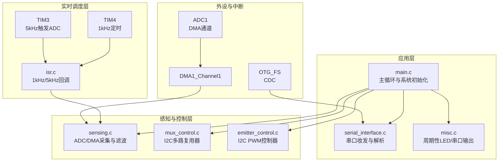
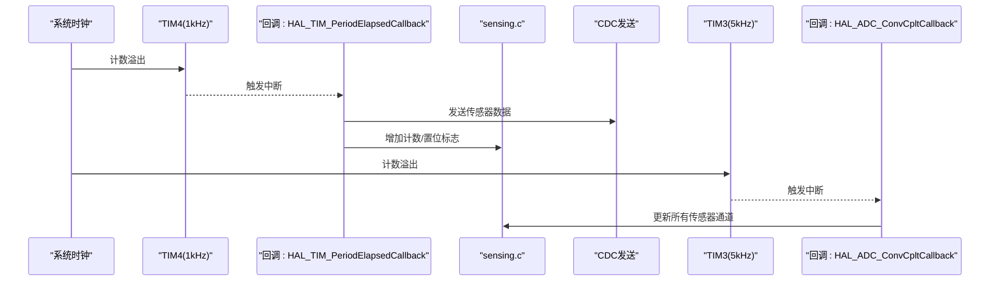
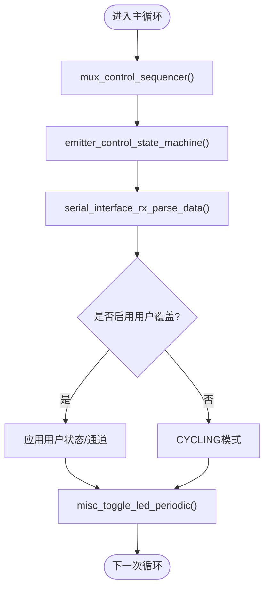
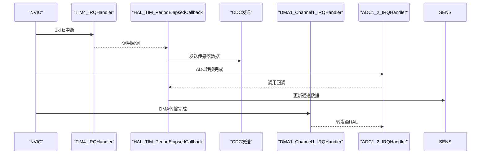
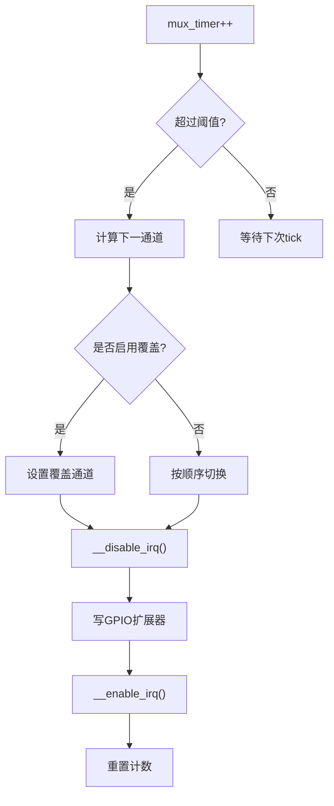
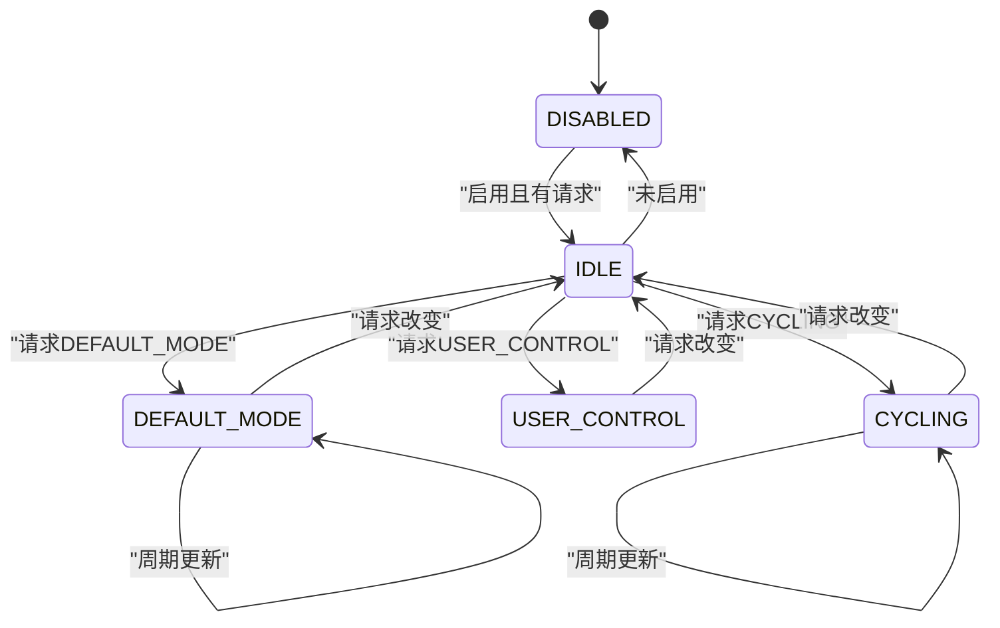
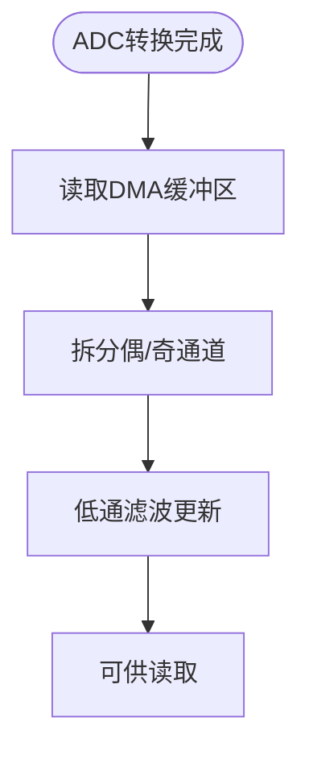
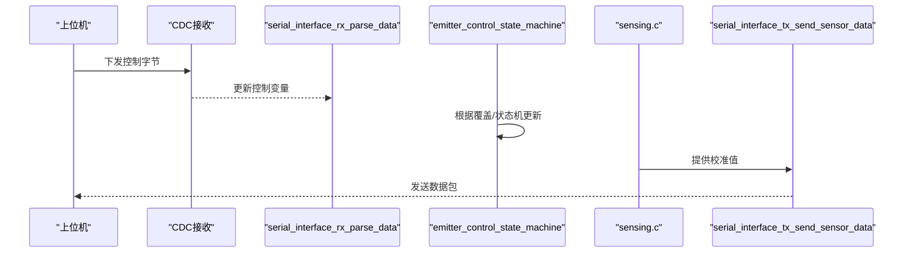
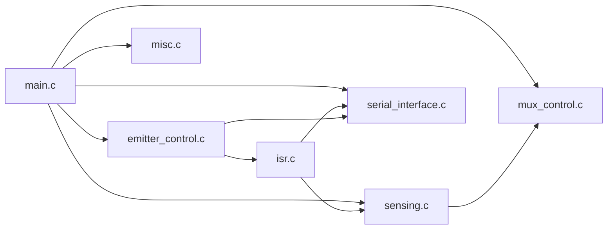

# 实时处理算法

<cite>
**本文引用的文件**
- [main.c](file://firmware/STM32/fNIRS/Core/Src/main.c)
- [stm32l4xx_it.c](file://firmware/STM32/fNIRS/Core/Src/stm32l4xx_it.c)
- [isr.c](file://firmware/STM32/fNIRS/Core/Src/isr.c)
- [isr.h](file://firmware/STM32/fNIRS/Core/Inc/isr.h)
- [mux_control.c](file://firmware/STM32/fNIRS/Core/Src/mux_control.c)
- [mux_control.h](file://firmware/STM32/fNIRS/Core/Inc/mux_control.h)
- [emitter_control.c](file://firmware/STM32/fNIRS/Core/Src/emitter_control.c)
- [emitter_control.h](file://firmware/STM32/fNIRS/Core/Inc/emitter_control.h)
- [sensing.c](file://firmware/STM32/fNIRS/Core/Src/sensing.c)
- [sensing.h](file://firmware/STM32/fNIRS/Core/Inc/sensing.h)
- [serial_interface.c](file://firmware/STM32/fNIRS/Core/Src/serial_interface.c)
- [serial_interface.h](file://firmware/STM32/fNIRS/Core/Inc/serial_interface.h)
- [misc.c](file://firmware/STM32/fNIRS/Core/Src/misc.c)
- [misc.h](file://firmware/STM32/fNIRS/Core/Inc/misc.h)
- [main.h](file://firmware/STM32/fNIRS/Core/Inc/main.h)
- [stm32l4xx_it.h](file://firmware/STM32/fNIRS/Core/Inc/stm32l4xx_it.h)
</cite>

## 目录
1. [引言](#引言)
2. [项目结构](#项目结构)
3. [核心组件](#核心组件)
4. [架构总览](#架构总览)
5. [详细组件分析](#详细组件分析)
6. [依赖关系分析](#依赖关系分析)
7. [性能与实时性保障](#性能与实时性保障)
8. [内存管理策略](#内存管理策略)
9. [故障排查指南](#故障排查指南)
10. [结论](#结论)
11. [附录](#附录)

## 引言
本技术文档面向fNIRS实时处理算法，聚焦于实时任务调度机制（主循环、优先级与执行时间控制）、中断处理（定时器、ADC/DMA、USB等）、实时数据处理流程（预处理、状态机更新、控制指令执行）、内存管理策略（堆栈、动态分配与泄漏预防）、实时性保障与性能监控、系统负载分析以及调试与优化方法。文档以代码级分析为基础，结合图示帮助读者快速理解系统在STM32L4系列MCU上的运行机制。

## 项目结构
该固件采用分层模块化组织：外设初始化与主循环位于main.c；中断服务例程集中在stm32l4xx_it.c；实时调度与数据通路由多个功能模块协同完成：多路复用器控制（mux_control）、光源驱动与PWM控制（emitter_control）、传感器采集与滤波（sensing）、串口通信与上位机交互（serial_interface），以及辅助的LED闪烁与串口输出（misc）。

图表来源
- [main.c](file://firmware/STM32/fNIRS/Core/Src/main.c#L146-L178)
- [isr.c](file://firmware/STM32/fNIRS/Core/Src/isr.c#L34-L52)
- [mux_control.c](file://firmware/STM32/fNIRS/Core/Src/mux_control.c#L170-L229)
- [emitter_control.c](file://firmware/STM32/fNIRS/Core/Src/emitter_control.c#L220-L278)
- [sensing.c](file://firmware/STM32/fNIRS/Core/Src/sensing.c#L73-L84)
- [stm32l4xx_it.c](file://firmware/STM32/fNIRS/Core/Src/stm32l4xx_it.c#L207-L258)

章节来源
- [main.c](file://firmware/STM32/fNIRS/Core/Src/main.c#L118-L143)
- [stm32l4xx_it.c](file://firmware/STM32/fNIRS/Core/Src/stm32l4xx_it.c#L207-L258)

## 核心组件
- 主循环与系统初始化：完成外设初始化、启动定时器、进入主循环，循环内调用多路复用器序列器、光源状态机、串口解析与LED/串口周期性输出。
- 中断与回调：1kHz定时器回调用于发送传感器数据与设置状态标志；5kHz定时器回调触发ADC转换完成处理。
- 数据通路：ADC通过DMA搬运原始采样值，经低通滤波得到校准值；串口周期性打包发送。
- 控制接口：上位机通过CDC下发控制字节，覆盖光源模式与多路复用器通道选择。

章节来源
- [main.c](file://firmware/STM32/fNIRS/Core/Src/main.c#L146-L178)
- [isr.c](file://firmware/STM32/fNIRS/Core/Src/isr.c#L34-L52)
- [sensing.c](file://firmware/STM32/fNIRS/Core/Src/sensing.c#L50-L84)
- [serial_interface.c](file://firmware/STM32/fNIRS/Core/Src/serial_interface.c#L19-L81)

## 架构总览
系统采用“主循环 + 定时中断 + DMA”的实时架构：
- 主循环负责状态机与控制命令解析，确保用户控制优先级高于自动状态机。
- TIM4产生1kHz中断，触发传感器数据打包与发送，并作为光源状态机的周期标志。
- TIM3产生5kHz中断，触发ADC转换完成回调，更新传感器通道数据。
- DMA在后台搬运ADC原始数据，避免CPU占用。

图表来源
- [isr.c](file://firmware/STM32/fNIRS/Core/Src/isr.c#L34-L52)
- [stm32l4xx_it.c](file://firmware/STM32/fNIRS/Core/Src/stm32l4xx_it.c#L235-L244)
- [stm32l4xx_it.c](file://firmware/STM32/fNIRS/Core/Src/stm32l4xx_it.c#L221-L230)

## 详细组件分析

### 主循环与任务调度
- 初始化阶段：配置系统时钟、外设时钟、GPIO、ADC、I2C、SPI、USART、USB、TIM3/TIM4，并启动相关外设。
- 运行阶段：在while(1)中依次执行：
  - 多路复用器序列器：按固定频率切换输入通道。
  - 光源状态机：根据请求状态与用户覆盖决定当前工作模式。
  - 串口解析：读取上位机控制字节，更新覆盖开关与目标状态。
  - LED/串口周期性输出：用于系统健康指示与调试信息。
- 优先级与控制权：
  - 用户覆盖优先：当启用覆盖时，强制进入指定状态或通道。
  - 自动状态机：在无覆盖时按CYCLING等模式轮转。
  - 时间基准：1kHz标志作为状态机推进条件之一。

图表来源
- [main.c](file://firmware/STM32/fNIRS/Core/Src/main.c#L146-L178)
- [mux_control.c](file://firmware/STM32/fNIRS/Core/Src/mux_control.c#L170-L229)
- [emitter_control.c](file://firmware/STM32/fNIRS/Core/Src/emitter_control.c#L220-L278)
- [serial_interface.c](file://firmware/STM32/fNIRS/Core/Src/serial_interface.c#L19-L57)
- [misc.c](file://firmware/STM32/fNIRS/Core/Src/misc.c#L11-L39)

章节来源
- [main.c](file://firmware/STM32/fNIRS/Core/Src/main.c#L118-L143)
- [main.c](file://firmware/STM32/fNIRS/Core/Src/main.c#L146-L178)

### 中断处理与实时性
- TIM4中断（1kHz）：
  - 回调函数中调用串口发送传感器数据，增加计数并按阈值置位状态标志，供光源状态机使用。
- TIM3中断（5kHz）：
  - ADC转换完成回调，更新所有传感器通道的滤波后数值。
- DMA中断（DMA1_Channel1）：
  - 转发至HAL_DMA_IRQHandler，配合ADC/DMA链路完成数据搬运。
- USB中断（OTG_FS）：
  - 转发至HAL_PCD_IRQHandler，支撑CDC数据收发。
- NVIC优先级：
  - DMA1_Channel1中断被配置为最高优先级，确保ADC数据及时搬运。

图表来源
- [stm32l4xx_it.c](file://firmware/STM32/fNIRS/Core/Src/stm32l4xx_it.c#L235-L244)
- [stm32l4xx_it.c](file://firmware/STM32/fNIRS/Core/Src/stm32l4xx_it.c#L221-L230)
- [stm32l4xx_it.c](file://firmware/STM32/fNIRS/Core/Src/stm32l4xx_it.c#L207-L216)
- [stm32l4xx_it.c](file://firmware/STM32/fNIRS/Core/Src/stm32l4xx_it.c#L249-L258)
- [isr.c](file://firmware/STM32/fNIRS/Core/Src/isr.c#L34-L52)

章节来源
- [stm32l4xx_it.c](file://firmware/STM32/fNIRS/Core/Src/stm32l4xx_it.c#L207-L258)
- [isr.c](file://firmware/STM32/fNIRS/Core/Src/isr.c#L34-L52)

### 多路复用器控制（mux_control）
- 功能职责：通过两个GPIO扩展器（I2C）控制8路模拟开关，实现8个传感器模块在4个检测通道间的轮询切换。
- 关键点：
  - 序列器按固定tick计数切换通道，支持覆盖模式直接写入目标通道。
  - 切换过程中临时关闭中断，避免I2C写期间被中断打断。
  - 提供查询当前通道的接口，供ADC回调读取当前通道数据。

图表来源
- [mux_control.c](file://firmware/STM32/fNIRS/Core/Src/mux_control.c#L170-L229)

章节来源
- [mux_control.h](file://firmware/STM32/fNIRS/Core/Inc/mux_control.h#L12-L53)
- [mux_control.c](file://firmware/STM32/fNIRS/Core/Src/mux_control.c#L146-L229)

### 光源驱动与PWM控制（emitter_control）
- 状态机：
  - 支持DISABLED、IDLE、DEFAULT_MODE、USER_CONTROL、CYCLING、FULLY_ENABLED_660NM、FULLY_ENABLED_940NM等状态。
  - 状态切换受“启用标志、请求状态、用户覆盖、1kHz标志”共同影响。
- PWM更新：
  - 根据状态设置各通道占空比与相位，必要时更新频率。
  - 通过I2C驱动PWM控制器，实现对8组发射器（660nm/940nm）的独立控制。
- 用户覆盖：
  - 上位机可下发位掩码，直接控制每个PWM通道的使能。

图表来源
- [emitter_control.h](file://firmware/STM32/fNIRS/Core/Inc/emitter_control.h#L13-L38)
- [emitter_control.c](file://firmware/STM32/fNIRS/Core/Src/emitter_control.c#L220-L278)

章节来源
- [emitter_control.h](file://firmware/STM32/fNIRS/Core/Inc/emitter_control.h#L12-L54)
- [emitter_control.c](file://firmware/STM32/fNIRS/Core/Src/emitter_control.c#L183-L278)

### 传感器数据采集与处理（sensing）
- ADC配置：
  - ADC1配置为独立模式，扫描8个通道，外部触发来自TIM3，连续转换关闭，DMA连续请求开启。
  - 启动校准与DMA，将偶数/奇数通道打包到DMA缓冲区。
- 数据更新：
  - ADC回调中从DMA缓冲区提取偶/奇通道值，进行低通滤波更新为“校准值”，供上位机读取。
- 温度读数：
  - 预留温度传感器数组，当前实现为空操作。

图表来源
- [sensing.c](file://firmware/STM32/fNIRS/Core/Src/sensing.c#L50-L84)

章节来源
- [sensing.h](file://firmware/STM32/fNIRS/Core/Inc/sensing.h#L46-L70)
- [sensing.c](file://firmware/STM32/fNIRS/Core/Src/sensing.c#L50-L84)

### 串口通信与控制接口（serial_interface）
- 接收解析：
  - 解析来自CDC的控制字节，设置用户覆盖开关、目标状态、PWM掩码、多路复用器通道。
- 发送打包：
  - 每1kHz周期打包8个传感器模块的数据（每模块3个通道）与对应发射器状态，通过CDC发送。
- 缓冲与索引：
  - 使用静态tx缓冲，按模块与字节索引组织数据包。

图表来源
- [serial_interface.c](file://firmware/STM32/fNIRS/Core/Src/serial_interface.c#L19-L81)
- [isr.c](file://firmware/STM32/fNIRS/Core/Src/isr.c#L34-L37)

章节来源
- [serial_interface.h](file://firmware/STM32/fNIRS/Core/Inc/serial_interface.h#L12-L63)
- [serial_interface.c](file://firmware/STM32/fNIRS/Core/Src/serial_interface.c#L19-L81)

### 辅助功能（misc）
- LED周期性翻转：基于HAL_GetTick与目标频率计算周期，实现闪烁。
- UART周期性打印：按设定频率向串口发送消息，便于调试。

章节来源
- [misc.h](file://firmware/STM32/fNIRS/Core/Inc/misc.h#L10-L14)
- [misc.c](file://firmware/STM32/fNIRS/Core/Src/misc.c#L11-L68)

## 依赖关系分析
- 组件耦合：
  - main.c依赖mux_control、emitter_control、sensing、serial_interface、misc。
  - isr.c依赖serial_interface与sensing，同时被TIM4/TIM3中断回调触发。
  - sensing依赖mux_control提供的当前通道信息。
  - emitter_control依赖serial_interface提供的用户覆盖状态与PWM掩码。
- 外设依赖：
  - ADC1通过DMA1_Channel1搬运数据；TIM3/TIM4分别提供触发与周期基准；USB OTG FS提供CDC接口。
- 可能的环依赖：
  - 当前模块间为单向依赖，未见循环包含。

图表来源
- [main.c](file://firmware/STM32/fNIRS/Core/Src/main.c#L146-L178)
- [isr.c](file://firmware/STM32/fNIRS/Core/Src/isr.c#L34-L52)
- [mux_control.c](file://firmware/STM32/fNIRS/Core/Src/mux_control.c#L170-L229)
- [emitter_control.c](file://firmware/STM32/fNIRS/Core/Src/emitter_control.c#L220-L278)
- [sensing.c](file://firmware/STM32/fNIRS/Core/Src/sensing.c#L73-L84)
- [serial_interface.c](file://firmware/STM32/fNIRS/Core/Src/serial_interface.c#L59-L81)

章节来源
- [main.c](file://firmware/STM32/fNIRS/Core/Src/main.c#L146-L178)
- [isr.c](file://firmware/STM32/fNIRS/Core/Src/isr.c#L34-L52)

## 性能与实时性保障
- 时间基准与触发：
  - TIM3 5kHz触发ADC转换，确保采样率稳定；TIM4 1kHz作为状态机推进与数据发送的时间基准。
- 中断优先级：
  - DMA1_Channel1优先级最高，保证ADC数据及时搬运，降低抖动。
- 状态机推进条件：
  - 光源状态机在1kHz标志置位时推进，避免在主循环中重复判断。
- 数据路径优化：
  - DMA搬运原始值，ADC回调仅做滤波与写回，减少主循环负担。
- 周期性任务：
  - LED与串口输出采用基于HAL_GetTick的周期控制，避免忙等。

章节来源
- [stm32l4xx_it.c](file://firmware/STM32/fNIRS/Core/Src/stm32l4xx_it.c#L659-L663)
- [isr.c](file://firmware/STM32/fNIRS/Core/Src/isr.c#L34-L46)
- [sensing.c](file://firmware/STM32/fNIRS/Core/Src/sensing.c#L50-L56)
- [misc.c](file://firmware/STM32/fNIRS/Core/Src/misc.c#L11-L39)

## 内存管理策略
- 静态全局变量：
  - 多处模块使用静态局部变量保存状态与周期计数，生命周期贯穿整个程序运行，避免堆栈压力。
- DMA缓冲：
  - ADC原始值通过DMA搬运至静态缓冲区，减少CPU参与与内存碎片风险。
- 栈使用：
  - 主循环与回调均未使用大数组或递归，栈使用可控。
- 动态分配：
  - 代码中未发现malloc/free或new/delete，无动态内存泄漏风险。
- 建议：
  - 若需扩展功能，优先使用静态数组与预分配缓冲，避免在中断上下文申请内存。

章节来源
- [mux_control.c](file://firmware/STM32/fNIRS/Core/Src/mux_control.c#L47-L47)
- [emitter_control.c](file://firmware/STM32/fNIRS/Core/Src/emitter_control.c#L29-L29)
- [sensing.c](file://firmware/STM32/fNIRS/Core/Src/sensing.c#L24-L41)
- [serial_interface.c](file://firmware/STM32/fNIRS/Core/Src/serial_interface.c#L16-L16)
- [misc.c](file://firmware/STM32/fNIRS/Core/Src/misc.c#L11-L39)

## 故障排查指南
- 系统卡死：
  - NMI/HardFault/MemManage/BusFault/UsageFault处理器中进入死循环，建议检查硬件异常原因与中断优先级配置。
- USB无法通信：
  - 检查OTG_FS中断是否正确转发，CDC初始化是否成功。
- ADC数据异常：
  - 确认TIM3触发配置、ADC扫描通道数量与DMA长度一致；检查DMA中断优先级。
- 多路复用器切换不稳定：
  - 关注切换过程中的中断屏蔽与I2C写时序，避免在切换期间被其他中断打断。
- 光源状态机不按预期：
  - 检查1kHz标志是否正确置位与复位，确认用户覆盖开关与请求状态是否正确下发。

章节来源
- [stm32l4xx_it.c](file://firmware/STM32/fNIRS/Core/Src/stm32l4xx_it.c#L72-L142)
- [stm32l4xx_it.c](file://firmware/STM32/fNIRS/Core/Src/stm32l4xx_it.c#L249-L258)
- [isr.c](file://firmware/STM32/fNIRS/Core/Src/isr.c#L34-L46)
- [mux_control.c](file://firmware/STM32/fNIRS/Core/Src/mux_control.c#L216-L222)

## 结论
该fNIRS实时处理算法通过“主循环 + 定时中断 + DMA”的组合，在STM32L4平台上实现了稳定的传感器数据采集、多路复用器切换与PWM光源控制。1kHz与5kHz的双定时器基准确保了状态机推进与数据更新的实时性；DMA搬运与低通滤波减少了CPU占用；用户覆盖机制提供了灵活的人机交互能力。整体设计具备良好的可维护性与扩展性，适合在资源受限的嵌入式环境中部署。

## 附录
- 关键外设参数参考：
  - TIM3：周期与预分频配置用于5kHz触发ADC。
  - TIM4：周期与预分频配置用于1kHz中断。
  - ADC1：扫描8通道，DMA连续搬运，外部触发来自TIM3。
  - DMA1_Channel1：最高优先级，搬运ADC原始数据。
  - USB OTG FS：CDC设备，提供传感器数据上送通道。

章节来源
- [main.c](file://firmware/STM32/fNIRS/Core/Src/main.c#L530-L613)
- [main.c](file://firmware/STM32/fNIRS/Core/Src/main.c#L264-L387)
- [stm32l4xx_it.c](file://firmware/STM32/fNIRS/Core/Src/stm32l4xx_it.c#L659-L663)