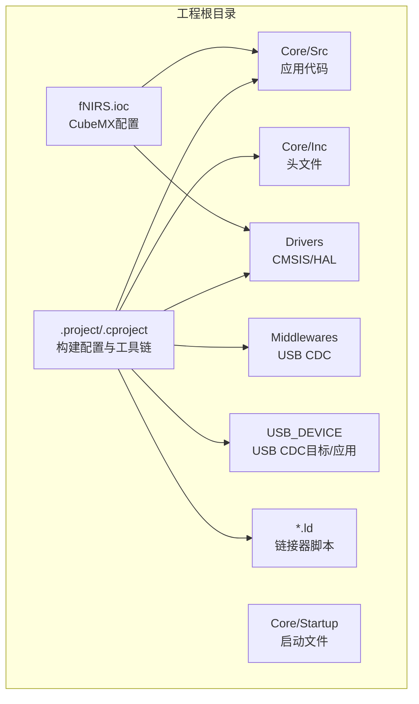
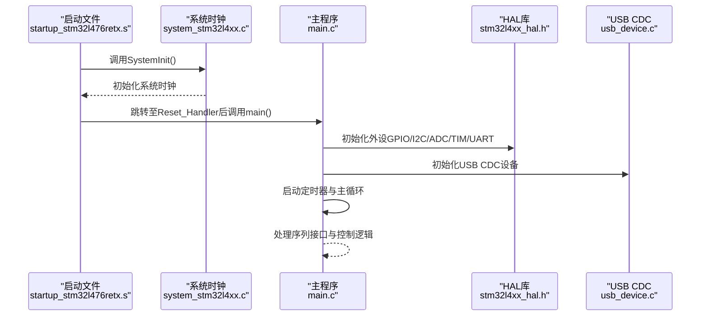
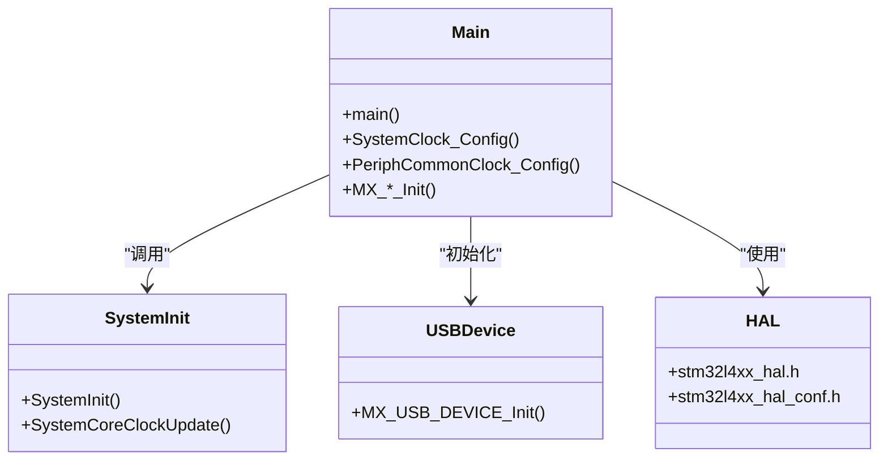
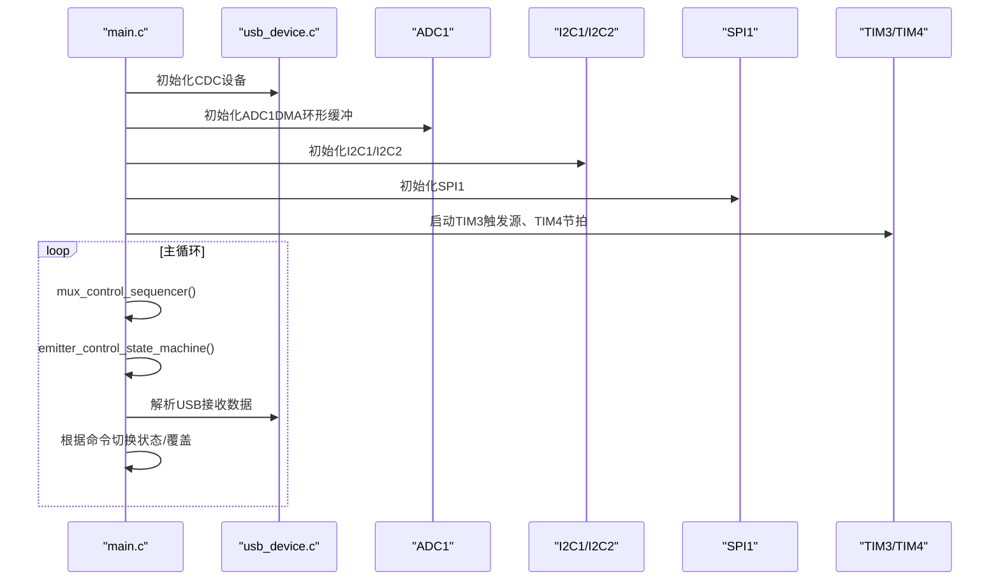
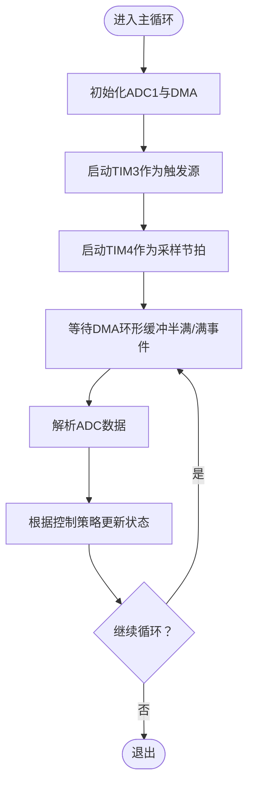
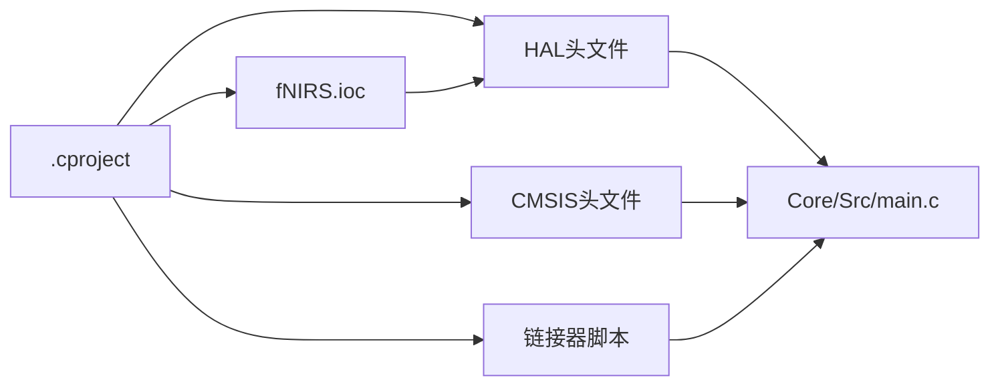

# 开发环境搭建

<cite>
**本文引用的文件**
- [firmware\README.md](file://firmware/README.md)
- [firmware\STM32\fNIRS\.project](file://firmware/STM32/fNIRS/.project)
- [firmware\STM32\fNIRS\.cproject](file://firmware/STM32/fNIRS/.cproject)
- [firmware\STM32\fNIRS\fNIRS.ioc](file://firmware/STM32/fNIRS/fNIRS.ioc)
- [firmware\STM32\fNIRS\STM32L476RETX_FLASH.ld](file://firmware/STM32/fNIRS/STM32L476RETX_FLASH.ld)
- [firmware\STM32\fNIRS\STM32L476RETX_RAM.ld](file://firmware/STM32/fNIRS/STM32L476RETX_RAM.ld)
- [firmware\STM32\fNIRS\Core\Src\main.c](file://firmware/STM32/fNIRS/Core/Src/main.c)
- [firmware\STM32\fNIRS\Core\Src\system_stm32l4xx.c](file://firmware/STM32/fNIRS/Core/Src/system_stm32l4xx.c)
- [firmware\STM32\fNIRS\Core\Inc\main.h](file://firmware/STM32/fNIRS/Core/Inc/main.h)
- [firmware\STM32\fNIRS\Core\Startup\startup_stm32l476retx.s](file://firmware/STM32/fNIRS/Core/Startup/startup_stm32l476retx.s)
- [firmware\STM32\fNIRS\Drivers\CMSIS\Device\ST\STM32L4xx\License.md](file://firmware/STM32/fNIRS/Drivers/CMSIS/Device/ST/STM32L4xx/License.md)
- [firmware\STM32\fNIRS\Drivers\STM32L4xx_HAL_Driver\Inc\stm32l4xx_hal.h](file://firmware/STM32/fNIRS/Drivers/STM32L4xx_HAL_Driver/Inc/stm32l4xx_hal.h)
- [firmware\STM32\fNIRS\Core\Inc\stm32l4xx_hal_conf.h](file://firmware/STM32/fNIRS/Core/Inc/stm32l4xx_hal_conf.h)
- [firmware\STM32\fNIRS\USB_DEVICE\App\usb_device.c](file://firmware/STM32/fNIRS/USB_DEVICE/App/usb_device.c)
</cite>

## 目录
1. [简介](#简介)
2. [项目结构](#项目结构)
3. [核心组件](#核心组件)
4. [架构总览](#架构总览)
5. [详细组件分析](#详细组件分析)
6. [依赖关系分析](#依赖关系分析)
7. [性能考虑](#性能考虑)
8. [故障排查指南](#故障排查指南)
9. [结论](#结论)
10. [附录](#附录)

## 简介
本指南面向fNIRS固件开发者，围绕STM32CubeIDE开发环境的安装与配置展开，覆盖工具链设置、项目导入、编译与下载流程、STM32CubeMX配置文件（.ioc）的使用方法，以及项目文件结构（链接器脚本、启动文件、HAL配置等）。同时提供常见问题排查建议与版本兼容性提示，帮助快速搭建稳定可靠的嵌入式开发环境。

## 项目结构
fNIRS固件位于仓库的 firmware/STM32/fNIRS 目录中，采用STM32CubeIDE标准工程组织方式：
- Core：应用入口、系统初始化、外设初始化与主循环
- Drivers：CMSIS与HAL驱动
- Middlewares：USB CDC设备栈
- USB_DEVICE：USB CDC相关目标层与应用层
- Startup：启动文件
- 链接器脚本：FLASH与RAM两种模式

图表来源
- [firmware\STM32\fNIRS\.cproject](file://firmware/STM32/fNIRS/.cproject#L1-L189)
- [firmware\STM32\fNIRS\fNIRS.ioc](file://firmware/STM32/fNIRS/fNIRS.ioc#L1-L335)
- [firmware\STM32\fNIRS\STM32L476RETX_FLASH.ld](file://firmware/STM32/fNIRS/STM32L476RETX_FLASH.ld#L1-L190)

章节来源
- [firmware\STM32\fNIRS\.project](file://firmware/STM32/fNIRS/.project#L1-L33)
- [firmware\STM32\fNIRS\.cproject](file://firmware/STM32/fNIRS/.cproject#L1-L189)
- [firmware\STM32\fNIRS\fNIRS.ioc](file://firmware/STM32/fNIRS/fNIRS.ioc#L1-L335)

## 核心组件
- 启动与系统时钟：启动文件负责向量表、堆栈与复位处理；system_stm32l4xx.c提供SystemInit/SystemCoreClockUpdate实现
- 主程序：main.c完成外设初始化、模块初始化、定时器启动与主循环逻辑
- HAL与CMSIS：通过stm32l4xx_hal.h与stm32l4xx_hal_conf.h启用所需模块
- USB CDC：USB_DEVICE/App/usb_device.c初始化CDC类，提供串口虚拟化能力
- 链接器脚本：STM32L476RETX_FLASH.ld与STM32L476RETX_RAM.ld分别用于Flash烧写与RAM调试

章节来源
- [firmware\STM32\fNIRS\Core\Src\system_stm32l4xx.c](file://firmware/STM32/fNIRS/Core/Src/system_stm32l4xx.c#L1-L333)
- [firmware\STM32\fNIRS\Core\Src\main.c](file://firmware/STM32/fNIRS/Core/Src/main.c#L1-L741)
- [firmware\STM32\fNIRS\Drivers\CMSIS\Device\ST\STM32L4xx\License.md](file://firmware/STM32/fNIRS/Drivers/CMSIS/Device/ST/STM32L4xx/License.md)
- [firmware\STM32\fNIRS\Drivers\STM32L4xx_HAL_Driver\Inc\stm32l4xx_hal.h](file://firmware/STM32/fNIRS/Drivers/STM32L4xx_HAL_Driver/Inc/stm32l4xx_hal.h#L1-L200)
- [firmware\STM32\fNIRS\Core\Inc\stm32l4xx_hal_conf.h](file://firmware/STM32/fNIRS/Core/Inc/stm32l4xx_hal_conf.h#L1-L200)
- [firmware\STM32\fNIRS\USB_DEVICE\App\usb_device.c](file://firmware/STM32/fNIRS/USB_DEVICE/App/usb_device.c#L1-L101)

## 架构总览
下图展示从上电到主循环执行的关键路径，以及关键外设与中间件的交互：

图表来源
- [firmware\STM32\fNIRS\Core\Startup\startup_stm32l476retx.s](file://firmware/STM32/fNIRS/Core/Startup/startup_stm32l476retx.s#L58-L106)
- [firmware\STM32\fNIRS\Core\Src\system_stm32l4xx.c](file://firmware/STM32/fNIRS/Core/Src/system_stm32l4xx.c#L197-L208)
- [firmware\STM32\fNIRS\Core\Src\main.c](file://firmware/STM32/fNIRS/Core/Src/main.c#L92-L181)
- [firmware\STM32\fNIRS\USB_DEVICE\App\usb_device.c](file://firmware/STM32/fNIRS/USB_DEVICE/App/usb_device.c#L65-L91)

## 详细组件分析

### STM32CubeIDE安装与项目导入
- 安装STM32CubeIDE并打开工作空间至 firmware/STM32/
- 导入现有工程：选择“File → Import → General → Existing Projects into Workspace”，选择fNIRS工程目录
- 清理并构建：在菜单中执行“Project → Clean”，再执行“Build Project”
- 下载与调试：通过ST-Link或Nucleo连接目标板，选择Run/Debug配置进行下载与调试

章节来源
- [firmware\README.md](file://firmware/README.md#L1-L17)

### 工具链与构建配置
- 工具链：工程使用GNU ARM Embedded Toolchain（arm-none-eabi-），由STM32CubeIDE管理
- MCU型号：STM32L476RET6（在.cproject与.ioc中均明确）
- 调试器：JTAG/SWD（PA13/PA14/JTMS/JTCK；PB3/JTDO；PB4/NJTRST）
- 编译选项：Debug/Release两套配置，包含宏定义、包含路径、链接脚本等

章节来源
- [firmware\STM32\fNIRS\.cproject](file://firmware/STM32/fNIRS/.cproject#L20-L27)
- [firmware\STM32\fNIRS\.cproject](file://firmware/STM32/fNIRS/.cproject#L106-L112)
- [firmware\STM32\fNIRS\fNIRS.ioc](file://firmware/STM32/fNIRS/fNIRS.ioc#L66-L117)

### STM32CubeMX配置文件（.ioc）详解
- 设备与封装：STM32L476R(C-E-G)Tx / LQFP64
- 外设配置要点：
  - ADC1：多通道规则转换、DMA环形缓冲、外部触发来自TIM3
  - I2C1/I2C2：Fast模式，Timing参数已配置
  - SPI1：主模式、双线全双工、波特率计算
  - USART1：异步模式、115200-8N1
  - TIM3/TIM4：TIM3作为ADC触发源，TIM4作为采样序列节拍
  - USB_OTG_FS：设备模式，USB_DEVICE使用CDC类
- 引脚分配：SWD、I2C、SPI、USART、LED、SD检测等均有明确信号映射
- 时钟树：PLL与PLLSAI1配置，确保ADC与USB时钟满足需求

章节来源
- [firmware\STM32\fNIRS\fNIRS.ioc](file://firmware/STM32/fNIRS/fNIRS.ioc#L66-L117)
- [firmware\STM32\fNIRS\fNIRS.ioc](file://firmware\STM32\fNIRS\fNIRS.ioc#L1-L335)

### 项目文件结构与关键文件
- Core/Src：应用入口、系统初始化、外设初始化函数、主循环
- Core/Inc：公共头文件、外设引脚定义
- Core/Startup：启动文件，包含向量表、Reset_Handler、默认异常处理
- Drivers：CMSIS与HAL驱动头文件与实现
- USB_DEVICE：USB CDC描述符、接口与目标层
- *.ld：链接器脚本，定义内存布局、段放置与堆栈大小

章节来源
- [firmware\STM32\fNIRS\Core\Src\main.c](file://firmware/STM32/fNIRS/Core/Src/main.c#L1-L741)
- [firmware\STM32\fNIRS\Core\Inc\main.h](file://firmware/STM32/fNIRS/Core/Inc/main.h#L1-L80)
- [firmware\STM32\fNIRS\Core\Startup\startup_stm32l476retx.s](file://firmware/STM32/fNIRS/Core/Startup/startup_stm32l476retx.s#L1-L512)
- [firmware\STM32\fNIRS\STM32L476RETX_FLASH.ld](file://firmware/STM32/fNIRS/STM32L476RETX_FLASH.ld#L1-L190)
- [firmware\STM32\fNIRS\STM32L476RETX_RAM.ld](file://firmware/STM32/fNIRS/STM32L476RETX_RAM.ld#L1-L190)

### 类关系与模块交互（代码级）

图表来源
- [firmware\STM32\fNIRS\Core\Src\main.c](file://firmware/STM32/fNIRS/Core/Src/main.c#L92-L181)
- [firmware\STM32\fNIRS\Core\Src\system_stm32l4xx.c](file://firmware/STM32/fNIRS/Core/Src/system_stm32l4xx.c#L197-L208)
- [firmware\STM32\fNIRS\USB_DEVICE\App\usb_device.c](file://firmware/STM32/fNIRS/USB_DEVICE/App/usb_device.c#L65-L91)
- [firmware\STM32\fNIRS\Drivers\CMSIS\Device\ST\STM32L4xx\License.md](file://firmware/STM32/fNIRS/Drivers/CMSIS/Device/ST/STM32L4xx/License.md)
- [firmware\STM32\fNIRS\Drivers\STM32L4xx_HAL_Driver\Inc\stm32l4xx_hal.h](file://firmware/STM32/fNIRS/Drivers/STM32L4xx_HAL_Driver/Inc/stm32l4xx_hal.h#L1-L200)
- [firmware\STM32\fNIRS\Core\Inc\stm32l4xx_hal_conf.h](file://firmware/STM32/fNIRS/Core/Inc/stm32l4xx_hal_conf.h#L1-L200)

### API/服务组件调用序列（主循环）

图表来源
- [firmware\STM32\fNIRS\Core\Src\main.c](file://firmware/STM32/fNIRS/Core/Src/main.c#L126-L178)
- [firmware\STM32\fNIRS\USB_DEVICE\App\usb_device.c](file://firmware/STM32/fNIRS/USB_DEVICE/App/usb_device.c#L65-L91)

### 复杂逻辑流程（ADC DMA环形采集）

图表来源
- [firmware\STM32\fNIRS\fNIRS.ioc](file://firmware/STM32/fNIRS/fNIRS.ioc#L47-L57)
- [firmware\STM32\fNIRS\fNIRS.ioc](file://firmware/STM32/fNIRS/fNIRS.ioc#L307-L316)
- [firmware\STM32\fNIRS\Core\Src\main.c](file://firmware/STM32/fNIRS/Core/Src/main.c#L140-L141)

## 依赖关系分析
- 工程依赖关系：.cproject声明了包含路径、宏定义、链接脚本与工具链；.ioc定义了外设与引脚映射；startup与system文件为运行时基础
- HAL与CMSIS：通过stm32l4xx_hal_conf.h启用所需模块，stm32l4xx_hal.h提供统一接口
- USB CDC：usb_device.c注册CDC类与接口，提供虚拟串口功能

图表来源
- [firmware\STM32\fNIRS\.cproject](file://firmware/STM32/fNIRS/.cproject#L45-L55)
- [firmware\STM32\fNIRS\fNIRS.ioc](file://firmware/STM32/fNIRS/fNIRS.ioc#L211-L222)
- [firmware\STM32\fNIRS\Drivers\CMSIS\Device\ST\STM32L4xx\License.md](file://firmware/STM32/fNIRS/Drivers/CMSIS/Device/ST/STM32L4xx/License.md)
- [firmware\STM32\fNIRS\Drivers\STM32L4xx_HAL_Driver\Inc\stm32l4xx_hal.h](file://firmware/STM32/fNIRS/Drivers/STM32L4xx_HAL_Driver/Inc/stm32l4xx_hal.h#L1-L200)

章节来源
- [firmware\STM32\fNIRS\.cproject](file://firmware/STM32/fNIRS/.cproject#L1-L189)
- [firmware\STM32\fNIRS\fNIRS.ioc](file://firmware/STM32/fNIRS/fNIRS.ioc#L1-L335)

## 性能考虑
- 时钟配置：系统采用PLL至80MHz，ADC与USB使用PLLSAI1分频输出，满足高精度与实时性需求
- DMA环形缓冲：ADC1使用DMA环形模式，降低CPU占用，提升采样吞吐
- 优化等级：Release配置默认开启优化级别，Debug配置便于调试
- 堆栈与堆：链接器脚本预留最小堆与栈大小，可根据实际需求调整

章节来源
- [firmware\STM32\fNIRS\Core\Src\system_stm32l4xx.c](file://firmware/STM32/fNIRS/Core/Src/system_stm32l4xx.c#L187-L257)
- [firmware\STM32\fNIRS\fNIRS.ioc](file://firmware/STM32/fNIRS/fNIRS.ioc#L233-L281)
- [firmware\STM32\fNIRS\STM32L476RETX_FLASH.ld](file://firmware/STM32/fNIRS/STM32L476RETX_FLASH.ld#L42-L43)

## 故障排查指南
- 编译错误
  - 检查.cproject中的包含路径与宏定义是否完整
  - 确认HAL模块启用与头文件路径正确
  - 若出现未定义符号，检查链接器脚本与源码分组
- 运行时错误
  - 使用SystemCoreClockUpdate确认系统频率
  - 检查USB CDC初始化是否成功（USBD_Init/USBD_RegisterClass）
- 调试器连接问题
  - 确认SWD引脚（PA13/PA14/JTMS/JTCK）与目标板一致
  - 检查ST-Link供电与目标板电源
  - 若无法复位，尝试复位引脚（PB4/NJTRST）

章节来源
- [firmware\STM32\fNIRS\.cproject](file://firmware/STM32/fNIRS/.cproject#L45-L55)
- [firmware\STM32\fNIRS\Core\Src\system_stm32l4xx.c](file://firmware/STM32/fNIRS/Core/Src/system_stm32l4xx.c#L251-L317)
- [firmware\STM32\fNIRS\USB_DEVICE\App\usb_device.c](file://firmware/STM32/fNIRS/USB_DEVICE/App/usb_device.c#L72-L87)
- [firmware\STM32\fNIRS\Core\Startup\startup_stm32l476retx.s](file://firmware/STM32/fNIRS/Core/Startup/startup_stm32l476retx.s#L140-L149)

## 结论
本指南基于仓库中的.cproject、.ioc与源码文件，梳理了STM32CubeIDE开发环境的安装与配置流程、CubeMX配置要点、项目文件结构与关键组件，并提供了常见问题的排查思路。遵循上述步骤可快速完成开发环境搭建并稳定运行fNIRS固件。

## 附录
- 版本与兼容性
  - MCU：STM32L476RET6
  - CubeMX版本：6.13.0
  - HAL固件包：STM32Cube FW_L4 V1.18.1
  - CMSIS许可：随Drivers/CMSIS/Device/ST/STM32L4xx/License.md提供

章节来源
- [firmware\STM32\fNIRS\fNIRS.ioc](file://firmware/STM32/fNIRS/fNIRS.ioc#L118-L211)
- [firmware\STM32\fNIRS\Drivers\CMSIS\Device\ST\STM32L4xx\License.md](file://firmware/STM32/fNIRS/Drivers/CMSIS/Device/ST/STM32L4xx/License.md)