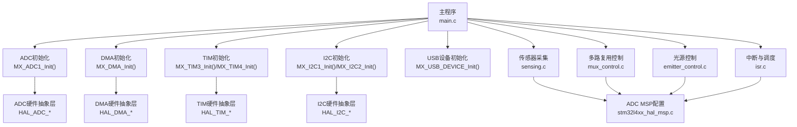
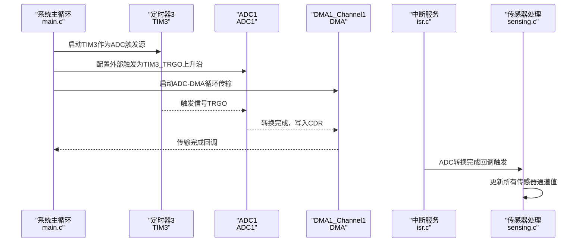
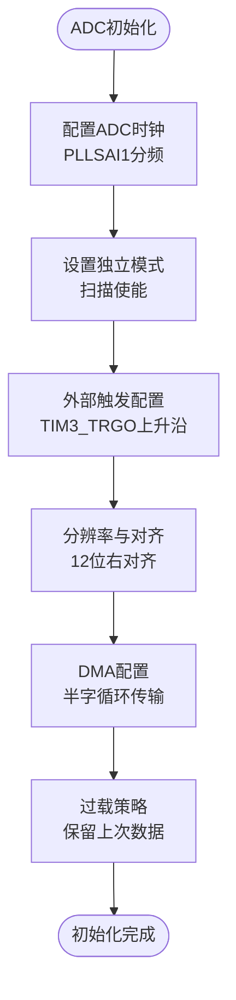
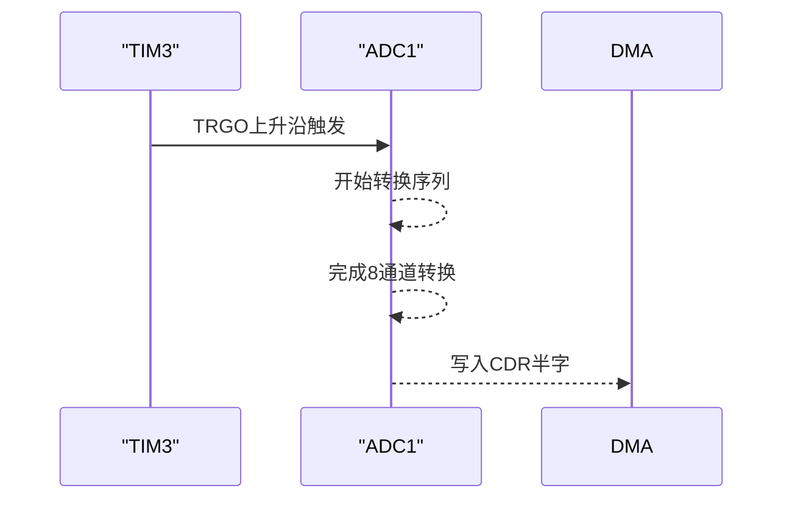
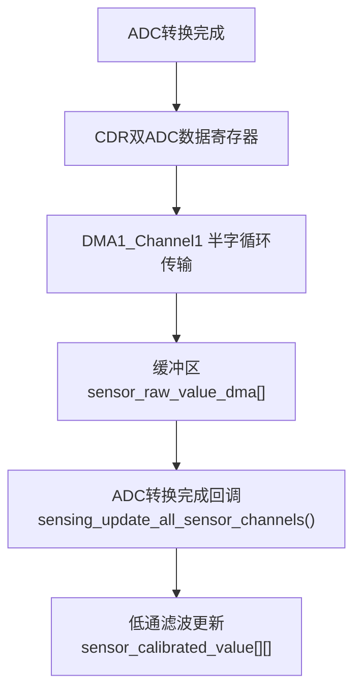
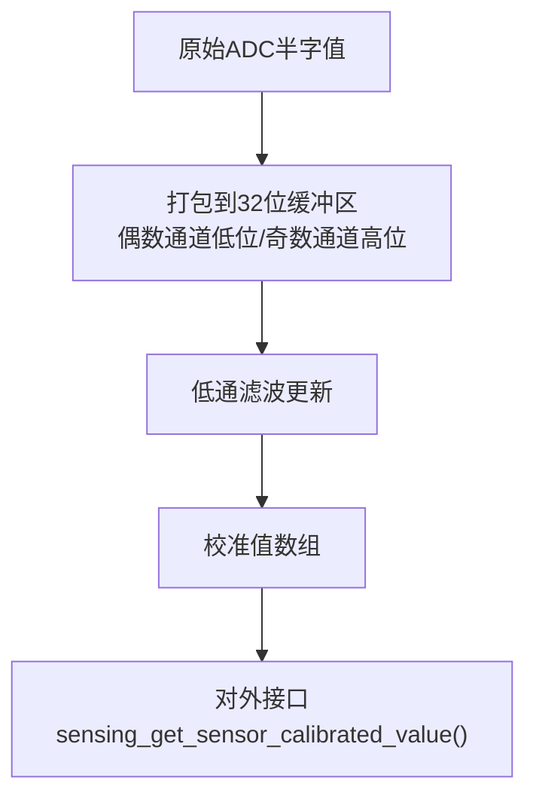
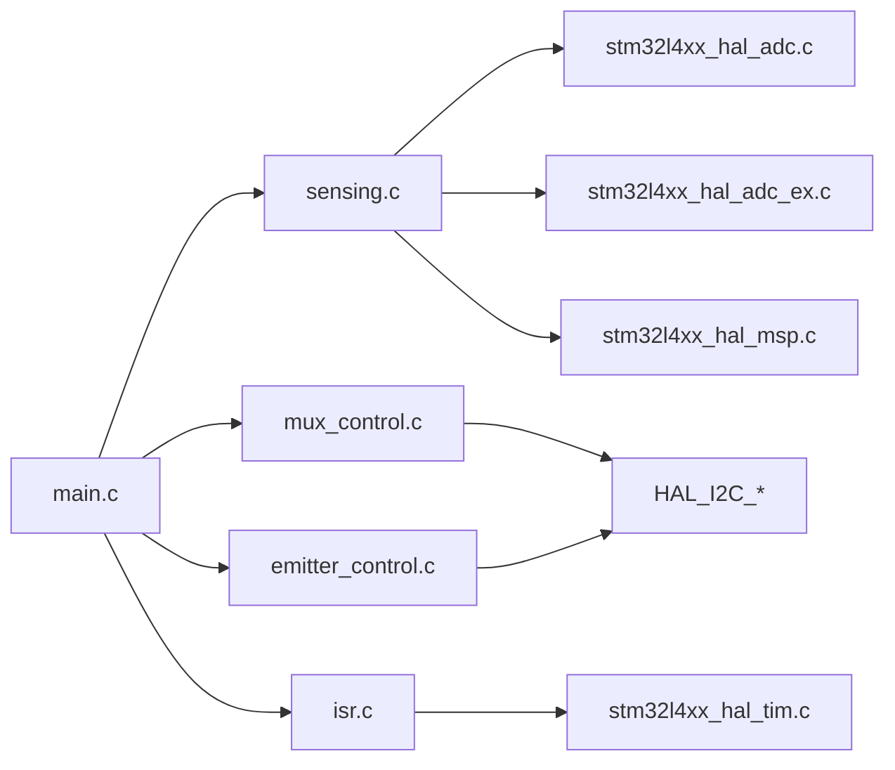

# 数据采集模块

<cite>
**本文引用的文件**
- [main.c](file://firmware/STM32/fNIRS/Core/Src/main.c)
- [sensing.c](file://firmware/STM32/fNIRS/Core/Src/sensing.c)
- [sensing.h](file://firmware/STM32/fNIRS/Core/Inc/sensing.h)
- [mux_control.c](file://firmware/STM32/fNIRS/Core/Src/mux_control.c)
- [mux_control.h](file://firmware/STM32/fNIRS/Core/Inc/mux_control.h)
- [emitter_control.c](file://firmware/STM32/fNIRS/Core/Src/emitter_control.c)
- [emitter_control.h](file://firmware/STM32/fNIRS/Core/Inc/emitter_control.h)
- [isr.c](file://firmware/STM32/fNIRS/Core/Src/isr.c)
- [isr.h](file://firmware/STM32/fNIRS/Core/Inc/isr.h)
- [stm32l4xx_hal_msp.c](file://firmware/STM32/fNIRS/Core/Src/stm32l4xx_hal_msp.c)
- [stm32l4xx_hal_adc.c](file://firmware/STM32/fNIRS/Drivers/STM32L4xx_HAL_Driver/Src/stm32l4xx_hal_adc.c)
- [stm32l4xx_hal_adc_ex.c](file://firmware/STM32/fNIRS/Drivers/STM32L4xx_HAL_Driver/Src/stm32l4xx_hal_adc_ex.c)
- [stm32l4xx_hal_tim.c](file://firmware/STM32/fNIRS/Drivers/STM32L4xx_HAL_Driver/Src/stm32l4xx_hal_tim.c)
- [fNIRS.ioc](file://firmware/STM32/fNIRS/fNIRS.ioc)
</cite>

## 目录
1. [引言](#引言)
2. [项目结构](#项目结构)
3. [核心组件](#核心组件)
4. [架构总览](#架构总览)
5. [详细组件分析](#详细组件分析)
6. [依赖关系分析](#依赖关系分析)
7. [性能考虑](#性能考虑)
8. [故障诊断指南](#故障诊断指南)
9. [结论](#结论)
10. [附录](#附录)

## 引言
本技术文档聚焦于fNIRS数据采集模块，围绕ADC配置与初始化、多通道扫描、采样时间设置、DMA传输、ADC采样时序控制（触发源、连续转换、外部触发）、DMA数据传输机制（缓冲区管理、传输完成中断、数据完整性）、ADC数据格式化与预处理（对齐、数值转换、滤波）、采样率计算、信噪比优化与实时性保障策略，以及性能调优与故障诊断方法进行系统化阐述。文档以实际源码为依据，辅以图示帮助读者快速建立对系统工作原理与实现细节的理解。

## 项目结构
数据采集模块位于STM32固件工程的Core目录下，采用分层设计：
- 系统入口与外设初始化：main.c负责系统时钟、外设时钟配置、ADC/DMA/TIM/I2C/UART等初始化，并启动传感器与光源控制子系统。
- 数据采集与处理：sensing.c封装ADC DMA读取、多路复用器通道切换、传感器数据更新与滤波。
- 控制逻辑：mux_control.c负责模拟多路复用器的通道序列与覆盖控制；emitter_control.c负责光源PWM驱动与状态机。
- 中断与调度：isr.c提供1kHz与5kHz定时中断回调，协调数据发送与ADC转换完成事件。
- HAL与外设：stm32l4xx_hal_*提供底层驱动，包括ADC、ADC扩展、TIM等。

**图表来源**
- [main.c](file://firmware/STM32/fNIRS/Core/Src/main.c#L118-L129)
- [stm32l4xx_hal_msp.c](file://firmware/STM32/fNIRS/Core/Src/stm32l4xx_hal_msp.c#L87-L154)

**章节来源**
- [main.c](file://firmware/STM32/fNIRS/Core/Src/main.c#L118-L129)
- [stm32l4xx_hal_msp.c](file://firmware/STM32/fNIRS/Core/Src/stm32l4xx_hal_msp.c#L87-L154)

## 核心组件
- ADC与DMA：配置ADC为扫描模式、外部触发、DMA循环传输，DMA直接从ADC共用数据寄存器读取半字数据到缓冲区。
- 多路复用器：通过I2C控制GPIO扩展器，按固定周期轮询选择输入通道，支持覆盖模式。
- 光源控制：基于PWM驱动芯片的状态机，支持默认模式、用户控制、循环模式、单一波长全开等。
- 中断与调度：TIM4产生1kHz节拍用于发射器控制状态机推进；TIM3作为ADC触发源，通过TIM3_TRGO输出触发ADC转换；ADC转换完成回调更新所有传感器通道数据。

**章节来源**
- [sensing.c](file://firmware/STM32/fNIRS/Core/Src/sensing.c#L50-L84)
- [mux_control.c](file://firmware/STM32/fNIRS/Core/Src/mux_control.c#L146-L229)
- [emitter_control.c](file://firmware/STM32/fNIRS/Core/Src/emitter_control.c#L183-L278)
- [isr.c](file://firmware/STM32/fNIRS/Core/Src/isr.c#L34-L52)

## 架构总览
数据流自上而下分为三层：
- 应用层：主循环中启动各子系统，处理串口命令并驱动状态机。
- 控制层：多路复用器与光源控制通过定时中断推进状态机。
- 采集层：ADC由TIM3 TRGO触发，DMA循环读取8个通道的半字数据，ADC完成回调更新传感器值。

**图表来源**
- [main.c](file://firmware/STM32/fNIRS/Core/Src/main.c#L140-L141)
- [sensing.c](file://firmware/STM32/fNIRS/Core/Src/sensing.c#L50-L84)
- [isr.c](file://firmware/STM32/fNIRS/Core/Src/isr.c#L48-L52)

## 详细组件分析

### ADC配置与初始化
- ADC时钟与电源：使用PLLSAI1分频输出作为ADC时钟，确保稳定且可预测的采样速率。
- 模式与扫描：独立模式，扫描使能，8个通道依次转换，顺序结束中断。
- 触发源：外部触发配置为TIM3_TRGO上升沿，实现与定时器同步的精确采样。
- 数据对齐与分辨率：右对齐12位分辨率，DMA以半字宽度读取，适配CDR双ADC共用缓冲。
- DMA连续请求：启用DMA连续请求，配合循环模式实现无间断采集。
- 过载保护：保留上次数据以防溢出，避免丢失最新样本。

**图表来源**
- [main.c](file://firmware/STM32/fNIRS/Core/Src/main.c#L264-L387)
- [fNIRS.ioc](file://firmware/STM32/fNIRS/fNIRS.ioc#L12-L15)

**章节来源**
- [main.c](file://firmware/STM32/fNIRS/Core/Src/main.c#L264-L387)
- [fNIRS.ioc](file://firmware/STM32/fNIRS/fNIRS.ioc#L12-L15)

### 多通道扫描配置与采样时间
- 通道映射：8个ADC通道分别映射至不同传感器模块，形成交错采样布局。
- 采样时间：通道采样时间为47.5个ADC周期，兼顾精度与吞吐量。
- 扫描顺序：通道按固定顺序排列，确保相邻通道在时间上紧密相邻，便于差分或同步处理。

**章节来源**
- [sensing.c](file://firmware/STM32/fNIRS/Core/Src/sensing.c#L14-L22)
- [main.c](file://firmware/STM32/fNIRS/Core/Src/main.c#L308-L382)

### ADC采样时序控制
- 触发源：TIM3作为主触发源，配置为向上计数，周期与预分频决定触发频率。
- 外部触发：ADC外部触发配置为TIM3_TRGO，上升沿触发转换。
- 连续转换：当前配置为禁用连续转换，依赖外部触发序列化转换。
- 同步：通过TIM3与ADC的同步配置，确保触发信号稳定可靠。

**图表来源**
- [main.c](file://firmware/STM32/fNIRS/Core/Src/main.c#L530-L567)
- [main.c](file://firmware/STM32/fNIRS/Core/Src/main.c#L290-L291)

**章节来源**
- [main.c](file://firmware/STM32/fNIRS/Core/Src/main.c#L530-L567)
- [main.c](file://firmware/STM32/fNIRS/Core/Src/main.c#L290-L291)

### DMA数据传输机制
- DMA通道：DMA1_Channel1，外设到内存，半字对齐，递增内存地址，循环模式。
- 缓冲区：DMA直接写入32位数组，每个元素包含两个通道的半字值（低位偶数通道，高位奇数通道）。
- 中断与回调：ADC转换完成回调触发，更新传感器校准值；DMA溢出中断在HAL层处理。
- 数据完整性：启用DMA连续请求与过载保留策略，降低数据丢失风险。

**图表来源**
- [stm32l4xx_hal_adc.c](file://firmware/STM32/fNIRS/Drivers/STM32L4xx_HAL_Driver/Src/stm32l4xx_hal_adc.c#L3555-L3578)
- [stm32l4xx_hal_adc_ex.c](file://firmware/STM32/fNIRS/Drivers/STM32L4xx_HAL_Driver/Src/stm32l4xx_hal_adc_ex.c#L917-L941)
- [sensing.c](file://firmware/STM32/fNIRS/Core/Src/sensing.c#L73-L84)

**章节来源**
- [stm32l4xx_hal_msp.c](file://firmware/STM32/fNIRS/Core/Src/stm32l4xx_hal_msp.c#L127-L143)
- [stm32l4xx_hal_adc.c](file://firmware/STM32/fNIRS/Drivers/STM32L4xx_HAL_Driver/Src/stm32l4xx_hal_adc.c#L3555-L3578)
- [stm32l4xx_hal_adc_ex.c](file://firmware/STM32/fNIRS/Drivers/STM32L4xx_HAL_Driver/Src/stm32l4xx_hal_adc_ex.c#L917-L941)
- [sensing.c](file://firmware/STM32/fNIRS/Core/Src/sensing.c#L73-L84)

### ADC数据格式化与预处理
- 数据对齐与打包：DMA以半字写入32位缓冲区，偶数通道在低位，奇数通道在高位，便于批量读取。
- 数值转换：当前实现未进行额外缩放或单位转换，保持原始ADC计数值。
- 噪声抑制：采用低通滤波器对相邻采样进行平滑，降低量化噪声与短期抖动。
- 温度与标定：预留温度传感器与标定系数数组，便于后续扩展。

**图表来源**
- [sensing.c](file://firmware/STM32/fNIRS/Core/Src/sensing.c#L45-L48)
- [sensing.c](file://firmware/STM32/fNIRS/Core/Src/sensing.c#L73-L84)
- [sensing.h](file://firmware/STM32/fNIRS/Core/Inc/sensing.h#L46-L61)

**章节来源**
- [sensing.c](file://firmware/STM32/fNIRS/Core/Src/sensing.c#L45-L48)
- [sensing.c](file://firmware/STM32/fNIRS/Core/Src/sensing.c#L73-L84)
- [sensing.h](file://firmware/STM32/fNIRS/Core/Inc/sensing.h#L46-L61)

### 采样率计算与实时性保障
- 触发频率：TIM3配置周期与预分频决定触发频率，从而确定采样率。
- 实时性：1kHz中断驱动发射器状态机，确保光源控制与时序一致；5kHz回调处理ADC转换完成事件，保证数据及时更新。
- 采样率估算：采样率 ≈ 触发频率（Hz），具体取决于TIM3的周期与预分频设置。

**章节来源**
- [main.c](file://firmware/STM32/fNIRS/Core/Src/main.c#L530-L567)
- [isr.c](file://firmware/STM32/fNIRS/Core/Src/isr.c#L34-L46)

### 信噪比优化与性能调优
- 采样时间：适当增加采样时间可提升信噪比，但会降低采样率。
- 低通滤波：合理设置滤波系数可在噪声抑制与响应速度间取得平衡。
- DMA与中断优先级：合理配置DMA与TIM中断优先级，减少抖动与丢帧。
- 多路复用器切换：缩短切换间隔可提高通道利用率，但需评估切换引入的噪声影响。

**章节来源**
- [main.c](file://firmware/STM32/fNIRS/Core/Src/main.c#L312-L312)
- [sensing.c](file://firmware/STM32/fNIRS/Core/Src/sensing.c#L45-L48)
- [stm32l4xx_hal_msp.c](file://firmware/STM32/fNIRS/Core/Src/stm32l4xx_hal_msp.c#L146-L147)

## 依赖关系分析
- 主程序依赖：系统时钟配置、外设时钟配置、ADC/DMA/TIM/I2C/UART初始化。
- 传感器模块依赖：ADC句柄、DMA句柄、多路复用器状态、定时器节拍。
- 控制模块依赖：I2C句柄、PWM驱动配置、串口接收状态。
- 中断模块依赖：TIM4中断回调、全局标志位管理。

**图表来源**
- [main.c](file://firmware/STM32/fNIRS/Core/Src/main.c#L118-L129)
- [sensing.c](file://firmware/STM32/fNIRS/Core/Src/sensing.c#L50-L56)
- [mux_control.c](file://firmware/STM32/fNIRS/Core/Src/mux_control.c#L146-L158)
- [emitter_control.c](file://firmware/STM32/fNIRS/Core/Src/emitter_control.c#L183-L189)
- [isr.c](file://firmware/STM32/fNIRS/Core/Src/isr.c#L34-L46)

**章节来源**
- [main.c](file://firmware/STM32/fNIRS/Core/Src/main.c#L118-L129)
- [sensing.c](file://firmware/STM32/fNIRS/Core/Src/sensing.c#L50-L56)
- [mux_control.c](file://firmware/STM32/fNIRS/Core/Src/mux_control.c#L146-L158)
- [emitter_control.c](file://firmware/STM32/fNIRS/Core/Src/emitter_control.c#L183-L189)
- [isr.c](file://firmware/STM32/fNIRS/Core/Src/isr.c#L34-L46)

## 性能考虑
- 采样率与带宽权衡：提高采样率可改善时域分辨率，但会增加CPU与DMA负载。
- DMA带宽：确保DMA总线带宽足以支撑循环传输速率，避免溢出。
- 中断优先级：合理分配TIM4与ADC中断优先级，避免相互抢占导致抖动。
- 低功耗与稳定性：在满足性能前提下，尽量使用较低频率与较短采样时间以降低功耗。

## 故障诊断指南
- ADC无数据：检查TIM3是否运行、TRGO是否输出、ADC外部触发配置是否正确。
- DMA溢出：确认DMA循环模式与缓冲区大小匹配，检查中断回调是否被屏蔽。
- 通道错位：核对DMA打包方式（偶数通道低位/奇数通道高位）与解包逻辑一致性。
- 多路复用器不切换：检查I2C通信、GPIO扩展器配置与覆盖开关状态。
- 光源控制异常：验证PWM驱动配置、使能引脚电平与状态机推进条件。

**章节来源**
- [stm32l4xx_hal_adc.c](file://firmware/STM32/fNIRS/Drivers/STM32L4xx_HAL_Driver/Src/stm32l4xx_hal_adc.c#L3555-L3578)
- [stm32l4xx_hal_adc_ex.c](file://firmware/STM32/fNIRS/Drivers/STM32L4xx_HAL_Driver/Src/stm32l4xx_hal_adc_ex.c#L917-L941)
- [mux_control.c](file://firmware/STM32/fNIRS/Core/Src/mux_control.c#L210-L223)
- [emitter_control.c](file://firmware/STM32/fNIRS/Core/Src/emitter_control.c#L220-L278)

## 结论
该数据采集模块通过TIM3触发ADC、DMA循环读取、ADC回调更新的方式，实现了多通道fNIRS信号的高效率采集。模块具备清晰的层次划分与稳定的时序控制，结合低通滤波与覆盖控制，能够在保证实时性的前提下提供较为稳健的数据质量。后续可在采样时间、滤波参数与中断优先级等方面进一步优化，以获得更佳的信噪比与更低的系统开销。

## 附录
- 关键宏与常量定义参考：见sensing.h中的传感器模块枚举与缓冲区声明。
- 外设初始化函数参考：见main.c中的MX_*系列初始化函数。
- 中断回调函数参考：见isr.c中的TIM与ADC回调实现。

**章节来源**
- [sensing.h](file://firmware/STM32/fNIRS/Core/Inc/sensing.h#L12-L71)
- [main.c](file://firmware/STM32/fNIRS/Core/Src/main.c#L653-L664)
- [isr.c](file://firmware/STM32/fNIRS/Core/Src/isr.c#L34-L52)