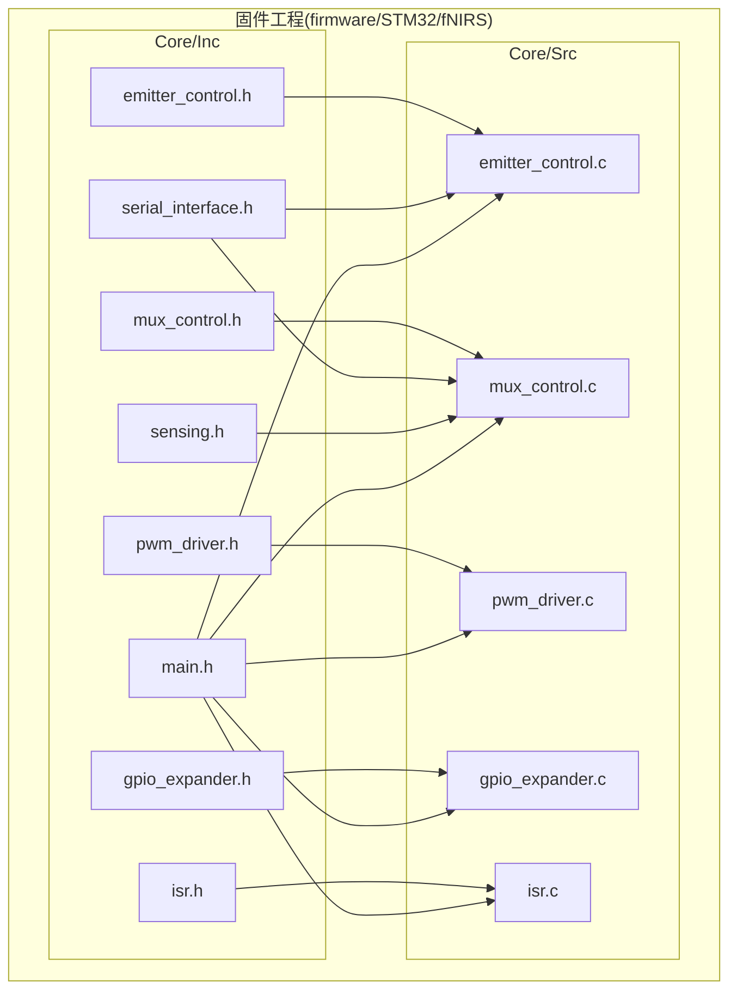
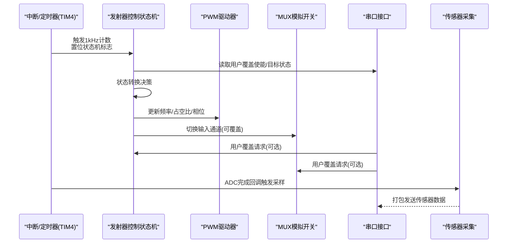
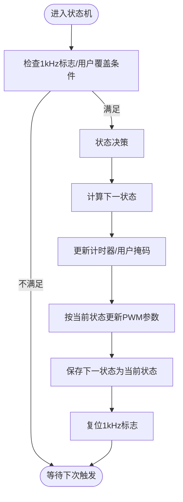
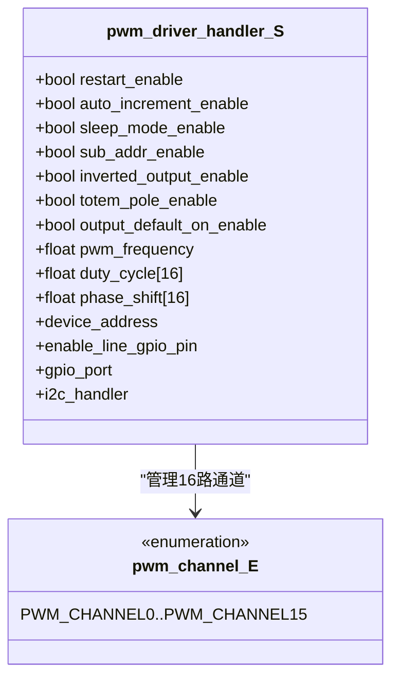
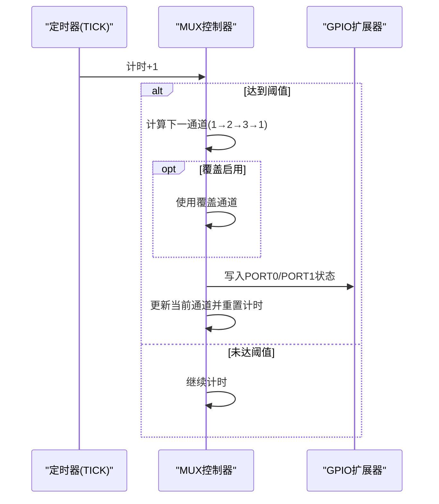
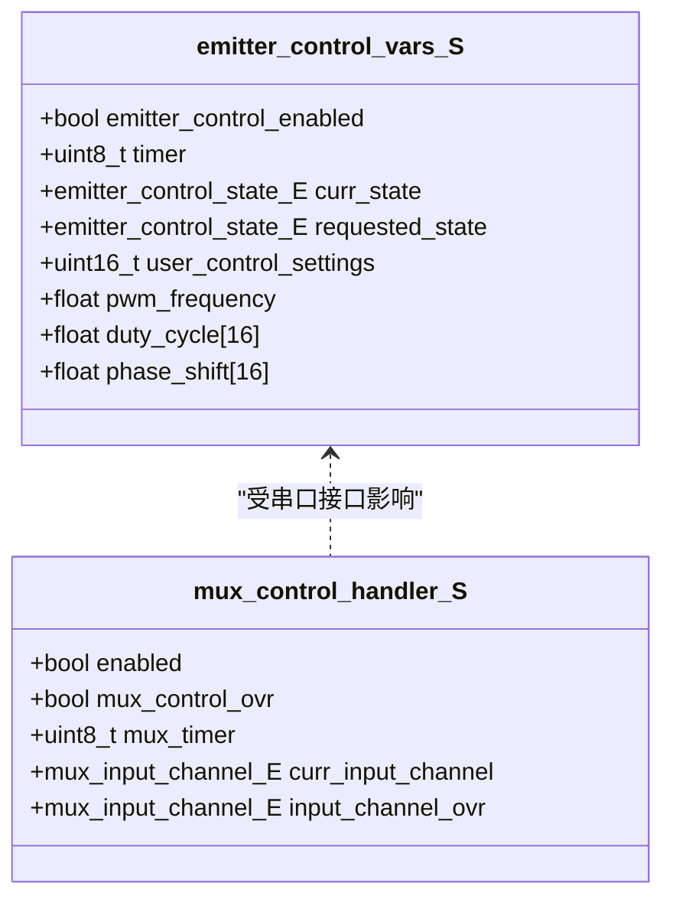
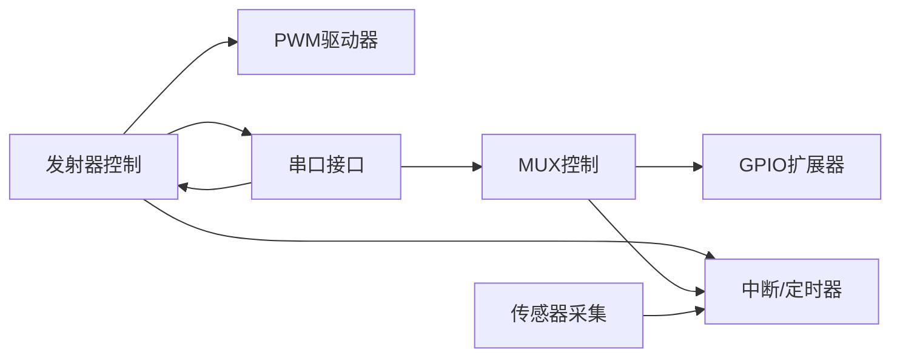

# 硬件控制模块

<cite>
**本文引用的文件**
- [firmware/STM32/fNIRS/Core/Inc/emitter_control.h](file://firmware/STM32/fNIRS/Core/Inc/emitter_control.h)
- [firmware/STM32/fNIRS/Core/Inc/mux_control.h](file://firmware/STM32/fNIRS/Core/Inc/mux_control.h)
- [firmware/STM32/fNIRS/Core/Inc/pwm_driver.h](file://firmware/STM32/fNIRS/Core/Inc/pwm_driver.h)
- [firmware/STM32/fNIRS/Core/Inc/gpio_expander.h](file://firmware/STM32/fNIRS/Core/Inc/gpio_expander.h)
- [firmware/STM32/fNIRS/Core/Inc/isr.h](file://firmware/STM32/fNIRS/Core/Inc/isr.h)
- [firmware/STM32/fNIRS/Core/Inc/serial_interface.h](file://firmware/STM32/fNIRS/Core/Inc/serial_interface.h)
- [firmware/STM32/fNIRS/Core/Inc/sensing.h](file://firmware/STM32/fNIRS/Core/Inc/sensing.h)
- [firmware/STM32/fNIRS/Core/Inc/main.h](file://firmware/STM32/fNIRS/Core/Inc/main.h)
- [firmware/STM32/fNIRS/Core/Src/emitter_control.c](file://firmware/STM32/fNIRS/Core/Src/emitter_control.c)
- [firmware/STM32/fNIRS/Core/Src/mux_control.c](file://firmware/STM32/fNIRS/Core/Src/mux_control.c)
- [firmware/STM32/fNIRS/Core/Src/pwm_driver.c](file://firmware/STM32/fNIRS/Core/Src/pwm_driver.c)
- [firmware/STM32/fNIRS/Core/Src/gpio_expander.c](file://firmware/STM32/fNIRS/Core/Src/gpio_expander.c)
- [firmware/STM32/fNIRS/Core/Src/isr.c](file://firmware/STM32/fNIRS/Core/Src/isr.c)
</cite>

## 目录
1. [简介](#简介)
2. [项目结构](#项目结构)
3. [核心组件](#核心组件)
4. [架构总览](#架构总览)
5. [详细组件分析](#详细组件分析)
6. [依赖关系分析](#依赖关系分析)
7. [性能考量](#性能考量)
8. [故障排查指南](#故障排查指南)
9. [结论](#结论)
10. [附录](#附录)

## 简介
本技术文档聚焦于fNIRS硬件控制模块，围绕发射器控制状态机、LED驱动与PWM功率调节、MUX模拟开关时序控制以及硬件控制接口设计进行深入解析。文档同时覆盖状态转换逻辑、优先级管理、实时响应策略、安全与保护机制、以及调试与诊断方法，帮助开发者在保证系统稳定性的前提下高效完成功能开发与维护。

## 项目结构
硬件控制模块位于固件工程的STM32子目录中，采用“按功能分层”的组织方式：接口头文件集中于Inc目录，具体实现位于Src目录；与之配套的传感器采集、串口通信等模块通过公共头文件进行松耦合集成。

**图表来源**
- [firmware/STM32/fNIRS/Core/Inc/emitter_control.h](file://firmware/STM32/fNIRS/Core/Inc/emitter_control.h#L1-L54)
- [firmware/STM32/fNIRS/Core/Inc/mux_control.h](file://firmware/STM32/fNIRS/Core/Inc/mux_control.h#L1-L56)
- [firmware/STM32/fNIRS/Core/Inc/pwm_driver.h](file://firmware/STM32/fNIRS/Core/Inc/pwm_driver.h#L1-L81)
- [firmware/STM32/fNIRS/Core/Inc/gpio_expander.h](file://firmware/STM32/fNIRS/Core/Inc/gpio_expander.h#L1-L49)
- [firmware/STM32/fNIRS/Core/Inc/isr.h](file://firmware/STM32/fNIRS/Core/Inc/isr.h#L1-L24)
- [firmware/STM32/fNIRS/Core/Inc/serial_interface.h](file://firmware/STM32/fNIRS/Core/Inc/serial_interface.h#L1-L64)
- [firmware/STM32/fNIRS/Core/Inc/sensing.h](file://firmware/STM32/fNIRS/Core/Inc/sensing.h#L1-L71)
- [firmware/STM32/fNIRS/Core/Inc/main.h](file://firmware/STM32/fNIRS/Core/Inc/main.h#L1-L80)
- [firmware/STM32/fNIRS/Core/Src/emitter_control.c](file://firmware/STM32/fNIRS/Core/Src/emitter_control.c#L1-L291)
- [firmware/STM32/fNIRS/Core/Src/mux_control.c](file://firmware/STM32/fNIRS/Core/Src/mux_control.c#L1-L252)
- [firmware/STM32/fNIRS/Core/Src/pwm_driver.c](file://firmware/STM32/fNIRS/Core/Src/pwm_driver.c#L1-L298)
- [firmware/STM32/fNIRS/Core/Src/gpio_expander.c](file://firmware/STM32/fNIRS/Core/Src/gpio_expander.c#L1-L87)
- [firmware/STM32/fNIRS/Core/Src/isr.c](file://firmware/STM32/fNIRS/Core/Src/isr.c#L1-L53)

**章节来源**
- [firmware/STM32/fNIRS/Core/Inc/main.h](file://firmware/STM32/fNIRS/Core/Inc/main.h#L60-L70)

## 核心组件
- 发射器控制状态机：负责管理发射器工作模式（禁用、空闲、默认模式、用户控制、循环扫描、全开660nm或940nm），并根据定时器标志与上位机指令更新PWM参数。
- PWM驱动器：通过PCA9555类设备（经I2C）对16路PWM通道进行频率、占空比与相位设置，并支持睡眠模式切换以调整频率。
- MUX模拟开关控制器：通过两个GPIO扩展器控制多路模拟开关，实现输入通道的顺序轮询与覆盖控制。
- 中断与定时：TIM4产生1kHz节拍，触发状态机与传感器数据采集回调。
- 串口通信接口：解析来自USB CDC的数据包，提供用户覆盖使能与目标状态/掩码下发能力。
- 传感器采集：基于ADC/DMA读取各传感器模块原始值并进行标定与温度监测。

**章节来源**
- [firmware/STM32/fNIRS/Core/Inc/emitter_control.h](file://firmware/STM32/fNIRS/Core/Inc/emitter_control.h#L13-L38)
- [firmware/STM32/fNIRS/Core/Inc/pwm_driver.h](file://firmware/STM32/fNIRS/Core/Inc/pwm_driver.h#L13-L62)
- [firmware/STM32/fNIRS/Core/Inc/mux_control.h](file://firmware/STM32/fNIRS/Core/Inc/mux_control.h#L13-L40)
- [firmware/STM32/fNIRS/Core/Inc/isr.h](file://firmware/STM32/fNIRS/Core/Inc/isr.h#L12-L16)
- [firmware/STM32/fNIRS/Core/Inc/serial_interface.h](file://firmware/STM32/fNIRS/Core/Inc/serial_interface.h#L12-L51)
- [firmware/STM32/fNIRS/Core/Inc/sensing.h](file://firmware/STM32/fNIRS/Core/Inc/sensing.h#L12-L61)

## 架构总览
硬件控制模块以“状态机驱动 + 设备抽象 + 通信接口”为核心，形成如下交互关系：

**图表来源**
- [firmware/STM32/fNIRS/Core/Src/isr.c](file://firmware/STM32/fNIRS/Core/Src/isr.c#L35-L52)
- [firmware/STM32/fNIRS/Core/Src/emitter_control.c](file://firmware/STM32/fNIRS/Core/Src/emitter_control.c#L220-L278)
- [firmware/STM32/fNIRS/Core/Src/pwm_driver.c](file://firmware/STM32/fNIRS/Core/Src/pwm_driver.c#L125-L154)
- [firmware/STM32/fNIRS/Core/Src/mux_control.c](file://firmware/STM32/fNIRS/Core/Src/mux_control.c#L170-L229)
- [firmware/STM32/fNIRS/Core/Src/serial_interface.h](file://firmware/STM32/fNIRS/Core/Inc/serial_interface.h#L55-L61)
- [firmware/STM32/fNIRS/Core/Src/sensing.h](file://firmware/STM32/fNIRS/Core/Inc/sensing.h#L64-L68)

## 详细组件分析

### 发射器控制状态机
- 状态定义：禁用(DISABLED)、空闲(IDLE)、默认模式(DEFAULT_MODE)、用户控制(USER_CONTROL)、循环扫描(CYCLING)、全开660nm/FULLY_ENABLED_660NM、全开940nm/FULLY_ENABLED_940NM。
- 关键变量：当前状态、请求状态、计时器、用户控制掩码、频率与各通道占空比/相位。
- 状态转换策略：
  - 基于使能标志与请求状态进行主状态迁移；
  - 在默认模式/用户控制/CYCLING之间保持运行，但允许被更高优先级的请求打断；
  - 当未启用时自动回退至禁用；
  - 定时器标志触发周期性更新。
- PWM更新策略：
  - 针对不同模式填充各通道占空比/相位；
  - 若频率变化则先进入睡眠再写入预分频，再退出睡眠；
  - 对每个通道分别更新ON/OFF计数寄存器，支持相位偏移与占空比裁剪。

**图表来源**
- [firmware/STM32/fNIRS/Core/Src/emitter_control.c](file://firmware/STM32/fNIRS/Core/Src/emitter_control.c#L220-L278)
- [firmware/STM32/fNIRS/Core/Src/emitter_control.c](file://firmware/STM32/fNIRS/Core/Src/emitter_control.c#L33-L181)
- [firmware/STM32/fNIRS/Core/Src/pwm_driver.c](file://firmware/STM32/fNIRS/Core/Src/pwm_driver.c#L125-L154)

**章节来源**
- [firmware/STM32/fNIRS/Core/Inc/emitter_control.h](file://firmware/STM32/fNIRS/Core/Inc/emitter_control.h#L13-L38)
- [firmware/STM32/fNIRS/Core/Src/emitter_control.c](file://firmware/STM32/fNIRS/Core/Src/emitter_control.c#L183-L218)
- [firmware/STM32/fNIRS/Core/Src/emitter_control.c](file://firmware/STM32/fNIRS/Core/Src/emitter_control.c#L220-L278)

### PWM驱动与功率调节
- PCA9555类设备通过I2C配置MODE1/MODE2寄存器，支持重启、自动增量、睡眠、子地址与输出极性等特性。
- 频率调节：内部振荡器频率固定，通过PRE_SCALE寄存器限制频率范围；需先进入睡眠后写入，再退出睡眠。
- 单通道与全通道更新：
  - 单通道：计算上升沿/下降沿计数值，写入对应LEDn_ON/H/L与LEDn_OFF/H/L寄存器；
  - 全通道：一次性写入ALL_LED_ON/H/L与ALL_LED_OFF/H/L寄存器，适用于统一占空比/相位场景。
- 异常保护：对占空比/相位进行边界裁剪，避免越界。

**图表来源**
- [firmware/STM32/fNIRS/Core/Inc/pwm_driver.h](file://firmware/STM32/fNIRS/Core/Inc/pwm_driver.h#L35-L62)
- [firmware/STM32/fNIRS/Core/Inc/pwm_driver.h](file://firmware/STM32/fNIRS/Core/Inc/pwm_driver.h#L13-L33)

**章节来源**
- [firmware/STM32/fNIRS/Core/Inc/pwm_driver.h](file://firmware/STM32/fNIRS/Core/Inc/pwm_driver.h#L35-L62)
- [firmware/STM32/fNIRS/Core/Src/pwm_driver.c](file://firmware/STM32/fNIRS/Core/Src/pwm_driver.c#L33-L83)
- [firmware/STM32/fNIRS/Core/Src/pwm_driver.c](file://firmware/STM32/fNIRS/Core/Src/pwm_driver.c#L125-L154)
- [firmware/STM32/fNIRS/Core/Src/pwm_driver.c](file://firmware/STM32/fNIRS/Core/Src/pwm_driver.c#L156-L220)
- [firmware/STM32/fNIRS/Core/Src/pwm_driver.c](file://firmware/STM32/fNIRS/Core/Src/pwm_driver.c#L222-L277)

### MUX模拟开关时序控制
- 控制器与通道：
  - 控制器：两个独立GPIO扩展器，分别管理一组MUX；
  - 输入通道：通道1~4与禁用状态；
  - 轮询序列：1→2→3→1（4号通道在硬件上无直接输入，作为特殊态）。
- I2C地址与端口映射：
  - 使用固定从地址并通过PORT0/PORT1写入对应的引脚状态掩码；
  - 不同通道对应不同的PORT0/PORT1组合，禁用时清零。
- 时序优化：
  - 使用计时器计数与阈值比较实现固定频率轮询；
  - 支持覆盖模式：当启用覆盖时，忽略轮询序列，直接应用指定通道；
  - 在切换GPIO前关闭中断，切换后恢复，降低切换毛刺风险。

**图表来源**
- [firmware/STM32/fNIRS/Core/Src/mux_control.c](file://firmware/STM32/fNIRS/Core/Src/mux_control.c#L170-L229)
- [firmware/STM32/fNIRS/Core/Src/mux_control.c](file://firmware/STM32/fNIRS/Core/Src/mux_control.c#L102-L144)

**章节来源**
- [firmware/STM32/fNIRS/Core/Inc/mux_control.h](file://firmware/STM32/fNIRS/Core/Inc/mux_control.h#L13-L40)
- [firmware/STM32/fNIRS/Core/Src/mux_control.c](file://firmware/STM32/fNIRS/Core/Src/mux_control.c#L146-L158)
- [firmware/STM32/fNIRS/Core/Src/mux_control.c](file://firmware/STM32/fNIRS/Core/Src/mux_control.c#L170-L229)

### 硬件控制接口设计
- 状态管理：
  - 发射器控制：启用/禁用、请求工作模式、更新频率与单通道占空比/相位；
  - MUX控制：启用轮询、启用/禁用覆盖、设置覆盖通道。
- 错误检测与保护：
  - PWM占空比/相位边界裁剪；
  - 频率更新必须在睡眠模式下进行；
  - 切换MUX时关闭中断，避免抖动；
  - 禁用状态下强制清零所有通道占空比。
- 实时响应策略：
  - 1kHz中断驱动状态机与传感器回调；
  - 状态机仅在标志置位时执行，避免阻塞；
  - 用户覆盖在满足条件时即时生效。

**图表来源**
- [firmware/STM32/fNIRS/Core/Inc/emitter_control.h](file://firmware/STM32/fNIRS/Core/Inc/emitter_control.h#L26-L38)
- [firmware/STM32/fNIRS/Core/Inc/mux_control.h](file://firmware/STM32/fNIRS/Core/Inc/mux_control.h#L32-L40)

**章节来源**
- [firmware/STM32/fNIRS/Core/Inc/emitter_control.h](file://firmware/STM32/fNIRS/Core/Inc/emitter_control.h#L26-L38)
- [firmware/STM32/fNIRS/Core/Inc/mux_control.h](file://firmware/STM32/fNIRS/Core/Inc/mux_control.h#L32-L40)
- [firmware/STM32/fNIRS/Core/Src/emitter_control.c](file://firmware/STM32/fNIRS/Core/Src/emitter_control.c#L191-L218)
- [firmware/STM32/fNIRS/Core/Src/mux_control.c](file://firmware/STM32/fNIRS/Core/Src/mux_control.c#L165-L168)
- [firmware/STM32/fNIRS/Core/Src/mux_control.c](file://firmware/STM32/fNIRS/Core/Src/mux_control.c#L231-L244)

### 控制算法实现细节
- 状态转换逻辑：
  - 主状态：DISABLED → IDLE → {DEFAULT_MODE, USER_CONTROL, CYCLING, FULLY_ENABLED_660NM, FULLY_ENABLED_940NM} → DISABLED；
  - 优先级：用户覆盖优先于默认序列；在非覆盖模式下，请求状态会触发短暂空闲过渡。
- 频率与占空比更新：
  - 频率更新路径：进入睡眠 → 写入预分频 → 退出睡眠；
  - 占空比/相位更新路径：裁剪边界 → 计算计数 → 分别写入各通道寄存器。
- 切换时序优化：
  - 固定频率轮询（阈值由宏定义设定）；
  - 覆盖模式下直接应用指定通道；
  - 切换期间屏蔽中断，确保切换瞬间的稳定性。

**章节来源**
- [firmware/STM32/fNIRS/Core/Src/emitter_control.c](file://firmware/STM32/fNIRS/Core/Src/emitter_control.c#L220-L278)
- [firmware/STM32/fNIRS/Core/Src/pwm_driver.c](file://firmware/STM32/fNIRS/Core/Src/pwm_driver.c#L125-L154)
- [firmware/STM32/fNIRS/Core/Src/mux_control.c](file://firmware/STM32/fNIRS/Core/Src/mux_control.c#L170-L229)

## 依赖关系分析
- 模块内聚与耦合：
  - 发射器控制与PWM驱动强耦合（通过I2C与GPIO引脚）；
  - MUX控制与GPIO扩展器强耦合（I2C写入PORT0/PORT1）；
  - 状态机与串口接口弱耦合（通过解析后的布尔标志与状态字）。
- 外部依赖：
  - HAL库提供的I2C内存读写、ADC回调、TIM中断回调；
  - MCU引脚定义来自main.h。

**图表来源**
- [firmware/STM32/fNIRS/Core/Src/emitter_control.c](file://firmware/STM32/fNIRS/Core/Src/emitter_control.c#L1-L10)
- [firmware/STM32/fNIRS/Core/Src/mux_control.c](file://firmware/STM32/fNIRS/Core/Src/mux_control.c#L1-L6)
- [firmware/STM32/fNIRS/Core/Src/isr.c](file://firmware/STM32/fNIRS/Core/Src/isr.c#L1-L6)
- [firmware/STM32/fNIRS/Core/Src/sensing.h](file://firmware/STM32/fNIRS/Core/Inc/sensing.h#L1-L8)

**章节来源**
- [firmware/STM32/fNIRS/Core/Inc/main.h](file://firmware/STM32/fNIRS/Core/Inc/main.h#L60-L70)

## 性能考量
- I2C写入次数：
  - 单通道更新涉及多次寄存器写入，存在优化空间（如批量写入）；
  - 全通道更新可减少寄存器访问次数，适合统一参数场景。
- 中断与实时性：
  - 1kHz中断驱动状态机，确保周期性更新；
  - ADC回调在5kHz触发，避免与状态机抢占CPU。
- 功耗与热管理：
  - PWM频率与占空比直接影响功耗，应结合实际光源需求选择合适参数；
  - 频繁切换MUX可能引入瞬态电流尖峰，建议配合滤波与限流设计。

[本节为通用指导，无需列出具体文件来源]

## 故障排查指南
- PWM无输出或闪烁异常：
  - 检查使能引脚是否正确拉低（控制器去使能）；
  - 确认频率更新流程：需先进入睡眠再写入预分频；
  - 核对占空比/相位边界裁剪逻辑。
- MUX切换不稳定或通道错乱：
  - 确认覆盖模式是否意外启用；
  - 检查切换时是否正确关闭/开启中断；
  - 核对PORT0/PORT1写入掩码与硬件接线一致。
- 状态机不响应或卡死：
  - 检查1kHz标志是否被复位；
  - 确认请求状态与当前状态之间的转换路径；
  - 查看串口接口解析结果（覆盖使能/目标状态）。
- 调试工具：
  - 提供调试读写接口（仅在调试宏开启时编译），可用于读取设备寄存器验证配置。

**章节来源**
- [firmware/STM32/fNIRS/Core/Src/pwm_driver.c](file://firmware/STM32/fNIRS/Core/Src/pwm_driver.c#L85-L93)
- [firmware/STM32/fNIRS/Core/Src/pwm_driver.c](file://firmware/STM32/fNIRS/Core/Src/pwm_driver.c#L125-L154)
- [firmware/STM32/fNIRS/Core/Src/mux_control.c](file://firmware/STM32/fNIRS/Core/Src/mux_control.c#L215-L222)
- [firmware/STM32/fNIRS/Core/Src/isr.c](file://firmware/STM32/fNIRS/Core/Src/isr.c#L26-L30)
- [firmware/STM32/fNIRS/Core/Inc/pwm_driver.h](file://firmware/STM32/fNIRS/Core/Inc/pwm_driver.h#L75-L78)
- [firmware/STM32/fNIRS/Core/Inc/gpio_expander.h](file://firmware/STM32/fNIRS/Core/Inc/gpio_expander.h#L43-L46)

## 结论
本硬件控制模块通过明确的状态机、稳定的I2C设备抽象与严格的实时调度，实现了对发射器与MUX的可靠控制。通过对频率更新流程、占空比边界与中断切换时机的严格约束，系统在保证功能灵活性的同时兼顾了安全性与鲁棒性。建议在后续迭代中进一步优化I2C写入路径与参数化配置，以提升整体性能与可维护性。

[本节为总结性内容，无需列出具体文件来源]

## 附录
- 关键宏与常量位置参考：
  - PWM驱动器从地址、寄存器地址、预分频范围与内部振荡器频率定义；
  - MUX轮询阈值与通道掩码定义；
  - 中断节拍换算与标志复位逻辑。

**章节来源**
- [firmware/STM32/fNIRS/Core/Src/pwm_driver.c](file://firmware/STM32/fNIRS/Core/Src/pwm_driver.c#L7-L30)
- [firmware/STM32/fNIRS/Core/Src/mux_control.c](file://firmware/STM32/fNIRS/Core/Src/mux_control.c#L30-L29)
- [firmware/STM32/fNIRS/Core/Src/isr.c](file://firmware/STM32/fNIRS/Core/Src/isr.c#L8-L29)