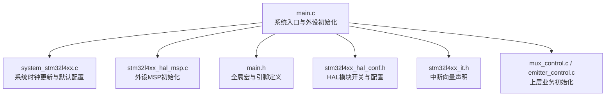
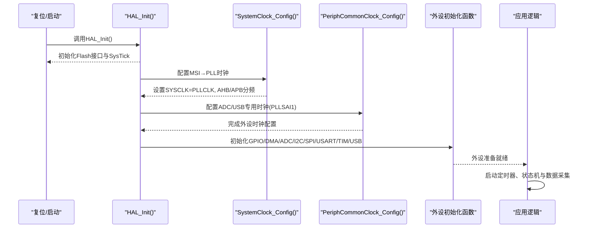
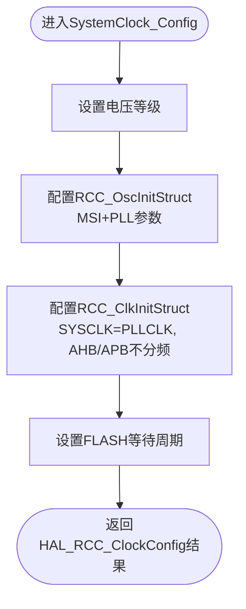
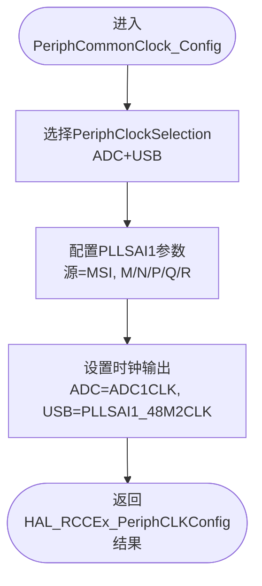
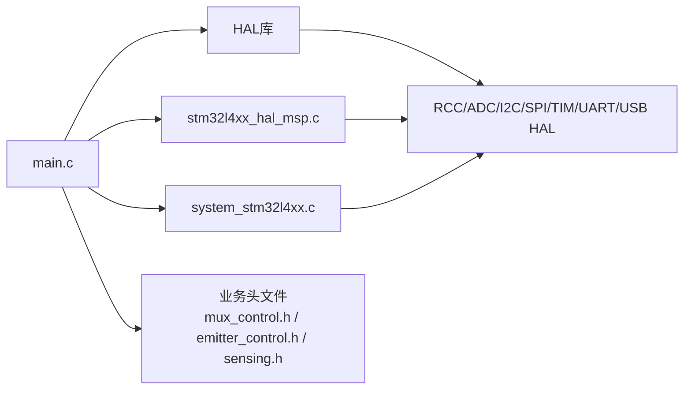

# 系统初始化

<cite>
**本文引用的文件列表**
- [main.c](file://firmware/STM32/fNIRS/Core/Src/main.c)
- [system_stm32l4xx.c](file://firmware/STM32/fNIRS/Core/Src/system_stm32l4xx.c)
- [stm32l4xx_hal_msp.c](file://firmware/STM32/fNIRS/Core/Src/stm32l4xx_hal_msp.c)
- [main.h](file://firmware/STM32/fNIRS/Core/Inc/main.h)
- [stm32l4xx_hal_conf.h](file://firmware/STM32/fNIRS/Core/Inc/stm32l4xx_hal_conf.h)
- [stm32l4xx_it.h](file://firmware/STM32/fNIRS/Core/Inc/stm32l4xx_it.h)
- [mux_control.h](file://firmware/STM32/fNIRS/Core/Inc/mux_control.h)
- [emitter_control.h](file://firmware/STM32/fNIRS/Core/Inc/emitter_control.h)
- [sensing.h](file://firmware/STM32/fNIRS/Core/Inc/sensing.h)
- [mux_control.c](file://firmware/STM32/fNIRS/Core/Src/mux_control.c)
- [emitter_control.c](file://firmware/STM32/fNIRS/Core/Src/emitter_control.c)
</cite>

## 目录
1. [引言](#引言)
2. [项目结构](#项目结构)
3. [核心组件](#核心组件)
4. [架构总览](#架构总览)
5. [详细组件分析](#详细组件分析)
6. [依赖关系分析](#依赖关系分析)
7. [性能考量](#性能考量)
8. [故障排查指南](#故障排查指南)
9. [结论](#结论)
10. [附录](#附录)

## 引言
本技术文档聚焦于fNIRS系统的初始化模块，围绕以下目标展开：
- 深入解析SystemClock_Config函数的时钟配置过程：MSI振荡器设置、PLL配置与AHB/APB分频策略。
- 详解PeriphCommonClock_Config函数的外设时钟配置：ADC与USB专用时钟（PLLSAI1）来源与输出选择。
- 逐项说明GPIO、ADC、I2C、SPI、USART、TIM等外设初始化函数的关键参数与行为。
- 给出系统启动流程的完整时序：HAL库初始化、外设配置顺序、错误处理机制。
- 提供时钟频率计算方法、功耗优化建议与系统稳定性考虑。
- 总结调试技巧与常见初始化问题的解决路径。

## 项目结构
该工程采用典型的STM32Cube工程布局，核心初始化代码位于Core/Src目录，硬件抽象层（HAL）与中断向量在Core/Inc中声明，外设驱动与应用逻辑在各自源文件中实现。

图表来源
- [main.c](file://firmware/STM32/fNIRS/Core/Src/main.c#L92-L181)
- [system_stm32l4xx.c](file://firmware/STM32/fNIRS/Core/Src/system_stm32l4xx.c#L197-L333)
- [stm32l4xx_hal_msp.c](file://firmware/STM32/fNIRS/Core/Src/stm32l4xx_hal_msp.c#L64-L551)
- [main.h](file://firmware/STM32/fNIRS/Core/Inc/main.h#L60-L70)
- [stm32l4xx_hal_conf.h](file://firmware/STM32/fNIRS/Core/Inc/stm32l4xx_hal_conf.h#L38-L94)
- [stm32l4xx_it.h](file://firmware/STM32/fNIRS/Core/Inc/stm32l4xx_it.h#L49-L64)
- [mux_control.c](file://firmware/STM32/fNIRS/Core/Src/mux_control.c#L146-L158)
- [emitter_control.c](file://firmware/STM32/fNIRS/Core/Src/emitter_control.c#L183-L189)

章节来源
- [main.c](file://firmware/STM32/fNIRS/Core/Src/main.c#L92-L181)
- [system_stm32l4xx.c](file://firmware/STM32/fNIRS/Core/Src/system_stm32l4xx.c#L197-L333)
- [stm32l4xx_hal_msp.c](file://firmware/STM32/fNIRS/Core/Src/stm32l4xx_hal_msp.c#L64-L551)
- [main.h](file://firmware/STM32/fNIRS/Core/Inc/main.h#L60-L70)
- [stm32l4xx_hal_conf.h](file://firmware/STM32/fNIRS/Core/Inc/stm32l4xx_hal_conf.h#L38-L94)
- [stm32l4xx_it.h](file://firmware/STM32/fNIRS/Core/Inc/stm32l4xx_it.h#L49-L64)
- [mux_control.c](file://firmware/STM32/fNIRS/Core/Src/mux_control.c#L146-L158)
- [emitter_control.c](file://firmware/STM32/fNIRS/Core/Src/emitter_control.c#L183-L189)

## 核心组件
- 系统时钟配置：SystemClock_Config通过RCC_OscInit与RCC_ClkInit完成MSI→PLL的切换与AHB/APB分频。
- 外设公共时钟：PeriphCommonClock_Config通过HAL_RCCEx_PeriphCLKConfig为ADC与USB提供PLLSAI1专用时钟。
- HAL初始化：main函数中先调用HAL_Init，再依次配置系统时钟、外设时钟，最后初始化各外设。
- 错误处理：统一的Error_Handler禁用中断并进入死循环，便于调试定位。

章节来源
- [main.c](file://firmware/STM32/fNIRS/Core/Src/main.c#L102-L128)
- [main.c](file://firmware/STM32/fNIRS/Core/Src/main.c#L187-L231)
- [main.c](file://firmware/STM32/fNIRS/Core/Src/main.c#L237-L257)
- [main.c](file://firmware/STM32/fNIRS/Core/Src/main.c#L714-L723)

## 架构总览
系统启动到外设就绪的典型流程如下：

图表来源
- [main.c](file://firmware/STM32/fNIRS/Core/Src/main.c#L102-L128)
- [main.c](file://firmware/STM32/fNIRS/Core/Src/main.c#L187-L257)

## 详细组件分析

### SystemClock_Config：MSI→PLL时钟配置
- 电压调节：使用HAL_PWREx_ControlVoltageScaling设置为高效率模式。
- 振荡器配置：
  - MSI作为主时钟源，范围选择为中等范围以满足后续PLL倍频需求。
  - PLL启用，源选择MSI，分频比M/N/P/Q/R设定为固定值，确保SYSCLK稳定。
- 系统时钟配置：
  - SYSCLK源选择PLLCLK。
  - AHB不分频，APB1/APB2亦不分频，保证外设最高工作频率。
  - 配置FLASH等待周期以匹配新频率。

图表来源
- [main.c](file://firmware/STM32/fNIRS/Core/Src/main.c#L187-L231)

章节来源
- [main.c](file://firmware/STM32/fNIRS/Core/Src/main.c#L187-L231)

### PeriphCommonClock_Config：ADC与USB专用时钟
- 选择ADC与USB专用时钟源为PLLSAI1，并开启PLLSAI1时钟输出。
- PLLSAI1参数：源为MSI，M/N/P/Q/R设定为固定值，确保48MHz与ADC时钟满足USB与ADC需求。
- 输出选择：ADC时钟选择PLLSAI1_48M2CLK或ADC1CLK，USB时钟选择PLLSAI1_48M2CLK。

图表来源
- [main.c](file://firmware/STM32/fNIRS/Core/Src/main.c#L237-L257)

章节来源
- [main.c](file://firmware/STM32/fNIRS/Core/Src/main.c#L237-L257)

### 外设初始化函数详解

#### GPIO初始化（MX_GPIO_Init）
- 使能GPIO端口时钟（C/A/B）。
- 配置输出引脚（如LED、CS、使能线），设置为推挽输出、低速。
- 典型引脚：SD卡检测、测试LED、SPI片选等。

章节来源
- [main.c](file://firmware/STM32/fNIRS/Core/Src/main.c#L671-L704)
- [main.h](file://firmware/STM32/fNIRS/Core/Inc/main.h#L60-L70)

#### DMA初始化（MX_DMA_Init）
- 使能DMA1时钟。
- 配置DMA1_Channel1中断优先级并使能中断。

章节来源
- [main.c](file://firmware/STM32/fNIRS/Core/Src/main.c#L653-L664)

#### ADC1初始化（MX_ADC1_Init）
- ADC异步时钟、分辨率、对齐方式、扫描模式、连续转换、外部触发等参数设置。
- 多通道配置：8个ADC通道按顺序配置，采样时间、单端输入。
- DMA启用与循环缓冲，提高数据采集吞吐。

章节来源
- [main.c](file://firmware/STM32/fNIRS/Core/Src/main.c#L264-L387)

#### I2C1/I2C2初始化（MX_I2C1_Init/MX_I2C2_Init）
- I2C时序寄存器（Timing）设置为典型值，地址模式7位，禁用通用寻址与拉伸。
- 启用模拟滤波器与数字滤波器，提升抗干扰能力。
- MSP层分别配置I2C专用时钟源（PCLK1）。

章节来源
- [main.c](file://firmware/STM32/fNIRS/Core/Src/main.c#L394-L483)
- [stm32l4xx_hal_msp.c](file://firmware/STM32/fNIRS/Core/Src/stm32l4xx_hal_msp.c#L207-L278)

#### SPI1初始化（MX_SPI1_Init）
- 主模式、双线全双工、4位数据大小、极性相位、软件NSS、波特率预分频。
- MSP层配置SPI1专用时钟源（APB2）。

章节来源
- [main.c](file://firmware/STM32/fNIRS/Core/Src/main.c#L490-L523)
- [stm32l4xx_hal_msp.c](file://firmware/STM32/fNIRS/Core/Src/stm32l4xx_hal_msp.c#L337-L367)

#### USART1初始化（MX_USART1_UART_Init）
- 波特率115200、8数据位、1停止位、无校验、收发模式、无硬件流控。
- 采样方式与高级特性保持默认。

章节来源
- [main.c](file://firmware/STM32/fNIRS/Core/Src/main.c#L620-L648)
- [stm32l4xx_hal_msp.c](file://firmware/STM32/fNIRS/Core/Src/stm32l4xx_hal_msp.c#L477-L517)

#### TIM3/TIM4初始化（MX_TIM3_Init/MX_TIM4_Init）
- TIM3：基础定时器，自动重装预装载启用，触发ADC同步。
- TIM4：基础定时器，中断触发采样序列，用于周期性事件。

章节来源
- [main.c](file://firmware/STM32/fNIRS/Core/Src/main.c#L530-L613)
- [stm32l4xx_hal_msp.c](file://firmware/STM32/fNIRS/Core/Src/stm32l4xx_hal_msp.c#L405-L433)

#### USB设备初始化（MX_USB_DEVICE_Init）
- 在main中调用，基于中间件与目标配置完成USB CDC设备初始化。

章节来源
- [main.c](file://firmware/STM32/fNIRS/Core/Src/main.c#L126)

### 上层业务初始化
- 多路复用器初始化：通过I2C连接的GPIO扩展器配置引脚映射，初始关闭所有通道。
- 发光二极管控制：通过I2C连接的PWM控制器配置默认占空比与相位，使能输出。
- 传感器采集：ADC初始化后，DMA搬运原始数据，配合定时器触发与多路复用器轮询。

章节来源
- [mux_control.c](file://firmware/STM32/fNIRS/Core/Src/mux_control.c#L146-L158)
- [emitter_control.c](file://firmware/STM32/fNIRS/Core/Src/emitter_control.c#L183-L189)
- [sensing.h](file://firmware/STM32/fNIRS/Core/Inc/sensing.h#L46-L61)

## 依赖关系分析
- main.c依赖HAL库与各外设驱动；同时依赖业务头文件（mux_control.h、emitter_control.h、sensing.h）。
- system_stm32l4xx.c提供系统时钟更新与默认配置，被SystemClock_Config间接影响。
- stm32l4xx_hal_msp.c在各外设初始化时由HAL调用，负责GPIO与时钟的MSP配置。
- 中断向量在stm32l4xx_it.h中声明，实际实现位于对应中断服务例程文件。

图表来源
- [main.c](file://firmware/STM32/fNIRS/Core/Src/main.c#L20-L31)
- [system_stm32l4xx.c](file://firmware/STM32/fNIRS/Core/Src/system_stm32l4xx.c#L197-L333)
- [stm32l4xx_hal_msp.c](file://firmware/STM32/fNIRS/Core/Src/stm32l4xx_hal_msp.c#L64-L551)
- [mux_control.h](file://firmware/STM32/fNIRS/Core/Inc/mux_control.h#L6)
- [emitter_control.h](file://firmware/STM32/fNIRS/Core/Inc/emitter_control.h#L6)
- [sensing.h](file://firmware/STM32/fNIRS/Core/Inc/sensing.h#L6)

章节来源
- [main.c](file://firmware/STM32/fNIRS/Core/Src/main.c#L20-L31)
- [system_stm32l4xx.c](file://firmware/STM32/fNIRS/Core/Src/system_stm32l4xx.c#L197-L333)
- [stm32l4xx_hal_msp.c](file://firmware/STM32/fNIRS/Core/Src/stm32l4xx_hal_msp.c#L64-L551)
- [mux_control.h](file://firmware/STM32/fNIRS/Core/Inc/mux_control.h#L6)
- [emitter_control.h](file://firmware/STM32/fNIRS/Core/Inc/emitter_control.h#L6)
- [sensing.h](file://firmware/STM32/fNIRS/Core/Inc/sensing.h#L6)

## 性能考量
- 时钟频率计算
  - 基于SystemClock_Config：SYSCLK = MSI_RANGE × (N/M)/R，其中M/N/R来自配置；AHB/APB不分频，因此外设总线频率等于SYSCLK。
  - ADC/USB专用时钟：PeriphCommonClock_Config中PLLSAI1输出经分频得到ADC与USB时钟，需确保满足精度与带宽要求。
- 功耗优化
  - 在不牺牲实时性的前提下，尽量降低AHB/APB分频，减少总线延迟。
  - 使用HAL低功耗特性（如低功耗模式、自动等待）在空闲阶段降低功耗。
  - 对未使用的外设与时钟及时关闭，避免不必要的电流消耗。
- 稳定性
  - FLASH等待周期与电压等级匹配SYSCLK，防止执行异常。
  - ADC采样时间与DMA传输结合，避免溢出与丢数。
  - I2C滤波器与时序参数合理设置，提升通信可靠性。

[本节为通用指导，无需列出具体文件来源]

## 故障排查指南
- HAL初始化失败
  - 检查HAL_Init是否返回成功；若失败，确认Flash与SysTick初始化是否正常。
- 时钟配置失败
  - SystemClock_Config与PeriphCommonClock_Config均返回错误时，检查RCC配置参数与电源管理设置。
- 外设初始化失败
  - 各外设初始化函数均调用Error_Handler，确认具体失败位置（GPIO/I2C/SPI/ADC/TIM/UART/USB）。
- 中断异常
  - 检查NVIC优先级与使能配置，确保DMA/ADC/TIM中断正确设置。
- USB无法枚举
  - 确认PLLSAI1为48MHz且USB专用时钟已启用；检查USB引脚与上拉电阻。

章节来源
- [main.c](file://firmware/STM32/fNIRS/Core/Src/main.c#L102-L128)
- [main.c](file://firmware/STM32/fNIRS/Core/Src/main.c#L187-L257)
- [main.c](file://firmware/STM32/fNIRS/Core/Src/main.c#L714-L723)
- [stm32l4xx_hal_msp.c](file://firmware/STM32/fNIRS/Core/Src/stm32l4xx_hal_msp.c#L426-L427)

## 结论
本初始化模块通过明确的时钟配置与外设初始化顺序，为fNIRS系统提供了稳定、可扩展的运行基础。SystemClock_Config与PeriphCommonClock_Config共同确保了系统主频与ADC/USB专用时钟的精确供给；各外设初始化函数则覆盖了I/O、通信、定时与数据采集等关键路径。遵循本文提供的时钟计算、功耗优化与故障排查建议，可进一步提升系统可靠性与性能。

[本节为总结性内容，无需列出具体文件来源]

## 附录

### 时钟频率计算示例（基于当前配置）
- MSI范围与PLL参数：根据SystemClock_Config中的MSI范围、M/N/P/Q/R，计算SYSCLK。
- AHB/APB分频：当前配置为不分频，故AHB与APB频率等于SYSCLK。
- ADC/USB时钟：PeriphCommonClock_Config中PLLSAI1输出经分频得到ADC与USB时钟，需依据具体分频系数换算。

章节来源
- [main.c](file://firmware/STM32/fNIRS/Core/Src/main.c#L187-L231)
- [main.c](file://firmware/STM32/fNIRS/Core/Src/main.c#L237-L257)

### 调试技巧
- 使用断点定位初始化失败点：HAL_Init、SystemClock_Config、PeriphCommonClock_Config、各外设初始化。
- 观察SystemCoreClock变量变化，确认SystemCoreClockUpdate是否与期望一致。
- 通过HAL库的错误回调与assert_param辅助定位参数错误。
- 利用USB CDC与串口打印关键状态，便于远程诊断。

章节来源
- [system_stm32l4xx.c](file://firmware/STM32/fNIRS/Core/Src/system_stm32l4xx.c#L251-L317)
- [stm32l4xx_hal_conf.h](file://firmware/STM32/fNIRS/Core/Inc/stm32l4xx_hal_conf.h#L462-L476)
- [main.c](file://firmware/STM32/fNIRS/Core/Src/main.c#L714-L723)