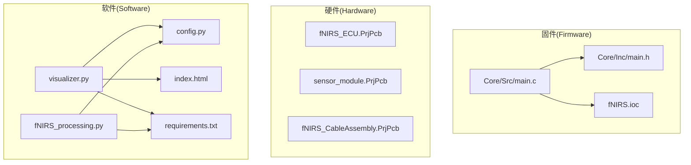
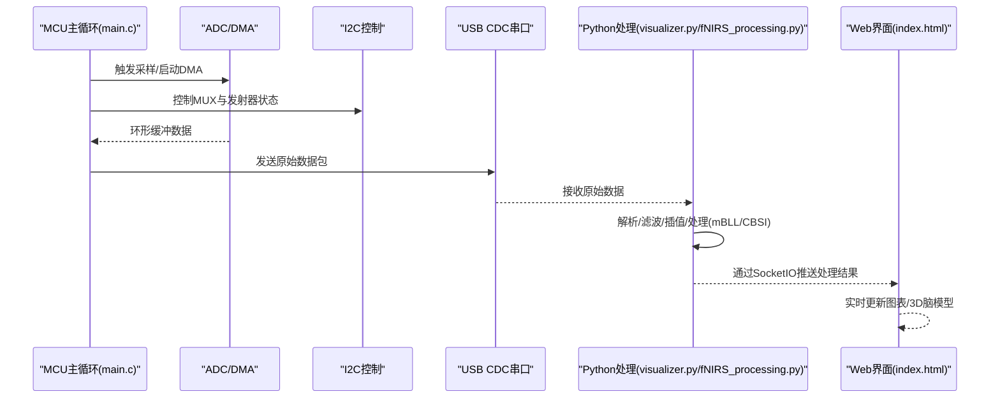
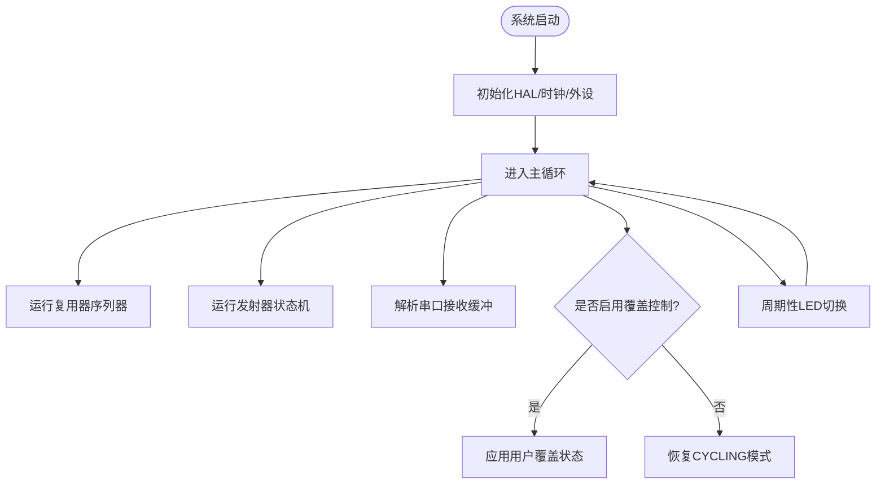
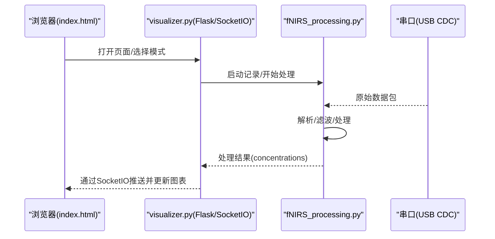
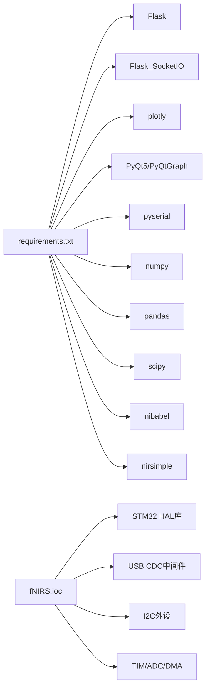

# 开发者指南

<cite>
**本文引用的文件**
- [README.md](file://README.md)
- [firmware/README.md](file://firmware/README.md)
- [software/README.md](file://software/README.md)
- [hardware/README.md](file://hardware/README.md)
- [software/requirements.txt](file://software/requirements.txt)
- [software/.pylintrc](file://software/.pylintrc)
- [software/config.py](file://software/config.py)
- [software/visualizer.py](file://software/visualizer.py)
- [software/fNIRS_processing.py](file://software/fNIRS_processing.py)
- [software/index.html](file://software/index.html)
- [firmware/STM32/fNIRS/Core/Inc/main.h](file://firmware/STM32/fNIRS/Core/Inc/main.h)
- [firmware/STM32/fNIRS/Core/Src/main.c](file://firmware/STM32/fNIRS/Core/Src/main.c)
- [firmware/STM32/fNIRS/fNIRS.ioc](file://firmware/STM32/fNIRS/fNIRS.ioc)
- [.gitignore](file://.gitignore)
</cite>

## 目录
1. [简介](#简介)
2. [项目结构](#项目结构)
3. [核心组件](#核心组件)
4. [架构总览](#架构总览)
5. [详细组件分析](#详细组件分析)
6. [依赖关系分析](#依赖关系分析)
7. [性能考虑](#性能考虑)
8. [故障排除指南](#故障排除指南)
9. [结论](#结论)
10. [附录](#附录)

## 简介
本指南面向fNIRS项目的开发者，提供从代码规范、最佳实践到贡献流程、工具使用、调试与性能优化的完整说明。项目由三部分组成：嵌入式固件（STM32）、硬件设计（Altium）与软件可视化系统（Python + Web）。目标是帮助新成员快速理解项目结构、掌握开发与调试方法，并在保持高质量的前提下高效协作。

## 项目结构
仓库采用按“领域/平台”分层组织：
- firmware/STM32：基于STM32CubeIDE的嵌入式固件，负责传感器复用器控制、LED发射器驱动、ADC采集、USB CDC串口通信等。
- hardware/：使用Altium设计的硬件原理图与PCB，包含ECU、传感器模块、连接线束等。
- software/：Python可视化与数据处理系统，提供实时ADC显示、CSV记录、mBLL处理、3D脑模型展示与Web界面。
- docs/：项目文档与海报材料。
- 顶层README与各子模块README提供概览与快速上手。

图表来源
- [firmware/STM32/fNIRS/Core/Src/main.c](file://firmware/STM32/fNIRS/Core/Src/main.c#L92-L181)
- [firmware/STM32/fNIRS/Core/Inc/main.h](file://firmware/STM32/fNIRS/Core/Inc/main.h#L21-L80)
- [firmware/STM32/fNIRS/fNIRS.ioc](file://firmware/STM32/fNIRS/fNIRS.ioc#L66-L118)
- [software/config.py](file://software/config.py#L7-L12)
- [software/visualizer.py](file://software/visualizer.py#L1-L120)
- [software/fNIRS_processing.py](file://software/fNIRS_processing.py#L1-L40)
- [software/index.html](file://software/index.html#L1-L120)
- [software/requirements.txt](file://software/requirements.txt#L1-L15)

章节来源
- [README.md](file://README.md#L1-L19)
- [firmware/README.md](file://firmware/README.md#L1-L17)
- [software/README.md](file://software/README.md#L1-L180)
- [hardware/README.md](file://hardware/README.md#L1-L19)

## 核心组件
- 嵌入式主循环与外设初始化：系统时钟、ADC/DMA/I2C/SPI/TIM/UART/USB设备初始化；主循环中运行复用器状态机、LED指示、串口解析与用户覆盖控制。
- 数据采集与处理：ADC DMA环形缓冲、定时触发采样；通过I2C控制模拟多路复用器与LED发射器；USB CDC串口输出原始包格式。
- 软件侧可视化与处理：Flask+SocketIO提供Web界面；实时接收上游处理结果或本地记录CSV；支持mBLL与CBSI处理；3D脑模型渲染。
- 配置与依赖：Python虚拟环境与依赖清单；串口参数配置；Pylint规则与代码质量门禁。

章节来源
- [firmware/STM32/fNIRS/Core/Src/main.c](file://firmware/STM32/fNIRS/Core/Src/main.c#L92-L181)
- [firmware/STM32/fNIRS/Core/Inc/main.h](file://firmware/STM32/fNIRS/Core/Inc/main.h#L59-L78)
- [software/visualizer.py](file://software/visualizer.py#L1-L120)
- [software/fNIRS_processing.py](file://software/fNIRS_processing.py#L1-L40)
- [software/config.py](file://software/config.py#L7-L12)
- [software/requirements.txt](file://software/requirements.txt#L1-L15)
- [software/.pylintrc](file://software/.pylintrc#L1-L651)

## 架构总览
系统采用“嵌入式采集+USB CDC串口+Python处理与可视化”的分层架构。固件负责底层硬件控制与数据采集，软件负责数据接收、处理、存储与可视化。

图表来源
- [firmware/STM32/fNIRS/Core/Src/main.c](file://firmware/STM32/fNIRS/Core/Src/main.c#L146-L178)
- [software/visualizer.py](file://software/visualizer.py#L65-L96)
- [software/index.html](file://software/index.html#L1-L120)

## 详细组件分析

### 组件A：嵌入式主循环与外设初始化
- 初始化顺序：HAL初始化、系统时钟、公共时钟、GPIO/DMA/ADC/I2C/SPI/TIM/UART/USB设备。
- 主循环逻辑：运行复用器序列器、发射器状态机、串口解析；根据上位机指令切换覆盖模式；周期性LED闪烁。
- 关键接口：mux_control_*、emitter_control_*、sensing_*、serial_interface_*。

图表来源
- [firmware/STM32/fNIRS/Core/Src/main.c](file://firmware/STM32/fNIRS/Core/Src/main.c#L132-L178)

章节来源
- [firmware/STM32/fNIRS/Core/Src/main.c](file://firmware/STM32/fNIRS/Core/Src/main.c#L92-L181)
- [firmware/STM32/fNIRS/Core/Inc/main.h](file://firmware/STM32/fNIRS/Core/Inc/main.h#L59-L78)

### 组件B：Python可视化与数据处理
- 可视化服务：Flask+SocketIO，提供Web界面与实时数据流；支持演示模式与真实串口模式。
- 处理流程：串口读取原始数据包，解析为8通道×5列矩阵；记录CSV；进行滑动窗口RMS、阈值过滤、低通滤波、带通滤波与重采样；最终输出processed_output.csv。
- 3D脑模型：加载平滑脑表面网格与AAL图谱，映射传感器节点与激活区域。

图表来源
- [software/visualizer.py](file://software/visualizer.py#L34-L96)
- [software/fNIRS_processing.py](file://software/fNIRS_processing.py#L160-L186)
- [software/index.html](file://software/index.html#L1-L120)

章节来源
- [software/visualizer.py](file://software/visualizer.py#L1-L200)
- [software/fNIRS_processing.py](file://software/fNIRS_processing.py#L1-L200)
- [software/index.html](file://software/index.html#L1-L200)

### 组件C：配置与依赖
- 串口配置：端口、波特率、超时。
- 依赖管理：requirements.txt声明所有运行期依赖。
- 代码质量：.pylintrc定义命名风格、复杂度上限、行宽、消息等级等规则。

章节来源
- [software/config.py](file://software/config.py#L7-L12)
- [software/requirements.txt](file://software/requirements.txt#L1-L15)
- [software/.pylintrc](file://software/.pylintrc#L119-L360)

## 依赖关系分析
- 固件依赖：STM32Cube HAL库、USB CDC中间件、I2C/TIM/ADC/DMA外设配置（由ioc文件导出）。
- 软件依赖：Flask、Flask-SocketIO、Plotly、PyQt5、PySerial、NumPy、Pandas、SciPy、NiBabel、nirsimple等。
- 版本与兼容性：Python版本要求与依赖版本在requirements.txt中明确。

图表来源
- [software/requirements.txt](file://software/requirements.txt#L1-L15)
- [firmware/STM32/fNIRS/fNIRS.ioc](file://firmware/STM32/fNIRS/fNIRS.ioc#L66-L118)

章节来源
- [software/requirements.txt](file://software/requirements.txt#L1-L15)
- [firmware/STM32/fNIRS/fNIRS.ioc](file://firmware/STM32/fNIRS/fNIRS.ioc#L1-L200)

## 性能考虑
- 固件侧
  - ADC DMA环形缓冲减少CPU占用，提高采样稳定性。
  - 定时器触发采样，确保采样节拍一致。
  - I2C快速模式降低控制延迟。
- 软件侧
  - 滑动窗口RMS与带通滤波在通道维度并行处理，注意内存与计算量平衡。
  - 重采样前后零相位滤波避免相位失真。
  - SocketIO异步模式与队列限制避免阻塞主线程。
- 建议
  - 对长时记录场景，优先使用CSV分块写入与增量处理。
  - 在Web端对高频率数据进行下采样或滑动窗口聚合。

[本节为通用性能建议，不直接分析特定文件]

## 故障排除指南
- 无法连接串口
  - 确认config.py中的SERIAL_PORT路径正确；Windows使用COM端口，类Unix使用/dev/tty*。
  - 检查端口占用与权限。
- 数据为空或异常
  - 检查固件是否正常运行、LED是否闪烁；确认复用器与发射器状态机是否处于CYCLING模式。
  - 在演示模式下验证Web界面与SocketIO链路。
- 3D脑模型显示异常
  - 确保aal.nii与BrainMesh_Ch2_smoothed.nv存在且可读。
  - 检查浏览器控制台错误与网络请求状态。
- 依赖安装失败
  - 使用requirements.txt安装；若网络受限，配置镜像源或离线安装。
- Git忽略规则导致误删
  - .gitignore已排除对象文件与CSV，但保留software/sample_data下的CSV，请勿删除该目录。

章节来源
- [software/config.py](file://software/config.py#L7-L12)
- [firmware/STM32/fNIRS/Core/Src/main.c](file://firmware/STM32/fNIRS/Core/Src/main.c#L176-L178)
- [software/index.html](file://software/index.html#L1-L120)
- [.gitignore](file://.gitignore#L74-L77)

## 结论
本指南提供了从项目结构、核心组件到开发工具、调试与性能优化的全景式说明。建议在开发中遵循统一的代码规范与审查流程，结合Pylint规则与依赖清单，确保跨平台与跨模块的一致性与可维护性。

[本节为总结性内容，不直接分析特定文件]

## 附录

### A. 代码规范与最佳实践
- 命名约定
  - 函数/变量：snake_case
  - 类：PascalCase
  - 常量：UPPER_CASE
- 行宽与缩进
  - 最大行长100字符；缩进4空格。
- 复杂度限制
  - 函数最大参数数、局部变量数、分支数、语句数、返回点数等均有上限。
- 文档字符串
  - 公共函数/类需提供清晰文档字符串，简述用途、参数与返回值。
- 注释标准
  - 关键算法与边界条件处添加注释；避免显而易见的注释。
- 代码审查
  - 提交前运行Pylint检查；确保无致命/错误级别问题；关注复杂度与命名一致性。

章节来源
- [software/.pylintrc](file://software/.pylintrc#L119-L360)

### B. 贡献指南与Git工作流
- 分支管理
  - 主分支保护，功能开发在特性分支完成并通过PR合并。
- 提交信息
  - 使用清晰的subject与body，描述变更目的、影响范围与测试要点。
- 问题与需求
  - 使用Issue模板记录缺陷与功能请求；分配标签与里程碑。
- 代码审查
  - 至少一名维护者批准；修复审查反馈后方可合并。

[本节为通用流程说明，不直接分析特定文件]

### C. 开发工具使用
- STM32CubeIDE
  - 工作空间指向firmware/STM32/；打开工程后先Clean再Build；通过SWD下载程序。
- Python开发环境
  - 创建虚拟环境并安装requirements.txt；在config.py中配置串口端口。
- 调试工具
  - 固件：J-Link/ST-LINK调试器；观察LED闪烁与串口输出。
  - 软件：浏览器开发者工具查看SocketIO与网络请求；日志级别DEBUG便于定位问题。

章节来源
- [firmware/README.md](file://firmware/README.md#L5-L17)
- [software/README.md](file://software/README.md#L50-L100)
- [software/config.py](file://software/config.py#L7-L12)

### D. 扩展与定制开发
- 新增传感器组
  - 在固件侧调整复用器通道与发射器状态机；在软件侧扩展解析与处理逻辑。
- 自定义可视化
  - 在index.html中新增图表容器与交互控件；在visualizer.py中订阅对应事件并更新。
- 算法替换
  - 将nirsimple替换为自研处理管线时，保持输入输出格式一致，确保SocketIO消息结构不变。

[本节为概念性指导，不直接分析特定文件]