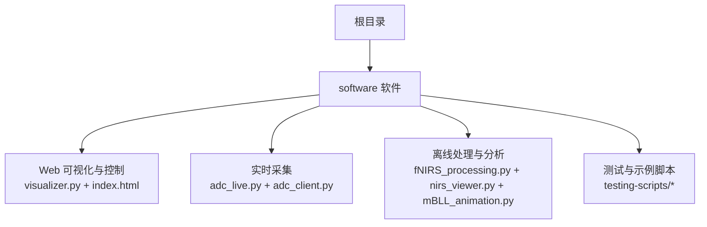
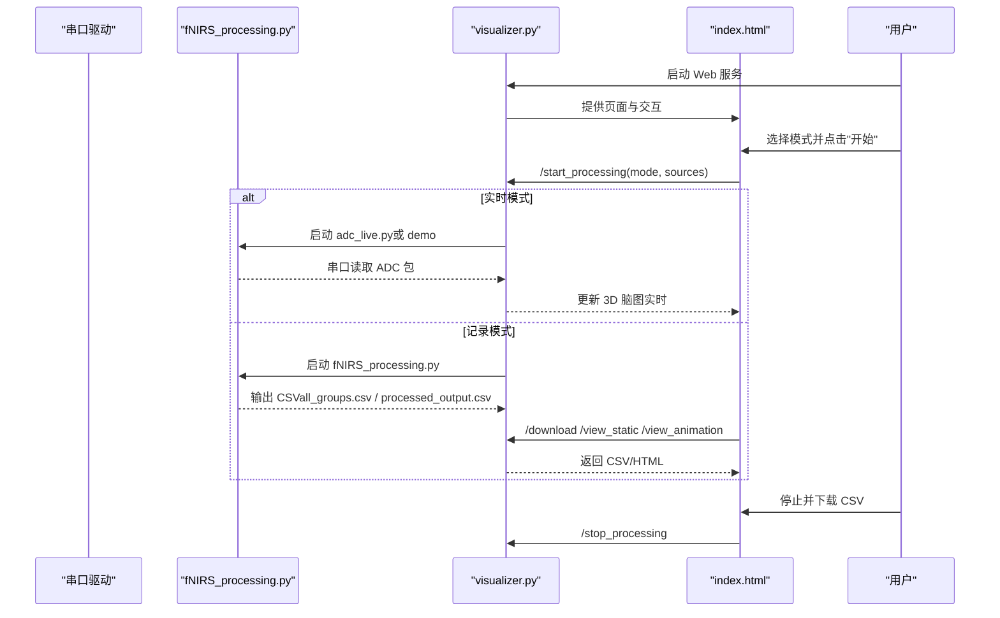
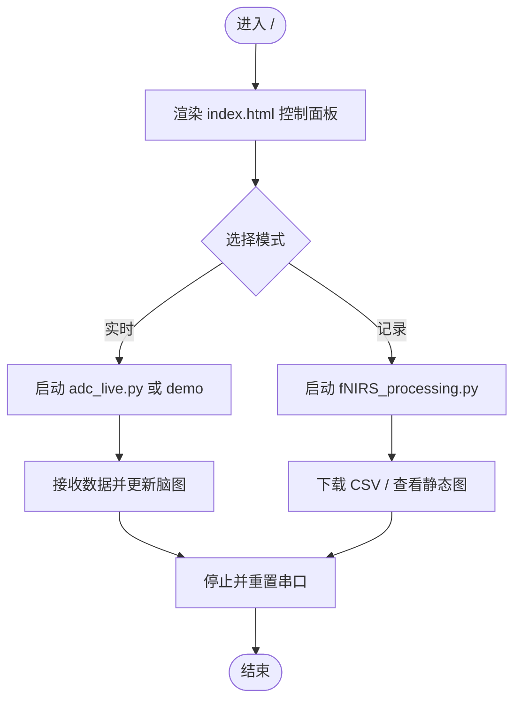
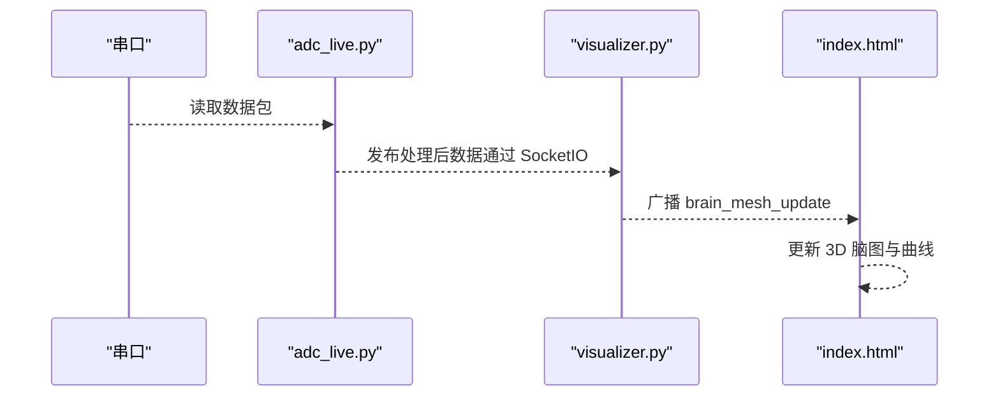
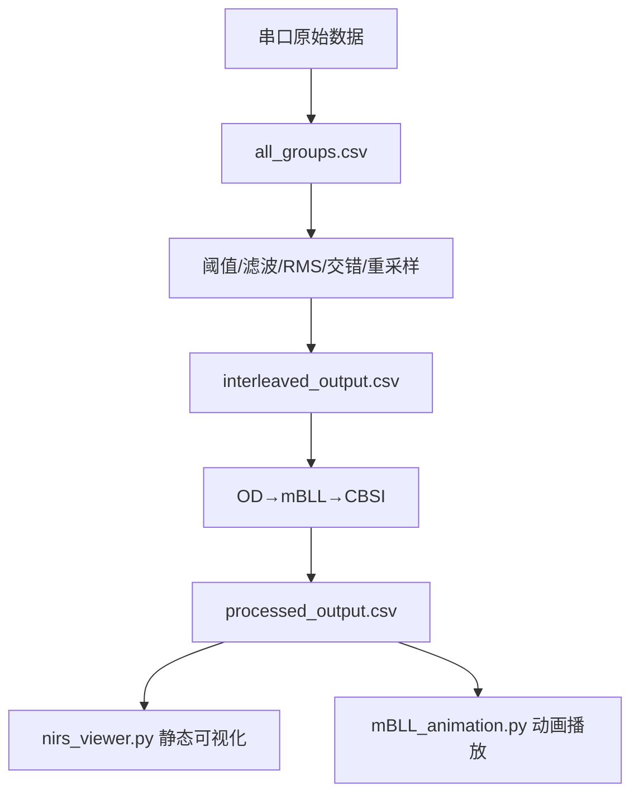
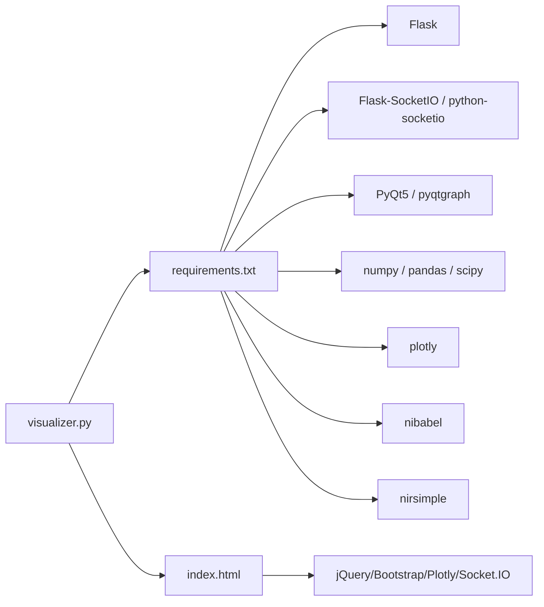

# 快速开始

<cite>
**本文引用的文件**
- [README.md](file://README.md)
- [requirements.txt](file://software/requirements.txt)
- [config.py](file://software/config.py)
- [index.html](file://software/index.html)
- [visualizer.py](file://software/visualizer.py)
- [fNIRS_processing.py](file://software/fNIRS_processing.py)
- [adc_live.py](file://software/adc_live.py)
- [adc_client.py](file://software/adc_client.py)
- [nirs_viewer.py](file://software/nirs_viewer.py)
- [mBLL_animation.py](file://software/mBLL_animation.py)
- [plot.py](file://software/testing-scripts/plot.py)
- [plot_csv.py](file://software/testing-scripts/plot_csv.py)
- [adc_mock_server.py](file://software/adc_mock_server.py)
</cite>

## 更新摘要
**所做的更改**
- 删除了固件编译和硬件设置相关内容
- 更新了纯软件架构的安装和配置说明
- 移除了硬件相关的依赖和配置
- 简化了项目结构描述，专注于软件组件
- 更新了串口配置和依赖安装说明

## 目录
1. [简介](#简介)
2. [项目结构](#项目结构)
3. [核心组件](#核心组件)
4. [架构总览](#架构总览)
5. [详细组件分析](#详细组件分析)
6. [依赖关系分析](#依赖关系分析)
7. [性能考虑](#性能考虑)
8. [故障排查指南](#故障排查指南)
9. [结论](#结论)
10. [附录](#附录)

## 简介
本指南面向首次接触 fNIRS 项目的用户，帮助你在最短时间内完成 Python 环境准备、依赖安装和 Web 界面启动，并掌握实时数据采集、数据记录与离线分析的基本流程。项目现已采用纯软件架构，无需硬件即可进行完整的数据处理和可视化体验。

## 项目结构
项目由"软件"部分组成，包含 Web 可视化、实时采集、离线处理与可视化工具等模块。

图表来源
- [visualizer.py:591-733](file://software/visualizer.py#L591-L733)
- [index.html:1-750](file://software/index.html#L1-L750)
- [fNIRS_processing.py:1-496](file://software/fNIRS_processing.py#L1-L496)
- [adc_live.py:1-210](file://software/adc_live.py#L1-L210)
- [adc_client.py:1-181](file://software/adc_client.py#L1-L181)
- [nirs_viewer.py:1-368](file://software/nirs_viewer.py#L1-L368)
- [mBLL_animation.py:1-140](file://software/mBLL_animation.py#L1-L140)

章节来源
- [README.md:1-19](file://README.md#L1-L19)

## 核心组件
- Web 可视化与控制：基于 Flask + SocketIO 的 Web 服务，提供 3D 脑图渲染、传感器组高亮、模式切换（实时/记录）、CSV 下载与静态图查看。
- 实时采集：通过串口读取原始 ADC 数据，支持 PyQt5 图形界面实时显示；或通过 SocketIO 客户端接收上游处理后的浓度变化数据。
- 离线处理与分析：对原始 ADC 数据进行滤波、RMS、插值、mBLL（Modified Beer-Lambert Law）与 CBSI 处理，输出 CSV 并提供静态/动画可视化工具。
- 示例与测试：提供 Plotly 静态页面生成、PyQtGraph 动画演示以及对比可视化脚本。

章节来源
- [visualizer.py:591-733](file://software/visualizer.py#L591-L733)
- [index.html:1-750](file://software/index.html#L1-L750)
- [fNIRS_processing.py:1-496](file://software/fNIRS_processing.py#L1-L496)
- [adc_live.py:1-210](file://software/adc_live.py#L1-L210)
- [adc_client.py:1-181](file://software/adc_client.py#L1-L181)
- [nirs_viewer.py:1-368](file://software/nirs_viewer.py#L1-L368)
- [mBLL_animation.py:1-140](file://software/mBLL_animation.py#L1-L140)
- [plot.py:1-105](file://software/testing-scripts/plot.py#L1-L105)
- [plot_csv.py:1-192](file://software/testing-scripts/plot_csv.py#L1-L192)

## 架构总览
下图展示了从串口到软件的整体数据流：串口向主机发送原始 ADC 包，Web 服务在"实时模式"下直接显示 ADC，在"记录模式"下启动离线处理脚本，将处理结果通过 SocketIO 推送至前端进行 3D 脑图高亮。

图表来源
- [visualizer.py:646-711](file://software/visualizer.py#L646-L711)
- [fNIRS_processing.py:446-496](file://software/fNIRS_processing.py#L446-L496)
- [index.html:632-723](file://software/index.html#L632-L723)

## 详细组件分析

### 组件一：Web 可视化与控制（visualizer.py + index.html）
- 功能要点
  - 提供主页与控制面板，支持传感器组高亮、发射器/多路复用器状态控制、实时/记录模式切换。
  - 通过 SocketIO 推送 3D 脑图更新，支持相机视角持久化与交互。
  - 支持"演示模式"，无需真实串口即可运行。
- 关键接口
  - GET /：返回 index.html
  - GET /update_graphs：返回当前脑图 JSON
  - GET /select_group/<id>：按组高亮
  - POST /update_control_data：下发控制字节到串口
  - POST /start_processing：启动实时/记录流程
  - POST /stop_processing：停止子进程并重置串口
  - GET /download/<source>：下载 CSV
  - GET /view_static/<source>：生成静态 HTML
  - GET /view_animation/<source>：触发动画（mBLL）

图表来源
- [visualizer.py:591-733](file://software/visualizer.py#L591-L733)
- [index.html:632-723](file://software/index.html#L632-L723)

章节来源
- [visualizer.py:591-733](file://software/visualizer.py#L591-L733)
- [index.html:1-750](file://software/index.html#L1-L750)

### 组件二：实时数据采集（adc_live.py + adc_client.py）
- adc_live.py
  - 通过串口读取固定长度的数据包，解析为 8 组 × 5 字段的数组，使用 PyQt5 + pyqtgraph 实时绘制。
  - 支持"重置"按钮清理历史曲线。
- adc_client.py
  - 连接 SocketIO 上游服务器，接收"processed_data"消息中的浓度数组，实时绘制 8 组 × 3 通道曲线。

图表来源
- [adc_live.py:48-78](file://software/adc_live.py#L48-L78)
- [visualizer.py:81-96](file://software/visualizer.py#L81-L96)
- [index.html:333-338](file://software/index.html#L333-L338)

章节来源
- [adc_live.py:1-210](file://software/adc_live.py#L1-L210)
- [adc_client.py:1-181](file://software/adc_client.py#L1-L181)

### 组件三：离线处理与分析（fNIRS_processing.py + nirs_viewer.py + mBLL_animation.py）
- fNIRS_processing.py
  - 串口采集原始 ADC，写入 all_groups.csv。
  - 对数据进行阈值过滤、低通滤波、滑动窗口 RMS、块交错、时间戳重采样。
  - 使用 nirsimple 库计算 OD 变化、带通滤波、mBLL 与 CBSI，输出 processed_output.csv。
- nirs_viewer.py
  - 加载 .nirs 或 CSV，提取通道信息、源-探测器映射，支持全选/清空、动态绘图。
- mBLL_animation.py
  - 以 PyQtGraph 播放 processed_output.csv 的动画曲线，每组 6 条（3 探测器 × 2 类型）。

图表来源
- [fNIRS_processing.py:187-496](file://software/fNIRS_processing.py#L187-L496)
- [nirs_viewer.py:185-368](file://software/nirs_viewer.py#L185-L368)
- [mBLL_animation.py:1-140](file://software/mBLL_animation.py#L1-L140)

章节来源
- [fNIRS_processing.py:1-496](file://software/fNIRS_processing.py#L1-L496)
- [nirs_viewer.py:1-368](file://software/nirs_viewer.py#L1-L368)
- [mBLL_animation.py:1-140](file://software/mBLL_animation.py#L1-L140)

### 组件四：示例与测试（plot.py + plot_csv.py + adc_mock_server.py）
- plot.py：在同一窗口中对比 ADC 与 mBLL 数据，标注关键事件位置。
- plot_csv.py：生成每个组的静态 HTML 页面，分别用于 ADC 与 mBLL。
- adc_mock_server.py：模拟 ADC 数据并通过 SocketIO 发送假数据。

章节来源
- [plot.py:1-105](file://software/testing-scripts/plot.py#L1-L105)
- [plot_csv.py:1-192](file://software/testing-scripts/plot_csv.py#L1-L192)
- [adc_mock_server.py:1-65](file://software/adc_mock_server.py#L1-L65)

## 依赖关系分析
- Python 依赖集中在 requirements.txt，涵盖 Flask、SocketIO、PyQt5、pyqtgraph、numpy、pandas、plotly、scipy、nibabel、nirsimple 等。
- Web 界面依赖外部 CDN 的 jQuery、Bootstrap、Plotly、Socket.IO。
- 串口通信依赖 pyserial；3D 脑图依赖 nibabel 与预置脑网格文件。

图表来源
- [requirements.txt:1-15](file://software/requirements.txt#L1-L15)
- [index.html:7-12](file://software/index.html#L7-L12)
- [visualizer.py:22-32](file://software/visualizer.py#L22-L32)

章节来源
- [requirements.txt:1-15](file://software/requirements.txt#L1-L15)
- [index.html:1-750](file://software/index.html#L1-L750)

## 性能考虑
- 实时模式下，PyQt5 的定时刷新频率与数据队列大小需平衡流畅度与内存占用。
- 记录模式下，滤波与重采样会增加 CPU 占用，建议在多核环境下运行。
- Web 端 3D 脑图渲染受浏览器性能影响，建议使用现代浏览器并避免同时开启过多标签页。
- 串口读取采用分块缓冲与固定包长解析，确保稳定性与吞吐量。

## 故障排查指南
- 无法连接串口
  - 检查设备路径是否正确（默认路径可在配置文件中修改）。
  - 确认串口驱动已安装且无其他程序占用。
- Web 界面无法加载
  - 确保已安装依赖并正确启动 Web 服务。
  - 检查浏览器控制台是否有 CDN 资源加载错误，必要时使用本地资源或检查网络代理。
- 模式切换异常
  - 在记录模式下，确认已成功启动离线处理脚本；停止时应收到"processing stop signal sent and serial reinitialized"的响应。
- 数据为空或不更新
  - 实时模式下检查串口是否正常读取；记录模式下检查 CSV 是否生成。
- 处理结果异常
  - 检查 CSV 列名与格式是否符合预期；必要时使用 nirs_viewer.py 进行验证。

章节来源
- [config.py:7-12](file://software/config.py#L7-L12)
- [visualizer.py:646-711](file://software/visualizer.py#L646-L711)
- [fNIRS_processing.py:187-234](file://software/fNIRS_processing.py#L187-L234)

## 结论
通过本快速开始指南，你已经完成了 Python 环境与依赖安装、串口配置与 Web 界面启动，并掌握了实时监控、数据记录与离线分析的基本流程。项目采用纯软件架构，无需硬件即可进行完整的 fNIRS 数据处理体验。建议在熟悉基础操作后，进一步探索控制面板的各项功能与离线处理参数，以满足更复杂的实验需求。

## 附录

### A. 安装与环境准备
- Python 版本与虚拟环境
  - 建议使用 Python 3.8~3.11，并创建独立虚拟环境。
- 安装依赖
  - 在软件目录执行安装命令，确保所有依赖项安装成功。
- 配置串口参数
  - 打开配置文件，设置正确的串口号、波特率与超时时间。

章节来源
- [requirements.txt:1-15](file://software/requirements.txt#L1-L15)
- [config.py:7-12](file://software/config.py#L7-L12)

### B. 启动 Web 界面与实时数据采集
- 启动 Web 服务
  - 在软件目录运行 Web 服务脚本，访问页面并等待初始化完成。
- 实时模式
  - 选择"实时读数（仅 ADC）"，点击"开始"后即可看到 ADC 曲线与 3D 脑图联动。
- 记录模式
  - 选择"记录与可视化（ADC 与/或 mBLL）"，勾选所需来源后开始记录，结束后可下载 CSV 或查看静态图。

章节来源
- [visualizer.py:591-733](file://software/visualizer.py#L591-L733)
- [index.html:265-296](file://software/index.html#L265-L296)

### C. 基本使用示例
- 实时监控
  - 在实时模式下观察 ADC 曲线，调整发射器/多路复用器状态，观察脑图高亮变化。
- 数据记录
  - 在记录模式下采集一段时间数据，停止后下载 CSV 并使用 nirs_viewer.py 查看。
- 离线分析
  - 使用 mBLL_animation.py 播放处理后的浓度变化动画，或使用 plot_csv.py 生成静态 HTML 页面。

章节来源
- [index.html:632-723](file://software/index.html#L632-L723)
- [nirs_viewer.py:185-368](file://software/nirs_viewer.py#L185-L368)
- [mBLL_animation.py:1-140](file://software/mBLL_animation.py#L1-L140)
- [plot_csv.py:178-192](file://software/testing-scripts/plot_csv.py#L178-L192)

### D. 常见初始配置问题与解决方案
- 串口路径错误
  - 修改配置文件中的串口路径，确保与系统实际一致。
- 依赖缺失
  - 重新安装 requirements.txt 中的依赖，注意版本兼容性。
- 浏览器资源加载失败
  - 检查网络或改用本地资源，确保 CDN 可访问。
- 模式切换无响应
  - 确认后台子进程已启动/停止，必要时重启 Web 服务。

章节来源
- [config.py:7-12](file://software/config.py#L7-L12)
- [requirements.txt:1-15](file://software/requirements.txt#L1-L15)
- [index.html:7-12](file://software/index.html#L7-L12)
- [visualizer.py:646-711](file://software/visualizer.py#L646-L711)