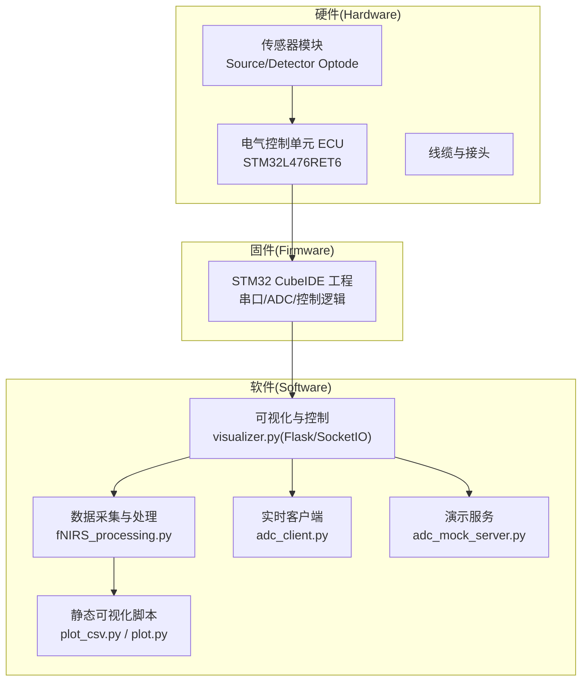
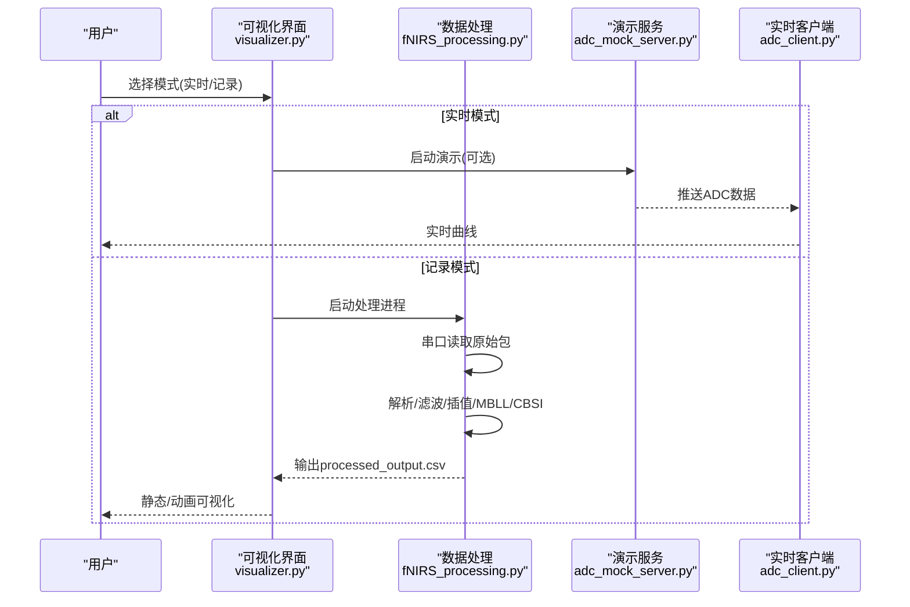
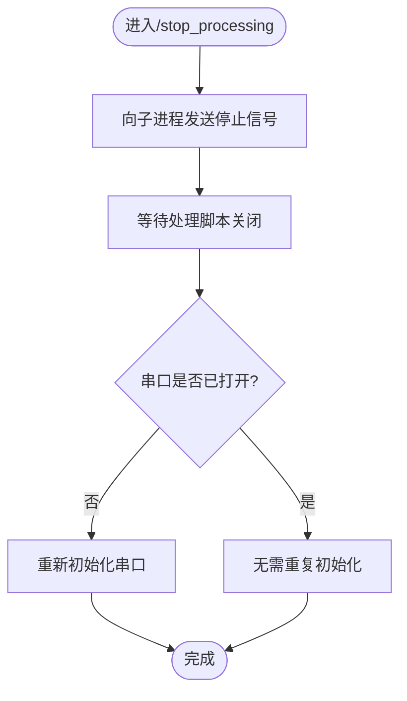
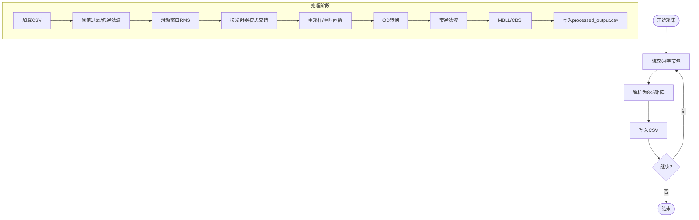
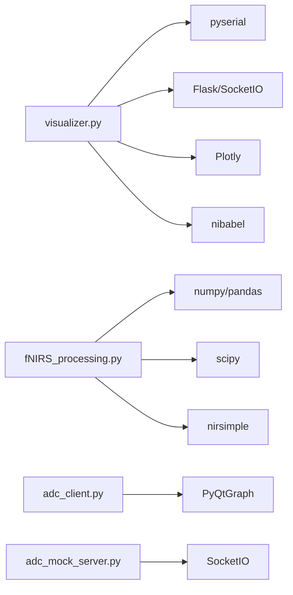
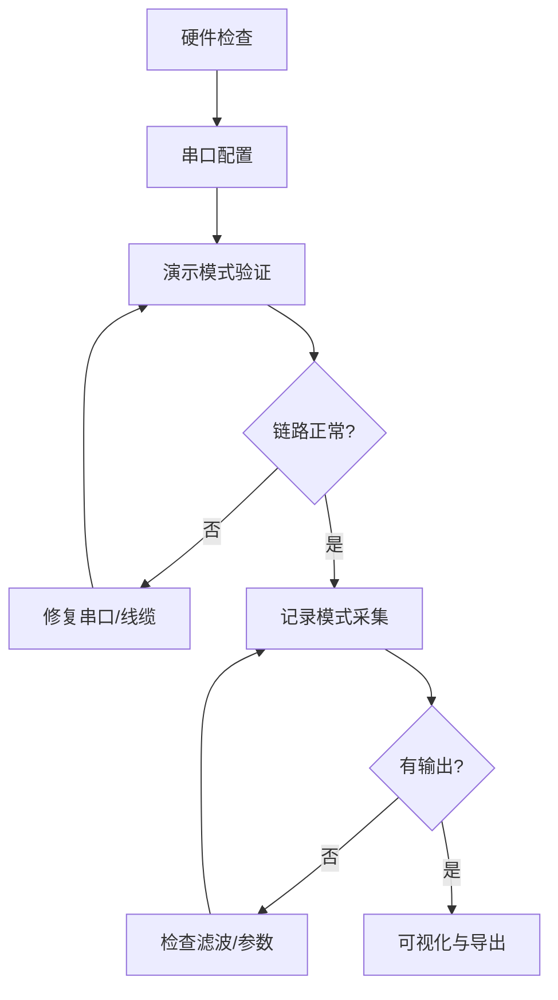

# 故障排除与FAQ

<cite>
**本文引用的文件**
- [README.md](file://README.md)
- [software/README.md](file://software/README.md)
- [firmware/README.md](file://firmware/README.md)
- [hardware/README.md](file://hardware/README.md)
- [software/requirements.txt](file://software/requirements.txt)
- [software/config.py](file://software/config.py)
- [software/visualizer.py](file://software/visualizer.py)
- [software/fNIRS_processing.py](file://software/fNIRS_processing.py)
- [software/adc_client.py](file://software/adc_client.py)
- [software/adc_mock_server.py](file://software/adc_mock_server.py)
- [software/testing-scripts/plot_csv.py](file://software/testing-scripts/plot_csv.py)
- [software/testing-scripts/plot.py](file://software/testing-scripts/plot.py)
</cite>

## 目录
1. [简介](#简介)
2. [项目结构](#项目结构)
3. [核心组件](#核心组件)
4. [架构总览](#架构总览)
5. [详细组件分析](#详细组件分析)
6. [依赖关系分析](#依赖关系分析)
7. [性能注意事项](#性能注意事项)
8. [故障排除指南](#故障排除指南)
9. [结论](#结论)
10. [附录](#附录)

## 简介
本文件面向fNIRS系统的技术支持与使用者，提供系统化、可操作的故障排除与常见问题解答（FAQ）。内容覆盖硬件连接、软件运行、数据质量三大类问题，并给出诊断流程、错误信息解释、预防性维护与系统优化建议，以及紧急情况下的应急处理与数据保护策略。

## 项目结构
fNIRS系统由三部分组成：硬件（传感器模块、ECU、线缆）、固件（STM32微控制器上的实时控制与通信）、软件（Python图形界面、数据采集与处理、可视化）。

图表来源
- [software/README.md](file://software/README.md#L1-L180)
- [firmware/README.md](file://firmware/README.md#L1-L17)
- [hardware/README.md](file://hardware/README.md#L1-L19)

章节来源
- [README.md](file://README.md#L1-L19)
- [software/README.md](file://software/README.md#L1-L180)
- [firmware/README.md](file://firmware/README.md#L1-L17)
- [hardware/README.md](file://hardware/README.md#L1-L19)

## 核心组件
- 可视化与控制服务器：负责Web界面、SocketIO通信、脑图谱渲染、模式切换与下载CSV。
- 数据采集与处理：从串口读取原始ADC包，解析、滤波、插值、MBLL/CBSI处理，输出CSV。
- 实时客户端：接收SocketIO推送，绘制实时ADC/mBLL曲线。
- 演示服务：模拟数据流，便于无硬件时验证UI与流程。
- 静态可视化：生成交互式Plotly页面，便于离线查看结果。

章节来源
- [software/visualizer.py](file://software/visualizer.py#L1-L947)
- [software/fNIRS_processing.py](file://software/fNIRS_processing.py#L1-L496)
- [software/adc_client.py](file://software/adc_client.py#L1-L181)
- [software/adc_mock_server.py](file://software/adc_mock_server.py#L1-L65)
- [software/testing-scripts/plot_csv.py](file://software/testing-scripts/plot_csv.py#L1-L192)
- [software/testing-scripts/plot.py](file://software/testing-scripts/plot.py#L1-L105)

## 架构总览
系统采用“硬件-固件-软件”分层架构：固件在ECU上通过串口向主机发送原始ADC数据；软件侧通过SocketIO或直接串口进行数据采集与处理；可视化组件提供Web界面与3D脑图谱。

图表来源
- [software/visualizer.py](file://software/visualizer.py#L646-L711)
- [software/fNIRS_processing.py](file://software/fNIRS_processing.py#L445-L496)
- [software/adc_mock_server.py](file://software/adc_mock_server.py#L48-L65)
- [software/adc_client.py](file://software/adc_client.py#L161-L176)

## 详细组件分析

### 组件A：可视化与控制服务器（visualizer.py）
- 功能要点
  - 基于Flask/SocketIO提供Web界面，支持模式切换、控制下发、数据下载。
  - 在记录模式下启动子进程执行数据处理；在实时模式下启动演示或ADC客户端。
  - 提供3D脑图谱渲染与区域高亮更新。
- 关键流程
  - 模式选择：根据请求参数决定启动ADC演示或调用数据处理脚本。
  - 控制下发：将前端控制状态打包为字节写入串口（非演示模式）。
  - 数据接收：上游SocketIO推送处理后的浓度数据，更新脑图谱高亮。
- 错误处理
  - 串口重连与关闭日志记录，异常捕获并返回错误信息。
  - 子进程停止通过信号触发，确保资源释放。

图表来源
- [software/visualizer.py](file://software/visualizer.py#L690-L711)
- [software/visualizer.py](file://software/visualizer.py#L562-L587)

章节来源
- [software/visualizer.py](file://software/visualizer.py#L1-L947)

### 组件B：数据采集与处理（fNIRS_processing.py）
- 功能要点
  - 从串口读取固定长度的原始数据包，解析为8组传感器数据。
  - 进行阈值过滤、低通滤波、滑动窗口RMS、模式块交错、时间戳重采样。
  - 应用OD转换、带通滤波、MBLL与CBSI，输出processed_output.csv。
- 关键流程
  - 采集循环：持续读取64字节包，解析后写入CSV。
  - 处理管线：阈值/滤波/RMS/交错/重采样/OD/滤波/MBLL/CBSI。
- 错误处理
  - 异常捕获并打印，保证流程可恢复。

图表来源
- [software/fNIRS_processing.py](file://software/fNIRS_processing.py#L187-L234)
- [software/fNIRS_processing.py](file://software/fNIRS_processing.py#L339-L434)

章节来源
- [software/fNIRS_processing.py](file://software/fNIRS_processing.py#L1-L496)

### 组件C：实时客户端（adc_client.py）
- 功能要点
  - 通过SocketIO连接本地服务，接收24通道ADC数组，按组与通道绘制曲线。
  - 使用多队列存储最近数据点，定时刷新显示。
- 错误处理
  - 连接异常打印；数据长度校验，不足则丢弃。

章节来源
- [software/adc_client.py](file://software/adc_client.py#L1-L181)

### 组件D：演示服务（adc_mock_server.py）
- 功能要点
  - 以三角波模拟24通道ADC数据，周期性通过SocketIO广播。
  - 便于无硬件时验证UI与数据链路。
- 错误处理
  - 后台任务与运行日志，异常捕获与重启。

章节来源
- [software/adc_mock_server.py](file://software/adc_mock_server.py#L1-L65)

## 依赖关系分析
- 软件依赖
  - Flask/SocketIO、Plotly、PyQt5/PyQtGraph、pandas/numpy/scipy、nirsimple、nibabel等。
  - 串口通信依赖pyserial。
- 版本与兼容性
  - 依赖清单见requirements.txt，建议使用虚拟环境隔离依赖。

图表来源
- [software/requirements.txt](file://software/requirements.txt#L1-L15)
- [software/visualizer.py](file://software/visualizer.py#L20-L32)
- [software/fNIRS_processing.py](file://software/fNIRS_processing.py#L10-L22)

章节来源
- [software/requirements.txt](file://software/requirements.txt#L1-L15)

## 性能注意事项
- 串口采样与处理
  - 采样率与滤波参数需匹配实际硬件帧率，避免欠采样或过度滤波。
  - 滑动窗口RMS与带通滤波会增加计算量，必要时调整窗口大小与截止频率。
- 可视化性能
  - 实时客户端仅显示最近N点，避免内存膨胀；Plotly静态图适合大批量数据离线查看。
- 文件I/O
  - CSV写入频繁flush可能影响性能，建议批量化写入或降低刷新频率。

## 故障排除指南

### 一、硬件连接问题
- 症状
  - 无法检测到设备端口、串口占用、设备未响应。
- 定位方法
  - 确认串口路径与操作系统一致（Windows使用COM端口，macOS/Linux使用/dev/tty.*）。
  - 检查线缆与接头是否松动，ECU供电指示灯是否正常。
- 解决步骤
  - 更新config.py中的SERIAL_PORT为当前系统可用端口。
  - 重新插拔USB转串口线，更换另一根线缆或USB端口。
  - 在演示模式下先验证UI链路，确认串口问题是否来自硬件。
- 预防性维护
  - 定期检查接头与线缆护套，避免长期弯折导致接触不良。
  - 使用前对ECU与传感器模块进行外观检查与通电自检。

章节来源
- [software/config.py](file://software/config.py#L7-L12)
- [software/README.md](file://software/README.md#L58-L86)

### 二、软件运行问题
- 症状
  - 启动失败、依赖缺失、端口被占用、界面无响应。
- 定位方法
  - 查看终端输出与日志，确认依赖安装与版本是否满足requirements.txt。
  - 检查端口占用（同一端口被其他程序占用会导致连接失败）。
- 解决步骤
  - 清理并重建虚拟环境，重新安装依赖。
  - 更换端口或关闭占用端口的其他程序。
  - 使用演示模式验证UI与SocketIO链路，排除串口问题。
- 预防性维护
  - 定期更新依赖至兼容版本，避免版本冲突。
  - 在启动前检查端口权限与可用性。

章节来源
- [software/requirements.txt](file://software/requirements.txt#L1-L15)
- [software/README.md](file://software/README.md#L58-L100)

### 三、数据质量问题
- 症状
  - 数据缺失、跳变、噪声大、处理后无输出。
- 定位方法
  - 对比原始all_groups.csv与processed_output.csv，确认采集阶段是否成功。
  - 检查滤波参数与RMS窗口设置是否合理。
- 解决步骤
  - 调整阈值过滤上下限与低通滤波截止频率。
  - 缩小滑动窗口或关闭RMS，逐步排查异常段。
  - 确认发射器模式交替正确，避免交错失败导致样本配对错误。
- 预防性维护
  - 采集前进行基线测试，确保传感器模块与ECU稳定。
  - 定期校准采样率与滤波参数，保持一致性。

章节来源
- [software/fNIRS_processing.py](file://software/fNIRS_processing.py#L51-L82)
- [software/fNIRS_processing.py](file://software/fNIRS_processing.py#L84-L126)
- [software/fNIRS_processing.py](file://software/fNIRS_processing.py#L236-L277)
- [software/fNIRS_processing.py](file://software/fNIRS_processing.py#L339-L434)

### 四、错误信息与处理
- 串口相关
  - “未找到串口/端口被占用”：检查端口路径与占用情况，更换端口或释放占用。
  - “读取超时/无有效数据”：检查波特率、线缆质量与供电，适当增大超时。
- SocketIO相关
  - “连接失败/断开”：确认本地服务端口开放，网络无阻断；客户端重连逻辑是否生效。
- 处理脚本相关
  - “数据行不足/样本配对失败”：检查采集时长与模式切换，确保至少两行用于配对。
  - “异常/中断”：查看日志定位具体函数，必要时回退参数或启用演示模式验证。

章节来源
- [software/visualizer.py](file://software/visualizer.py#L40-L44)
- [software/visualizer.py](file://software/visualizer.py#L562-L587)
- [software/fNIRS_processing.py](file://software/fNIRS_processing.py#L214-L234)
- [software/fNIRS_processing.py](file://software/fNIRS_processing.py#L375-L377)

### 五、系统化故障诊断流程
- 步骤1：确认硬件供电与连线
  - 检查ECU与传感器模块指示灯，线缆接头紧固。
- 步骤2：验证串口与端口
  - 更新config.py端口，确认端口可用且无占用。
- 步骤3：演示模式验证
  - 启动演示服务与实时客户端，确认UI与SocketIO链路。
- 步骤4：采集与处理验证
  - 启动记录模式，观察CSV生成与处理输出。
- 步骤5：可视化与导出
  - 打开静态Plotly页面与3D脑图谱，导出CSV进行离线分析。

图表来源
- [software/README.md](file://software/README.md#L58-L100)
- [software/visualizer.py](file://software/visualizer.py#L646-L711)
- [software/fNIRS_processing.py](file://software/fNIRS_processing.py#L445-L496)

### 六、紧急情况与数据保护
- 紧急停止
  - 通过“停止处理”接口向子进程发送停止信号，确保串口与进程资源释放。
- 数据保护
  - 采集期间定期备份all_groups.csv；处理完成后同时保留中间文件以便回溯。
  - 导出CSV时指定明确文件名，避免覆盖历史数据。

章节来源
- [software/visualizer.py](file://software/visualizer.py#L690-L711)
- [software/visualizer.py](file://software/visualizer.py#L714-L733)

### 七、技术支持工具与方法
- 常用命令
  - 列出可用串口（Windows：PowerShell中Get-WMIObject Win32_SerialPort；macOS/Linux：ls /dev/tty.*）。
  - 在虚拟环境中安装依赖：pip install -r requirements.txt。
- 调试技巧
  - 启用详细日志，关注串口读写、SocketIO事件与子进程生命周期。
  - 使用演示服务快速验证UI与数据链路，再接入真实硬件。
- 用户自助指南
  - 按照“演示模式→记录模式→可视化”的顺序逐步排查。
  - 若实时曲线不更新，优先检查演示服务是否启动与端口绑定。

章节来源
- [software/README.md](file://software/README.md#L65-L100)
- [software/requirements.txt](file://software/requirements.txt#L1-L15)

## 结论
本指南提供了从硬件到软件、从采集到可视化的全链路故障排除方法。建议在日常使用中遵循“演示验证→参数校准→稳定采集→可视化导出”的流程，并建立定期维护与数据备份机制，以提升系统可靠性与用户体验。

## 附录
- 快速参考
  - 串口配置：SERIAL_PORT、BAUD_RATE、TIMEOUT
  - 模式切换：实时/记录
  - 下载CSV：ADC或mBLL
- 常见端口与平台
  - Windows：COM3/COM4等
  - macOS：/dev/tty.usbmodemXXXX
  - Linux：/dev/ttyUSB0

章节来源
- [software/config.py](file://software/config.py#L7-L12)
- [software/README.md](file://software/README.md#L65-L100)