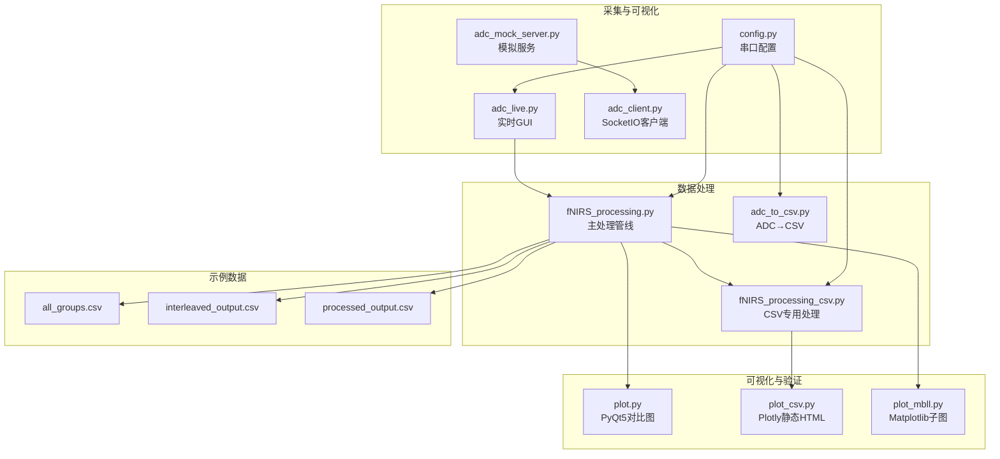
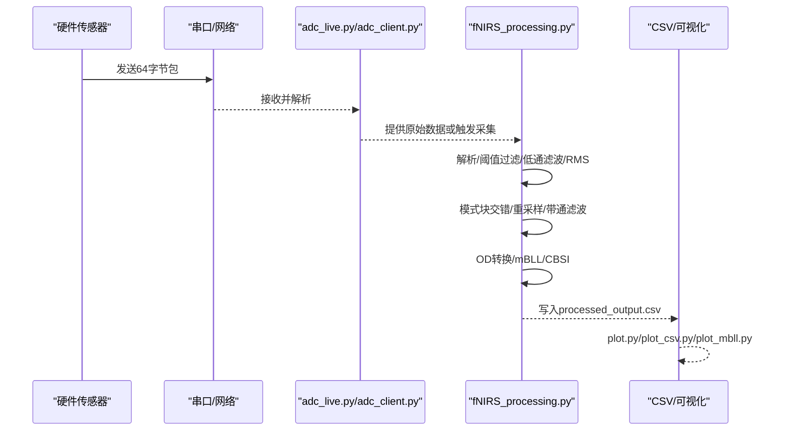
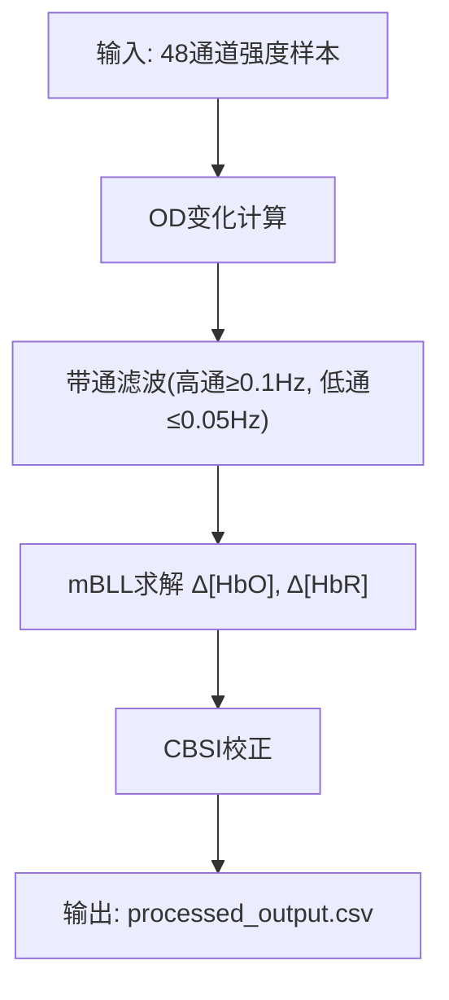
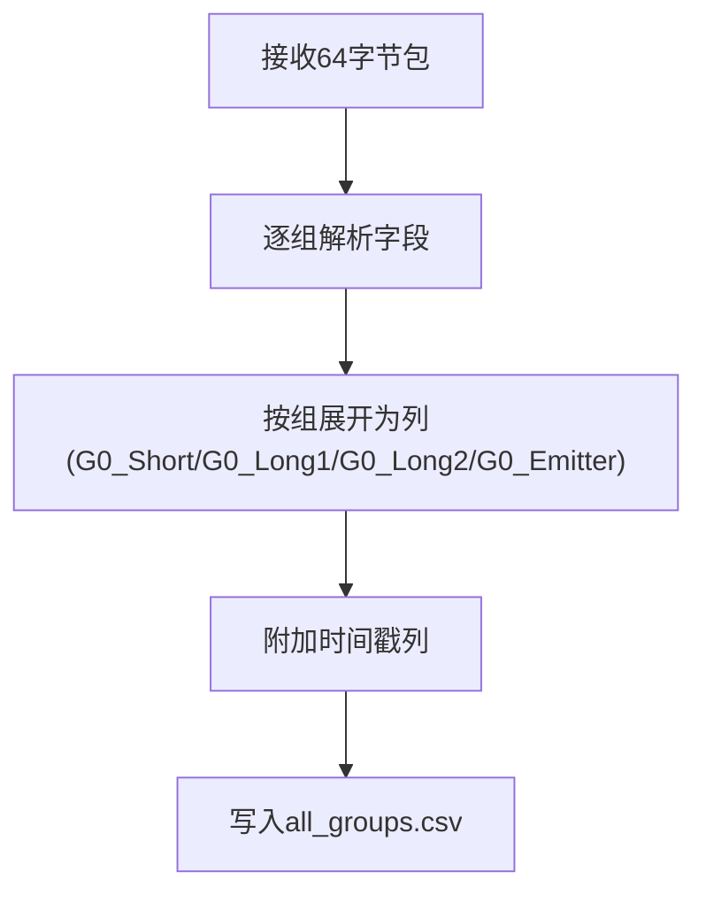
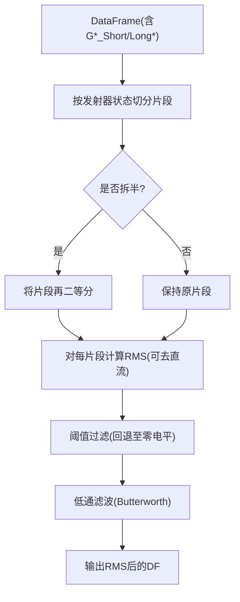
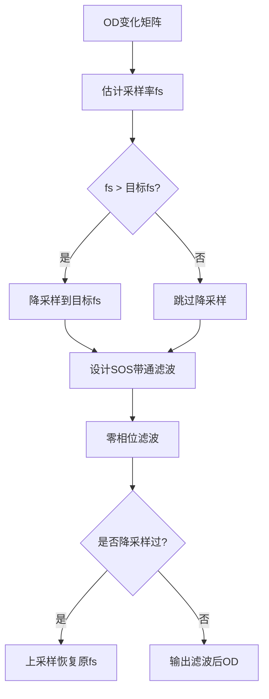
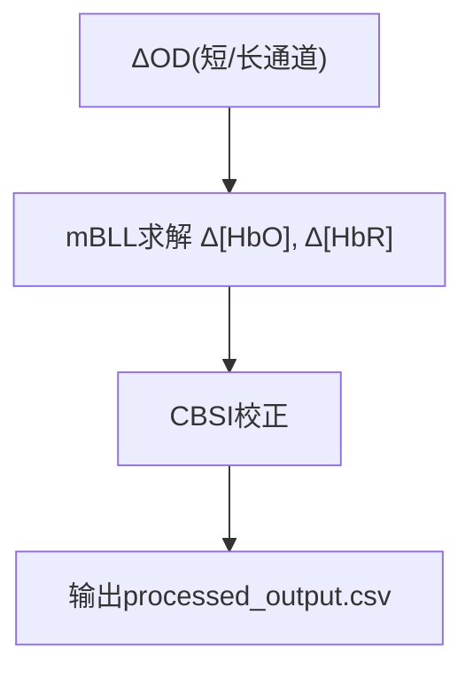
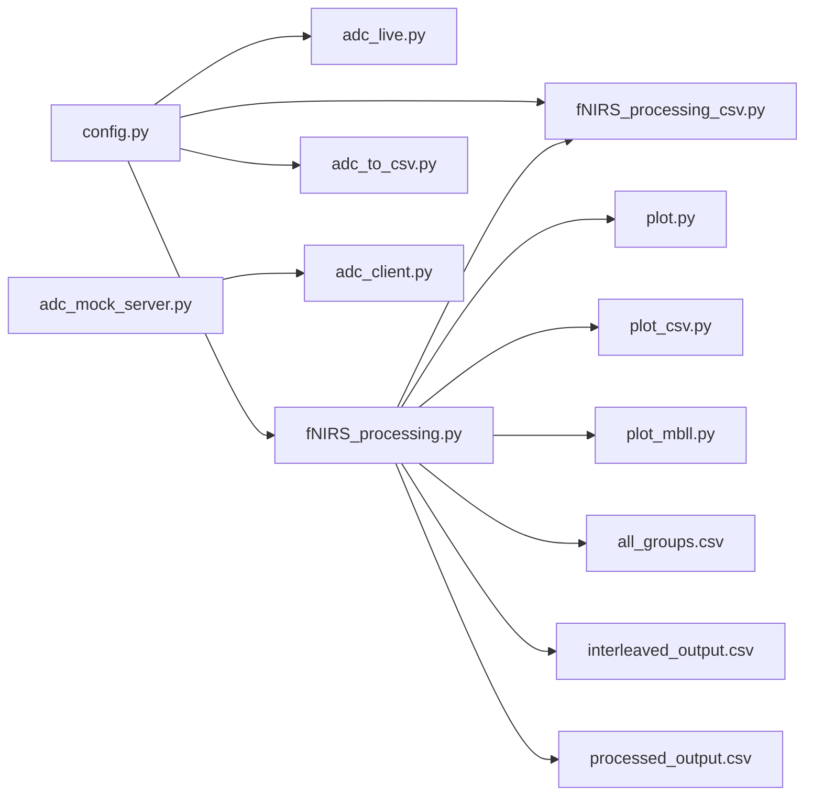

# 数据处理与分析

<cite>
**本文引用的文件**
- [fNIRS_processing.py](file://software/fNIRS_processing.py)
- [config.py](file://software/config.py)
- [adc_client.py](file://software/adc_client.py)
- [adc_live.py](file://software/adc_live.py)
- [adc_mock_server.py](file://software/adc_mock_server.py)
- [fNIRS_processing_csv.py](file://software/testing-scripts/fNIRS_processing_csv.py)
- [plot.py](file://software/testing-scripts/plot.py)
- [plot_csv.py](file://software/testing-scripts/plot_csv.py)
- [plot_mbll.py](file://software/testing-scripts/plot_mbll.py)
- [adc_to_csv.py](file://software/testing-scripts/adc_to_csv.py)
- [all_groups.csv](file://software/sample_data/all_groups.csv)
- [interleaved_output.csv](file://software/sample_data/interleaved_output.csv)
- [processed_output.csv](file://software/sample_data/processed_output.csv)
- [README.md](file://README.md)
</cite>

## 目录
1. [简介](#简介)
2. [项目结构](#项目结构)
3. [核心组件](#核心组件)
4. [架构总览](#架构总览)
5. [详细组件分析](#详细组件分析)
6. [依赖关系分析](#依赖关系分析)
7. [性能考量](#性能考量)
8. [故障排查指南](#故障排查指南)
9. [结论](#结论)
10. [附录](#附录)

## 简介
本技术文档面向fNIRS数据处理与分析模块，系统阐述从原始ADC采集到血红蛋白浓度变化（ΔHbO、ΔHbR）的完整流程。重点包括：
- Modified Beer-Lambert Law（mBLL）在fNIRS中的应用原理与实现细节
- 原始ADC数据解析、格式化、滑动窗口RMS计算、带通滤波与去噪
- 光学密度（OD）计算与血红蛋白浓度变化推导
- 数据插值与重采样策略
- 批处理脚本使用与参数定制
- 数据质量评估、异常检测与清洗策略
- 研究人员最佳实践与结果解释指南

## 项目结构
软件层主要由以下部分组成：
- 配置与串口通信：config.py、adc_live.py、adc_client.py、adc_mock_server.py
- 数据采集与批处理：fNIRS_processing.py、fNIRS_processing_csv.py、adc_to_csv.py
- 可视化与验证：plot.py、plot_csv.py、plot_mbll.py
- 示例数据：sample_data/*.csv

图表来源
- [config.py](file://software/config.py#L1-L13)
- [adc_live.py](file://software/adc_live.py#L1-L210)
- [adc_client.py](file://software/adc_client.py#L1-L181)
- [adc_mock_server.py](file://software/adc_mock_server.py#L1-L65)
- [fNIRS_processing.py](file://software/fNIRS_processing.py#L1-L496)
- [fNIRS_processing_csv.py](file://software/testing-scripts/fNIRS_processing_csv.py#L1-L497)
- [plot.py](file://software/testing-scripts/plot.py#L1-L105)
- [plot_csv.py](file://software/testing-scripts/plot_csv.py#L1-L192)
- [plot_mbll.py](file://software/testing-scripts/plot_mbll.py#L1-L113)

章节来源
- [README.md](file://README.md#L1-L19)

## 核心组件
- 串口配置与连接：提供串口端口、波特率、超时等常量，供采集与处理脚本复用。
- 实时采集与可视化：支持USB串口实时读取、解析、绘图；支持SocketIO远程数据流。
- 数据批处理：完成ADC→RMS→去噪→带通滤波→OD→mBLL→CBSI→输出。
- 可视化工具：提供PyQt5、Plotly、Matplotlib三类可视化方案，便于对比与报告生成。

章节来源
- [config.py](file://software/config.py#L1-L13)
- [adc_live.py](file://software/adc_live.py#L1-L210)
- [adc_client.py](file://software/adc_client.py#L1-L181)
- [adc_mock_server.py](file://software/adc_mock_server.py#L1-L65)
- [fNIRS_processing.py](file://software/fNIRS_processing.py#L1-L496)
- [fNIRS_processing_csv.py](file://software/testing-scripts/fNIRS_processing_csv.py#L1-L497)
- [plot.py](file://software/testing-scripts/plot.py#L1-L105)
- [plot_csv.py](file://software/testing-scripts/plot_csv.py#L1-L192)
- [plot_mbll.py](file://software/testing-scripts/plot_mbll.py#L1-L113)

## 架构总览
整体数据流从硬件采集开始，经串口或模拟服务进入Python处理管线，最终输出处理后CSV与可视化结果。

图表来源
- [adc_live.py](file://software/adc_live.py#L1-L210)
- [adc_client.py](file://software/adc_client.py#L1-L181)
- [fNIRS_processing.py](file://software/fNIRS_processing.py#L1-L496)

## 详细组件分析

### Modified Beer-Lambert Law（mBLL）应用与实现
- OD计算：将短波长与长波长探测器的光强比值转换为光学密度变化，作为mBLL输入。
- mBLL求解：基于两个波长（660 nm与940 nm）下的OD变化，结合摩尔消光系数表与路径因子（DPF），反演出ΔHbO与ΔHbR。
- CBSI优化：对通道间信号进行统计校正，提升信噪比与一致性。

图表来源
- [fNIRS_processing.py](file://software/fNIRS_processing.py#L397-L418)

章节来源
- [fNIRS_processing.py](file://software/fNIRS_processing.py#L339-L434)

### ADC原始数据解析与格式化
- 包结构：每包64字节，包含8组传感器数据，每组5字段（组ID、短通道、长通道1、长通道2、发射器状态）。
- 字节序与零电平反转：采用大端序解析，并通过零电平反转恢复真实ADC计数。
- 时间戳：采集时记录相对时间，后续用于估计采样率与重采样。

图表来源
- [fNIRS_processing.py](file://software/fNIRS_processing.py#L160-L185)
- [adc_to_csv.py](file://software/testing-scripts/adc_to_csv.py#L16-L37)

章节来源
- [fNIRS_processing.py](file://software/fNIRS_processing.py#L160-L185)
- [adc_to_csv.py](file://software/testing-scripts/adc_to_csv.py#L16-L37)

### 滑动窗口RMS计算与去噪
- 分段依据：根据发射器状态变化点分割连续片段，确保同一模式下（如660 nm或940 nm）的数据被统一处理。
- RMS计算：对每个片段内各通道短/长通道信号计算RMS，去除直流分量可选。
- 去噪策略：阈值抑制（超出范围则回退至零电平），低通滤波（Butterworth）进一步抑制高频噪声。

图表来源
- [fNIRS_processing.py](file://software/fNIRS_processing.py#L84-L126)
- [fNIRS_processing.py](file://software/fNIRS_processing.py#L51-L83)

章节来源
- [fNIRS_processing.py](file://software/fNIRS_processing.py#L84-L126)
- [fNIRS_processing.py](file://software/fNIRS_processing.py#L51-L83)

### 带通滤波与重采样
- 智能带通：先按目标采样率降采样，设计稳定SOS滤波器，零相位滤波，再上采样恢复。
- 参数选择：高通≥0.1 Hz抑制缓慢漂移；低通≤0.05 Hz抑制脉搏与噪声。
- 采样率估计：从时间戳差值估计fs，用于滤波器设计与重采样。

图表来源
- [fNIRS_processing.py](file://software/fNIRS_processing.py#L136-L158)

章节来源
- [fNIRS_processing.py](file://software/fNIRS_processing.py#L136-L158)

### 光学密度（OD）与血红蛋白浓度变化
- OD计算：基于短/长通道比值的对数变换，得到ΔOD。
- mBLL：利用两波长下的ΔOD，结合组织水动力学模型（DPF）、源-探测距离、摩尔消光系数表，求解ΔHbO与ΔHbR。
- CBSI：对通道间信号进行统计校正，减少系统性偏差。

图表来源
- [fNIRS_processing.py](file://software/fNIRS_processing.py#L397-L418)

章节来源
- [fNIRS_processing.py](file://software/fNIRS_processing.py#L397-L418)

### 数据插值与重采样
- 插值：在交错模式块后，为新时间轴分配固定增量的时间戳，避免浮点误差，随后四舍五入到毫秒级。
- 重采样：智能带通滤波中已包含降/上采样步骤，确保频谱满足奈奎斯特定理且去除混叠。

章节来源
- [fNIRS_processing.py](file://software/fNIRS_processing.py#L477-L484)
- [fNIRS_processing.py](file://software/fNIRS_processing.py#L136-L158)

### 批处理脚本使用与参数配置
- 主处理脚本：fNIRS_processing.py
  - 输入：interleaved_output.csv（模式交错后的DF）
  - 输出：processed_output.csv（含Time与各通道ΔHbO/ΔHbR）
  - 关键参数：年龄、短/长通道源-探测距离、摩尔消光系数表、带通滤波低/高截止频率与阶数
- CSV专用处理脚本：fNIRS_processing_csv.py
  - 支持直接从CSV读取并执行完整流程，便于离线分析
- 使用建议：
  - 在运行前确认串口配置正确（config.py）
  - 若无硬件，可用adc_mock_server.py配合adc_client.py进行演示
  - 处理完成后使用plot.py/plot_csv.py/plot_mbll.py进行可视化

章节来源
- [fNIRS_processing.py](file://software/fNIRS_processing.py#L339-L434)
- [fNIRS_processing_csv.py](file://software/testing-scripts/fNIRS_processing_csv.py#L340-L444)
- [config.py](file://software/config.py#L1-L13)
- [adc_mock_server.py](file://software/adc_mock_server.py#L1-L65)
- [adc_client.py](file://software/adc_client.py#L1-L181)

### 数据质量评估、异常检测与清洗策略
- 异常检测与清洗
  - 阈值过滤：对非发射器列设置上下限，超出范围回退至零电平，抑制极端异常
  - 低通滤波：抑制高频噪声与干扰
  - RMS去直流：可选去除直流分量，降低基线漂移影响
- 质量评估
  - 观察各通道ΔHbO/HbR曲线趋势，识别异常波动或平台期
  - 对比不同探测器（短/长）在同一通道的响应一致性
  - 结合事件标记（如rest/task）检查任务态响应是否显著

章节来源
- [fNIRS_processing.py](file://software/fNIRS_processing.py#L51-L83)
- [fNIRS_processing.py](file://software/fNIRS_processing.py#L68-L82)
- [fNIRS_processing.py](file://software/fNIRS_processing.py#L121-L124)

### 最佳实践与结果解释指南
- 采集阶段
  - 确保稳定的光源与探测器耦合，避免运动伪影
  - 记录实验事件与时间戳，便于后续分段分析
- 预处理阶段
  - 合理设置阈值与滤波参数，兼顾噪声抑制与信号保真
  - 注意采样率与滤波器设计的匹配，避免混叠
- 结果解释
  - ΔHbO上升通常指示局部脑区激活；ΔHbR变化需结合实验范式解读
  - 不同探测器深度对不同脑层敏感度不同，应结合解剖知识解释
  - CBSI校正有助于跨通道比较，但不改变绝对数值的物理意义

## 依赖关系分析

图表来源
- [config.py](file://software/config.py#L1-L13)
- [adc_live.py](file://software/adc_live.py#L1-L210)
- [fNIRS_processing.py](file://software/fNIRS_processing.py#L1-L496)
- [fNIRS_processing_csv.py](file://software/testing-scripts/fNIRS_processing_csv.py#L1-L497)
- [adc_mock_server.py](file://software/adc_mock_server.py#L1-L65)
- [adc_client.py](file://software/adc_client.py#L1-L181)
- [plot.py](file://software/testing-scripts/plot.py#L1-L105)
- [plot_csv.py](file://software/testing-scripts/plot_csv.py#L1-L192)
- [plot_mbll.py](file://software/testing-scripts/plot_mbll.py#L1-L113)

章节来源
- [config.py](file://software/config.py#L1-L13)
- [fNIRS_processing.py](file://software/fNIRS_processing.py#L1-L496)

## 性能考量
- 计算复杂度
  - RMS与滤波：O(N)逐列处理，整体线性于时间长度
  - mBLL与CBSI：O(C^2)与通道数相关，C≈48，可接受
- 内存占用
  - 处理过程中以DataFrame与NumPy数组为主，注意大文件分块处理
- 实时性
  - GUI刷新周期可调，建议在保证流畅的前提下适当降低刷新频率
- 并行化
  - 当前脚本为顺序执行；若需加速，可在滤波与OD计算环节引入多核并行（需谨慎处理时序）

## 故障排查指南
- 串口无法打开
  - 检查config.py中的端口与波特率是否与设备匹配
  - 确认驱动安装与权限问题
- 数据为空或异常
  - 确认硬件连接与发射器状态变化是否正确
  - 使用plot_csv.py查看原始ADC曲线，定位异常片段
- 处理报错
  - 检查interleaved_output.csv格式是否符合预期（偶数行、交替模式）
  - 调整带通滤波参数（bp_low/bp_high/order）以适配实际采样率
- 可视化问题
  - plot.py依赖PyQt5与pyqtgraph；plot_csv.py依赖Plotly；plot_mbll.py依赖Matplotlib
  - 确保相应库已安装并版本兼容

章节来源
- [config.py](file://software/config.py#L1-L13)
- [plot.py](file://software/testing-scripts/plot.py#L1-L105)
- [plot_csv.py](file://software/testing-scripts/plot_csv.py#L1-L192)
- [plot_mbll.py](file://software/testing-scripts/plot_mbll.py#L1-L113)

## 结论
本模块提供了从原始ADC到ΔHbO/ΔHbR的完整处理链路，结合mBLL与CBSI实现稳健的fNIRS数据分析。通过阈值过滤、低通与带通滤波、RMS去直流等预处理手段，以及严格的参数配置与可视化验证，能够有效提升数据质量与结果可靠性。建议研究者在实验设计与参数选择上遵循最佳实践，结合领域知识进行结果解释。

## 附录
- 示例数据位置
  - all_groups.csv：原始采集CSV
  - interleaved_output.csv：交错模式后的中间产物
  - processed_output.csv：最终处理结果（含Time与ΔHbO/ΔHbR）
- 可视化脚本
  - plot.py：PyQt5对比图（ADC与mBLL）
  - plot_csv.py：Plotly静态HTML（分组展示）
  - plot_mbll.py：Matplotlib子图（按探测器分组）

章节来源
- [all_groups.csv](file://software/sample_data/all_groups.csv#L1-L2)
- [interleaved_output.csv](file://software/sample_data/interleaved_output.csv#L1-L2)
- [processed_output.csv](file://software/sample_data/processed_output.csv#L1-L2)
- [plot.py](file://software/testing-scripts/plot.py#L1-L105)
- [plot_csv.py](file://software/testing-scripts/plot_csv.py#L1-L192)
- [plot_mbll.py](file://software/testing-scripts/plot_mbll.py#L1-L113)