# 单元测试

<cite>
**本文引用的文件**
- [fNIRS_processing.py](file://software/fNIRS_processing.py)
- [adc_client.py](file://software/adc_client.py)
- [visualizer.py](file://software/visualizer.py)
- [nirs_viewer.py](file://software/nirs_viewer.py)
- [emitter_control.c](file://firmware/STM32/fNIRS/Core/Src/emitter_control.c)
- [mux_control.c](file://firmware/STM32/fNIRS/Core/Src/mux_control.c)
- [serial_interface.c](file://firmware/STM32/fNIRS/Core/Src/serial_interface.c)
- [emitter_control.h](file://firmware/STM32/fNIRS/Core/Inc/emitter_control.h)
- [mux_control.h](file://firmware/STM32/fNIRS/Core/Inc/mux_control.h)
- [serial_interface.h](file://firmware/STM32/fNIRS/Core/Inc/serial_interface.h)
- [config.py](file://software/config.py)
- [adc_to_csv.py](file://software/testing-scripts/adc_to_csv.py)
- [apply_rms_to_adc.py](file://software/testing-scripts/apply_rms_to_adc.py)
- [fNIRS_processing_csv.py](file://software/testing-scripts/fNIRS_processing_csv.py)
- [plot.py](file://software/testing-scripts/plot.py)
- [plot_csv.py](file://software/testing-scripts/plot_csv.py)
- [plot_mbll.py](file://software/testing-scripts/plot_mbll.py)
</cite>

## 目录
1. [引言](#引言)
2. [项目结构](#项目结构)
3. [核心组件](#核心组件)
4. [架构总览](#架构总览)
5. [详细组件分析](#详细组件分析)
6. [依赖关系分析](#依赖关系分析)
7. [性能考量](#性能考量)
8. [故障排查指南](#故障排查指南)
9. [结论](#结论)
10. [附录](#附录)

## 引言
本文件面向fNIRS系统的单元测试，围绕以下目标展开：
- 数据处理算法测试：ADC数据解析、滑动窗口RMS计算、MBLL算法
- 硬件控制模块测试：发射器控制状态机、MUX切换器时序、串口通信协议
- 可视化组件测试：PyQtGraph图表、Plotly 3D可视化、实时数据更新
- 测试脚本使用指南：测试数据准备、测试环境配置、测试结果验证
- 覆盖率与用例设计：覆盖率要求、用例设计原则、测试数据管理

## 项目结构
软件侧主要由数据采集与处理、可视化与Web界面、以及测试脚本组成；固件侧包含发射器控制、MUX控制与串口接口等模块。

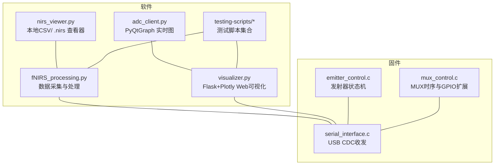

**图表来源**
- [fNIRS_processing.py](file://software/fNIRS_processing.py#L1-L496)
- [adc_client.py](file://software/adc_client.py#L1-L181)
- [visualizer.py](file://software/visualizer.py#L1-L947)
- [nirs_viewer.py](file://software/nirs_viewer.py#L1-L368)
- [emitter_control.c](file://firmware/STM32/fNIRS/Core/Src/emitter_control.c#L1-L291)
- [mux_control.c](file://firmware/STM32/fNIRS/Core/Src/mux_control.c#L1-L252)
- [serial_interface.c](file://firmware/STM32/fNIRS/Core/Src/serial_interface.c#L1-L82)

**章节来源**
- [fNIRS_processing.py](file://software/fNIRS_processing.py#L1-L496)
- [visualizer.py](file://software/visualizer.py#L1-L947)
- [adc_client.py](file://software/adc_client.py#L1-L181)
- [nirs_viewer.py](file://software/nirs_viewer.py#L1-L368)
- [emitter_control.c](file://firmware/STM32/fNIRS/Core/Src/emitter_control.c#L1-L291)
- [mux_control.c](file://firmware/STM32/fNIRS/Core/Src/mux_control.c#L1-L252)
- [serial_interface.c](file://firmware/STM32/fNIRS/Core/Src/serial_interface.c#L1-L82)

## 核心组件
- 数据处理流水线：ADC原始包解析、阈值与低通滤波、滑动窗口RMS、模式块交错、带通滤波、MBLL与CBSI、输出CSV
- 硬件控制：发射器状态机（多种模式）、MUX顺序器与时序、USB CDC收发缓冲区布局
- 可视化：桌面端实时图（PyQtGraph）、Web端3D脑图（Plotly）、静态图表（CSV驱动）

**章节来源**
- [fNIRS_processing.py](file://software/fNIRS_processing.py#L160-L434)
- [emitter_control.c](file://firmware/STM32/fNIRS/Core/Src/emitter_control.c#L220-L278)
- [mux_control.c](file://firmware/STM32/fNIRS/Core/Src/mux_control.c#L170-L229)
- [serial_interface.c](file://firmware/STM32/fNIRS/Core/Src/serial_interface.c#L20-L81)

## 架构总览
系统通过USB CDC从固件接收64字节传感器包，软件侧解析后进入处理链路，最终输出CSV或通过Web/桌面界面展示。

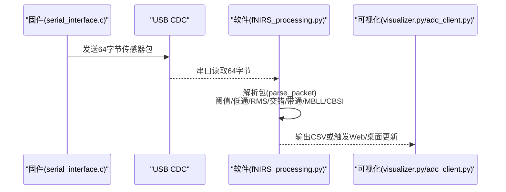

**图表来源**
- [serial_interface.c](file://firmware/STM32/fNIRS/Core/Src/serial_interface.c#L59-L81)
- [fNIRS_processing.py](file://software/fNIRS_processing.py#L160-L434)
- [visualizer.py](file://software/visualizer.py#L81-L96)

## 详细组件分析

### 数据处理算法测试

#### ADC数据解析测试
- 目标：验证64字节包解析正确性，字段映射与反向计数逻辑
- 关键函数：[parse_packet](file://software/fNIRS_processing.py#L160-L185)
- 输入：64字节原始数据
- 断言要点：
  - 每组8个传感器模块，每模块8字节
  - 字段顺序：标识符、三路传感器高/低位、发射器状态
  - 反向计数校验（零电平反转）
- 测试用例设计原则：
  - 边界值：最小/最大ADC值、零电平
  - 异常：长度不足、非标准包头
  - 多包：连续帧拼接后的稳定性

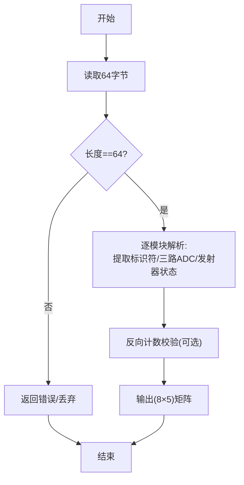

**图表来源**
- [fNIRS_processing.py](file://software/fNIRS_processing.py#L160-L185)

**章节来源**
- [fNIRS_processing.py](file://software/fNIRS_processing.py#L160-L185)

#### 滑动窗口RMS计算测试
- 目标：按发射器切换分段对短/长通道进行RMS计算，支持去直流与分半
- 关键函数：[sliding_window_rms](file://software/fNIRS_processing.py#L84-L126)
- 输入：DataFrame，指定参考发射器列、是否去直流、是否分半
- 断言要点：
  - 分段正确性：基于发射器状态变化点切分
  - 去直流一致性：均值归零后再求RMS
  - 分半策略：偶数长度分割，奇数长度尾部处理
- 测试用例设计原则：
  - 正常序列：稳定发射器状态+随机噪声
  - 切换序列：快速切换、慢速切换
  - 边界：单点段、空段、极短段

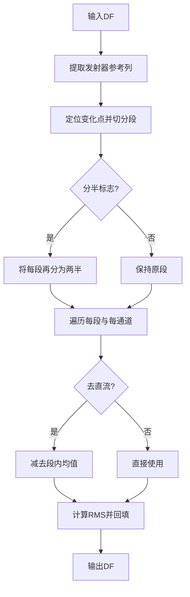

**图表来源**
- [fNIRS_processing.py](file://software/fNIRS_processing.py#L84-L126)

**章节来源**
- [fNIRS_processing.py](file://software/fNIRS_processing.py#L84-L126)

#### MBLL算法测试
- 目标：OD转换、带通滤波、MBLL与CBSI处理，输出ΔHbO/ΔHbR
- 关键函数：[process_csv_dataset](file://software/fNIRS_processing.py#L339-L443)
- 输入：交错后的CSV（时间+48通道强度）
- 断言要点：
  - 采样率估计与带通参数一致性
  - 通道信息构建（波长、DPF、距离）
  - OD变化与浓度变化数值范围合理性
  - CBSI改善信噪比（可选指标）
- 测试用例设计原则：
  - 工程数据：真实样本（含基线、任务区间）
  - 理想信号：正弦调制、恒定幅度
  - 异常：缺失行、格式不一致

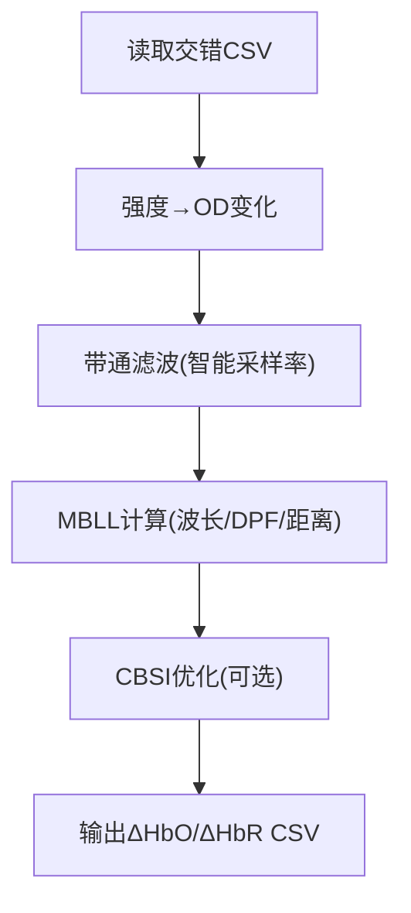

**图表来源**
- [fNIRS_processing.py](file://software/fNIRS_processing.py#L339-L443)

**章节来源**
- [fNIRS_processing.py](file://software/fNIRS_processing.py#L339-L443)

### 硬件控制模块测试

#### 发射器控制状态机测试
- 目标：验证状态迁移、PWM占空比/相位设置、用户覆盖逻辑
- 关键函数与状态：[emitter_control_state_machine](file://firmware/STM32/fNIRS/Core/Src/emitter_control.c#L220-L278)，状态枚举见[emitter_control.h](file://firmware/STM32/fNIRS/Core/Inc/emitter_control.h#L13-L24)
- 断言要点：
  - 状态迁移表：DISABLED→IDLE→请求态；IDLE→DEFAULT_MODE/CYCLING/FULLY_*；异常路径
  - PWM更新：频率/占空比/相位写入
  - 用户覆盖：启用标志、用户设置位映射到各PWM通道
- 测试用例设计原则：
  - 正常启用/禁用序列
  - 频繁切换请求态
  - 用户覆盖与自动模式交替

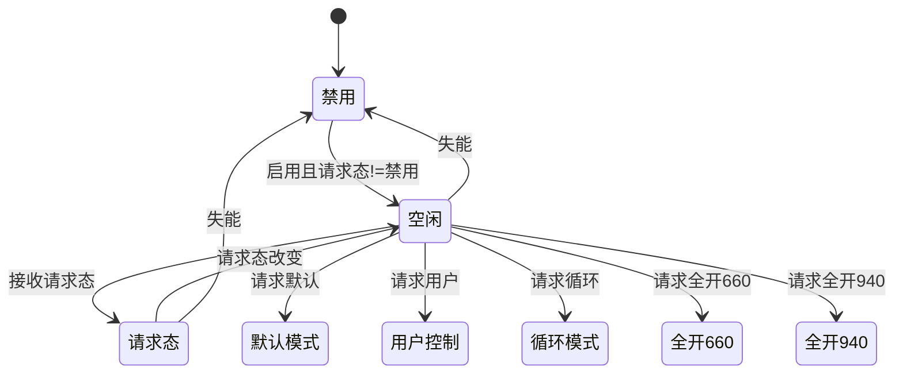

**图表来源**
- [emitter_control.c](file://firmware/STM32/fNIRS/Core/Src/emitter_control.c#L233-L270)
- [emitter_control.h](file://firmware/STM32/fNIRS/Core/Inc/emitter_control.h#L13-L24)

**章节来源**
- [emitter_control.c](file://firmware/STM32/fNIRS/Core/Src/emitter_control.c#L220-L278)
- [emitter_control.h](file://firmware/STM32/fNIRS/Core/Inc/emitter_control.h#L1-L54)

#### MUX切换器时序测试
- 目标：验证GPIO扩展器写入序列、顺序器时序、覆盖机制
- 关键函数：[mux_control_sequencer](file://firmware/STM32/fNIRS/Core/Src/mux_control.c#L170-L229)，通道定义见[mux_control.h](file://firmware/STM32/fNIRS/Core/Inc/mux_control.h#L21-L30)
- 断言要点：
  - 顺序器：ONE→TWO→THREE→ONE循环；DISABLED启用后进入FOUR
  - 写入序列：PORT0/PORT1组合值与宏定义一致
  - 覆盖：override开启时强制跳转至指定通道
- 测试用例设计原则：
  - 连续时序：多周期切换
  - 覆盖切换：在不同阶段切换覆盖通道
  - 禁用场景：确保PORT全零

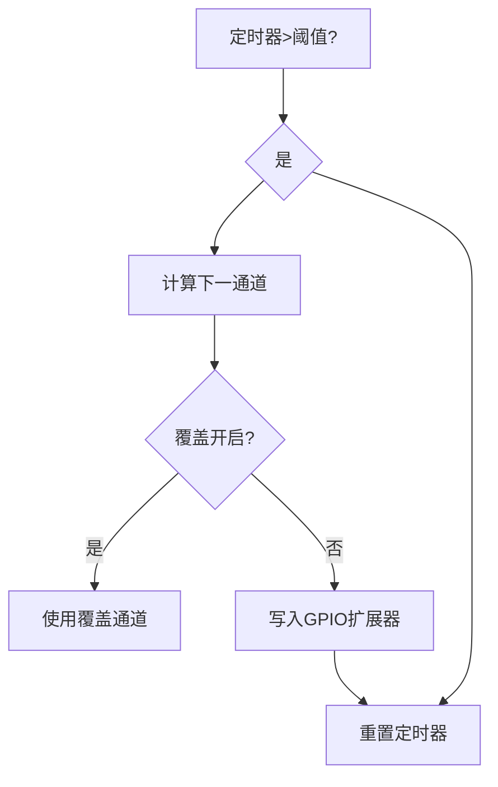

**图表来源**
- [mux_control.c](file://firmware/STM32/fNIRS/Core/Src/mux_control.c#L170-L229)
- [mux_control.h](file://firmware/STM32/fNIRS/Core/Inc/mux_control.h#L21-L30)

**章节来源**
- [mux_control.c](file://firmware/STM32/fNIRS/Core/Src/mux_control.c#L170-L229)
- [mux_control.h](file://firmware/STM32/fNIRS/Core/Inc/mux_control.h#L1-L56)

#### 串口通信协议测试
- 目标：验证RX/TX缓冲区索引、字段解析、发送数据打包
- 关键函数：[serial_interface_rx_parse_data](file://firmware/STM32/fNIRS/Core/Src/serial_interface.c#L20-L32)、[serial_interface_tx_send_sensor_data](file://firmware/STM32/fNIRS/Core/Src/serial_interface.c#L59-L81)，缓冲区索引见[serial_interface.h](file://firmware/STM32/fNIRS/Core/Inc/serial_interface.h#L12-L38)
- 断言要点：
  - RX：覆盖使能、状态、PWM掩码、MUX状态正确解析
  - TX：每个模块8字节，包含标识符、三路ADC高低字节、发射器状态
  - 发射器状态：940nm位在高位，660nm位在低位
- 测试用例设计原则：
  - 完整帧：覆盖使能+状态+掩码+通道
  - 边界帧：最小/最大掩码、无效状态
  - 时序：RX在ISR中调用，TX周期性调用

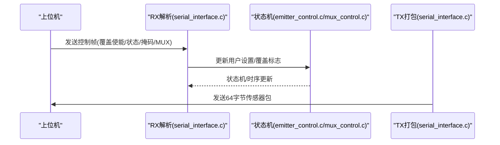

**图表来源**
- [serial_interface.c](file://firmware/STM32/fNIRS/Core/Src/serial_interface.c#L20-L81)
- [serial_interface.h](file://firmware/STM32/fNIRS/Core/Inc/serial_interface.h#L12-L38)
- [emitter_control.c](file://firmware/STM32/fNIRS/Core/Src/emitter_control.c#L220-L278)
- [mux_control.c](file://firmware/STM32/fNIRS/Core/Src/mux_control.c#L170-L229)

**章节来源**
- [serial_interface.c](file://firmware/STM32/fNIRS/Core/Src/serial_interface.c#L20-L81)
- [serial_interface.h](file://firmware/STM32/fNIRS/Core/Inc/serial_interface.h#L1-L64)

### 可视化组件测试

#### PyQtGraph图表测试
- 目标：验证实时曲线绘制、队列更新、线程安全
- 关键组件：[adc_client.py](file://software/adc_client.py#L1-L181)
- 断言要点：
  - 数据队列：每组3条曲线，长度上限控制
  - 线程：SocketIO线程与GUI线程分离，信号槽传递
  - 更新：定时器周期刷新，避免阻塞UI
- 测试用例设计原则：
  - 正常流：持续推送24维数据，曲线长度增长
  - 异常流：断连重连、数据长度不符

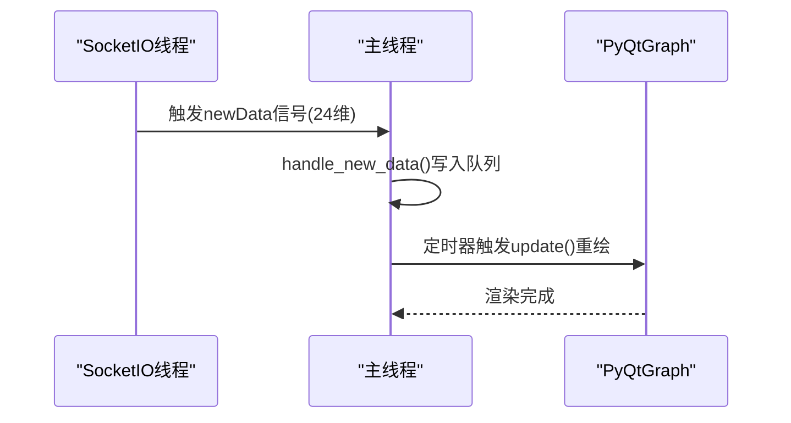

**图表来源**
- [adc_client.py](file://software/adc_client.py#L161-L176)
- [adc_client.py](file://software/adc_client.py#L144-L159)

**章节来源**
- [adc_client.py](file://software/adc_client.py#L1-L181)

#### Plotly 3D可视化测试
- 目标：验证脑模型加载、区域高亮、传感器节点渲染
- 关键组件：[visualizer.py](file://software/visualizer.py#L278-L352)
- 断言要点：
  - 静态网格：顶点/三角形加载与归一化
  - 传感器映射：发射器/探测器节点到网格法向量投影
  - 区域高亮：根据ΔHbO阈值映射到体素区域并着色
- 测试用例设计原则：
  - 正常流：接收最新浓度，更新高亮区域
  - 边界流：空数据、负值区域、阈值边界

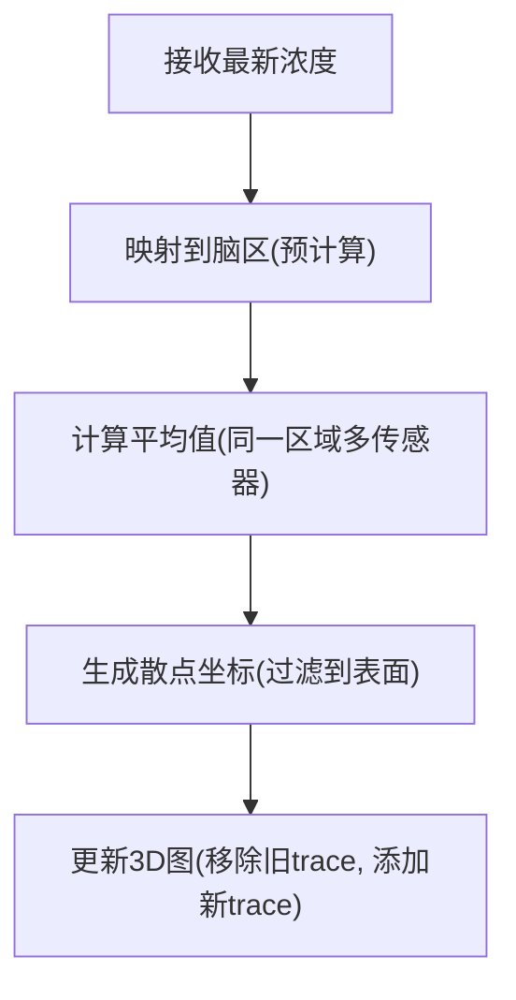

**图表来源**
- [visualizer.py](file://software/visualizer.py#L440-L484)
- [visualizer.py](file://software/visualizer.py#L278-L352)

**章节来源**
- [visualizer.py](file://software/visualizer.py#L278-L352)
- [visualizer.py](file://software/visualizer.py#L440-L484)

#### 实时数据更新测试
- 目标：验证Web端与桌面端实时更新的触发与一致性
- 关键组件：[visualizer.py](file://software/visualizer.py#L81-L96)、[adc_client.py](file://software/adc_client.py#L161-L176)
- 断言要点：
  - 上游数据：SocketIO事件processed_data接收并入队
  - mBLL模式：收到即刻更新3D图
  - ADC模式：桌面端实时曲线滚动
- 测试用例设计原则：
  - 时序：数据到达与渲染延迟
  - 并发：多线程/多进程下数据竞争

**章节来源**
- [visualizer.py](file://software/visualizer.py#L81-L96)
- [adc_client.py](file://software/adc_client.py#L161-L176)

## 依赖关系分析

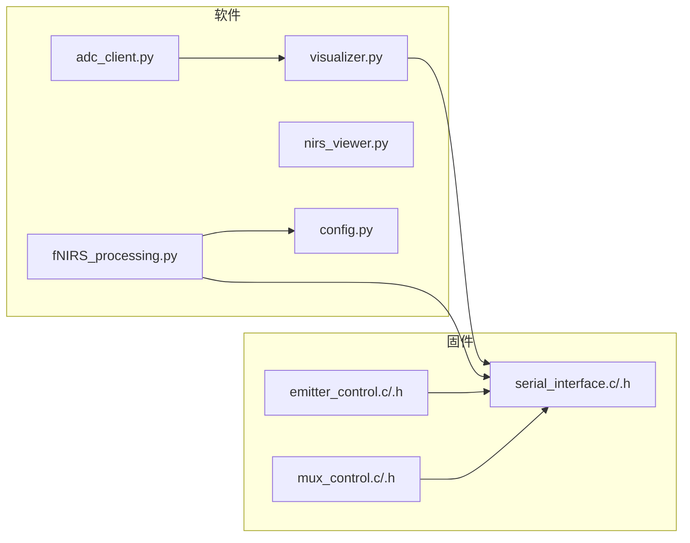

**图表来源**
- [fNIRS_processing.py](file://software/fNIRS_processing.py#L20-L23)
- [visualizer.py](file://software/visualizer.py#L32-L44)
- [adc_client.py](file://software/adc_client.py#L1-L181)
- [nirs_viewer.py](file://software/nirs_viewer.py#L1-L368)
- [emitter_control.c](file://firmware/STM32/fNIRS/Core/Src/emitter_control.c#L1-L291)
- [mux_control.c](file://firmware/STM32/fNIRS/Core/Src/mux_control.c#L1-L252)
- [serial_interface.c](file://firmware/STM32/fNIRS/Core/Src/serial_interface.c#L1-L82)

**章节来源**
- [fNIRS_processing.py](file://software/fNIRS_processing.py#L1-L496)
- [visualizer.py](file://software/visualizer.py#L1-L947)
- [adc_client.py](file://software/adc_client.py#L1-L181)
- [nirs_viewer.py](file://software/nirs_viewer.py#L1-L368)
- [emitter_control.c](file://firmware/STM32/fNIRS/Core/Src/emitter_control.c#L1-L291)
- [mux_control.c](file://firmware/STM32/fNIRS/Core/Src/mux_control.c#L1-L252)
- [serial_interface.c](file://firmware/STM32/fNIRS/Core/Src/serial_interface.c#L1-L82)

## 性能考量
- 数据处理链路：
  - 滤波与重采样可能带来计算开销，建议批处理与缓存中间结果
  - RMS分段计算避免全局均值影响局部动态
- 可视化：
  - PyQtGraph/Plotly渲染频率与数据量成正比，建议限制显示点数或降采样
  - Web端3D渲染受浏览器与GPU影响，建议离屏渲染或简化几何
- 固件：
  - 顺序器定时器阈值决定MUX切换速率，需平衡采样与切换
  - PWM更新频率与I2C带宽匹配，避免阻塞

## 故障排查指南
- 串口通信
  - 端口/波特率不匹配：检查[config.py](file://software/config.py#L7-L12)与固件配置
  - 数据长度异常：确认RX解析与TX打包索引一致
- 数据处理
  - RMS结果异常：检查发射器分段与去直流开关
  - MBLL输出异常：核对波长/距离/DPF与实际硬件一致
- 可视化
  - 图表不更新：确认SocketIO事件与定时器触发
  - 3D图空白：检查脑网格文件路径与坐标归一化

**章节来源**
- [config.py](file://software/config.py#L7-L12)
- [serial_interface.c](file://firmware/STM32/fNIRS/Core/Src/serial_interface.c#L20-L81)
- [fNIRS_processing.py](file://software/fNIRS_processing.py#L84-L126)
- [visualizer.py](file://software/visualizer.py#L81-L96)

## 结论
本测试文档围绕数据处理、硬件控制与可视化三大模块，给出了可操作的测试策略与流程图示。建议以“自底向上”的方式先完成固件状态机与串口协议的单元测试，再进行软件端数据处理与可视化的集成测试，并结合测试脚本完成端到端验证。

## 附录

### 测试脚本使用指南
- 测试数据准备
  - 使用[adc_to_csv.py](file://software/testing-scripts/adc_to_csv.py#L14-L67)捕获原始ADC数据到CSV
  - 使用[apply_rms_to_adc.py](file://software/testing-scripts/apply_rms_to_adc.py#L1-L77)对CSV应用RMS
  - 使用[fNIRS_processing_csv.py](file://software/testing-scripts/fNIRS_processing_csv.py#L453-L496)执行完整处理管线
- 测试环境配置
  - 串口参数：端口、波特率、超时见[config.py](file://software/config.py#L7-L12)
  - 固件侧：确保USB CDC收发与状态机运行
- 测试结果验证
  - 使用[plot.py](file://software/testing-scripts/plot.py#L1-L105)对比ADC与MBLL曲线
  - 使用[plot_csv.py](file://software/testing-scripts/plot_csv.py#L1-L192)生成静态HTML图表
  - 使用[plot_mbll.py](file://software/testing-scripts/plot_mbll.py#L1-L113)查看特定通道变化

**章节来源**
- [adc_to_csv.py](file://software/testing-scripts/adc_to_csv.py#L1-L67)
- [apply_rms_to_adc.py](file://software/testing-scripts/apply_rms_to_adc.py#L1-L77)
- [fNIRS_processing_csv.py](file://software/testing-scripts/fNIRS_processing_csv.py#L453-L496)
- [config.py](file://software/config.py#L7-L12)
- [plot.py](file://software/testing-scripts/plot.py#L1-L105)
- [plot_csv.py](file://software/testing-scripts/plot_csv.py#L1-L192)
- [plot_mbll.py](file://software/testing-scripts/plot_mbll.py#L1-L113)

### 测试覆盖率与用例设计原则
- 覆盖率要求
  - 函数/分支：≥80%
  - 边界条件：输入/输出边界、异常路径
  - 时序：状态机/顺序器关键时钟点
- 用例设计原则
  - 等价类划分：正常/异常/边界
  - 因果图：输入组合与输出响应
  - 决策表：状态机/顺序器多条件触发
- 测试数据管理
  - 生成测试集：合成信号+真实样本
  - 标注期望：理论值/统计阈值
  - 归档：版本化CSV与日志