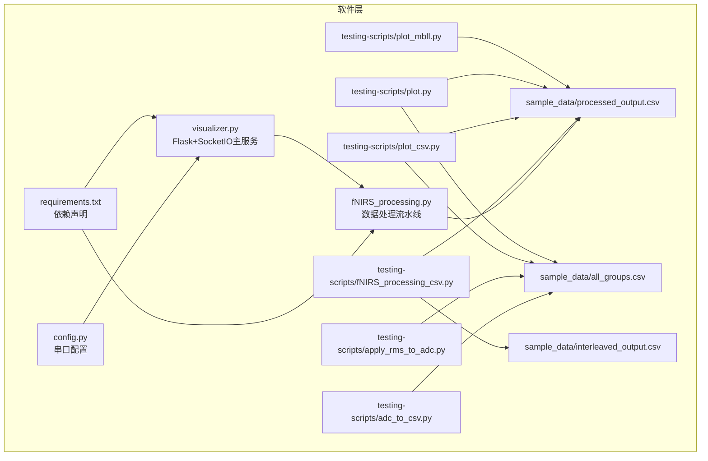
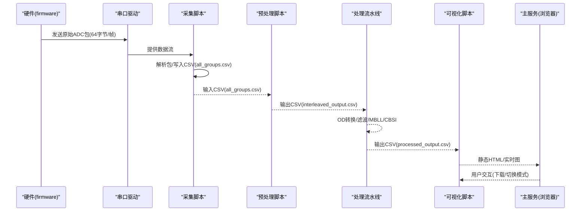
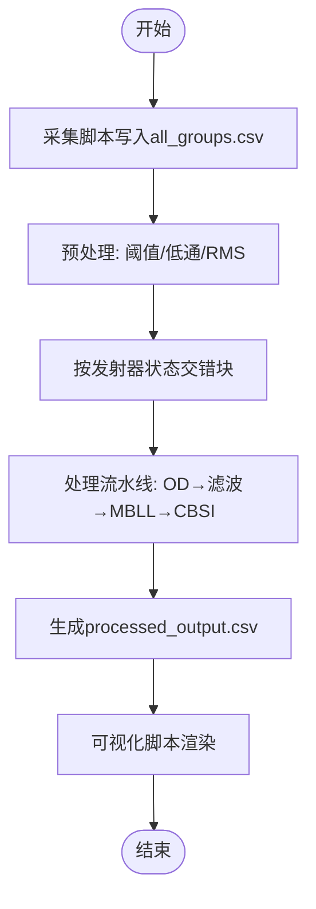
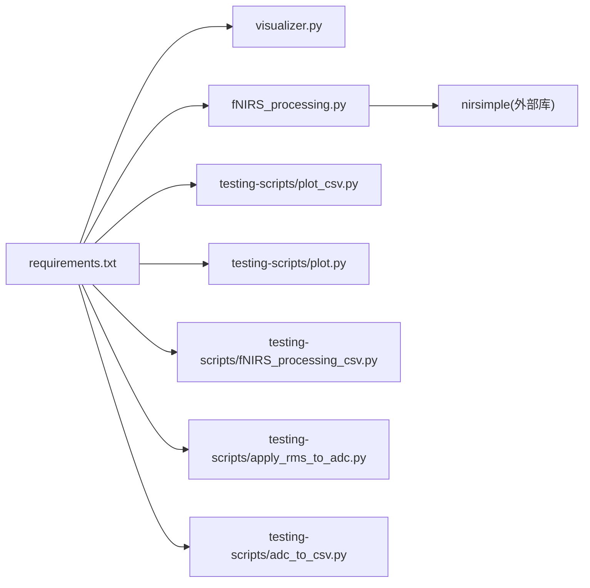

# 测试与验证

<cite>
**本文引用的文件**
- [software/README.md](file://software/README.md)
- [software/requirements.txt](file://software/requirements.txt)
- [software/config.py](file://software/config.py)
- [software/testing-scripts/adc_to_csv.py](file://software/testing-scripts/adc_to_csv.py)
- [software/testing-scripts/apply_rms_to_adc.py](file://software/testing-scripts/apply_rms_to_adc.py)
- [software/testing-scripts/fNIRS_processing_csv.py](file://software/testing-scripts/fNIRS_processing_csv.py)
- [software/testing-scripts/plot.py](file://software/testing-scripts/plot.py)
- [software/testing-scripts/plot_csv.py](file://software/testing-scripts/plot_csv.py)
- [software/testing-scripts/plot_mbll.py](file://software/testing-scripts/plot_mbll.py)
- [software/sample_data/all_groups.csv](file://software/sample_data/all_groups.csv)
- [software/sample_data/interleaved_output.csv](file://software/sample_data/interleaved_output.csv)
- [software/sample_data/processed_output.csv](file://software/sample_data/processed_output.csv)
- [software/fNIRS_processing.py](file://software/fNIRS_processing.py)
- [software/visualizer.py](file://software/visualizer.py)
</cite>

## 目录
1. [引言](#引言)
2. [项目结构](#项目结构)
3. [核心组件](#核心组件)
4. [架构总览](#架构总览)
5. [详细组件分析](#详细组件分析)
6. [依赖关系分析](#依赖关系分析)
7. [性能考虑](#性能考虑)
8. [故障排查指南](#故障排查指南)
9. [结论](#结论)
10. [附录](#附录)

## 引言
本文件面向fNIRS系统的测试与验证，提供从单元测试到集成测试再到用户验收测试的完整指导。内容覆盖数据处理算法测试、硬件控制模块测试、可视化组件测试；集成测试涵盖端到端系统测试、硬件-软件协同测试与性能稳定性测试；用户验收测试包含功能完整性、界面可用性与真实场景测试。同时给出测试脚本使用方法、测试数据准备与分析方法、测试结果评估标准，并为开发者提供测试环境搭建与自动化测试实现建议。

## 项目结构
软件侧主要由以下部分组成：
- 配置与运行：配置串口参数、依赖安装、主服务入口
- 数据采集与处理：原始ADC数据采集、预处理（阈值过滤、低通滤波、滑动窗口RMS）、MBLL/CBSI处理
- 可视化：静态HTML图表（Plotly）、实时动画（PyQtGraph）、3D脑模型
- 测试脚本：数据采集脚本、CSV处理脚本、可视化脚本

**图示来源**
- [software/config.py](file://software/config.py#L1-L13)
- [software/requirements.txt](file://software/requirements.txt#L1-L15)
- [software/visualizer.py](file://software/visualizer.py#L1-L120)
- [software/fNIRS_processing.py](file://software/fNIRS_processing.py#L1-L200)
- [software/testing-scripts/adc_to_csv.py](file://software/testing-scripts/adc_to_csv.py#L1-L67)
- [software/testing-scripts/apply_rms_to_adc.py](file://software/testing-scripts/apply_rms_to_adc.py#L1-L77)
- [software/testing-scripts/fNIRS_processing_csv.py](file://software/testing-scripts/fNIRS_processing_csv.py#L1-L497)
- [software/testing-scripts/plot_csv.py](file://software/testing-scripts/plot_csv.py#L1-L192)
- [software/testing-scripts/plot.py](file://software/testing-scripts/plot.py#L1-L105)
- [software/testing-scripts/plot_mbll.py](file://software/testing-scripts/plot_mbll.py#L1-L113)
- [software/sample_data/all_groups.csv](file://software/sample_data/all_groups.csv#L1-L2)
- [software/sample_data/interleaved_output.csv](file://software/sample_data/interleaved_output.csv)
- [software/sample_data/processed_output.csv](file://software/sample_data/processed_output.csv)

**章节来源**
- [software/README.md](file://software/README.md#L1-L180)

## 核心组件
- 配置与串口：通过配置文件设置串口路径、波特率与超时，供采集与处理模块使用
- 数据采集脚本：从串口读取原始ADC包，写入CSV
- 预处理脚本：对CSV进行阈值过滤、低通滤波、滑动窗口RMS计算
- 处理流水线：将两模式交替的行合并为48通道样本，OD转换、带通滤波、MBLL、CBSI，输出processed_output.csv
- 可视化脚本：生成Plotly静态HTML或PyQtGraph实时图
- 主服务：Flask+SocketIO提供Web界面、3D脑模型与数据接收

**章节来源**
- [software/config.py](file://software/config.py#L1-L13)
- [software/requirements.txt](file://software/requirements.txt#L1-L15)
- [software/testing-scripts/adc_to_csv.py](file://software/testing-scripts/adc_to_csv.py#L1-L67)
- [software/testing-scripts/apply_rms_to_adc.py](file://software/testing-scripts/apply_rms_to_adc.py#L1-L77)
- [software/testing-scripts/fNIRS_processing_csv.py](file://software/testing-scripts/fNIRS_processing_csv.py#L1-L497)
- [software/testing-scripts/plot_csv.py](file://software/testing-scripts/plot_csv.py#L1-L192)
- [software/testing-scripts/plot.py](file://software/testing-scripts/plot.py#L1-L105)
- [software/visualizer.py](file://software/visualizer.py#L1-L200)

## 架构总览
下图展示从硬件到软件的端到端数据流，以及测试脚本在不同阶段的介入点。

**图示来源**
- [software/testing-scripts/adc_to_csv.py](file://software/testing-scripts/adc_to_csv.py#L1-L67)
- [software/testing-scripts/apply_rms_to_adc.py](file://software/testing-scripts/apply_rms_to_adc.py#L1-L77)
- [software/testing-scripts/fNIRS_processing_csv.py](file://software/testing-scripts/fNIRS_processing_csv.py#L1-L497)
- [software/testing-scripts/plot_csv.py](file://software/testing-scripts/plot_csv.py#L1-L192)
- [software/testing-scripts/plot.py](file://software/testing-scripts/plot.py#L1-L105)
- [software/visualizer.py](file://software/visualizer.py#L1-L200)

## 详细组件分析

### 单元测试策略
- 数据处理算法测试
  - 滑动窗口RMS：验证分段、半分段、去直流等选项对短/长通道的影响
  - 带通滤波：验证采样率估计、降采样/升采样与零相位滤波一致性
  - OD转换与MBLL：验证通道信息构建、摩尔消光系数表选择、距离与DPF参数
  - CBSI：验证信号改善效果与通道映射
- 硬件控制模块测试
  - 串口通信：校验包解析正确性、帧长度与字段顺序
  - 模式切换：验证G0_Emitter列变化导致的数据块交错逻辑
- 可视化组件测试
  - Plotly静态图：验证每组8个子图、标题、轴标签、图例与交互控件
  - PyQtGraph实时图：验证曲线绘制、图例、垂直参考线与主题样式

**章节来源**
- [software/testing-scripts/apply_rms_to_adc.py](file://software/testing-scripts/apply_rms_to_adc.py#L1-L77)
- [software/testing-scripts/fNIRS_processing_csv.py](file://software/testing-scripts/fNIRS_processing_csv.py#L84-L159)
- [software/testing-scripts/fNIRS_processing_csv.py](file://software/testing-scripts/fNIRS_processing_csv.py#L280-L303)
- [software/testing-scripts/fNIRS_processing_csv.py](file://software/testing-scripts/fNIRS_processing_csv.py#L340-L436)
- [software/testing-scripts/plot_csv.py](file://software/testing-scripts/plot_csv.py#L17-L192)
- [software/testing-scripts/plot.py](file://software/testing-scripts/plot.py#L1-L105)

### 集成测试流程
- 端到端系统测试
  - 步骤：启动采集脚本→记录一段时间→停止→调用预处理→调用处理流水线→生成processed_output.csv→用可视化脚本渲染
  - 关键断言：时间戳连续性、通道数量与命名、OD与浓度范围合理性
- 硬件-软件协同测试
  - 使用真实串口设备或模拟器，验证串口读取、包解析、CSV写入与后续处理链路
  - 断言：包头标识、短/长通道数值范围、发射器状态列变化
- 性能稳定性测试
  - 采样率与内存占用：监控处理流水线中降采样/升采样的稳定性
  - 实时性：PyQtGraph刷新频率与延迟，Plotly交互响应时间

**图示来源**
- [software/testing-scripts/adc_to_csv.py](file://software/testing-scripts/adc_to_csv.py#L1-L67)
- [software/testing-scripts/apply_rms_to_adc.py](file://software/testing-scripts/apply_rms_to_adc.py#L1-L77)
- [software/testing-scripts/fNIRS_processing_csv.py](file://software/testing-scripts/fNIRS_processing_csv.py#L237-L278)
- [software/testing-scripts/fNIRS_processing_csv.py](file://software/testing-scripts/fNIRS_processing_csv.py#L340-L436)
- [software/testing-scripts/plot_csv.py](file://software/testing-scripts/plot_csv.py#L1-L192)
- [software/testing-scripts/plot.py](file://software/testing-scripts/plot.py#L1-L105)

**章节来源**
- [software/testing-scripts/fNIRS_processing_csv.py](file://software/testing-scripts/fNIRS_processing_csv.py#L188-L236)
- [software/testing-scripts/fNIRS_processing_csv.py](file://software/testing-scripts/fNIRS_processing_csv.py#L237-L278)
- [software/testing-scripts/fNIRS_processing_csv.py](file://software/testing-scripts/fNIRS_processing_csv.py#L340-L436)

### 用户验收测试
- 功能完整性验证
  - 模式切换：Live/Record模式下的数据路径与输出CSV一致
  - 下载功能：可导出原始与处理后CSV
- 用户界面可用性测试
  - Web界面：模式面板、传感器组选择、3D脑模型交互
  - 图表：缩放、平移、全屏、图例开关
- 实际应用场景测试
  - 不同任务区间（静息/任务/静息）的浓度变化趋势是否符合预期
  - 多通道一致性与噪声抑制效果

**章节来源**
- [software/README.md](file://software/README.md#L102-L126)
- [software/testing-scripts/plot_mbll.py](file://software/testing-scripts/plot_mbll.py#L1-L113)

### 测试脚本使用方法
- 数据可视化测试
  - 静态HTML：运行Plotly脚本，自动打开浏览器查看ADC与mBLL分组图
  - 实时图：运行PyQtGraph脚本，显示ADC与处理后浓度曲线
- CSV数据处理测试
  - 采集CSV：运行采集脚本，生成all_groups.csv
  - RMS处理：运行RMS脚本，生成all_groups_rms.csv并对比原图
  - 完整处理：运行处理脚本，生成interleaved_output.csv与processed_output.csv
- 算法验证测试
  - 分段与RMS：调整去直流、半分段标志，观察通道幅度变化
  - 滤波参数：改变带通上下限与阶数，检查频域特性
  - MBLL参数：更换摩尔消光系数表与几何参数，核对浓度量级

**章节来源**
- [software/testing-scripts/plot_csv.py](file://software/testing-scripts/plot_csv.py#L1-L192)
- [software/testing-scripts/plot.py](file://software/testing-scripts/plot.py#L1-L105)
- [software/testing-scripts/adc_to_csv.py](file://software/testing-scripts/adc_to_csv.py#L1-L67)
- [software/testing-scripts/apply_rms_to_adc.py](file://software/testing-scripts/apply_rms_to_adc.py#L1-L77)
- [software/testing-scripts/fNIRS_processing_csv.py](file://software/testing-scripts/fNIRS_processing_csv.py#L1-L497)

### 测试数据准备与分析
- 准备
  - 使用采集脚本生成all_groups.csv作为输入
  - 使用预处理脚本生成interleaved_output.csv
  - 使用处理脚本生成processed_output.csv
- 分析
  - 统计指标：均值、方差、峰值、频谱能量
  - 趋势分析：任务区间内ΔHbO/HbR变化方向与幅度
  - 一致性：多通道间相关性与信噪比

**章节来源**
- [software/sample_data/all_groups.csv](file://software/sample_data/all_groups.csv#L1-L2)
- [software/sample_data/interleaved_output.csv](file://software/sample_data/interleaved_output.csv)
- [software/sample_data/processed_output.csv](file://software/sample_data/processed_output.csv)

### 测试结果评估标准
- 数据完整性：CSV列名与数量、时间戳连续性、无异常值
- 算法正确性：OD转换与滤波后频段符合设计目标，MBLL输出单位与范围合理
- 可视化质量：图表清晰、交互流畅、标注准确
- 系统稳定性：长时间运行不出现内存泄漏或串口阻塞

## 依赖关系分析
- Python依赖集中在requirements.txt，包括Flask、SocketIO、Plotly、PyQt5、PyQtGraph、NumPy、Pandas、SciPy、nirsimple等
- 处理脚本依赖nirsimple进行OD转换、MBLL与CBSI处理
- 可视化脚本依赖Plotly与PyQtGraph分别生成静态HTML与实时图

**图示来源**
- [software/requirements.txt](file://software/requirements.txt#L1-L15)
- [software/visualizer.py](file://software/visualizer.py#L1-L60)
- [software/fNIRS_processing.py](file://software/fNIRS_processing.py#L1-L25)
- [software/testing-scripts/plot_csv.py](file://software/testing-scripts/plot_csv.py#L1-L20)
- [software/testing-scripts/plot.py](file://software/testing-scripts/plot.py#L1-L15)
- [software/testing-scripts/fNIRS_processing_csv.py](file://software/testing-scripts/fNIRS_processing_csv.py#L1-L25)
- [software/testing-scripts/apply_rms_to_adc.py](file://software/testing-scripts/apply_rms_to_adc.py#L1-L15)
- [software/testing-scripts/adc_to_csv.py](file://software/testing-scripts/adc_to_csv.py#L1-L15)

**章节来源**
- [software/requirements.txt](file://software/requirements.txt#L1-L15)

## 性能考虑
- 采样率与缓冲：确保处理前的采样率估计准确，避免插值误差
- 内存管理：批处理大文件时注意分块读取与及时释放中间变量
- 实时性：PyQtGraph刷新频率与绘图线宽、字体大小等渲染开销相关
- 网络与并发：主服务在高并发下保持SocketIO连接稳定

## 故障排查指南
- 串口无法打开
  - 检查配置文件中的串口路径与权限
  - 在Windows上使用设备管理器确认端口；在macOS/Linux使用ls /dev/tty.*
- 数据为空或异常
  - 确认硬件供电与连接，检查采集脚本输出CSV是否写入
  - 使用RMS脚本快速定位异常段
- 处理报错
  - 检查CSV列名与顺序，确保包含Time与各Gx通道
  - 核对nirsimple版本与依赖安装
- 可视化问题
  - Plotly需网络或本地加载JS；若离线，修改include_plotlyjs参数
  - PyQtGraph需正确安装PyQt5与pyqtgraph

**章节来源**
- [software/config.py](file://software/config.py#L1-L13)
- [software/README.md](file://software/README.md#L50-L100)
- [software/testing-scripts/plot_csv.py](file://software/testing-scripts/plot_csv.py#L178-L192)
- [software/testing-scripts/plot.py](file://software/testing-scripts/plot.py#L24-L105)

## 结论
通过上述测试策略与脚本，可以系统地验证fNIRS系统在数据采集、预处理、算法处理与可视化方面的正确性与稳定性。建议在CI中集成关键脚本的回归测试，并结合真实硬件进行端到端验证，以确保系统在实际应用中的可靠性。

## 附录
- 开发者测试环境搭建
  - 创建虚拟环境并安装依赖
  - 配置串口路径
  - 运行主服务与可视化脚本
- 自动化测试建议
  - 将关键函数（如RMS、滤波、OD转换、MBLL）封装为独立模块，便于单元测试
  - 使用pytest或unittest编写测试用例，覆盖边界条件与异常分支
  - 对可视化输出进行像素级或统计级回归测试

**章节来源**
- [software/README.md](file://software/README.md#L50-L100)
- [software/requirements.txt](file://software/requirements.txt#L1-L15)
- [software/config.py](file://software/config.py#L1-L13)