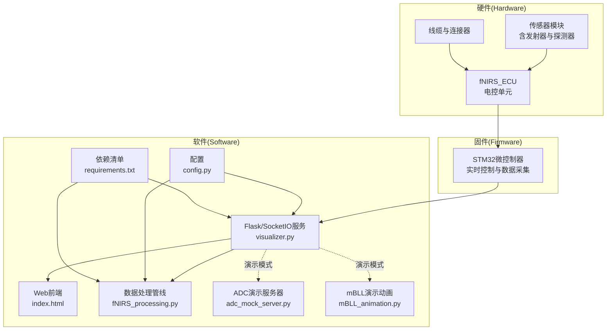
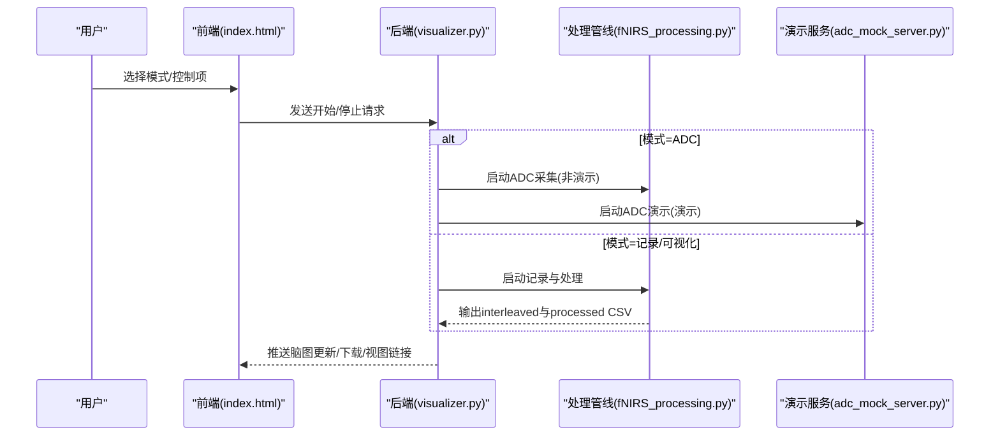
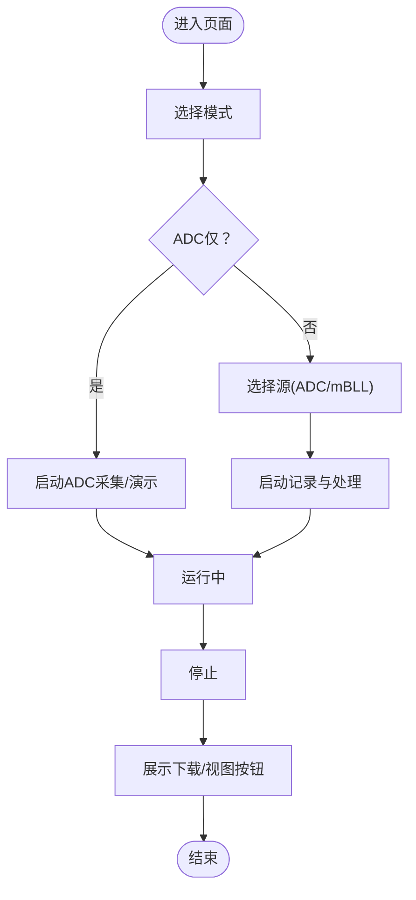
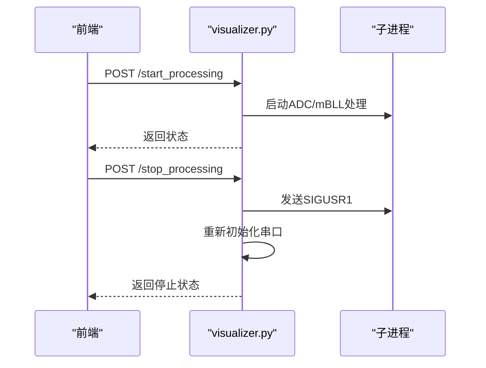
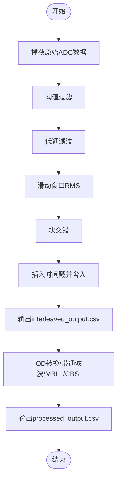
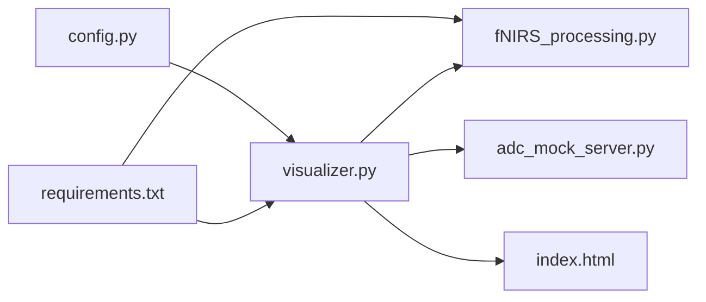

# 用户验收测试

<cite>
**本文引用的文件**
- [README.md](file://README.md)
- [software/README.md](file://software/README.md)
- [firmware/README.md](file://firmware/README.md)
- [hardware/README.md](file://hardware/README.md)
- [software/index.html](file://software/index.html)
- [software/visualizer.py](file://software/visualizer.py)
- [software/fNIRS_processing.py](file://software/fNIRS_processing.py)
- [software/config.py](file://software/config.py)
- [software/requirements.txt](file://software/requirements.txt)
- [software/adc_live.py](file://software/adc_live.py)
- [software/adc_mock_server.py](file://software/adc_mock_server.py)
- [software/mBLL_animation.py](file://software/mBLL_animation.py)
- [software/nirs_viewer.py](file://software/nirs_viewer.py)
- [software/testing-scripts/fNIRS_processing_csv.py](file://software/testing-scripts/fNIRS_processing_csv.py)
</cite>

## 目录
1. [引言](#引言)
2. [项目结构](#项目结构)
3. [核心组件](#核心组件)
4. [架构总览](#架构总览)
5. [详细组件分析](#详细组件分析)
6. [依赖关系分析](#依赖关系分析)
7. [性能考虑](#性能考虑)
8. [故障排查指南](#故障排查指南)
9. [结论](#结论)
10. [附录](#附录)

## 引言
本文件面向fNIRS系统的用户验收测试，旨在建立一套完整的验证标准与测试流程，覆盖功能完整性、边界条件与异常处理、用户界面可用性、实际应用场景模拟以及测试用例设计指南。目标是确保系统在真实使用环境中满足性能、稳定性与易用性的要求，并提供可追溯的验收标准与评估方法。

## 项目结构
fNIRS系统由硬件、固件与软件三部分组成，软件侧提供Web交互界面与数据采集、处理、可视化的完整链路；固件负责传感器模块控制与数据采集；硬件提供电控单元与光学传感器模块。

图示来源
- [software/index.html](file://software/index.html#L1-L750)
- [software/visualizer.py](file://software/visualizer.py#L1-L947)
- [software/fNIRS_processing.py](file://software/fNIRS_processing.py#L1-L496)
- [software/adc_mock_server.py](file://software/adc_mock_server.py#L1-L65)
- [software/mBLL_animation.py](file://software/mBLL_animation.py#L1-L140)
- [software/config.py](file://software/config.py#L1-L13)
- [software/requirements.txt](file://software/requirements.txt#L1-L15)

章节来源
- [README.md](file://README.md#L1-L19)
- [software/README.md](file://software/README.md#L1-L180)
- [firmware/README.md](file://firmware/README.md#L1-L17)
- [hardware/README.md](file://hardware/README.md#L1-L19)

## 核心组件
- Web前端与交互界面：提供模式选择、传感器组映射高亮、脑区激活可视化、控制面板（MUX/发射器状态）、下载与静态/动画视图入口。
- 后端服务（Flask/SocketIO）：统一路由、启动/停止数据采集与处理、接收控制指令、向前端推送脑图更新。
- 数据处理管线：从原始ADC数据到interleaved输出再到processed_output.csv，支持阈值过滤、低通滤波、RMS、带通滤波与MBLL/CBSI等处理步骤。
- 演示模式：提供ADC与mBLL的模拟数据流，便于离线测试与演示。
- 配置与依赖：串口参数、依赖包版本管理。

章节来源
- [software/index.html](file://software/index.html#L1-L750)
- [software/visualizer.py](file://software/visualizer.py#L589-L733)
- [software/fNIRS_processing.py](file://software/fNIRS_processing.py#L339-L443)
- [software/adc_mock_server.py](file://software/adc_mock_server.py#L1-L65)
- [software/config.py](file://software/config.py#L1-L13)
- [software/requirements.txt](file://software/requirements.txt#L1-L15)

## 架构总览
系统采用“前端Web界面 + 后端服务 + 数据处理管线”的分层架构。后端通过SocketIO与前端交互，同时根据模式选择调用ADC或记录/处理流程；处理管线基于NIRSimple库实现OD转换、带通滤波与MBLL/CBSI计算。

图示来源
- [software/index.html](file://software/index.html#L632-L723)
- [software/visualizer.py](file://software/visualizer.py#L646-L711)
- [software/fNIRS_processing.py](file://software/fNIRS_processing.py#L446-L496)
- [software/adc_mock_server.py](file://software/adc_mock_server.py#L48-L64)

## 详细组件分析

### 组件A：Web前端与交互（index.html）
- 功能要点
  - 模式选择：Live Readings（ADC仅）与Record & Visualize（ADC与/或mBLL）。
  - 控制面板：MUX控制与发射器状态控制，支持覆盖开关与PWM位图映射。
  - 脑图可视化：3D脑模型渲染、传感器节点高亮、激活区域着色、相机视角持久化。
  - 下载与视图：按源下载CSV、静态图、动画窗口。
- 可用性关注点
  - 响应性：按钮与下拉菜单即时反馈；定时器显示与停止逻辑清晰。
  - 可访问性：颜色区分（940nm/660nm）、图例说明、键盘可达性与屏幕阅读器友好。
- 边界与异常
  - 未选择模式/源时禁止启动；停止后展示下载与视图按钮；错误提示与日志输出。

图示来源
- [software/index.html](file://software/index.html#L340-L347)
- [software/index.html](file://software/index.html#L632-L723)

章节来源
- [software/index.html](file://software/index.html#L1-L750)

### 组件B：后端服务（visualizer.py）
- 功能要点
  - 路由与SocketIO：接收控制数据、更新脑图、启动/停止处理、文件下载、静态/动画视图。
  - 数据队列与锁：多线程安全地缓存处理包，按需触发脑图更新。
  - 模式切换：根据前端请求启动ADC演示或记录/处理流程。
- 错误处理
  - 串口重连与关闭；子进程信号（SIGUSR1）优雅停止；异常捕获与日志记录。

图示来源
- [software/visualizer.py](file://software/visualizer.py#L646-L711)

章节来源
- [software/visualizer.py](file://software/visualizer.py#L1-L947)

### 组件C：数据处理管线（fNIRS_processing.py）
- 功能要点
  - 原始数据捕获：解析64字节包，写入all_groups.csv。
  - 数据预处理：阈值过滤、低通滤波、滑动窗口RMS、块交错。
  - 处理输出：interleaved_output.csv与processed_output.csv。
  - mBLL/CBSI：OD转换、带通滤波、MBLL与CBSI计算。
- 边界与异常
  - 输入数据不足时终止处理；异常捕获与日志输出；时间戳对齐与舍入避免浮点误差。

图示来源
- [software/fNIRS_processing.py](file://software/fNIRS_processing.py#L187-L234)
- [software/fNIRS_processing.py](file://software/fNIRS_processing.py#L446-L496)

章节来源
- [software/fNIRS_processing.py](file://software/fNIRS_processing.py#L1-L496)

### 组件D：演示与辅助工具
- ADC演示服务器：周期性发送三角波模拟数据，便于离线测试。
- mBLL动画：读取processed_output.csv进行全屏实时动画展示。
- ADC实时GUI：PyQt5 + pyqtgraph展示ADC读数。
- CSV处理脚本：独立执行处理流程，便于回归测试与数据验证。

章节来源
- [software/adc_mock_server.py](file://software/adc_mock_server.py#L1-L65)
- [software/mBLL_animation.py](file://software/mBLL_animation.py#L1-L140)
- [software/adc_live.py](file://software/adc_live.py#L1-L210)
- [software/testing-scripts/fNIRS_processing_csv.py](file://software/testing-scripts/fNIRS_processing_csv.py#L446-L496)

## 依赖关系分析
- 系统依赖
  - 串口通信：config.py中的SERIAL_PORT、BAUD_RATE、TIMEOUT。
  - Python依赖：requirements.txt列出Flask、Flask-SocketIO、Plotly、PyQt5、PyQtGraph、PySerial、SciPy、NiBabel、NIRSimple等。
- 组件耦合
  - 后端与前端通过SocketIO强耦合；后端与处理管线通过子进程弱耦合；演示服务与后端通过HTTP/WS解耦。
- 外部接口
  - 硬件串口协议：每包64字节，包含8组传感器数据与发射器状态。

图示来源
- [software/config.py](file://software/config.py#L1-L13)
- [software/requirements.txt](file://software/requirements.txt#L1-L15)
- [software/visualizer.py](file://software/visualizer.py#L1-L947)
- [software/fNIRS_processing.py](file://software/fNIRS_processing.py#L1-L496)
- [software/adc_mock_server.py](file://software/adc_mock_server.py#L1-L65)
- [software/index.html](file://software/index.html#L1-L750)

章节来源
- [software/config.py](file://software/config.py#L1-L13)
- [software/requirements.txt](file://software/requirements.txt#L1-L15)

## 性能考虑
- 实时性
  - ADC实时模式：前端定时刷新与后端数据队列需保证低延迟；建议监控帧率与丢帧率。
  - 处理管线：批处理阶段（CSV到processed_output）应尽量减少I/O与内存峰值。
- 资源占用
  - 3D脑图渲染与动画窗口对GPU/CPU有一定开销，建议在不同分辨率与刷新频率下测试。
- 稳定性
  - 串口超时与缓冲溢出处理；长时间运行下的内存泄漏检测；子进程优雅退出与资源回收。

## 故障排查指南
- 串口连接问题
  - 确认SERIAL_PORT路径正确；检查波特率与超时设置；Windows/macOS/Linux平台差异。
- 模式启动失败
  - 检查前端是否选择了有效模式与源；查看后端日志与返回状态；确认子进程是否正常启动。
- 处理管线中断
  - 检查输入CSV格式与长度；确认带通滤波与MBLL参数；查看中间文件是否存在。
- 演示模式异常
  - 确认演示服务器端口与异步模式；浏览器控制台网络与WS连接状态。

章节来源
- [software/config.py](file://software/config.py#L1-L13)
- [software/visualizer.py](file://software/visualizer.py#L646-L711)
- [software/fNIRS_processing.py](file://software/fNIRS_processing.py#L446-L496)

## 结论
本验收测试文档建立了以功能完整性、可用性与可靠性为核心的验证框架，结合演示模式与回归脚本，能够覆盖从基础功能到复杂场景的测试需求。建议在正式验收前完成所有测试场景并通过评审，形成可追溯的测试报告与验收记录。

## 附录

### A. 验收测试流程与标准
- 功能完整性验证
  - 模式切换：Live/Record均能正常启动与停止，界面按钮状态与后端状态一致。
  - 控制下发：MUX与发射器控制项下发成功，后端返回成功状态。
  - 数据采集：ADC模式下能持续接收数据并更新脑图；记录模式下生成interleaved与processed文件。
  - 可视化：静态图与动画窗口可正常打开；下载CSV文件命名与内容正确。
- 边界条件测试
  - 未选择模式/源：禁止启动；错误提示明确。
  - 串口断开/重连：系统自动重连并恢复采集。
  - 数据量不足：处理管线给出明确提示并跳过处理。
- 异常情况处理测试
  - 子进程异常退出：后端捕获并清理资源；串口重新初始化。
  - 网络/WS异常：前端重试机制与错误提示。
- 用户界面可用性测试
  - 响应性：按钮点击、下拉选择、控制面板变更即时生效。
  - 可用性：模式切换、源选择、下载与视图入口清晰可见。
  - 可访问性：颜色对比度、图例说明、键盘导航与屏幕阅读器支持。

### B. 实际应用场景测试方案
- 临床场景模拟
  - 任务型数据采集：模拟简单任务（如手指运动），观察激活区域变化趋势。
  - 长时间监测：连续运行数小时，检查系统稳定性与数据完整性。
- 用户操作流程测试
  - 完整流程：选择模式→配置控制→开始→停止→下载/查看→导出报告。
  - 多人协作：多人轮换操作，验证界面一致性与数据一致性。
- 系统可靠性测试
  - 并发压力：同时开启多个视图与下载任务，观察系统响应。
  - 断点续传：中途断电/断网后重启，验证数据完整性与状态恢复。

### C. 测试用例设计指南
- 场景定义
  - 基础场景：单次采集与处理、单一源可视化。
  - 扩展场景：多源组合、长时间记录、批量导出。
- 预期结果
  - ADC模式：每包64字节解析成功；脑图颜色随发射器状态变化。
  - 记录模式：interleaved与processed文件存在且格式正确；激活区域高亮符合预期。
- 测试数据准备
  - 使用演示服务器生成稳定数据集；或使用真实设备采集短时数据。
  - 准备边界数据：全零、全满、异常值、缺失段等。

### D. 用户反馈收集与评估
- 收集方法
  - 问卷调查：针对界面易用性、响应速度、功能完整性评分。
  - 观察记录：用户操作路径、卡顿点、错误提示理解度。
- 评估标准
  - 功能达成率≥95%，平均响应时间≤X秒，错误率≤Y%。
- 验收标准
  - 通过所有关键路径测试；无阻塞性缺陷；用户满意度达到阈值。