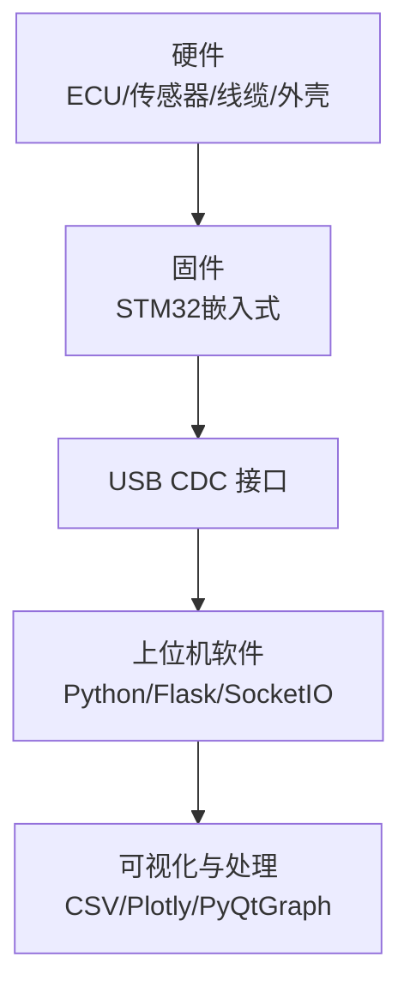
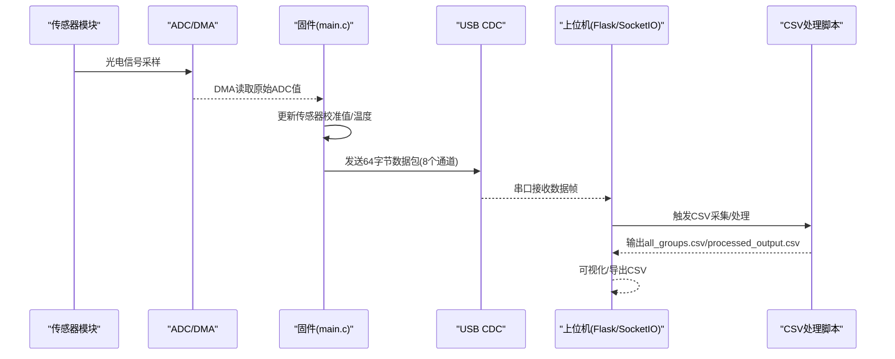
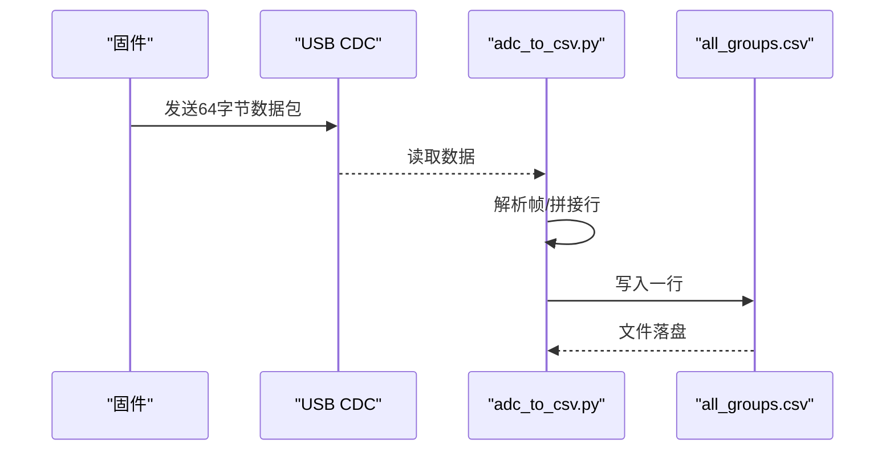
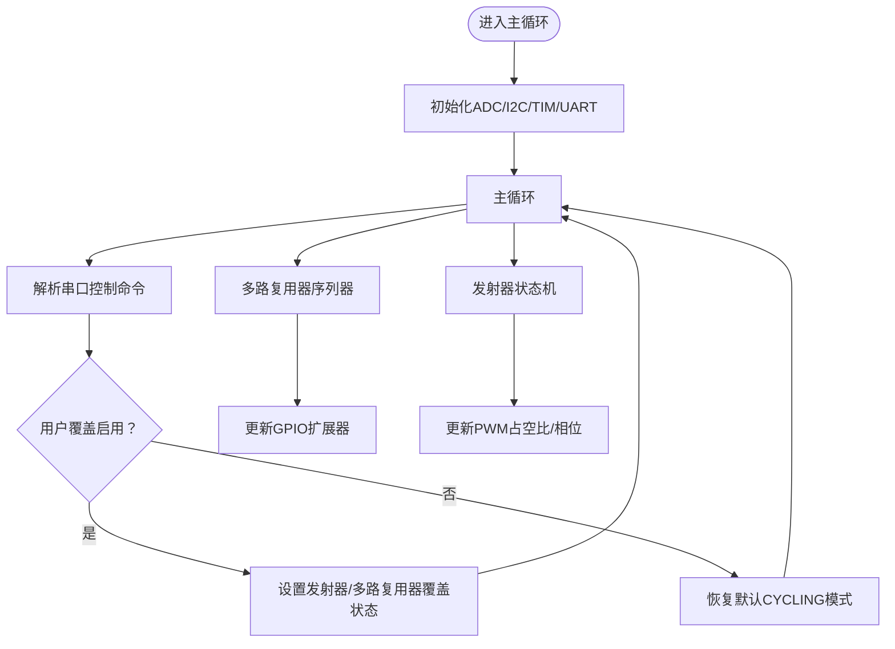
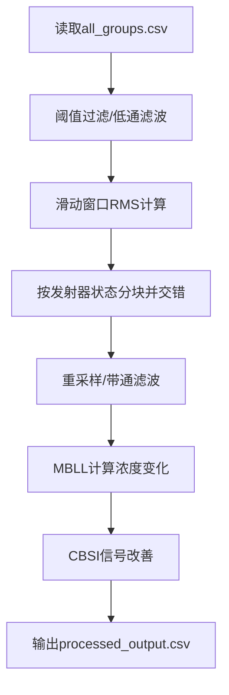
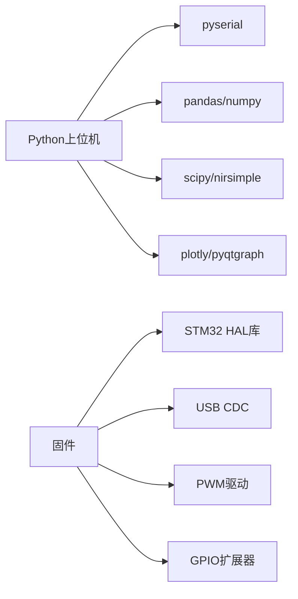

# 集成测试

<cite>
**本文引用的文件**
- [README.md](file://README.md)
- [software/README.md](file://software/README.md)
- [firmware/README.md](file://firmware/README.md)
- [hardware/README.md](file://hardware/README.md)
- [software/requirements.txt](file://software/requirements.txt)
- [software/config.py](file://software/config.py)
- [software/testing-scripts/fNIRS_processing_csv.py](file://software/testing-scripts/fNIRS_processing_csv.py)
- [software/testing-scripts/adc_to_csv.py](file://software/testing-scripts/adc_to_csv.py)
- [software/testing-scripts/apply_rms_to_adc.py](file://software/testing-scripts/apply_rms_to_adc.py)
- [software/sample_data/all_groups.csv](file://software/sample_data/all_groups.csv)
- [firmware/STM32/fNIRS/Core/Src/main.c](file://firmware/STM32/fNIRS/Core/Src/main.c)
- [firmware/STM32/fNIRS/Core/Src/serial_interface.c](file://firmware/STM32/fNIRS/Core/Src/serial_interface.c)
- [firmware/STM32/fNIRS/Core/Src/sensing.c](file://firmware/STM32/fNIRS/Core/Src/sensing.c)
- [firmware/STM32/fNIRS/Core/Src/emitter_control.c](file://firmware/STM32/fNIRS/Core/Src/emitter_control.c)
- [firmware/STM32/fNIRS/Core/Src/mux_control.c](file://firmware/STM32/fNIRS/Core/Src/mux_control.c)
</cite>

## 目录
1. [引言](#引言)
2. [项目结构](#项目结构)
3. [核心组件](#核心组件)
4. [架构总览](#架构总览)
5. [详细组件分析](#详细组件分析)
6. [依赖关系分析](#依赖关系分析)
7. [性能与稳定性测试](#性能与稳定性测试)
8. [故障排查指南](#故障排查指南)
9. [结论](#结论)
10. [附录：测试流程与规范](#附录测试流程与规范)

## 引言
本指南面向fNIRS系统的集成测试，覆盖端到端硬件-软件协同测试、数据流完整性测试、系统响应时间测试、性能与稳定性测试（含长时间运行、内存泄漏与资源监控）、CSV数据处理测试（格式校验、算法正确性、批量处理）以及测试环境搭建、测试数据准备与结果分析的标准流程。目标是帮助测试工程师与开发人员在真实或模拟环境下，系统化地验证设备从传感器采集、固件控制、串口通信到上位机处理与可视化的完整链路。

## 项目结构
fNIRS项目由三大部分组成：
- 硬件：ECU电路板、传感器模块、连接线束与机械外壳设计
- 固件：基于STM32微控制器的嵌入式程序，负责ADC采集、LED发射器PWM控制、多路复用器切换、USB CDC串口通信
- 软件：Python上位机，支持实时ADC可视化、记录与处理、CSV导出、Web交互界面

**图表来源**
- [firmware/README.md](file://firmware/README.md#L1-L17)
- [software/README.md](file://software/README.md#L1-L180)
- [hardware/README.md](file://hardware/README.md#L1-L19)

**章节来源**
- [README.md](file://README.md#L1-L19)
- [software/README.md](file://software/README.md#L1-L180)
- [firmware/README.md](file://firmware/README.md#L1-L17)
- [hardware/README.md](file://hardware/README.md#L1-L19)

## 核心组件
- 上位机软件（Flask/SocketIO）
  - 提供Web界面与交互控制，支持实时ADC动画、静态图、3D脑模型、CSV下载
  - 支持演示模式（mock server），便于无硬件时测试
- 固件（STM32）
  - 初始化ADC/DMA、I2C、SPI、UART、TIM等外设
  - 控制LED发射器PWM输出、多路复用器通道切换
  - 通过USB CDC以固定帧格式发送传感器数据
- 测试脚本
  - CSV采集与处理流水线：原始ADC采集、阈值过滤、低通滤波、滑动窗口RMS、块交错、MBLL/CBSI处理
  - 演示与验证：RMS处理验证、串口解析、CSV写入

**章节来源**
- [software/README.md](file://software/README.md#L1-L180)
- [software/requirements.txt](file://software/requirements.txt#L1-L15)
- [software/config.py](file://software/config.py#L1-L13)
- [firmware/STM32/fNIRS/Core/Src/main.c](file://firmware/STM32/fNIRS/Core/Src/main.c#L1-L741)
- [firmware/STM32/fNIRS/Core/Src/serial_interface.c](file://firmware/STM32/fNIRS/Core/Src/serial_interface.c#L1-L82)
- [firmware/STM32/fNIRS/Core/Src/sensing.c](file://firmware/STM32/fNIRS/Core/Src/sensing.c#L1-L86)
- [firmware/STM32/fNIRS/Core/Src/emitter_control.c](file://firmware/STM32/fNIRS/Core/Src/emitter_control.c#L1-L291)
- [firmware/STM32/fNIRS/Core/Src/mux_control.c](file://firmware/STM32/fNIRS/Core/Src/mux_control.c#L1-L252)
- [software/testing-scripts/fNIRS_processing_csv.py](file://software/testing-scripts/fNIRS_processing_csv.py#L1-L497)
- [software/testing-scripts/adc_to_csv.py](file://software/testing-scripts/adc_to_csv.py#L1-L67)
- [software/testing-scripts/apply_rms_to_adc.py](file://software/testing-scripts/apply_rms_to_adc.py#L1-L77)

## 架构总览
下图展示从传感器到上位机的端到端数据路径与控制交互：

**图表来源**
- [firmware/STM32/fNIRS/Core/Src/main.c](file://firmware/STM32/fNIRS/Core/Src/main.c#L145-L178)
- [firmware/STM32/fNIRS/Core/Src/serial_interface.c](file://firmware/STM32/fNIRS/Core/Src/serial_interface.c#L59-L81)
- [software/testing-scripts/adc_to_csv.py](file://software/testing-scripts/adc_to_csv.py#L14-L67)
- [software/testing-scripts/fNIRS_processing_csv.py](file://software/testing-scripts/fNIRS_processing_csv.py#L446-L497)

## 详细组件分析

### 组件A：实时数据采集与串口通信测试
- 目标
  - 验证固件按固定周期向USB CDC发送64字节数据包
  - 验证上位机能稳定接收并写入CSV，帧头字段与通道数量符合预期
- 方法
  - 使用演示模式启动上位机，或连接真实硬件
  - 启动串口采集脚本，观察CSV列名与数据长度是否匹配
  - 对比帧解析函数输出与CSV行结构一致性
- 关键点
  - 帧大小与通道映射需与解析函数一致
  - 时间戳生成与刷新频率应稳定

**图表来源**
- [firmware/STM32/fNIRS/Core/Src/serial_interface.c](file://firmware/STM32/fNIRS/Core/Src/serial_interface.c#L59-L81)
- [software/testing-scripts/adc_to_csv.py](file://software/testing-scripts/adc_to_csv.py#L14-L67)

**章节来源**
- [software/testing-scripts/adc_to_csv.py](file://software/testing-scripts/adc_to_csv.py#L1-L67)
- [firmware/STM32/fNIRS/Core/Src/serial_interface.c](file://firmware/STM32/fNIRS/Core/Src/serial_interface.c#L1-L82)

### 组件B：硬件控制测试（发射器与多路复用器）
- 目标
  - 验证发射器PWM状态与LED开关逻辑
  - 验证多路复用器通道切换序列与时序
- 方法
  - 通过串口命令下发发射器控制指令，观察对应PWM占空比变化
  - 在演示模式下触发定时器标志，验证状态机转换
  - 观察多路复用器I/O更新序列与通道切换顺序
- 关键点
  - 默认模式下奇偶通道分别驱动不同波长LED
  - 定时器触发周期决定通道轮询速率

**图表来源**
- [firmware/STM32/fNIRS/Core/Src/main.c](file://firmware/STM32/fNIRS/Core/Src/main.c#L132-L178)
- [firmware/STM32/fNIRS/Core/Src/emitter_control.c](file://firmware/STM32/fNIRS/Core/Src/emitter_control.c#L220-L278)
- [firmware/STM32/fNIRS/Core/Src/mux_control.c](file://firmware/STM32/fNIRS/Core/Src/mux_control.c#L170-L229)

**章节来源**
- [firmware/STM32/fNIRS/Core/Src/emitter_control.c](file://firmware/STM32/fNIRS/Core/Src/emitter_control.c#L1-L291)
- [firmware/STM32/fNIRS/Core/Src/mux_control.c](file://firmware/STM32/fNIRS/Core/Src/mux_control.c#L1-L252)
- [firmware/STM32/fNIRS/Core/Src/main.c](file://firmware/STM32/fNIRS/Core/Src/main.c#L1-L741)

### 组件C：CSV数据处理测试
- 目标
  - 验证CSV格式合法性与字段完整性
  - 验证处理算法（阈值过滤、低通滤波、RMS、块交错、MBLL/CBSI）正确性
  - 验证批量数据处理的吞吐与稳定性
- 方法
  - 使用样本CSV进行端到端处理，对比中间产物（RMS、交错后）与最终processed_output.csv
  - 执行批处理脚本，统计处理耗时与内存占用
- 关键点
  - RMS分段依据发射器状态变化切分，可选半段切分
  - 块交错要求相邻模式行配对，确保660nm与940nm交替
  - MBLL参数（年龄、源-探测距离、摩尔消光系数表）需与实际一致

**图表来源**
- [software/testing-scripts/fNIRS_processing_csv.py](file://software/testing-scripts/fNIRS_processing_csv.py#L446-L497)
- [software/testing-scripts/apply_rms_to_adc.py](file://software/testing-scripts/apply_rms_to_adc.py#L1-L77)

**章节来源**
- [software/testing-scripts/fNIRS_processing_csv.py](file://software/testing-scripts/fNIRS_processing_csv.py#L1-L497)
- [software/testing-scripts/apply_rms_to_adc.py](file://software/testing-scripts/apply_rms_to_adc.py#L1-L77)
- [software/sample_data/all_groups.csv](file://software/sample_data/all_groups.csv#L1-L2)

## 依赖关系分析
- 上位机依赖
  - 串口库用于接收固件数据
  - 数据处理库（pandas/numpy/scipy/nirsimple）用于CSV处理
  - 可视化库（Plotly/PyQtGraph）用于图表与动画
- 固件依赖
  - HAL库与外设驱动（ADC/DMA/I2C/SPI/TIM/UART/USB CDC）
  - PWM驱动与GPIO扩展器控制

**图表来源**
- [software/requirements.txt](file://software/requirements.txt#L1-L15)
- [firmware/STM32/fNIRS/Core/Src/main.c](file://firmware/STM32/fNIRS/Core/Src/main.c#L24-L31)

**章节来源**
- [software/requirements.txt](file://software/requirements.txt#L1-L15)
- [firmware/STM32/fNIRS/Core/Src/main.c](file://firmware/STM32/fNIRS/Core/Src/main.c#L24-L31)

## 性能与稳定性测试
- 长时间运行测试
  - 连续采集1小时以上，记录CPU/内存/串口缓冲区占用
  - 检查CSV写入是否出现阻塞或丢帧
- 内存泄漏检测
  - 使用内存分析工具监控Python进程RSS峰值
  - 关注pandas/numpy对象生命周期与大数组释放
- 系统资源使用监控
  - 监控ADC/DMA中断处理延迟与丢数
  - 观察USB CDC发送队列长度与上位机接收速率
- 响应时间测试
  - 从固件ADC采样到上位机CSV落盘的端到端延迟
  - 从串口命令下发到发射器/PWM状态生效的控制环延迟

[本节为通用指导，不直接分析具体文件]

## 故障排查指南
- 串口无法打开/无数据
  - 检查串口配置与波特率、超时设置
  - 确认硬件连接与驱动安装
- 处理异常或输出为空
  - 检查输入CSV列名与行数是否满足处理脚本假设
  - 核对RMS分段与发射器状态列是否存在
- 数据异常（极值/零值/跳变）
  - 应用阈值过滤与低通滤波后再进行RMS与交错
  - 检查ADC校准与DMA读取是否正确

**章节来源**
- [software/config.py](file://software/config.py#L1-L13)
- [software/testing-scripts/fNIRS_processing_csv.py](file://software/testing-scripts/fNIRS_processing_csv.py#L52-L83)
- [firmware/STM32/fNIRS/Core/Src/sensing.c](file://firmware/STM32/fNIRS/Core/Src/sensing.c#L45-L84)

## 结论
通过上述测试流程与方法，可以系统性验证fNIRS从硬件到软件的端到端能力。建议在真实硬件与演示模式双场景下执行，并结合CSV处理脚本进行离线回归测试，以确保数据流完整性、算法正确性与系统长期稳定性。

[本节为总结，不直接分析具体文件]

## 附录：测试流程与规范

### 测试环境搭建
- 硬件
  - ECU已烧录固件，传感器模块连接正常
- 软件
  - 创建虚拟环境并安装依赖
  - 配置串口参数（端口、波特率、超时）

**章节来源**
- [software/README.md](file://software/README.md#L50-L101)
- [software/requirements.txt](file://software/requirements.txt#L1-L15)
- [software/config.py](file://software/config.py#L1-L13)

### 测试数据准备
- 使用演示模式或真实硬件启动串口采集脚本，生成all_groups.csv
- 准备样本CSV用于离线处理验证（如仓库中的示例文件）

**章节来源**
- [software/README.md](file://software/README.md#L45-L47)
- [software/testing-scripts/adc_to_csv.py](file://software/testing-scripts/adc_to_csv.py#L1-L67)
- [software/sample_data/all_groups.csv](file://software/sample_data/all_groups.csv#L1-L2)

### 数据流完整性测试
- 字段校验：确认CSV列名包含时间戳与每组三个通道及发射器状态
- 行数与时间戳：检查采样间隔与连续性
- 处理链路：RMS、交错、MBLL/CBSI各阶段输出均存在且合理

**章节来源**
- [software/testing-scripts/fNIRS_processing_csv.py](file://software/testing-scripts/fNIRS_processing_csv.py#L446-L497)
- [software/testing-scripts/apply_rms_to_adc.py](file://software/testing-scripts/apply_rms_to_adc.py#L1-L77)

### 系统响应时间测试
- 端到端延迟：从固件ADC采样到上位机CSV落盘的时间
- 控制响应：从串口命令到发射器/PWM状态变更的延迟

**章节来源**
- [firmware/STM32/fNIRS/Core/Src/main.c](file://firmware/STM32/fNIRS/Core/Src/main.c#L145-L178)
- [firmware/STM32/fNIRS/Core/Src/serial_interface.c](file://firmware/STM32/fNIRS/Core/Src/serial_interface.c#L59-L81)

### CSV处理测试规范
- 格式验证：列名、数据类型、缺失值
- 算法正确性：RMS、交错、滤波、MBLL/CBSI参数与输出范围
- 批量处理：大文件吞吐、内存峰值、处理时长

**章节来源**
- [software/testing-scripts/fNIRS_processing_csv.py](file://software/testing-scripts/fNIRS_processing_csv.py#L1-L497)