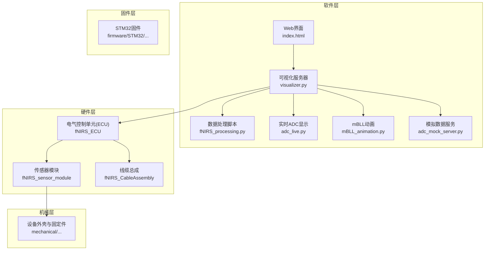
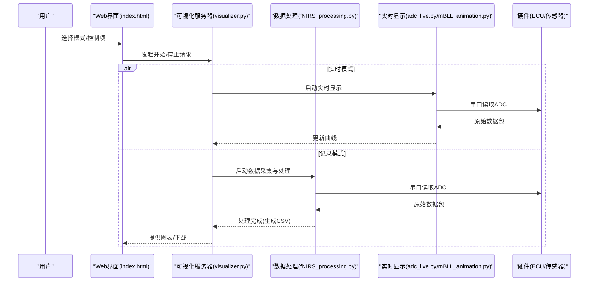
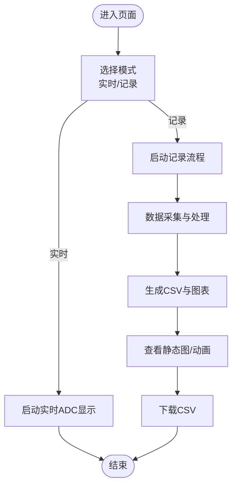
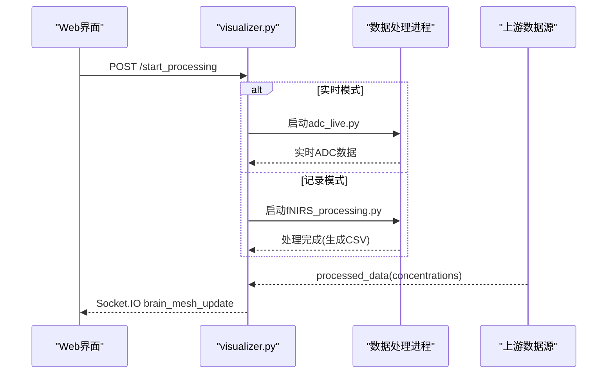
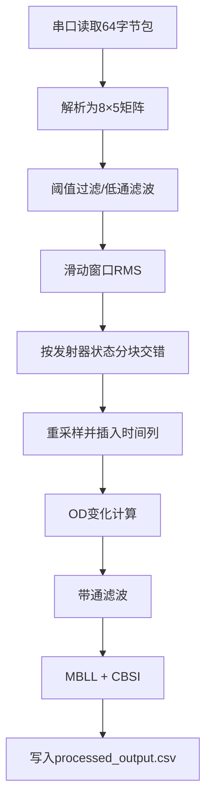
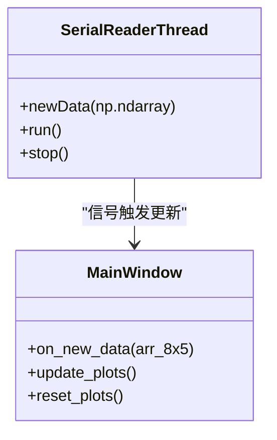
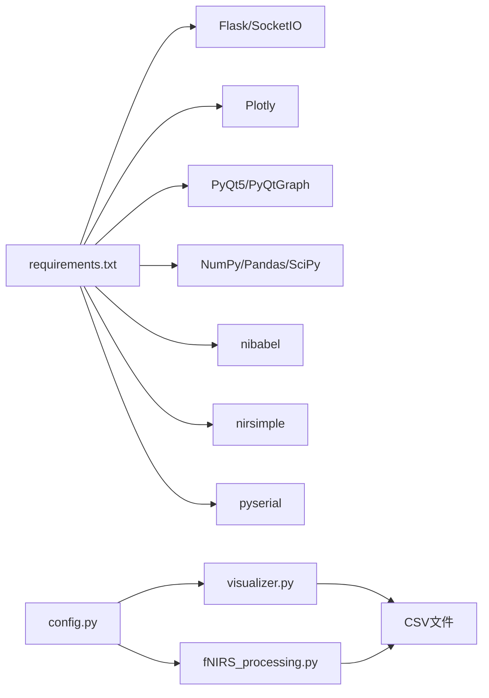

# 用户手册

<cite>
**本文引用的文件**
- [README.md](file://README.md)
- [software/README.md](file://software/README.md)
- [firmware/README.md](file://firmware/README.md)
- [hardware/README.md](file://hardware/README.md)
- [mechanical/README.md](file://mechanical/README.md)
- [software/config.py](file://software/config.py)
- [software/requirements.txt](file://software/requirements.txt)
- [software/index.html](file://software/index.html)
- [software/visualizer.py](file://software/visualizer.py)
- [software/fNIRS_processing.py](file://software/fNIRS_processing.py)
- [software/adc_live.py](file://software/adc_live.py)
- [software/mBLL_animation.py](file://software/mBLL_animation.py)
- [software/adc_mock_server.py](file://software/adc_mock_server.py)
- [software/sample_data/all_groups.csv](file://software/sample_data/all_groups.csv)
</cite>

## 目录
1. [简介](#简介)
2. [项目结构](#项目结构)
3. [核心组件](#核心组件)
4. [架构总览](#架构总览)
5. [详细组件分析](#详细组件分析)
6. [依赖关系分析](#依赖关系分析)
7. [性能与稳定性建议](#性能与稳定性建议)
8. [故障排查指南](#故障排查指南)
9. [结论](#结论)
10. [附录：安装与配置步骤](#附录安装与配置步骤)

## 简介
本手册面向fNIRS穿戴式近红外脑功能成像系统的使用者，提供从硬件到软件的完整安装、配置与使用指南。系统支持实时监测与记录分析两种工作模式，具备交互式3D脑模型、传感器组映射高亮、静态图谱与动画展示，并可导出CSV数据用于进一步分析。手册覆盖以下主题：
- 安装与配置：硬件连接、串口配置、软件依赖安装、浏览器访问
- 基本操作：实时监控、数据记录、图表查看与导出
- 高级功能：参数控制（发射器/多路复用器）、批量处理、可视化技巧
- 应用场景：教育研究、个人健康追踪、临床辅助诊断
- 用户界面详解与操作要点

## 项目结构
项目采用分层组织方式，软件侧提供Web界面与数据处理链路；固件侧运行在ECU主控芯片上；硬件与机械设计提供传感器模块与外壳结构。

**图表来源**
- [software/index.html](file://software/index.html#L1-L750)
- [software/visualizer.py](file://software/visualizer.py#L1-L947)
- [software/fNIRS_processing.py](file://software/fNIRS_processing.py#L1-L496)
- [software/adc_live.py](file://software/adc_live.py#L1-L210)
- [software/mBLL_animation.py](file://software/mBLL_animation.py#L1-L140)
- [software/adc_mock_server.py](file://software/adc_mock_server.py#L1-L65)
- [firmware/README.md](file://firmware/README.md#L1-L17)
- [hardware/README.md](file://hardware/README.md#L1-L19)
- [mechanical/README.md](file://mechanical/README.md#L1-L2)

**章节来源**
- [README.md](file://README.md#L1-L19)
- [software/README.md](file://software/README.md#L1-L180)

## 核心组件
- Web界面与控制面板：提供传感器组选择、发射器/多路复用器控制、模式切换（实时/记录）等交互入口。
- 可视化服务器：基于Flask+Socket.IO，负责接收上游数据、渲染3D脑模型、下发控制指令至硬件。
- 数据采集与处理：通过串口读取原始ADC数据，进行滤波、插值、OD转换、MBLL/CBSI处理，生成processed_output.csv。
- 实时显示：PyQtGraph实现的实时ADC与mBLL动画窗口。
- 模拟数据：用于演示与测试的假数据服务，便于无硬件环境下的验证。

**章节来源**
- [software/index.html](file://software/index.html#L1-L750)
- [software/visualizer.py](file://software/visualizer.py#L1-L947)
- [software/fNIRS_processing.py](file://software/fNIRS_processing.py#L1-L496)
- [software/adc_live.py](file://software/adc_live.py#L1-L210)
- [software/mBLL_animation.py](file://software/mBLL_animation.py#L1-L140)
- [software/adc_mock_server.py](file://software/adc_mock_server.py#L1-L65)

## 架构总览
系统采用“Web控制 + 服务器中转 + 上游数据源”的分层架构。用户通过浏览器控制面板发起采集或记录任务，服务器根据模式启动相应子进程或接收实时数据流，随后更新3D脑模型并提供图表与下载功能。

**图表来源**
- [software/index.html](file://software/index.html#L632-L723)
- [software/visualizer.py](file://software/visualizer.py#L646-L711)
- [software/fNIRS_processing.py](file://software/fNIRS_processing.py#L187-L234)
- [software/adc_live.py](file://software/adc_live.py#L48-L78)

**章节来源**
- [software/README.md](file://software/README.md#L3-L48)

## 详细组件分析

### Web界面与控制面板
- 3D脑模型区域：显示脑表面、发射器节点、探测器节点及激活高亮区域；支持相机视角保存与恢复。
- 传感器组映射：8个传感器组按钮，点击后在脑模型上高亮对应组的发射器与探测器连线。
- 控制面板：
  - MUX控制：启用覆盖开关与状态选择，支持禁用/通道1/通道2/通道3。
  - 发射器控制：启用覆盖开关与状态选择，支持DISABLED/IDLE/DEFAULT_MODE/USER_CONTROL/CYCLING/FULLY_ENABLED_940NM/FULLY_ENABLED_660NM；当处于USER_CONTROL且启用覆盖时，显示PWM控制表，每路发射器可单独选择940nm或660nm。
- 模式选择：
  - 实时读数(ADC Only)：启动实时ADC显示窗口。
  - 记录与可视化(ADC与/或mBLL)：记录一段时间的数据，完成后生成图表与CSV文件，支持下载。

**图表来源**
- [software/index.html](file://software/index.html#L265-L296)
- [software/index.html](file://software/index.html#L340-L347)
- [software/index.html](file://software/index.html#L492-L513)
- [software/index.html](file://software/index.html#L632-L723)

**章节来源**
- [software/index.html](file://software/index.html#L1-L750)

### 可视化服务器（Flask + Socket.IO）
- 路由与端点：
  - GET /：返回Web界面
  - GET /update_graphs：返回当前脑模型JSON
  - GET /select_group/<int>：按传感器组高亮脑模型
  - POST /update_control_data：接收控制数据并写入串口（非演示模式）
  - POST /start_processing：根据模式启动实时或记录流程
  - POST /stop_processing：停止子进程并重置串口
  - GET /download/<source>：下载ADC或mBLL CSV
  - GET /view_static/ADC：生成并返回静态图HTML
- 数据流：
  - 接收上游处理结果（浓度变化），更新脑模型高亮区域并通过Socket.IO推送至前端。
  - 在实时模式下，直接将最新数据包传递给前端以刷新3D脑模型。

**图表来源**
- [software/visualizer.py](file://software/visualizer.py#L646-L711)
- [software/visualizer.py](file://software/visualizer.py#L82-L96)
- [software/visualizer.py](file://software/visualizer.py#L599-L616)

**章节来源**
- [software/visualizer.py](file://software/visualizer.py#L1-L947)

### 数据采集与处理（记录模式）
- 串口采集：每次读取64字节数据包，解析为8组×5字段（组号、短/长1/长2、发射器状态）。
- 数据格式化：丢弃时间戳，阈值过滤与低通滤波，滑动窗口RMS，按发射器状态分块交错合并。
- 时间轴重采样：插入固定增量的时间列，四舍五入避免浮点误差。
- 处理流程：OD变化计算、带通滤波、MBLL与CBSI处理，输出processed_output.csv。
- 输出CSV：Time + 48通道（每个物理通道2个波长×3探测器）×类型(hbo/hbr)。

**图表来源**
- [software/fNIRS_processing.py](file://software/fNIRS_processing.py#L160-L185)
- [software/fNIRS_processing.py](file://software/fNIRS_processing.py#L51-L82)
- [software/fNIRS_processing.py](file://software/fNIRS_processing.py#L84-L126)
- [software/fNIRS_processing.py](file://software/fNIRS_processing.py#L236-L277)
- [software/fNIRS_processing.py](file://software/fNIRS_processing.py#L339-L443)

**章节来源**
- [software/fNIRS_processing.py](file://software/fNIRS_processing.py#L1-L496)

### 实时显示（PyQtGraph）
- 实时ADC显示：全屏窗口，8个子图分别显示各组3条通道曲线，支持重置。
- mBLL动画：从processed_output.csv逐行读取，6条曲线（每组3探测器×2类型）滚动显示，全屏播放。

**图表来源**
- [software/adc_live.py](file://software/adc_live.py#L48-L78)
- [software/adc_live.py](file://software/adc_live.py#L80-L190)

**章节来源**
- [software/adc_live.py](file://software/adc_live.py#L1-L210)
- [software/mBLL_animation.py](file://software/mBLL_animation.py#L1-L140)

### 模拟数据服务（演示模式）
- 三角波模拟：24通道数值在0~5000之间往返变化，周期性发送至客户端。
- 适用场景：无硬件时验证界面与流程，或教学演示。

**章节来源**
- [software/adc_mock_server.py](file://software/adc_mock_server.py#L1-L65)

## 依赖关系分析
- 运行时依赖：Flask、Flask-SocketIO、Plotly、PyQt5/PyQtGraph、NumPy、Pandas、SciPy、nibabel、nirsimple、pyserial、python-socketio、eventlet等。
- 串口通信：通过config.py中的SERIAL_PORT、BAUD_RATE、TIMEOUT进行配置。
- 文件与数据：all_groups.csv（原始ADC）、processed_output.csv（处理后浓度变化）。

**图表来源**
- [software/requirements.txt](file://software/requirements.txt#L1-L15)
- [software/config.py](file://software/config.py#L1-L13)
- [software/visualizer.py](file://software/visualizer.py#L32-L44)
- [software/fNIRS_processing.py](file://software/fNIRS_processing.py#L20-L23)

**章节来源**
- [software/requirements.txt](file://software/requirements.txt#L1-L15)
- [software/config.py](file://software/config.py#L1-L13)

## 性能与稳定性建议
- 串口缓冲与解析：确保串口波特率与超时设置合理，避免丢帧；在实时模式下，适当调整PyQtGraph刷新频率。
- 数据处理：记录模式下先进行阈值过滤与低通滤波，再做RMS与交错，有助于降低噪声与伪影。
- 内存管理：实时显示使用定长队列，避免长时间运行导致内存膨胀；必要时定期重启显示进程。
- 网络与并发：Socket.IO异步模式需注意事件循环与后台任务调度，避免阻塞主线程。

[本节为通用建议，不直接分析具体文件]

## 故障排查指南
- 无法连接串口
  - 检查SERIAL_PORT路径是否正确（Windows常见COMx，macOS/Linux常见/dev/tty.*或/dev/ttyUSB*）。
  - 确认设备已连接且未被其他程序占用。
- 浏览器无法打开界面
  - 确认本地服务已启动，端口未被占用；默认端口为8050。
- 实时显示无数据
  - 确认硬件已供电并正确连接；检查发射器/多路复用器控制状态；在演示模式下确认模拟服务已启动。
- 记录模式CSV为空
  - 确认采集时间足够长，且处理脚本正常完成；检查processed_output.csv是否存在。
- 图形显示异常
  - 清除浏览器缓存或更换浏览器；检查Plotly与Socket.IO资源加载情况。

**章节来源**
- [software/config.py](file://software/config.py#L7-L13)
- [software/README.md](file://software/README.md#L50-L100)
- [software/visualizer.py](file://software/visualizer.py#L40-L44)

## 结论
本系统提供了从硬件到软件的一体化解决方案，既适合教学演示，也可满足研究与个人健康监测需求。通过Web控制面板与可视化服务器，用户可以灵活选择工作模式、精细调节硬件参数，并获得直观的3D脑模型与多维图表。建议在正式实验前完成串口与网络配置，熟悉实时与记录两种模式的差异，并结合实际应用场景优化参数与后处理流程。

[本节为总结性内容，不直接分析具体文件]

## 附录：安装与配置步骤

### 硬件安装
- 组装传感器模块与ECU板，连接线缆总成，确保发射器与探测器对齐贴合。
- 将设备佩戴于受试者头部，保证传感器阵列与目标脑区对应。
- 固定外壳与固定带，避免运动伪影。

**章节来源**
- [hardware/README.md](file://hardware/README.md#L1-L19)
- [mechanical/README.md](file://mechanical/README.md#L1-L2)

### 固件烧录（可选）
- 使用STM32CubeIDE打开工程，清理并编译，通过ST-Link或NUCLEO板将固件烧录至ECU。

**章节来源**
- [firmware/README.md](file://firmware/README.md#L1-L17)

### 软件安装与依赖
- 创建虚拟环境并安装依赖：
  - Python版本要求与依赖详见requirements.txt。
  - Windows/macOS/Linux平台均可，注意虚拟环境激活命令差异。
- 配置串口参数：
  - 在config.py中设置SERIAL_PORT、BAUD_RATE、TIMEOUT。
  - Windows使用PowerShell查询COM端口；macOS/Linux使用ls /dev/tty.*查找设备。

**章节来源**
- [software/README.md](file://software/README.md#L50-L86)
- [software/config.py](file://software/config.py#L7-L13)
- [software/requirements.txt](file://software/requirements.txt#L1-L15)

### 初始配置与校准
- 打开浏览器访问本地服务，默认端口8050。
- 在控制面板中选择模式：
  - 实时读数：仅显示ADC原始数据，适合观察信号行为。
  - 记录与可视化：采集一段时间数据，自动进行OD转换、MBLL与CBSI处理，生成processed_output.csv。
- 传感器组映射：点击任一传感器组按钮，脑模型高亮该组发射器与探测器连线。
- 发射器/多路复用器控制：
  - 启用覆盖开关后，可在下拉框中选择状态；在USER_CONTROL状态下可勾选每路发射器的波长（940nm/660nm）。

**章节来源**
- [software/README.md](file://software/README.md#L102-L126)
- [software/index.html](file://software/index.html#L166-L296)

### 基本操作方法
- 实时监控模式
  - 选择“实时读数”，点击开始；全屏显示8组传感器的ADC曲线；可随时重置。
- 数据记录与分析
  - 选择“记录与可视化”，勾选需要的源（ADC/mBLL），点击开始；记录结束后显示下载与查看按钮；可下载CSV或打开静态图/动画。
- 图表查看与导出
  - 静态图：支持缩放、平移、全屏；动画：全屏滚动显示处理后的浓度变化。
- 3D脑模型
  - 支持旋转、缩放、平移；激活区域以红点云高亮；发射器颜色随状态变化。

**章节来源**
- [software/README.md](file://software/README.md#L102-L126)
- [software/visualizer.py](file://software/visualizer.py#L735-L800)

### 高级功能
- 自定义参数设置
  - 发射器PWM控制：在USER_CONTROL状态下勾选每路发射器的波长，系统将生成对应的寄存器值并写入串口。
  - 多路复用器状态：可禁用或选择通道，配合发射器状态实现更精细的光路控制。
- 批量数据处理
  - 记录模式下自动执行滤波、RMS、交错与处理流程，输出processed_output.csv供后续分析。
- 高级可视化技巧
  - 保存相机视角：在3D脑模型中拖动旋转后，视角会持久化；再次加载时自动恢复。
  - 区域映射：系统将传感器位置映射到AAL图谱，激活区域以红点云高亮，便于定位功能脑区。

**章节来源**
- [software/index.html](file://software/index.html#L492-L513)
- [software/index.html](file://software/index.html#L581-L590)
- [software/visualizer.py](file://software/visualizer.py#L440-L484)

### 应用场景与最佳实践
- 教育研究
  - 使用实时模式观察脑活动基线与简单任务反应；记录模式用于演示处理流程与结果解读。
- 个人健康跟踪
  - 选择较短记录时长，关注特定脑区的激活趋势；结合任务设计避免过度疲劳。
- 临床辅助诊断
  - 严格控制实验条件与数据质量；优先使用记录模式并进行多次重复；导出CSV进行统计分析。

[本节为应用建议，不直接分析具体文件]

### 用户界面详解与操作要点
- 控制面板
  - 传感器组按钮：用于高亮显示特定组的发射器与探测器连线。
  - MUX控制：启用覆盖后可选择禁用或通道状态。
  - 发射器控制：启用覆盖后可选择状态；USER_CONTROL时显示PWM表格。
- 模式选择
  - 实时：仅ADC；记录：可选ADC与/或mBLL。
- 下载与查看
  - 下载CSV：输入文件名后导出；查看静态图/动画：打开新窗口或标签页。

**章节来源**
- [software/index.html](file://software/index.html#L145-L296)