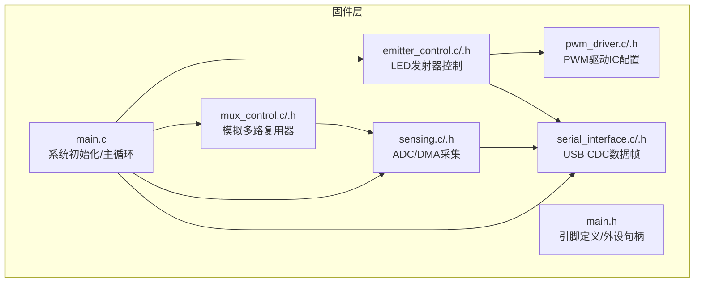
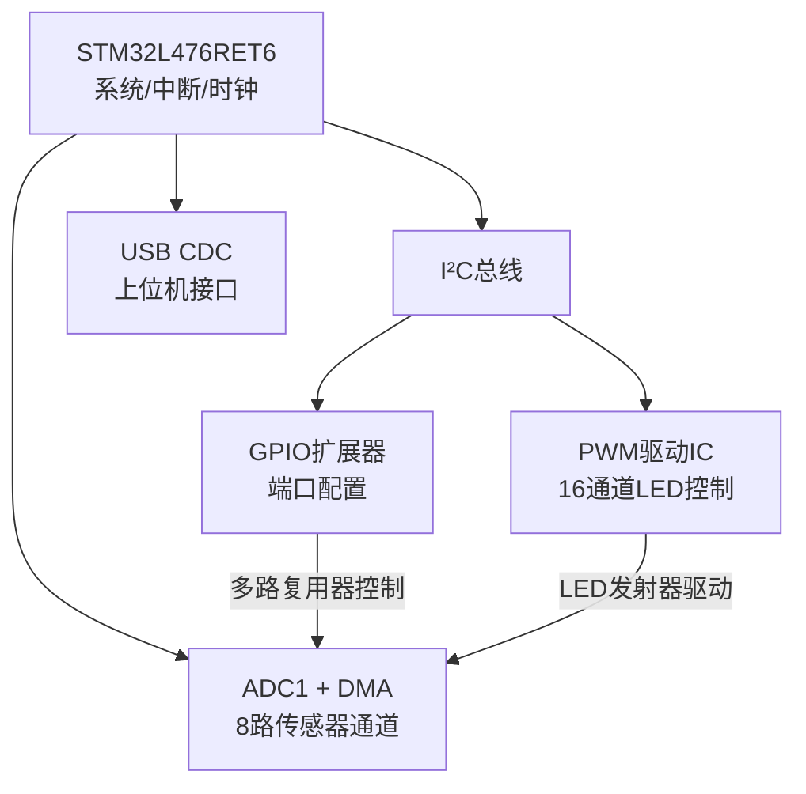
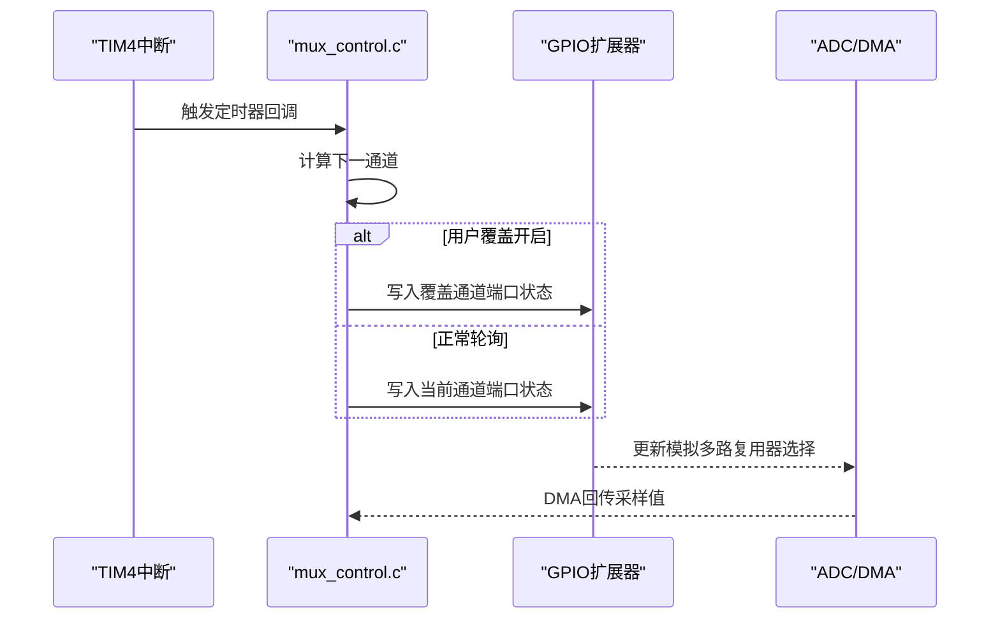
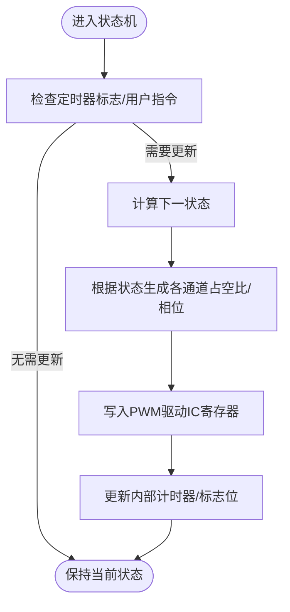
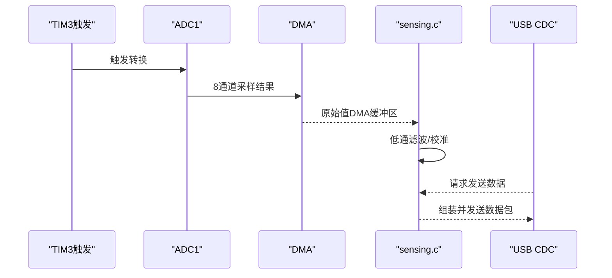
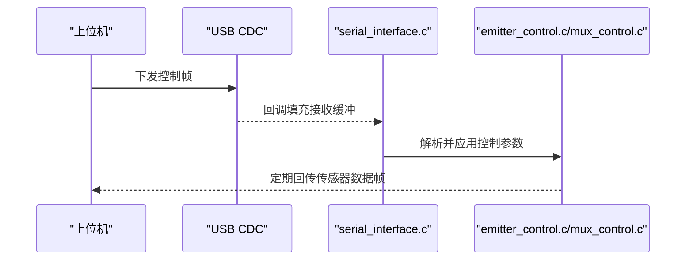
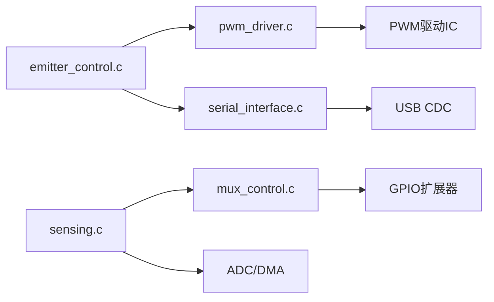

# ECU硬件设计

<cite>
**本文引用的文件**
- [main.h](file://firmware/STM32/fNIRS/Core/Inc/main.h)
- [main.c](file://firmware/STM32/fNIRS/Core/Src/main.c)
- [emitter_control.h](file://firmware/STM32/fNIRS/Core/Inc/emitter_control.h)
- [emitter_control.c](file://firmware/STM32/fNIRS/Core/Src/emitter_control.c)
- [mux_control.h](file://firmware/STM32/fNIRS/Core/Inc/mux_control.h)
- [mux_control.c](file://firmware/STM32/fNIRS/Core/Src/mux_control.c)
- [pwm_driver.h](file://firmware/STM32/fNIRS/Core/Inc/pwm_driver.h)
- [pwm_driver.c](file://firmware/STM32/fNIRS/Core/Src/pwm_driver.c)
- [sensing.h](file://firmware/STM32/fNIRS/Core/Inc/sensing.h)
- [sensing.c](file://firmware/STM32/fNIRS/Core/Src/sensing.c)
- [serial_interface.h](file://firmware/STM32/fNIRS/Core/Inc/serial_interface.h)
- [serial_interface.c](file://firmware/STM32/fNIRS/Core/Src/serial_interface.c)
</cite>

## 目录
1. [引言](#引言)
2. [项目结构](#项目结构)
3. [核心组件](#核心组件)
4. [架构总览](#架构总览)
5. [详细组件分析](#详细组件分析)
6. [依赖关系分析](#依赖关系分析)
7. [性能考量](#性能考量)
8. [故障排查指南](#故障排查指南)
9. [结论](#结论)
10. [附录](#附录)

## 引言
本文件面向fNIRS电气控制单元（ECU）的硬件设计，系统性阐述基于STM32微控制器的电路与软件协同方案。内容覆盖：
- STM32微控制器的系统时钟、外设初始化与中断配置
- 模拟多路复用器（AnalogMux）的I²C扩展控制与通道切换逻辑
- LED发射器控制（OptodeControl）的PWM驱动与电流模式映射
- 模拟信号采集链路（ADC/DMA）与温度监测
- 串口通信协议（CDC/USB）的数据帧格式与上位机交互
- 关键信号路径、电源管理与保护思路
- 元件清单（BOM）、PCB布局建议与装配指导
- ECU与传感器模块的接口规范与通信协议

## 项目结构
ECU固件采用STM32CubeIDE工程组织，核心位于STM32/fNIRS目录，按“头文件/源文件/启动/驱动”分层。顶层main.c负责系统初始化与主循环调度；各功能模块通过独立头文件与源文件实现解耦。

图表来源
- [main.c](file://firmware/STM32/fNIRS/Core/Src/main.c#L118-L181)
- [main.h](file://firmware/STM32/fNIRS/Core/Inc/main.h#L60-L70)
- [emitter_control.c](file://firmware/STM32/fNIRS/Core/Src/emitter_control.c#L183-L189)
- [mux_control.c](file://firmware/STM32/fNIRS/Core/Src/mux_control.c#L146-L158)
- [pwm_driver.c](file://firmware/STM32/fNIRS/Core/Src/pwm_driver.c#L33-L83)
- [sensing.c](file://firmware/STM32/fNIRS/Core/Src/sensing.c#L50-L56)
- [serial_interface.c](file://firmware/STM32/fNIRS/Core/Src/serial_interface.c#L20-L32)

章节来源
- [main.c](file://firmware/STM32/fNIRS/Core/Src/main.c#L118-L181)
- [main.h](file://firmware/STM32/fNIRS/Core/Inc/main.h#L60-L70)

## 核心组件
- 微控制器与系统时钟：使用MSI作为PLL输入，配置PLL倍频后为CPU/APB总线供电；ADC与USB使用PLLSAI1分频输出，确保低抖动与高精度。
- 外设初始化：ADC1（多通道扫描、DMA连续传输）、I²C1/I²C2（用于GPIO扩展与PWM驱动IC）、SPI1（4bit模式，待扩展用途）、USART1（调试串口）、TIM3/TIM4（定时触发与采样节拍）。
- 系统中断：TIM4基础定时器中断用于状态机节拍与多路复用器轮询计时。
- USB CDC：提供上位机交互接口，支持发射器控制模式下发与传感器数据回传。

章节来源
- [main.c](file://firmware/STM32/fNIRS/Core/Src/main.c#L187-L257)
- [main.c](file://firmware/STM32/fNIRS/Core/Src/main.c#L264-L387)
- [main.c](file://firmware/STM32/fNIRS/Core/Src/main.c#L394-L483)
- [main.c](file://firmware/STM32/fNIRS/Core/Src/main.c#L530-L613)
- [main.c](file://firmware/STM32/fNIRS/Core/Src/main.c#L620-L648)
- [main.c](file://firmware/STM32/fNIRS/Core/Src/main.c#L653-L704)

## 架构总览
ECU硬件-软件架构围绕“控制-驱动-感知-通信”四条主线展开：控制由STM32承担，驱动通过I²C扩展与PWM芯片实现，感知通过ADC/DMA完成，通信通过USB CDC与上位机交互。

图表来源
- [main.c](file://firmware/STM32/fNIRS/Core/Src/main.c#L118-L129)
- [mux_control.c](file://firmware/STM32/fNIRS/Core/Src/mux_control.c#L146-L158)
- [pwm_driver.c](file://firmware/STM32/fNIRS/Core/Src/pwm_driver.c#L33-L83)
- [sensing.c](file://firmware/STM32/fNIRS/Core/Src/sensing.c#L50-L56)
- [serial_interface.c](file://firmware/STM32/fNIRS/Core/Src/serial_interface.c#L59-L81)

## 详细组件分析

### 模拟多路复用器（AnalogMux）设计
- 控制方式：通过I²C连接的GPIO扩展器对端口寄存器进行写入，实现对多个模拟多路复用器的同步控制。
- 通道映射：每个复用器支持4个输入通道，结合硬件引脚映射表，将通道状态编码为端口字节，分别写入两个扩展器端口。
- 轮询策略：基于TIM4中断计数，在固定频率下顺序切换当前输入通道，支持用户覆盖模式以锁定特定通道。
- 关键实现要点：
  - 初始化阶段配置I²C与扩展器寄存器，初始关闭所有通道。
  - 主循环中调用复用器序列器函数，按节拍更新端口状态。
  - 提供覆盖开关与目标通道设置，便于上位机直接控制。

图表来源
- [mux_control.c](file://firmware/STM32/fNIRS/Core/Src/mux_control.c#L170-L229)
- [mux_control.c](file://firmware/STM32/fNIRS/Core/Src/mux_control.c#L102-L144)
- [sensing.c](file://firmware/STM32/fNIRS/Core/Src/sensing.c#L73-L84)

章节来源
- [mux_control.h](file://firmware/STM32/fNIRS/Core/Inc/mux_control.h#L12-L40)
- [mux_control.c](file://firmware/STM32/fNIRS/Core/Src/mux_control.c#L146-L158)
- [mux_control.c](file://firmware/STM32/fNIRS/Core/Src/mux_control.c#L170-L229)

### LED发射器控制（OptodeControl）设计
- 控制对象：16路PWM通道，每路对应一个LED发射器；奇偶通道分别映射到不同波长（660nm/940nm）。
- 频率与占空比：通过PWM驱动IC的预分频寄存器设置整体频率，单通道ON/OFF计数寄存器实现相位与占空比控制。
- 状态机：支持默认模式、用户控制、循环模式、全开660nm或940nm等状态；状态切换受定时器标志与上位机指令共同驱动。
- 关键实现要点：
  - 初始化时配置驱动IC工作模式与使能引脚，进入睡眠后再更新频率，再退出睡眠。
  - 根据当前状态计算各通道占空比与相位，批量写入寄存器。
  - 提供查询接口判断某通道是否处于激活状态。

图表来源
- [emitter_control.c](file://firmware/STM32/fNIRS/Core/Src/emitter_control.c#L220-L278)
- [pwm_driver.c](file://firmware/STM32/fNIRS/Core/Src/pwm_driver.c#L125-L154)
- [pwm_driver.c](file://firmware/STM32/fNIRS/Core/Src/pwm_driver.c#L156-L220)

章节来源
- [emitter_control.h](file://firmware/STM32/fNIRS/Core/Inc/emitter_control.h#L13-L38)
- [emitter_control.c](file://firmware/STM32/fNIRS/Core/Src/emitter_control.c#L183-L189)
- [emitter_control.c](file://firmware/STM32/fNIRS/Core/Src/emitter_control.c#L220-L278)
- [pwm_driver.h](file://firmware/STM32/fNIRS/Core/Inc/pwm_driver.h#L13-L62)
- [pwm_driver.c](file://firmware/STM32/fNIRS/Core/Src/pwm_driver.c#L33-L83)

### 感应与ADC采集链路
- ADC配置：ADC1多通道扫描，8个通道按顺序采样；外部触发来自TIM3的更新事件；DMA连续搬运至缓冲区。
- 数据处理：DMA双字组合为每组两个传感器通道的原始值，经低通滤波后形成校准值，供上位机读取。
- 温度监测：预留温度传感器数组，当前实现为空操作，可扩展NTC/数字温度传感器。

图表来源
- [main.c](file://firmware/STM32/fNIRS/Core/Src/main.c#L530-L567)
- [main.c](file://firmware/STM32/fNIRS/Core/Src/main.c#L264-L387)
- [sensing.c](file://firmware/STM32/fNIRS/Core/Src/sensing.c#L50-L56)
- [sensing.c](file://firmware/STM32/fNIRS/Core/Src/sensing.c#L73-L84)
- [serial_interface.c](file://firmware/STM32/fNIRS/Core/Src/serial_interface.c#L59-L81)

章节来源
- [sensing.h](file://firmware/STM32/fNIRS/Core/Inc/sensing.h#L46-L61)
- [sensing.c](file://firmware/STM32/fNIRS/Core/Src/sensing.c#L50-L56)
- [sensing.c](file://firmware/STM32/fNIRS/Core/Src/sensing.c#L73-L84)

### 串行接口与通信协议
- 接收解析：从USB CDC接收64字节缓冲区，解析发射器控制模式、占空比掩码、多路复用器覆盖开关与目标通道。
- 发送格式：每个传感器模块打包为固定长度帧，包含三个通道的高/低位数据与发射器状态位，帧头包含模块标识。
- 上位机交互：通过CDC接口实时下发控制指令与读取传感器数据，实现远程调试与参数化控制。

图表来源
- [serial_interface.c](file://firmware/STM32/fNIRS/Core/Src/serial_interface.c#L20-L32)
- [serial_interface.c](file://firmware/STM32/fNIRS/Core/Src/serial_interface.c#L59-L81)
- [main.c](file://firmware/STM32/fNIRS/Core/Src/main.c#L154-L178)

章节来源
- [serial_interface.h](file://firmware/STM32/fNIRS/Core/Inc/serial_interface.h#L12-L51)
- [serial_interface.c](file://firmware/STM32/fNIRS/Core/Src/serial_interface.c#L20-L32)
- [serial_interface.c](file://firmware/STM32/fNIRS/Core/Src/serial_interface.c#L59-L81)

## 依赖关系分析
- 模块内聚与耦合：
  - mux_control依赖GPIO扩展器库，仅通过I²C接口访问端口寄存器，耦合度低。
  - emitter_control依赖pwm_driver与serial_interface，状态机与上位机指令强耦合，但通过接口函数隔离。
  - sensing依赖mux_control与emitter_control的状态查询，形成弱耦合反馈。
- 中断与定时：
  - TIM4中断驱动多路复用器轮询与发射器状态机推进。
  - ADC DMA中断驱动传感器数据更新。
- 外设共享：
  - I²C1同时服务GPIO扩展器与PWM驱动IC，需注意地址冲突与时序规划。

图表来源
- [mux_control.c](file://firmware/STM32/fNIRS/Core/Src/mux_control.c#L146-L158)
- [pwm_driver.c](file://firmware/STM32/fNIRS/Core/Src/pwm_driver.c#L33-L83)
- [emitter_control.c](file://firmware/STM32/fNIRS/Core/Src/emitter_control.c#L183-L189)
- [serial_interface.c](file://firmware/STM32/fNIRS/Core/Src/serial_interface.c#L59-L81)
- [sensing.c](file://firmware/STM32/fNIRS/Core/Src/sensing.c#L73-L84)

章节来源
- [main.c](file://firmware/STM32/fNIRS/Core/Src/main.c#L118-L129)

## 性能考量
- 采样与触发：ADC由TIM3触发，周期与频率由系统时钟与预分频决定；建议在满足带宽需求前提下降低频率以减少功耗。
- DMA吞吐：8通道DMA连续搬运，需保证AHB/APB时钟配置合理，避免总线争用。
- PWM频率：驱动IC预分频限制频率范围，过低影响调光精细度，过高增加EMI风险。
- I²C速率：I2C1/I2C2时序已配置，注意在高频场景下增加滤波与走线匹配。
- 实时性：TIM4中断优先级与任务调度需平衡，避免ADC/DMA与I²C操作相互干扰。

## 故障排查指南
- ADC无数据：
  - 检查ADC初始化参数与触发源配置，确认DMA通道启用与缓冲区大小。
  - 确认外部模拟多路复用器已正确选择通道。
- PWM无输出：
  - 检查使能引脚电平与驱动IC睡眠位设置，确认频率更新流程正确。
  - 核对占空比/相位计算与寄存器写入顺序。
- I²C通信异常：
  - 使用调试宏读取寄存器地址验证设备地址与读写方向。
  - 检查上拉电阻与总线负载，必要时降低速率。
- USB通信问题：
  - 确认CDC初始化与中断配置，检查主机侧驱动安装与端点配置。

章节来源
- [pwm_driver.c](file://firmware/STM32/fNIRS/Core/Src/pwm_driver.c#L125-L154)
- [pwm_driver.c](file://firmware/STM32/fNIRS/Core/Src/pwm_driver.c#L279-L298)
- [main.c](file://firmware/STM32/fNIRS/Core/Src/main.c#L394-L483)
- [main.c](file://firmware/STM32/fNIRS/Core/Src/main.c#L620-L648)

## 结论
本ECU设计以STM32为核心，结合I²C扩展与专用PWM驱动IC，实现了对8路传感器通道的多路复用与16路LED发射器的精确控制，并通过USB CDC提供远程交互能力。硬件-软件协同良好，具备良好的可扩展性与可维护性。后续可在电源管理、EMI抑制与热管理方面进一步优化。

## 附录

### 通信协议定义（USB CDC）
- 接收缓冲索引（主机→ECU）：
  - 发射器控制覆盖使能、状态、PWM掩码高位/低位
  - 多路复用器覆盖使能、状态
- 发送缓冲索引（ECU→主机）：
  - 包标识、通道1/2/3高/低位、发射器状态位

章节来源
- [serial_interface.h](file://firmware/STM32/fNIRS/Core/Inc/serial_interface.h#L12-L51)
- [serial_interface.c](file://firmware/STM32/fNIRS/Core/Src/serial_interface.c#L59-L81)

### 元件清单（BOM）与布局建议
- 微控制器：STM32L476RET6（系统/ADC/USB/I²C/SPI/TIM）
- PWM驱动IC：PCA9555/PCA9554系列（16通道LED控制）
- GPIO扩展器：PCA9539/PCA9555（多路复用器控制）
- 模拟多路复用器：ADG1236/CD4051（4通道）
- 传感器模块：含660nm/940nm发射器与探测器的源-探头组件
- 电源管理：LDO稳压器（3.3V/1.8V）、TVS/保险丝、滤波电容
- 连接器：USB Type-C、排针排母、电源接口
- PCB布局建议：
  - 将I²C总线布线尽量等长，靠近MCU，减少寄生电感
  - PWM驱动IC地平面与模拟地分离，避免噪声耦合
  - ADC模拟电源单独走线，加去耦电容与RC滤波
  - USB差分线紧邻，阻抗控制，屏蔽层一端接地
  - 多路复用器与传感器连线尽量短，减少串扰

### 装配指导
- 先焊接低高度器件（电阻、电容、晶振），再安装IC与连接器
- I²C器件地址核对，避免地址冲突
- PWM驱动IC与GPIO扩展器的使能引脚与电源极性正确
- ADC采样板与ECU板连接前，确认多路复用器通道选择一致
- USB接口与外壳装配前进行功能测试与通信联调