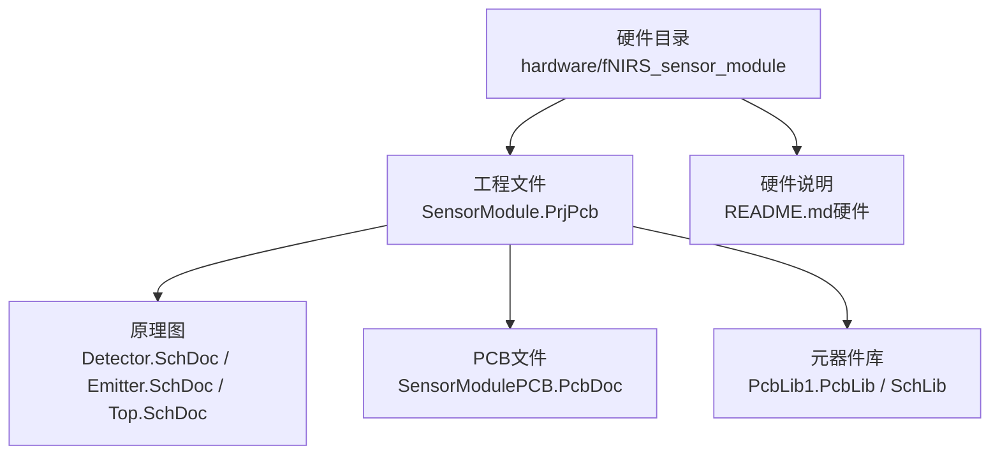
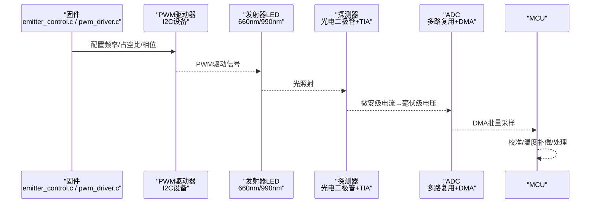
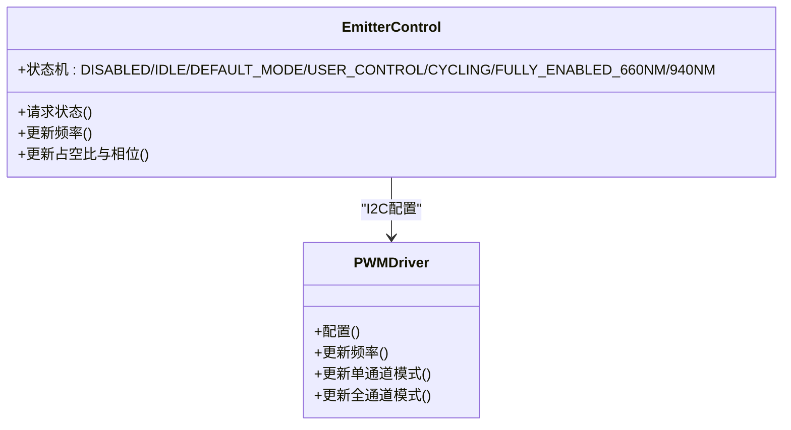
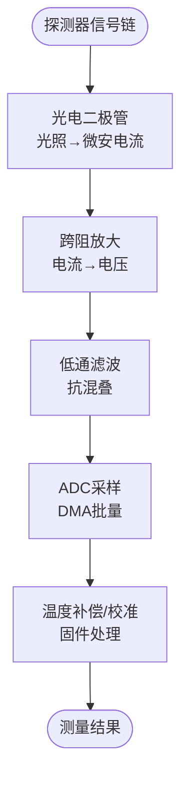
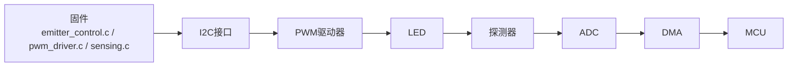

# 传感器模块设计

<cite>
**本文引用的文件**   
- [SensorModule.PrjPcb](file://hardware/fNIRS_sensor_module/SensorModule.PrjPcb)
- [SensorModulePCB.PcbDoc](file://hardware/fNIRS_sensor_module/SensorModulePCB.PcbDoc)
- [Detector.SchDoc](file://hardware/fNIRS_sensor_module/Detector.SchDoc)
- [Emitter.SchDoc](file://hardware/fNIRS_sensor_module/Emitter.SchDoc)
- [Top.SchDoc](file://hardware/fNIRS_sensor_module/Top.SchDoc)
- [PcbLib1.PcbLib](file://hardware/fNIRS_sensor_module/PcbLib1.PcbLib)
- [README.md（硬件）](file://hardware/README.md)
- [emitter_control.h](file://firmware/STM32/fNIRS/Core/Inc/emitter_control.h)
- [pwm_driver.h](file://firmware/STM32/fNIRS/Core/Inc/pwm_driver.h)
- [sensing.h](file://firmware/STM32/fNIRS/Core/Inc/sensing.h)
</cite>

## 目录
1. [简介](#简介)
2. [项目结构](#项目结构)
3. [核心组件](#核心组件)
4. [架构总览](#架构总览)
5. [详细组件分析](#详细组件分析)
6. [依赖关系分析](#依赖关系分析)
7. [性能考量](#性能考量)
8. [故障排查指南](#故障排查指南)
9. [结论](#结论)
10. [附录](#附录)

## 简介
本技术文档面向fNIRS传感器模块设计，聚焦于“主传感器PCB”的原理图与PCB布局、发射器（Emitters）与探测器（Detectors）的电路实现、LED驱动与光电二极管信号调理、偏置与噪声抑制、以及24个传感器模块（每模块含8个LED发射器，波长660nm与990nm）的系统化配置与测试方法。文档同时结合固件侧PWM驱动与ADC采集接口，给出从硬件到软件的协同设计要点。

## 项目结构
- 硬件采用Altium Designer进行设计，传感器模块项目位于 hardware/fNIRS_sensor_module。
- 关键文件包括：工程文件（.PrjPcb）、主PCB（.PcbDoc）、原理图（.SchDoc）库（.SchLib、.PcbLib），以及顶层装配图（Top.SchDoc）。
- 硬件总体说明可参考硬件README。

**图表来源**
- [SensorModule.PrjPcb](file://hardware/fNIRS_sensor_module/SensorModule.PrjPcb#L1-L152)
- [SensorModulePCB.PcbDoc](file://hardware/fNIRS_sensor_module/SensorModulePCB.PcbDoc#L1-L100)
- [Detector.SchDoc](file://hardware/fNIRS_sensor_module/Detector.SchDoc)
- [Emitter.SchDoc](file://hardware/fNIRS_sensor_module/Emitter.SchDoc)
- [Top.SchDoc](file://hardware/fNIRS_sensor_module/Top.SchDoc)
- [PcbLib1.PcbLib](file://hardware/fNIRS_sensor_module/PcbLib1.PcbLib)
- [README.md（硬件）](file://hardware/README.md#L1-L19)

**章节来源**
- [SensorModule.PrjPcb](file://hardware/fNIRS_sensor_module/SensorModule.PrjPcb#L1-L152)
- [README.md（硬件）](file://hardware/README.md#L1-L19)

## 核心组件
- 发射器（Emitters）子系统
  - LED驱动：基于外部PWM控制器（I2C接口），通过固件更新频率、占空比与相位，实现多通道同步调制。
  - 控制状态机：支持禁用、空闲、默认模式、用户控制、循环扫描等状态，满足不同测量需求。
- 探测器（Detectors）子系统
  - 光电二极管信号调理：包含跨阻放大（TIA）、低噪声前端、基准偏置与滤波，确保微伏级信号的高精度采集。
  - 温度监测：集成温度传感器，用于环境补偿与热漂抑制。
- ADC与多路复用
  - 单ADC模块，多传感器模块共享ADC输入，经模拟多路复用切换至对应通道，配合DMA批量采集。
- 机械与光学封装
  - 源/探头（Source/Detector Optode）独立PCB，保证光路准直与最小串扰。

**章节来源**
- [emitter_control.h](file://firmware/STM32/fNIRS/Core/Inc/emitter_control.h#L13-L38)
- [pwm_driver.h](file://firmware/STM32/fNIRS/Core/Inc/pwm_driver.h#L13-L62)
- [sensing.h](file://firmware/STM32/fNIRS/Core/Inc/sensing.h#L12-L61)

## 架构总览
下图展示从固件到硬件的完整信号链路：固件通过I2C控制PWM驱动器，点亮特定波长LED；探测器输出微弱电流经TIA转换为电压，再由ADC采集，最终在固件中完成校准与处理。

**图表来源**
- [emitter_control.h](file://firmware/STM32/fNIRS/Core/Inc/emitter_control.h#L40-L48)
- [pwm_driver.h](file://firmware/STM32/fNIRS/Core/Inc/pwm_driver.h#L65-L78)
- [sensing.h](file://firmware/STM32/fNIRS/Core/Inc/sensing.h#L46-L61)

## 详细组件分析

### 主传感器PCB（SensorModulePCB）
- 设计目标
  - 集成发射器与探测器，实现24个传感器模块的统一供电、控制与信号采集。
  - 优化高频信号完整性，降低EMI与串扰。
- 布局与走线要点
  - 将LED与光电二极管尽量邻近布置，缩短信号路径，减少寄生电感与电容。
  - 使用多层板，底层大面积铺地，顶层布电源与模拟信号，中间层作为电源/地平面，提高抗干扰能力。
  - 对高频PWM与ADC参考地进行分区，避免数字噪声耦合至模拟前端。
  - 对敏感信号（TIA输出）采用星形接地点或单点接地，避免形成地环路。
- 工艺与阻抗控制
  - 控制差分阻抗（如100Ω±10%）与阻抗控制层叠，满足高速信号完整性要求。
  - 阻焊与丝印颜色避免反射影响光敏测量。

**章节来源**
- [SensorModulePCB.PcbDoc](file://hardware/fNIRS_sensor_module/SensorModulePCB.PcbDoc#L1-L100)

### 发射器（Emitters）电路设计
- LED驱动拓扑
  - 采用恒流源或开关型LED驱动器，由PWM驱动器通过I2C配置，实现多通道独立控制。
  - 支持多波长LED组合（660nm/990nm），通过相位与占空比实现时间分集测量。
- 控制接口
  - I2C地址可配置，支持扩展多个驱动器以覆盖24×8通道。
  - 提供使能/休眠引脚，便于整体功耗管理。
- 参数计算与选型
  - 根据LED正向压降与限流电阻，确定驱动电压与功率损耗。
  - PWM频率选择需避开探测器的闪烁响应频带，一般高于1kHz。
  - 占空比与相位设置需满足测量算法要求（如双波长比率法）。

**图表来源**
- [emitter_control.h](file://firmware/STM32/fNIRS/Core/Inc/emitter_control.h#L13-L38)
- [pwm_driver.h](file://firmware/STM32/fNIRS/Core/Inc/pwm_driver.h#L13-L62)

**章节来源**
- [emitter_control.h](file://firmware/STM32/fNIRS/Core/Inc/emitter_control.h#L13-L38)
- [pwm_driver.h](file://firmware/STM32/fNIRS/Core/Inc/pwm_driver.h#L13-L62)

### 探测器（Detectors）电路设计
- 光电二极管信号调理
  - 跨阻放大（TIA）：选用低噪声、高带宽运放，反馈电阻根据灵敏度与噪声预算确定。
  - 偏置网络：提供稳定的基线偏置，抑制直流漂移。
  - 滤波与抗混叠：在ADC入口处加入RC滤波，限制带宽，避免混叠。
- 温度补偿
  - 集成温度传感器，实时监测环境温度，对TIA增益与偏置进行查表补偿。
- PCB布局建议
  - 光敏面朝向一致，避免杂散光串扰。
  - TIA输出走线尽量短且远离高频PWM与数字信号。

**图表来源**
- [sensing.h](file://firmware/STM32/fNIRS/Core/Inc/sensing.h#L46-L61)

**章节来源**
- [sensing.h](file://firmware/STM32/fNIRS/Core/Inc/sensing.h#L12-L61)

### 24个传感器模块配置（每模块8个LED）
- 模块化设计
  - 每个传感器模块包含8个LED（660nm/990nm各若干），对应8个探测器通道。
  - 24个模块通过模拟多路复用器（Analog Mux）切换至单ADC输入，实现并行采集。
- 通道映射与命名
  - 模块编号：SENSOR_MODULE_1..8
  - 每模块8路探测器通道：通过枚举类型定义，便于固件索引与DMA缓冲区组织。
- 功耗与热管理
  - 合理分配LED电流，避免局部过热导致光谱漂移。
  - 在PCB上预留散热路径，必要时增加过温保护与降功率策略。

**章节来源**
- [sensing.h](file://firmware/STM32/fNIRS/Core/Inc/sensing.h#L22-L34)

### 信号路径分析、噪声抑制与EMI考虑
- 信号路径
  - 数字：I2C通信→PWM驱动器→LED→探测器→TIA→ADC→DMA→CPU。
  - 模拟：TIA输出→滤波→ADC→固件校准。
- 噪声抑制
  - 模拟地与数字地分离，单点连接于TIA前端。
  - 使用多阶RC滤波与去耦电容，降低开关噪声与电源纹波。
  - PCB层叠采用“电源层-信号层-地层-信号层-地层”，提升屏蔽效果。
- EMI考虑
  - PWM走线远离模拟信号，采用差分或屏蔽线。
  - 在I2C总线上加RC滤波，降低高频谐波。
  - 机箱屏蔽与接地点设计，避免外部干扰耦合。

**章节来源**
- [SensorModulePCB.PcbDoc](file://hardware/fNIRS_sensor_module/SensorModulePCB.PcbDoc#L1-L100)

### 测试方法与质量控制标准
- 硬件测试
  - 光功率测试：使用光谱仪与功率计验证LED输出一致性与波长精度。
  - 串扰测试：关闭其他模块LED，仅激活目标通道，测量串扰应低于设定阈值。
  - EMI测试：在典型工作频率下测量辐射与传导EMI，确保符合工业标准。
- 固件测试
  - PWM校准：对比设定频率与实际占空比，误差应在±1%以内。
  - ADC校准：使用高精度基准源，验证线性度与分辨率。
  - 多模块一致性：24个模块间通道差异应小于标称值的±2%。
- 可靠性与老化
  - 高温高湿与温度循环试验，验证长期稳定性。
  - 振动与冲击试验，确保连接可靠性。

**章节来源**
- [SensorModule.PrjPcb](file://hardware/fNIRS_sensor_module/SensorModule.PrjPcb#L154-L236)

## 依赖关系分析
- 固件与硬件的接口
  - I2C驱动器：固件通过I2C写入频率、占空比与相位，硬件执行。
  - ADC与DMA：固件配置ADC与DMA，硬件完成采样与缓冲。
- 模块间耦合
  - 多模块共享ADC输入，需严格的时序与多路复用控制，避免交叉干扰。
- 库与资源
  - 使用PcbLib1.PcbLib中的标准封装与模型，确保仿真与实际一致性。

**图表来源**
- [emitter_control.h](file://firmware/STM32/fNIRS/Core/Inc/emitter_control.h#L40-L48)
- [pwm_driver.h](file://firmware/STM32/fNIRS/Core/Inc/pwm_driver.h#L65-L78)
- [sensing.h](file://firmware/STM32/fNIRS/Core/Inc/sensing.h#L46-L61)

**章节来源**
- [SensorModule.PrjPcb](file://hardware/fNIRS_sensor_module/SensorModule.PrjPcb#L1-L152)
- [PcbLib1.PcbLib](file://hardware/fNIRS_sensor_module/PcbLib1.PcbLib)

## 性能考量
- 采样速率与分辨率
  - ADC采样速率需满足奈奎斯特定理，结合滤波带宽，确保有效分辨率。
- 功耗与热设计
  - LED驱动与TIA均会产生热量，需在PCB上预留散热路径，并在固件中实现动态降功耗策略。
- 实时性
  - PWM与ADC采集需满足实时性要求，避免测量抖动。

## 故障排查指南
- 无光信号
  - 检查LED是否正确焊接与极性，确认PWM驱动器使能引脚状态。
- 信号异常或波动大
  - 检查TIA偏置与反馈电阻，确认滤波与去耦电容是否到位。
- 多模块间串扰
  - 检查多路复用时序与通道隔离，必要时增加屏蔽与滤波。
- EMI问题
  - 检查I2C滤波与屏蔽，评估PCB层叠与接地点设计。

**章节来源**
- [SensorModulePCB.PcbDoc](file://hardware/fNIRS_sensor_module/SensorModulePCB.PcbDoc#L1-L100)
- [sensing.h](file://firmware/STM32/fNIRS/Core/Inc/sensing.h#L46-L61)

## 结论
本设计通过模块化PCB布局与固件化的PWM/ADC控制，实现了24×8通道的高一致性fNIRS传感器系统。在硬件层面注重EMI与噪声抑制，在固件层面提供灵活的状态机与校准机制，满足临床与科研应用对精度与稳定性的严格要求。

## 附录
- 术语
  - TIA：跨阻放大器
  - EMI：电磁干扰
  - DMA：直接存储器访问
- 参考文件
  - [SensorModule.PrjPcb](file://hardware/fNIRS_sensor_module/SensorModule.PrjPcb#L1-L152)
  - [SensorModulePCB.PcbDoc](file://hardware/fNIRS_sensor_module/SensorModulePCB.PcbDoc#L1-L100)
  - [Detector.SchDoc](file://hardware/fNIRS_sensor_module/Detector.SchDoc)
  - [Emitter.SchDoc](file://hardware/fNIRS_sensor_module/Emitter.SchDoc)
  - [Top.SchDoc](file://hardware/fNIRS_sensor_module/Top.SchDoc)
  - [PcbLib1.PcbLib](file://hardware/fNIRS_sensor_module/PcbLib1.PcbLib)
  - [README.md（硬件）](file://hardware/README.md#L1-L19)
  - [emitter_control.h](file://firmware/STM32/fNIRS/Core/Inc/emitter_control.h#L1-L54)
  - [pwm_driver.h](file://firmware/STM32/fNIRS/Core/Inc/pwm_driver.h#L1-L81)
  - [sensing.h](file://firmware/STM32/fNIRS/Core/Inc/sensing.h#L1-L71)