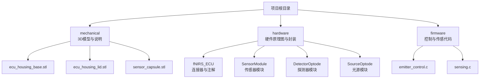
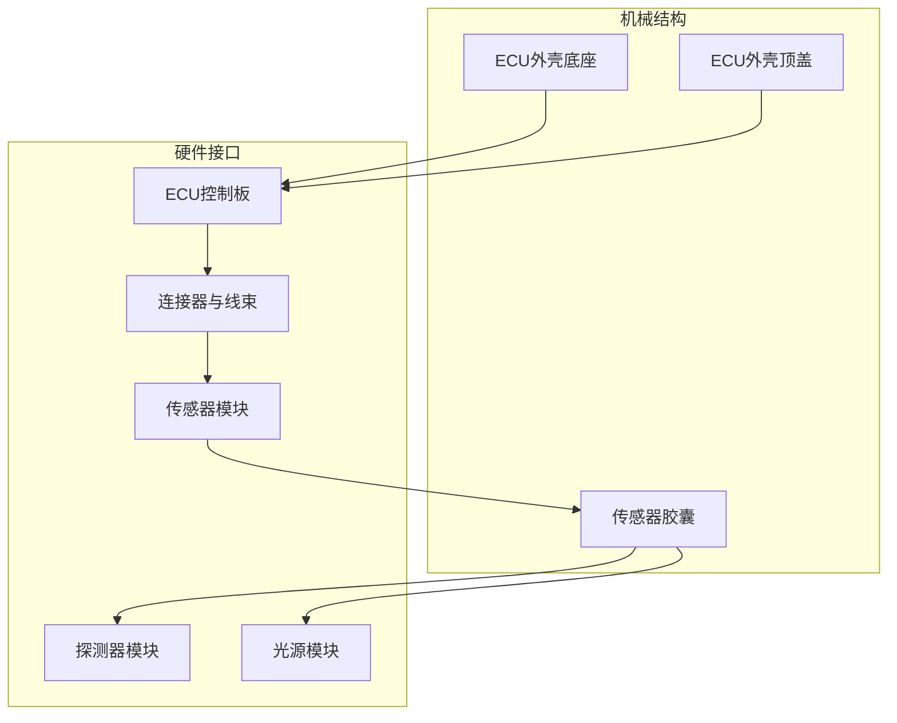
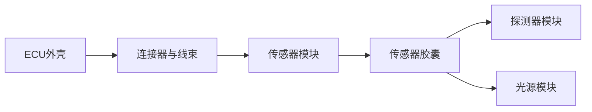

# 机械结构设计

<cite>
**本文引用的文件**
- [README.md](file://README.md)
- [mechanical/README.md](file://mechanical/README.md)
- [mechanical/ecu_housing_base.stl](file://mechanical/ecu_housing_base.stl)
- [mechanical/ecu_housing_lid.stl](file://mechanical/ecu_housing_lid.stl)
- [mechanical/sensor_capsule.stl](file://mechanical/sensor_capsule.stl)
- [hardware/fNIRS_ECU/Connectors.Harness](file://hardware/fNIRS_ECU/Connectors.Harness)
- [hardware/fNIRS_ECU/OptodeConnectors.Harness](file://hardware/fNIRS_ECU/OptodeConnectors.Harness)
- [hardware/fNIRS_ECU/fNIRS_ECU.Annotation](file://hardware/fNIRS_ECU/fNIRS_ECU.Annotation)
- [hardware/fNIRS_ECU/fNIRS_ECU.PrjPcb](file://hardware/fNIRS_ECU/fNIRS_ECU.PrjPcb)
- [hardware/DetectorOptode/DetectorOptode.PrjPcb](file://hardware/DetectorOptode/DetectorOptode.PrjPcb)
- [hardware/SourceOptode/SourceOptode.PrjPcb](file://hardware/SourceOptode/SourceOptode.PrjPcb)
- [hardware/fNIRS_sensor_module/SensorModule.PrjPcb](file://hardware/fNIRS_sensor_module/SensorModule.PrjPcb)
- [firmware/STM32/fNIRS/Core/Src/emitter_control.c](file://firmware/STM32/fNIRS/Core/Src/emitter_control.c)
- [firmware/STM32/fNIRS/Core/Src/sensing.c](file://firmware/STM32/fNIRS/Core/Src/sensing.c)
</cite>

## 目录
1. [简介](#简介)
2. [项目结构](#项目结构)
3. [核心组件](#核心组件)
4. [架构总览](#架构总览)
5. [详细组件分析](#详细组件分析)
6. [依赖关系分析](#依赖关系分析)
7. [性能与强度考量](#性能与强度考量)
8. [故障排查指南](#故障排查指南)
9. [结论](#结论)
10. [附录](#附录)

## 简介
本技术文档聚焦于fNIRS设备的机械结构设计，围绕3D打印的ECU外壳底座、顶盖与传感器胶囊的几何与装配关系展开，结合系统整体硬件接口（连接器与线束）进行跨层级说明。文档同时给出人机工程学考量、材料与打印参数建议、装配指导、强度与耐久性评估要点以及与其他硬件组件的机械接口设计思路，帮助研发与制造团队高效完成从设计到装配再到验证的全流程工作。

## 项目结构
仓库中与机械结构直接相关的内容主要集中在以下位置：
- mechanical：存放3D打印的外壳与传感器胶囊STL文件及简要说明
- hardware：包含ECU、传感器模块、探测器与光源等硬件的原理图与封装信息，以及连接器线束定义
- firmware：包含控制与传感相关的固件代码，用于理解机械与电子的协同需求

图表来源
- [mechanical/README.md](file://mechanical/README.md#L1-L2)
- [hardware/fNIRS_ECU/Connectors.Harness](file://hardware/fNIRS_ECU/Connectors.Harness#L1-L4)
- [hardware/fNIRS_ECU/OptodeConnectors.Harness](file://hardware/fNIRS_ECU/OptodeConnectors.Harness#L1-L5)

章节来源
- [README.md](file://README.md#L1-L19)
- [mechanical/README.md](file://mechanical/README.md#L1-L2)

## 核心组件
本项目涉及的核心机械组件包括：
- ECU外壳底座与顶盖：用于容纳控制电路板与内部元器件，提供防护与安装基准面
- 传感器胶囊：用于承载光学探头（光源与探测器），实现与头皮的光学耦合与稳定固定
- 连接器与线束：实现ECU与传感器模块之间的电气与机械连接

章节来源
- [hardware/fNIRS_ECU/Connectors.Harness](file://hardware/fNIRS_ECU/Connectors.Harness#L1-L4)
- [hardware/fNIRS_ECU/OptodeConnectors.Harness](file://hardware/fNIRS_ECU/OptodeConnectors.Harness#L1-L5)

## 架构总览
下图展示了机械结构与硬件接口的整体关系：ECU外壳通过连接器与线束与传感器模块相连，传感器模块再与光学探头（光源与探测器）形成一体化的传感器胶囊。

图表来源
- [hardware/fNIRS_ECU/Connectors.Harness](file://hardware/fNIRS_ECU/Connectors.Harness#L1-L4)
- [hardware/fNIRS_ECU/OptodeConnectors.Harness](file://hardware/fNIRS_ECU/OptodeConnectors.Harness#L1-L5)
- [hardware/fNIRS_sensor_module/SensorModule.PrjPcb](file://hardware/fNIRS_sensor_module/SensorModule.PrjPcb#L489-L508)
- [hardware/DetectorOptode/DetectorOptode.PrjPcb](file://hardware/DetectorOptode/DetectorOptode.PrjPcb#L322-L341)
- [hardware/SourceOptode/SourceOptode.PrjPcb](file://hardware/SourceOptode/SourceOptode.PrjPcb#L353-L380)

## 详细组件分析

### ECU外壳底座与顶盖
- 几何与尺寸
  - 底座与顶盖通过STL文件提供3D几何信息，用于3D打印制造。具体尺寸以STL模型为准。
  - 顶盖需与底座实现面贴合，保证内部元器件受保护且便于开盖维护。
- 人机工程学考量
  - 外壳应提供稳定的放置面与支撑点，避免在使用过程中发生倾斜或滑动。
  - 内部空间布局需兼顾散热与走线，避免过热与信号干扰。
- 材料与打印参数
  - 建议采用高刚度、低变形的工程塑料（如PLA或TPU），以满足结构强度与表面精度。
  - 打印层高建议≤0.1mm，外壳壁厚≥1.2mm，填充密度≥20%，以平衡强度与耗材用量。
- 装配关系
  - 底座与顶盖通过配合面定位，必要时增加定位销或卡扣结构，确保装配后无相对转动。
  - 内部需预留元器件安装孔位与走线通道，避免装配时产生干涉。
- 强度与耐久性
  - 关键受力部位（支撑边角、固定孔周边）应加强筋或加厚处理。
  - 长期使用需考虑疲劳与环境应力，建议进行跌落与振动测试验证。

章节来源
- [mechanical/ecu_housing_base.stl](file://mechanical/ecu_housing_base.stl)
- [mechanical/ecu_housing_lid.stl](file://mechanical/ecu_housing_lid.stl)

### 传感器胶囊
- 几何与尺寸
  - 胶囊用于承载光学探头，需确保光源与探测器的相对位置与间距符合光学设计要求。
  - 胶囊外表面应平滑，避免对皮肤造成压迫或摩擦损伤。
- 人机工程学考量
  - 固定方式应支持多点接触与压力分散，减少局部压强。
  - 可选配可调节绑带或弹性固定结构，以适配不同头型与佩戴位置。
- 材料与打印参数
  - 建议采用柔性材料（如TPU）以提升佩戴舒适度；硬质材料（如PLA）用于需要更高刚性的结构。
  - 打印精度建议≤0.1mm，避免影响光学对准。
- 装配关系
  - 光学探头需与胶体内定位结构紧密配合，防止运动导致光路偏移。
  - 胶囊与ECU连接处需预留线缆出口与密封结构，避免水汽侵入。
- 强度与耐久性
  - 需进行拉伸、弯曲与反复拆装测试，确保长期使用不出现裂纹或松动。

章节来源
- [mechanical/sensor_capsule.stl](file://mechanical/sensor_capsule.stl)

### 连接器与线束接口
- 接口定义
  - 连接器线束定义了调试、传感器输入、USB通信等信号的映射关系，是机械与电气协同的关键。
- 机械接口设计
  - 连接器需与ECU外壳内定位结构匹配，确保插拔力适中且不易误拔出。
  - 线束在进入外壳时应有缓冲与固定结构，避免拉扯导致连接器松动。
- 装配顺序
  - 先安装连接器与线束，再进行外壳闭合，最后进行功能测试与校准。

章节来源
- [hardware/fNIRS_ECU/Connectors.Harness](file://hardware/fNIRS_ECU/Connectors.Harness#L1-L4)
- [hardware/fNIRS_ECU/OptodeConnectors.Harness](file://hardware/fNIRS_ECU/OptodeConnectors.Harness#L1-L5)

### 传感器模块与光学探头
- 模块化设计
  - 传感器模块、探测器模块与光源模块分别承担不同功能，需在机械上实现快速互换与稳定固定。
- 定位与对准
  - 光源与探测器的相对位置需严格控制，以保证光程与角度满足光学测量要求。
- 装配与测试
  - 模块安装后需进行光路对准与电气连接测试，确保信号质量与稳定性。

章节来源
- [hardware/fNIRS_sensor_module/SensorModule.PrjPcb](file://hardware/fNIRS_sensor_module/SensorModule.PrjPcb#L489-L508)
- [hardware/DetectorOptode/DetectorOptode.PrjPcb](file://hardware/DetectorOptode/DetectorOptode.PrjPcb#L322-L341)
- [hardware/SourceOptode/SourceOptode.PrjPcb](file://hardware/SourceOptode/SourceOptode.PrjPcb#L353-L380)

## 依赖关系分析
ECU外壳与传感器模块之间通过连接器与线束建立机械与电气联系，传感器模块再与光学探头形成一体化结构。下图展示关键依赖链：

图表来源
- [hardware/fNIRS_ECU/Connectors.Harness](file://hardware/fNIRS_ECU/Connectors.Harness#L1-L4)
- [hardware/fNIRS_ECU/OptodeConnectors.Harness](file://hardware/fNIRS_ECU/OptodeConnectors.Harness#L1-L5)
- [hardware/fNIRS_sensor_module/SensorModule.PrjPcb](file://hardware/fNIRS_sensor_module/SensorModule.PrjPcb#L489-L508)
- [hardware/DetectorOptode/DetectorOptode.PrjPcb](file://hardware/DetectorOptode/DetectorOptode.PrjPcb#L322-L341)
- [hardware/SourceOptode/SourceOptode.PrjPcb](file://hardware/SourceOptode/SourceOptode.PrjPcb#L353-L380)

## 性能与强度考量
- 材料选择与打印精度
  - 结构件优先选用高刚度材料（如PLA），以满足承载与抗变形需求；接触皮肤部分可采用柔性材料（如TPU）提升舒适度。
  - 打印层高建议≤0.1mm，壁厚≥1.2mm，填充密度≥20%，以兼顾强度与效率。
- 强度与耐久性
  - 对关键受力点（边角、固定孔）进行加强设计，避免长期使用产生疲劳破坏。
  - 建议开展跌落、振动与反复拆装测试，验证结构可靠性。
- 人机工程学
  - 重量分布与压力分散设计，减少长时间佩戴带来的不适。
  - 可调节固定方式（如绑带、弹性夹持）以适配不同用户与场景。

## 故障排查指南
- 装配问题
  - 若顶盖无法顺利闭合，检查底座与顶盖配合面是否存在毛刺或变形，必要时进行打磨或调整打印参数。
  - 连接器插拔困难时，确认线束固定结构是否过紧，或连接器定位是否正确。
- 光学对准问题
  - 光源与探测器相对位置偏移会导致信号异常，需重新校准传感器胶囊与探头的装配关系。
- 电气连接问题
  - 检查连接器线束定义与实际布线是否一致，避免虚焊或接触不良。
- 固件协同
  - 发光与传感控制逻辑由固件负责，若出现异常需核对PWM输出与ADC采集配置是否与硬件接口一致。

章节来源
- [firmware/STM32/fNIRS/Core/Src/emitter_control.c](file://firmware/STM32/fNIRS/Core/Src/emitter_control.c#L69-L93)
- [firmware/STM32/fNIRS/Core/Src/sensing.c](file://firmware/STM32/fNIRS/Core/Src/sensing.c#L1-L47)

## 结论
本设计以模块化与接口标准化为核心，通过3D打印实现轻量化与可定制化的机械结构。ECU外壳与传感器胶囊在材料与工艺上兼顾强度、精度与舒适性，并通过连接器与线束实现可靠的机械与电气协同。后续可在装配流程、测试验证与用户反馈基础上持续优化结构细节与人机工程表现。

## 附录
- 3D模型文件说明
  - ECU外壳底座与顶盖：STL文件提供完整几何信息，建议使用≤0.1mm层高与≥1.2mm壁厚进行打印。
  - 传感器胶囊：需保证光学探头定位精度，建议采用柔性材料以提升佩戴舒适度。
- 装配指导
  - 先安装连接器与线束，再闭合外壳，最后进行功能测试与校准。
- 安全与可靠性
  - 建议开展跌落、振动与反复拆装测试，确保长期使用的结构完整性与信号稳定性。