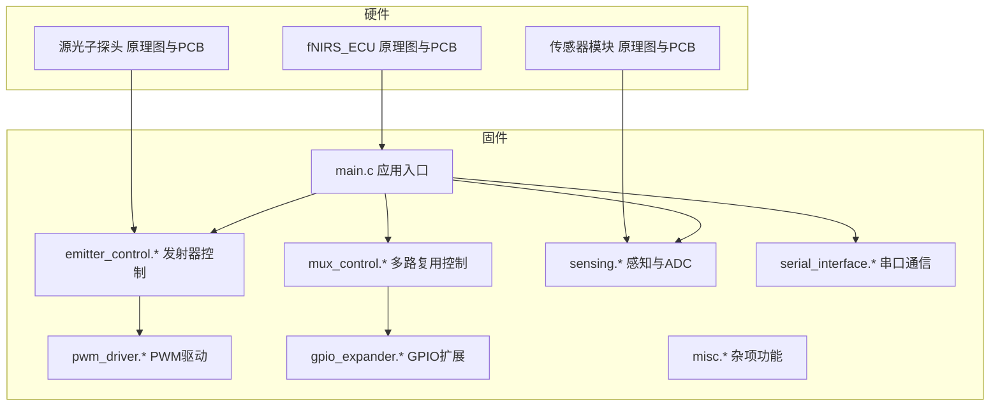
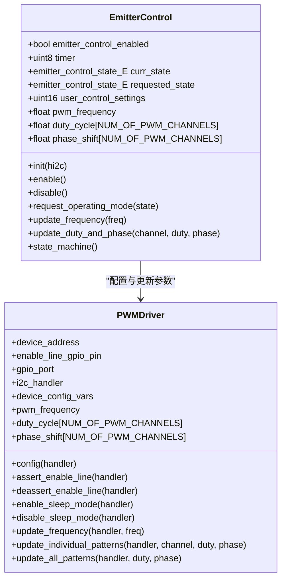
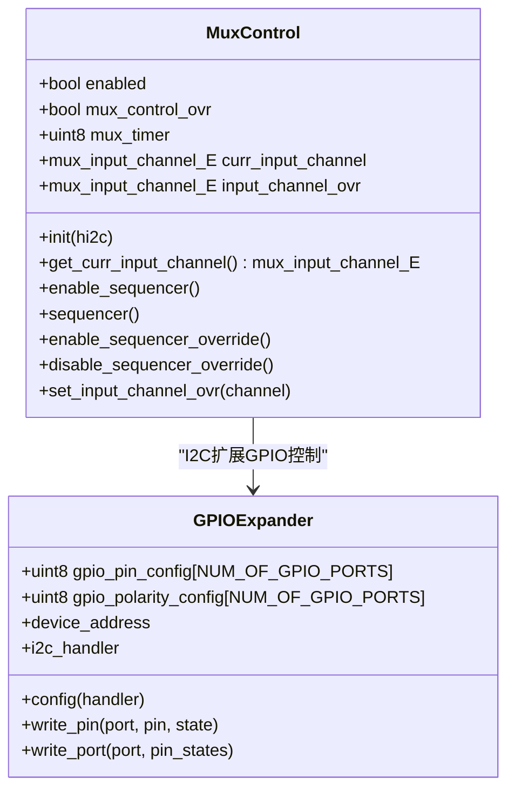
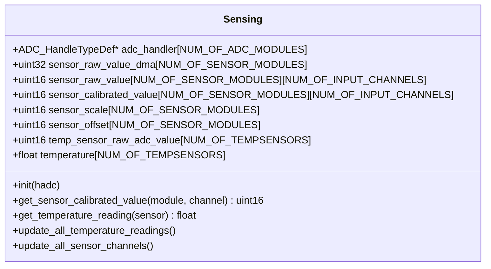
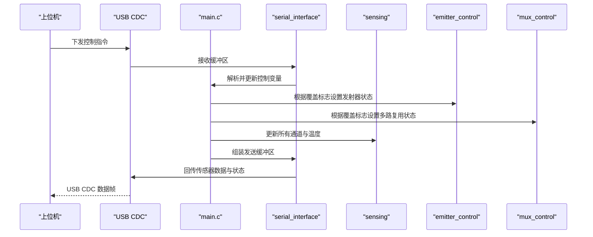
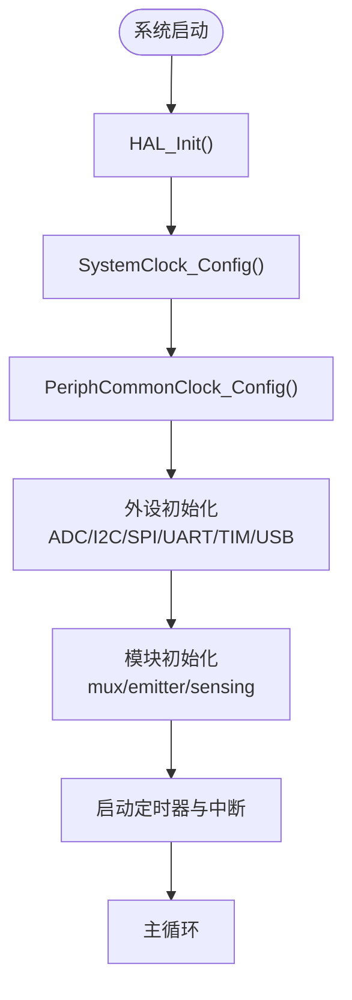
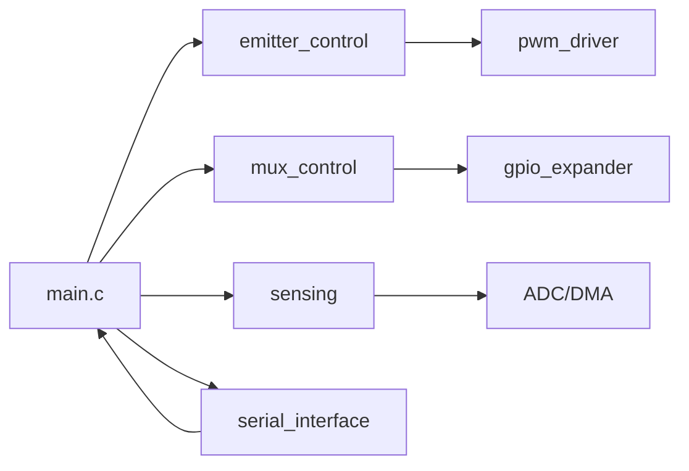

# 硬件架构设计

<cite>
**本文档引用的文件**
- [README.md](file://README.md)
- [main.c](file://firmware/STM32/fNIRS/Core/Src/main.c)
- [main.h](file://firmware/STM32/fNIRS/Core/Inc/main.h)
- [emitter_control.h](file://firmware/STM32/fNIRS/Core/Inc/emitter_control.h)
- [mux_control.h](file://firmware/STM32/fNIRS/Core/Inc/mux_control.h)
- [pwm_driver.h](file://firmware/STM32/fNIRS/Core/Inc/pwm_driver.h)
- [sensing.h](file://firmware/STM32/fNIRS/Core/Inc/sensing.h)
- [gpio_expander.h](file://firmware/STM32/fNIRS/Core/Inc/gpio_expander.h)
- [serial_interface.h](file://firmware/STM32/fNIRS/Core/Inc/serial_interface.h)
- [misc.h](file://firmware/STM32/fNIRS/Core/Inc/misc.h)
- [emitter_control.c](file://firmware/STM32/fNIRS/Core/Src/emitter_control.c)
- [serial_interface.c](file://firmware/STM32/fNIRS/Core/Src/serial_interface.c)
- [fNIRS_ECU.PrjPcb](file://hardware/fNIRS_ECU/fNIRS_ECU.PrjPcb)
- [SensorModule.PrjPcb](file://hardware/fNIRS_sensor_module/SensorModule.PrjPcb)
- [SourceOptode.PrjPcb](file://hardware/SourceOptode/SourceOptode.PrjPcb)
</cite>

## 目录
1. [引言](#引言)
2. [项目结构](#项目结构)
3. [核心组件](#核心组件)
4. [架构总览](#架构总览)
5. [详细组件分析](#详细组件分析)
6. [依赖关系分析](#依赖关系分析)
7. [性能考虑](#性能考虑)
8. [故障排查指南](#故障排查指南)
9. [结论](#结论)
10. [附录](#附录)

## 引言
本技术文档面向fNIRS硬件架构设计，围绕传感器模块、电气控制单元（ECU）与连接器的系统级设计进行深入阐述。重点覆盖：
- 24个传感器模块的布局与配置：每个模块包含8个LED发射器（660nm与990nm）与探测器的光学设计原理
- ECU电路板的核心作用：基于STM32微控制器的配置、外围设备接口与电源管理
- 系统框图与组件关系图：数据流与控制流的传递路径
- 硬件选型依据、设计约束与性能考量

## 项目结构
本仓库采用分层组织方式，硬件部分由原理图与PCB工程组成；固件部分围绕STM32微控制器实现控制逻辑与数据采集。

图表来源
- [fNIRS_ECU.PrjPcb](file://hardware/fNIRS_ECU/fNIRS_ECU.PrjPcb#L1-L120)
- [SensorModule.PrjPcb](file://hardware/fNIRS_sensor_module/SensorModule.PrjPcb#L1-L120)
- [SourceOptode.PrjPcb](file://hardware/SourceOptode/SourceOptode.PrjPcb#L1-L120)
- [main.c](file://firmware/STM32/fNIRS/Core/Src/main.c#L118-L142)

章节来源
- [README.md](file://README.md#L1-L19)
- [fNIRS_ECU.PrjPcb](file://hardware/fNIRS_ECU/fNIRS_ECU.PrjPcb#L1-L120)
- [SensorModule.PrjPcb](file://hardware/fNIRS_sensor_module/SensorModule.PrjPcb#L1-L120)
- [SourceOptode.PrjPcb](file://hardware/SourceOptode/SourceOptode.PrjPcb#L1-L120)

## 核心组件
- STM32微控制器（STM32L476RET6）：系统主控，负责时基、外设初始化、任务调度与实时控制
- 发射器控制（emitter_control）：通过PWM驱动控制LED发射器（660nm/990nm），支持默认模式与循环模式
- 多路复用控制（mux_control）：选择不同检测通道，支持自动扫描与手动覆盖
- 感知与ADC（sensing）：多通道ADC采集，DMA搬运，温度传感器读取
- GPIO扩展（gpio_expander）：I2C扩展GPIO，用于控制外部器件
- PWM驱动（pwm_driver）：I2C接口的PWM控制器，支持频率、占空比与相位调整
- 串口通信（serial_interface）：USB CDC接口解析上位机指令，下发发射器与多路复用控制
- 杂项功能（misc）：周期性LED闪烁、串口输出等辅助功能

章节来源
- [main.c](file://firmware/STM32/fNIRS/Core/Src/main.c#L118-L142)
- [emitter_control.h](file://firmware/STM32/fNIRS/Core/Inc/emitter_control.h#L13-L38)
- [mux_control.h](file://firmware/STM32/fNIRS/Core/Inc/mux_control.h#L13-L40)
- [sensing.h](file://firmware/STM32/fNIRS/Core/Inc/sensing.h#L13-L61)
- [gpio_expander.h](file://firmware/STM32/fNIRS/Core/Inc/gpio_expander.h#L13-L35)
- [pwm_driver.h](file://firmware/STM32/fNIRS/Core/Inc/pwm_driver.h#L13-L62)
- [serial_interface.h](file://firmware/STM32/fNIRS/Core/Inc/serial_interface.h#L12-L51)
- [misc.h](file://firmware/STM32/fNIRS/Core/Inc/misc.h#L10-L12)

## 架构总览
系统以STM32为核心，通过I2C接口控制PWM驱动器与GPIO扩展器，实现对24个传感器模块的同步控制与数据采集。上位机通过USB CDC下发控制指令，ECU执行后将各模块的ADC采样结果与发射器状态打包回传。

```mermaid
graph TB
PC["上位机<br/>USB CDC"] --> USBCDC["USB CDC 接口"]
USBCDC --> MAIN["main.c 主循环"]
MAIN --> EM["发射器控制<br/>emitter_control"]
MAIN --> MUX["多路复用控制<br/>mux_control"]
MAIN --> SENSE["感知与ADC<br/>sensing"]
MAIN --> SERIAL["串口通信解析<br/>serial_interface"]
EM --> PWM["PWM驱动<br/>pwm_driver"]
MUX --> GPIOEXP["GPIO扩展<br/>gpio_expander"]
SENSE --> ADC["ADC/DMA"]
SENSE --> TEMP["温度传感器"]
ADC --> MAIN
TEMP --> MAIN
PWM --> MAIN
GPIOEXP --> MAIN
MAIN --> USBCDC
```

图表来源
- [main.c](file://firmware/STM32/fNIRS/Core/Src/main.c#L132-L178)
- [serial_interface.c](file://firmware/STM32/fNIRS/Core/Src/serial_interface.c#L20-L32)
- [emitter_control.c](file://firmware/STM32/fNIRS/Core/Src/emitter_control.c#L48-L93)
- [sensing.h](file://firmware/STM32/fNIRS/Core/Inc/sensing.h#L46-L61)
- [gpio_expander.h](file://firmware/STM32/fNIRS/Core/Inc/gpio_expander.h#L26-L35)
- [pwm_driver.h](file://firmware/STM32/fNIRS/Core/Inc/pwm_driver.h#L35-L62)

## 详细组件分析

### 发射器控制（emitter_control）
- 功能职责：管理LED发射器（660nm/990nm）的启停、频率与占空比、相位设置；支持默认模式与循环模式
- 关键数据结构：状态机枚举、占空比与相位数组、用户设置位图
- 默认模式映射：奇数模块对应990nm通道，偶数模块对应660nm通道
- 与PWM驱动协作：通过I2C接口更新各通道的频率、占空比与相位

图表来源
- [emitter_control.h](file://firmware/STM32/fNIRS/Core/Inc/emitter_control.h#L26-L38)
- [pwm_driver.h](file://firmware/STM32/fNIRS/Core/Inc/pwm_driver.h#L35-L78)

章节来源
- [emitter_control.h](file://firmware/STM32/fNIRS/Core/Inc/emitter_control.h#L13-L38)
- [emitter_control.c](file://firmware/STM32/fNIRS/Core/Src/emitter_control.c#L48-L93)
- [pwm_driver.h](file://firmware/STM32/fNIRS/Core/Inc/pwm_driver.h#L13-L78)

### 多路复用控制（mux_control）
- 功能职责：选择输入通道（通道1~4），支持自动扫描序列与手动覆盖
- 关键数据结构：当前通道、覆盖使能与目标通道
- 与GPIO扩展协作：通过I2C扩展GPIO控制外部多路复用器

图表来源
- [mux_control.h](file://firmware/STM32/fNIRS/Core/Inc/mux_control.h#L32-L40)
- [gpio_expander.h](file://firmware/STM32/fNIRS/Core/Inc/gpio_expander.h#L26-L46)

章节来源
- [mux_control.h](file://firmware/STM32/fNIRS/Core/Inc/mux_control.h#L13-L40)
- [gpio_expander.h](file://firmware/STM32/fNIRS/Core/Inc/gpio_expander.h#L13-L46)

### 感知与ADC（sensing）
- 功能职责：初始化ADC与DMA，轮询更新各模块的原始值与校准值，读取温度传感器
- 数据结构：按模块与通道组织的原始/校准值、温度数组
- 与多路复用协作：根据当前通道读取对应模块的ADC值

图表来源
- [sensing.h](file://firmware/STM32/fNIRS/Core/Inc/sensing.h#L46-L61)

章节来源
- [sensing.h](file://firmware/STM32/fNIRS/Core/Inc/sensing.h#L13-L61)

### 串口通信（serial_interface）
- 功能职责：解析上位机下发的控制指令（发射器状态、多路复用状态），并将各模块的ADC与发射器状态打包回传
- 关键索引：接收缓冲区索引、发送缓冲区索引与每模块字节数

图表来源
- [serial_interface.c](file://firmware/STM32/fNIRS/Core/Src/serial_interface.c#L20-L32)
- [serial_interface.c](file://firmware/STM32/fNIRS/Core/Src/serial_interface.c#L60-L81)
- [main.c](file://firmware/STM32/fNIRS/Core/Src/main.c#L152-L178)

章节来源
- [serial_interface.h](file://firmware/STM32/fNIRS/Core/Inc/serial_interface.h#L12-L51)
- [serial_interface.c](file://firmware/STM32/fNIRS/Core/Src/serial_interface.c#L20-L32)
- [serial_interface.c](file://firmware/STM32/fNIRS/Core/Src/serial_interface.c#L60-L81)

### 传感器模块布局与光学设计
- 模块数量：24个传感器模块
- 每模块构成：8个LED发射器（660nm/990nm）与探测器
- 光学设计原理：遵循修正比尔-朗伯定律，通过双波长测量血氧变化，实现对大脑活动的非侵入式监测
- 布局策略：模块化设计便于装配与替换，确保光源与探测器的几何关系稳定一致

章节来源
- [README.md](file://README.md#L15-L16)
- [SensorModule.PrjPcb](file://hardware/fNIRS_sensor_module/SensorModule.PrjPcb#L1-L120)

### ECU电路板与STM32配置
- 微控制器：STM32L476RET6（低功耗、高性能）
- 外设接口：ADC、I2C、SPI、USART、TIM、USB Device
- 电源管理：通过PWR外设与电压调节实现低功耗运行
- 初始化流程：HAL_Init → SystemClock_Config → PeriphCommonClock_Config → 各外设初始化 → 启动定时器与中断

图表来源
- [main.c](file://firmware/STM32/fNIRS/Core/Src/main.c#L109-L128)
- [main.c](file://firmware/STM32/fNIRS/Core/Src/main.c#L132-L141)

章节来源
- [main.c](file://firmware/STM32/fNIRS/Core/Src/main.c#L109-L141)
- [main.h](file://firmware/STM32/fNIRS/Core/Inc/main.h#L60-L70)

## 依赖关系分析
- 组件耦合：main.c作为控制中枢，依赖emitter_control、mux_control、sensing、serial_interface等模块；emitter_control与mux_control进一步依赖pwm_driver与gpio_expander
- 数据流：sensing从ADC/DMA获取原始数据，经emitter_control与mux_control选择后形成最终数据集；serial_interface负责与上位机交互
- 控制流：上位机通过USB CDC下发指令，serial_interface解析后影响emitter_control与mux_control的状态机

图表来源
- [main.c](file://firmware/STM32/fNIRS/Core/Src/main.c#L132-L178)
- [emitter_control.h](file://firmware/STM32/fNIRS/Core/Inc/emitter_control.h#L40-L53)
- [mux_control.h](file://firmware/STM32/fNIRS/Core/Inc/mux_control.h#L42-L53)
- [sensing.h](file://firmware/STM32/fNIRS/Core/Inc/sensing.h#L63-L70)
- [serial_interface.h](file://firmware/STM32/fNIRS/Core/Inc/serial_interface.h#L53-L63)

章节来源
- [main.c](file://firmware/STM32/fNIRS/Core/Src/main.c#L132-L178)

## 性能考虑
- 实时性：通过定时器中断驱动状态机与数据更新，保证控制与采样的实时性
- 功耗优化：使用STM32L4系列低功耗特性，结合PWR外设进行电压与模式管理
- 并行处理：ADC DMA搬运减少CPU占用，串口通信采用USB CDC实现高效数据传输
- 扩展性：模块化设计便于增加模块数量或升级外设能力

## 故障排查指南
- 通信异常：检查USB CDC初始化与缓冲区大小；确认serial_interface解析逻辑与上位机协议一致
- ADC采集异常：验证ADC/DMA初始化与通道配置；检查sensing模块的更新函数调用时机
- 发射器不工作：核对emitter_control状态机与pwm_driver配置；确认I2C地址与引脚连接
- 多路复用错误：检查mux_control的通道选择与gpio_expander的扩展GPIO配置
- 温度读数异常：确认温度传感器引脚与sensing模块的读取函数

章节来源
- [serial_interface.c](file://firmware/STM32/fNIRS/Core/Src/serial_interface.c#L20-L32)
- [sensing.h](file://firmware/STM32/fNIRS/Core/Inc/sensing.h#L63-L70)
- [emitter_control.c](file://firmware/STM32/fNIRS/Core/Src/emitter_control.c#L48-L93)
- [mux_control.h](file://firmware/STM32/fNIRS/Core/Inc/mux_control.h#L42-L53)
- [gpio_expander.h](file://firmware/STM32/fNIRS/Core/Inc/gpio_expander.h#L38-L46)

## 结论
本fNIRS硬件架构以STM32为核心，结合PWM驱动、GPIO扩展与多路复用技术，实现了对24个传感器模块的高精度同步控制与数据采集。通过USB CDC实现友好的上位机交互，满足实时性与低功耗需求。模块化设计便于扩展与维护，为后续功能增强与产品化奠定了坚实基础。

## 附录
- 硬件文件组织：原理图与PCB工程位于hardware目录，固件位于firmware/STM32/fNIRS
- 项目概览：README.md概述了系统亮点与技术指标

章节来源
- [README.md](file://README.md#L1-L19)
- [fNIRS_ECU.PrjPcb](file://hardware/fNIRS_ECU/fNIRS_ECU.PrjPcb#L1-L120)
- [SensorModule.PrjPcb](file://hardware/fNIRS_sensor_module/SensorModule.PrjPcb#L1-L120)
- [SourceOptode.PrjPcb](file://hardware/SourceOptode/SourceOptode.PrjPcb#L1-L120)