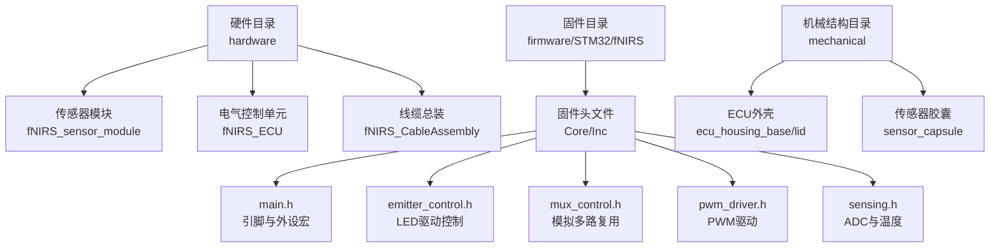
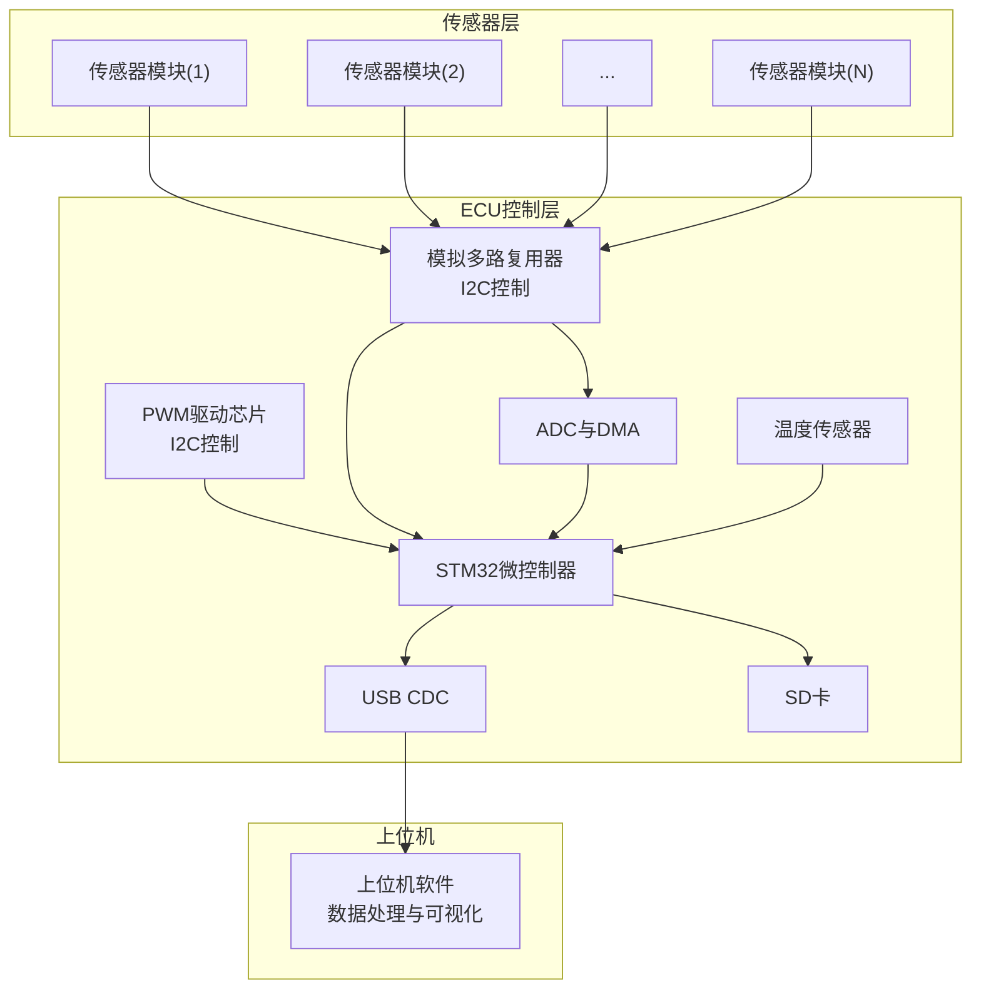
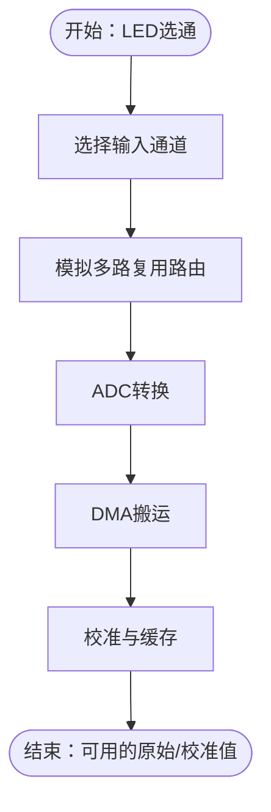
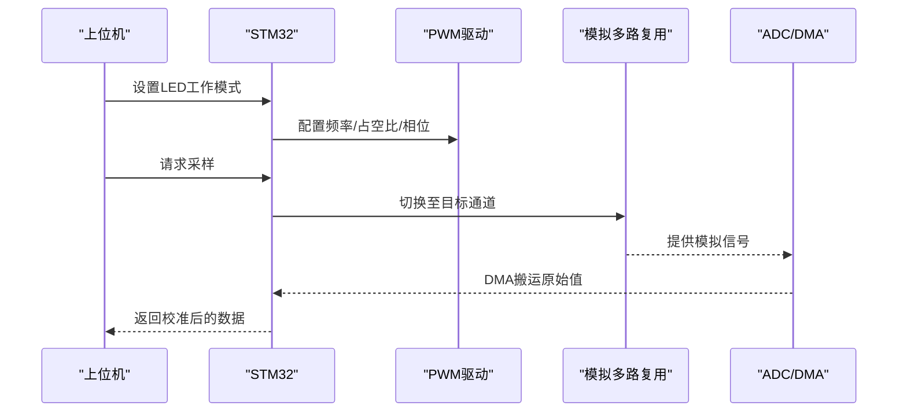
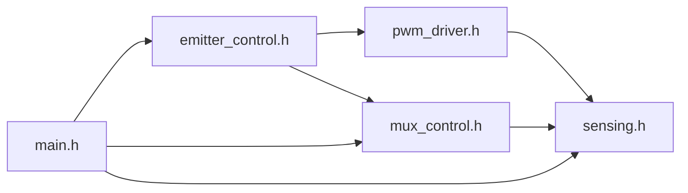

# 硬件系统

<cite>
**本文引用的文件**
- [硬件总览说明](file://hardware/README.md)
- [传感器模块项目文件](file://hardware/fNIRS_sensor_module/SensorModule.PrjPcb)
- [ECU项目文件](file://hardware/fNIRS_ECU/fNIRS_ECU.PrjPcb)
- [主头文件（引脚定义）](file://firmware/STM32/fNIRS/Core/Inc/main.h)
- [LED驱动控制接口](file://firmware/STM32/fNIRS/Core/Inc/emitter_control.h)
- [模拟多路复用控制接口](file://firmware/STM32/fNIRS/Core/Inc/mux_control.h)
- [PWM驱动接口](file://firmware/STM32/fNIRS/Core/Inc/pwm_driver.h)
- [传感与温度采集接口](file://firmware/STM32/fNIRS/Core/Inc/sensing.h)
</cite>

## 目录
1. [简介](#简介)
2. [项目结构](#项目结构)
3. [核心组件](#核心组件)
4. [架构总览](#架构总览)
5. [详细组件分析](#详细组件分析)
6. [依赖关系分析](#依赖关系分析)
7. [性能考量](#性能考量)
8. [故障排除指南](#故障排除指南)
9. [结论](#结论)
10. [附录](#附录)

## 简介
本技术文档面向fNIRS硬件系统，围绕传感器模块、电气控制单元（ECU）与机械结构展开，系统性阐述以下内容：
- 传感器模块：24个模块、每模块8通道（660nm与990nm LED各4通道）的光学与电路设计要点
- ECU电路板：基于STM32微控制器的系统级设计，含I2C扩展、PWM驱动、ADC采样、温度监测、USB CDC等接口
- 机械结构：3D打印外壳与传感器胶囊的人体工学与材料选择
- PCB布局与装配：Altium工程组织、输出文件类型、Gerber/钻孔/装配清单等
- 测试与排障：基于固件接口与硬件输出的验证流程

## 项目结构
硬件相关资源以Altium工程形式组织，核心目录如下：
- hardware：包含传感器模块、ECU、线缆总装、源/检测光子探头等项目的原理图与PCB
- firmware：STM32固件，涵盖LED驱动、模拟多路复用、ADC采样与USB CDC通信
- mechanical：3D打印外壳与传感器胶囊模型
- software：数据处理与可视化脚本（用于验证与展示）

**图表来源**
- [硬件总览说明](file://hardware/README.md#L1-L19)
- [传感器模块项目文件](file://hardware/fNIRS_sensor_module/SensorModule.PrjPcb#L1-L120)
- [ECU项目文件](file://hardware/fNIRS_ECU/fNIRS_ECU.PrjPcb#L1-L120)

**章节来源**
- [硬件总览说明](file://hardware/README.md#L1-L19)
- [传感器模块项目文件](file://hardware/fNIRS_sensor_module/SensorModule.PrjPcb#L1-L120)
- [ECU项目文件](file://hardware/fNIRS_ECU/fNIRS_ECU.PrjPcb#L1-L120)

## 核心组件
- 传感器模块（Sensor Module）
  - 每模块集成LED发射器与探测器，支持两波长（660nm/990nm），按项目文件显示包含发射与检测两个原理图与顶层PCB
  - 24个模块按8通道配置，形成192路探测路径
- ECU电气控制单元（ECU）
  - 基于STM32微控制器，通过I2C连接GPIO扩展与PWM驱动芯片，实现LED功率控制与多路模拟开关切换
  - 集成ADC采样、温度传感器、USB CDC接口，支持数据记录与上位机通信
- 机械结构
  - ECU外壳与传感器胶囊采用3D打印，便于人体工学贴合与快速迭代
  - 材料需满足生物相容性与光学透光性要求（具体材料参数见机械设计文档）

**章节来源**
- [传感器模块项目文件](file://hardware/fNIRS_sensor_module/SensorModule.PrjPcb#L87-L120)
- [ECU项目文件](file://hardware/fNIRS_ECU/fNIRS_ECU.PrjPcb#L52-L120)
- [主头文件（引脚定义）](file://firmware/STM32/fNIRS/Core/Inc/main.h#L60-L70)
- [LED驱动控制接口](file://firmware/STM32/fNIRS/Core/Inc/emitter_control.h#L13-L38)
- [PWM驱动接口](file://firmware/STM32/fNIRS/Core/Inc/pwm_driver.h#L13-L62)
- [模拟多路复用控制接口](file://firmware/STM32/fNIRS/Core/Inc/mux_control.h#L13-L40)
- [传感与温度采集接口](file://firmware/STM32/fNIRS/Core/Inc/sensing.h#L13-L61)

## 架构总览
下图展示从传感器到ECU再到上位机的数据通路与控制流。

**图表来源**
- [LED驱动控制接口](file://firmware/STM32/fNIRS/Core/Inc/emitter_control.h#L40-L48)
- [PWM驱动接口](file://firmware/STM32/fNIRS/Core/Inc/pwm_driver.h#L65-L73)
- [模拟多路复用控制接口](file://firmware/STM32/fNIRS/Core/Inc/mux_control.h#L42-L49)
- [传感与温度采集接口](file://firmware/STM32/fNIRS/Core/Inc/sensing.h#L63-L68)

## 详细组件分析

### 传感器模块（24×8通道）
- 光学设计
  - 每模块8个探测通道，对应660nm与990nm LED各4通道，实现近红外光谱测量
  - 发射与检测在同一PCB上布局，确保光路对准与一致性
- 电路与装配
  - 项目文件包含发射、检测与顶层PCB，支持Gerber、钻孔、装配清单等输出
  - 可导出Pick & Place文件，便于自动化贴片与装配
- 数据通路
  - 模拟信号经多路复用后进入ADC，温度传感器同步采集

**图表来源**
- [模拟多路复用控制接口](file://firmware/STM32/fNIRS/Core/Inc/mux_control.h#L42-L49)
- [传感与温度采集接口](file://firmware/STM32/fNIRS/Core/Inc/sensing.h#L46-L61)

**章节来源**
- [传感器模块项目文件](file://hardware/fNIRS_sensor_module/SensorModule.PrjPcb#L87-L120)
- [模拟多路复用控制接口](file://firmware/STM32/fNIRS/Core/Inc/mux_control.h#L13-L40)
- [传感与温度采集接口](file://firmware/STM32/fNIRS/Core/Inc/sensing.h#L13-L61)

### ECU电路板（STM32系统）
- 微控制器与外设
  - 引脚定义覆盖SD卡检测、PWM使能、测试LED、SPI片选等，体现系统关键接口
- LED功率控制
  - 通过PWM驱动芯片与GPIO扩展，实现对16路PWM通道的频率、占空比与相位调节
  - 支持多种工作模式（禁用、空闲、默认、用户控制、循环、仅660nm或仅990nm）
- 模拟多路复用与ADC
  - 多路复用器负责在多个传感器模块间切换，ADC与DMA完成高速采样
- 温度监测与存储
  - 集成温度传感器，支持温度读数更新；USB CDC用于数据传输；SD卡用于本地存储
- 工程输出
  - Altium工程生成Gerber、钻孔、装配清单、3D视图等，便于制造与装配

**图表来源**
- [主头文件（引脚定义）](file://firmware/STM32/fNIRS/Core/Inc/main.h#L60-L70)
- [LED驱动控制接口](file://firmware/STM32/fNIRS/Core/Inc/emitter_control.h#L40-L48)
- [PWM驱动接口](file://firmware/STM32/fNIRS/Core/Inc/pwm_driver.h#L65-L73)
- [模拟多路复用控制接口](file://firmware/STM32/fNIRS/Core/Inc/mux_control.h#L42-L49)
- [传感与温度采集接口](file://firmware/STM32/fNIRS/Core/Inc/sensing.h#L63-L68)

**章节来源**
- [主头文件（引脚定义）](file://firmware/STM32/fNIRS/Core/Inc/main.h#L60-L70)
- [LED驱动控制接口](file://firmware/STM32/fNIRS/Core/Inc/emitter_control.h#L13-L38)
- [PWM驱动接口](file://firmware/STM32/fNIRS/Core/Inc/pwm_driver.h#L13-L62)
- [模拟多路复用控制接口](file://firmware/STM32/fNIRS/Core/Inc/mux_control.h#L13-L40)
- [传感与温度采集接口](file://firmware/STM32/fNIRS/Core/Inc/sensing.h#L13-L61)
- [ECU项目文件](file://hardware/fNIRS_ECU/fNIRS_ECU.PrjPcb#L52-L120)

### 机械结构（3D打印）
- ECU外壳与传感器胶囊采用3D打印，便于人体工学贴合与快速迭代
- 材料需兼顾生物相容性与光学透光性，避免对近红外光产生显著衰减
- 胶囊与外壳的配合应保证传感器模块稳定固定与光路对准

**章节来源**
- [硬件总览说明](file://hardware/README.md#L1-L19)

## 依赖关系分析
- 固件与硬件接口
  - LED驱动控制依赖PWM驱动与GPIO扩展；模拟多路复用控制依赖I2C；ADC采样依赖DMA
- Altium工程组织
  - 各项目（传感器模块、ECU、线缆总装）均以PrjPcb为入口，统一输出Gerber、钻孔、装配清单与3D视图
- 数据流耦合
  - 传感器模块→多路复用→ADC→DMA→MCU→USB/SD，形成端到端数据链路

**图表来源**
- [LED驱动控制接口](file://firmware/STM32/fNIRS/Core/Inc/emitter_control.h#L40-L48)
- [PWM驱动接口](file://firmware/STM32/fNIRS/Core/Inc/pwm_driver.h#L65-L73)
- [模拟多路复用控制接口](file://firmware/STM32/fNIRS/Core/Inc/mux_control.h#L42-L49)
- [传感与温度采集接口](file://firmware/STM32/fNIRS/Core/Inc/sensing.h#L63-L68)
- [主头文件（引脚定义）](file://firmware/STM32/fNIRS/Core/Inc/main.h#L60-L70)

**章节来源**
- [LED驱动控制接口](file://firmware/STM32/fNIRS/Core/Inc/emitter_control.h#L13-L38)
- [PWM驱动接口](file://firmware/STM32/fNIRS/Core/Inc/pwm_driver.h#L13-L62)
- [模拟多路复用控制接口](file://firmware/STM32/fNIRS/Core/Inc/mux_control.h#L13-L40)
- [传感与温度采集接口](file://firmware/STM32/fNIRS/Core/Inc/sensing.h#L13-L61)
- [主头文件（引脚定义）](file://firmware/STM32/fNIRS/Core/Inc/main.h#L60-L70)

## 性能考量
- 采样与带宽
  - ADC与DMA配合可实现高吞吐采样，建议根据采样率与通道数评估总带宽需求
- PWM与热管理
  - LED功率与占空比直接影响发热量，需结合温度传感器与散热设计
- 多路复用时序
  - 多路复用切换引入延迟，需在固件中优化轮询与DMA搬运节奏
- 供电与EMC
  - ECU电源设计需满足LED驱动、ADC与USB的功耗峰值；注意地回路与屏蔽，降低噪声

## 故障排除指南
- LED不发光或亮度异常
  - 检查PWM使能线与I2C配置；确认LED驱动状态机已进入“启用”或“默认模式”
  - 使用调试接口读取PWM寄存器，核对频率、占空比与相位设置
- 通道无响应或读数异常
  - 核对多路复用器当前通道是否正确；检查ADC DMA搬运标志与缓冲区
  - 对比不同通道的原始值分布，定位断路或短路
- USB通信失败
  - 确认CDC枚举与端点配置；检查上位机端口占用与驱动安装
- 温度过高
  - 检查温度传感器读数与阈值设定；适当降低LED功率或增加散热
- PCB装配问题
  - 对照Pick & Place与BOM，逐项核对元件位置与极性；使用飞线测试关键节点

**章节来源**
- [主头文件（引脚定义）](file://firmware/STM32/fNIRS/Core/Inc/main.h#L60-L70)
- [LED驱动控制接口](file://firmware/STM32/fNIRS/Core/Inc/emitter_control.h#L40-L48)
- [PWM驱动接口](file://firmware/STM32/fNIRS/Core/Inc/pwm_driver.h#L75-L78)
- [模拟多路复用控制接口](file://firmware/STM32/fNIRS/Core/Inc/mux_control.h#L42-L49)
- [传感与温度采集接口](file://firmware/STM32/fNIRS/Core/Inc/sensing.h#L63-L68)

## 结论
本硬件系统以Altium工程化设计与STM32固件协同，实现了24×8通道的近红外光学测量能力。通过PWM驱动、模拟多路复用与ADC/DMA的组合，系统具备良好的可扩展性与实时性。配合3D打印的ECU与传感器胶囊，满足人体工学与快速迭代的需求。建议在后续版本中完善材料与热设计，并持续优化固件时序与上位机交互体验。

## 附录
- 工程输出清单（示例）
  - Gerber文件：用于PCB制造
  - NC Drill：钻孔与定位
  - Pick Place：贴片坐标
  - 3D视图/视频：装配与检查
- 组装指导
  - 按照Pick & Place文件进行贴片；先小信号后大功率；注意极性与安规距离
  - 完成焊接后进行功能测试与光路校准

**章节来源**
- [传感器模块项目文件](file://hardware/fNIRS_sensor_module/SensorModule.PrjPcb#L584-L625)
- [ECU项目文件](file://hardware/fNIRS_ECU/fNIRS_ECU.PrjPcb#L565-L737)