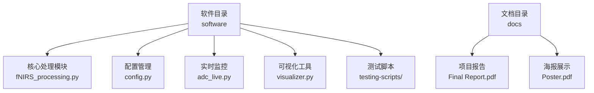
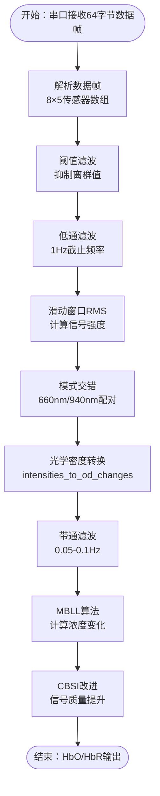
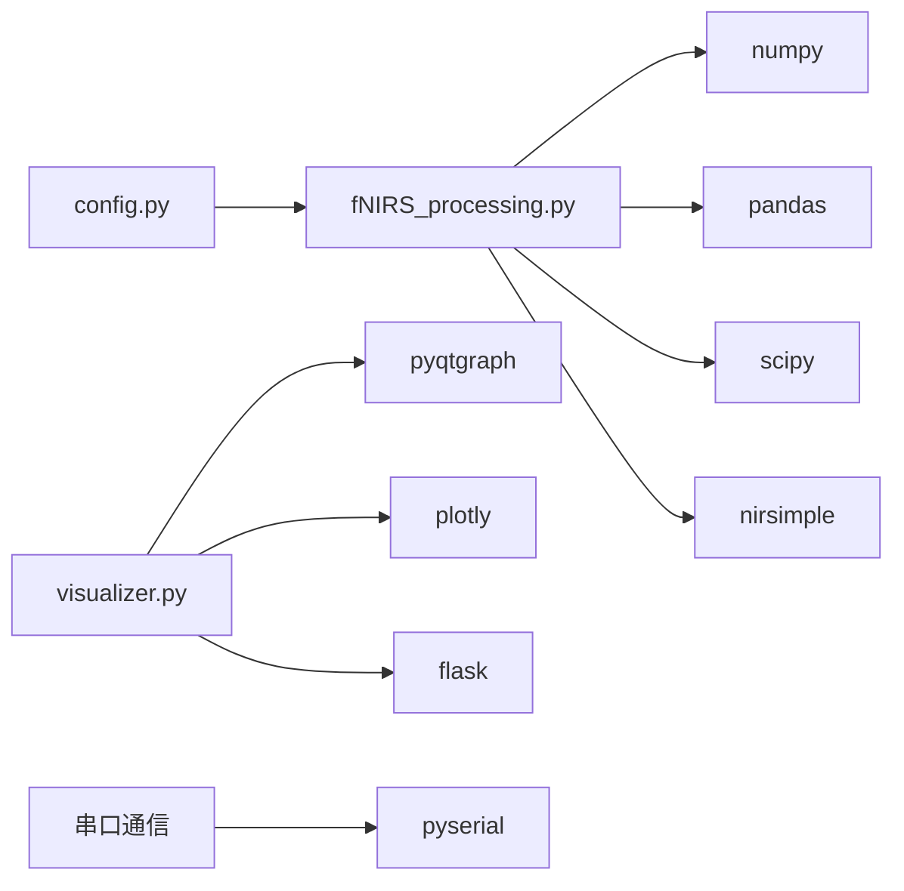

# 硬件系统

<cite>
**本文引用的文件**
- [项目总览](file://README.md)
- [软件设计说明](file://software/README.md)
- [配置文件](file://software/config.py)
- [fNIRS数据处理脚本](file://software/fNIRS_processing.py)
- [处理流程文档](file://software/fNIRS_processing_pipeline.md)
</cite>

## 更新摘要
**所做更改**
- 删除了所有硬件相关的文档内容，因为当前仓库不再包含硬件组件
- 更新了项目结构描述，反映软件为主的架构
- 移除了硬件组件分析、PCB设计、机械结构等相关章节
- 保留了软件架构和数据处理流程的相关内容

## 目录
1. [简介](#简介)
2. [项目结构](#项目结构)
3. [软件架构](#软件架构)
4. [数据处理流程](#数据处理流程)
5. [依赖关系分析](#依赖关系分析)
6. [性能考量](#性能考量)
7. [故障排除指南](#故障排除指南)
8. [结论](#结论)
9. [附录](#附录)

## 简介
本技术文档面向fNIRS上位机软件系统，专注于数据采集、处理与可视化功能。由于硬件系统已在项目中移除，本文档将重点介绍软件架构、数据处理流程和用户界面设计，帮助开发者和研究人员理解系统的软件实现。

## 项目结构
当前仓库采用软件为主的设计，核心目录结构如下：
- software：包含完整的Python软件栈，涵盖串口通信、数据处理、可视化和Web界面
- docs：包含项目报告和海报文档
- 根目录：项目说明和配置文件

**图表来源**
- [项目总览:31-43](file://README.md#L31-L43)
- [软件设计说明:127-180](file://software/README.md#L127-L180)

**章节来源**
- [项目总览:31-43](file://README.md#L31-L43)
- [软件设计说明:127-180](file://software/README.md#L127-L180)

## 软件架构
软件系统采用模块化设计，主要包含以下核心组件：

### 核心处理模块
- **数据采集模块**：通过串口通信接收64字节数据帧，解析8个传感器组的数据
- **数据处理模块**：实现阈值滤波、低通滤波、滑动窗口RMS计算、模式交错等预处理功能
- **后处理模块**：应用改进的Beer-Lambert定律(MBLL)和CBSI算法计算血红蛋白浓度变化

### 用户界面模块
- **实时监控界面**：使用PyQtGraph显示实时ADC数据
- **Web可视化界面**：基于Flask和Socket.IO的交互式Web界面
- **3D脑模型**：集成BrainMesh_Ch2_smoothed.nv文件进行3D可视化

### 辅助工具
- **模拟服务器**：提供演示模式下的假数据生成
- **动画播放器**：支持实时和处理后数据的动画显示
- **CSV处理工具**：提供数据导出和格式转换功能

**章节来源**
- [软件设计说明:1-48](file://software/README.md#L1-L48)
- [fNIRS数据处理脚本:1-80](file://software/fNIRS_processing.py#L1-L80)

## 数据处理流程
系统采用端到端的数据处理管道，从原始ADC数据到最终的血红蛋白浓度结果：

**图表来源**
- [fNIRS数据处理脚本:159-184](file://software/fNIRS_processing.py#L159-L184)
- [fNIRS数据处理脚本:439-443](file://software/fNIRS_processing.py#L439-L443)

**章节来源**
- [fNIRS数据处理脚本:159-184](file://software/fNIRS_processing.py#L159-L184)
- [fNIRS数据处理脚本:339-443](file://software/fNIRS_processing.py#L339-L443)

## 依赖关系分析
软件系统采用清晰的模块化架构，各组件之间的依赖关系如下：

### 核心依赖
- **数据处理依赖**：fNIRS_processing.py依赖numpy、pandas、scipy等科学计算库
- **可视化依赖**：PyQtGraph用于实时数据可视化，Plotly用于静态图表
- **通信依赖**：pyserial用于串口通信，socket.io用于Web界面通信

### 处理流程依赖
- **预处理阶段**：依赖信号处理库进行滤波和RMS计算
- **后处理阶段**：依赖NIRSimple库进行MBLL和CBSI算法实现
- **输出阶段**：依赖pandas进行CSV文件处理和数据导出

**图表来源**
- [配置文件:1-13](file://software/config.py#L1-L13)
- [fNIRS数据处理脚本:10-22](file://software/fNIRS_processing.py#L10-L22)

**章节来源**
- [配置文件:1-13](file://software/config.py#L1-L13)
- [fNIRS数据处理脚本:10-22](file://software/fNIRS_processing.py#L10-L22)

## 性能考量
软件系统在设计时考虑了以下性能因素：

### 实时性能
- **采样率优化**：通过智能带通滤波和重采样减少数据量
- **内存管理**：使用pandas的高效数据结构处理大规模数据集
- **并行处理**：利用多线程处理串口通信和数据可视化

### 算法效率
- **滤波优化**：采用零相位滤波器避免相位失真
- **矩阵运算**：使用numpy的向量化操作提高计算速度
- **缓存机制**：合理使用pandas的内置缓存机制

### 用户体验
- **响应时间**：实时监控界面保持低延迟响应
- **内存占用**：优化数据结构减少内存使用
- **错误处理**：完善的异常处理机制确保系统稳定性

## 故障排除指南
针对软件系统可能出现的问题，提供以下解决方案：

### 串口通信问题
- **端口识别**：检查SERIAL_PORT配置是否正确
- **权限问题**：在Linux/macOS上确保有访问串口的权限
- **波特率匹配**：确认与硬件设备的波特率设置一致

### 数据处理问题
- **数据格式**：确认输入CSV文件格式符合预期
- **内存不足**：对于大数据集考虑分批处理
- **算法参数**：调整滤波器参数和处理阈值

### 可视化问题
- **依赖安装**：确保所有可视化库正确安装
- **浏览器兼容**：使用支持WebSocket的现代浏览器
- **网络配置**：检查防火墙设置允许WebSocket连接

**章节来源**
- [配置文件:7-13](file://software/config.py#L7-L13)
- [软件设计说明:65-86](file://software/README.md#L65-L86)

## 结论
本fNIRS上位机软件系统提供了完整的数据采集、处理和可视化解决方案。通过模块化设计和高效的算法实现，系统能够实时处理近红外光谱数据并输出血红蛋白浓度变化结果。软件架构清晰，易于维护和扩展，为fNIRS研究提供了可靠的技术支撑。

## 附录
### 开发环境配置
- **Python版本**：推荐使用Python 3.7+
- **依赖管理**：使用requirements.txt进行依赖安装
- **虚拟环境**：建议使用venv创建独立的开发环境

### 数据格式规范
- **输入格式**：CSV文件，包含时间戳和8个传感器组的数据
- **输出格式**：CSV文件，包含处理后的血红蛋白浓度数据
- **数据结构**：每行代表一个时间点的完整数据集

**章节来源**
- [软件设计说明:58-64](file://software/README.md#L58-L64)
- [软件设计说明:175-180](file://software/README.md#L175-L180)