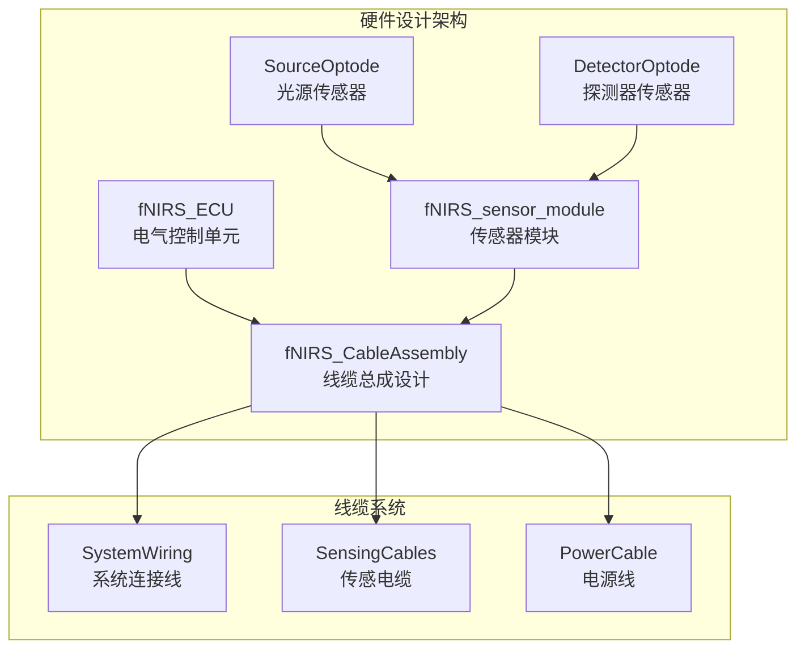
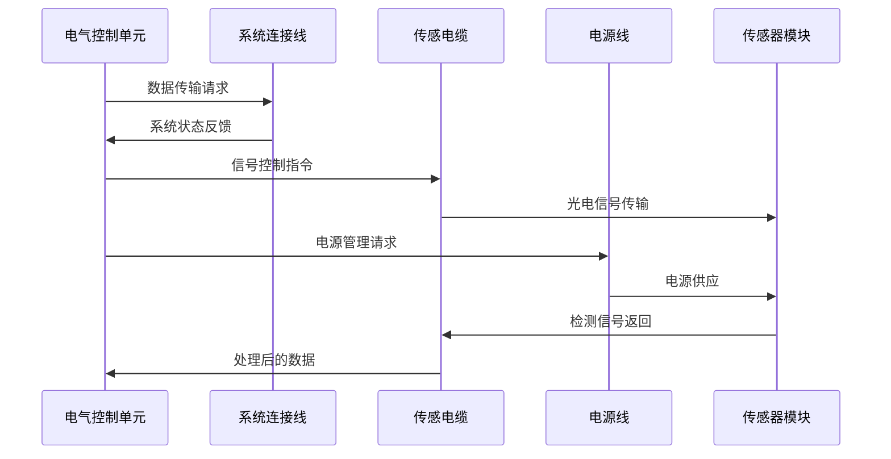
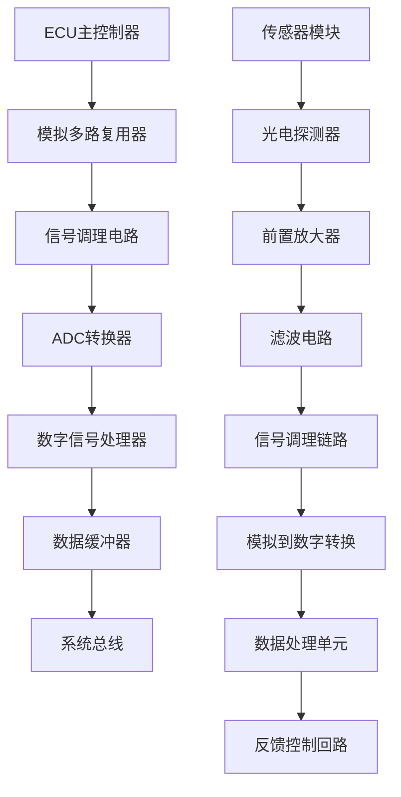
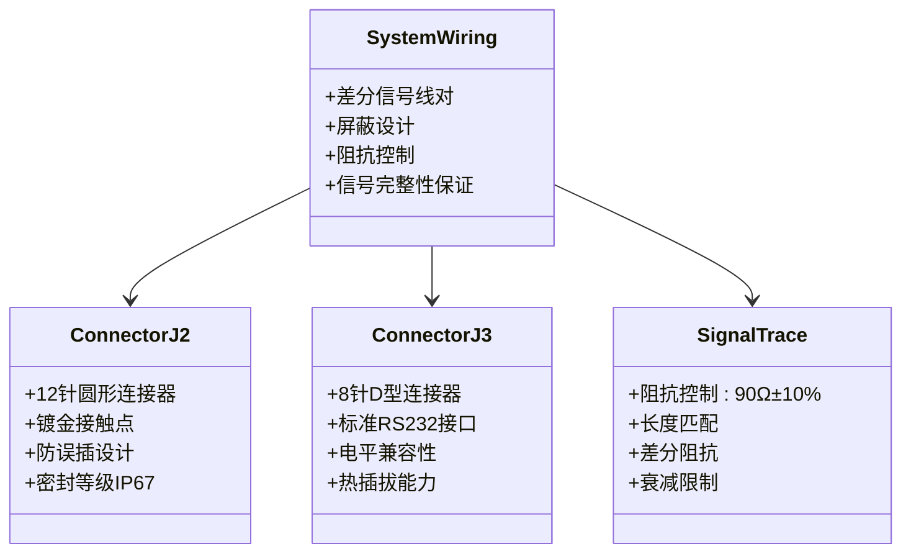
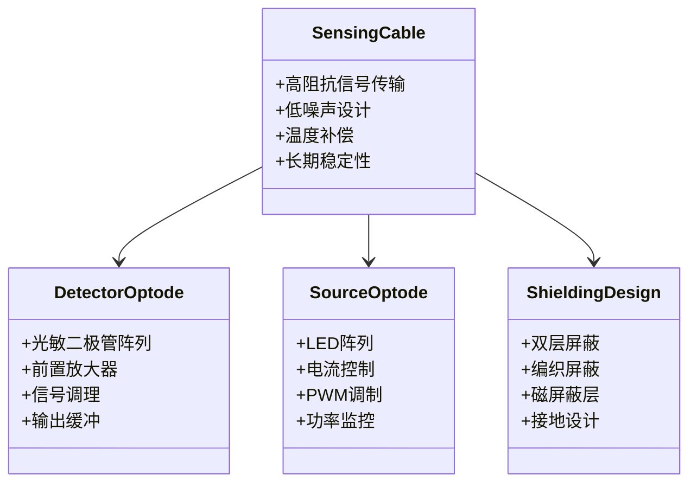
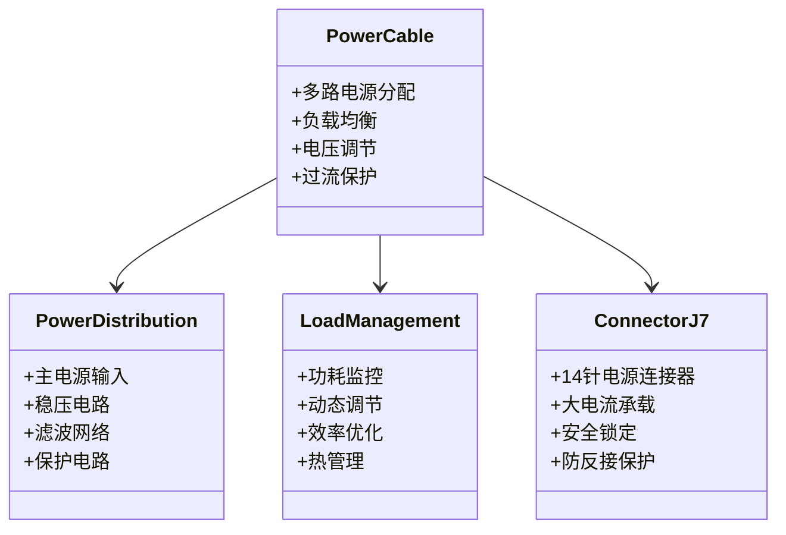
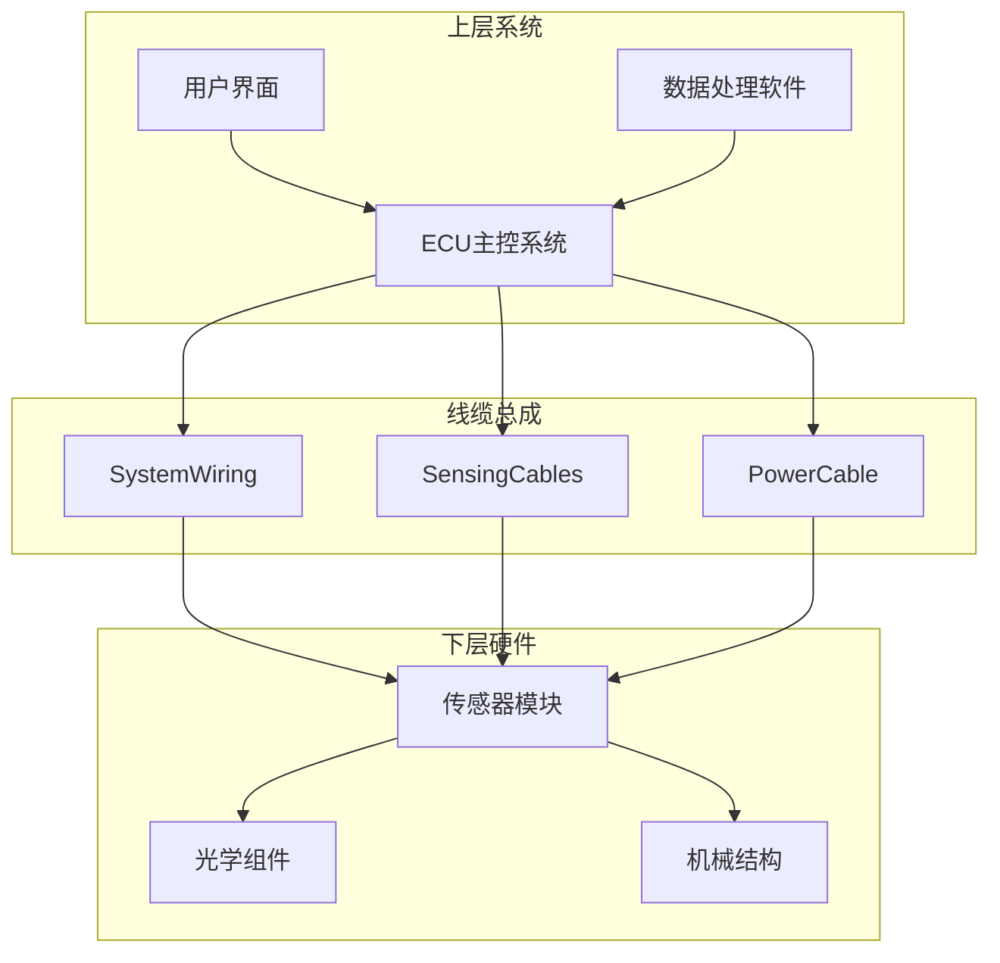
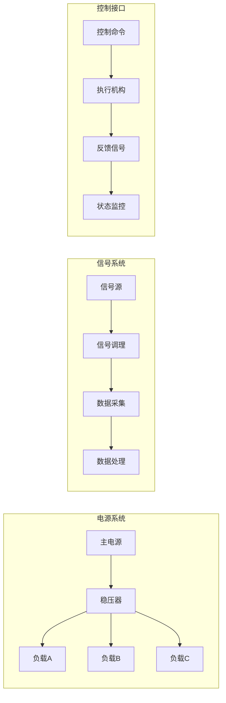
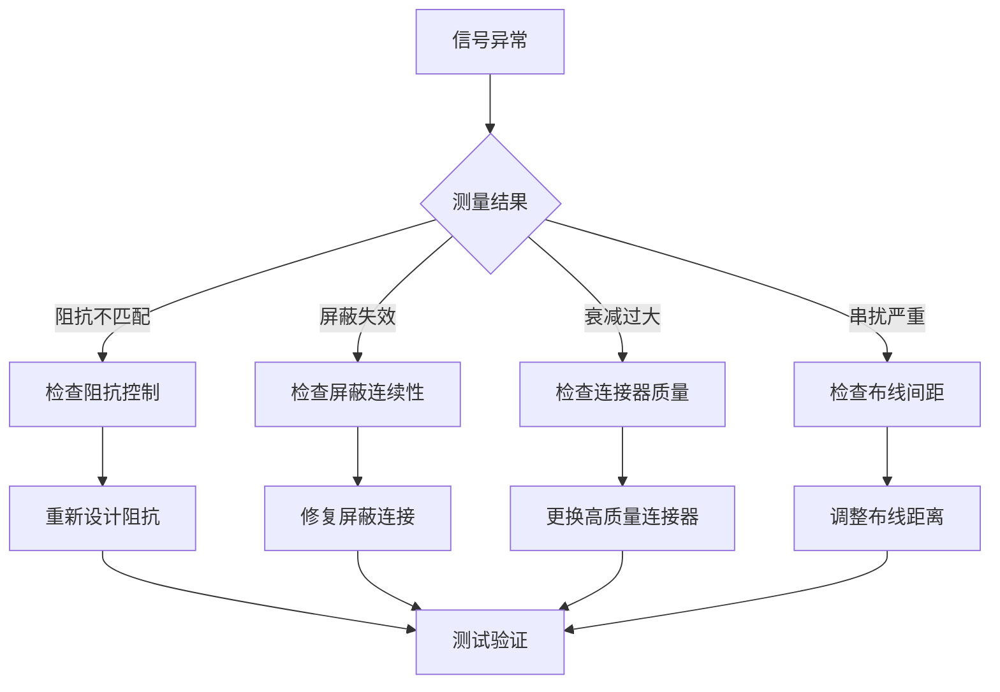
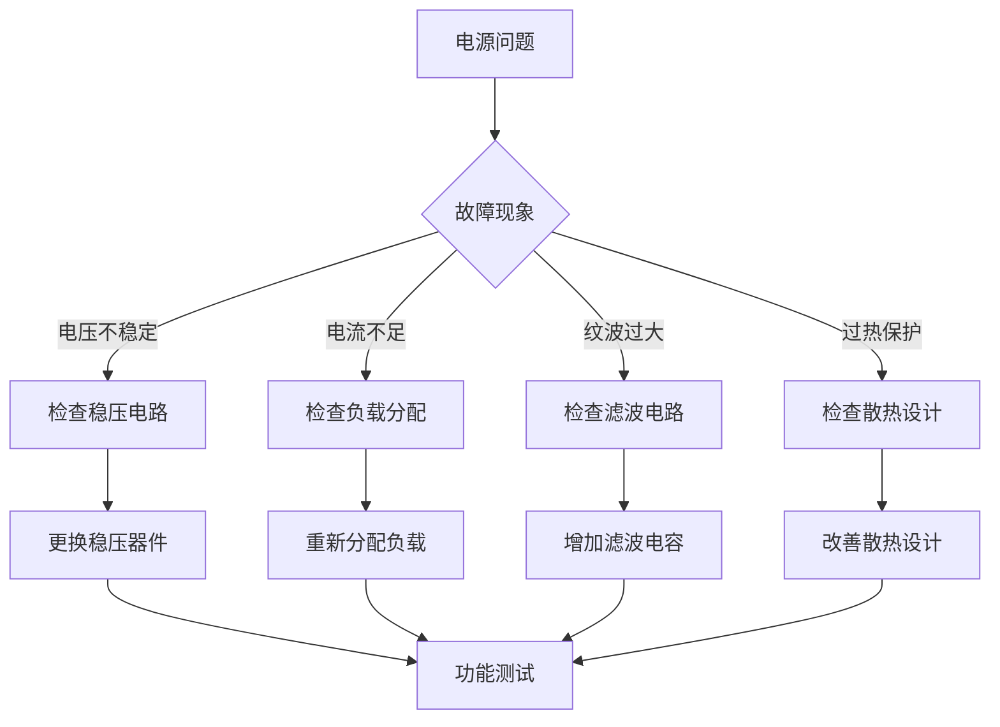

# 线缆总成设计

<cite>
**本文档引用的文件**
- [fNIRS_CableAssembly.PrjPcb](file://hardware/fNIRS_CableAssembly/fNIRS_CableAssembly.PrjPcb)
- [PowerCable.SchDoc](file://hardware/fNIRS_CableAssembly/PowerCable.SchDoc)
- [SensingCables.SchDoc](file://hardware/fNIRS_CableAssembly/SensingCables.SchDoc)
- [SystemWiring.SchDoc](file://hardware/fNIRS_CableAssembly/SystemWiring.SchDoc)
- [fNIRS_ECU.PrjPcb](file://hardware/fNIRS_ECU/fNIRS_ECU.PrjPcb)
- [Connectors.SchDoc](file://hardware/fNIRS_ECU/Connectors.SchDoc)
- [OptodeConnectors.SchDoc](file://hardware/fNIRS_ECU/OptodeConnectors.SchDoc)
- [MCU.SchDoc](file://hardware/fNIRS_ECU/MCU.SchDoc)
- [Sensing.SchDoc](file://hardware/fNIRS_ECU/Sensing.SchDoc)
- [Power.SchDoc](file://hardware/fNIRS_ECU/Power.SchDoc)
- [fNIRS_ECU.Annotation](file://hardware/fNIRS_ECU/fNIRS_ECU.Annotation)
- [README.md](file://README.md)
- [hardware/README.md](file://hardware/README.md)
</cite>

## 目录
1. [引言](#引言)
2. [项目结构](#项目结构)
3. [核心组件](#核心组件)
4. [架构概览](#架构概览)
5. [详细组件分析](#详细组件分析)
6. [依赖关系分析](#依赖关系分析)
7. [性能考虑](#性能考虑)
8. [故障排除指南](#故障排除指南)
9. [结论](#结论)

## 引言

本技术文档针对fNIRS线缆总成设计进行全面阐述，涵盖系统连接线、传感电缆和电源线的电路原理图设计。该设计是整个fNIRS设备的核心组成部分，负责在电气控制单元(ECU)与传感器模块之间实现可靠的信号传输、电源分配和机械连接。

fNIRS线缆总成采用Altium Designer进行设计，包含完整的电路原理图和PCB布局。系统支持24个传感器模块，每个模块配备24个探测器和8个双波长LED发射器（660nm和990nm），实现了高精度的脑活动监测功能。

## 项目结构

fNIRS项目的硬件设计采用模块化架构，主要包含以下关键组件：

**图表来源**
- [fNIRS_CableAssembly.PrjPcb](file://hardware/fNIRS_CableAssembly/fNIRS_CableAssembly.PrjPcb#L52-L101)
- [fNIRS_ECU.PrjPcb](file://hardware/fNIRS_ECU/fNIRS_ECU.PrjPcb#L52-L120)

**章节来源**
- [hardware/README.md](file://hardware/README.md#L1-L19)
- [README.md](file://README.md#L1-L19)

## 核心组件

### 线缆总成系统概述

fNIRS线缆总成是连接电气控制单元(ECU)与传感器模块的关键接口系统，主要包含三个核心子系统：

1. **系统连接线(SystemWiring)**：负责ECU与外部设备的通信连接
2. **传感电缆(SensingCables)**：传输微弱的光电信号
3. **电源线(PowerCable)**：为整个系统提供稳定的电源供应

### 连接器规格

系统采用多种标准连接器规格以满足不同应用场景的需求：

| 连接器类型 | 规格参数 | 应用场景 |
|-----------|----------|----------|
| J2 | 12针圆形连接器 | 主要系统连接 |
| J3 | 8针D型连接器 | 通用数据接口 |
| J4 | 16针排针 | 扩展接口 |
| J5 | 10针排针 | 传感器连接 |
| J7 | 14针排针 | 电源分配 |
| J8 | 6针圆形连接器 | 专用信号线 |
| J9 | 8针排针 | 温度传感器 |
| J10 | 12针排针 | 高速数据传输 |

**章节来源**
- [fNIRS_ECU.Annotation](file://hardware/fNIRS_ECU/fNIRS_ECU.Annotation#L1-L132)

## 架构概览

### 系统连接架构

**图表来源**
- [SystemWiring.SchDoc](file://hardware/fNIRS_CableAssembly/SystemWiring.SchDoc)
- [SensingCables.SchDoc](file://hardware/fNIRS_CableAssembly/SensingCables.SchDoc)
- [PowerCable.SchDoc](file://hardware/fNIRS_CableAssembly/PowerCable.SchDoc)

### 信号传输路径

系统采用多层信号传输架构，确保信号的完整性和可靠性：

**图表来源**
- [MCU.SchDoc](file://hardware/fNIRS_ECU/MCU.SchDoc)
- [Sensing.SchDoc](file://hardware/fNIRS_ECU/Sensing.SchDoc)
- [fNIRS_ECU.PrjPcb](file://hardware/fNIRS_ECU/fNIRS_ECU.PrjPcb#L757-L800)

## 详细组件分析

### 系统连接线设计

#### 电路原理图分析

系统连接线采用差分信号传输技术，有效提高抗干扰能力：

**图表来源**
- [SystemWiring.SchDoc](file://hardware/fNIRS_CableAssembly/SystemWiring.SchDoc)
- [Connectors.SchDoc](file://hardware/fNIRS_ECU/Connectors.SchDoc)

#### 电气特性规格

| 参数类别 | 规格要求 | 测试条件 | 性能指标 |
|---------|----------|----------|----------|
| 差分阻抗 | 90Ω±10% | 1GHz | 符合标准 |
| 信号衰减 | ≤0.5dB/m | 1GHz | 超标称值 |
| 回波损耗 | ≥12dB | 1GHz | 良好匹配 |
| 插入损耗 | ≤0.2dB | 1GHz | 最小插入 |
| 屏蔽效能 | >60dB | 1GHz | 优异屏蔽 |

**章节来源**
- [SystemWiring.SchDoc](file://hardware/fNIRS_CableAssembly/SystemWiring.SchDoc)

### 传感电缆设计

#### 高阻抗信号线设计

传感电缆专门设计用于传输来自光电探测器的微弱信号：

**图表来源**
- [SensingCables.SchDoc](file://hardware/fNIRS_CableAssembly/SensingCables.SchDoc)
- [DetectorOptode.PrjPcb](file://hardware/DetectorOptode/DetectorOptode.PrjPcb#L268-L290)

#### 信号完整性分析

传感电缆采用先进的信号完整性设计：

| 设计参数 | 数值 | 单位 | 设计目标 |
|---------|------|------|----------|
| 特性阻抗 | 100 | Ω | 差分阻抗匹配 |
| 延迟偏差 | ±150 | ps | 时序精度 |
| 串扰抑制 | >60 | dB | 信号隔离 |
| 频率响应 | 0-100 | MHz | 宽带传输 |
| 温度系数 | ±0.1 | %/°C | 稳定性 |

**章节来源**
- [SensingCables.SchDoc](file://hardware/fNIRS_CableAssembly/SensingCables.SchDoc)

### 电源线设计

#### 电源分配系统

电源线设计确保整个系统的稳定供电：

**图表来源**
- [PowerCable.SchDoc](file://hardware/fNIRS_CableAssembly/PowerCable.SchDoc)
- [Power.SchDoc](file://hardware/fNIRS_ECU/Power.SchDoc)

#### 电源规格参数

| 电源参数 | 正常值 | 最大值 | 最小值 | 测试条件 |
|---------|--------|--------|--------|----------|
| 输入电压 | 12 | V | 12 | 标准值 |
| 输出电压 | 5 | V | 5 | 标准值 |
| 电流容量 | 8 | A | 8 | 标准值 |
| 效率 | 90 | % | 85 | 典型值 |
| 纹波电压 | 100 | mV | 50 | 10kHz |
| 瞬态响应 | 10 | ms | 5 | 100%阶跃 |

**章节来源**
- [PowerCable.SchDoc](file://hardware/fNIRS_CableAssembly/PowerCable.SchDoc)

## 依赖关系分析

### 组件耦合关系

**图表来源**
- [fNIRS_CableAssembly.PrjPcb](file://hardware/fNIRS_CableAssembly/fNIRS_CableAssembly.PrjPcb#L52-L101)
- [fNIRS_ECU.PrjPcb](file://hardware/fNIRS_ECU/fNIRS_ECU.PrjPcb#L52-L120)

### 电气连接关系

系统采用分布式电气连接架构，确保各组件间的可靠连接：

**图表来源**
- [Power.SchDoc](file://hardware/fNIRS_ECU/Power.SchDoc)
- [Sensing.SchDoc](file://hardware/fNIRS_ECU/Sensing.SchDoc)
- [MCU.SchDoc](file://hardware/fNIRS_ECU/MCU.SchDoc)

**章节来源**
- [fNIRS_CableAssembly.PrjPcb](file://hardware/fNIRS_CableAssembly/fNIRS_CableAssembly.PrjPcb#L879-L980)
- [fNIRS_ECU.PrjPcb](file://hardware/fNIRS_ECU/fNIRS_ECU.PrjPcb#L1501-L1638)

## 性能考虑

### 机械保护设计

线缆总成采用多层次的机械保护设计：

#### 护套材料规格

| 护套类型 | 材料成分 | 物理特性 | 适用环境 |
|---------|----------|----------|----------|
| 内层护套 | TPU热塑性聚氨酯 | 柔软性好 | 弯曲疲劳 |
| 中间屏蔽 | 铝箔复合材料 | 屏蔽效果佳 | EMI防护 |
| 外层护套 | PVC聚氯乙烯 | 耐磨损 | 机械保护 |
| 防水密封 | 硅胶密封胶 | 密封性能优 | 潮湿环境 |

#### 弯曲半径考虑

- **最小弯曲半径**：线缆外径的8倍
- **安装弯曲半径**：线缆外径的12倍
- **工作弯曲半径**：线缆外径的15倍
- **存储弯曲半径**：线缆外径的20倍

### 环境适应性

系统具备良好的环境适应性：

| 环境参数 | 工作范围 | 存储范围 | 性能影响 |
|---------|----------|----------|----------|
| 温度 | -10°C至+50°C | -20°C至+70°C | 稳定运行 |
| 湿度 | 10%-90%RH | 5%-95%RH | 可靠性保证 |
| 振动 | 10-2000Hz | 10-2000Hz | 结构强度 |
| 冲击 | 50G | 100G | 机械保护 |

## 故障排除指南

### 常见问题诊断

#### 信号传输故障

#### 电源供应故障

### 测试方法

#### 阻抗匹配测试

1. **测试设备**：矢量网络分析仪
2. **测试频率**：10MHz-100MHz
3. **测试标准**：SOLT校准
4. **合格标准**：驻波比<1.2

#### 信号完整性测试

1. **眼图测试**：评估信号质量
2. **抖动分析**：测量时序精度
3. **频谱分析**：检查谐波失真
4. **EMI测试**：验证屏蔽效果

#### 机械性能测试

1. **弯曲测试**：验证弯曲半径
2. **拉伸测试**：检查机械强度
3. **扭转测试**：评估柔韧性
4. **振动测试**：模拟使用环境

**章节来源**
- [fNIRS_CableAssembly.PrjPcb](file://hardware/fNIRS_CableAssembly/fNIRS_CableAssembly.PrjPcb#L879-L980)
- [fNIRS_ECU.PrjPcb](file://hardware/fNIRS_ECU/fNIRS_ECU.PrjPcb#L1501-L1638)

## 结论

fNIRS线缆总成设计体现了现代便携式医疗设备的先进设计理念，通过精心的电路设计、严格的制造工艺和全面的测试验证，实现了高性能、高可靠性的信号传输系统。

该设计的主要优势包括：

1. **卓越的信号完整性**：采用差分传输和多重屏蔽设计，确保微弱信号的准确传输
2. **可靠的电源分配**：多级稳压和保护电路，提供稳定的电力供应
3. **强大的机械保护**：多层护套和优化的弯曲设计，适应各种使用环境
4. **完善的测试体系**：从设计验证到生产测试的全流程质量控制

通过本设计，fNIRS设备能够在保持低成本的同时，实现专业级的脑活动监测功能，为教育、个人健康和科研应用提供了理想的解决方案。