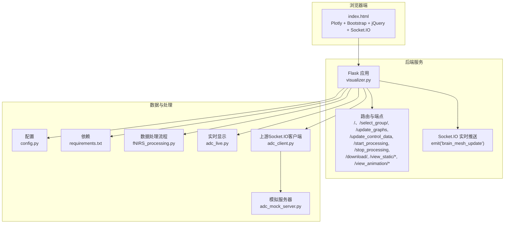
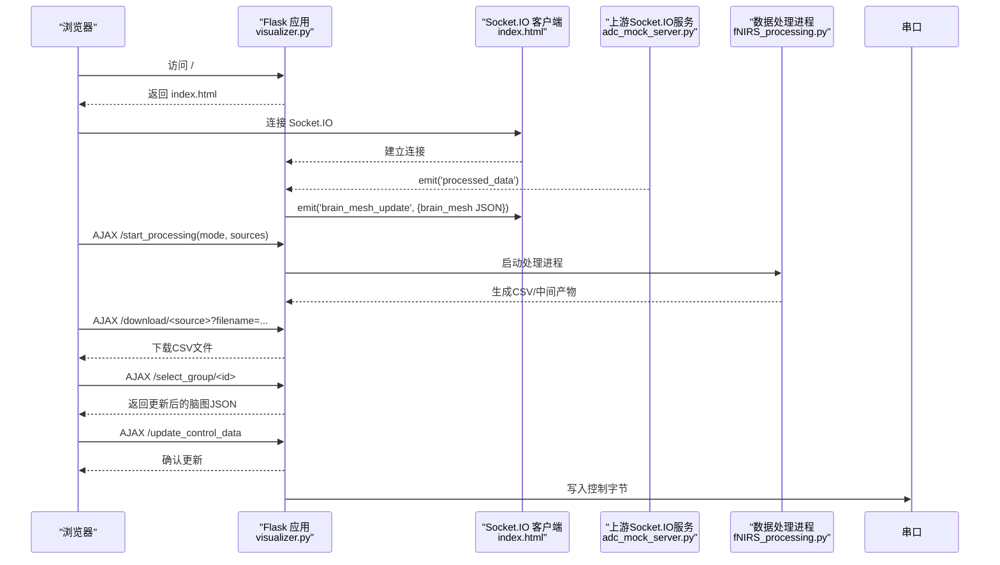
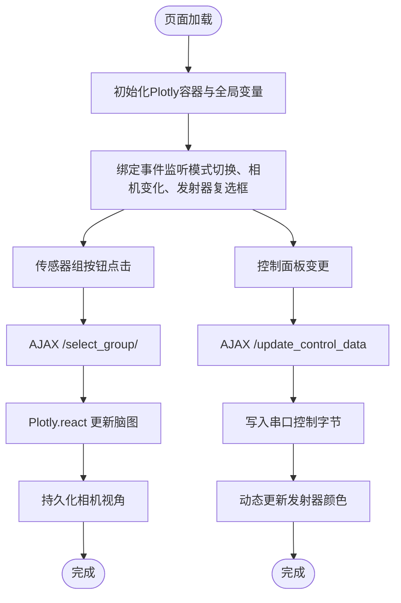
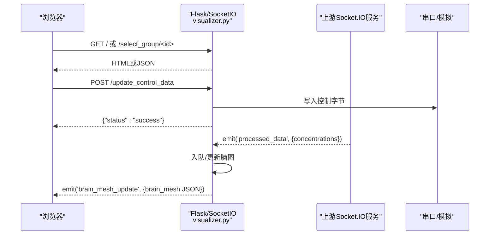
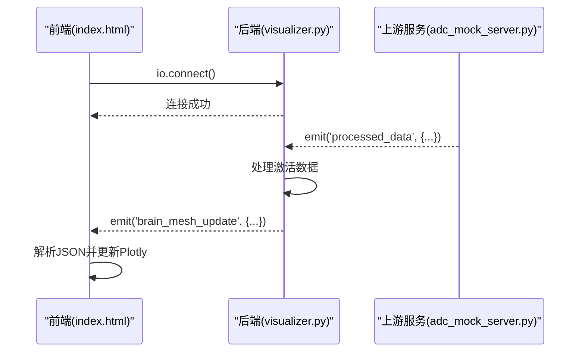
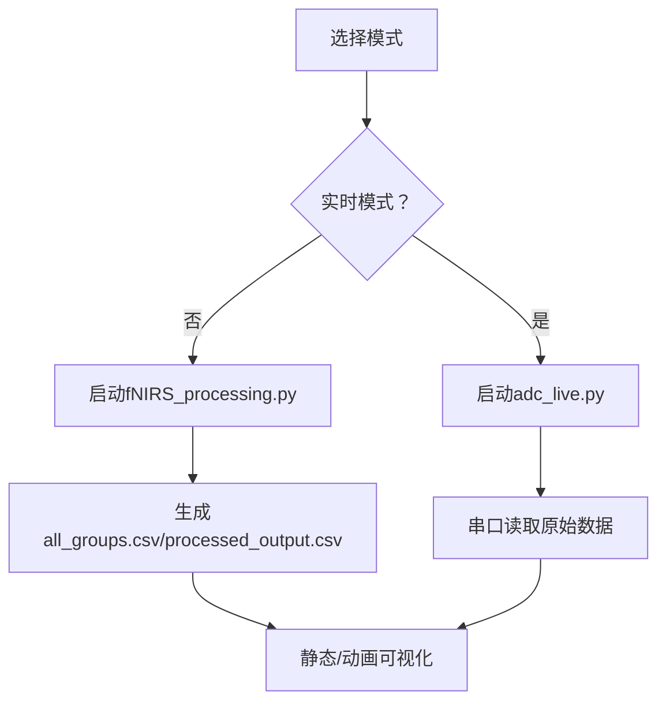
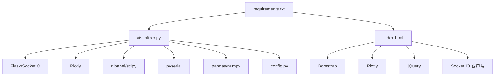

# Web界面开发

<cite>
**本文引用的文件**
- [index.html](file://software/index.html)
- [visualizer.py](file://software/visualizer.py)
- [requirements.txt](file://software/requirements.txt)
- [config.py](file://software/config.py)
- [fNIRS_processing.py](file://software/fNIRS_processing.py)
- [adc_live.py](file://software/adc_live.py)
- [adc_client.py](file://software/adc_client.py)
- [adc_animation.py](file://software/adc_animation.py)
- [mBLL_animation.py](file://software/mBLL_animation.py)
- [adc_mock_server.py](file://software/adc_mock_server.py)
</cite>

## 目录
1. [引言](#引言)
2. [项目结构](#项目结构)
3. [核心组件](#核心组件)
4. [架构总览](#架构总览)
5. [详细组件分析](#详细组件分析)
6. [依赖关系分析](#依赖关系分析)
7. [性能考虑](#性能考虑)
8. [故障排除指南](#故障排除指南)
9. [结论](#结论)
10. [附录](#附录)

## 引言
本技术文档面向fNIRS Web界面开发，围绕基于Flask的Web应用展开，系统性阐述以下方面：
- 路由设计与模板渲染、静态资源管理
- Socket.IO实时通信机制（客户端连接、消息传递、事件处理）
- 用户界面HTML结构与CSS样式（响应式布局与Bootstrap框架）
- JavaScript前端与后端API交互模式（AJAX与WebSocket）
- 用户交互功能实现（传感器组选择、发射器状态控制、数据下载）
- 错误处理与用户体验优化策略

## 项目结构
该Web界面位于software目录中，核心文件包括：
- 前端页面与脚本：index.html（含Plotly、Bootstrap、jQuery、Socket.IO）
- 后端服务：visualizer.py（Flask + Flask-SocketIO，提供路由与实时更新）
- 配置与依赖：requirements.txt、config.py
- 数据采集与处理：fNIRS_processing.py、adc_live.py、adc_client.py
- 动画与演示：adc_animation.py、mBLL_animation.py、adc_mock_server.py

**图表来源**
- [visualizer.py](file://software/visualizer.py#L52-L947)
- [index.html](file://software/index.html#L1-L750)
- [requirements.txt](file://software/requirements.txt#L1-L15)
- [config.py](file://software/config.py#L1-L13)
- [fNIRS_processing.py](file://software/fNIRS_processing.py#L1-L496)
- [adc_live.py](file://software/adc_live.py#L1-L210)
- [adc_client.py](file://software/adc_client.py#L1-L181)
- [adc_mock_server.py](file://software/adc_mock_server.py#L1-L65)

**章节来源**
- [visualizer.py](file://software/visualizer.py#L52-L947)
- [index.html](file://software/index.html#L1-L750)
- [requirements.txt](file://software/requirements.txt#L1-L15)
- [config.py](file://software/config.py#L1-L13)

## 核心组件
- Flask应用与Socket.IO服务：负责路由、静态资源分发、实时数据推送、子进程管理与文件下载。
- 前端页面与交互逻辑：通过AJAX与后端交互，通过Socket.IO接收实时脑图更新，使用Plotly渲染3D脑图与传感器曲线。
- 控制面板：支持传感器组选择、MUX与发射器控制、PWM映射、模式切换（实时/记录）、计时与下载。
- 数据处理链路：串口采集（或模拟数据）→处理与保存CSV→可视化与动画。

**章节来源**
- [visualizer.py](file://software/visualizer.py#L589-L947)
- [index.html](file://software/index.html#L1-L750)
- [fNIRS_processing.py](file://software/fNIRS_processing.py#L1-L496)
- [adc_live.py](file://software/adc_live.py#L1-L210)
- [adc_client.py](file://software/adc_client.py#L1-L181)
- [adc_mock_server.py](file://software/adc_mock_server.py#L1-L65)

## 架构总览
下图展示从浏览器到后端、再到数据处理与串口/模拟数据的完整路径。

**图表来源**
- [visualizer.py](file://software/visualizer.py#L589-L947)
- [index.html](file://software/index.html#L305-L747)
- [adc_mock_server.py](file://software/adc_mock_server.py#L1-L65)
- [fNIRS_processing.py](file://software/fNIRS_processing.py#L1-L496)

## 详细组件分析

### 前端页面与交互（index.html）
- 页面结构与样式
  - 使用Bootstrap网格系统实现响应式布局（左脑图区域、右控制面板）。
  - 自定义CSS卡片、按钮、图例与Plotly容器样式。
- 3D脑图与传感器节点
  - 使用Plotly在容器内渲染3D脑图，支持相机视角持久化与重放。
  - 提供“传感器组高亮”与“激活区域高亮”的视觉反馈。
- 控制面板
  - MUX控制与发射器控制（覆盖使能、状态选择、PWM映射表）。
  - 模式选择（实时/记录），记录模式下可选择ADC与mBLL源并启动/停止。
- 交互逻辑
  - 传感器组按钮点击：调用后端接口获取更新后的脑图JSON并重绘。
  - 发射器状态变更：AJAX提交控制数据，同时动态更新发射器颜色。
  - 模式切换：开始/停止处理，记录模式结束后生成下载与视图按钮。
  - 数据下载：弹窗输入文件名，后端返回CSV附件。
  - 实时更新：Socket.IO监听脑图更新事件，接收后端推送的Plotly JSON并react。

**图表来源**
- [index.html](file://software/index.html#L307-L747)

**章节来源**
- [index.html](file://software/index.html#L1-L750)

### 后端Flask与Socket.IO（visualizer.py）
- 应用与Socket.IO初始化
  - 创建Flask应用与SocketIO实例，启用跨域与线程异步模式。
- 路由与端点
  - GET /：返回index.html。
  - GET /update_graphs：返回当前脑图JSON。
  - GET /select_group/<int:group_id>：高亮指定传感器组并返回脑图JSON。
  - POST /update_control_data：接收控制数据，更新全局状态并写入串口。
  - POST /start_processing：根据模式启动ADC实时或记录处理流程。
  - POST /stop_processing：向子进程发送信号以优雅停止，并重新初始化串口。
  - GET /download/<source>：下载CSV文件（ADC或mBLL）。
  - GET /view_static/ADC、/view_static/mBLL：生成静态Plotly HTML页面。
  - GET /view_animation/ADC、/view_animation/mBLL：启动动画脚本。
- 实时更新
  - 上游Socket.IO客户端连接本地端口，接收processed_data事件。
  - 将最新激活数据转换为脑图高亮并emit('brain_mesh_update')给前端。
- 子进程管理
  - 使用subprocess启动/停止数据采集与处理脚本；通过信号进行优雅终止。
- 静态资源与模板
  - 使用send_from_directory分发index.html与CSV文件。
  - 静态HTML页面通过Plotly离线模式生成并返回。

**图表来源**
- [visualizer.py](file://software/visualizer.py#L589-L947)

**章节来源**
- [visualizer.py](file://software/visualizer.py#L52-L947)

### Socket.IO实时通信机制
- 客户端连接
  - 前端通过Socket.IO客户端库建立连接，默认使用HTTP长轮询回退至WebSocket。
- 事件处理
  - 监听'brain_mesh_update'事件，解析后端传来的Plotly JSON并react更新。
- 上游服务
  - 后端作为Socket.IO客户端连接上游服务，接收processed_data事件，转换为脑图高亮并推送给前端。
- 异步模式
  - 后端使用线程异步模式；上游服务使用eventlet异步模式以提升并发。

**图表来源**
- [index.html](file://software/index.html#L333-L338)
- [visualizer.py](file://software/visualizer.py#L925-L947)
- [adc_mock_server.py](file://software/adc_mock_server.py#L48-L64)

**章节来源**
- [index.html](file://software/index.html#L305-L338)
- [visualizer.py](file://software/visualizer.py#L67-L96)
- [adc_mock_server.py](file://software/adc_mock_server.py#L1-L65)

### 用户界面与Bootstrap布局
- 响应式网格
  - 左侧8列用于3D脑图，右侧4列用于控制面板与模式选择。
- 卡片与按钮
  - 使用Bootstrap卡片组织各功能模块；自定义按钮样式与悬停效果。
- 图例与Legend
  - 在脑图容器上方提供传感器类型、波长与高亮区域的图例说明。
- 交互控件
  - 复选框、单选框、下拉框与表格配合jQuery实现联动与禁用控制。

**章节来源**
- [index.html](file://software/index.html#L95-L299)

### JavaScript与后端API交互模式
- AJAX请求
  - 传感器组选择：$.getJSON('/select_group/<id>')。
  - 控制面板更新：$.ajax({url:'/update_control_data', type:'POST', contentType:'application/json', data:JSON.stringify(...)})。
  - 模式切换：POST '/start_processing' 与 '/stop_processing'。
  - 下载CSV：window.location.href指向'/download/<source>?filename=...'。
- WebSocket（Socket.IO）
  - 建立连接后监听'brain_mesh_update'事件，接收后端推送的Plotly JSON并更新视图。
- 定时与计时
  - 记录模式下使用setInterval更新秒表显示。

**章节来源**
- [index.html](file://software/index.html#L340-L747)

### 用户交互功能详解
- 传感器组选择
  - 点击按钮后调用后端/select_group/<id>，返回更新后的脑图JSON，若存在相机视角则重放。
- 发射器状态控制
  - 覆盖使能与状态选择联动；PWM映射表按发射器位组合生成高低寄存器值；写入串口控制字节。
  - 发射器颜色随状态动态变化（全开940nm/660nm或逐个勾选）。
- 模式选择与数据下载
  - 实时模式仅ADC；记录模式可选ADC与mBLL；停止后生成下载、静态图与动画按钮。
  - 下载时弹窗输入文件名，后端返回CSV附件。

**章节来源**
- [index.html](file://software/index.html#L431-L733)
- [visualizer.py](file://software/visualizer.py#L646-L733)

### 数据流与处理链路
- 实时模式
  - 启动adc_live.py，通过串口读取原始ADC数据并在GUI中实时显示。
- 记录模式
  - 停止后端串口读取，启动fNIRS_processing.py进行数据采集、预处理、插值与mBLL处理，输出CSV。
- 演示模式
  - 在demo模式下，启动adc_mock_server.py模拟上游数据，或启动adc_client.py连接上游服务。

**图表来源**
- [visualizer.py](file://software/visualizer.py#L646-L711)
- [fNIRS_processing.py](file://software/fNIRS_processing.py#L445-L496)
- [adc_live.py](file://software/adc_live.py#L191-L210)

**章节来源**
- [visualizer.py](file://software/visualizer.py#L646-L711)
- [fNIRS_processing.py](file://software/fNIRS_processing.py#L1-L496)
- [adc_live.py](file://software/adc_live.py#L1-L210)
- [adc_client.py](file://software/adc_client.py#L1-L181)
- [adc_mock_server.py](file://software/adc_mock_server.py#L1-L65)

## 依赖关系分析
- Python依赖
  - Flask、Flask-SocketIO、eventlet、nibabel、nirsimple、numpy、pandas、plotly、PyQt5、pyqtgraph、pyserial、python-socketio、scipy、tabulate。
- 前端依赖
  - Bootstrap、Plotly、jQuery、Socket.IO客户端。
- 配置
  - 串口参数（端口、波特率、超时）在config.py中集中管理。

**图表来源**
- [requirements.txt](file://software/requirements.txt#L1-L15)
- [visualizer.py](file://software/visualizer.py#L22-L32)
- [index.html](file://software/index.html#L7-L12)
- [config.py](file://software/config.py#L7-L12)

**章节来源**
- [requirements.txt](file://software/requirements.txt#L1-L15)
- [visualizer.py](file://software/visualizer.py#L22-L32)
- [index.html](file://software/index.html#L7-L12)
- [config.py](file://software/config.py#L1-L13)

## 性能考虑
- 异步与并发
  - 后端使用线程异步模式，前端Socket.IO客户端与上游服务采用eventlet异步模式，减少阻塞。
- 数据队列与锁
  - 使用Queue与Lock保护上游数据队列，避免竞态条件；满队列时丢弃最旧数据。
- 实时更新频率
  - 前端定时器与后端数据到达频率需平衡，避免过度刷新导致卡顿。
- 内存与存储
  - Plotly JSON序列化与反序列化成本较高，建议在必要时才推送；对历史数据采用滑动窗口策略。
- 串口写入
  - 控制数据合并为字节流一次性写入，减少串口I/O次数。

[本节为通用指导，无需特定文件引用]

## 故障排除指南
- 无法连接Socket.IO
  - 检查后端是否正确运行于8050端口；确认浏览器控制台网络面板中的WS连接状态。
  - 确认跨域设置与CORS允许来源。
- 脑图不更新
  - 确认后端已收到上游数据并触发emit('brain_mesh_update')。
  - 检查前端是否正确监听事件并调用Plotly.react。
- 控制无效
  - 确认覆盖使能已勾选且状态选择非禁用；检查串口是否正常打开与写入。
- 下载失败
  - 确认source参数有效（ADC或mBLL）；检查后端下载路由与文件存在性。
- 实时模式无数据
  - 确认串口设备路径正确；检查demo模式与真实串口切换逻辑。

**章节来源**
- [visualizer.py](file://software/visualizer.py#L67-L96)
- [index.html](file://software/index.html#L333-L338)
- [config.py](file://software/config.py#L7-L12)
- [visualizer.py](file://software/visualizer.py#L714-L733)

## 结论
本Web界面以Flask为核心，结合Flask-SocketIO实现实时数据推送，前端使用Plotly与Bootstrap构建直观的可视化与控制面板。通过清晰的路由设计与模块化的数据处理链路，实现了从串口采集到CSV导出与多形态可视化的完整闭环。建议后续进一步完善错误提示与日志记录、优化实时更新频率与内存占用，并增强跨平台串口兼容性。

[本节为总结性内容，无需特定文件引用]

## 附录
- 关键端点一览
  - GET /：主页
  - GET /update_graphs：获取当前脑图JSON
  - GET /select_group/<id>：高亮指定传感器组
  - POST /update_control_data：更新发射器/MUX控制
  - POST /start_processing：启动实时/记录模式
  - POST /stop_processing：停止处理并重置串口
  - GET /download/<source>：下载CSV
  - GET /view_static/*：静态Plotly页面
  - GET /view_animation/*：动画脚本启动
- 依赖安装
  - 使用requirements.txt安装所需包。

**章节来源**
- [visualizer.py](file://software/visualizer.py#L589-L947)
- [requirements.txt](file://software/requirements.txt#L1-L15)