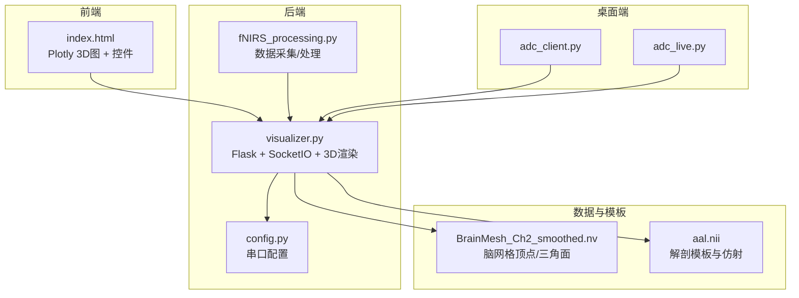
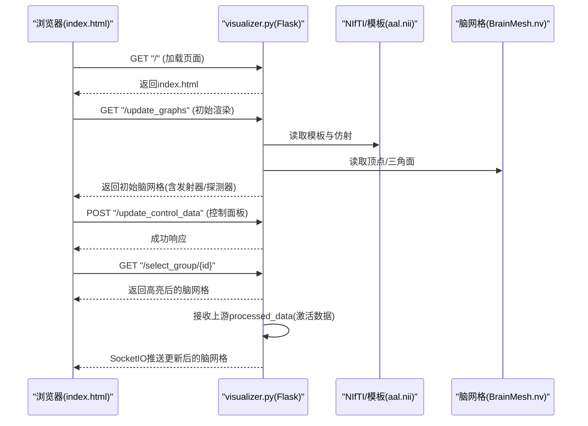
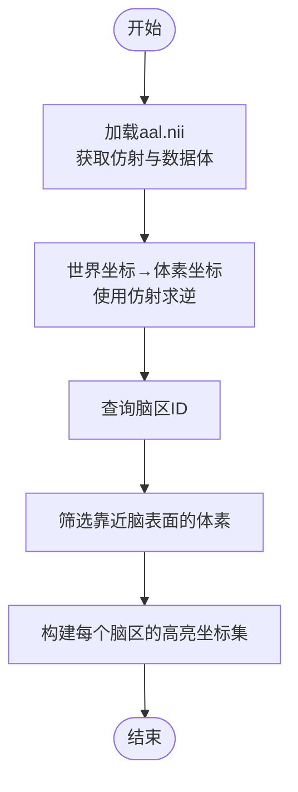
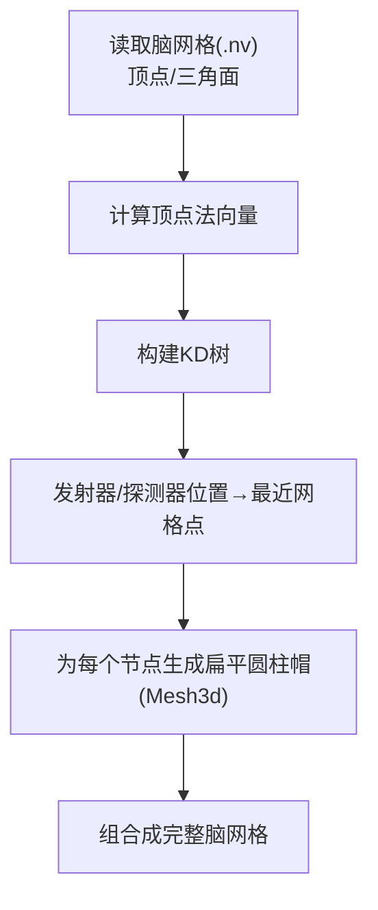
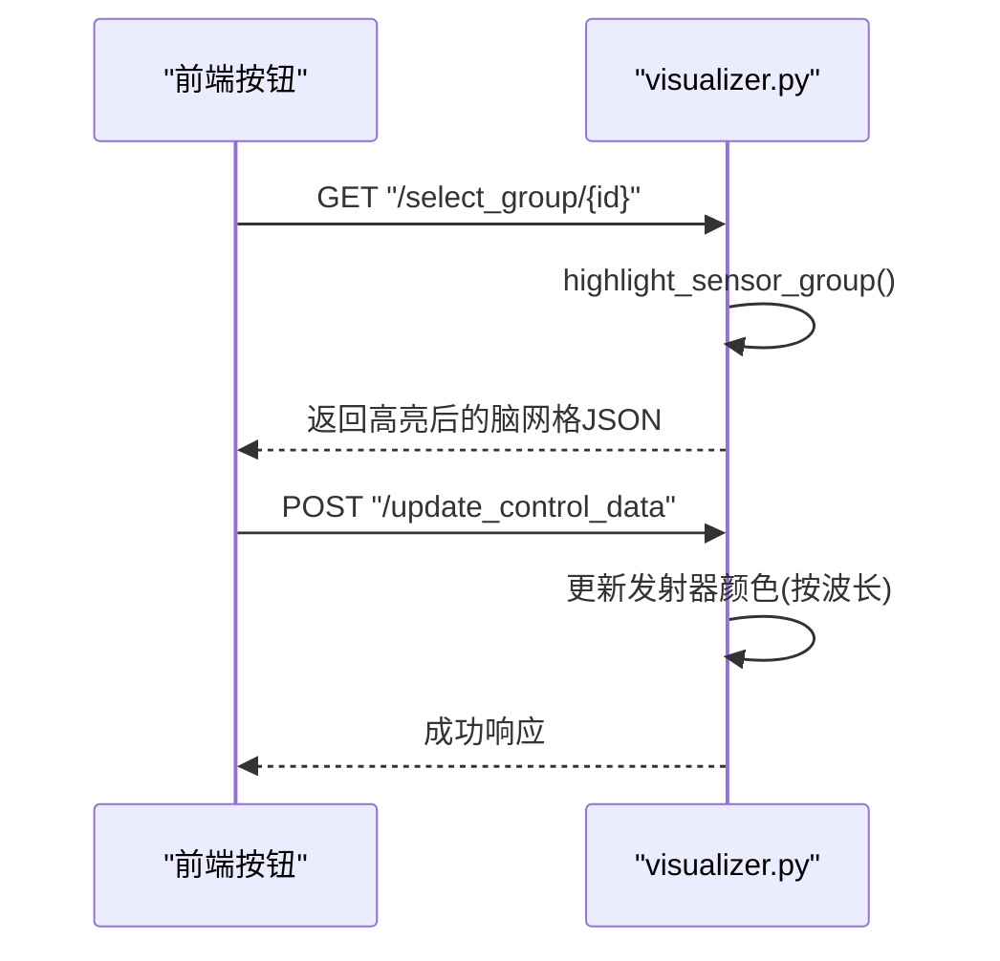
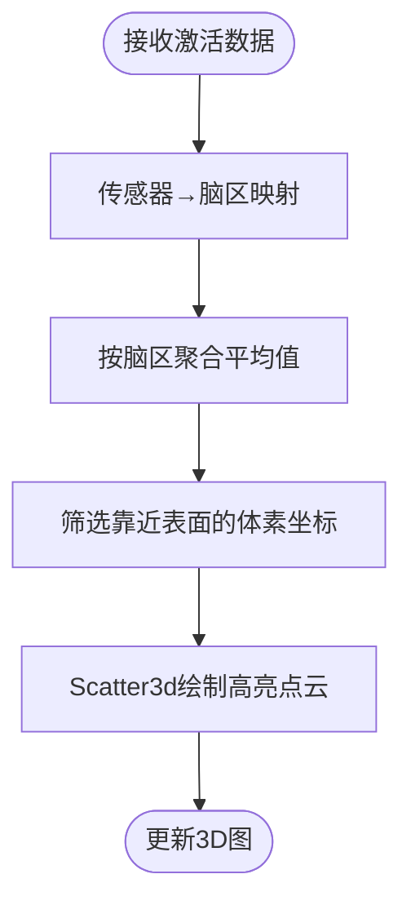
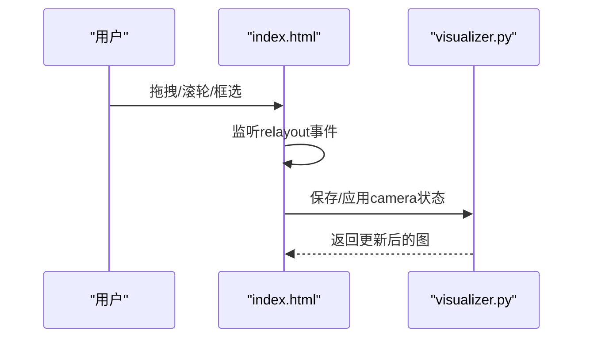
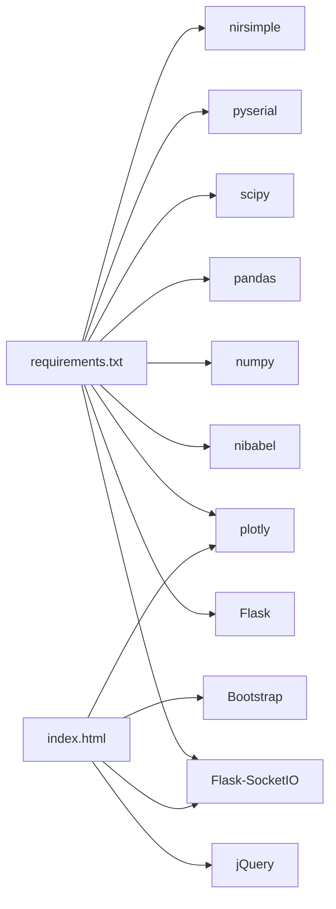

# 3D脑模型渲染

<cite>
**本文引用的文件**
- [index.html](file://software/index.html)
- [visualizer.py](file://software/visualizer.py)
- [nirs_viewer.py](file://software/nirs_viewer.py)
- [fNIRS_processing.py](file://software/fNIRS_processing.py)
- [config.py](file://software/config.py)
- [BrainMesh_Ch2_smoothed.nv](file://software/BrainMesh_Ch2_smoothed.nv)
- [aal.nii](file://software/aal.nii)
- [requirements.txt](file://software/requirements.txt)
- [adc_client.py](file://software/adc_client.py)
- [adc_live.py](file://software/adc_live.py)
</cite>

## 目录
1. [简介](#简介)
2. [项目结构](#项目结构)
3. [核心组件](#核心组件)
4. [架构总览](#架构总览)
5. [详细组件分析](#详细组件分析)
6. [依赖关系分析](#依赖关系分析)
7. [性能考虑](#性能考虑)
8. [故障排查指南](#故障排查指南)
9. [结论](#结论)
10. [附录](#附录)

## 简介
本文件面向3D脑模型渲染模块，聚焦以下目标：
- NIfTI格式脑图像的加载与处理，包括坐标系转换与空间配准
- 脑表面网格生成（基于预处理的脑网格文件）
- 传感器节点标注与高亮机制（发射器与探测器）
- 激活区域的颜色映射与透明度控制
- 渲染性能优化（LOD与视锥剔除思路）
- 交互式操作（旋转、缩放、平移）
- Plotly 3D图形创建与配置（Mesh3d与Scatter3d）

本模块以Web前端（Plotly）与后端（Flask + SocketIO + NIfTI/网格文件）协同工作，实现3D脑模型的可视化与交互。

## 项目结构
软件侧主要文件与职责概览：
- 前端页面与交互逻辑：index.html
- 3D渲染与数据处理：visualizer.py
- 辅助NIfTI/CSV加载工具：nirs_viewer.py
- fNIRS数据采集与处理管线：fNIRS_processing.py
- 串口配置：config.py
- 脑网格与模板：BrainMesh_Ch2_smoothed.nv、aal.nii
- 依赖声明：requirements.txt
- ADC实时可视化（桌面端）：adc_client.py、adc_live.py

**图表来源**
- [index.html](file://software/index.html#L1-L750)
- [visualizer.py](file://software/visualizer.py#L1-L944)
- [fNIRS_processing.py](file://software/fNIRS_processing.py#L1-L496)
- [config.py](file://software/config.py#L1-L13)
- [BrainMesh_Ch2_smoothed.nv](file://software/BrainMesh_Ch2_smoothed.nv#L1-L200)
- [aal.nii](file://software/aal.nii)

**章节来源**
- [index.html](file://software/index.html#L1-L750)
- [visualizer.py](file://software/visualizer.py#L1-L944)
- [requirements.txt](file://software/requirements.txt#L1-L15)

## 核心组件
- 3D脑网格与传感器节点渲染：基于Plotly的Mesh3d与Scatter3d
- 激活区域高亮：根据HbO/HbR激活值映射到脑区并以点云高亮
- 传感器组高亮：发射器与探测器连线与高亮
- 控制面板：发射器/探测器状态、MUX控制、模式切换
- 数据流：后端接收处理后的浓度数据，前端实时更新3D图

**章节来源**
- [visualizer.py](file://software/visualizer.py#L276-L536)
- [index.html](file://software/index.html#L307-L748)

## 架构总览
后端采用Flask + SocketIO，前端使用Plotly渲染3D场景。后端负责：
- 加载脑网格与模板（NIfTI/AAL）
- 计算顶点法向量、KD树
- 生成静态脑网格（Mesh3d）
- 根据激活数据更新高亮区域（Scatter3d）
- 响应前端请求（传感器组高亮、控制数据下发）

**图表来源**
- [index.html](file://software/index.html#L333-L338)
- [visualizer.py](file://software/visualizer.py#L589-L641)
- [visualizer.py](file://software/visualizer.py#L607-L614)
- [visualizer.py](file://software/visualizer.py#L80-L94)

## 详细组件分析

### NIfTI与坐标系转换、空间配准
- 模板加载：使用nibabel加载aal.nii，获取数据体与仿射矩阵
- 世界坐标到体素坐标的变换：通过仿射矩阵求逆进行坐标变换
- 传感器节点映射：将发射器/探测器世界坐标映射到模板体素，得到脑区ID
- 预筛选激活区域：对每个脑区，筛选靠近脑表面的体素坐标，作为高亮点集

**图表来源**
- [visualizer.py](file://software/visualizer.py#L189-L201)
- [visualizer.py](file://software/visualizer.py#L251-L266)
- [visualizer.py](file://software/visualizer.py#L420-L432)

**章节来源**
- [visualizer.py](file://software/visualizer.py#L189-L201)
- [visualizer.py](file://software/visualizer.py#L251-L266)
- [visualizer.py](file://software/visualizer.py#L420-L432)

### 脑表面网格生成（Monte Carlo与表面提取思路）
- 预处理网格：BrainMesh_Ch2_smoothed.nv包含顶点坐标与三角面索引
- 顶点法向量：遍历三角面，累加归一化法向量，用于传感器节点朝向
- KD树：构建顶点KD树，快速查询传感器节点最近网格点，使节点贴合表面
- 扁平圆柱帽：为发射器/探测器创建扁平圆柱体，旋转至法向并平移至节点位置

**图表来源**
- [visualizer.py](file://software/visualizer.py#L119-L133)
- [visualizer.py](file://software/visualizer.py#L135-L186)
- [visualizer.py](file://software/visualizer.py#L276-L350)

**章节来源**
- [visualizer.py](file://software/visualizer.py#L119-L133)
- [visualizer.py](file://software/visualizer.py#L135-L186)
- [visualizer.py](file://software/visualizer.py#L276-L350)
- [BrainMesh_Ch2_smoothed.nv](file://software/BrainMesh_Ch2_smoothed.nv#L1-L200)

### 传感器节点标注与高亮机制
- 传感器位置：内置8个发射器与16个探测器的世界坐标
- 节点高亮：根据当前选中传感器组，使用Scatter3d高亮发射器与探测器，并绘制连线
- 组映射：每个组包含1个发射器与2个探测器，映射到24个物理通道
- 颜色策略：发射器默认白色，探测器黑色；控制面板可按波长切换颜色

**图表来源**
- [visualizer.py](file://software/visualizer.py#L485-L536)
- [visualizer.py](file://software/visualizer.py#L626-L641)
- [index.html](file://software/index.html#L431-L484)

**章节来源**
- [visualizer.py](file://software/visualizer.py#L383-L404)
- [visualizer.py](file://software/visualizer.py#L485-L536)
- [index.html](file://software/index.html#L431-L484)

### 激活区域的着色策略与透明度控制
- 激活数据：上游处理后的HbO/HbR浓度变化，偶数索引为HbO
- 区域映射：根据传感器到脑区映射，将激活值聚合到对应脑区
- 高亮点云：对每个激活脑区，使用Scatter3d以小尺寸点云高亮，颜色为红色，透明度较低
- 动态更新：每次接收新数据包，移除旧高亮轨迹并添加新轨迹

**图表来源**
- [visualizer.py](file://software/visualizer.py#L438-L482)
- [visualizer.py](file://software/visualizer.py#L539-L557)

**章节来源**
- [visualizer.py](file://software/visualizer.py#L438-L482)
- [visualizer.py](file://software/visualizer.py#L539-L557)

### 渲染性能优化（LOD与视锥剔除）
- LOD建议：对脑网格可采用多级细节（LOD），根据相机距离动态切换三角面密度；当前实现为静态网格，可通过裁剪或降采样实现LOD
- 视锥剔除：在Web端可利用Plotly的相机视角与裁剪平面，减少不可见几何的绘制
- 点云优化：激活区域使用Scatter3d点云，建议按屏幕分辨率动态调整点大小与透明度，避免过度绘制

[本节为通用性能建议，不直接分析具体文件]

### 交互式操作（旋转、缩放、平移）
- 旋转/缩放/平移：Plotly 3D图默认支持鼠标拖拽旋转、滚轮缩放、框选平移
- 相机状态持久化：前端监听relayout事件，保存scene.camera并在更新后重应用
- 控制面板联动：发射器闪烁、颜色切换、模式切换均通过AJAX与SocketIO与后端交互

**图表来源**
- [index.html](file://software/index.html#L349-L363)
- [index.html](file://software/index.html#L476-L481)

**章节来源**
- [index.html](file://software/index.html#L349-L363)
- [index.html](file://software/index.html#L476-L481)

### Plotly 3D图形创建与配置（Mesh3d与Scatter3d）
- Mesh3d：用于绘制脑网格，设置颜色与透明度，禁用坐标轴刻度
- Scatter3d：用于高亮激活区域与传感器组（发射器/探测器/连线）
- 颜色与透明度：激活区域使用红色、低透明度；发射器默认白色、探测器黑色；控制面板可按波长切换发射器颜色
- 图形更新：使用Plotly.react与Plotly.restyle进行增量更新，避免全量重绘

**章节来源**
- [visualizer.py](file://software/visualizer.py#L284-L350)
- [visualizer.py](file://software/visualizer.py#L470-L481)
- [visualizer.py](file://software/visualizer.py#L504-L535)
- [index.html](file://software/index.html#L382-L428)

## 依赖关系分析
- Python依赖：Flask、Flask-SocketIO、nibabel、numpy、pandas、plotly、scipy、pyserial、nirsimple等
- 前端依赖：Plotly、jQuery、Bootstrap、Socket.IO
- 数据与模板：NIfTI模板（aal.nii）、脑网格文件（BrainMesh_Ch2_smoothed.nv）

**图表来源**
- [requirements.txt](file://software/requirements.txt#L1-L15)
- [index.html](file://software/index.html#L8-L12)

**章节来源**
- [requirements.txt](file://software/requirements.txt#L1-L15)
- [index.html](file://software/index.html#L8-L12)

## 性能考虑
- 数据更新频率：后端通过SocketIO推送增量更新，前端使用react/restyle避免全量重绘
- 点云密度控制：激活区域点云数量与透明度需平衡视觉效果与性能
- 网格复杂度：脑网格为静态，建议在服务端进行预处理（如LOD、裁剪），前端仅渲染可见部分
- 串口与处理：桌面端ADC可视化使用线程与定时器，避免阻塞UI

[本节提供通用指导，不直接分析具体文件]

## 故障排查指南
- 串口通信问题：检查config.py中的端口与波特率，确认设备已连接
- NIfTI/模板读取失败：确认aal.nii存在且路径正确
- 脑网格加载异常：确认BrainMesh_Ch2_smoothed.nv存在且格式正确
- 激活区域不显示：检查上游数据是否到达，确认传感器到脑区映射与过滤阈值合理
- 前端交互失效：检查Socket.IO连接状态与relayout事件绑定

**章节来源**
- [config.py](file://software/config.py#L7-L12)
- [visualizer.py](file://software/visualizer.py#L189-L201)
- [visualizer.py](file://software/visualizer.py#L589-L641)
- [index.html](file://software/index.html#L333-L338)

## 结论
本模块通过Plotly实现了3D脑模型的高效渲染与交互，结合NIfTI模板与预处理脑网格，完成传感器节点标注、激活区域高亮与控制面板联动。未来可在LOD与视锥剔除方面进一步优化渲染性能，并扩展更多交互与可视化策略。

## 附录
- fNIRS数据采集与处理：支持串口实时采集、数据包解析、模式块交错与MBLL处理
- 桌面端ADC可视化：提供PyQt5 + pyqtgraph的实时波形显示

**章节来源**
- [fNIRS_processing.py](file://software/fNIRS_processing.py#L159-L184)
- [fNIRS_processing.py](file://software/fNIRS_processing.py#L445-L496)
- [adc_client.py](file://software/adc_client.py#L1-L181)
- [adc_live.py](file://software/adc_live.py#L1-L220)