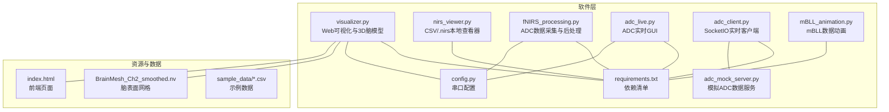
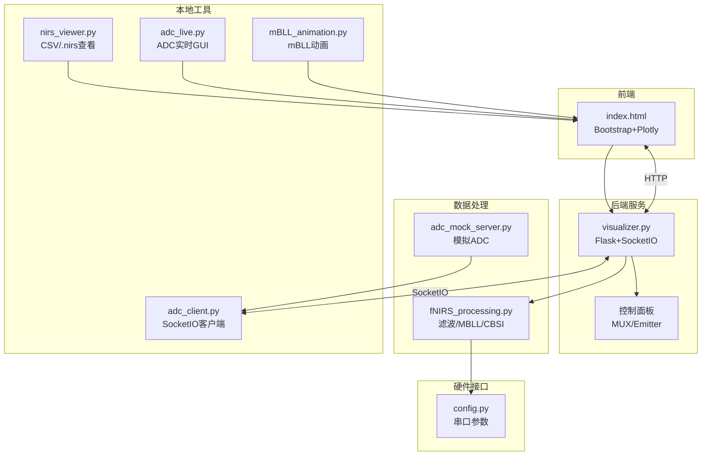
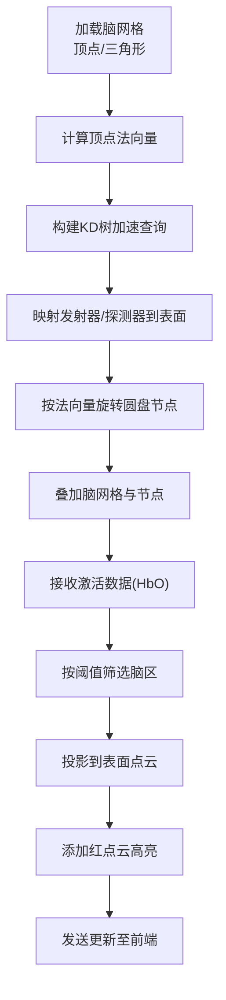
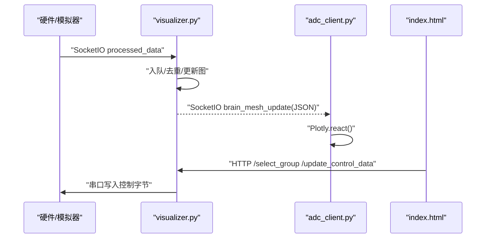
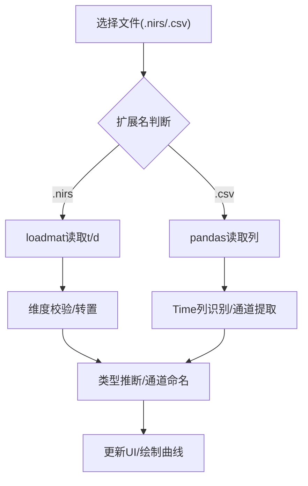
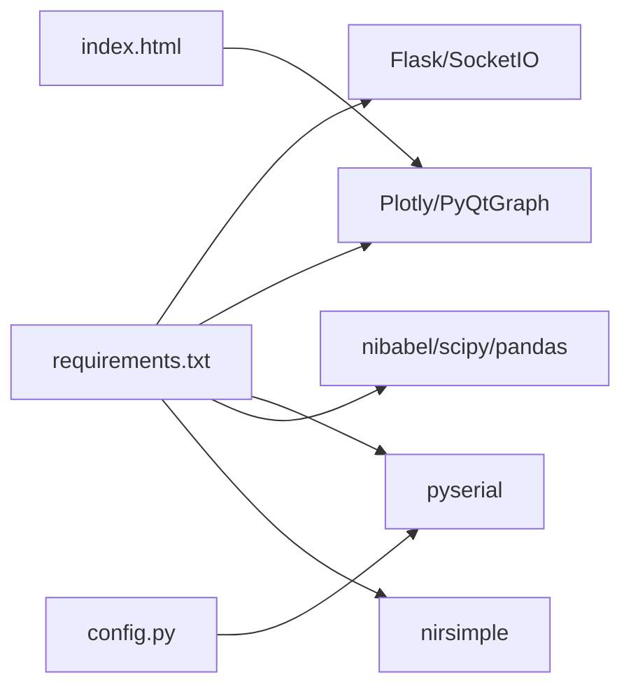

# 可视化系统

<cite>
**本文引用的文件**
- [nirs_viewer.py](file://software/nirs_viewer.py)
- [visualizer.py](file://software/visualizer.py)
- [fNIRS_processing.py](file://software/fNIRS_processing.py)
- [adc_live.py](file://software/adc_live.py)
- [config.py](file://software/config.py)
- [index.html](file://software/index.html)
- [requirements.txt](file://software/requirements.txt)
- [adc_client.py](file://software/adc_client.py)
- [adc_mock_server.py](file://software/adc_mock_server.py)
- [mBLL_animation.py](file://software/mBLL_animation.py)
- [plot.py](file://software/testing-scripts/plot.py)
- [plot_csv.py](file://software/testing-scripts/plot_csv.py)
- [fNIRS_processing_csv.py](file://software/testing-scripts/fNIRS_processing_csv.py)
- [BrainMesh_Ch2_smoothed.nv](file://software/BrainMesh_Ch2_smoothed.nv)
- [all_groups.csv](file://software/sample_data/all_groups.csv)
- [processed_output.csv](file://software/sample_data/processed_output.csv)
</cite>

## 目录
1. [简介](#简介)
2. [项目结构](#项目结构)
3. [核心组件](#核心组件)
4. [架构总览](#架构总览)
5. [详细组件分析](#详细组件分析)
6. [依赖关系分析](#依赖关系分析)
7. [性能考虑](#性能考虑)
8. [故障排查指南](#故障排查指南)
9. [结论](#结论)
10. [附录](#附录)

## 简介
本技术文档面向fNIRS可视化系统，围绕以下目标展开：  
- 3D脑模型渲染：NIfTI数据加载、脑表面网格生成与坐标变换  
- 实时数据可视化：数据接收、处理与图形更新的完整流程  
- 图表库使用：Plotly与PyQtGraph的选择、样式定制与交互实现  
- 动画系统：数据动画、状态指示与用户反馈机制  
- 静态图表与报告：CSV数据可视化与报告生成  
- 性能优化：内存管理与渲染效率提升  
- 用户界面设计与交互体验优化  

## 项目结构
该仓库采用“软件层”组织方式，核心可视化与数据处理逻辑集中在software目录，前端页面由HTML模板提供，配套测试脚本位于testing-scripts。

图示来源
- [visualizer.py](file://software/visualizer.py#L1-L120)
- [nirs_viewer.py](file://software/nirs_viewer.py#L1-L120)
- [fNIRS_processing.py](file://software/fNIRS_processing.py#L1-L40)
- [adc_live.py](file://software/adc_live.py#L1-L40)
- [adc_client.py](file://software/adc_client.py#L1-L40)
- [adc_mock_server.py](file://software/adc_mock_server.py#L1-L30)
- [mBLL_animation.py](file://software/mBLL_animation.py#L1-L40)
- [config.py](file://software/config.py#L1-L13)
- [requirements.txt](file://software/requirements.txt#L1-L15)
- [index.html](file://software/index.html#L1-L120)
- [BrainMesh_Ch2_smoothed.nv](file://software/BrainMesh_Ch2_smoothed.nv#L1-L40)
- [all_groups.csv](file://software/sample_data/all_groups.csv#L1-L2)
- [processed_output.csv](file://software/sample_data/processed_output.csv#L1-L2)

章节来源
- [requirements.txt](file://software/requirements.txt#L1-L15)
- [index.html](file://software/index.html#L1-L120)

## 核心组件
- Web可视化与3D脑模型渲染：基于Flask+SocketIO+Plotly，提供3D脑模型、传感器节点、激活区域高亮与交互控制
- 本地CSV/NIfTI查看器：PyQt5+pyqtgraph，支持NIfTI变量解析与CSV通道识别，动态绘制时间序列
- ADC数据采集与后处理：串口读取原始包，构建DataFrame，滤波、RMS、插值与MBLL/CBSI处理
- 实时GUI与客户端：PyQt5+pyqtgraph实时显示ADC；SocketIO客户端接收处理后的数据
- 前端页面：Bootstrap+Plotly，提供模式切换、控制面板、下载与静态图表查看
- 测试脚本：Plotly静态图表生成、CSV可视化、批处理流程验证

章节来源
- [visualizer.py](file://software/visualizer.py#L1-L120)
- [nirs_viewer.py](file://software/nirs_viewer.py#L1-L120)
- [fNIRS_processing.py](file://software/fNIRS_processing.py#L1-L120)
- [adc_live.py](file://software/adc_live.py#L1-L120)
- [adc_client.py](file://software/adc_client.py#L1-L120)
- [index.html](file://software/index.html#L1-L120)

## 架构总览
系统采用“前端页面—后端服务—数据处理—硬件/模拟器”的分层架构。前端通过HTTP与SocketIO与后端通信；后端负责3D脑模型渲染、传感器映射、激活区域高亮与控制下发；数据处理模块负责ADC采集、滤波与MBLL计算；实时GUI与客户端分别用于本地与远程可视化。

图示来源
- [visualizer.py](file://software/visualizer.py#L50-L120)
- [index.html](file://software/index.html#L1-L120)
- [fNIRS_processing.py](file://software/fNIRS_processing.py#L1-L40)
- [adc_mock_server.py](file://software/adc_mock_server.py#L1-L30)
- [config.py](file://software/config.py#L1-L13)
- [nirs_viewer.py](file://software/nirs_viewer.py#L1-L120)
- [adc_live.py](file://software/adc_live.py#L1-L120)
- [adc_client.py](file://software/adc_client.py#L1-L120)
- [mBLL_animation.py](file://software/mBLL_animation.py#L1-L120)

## 详细组件分析

### 3D脑模型渲染与坐标变换
- 脑表面网格加载：从文本文件读取顶点与三角面，构建Plotly 3D网格
- NIfTI坐标变换：加载AAL图谱，利用仿射矩阵将体素坐标转换为世界坐标，映射到脑区
- 传感器节点：发射器与探测器位置映射至脑表面，按法向量旋转以贴合表面
- 激活区域高亮：根据HbO浓度阈值，对特定脑区的表面点云进行红点云高亮
- 交互控制：前端通过SocketIO下发控制指令，后端更新脑模型并回传

图示来源
- [visualizer.py](file://software/visualizer.py#L191-L204)
- [visualizer.py](file://software/visualizer.py#L253-L269)
- [visualizer.py](file://software/visualizer.py#L278-L353)
- [visualizer.py](file://software/visualizer.py#L440-L484)
- [BrainMesh_Ch2_smoothed.nv](file://software/BrainMesh_Ch2_smoothed.nv#L1-L40)

章节来源
- [visualizer.py](file://software/visualizer.py#L191-L364)
- [BrainMesh_Ch2_smoothed.nv](file://software/BrainMesh_Ch2_smoothed.nv#L1-L40)

### 实时数据可视化流程（ADC/mBLL）
- 数据采集：串口读取64字节包，解析为8组×5字段（组ID、短/长1/长2、发射器状态）
- 数据接收：SocketIO服务端接收上游数据，入队并触发图形更新
- 图形更新：后端将激活数据映射到脑区，前端Plotly实时刷新
- 控制下发：前端控制面板通过HTTP POST下发控制数据，后端写入串口

图示来源
- [visualizer.py](file://software/visualizer.py#L82-L96)
- [visualizer.py](file://software/visualizer.py#L541-L560)
- [visualizer.py](file://software/visualizer.py#L609-L644)
- [adc_client.py](file://software/adc_client.py#L59-L78)
- [index.html](file://software/index.html#L592-L618)

章节来源
- [visualizer.py](file://software/visualizer.py#L82-L116)
- [adc_client.py](file://software/adc_client.py#L59-L86)
- [index.html](file://software/index.html#L592-L618)

### CSV与NIfTI数据加载与解析
- CSV解析：自动识别Time或Time (s)，其余列为通道；支持HbO/HbR/HbT后缀推断
- .nirs解析：读取t与d变量，自动转置以匹配时间维；解析MeasList推断类型与源-探测器配对
- 通道选择：列表控件支持全选/清空与动态绘图
- 本地查看器：PyQt5+pyqtgraph，网格布局展示8组×3通道

图示来源
- [nirs_viewer.py](file://software/nirs_viewer.py#L110-L138)
- [nirs_viewer.py](file://software/nirs_viewer.py#L150-L167)
- [nirs_viewer.py](file://software/nirs_viewer.py#L300-L346)

章节来源
- [nirs_viewer.py](file://software/nirs_viewer.py#L110-L167)
- [nirs_viewer.py](file://software/nirs_viewer.py#L300-L346)

### Plotly与PyQtGraph使用方法
- Plotly（Web端）：3D脑模型、静态图表生成、响应式布局、交互缩放/旋转
- PyQtGraph（桌面端）：实时曲线、多子图、定时器驱动更新、主题与样式定制
- 样式定制：颜色、线宽、背景/前景、图例、字体大小与布局间距
- 交互功能：相机视角持久化、按钮高亮、模式切换、下载与打开新窗口

章节来源
- [index.html](file://software/index.html#L13-L92)
- [visualizer.py](file://software/visualizer.py#L735-L800)
- [plot.py](file://software/testing-scripts/plot.py#L1-L105)
- [adc_live.py](file://software/adc_live.py#L80-L190)
- [mBLL_animation.py](file://software/mBLL_animation.py#L78-L139)

### 动画系统开发
- 数据动画：mBLL动画脚本逐行读取processed_output.csv，定时器驱动更新
- 状态指示：记录当前索引、停止条件与退出信号
- 用户反馈：全屏显示、定时器停止后退出应用

章节来源
- [mBLL_animation.py](file://software/mBLL_animation.py#L100-L139)

### 静态图表生成与报告
- 静态HTML：Plotly离线生成每个传感器组的图表，拼接为单页HTML
- 报告生成：前端提供“View Static Plot”入口，直接打开生成的HTML
- 下载CSV：支持ADC与mBLL两类数据下载

章节来源
- [visualizer.py](file://software/visualizer.py#L735-L800)
- [plot_csv.py](file://software/testing-scripts/plot_csv.py#L1-L192)
- [index.html](file://software/index.html#L725-L738)

### 数据处理与滤波（ADC/mBLL）
- 包解析：64字节固定格式，每组8字节，含短/长通道与发射器状态
- 滤波与预处理：阈值抑制、低通滤波、滑动窗口RMS、块交错、时间戳重采样
- MBLL/CBSI：OD变化计算、带通滤波、Modified Beer-Lambert Law与CBSI修正
- 输出：生成processed_output.csv，包含Time与各通道hbo/hbr

章节来源
- [fNIRS_processing.py](file://software/fNIRS_processing.py#L160-L186)
- [fNIRS_processing.py](file://software/fNIRS_processing.py#L51-L83)
- [fNIRS_processing.py](file://software/fNIRS_processing.py#L84-L127)
- [fNIRS_processing.py](file://software/fNIRS_processing.py#L340-L443)

## 依赖关系分析
- Python运行时与第三方库：Flask、Flask-SocketIO、Plotly、PyQt5/PyQtGraph、pyserial、nibabel、SciPy、Pandas、nirsimple等
- 前端依赖：Bootstrap、jQuery、Socket.IO、Plotly.js
- 串口配置：统一在config.py中定义端口、波特率与超时

图示来源
- [requirements.txt](file://software/requirements.txt#L1-L15)
- [config.py](file://software/config.py#L1-L13)
- [index.html](file://software/index.html#L8-L12)

章节来源
- [requirements.txt](file://software/requirements.txt#L1-L15)

## 性能考虑
- 内存管理
  - 使用队列限制历史数据长度，避免无限增长
  - 使用collections.deque与固定容量列表，降低内存占用
  - 后端使用Queue与锁保护共享数据，避免竞态
- 渲染效率
  - Plotly使用react/relayout减少重绘开销
  - PyQtGraph使用setData与定时器批量更新，避免频繁重建
  - 3D脑模型仅在需要时更新高亮点云，保留网格与节点缓存
- I/O与串口
  - 串口读取采用缓冲与分包解析，避免阻塞
  - 模拟服务使用后台任务与事件循环，保持低延迟
- 数据处理
  - 批量数组操作与向量化计算，减少Python循环
  - 滤波与重采样在必要时进行，避免重复计算

章节来源
- [visualizer.py](file://software/visualizer.py#L58-L61)
- [visualizer.py](file://software/visualizer.py#L88-L96)
- [adc_live.py](file://software/adc_live.py#L121-L190)
- [mBLL_animation.py](file://software/mBLL_animation.py#L41-L96)

## 故障排查指南
- 串口连接问题
  - 检查端口路径与权限；确认config.py中的SERIAL_PORT正确
  - 若无设备，使用adc_mock_server.py启动模拟服务
- 数据不显示或异常
  - 确认数据采集与处理流程是否正常启动
  - 检查SocketIO连接状态与processed_data事件
- 3D模型不更新
  - 检查后端是否收到最新激活数据并调用update_highlighted_regions
  - 前端是否正确接收brain_mesh_update并调用Plotly.react
- 前端交互失效
  - 检查浏览器控制台错误与网络请求状态
  - 确认Socket.IO版本与跨域设置

章节来源
- [config.py](file://software/config.py#L7-L13)
- [adc_mock_server.py](file://software/adc_mock_server.py#L1-L30)
- [visualizer.py](file://software/visualizer.py#L67-L96)
- [index.html](file://software/index.html#L333-L338)

## 结论
本系统通过Web与桌面双端结合，实现了从原始ADC数据到3D脑模型可视化的完整链路。后端以Flask+SocketIO为核心，前端以Plotly提供沉浸式交互体验；桌面端工具补充了本地查看与动画演示能力。通过合理的数据流设计、内存与渲染优化，系统在实时性与稳定性方面具备良好表现。

## 附录
- 示例数据占位：sample_data目录下CSV文件为占位符，需替换为实际数据以验证处理与可视化流程
- 测试脚本：plot.py与plot_csv.py可用于快速验证静态图表生成与对比分析

章节来源
- [all_groups.csv](file://software/sample_data/all_groups.csv#L1-L2)
- [processed_output.csv](file://software/sample_data/processed_output.csv#L1-L2)
- [plot.py](file://software/testing-scripts/plot.py#L1-L105)
- [plot_csv.py](file://software/testing-scripts/plot_csv.py#L1-L192)