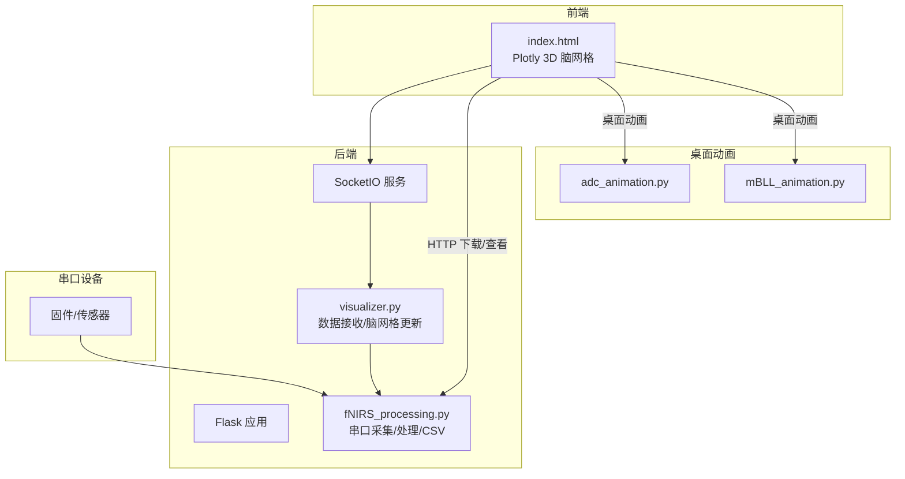
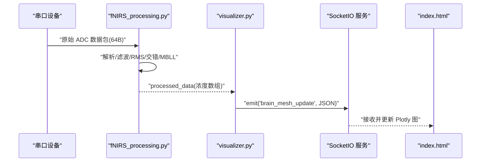
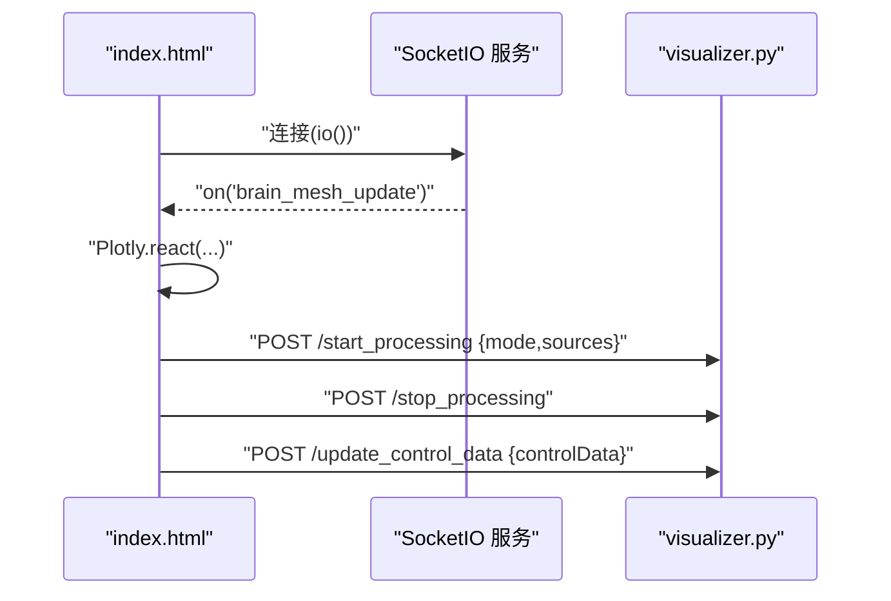
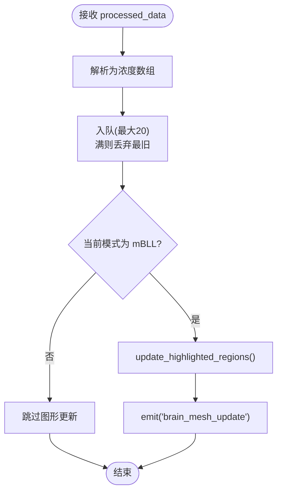
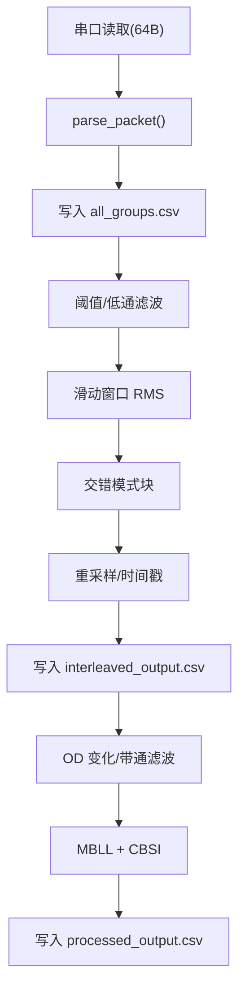
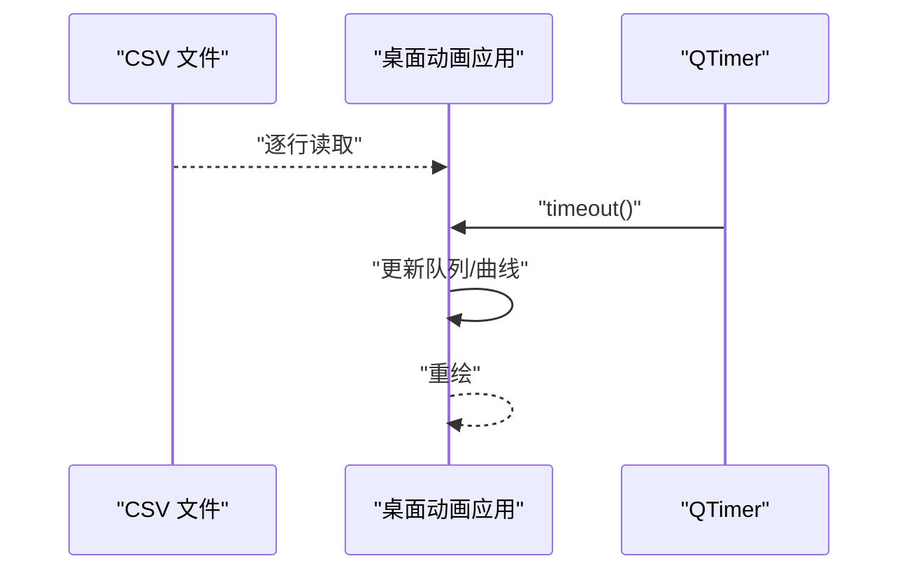
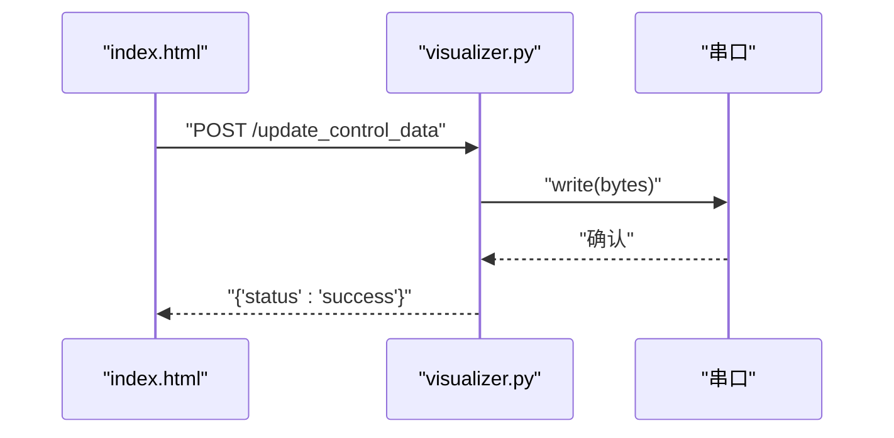
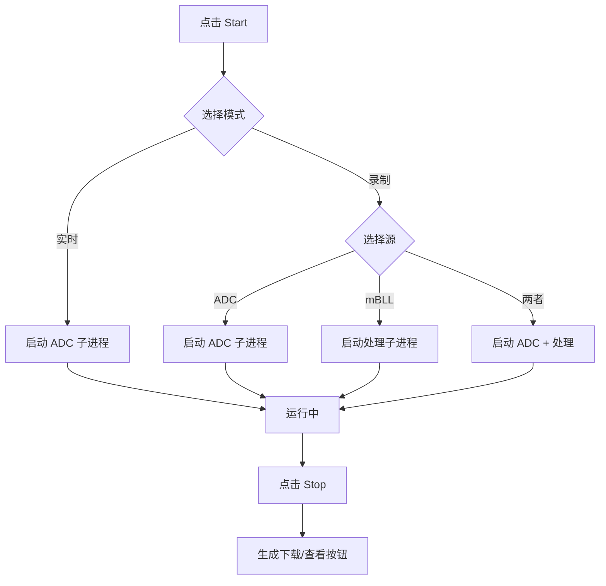
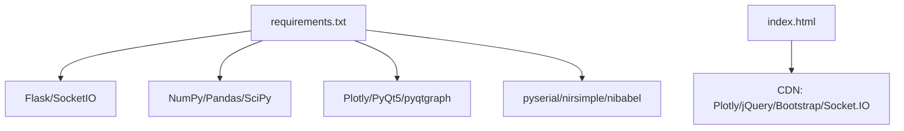

# 实时可视化

<cite>
**本文引用的文件**   
- [index.html](file://software/index.html)
- [visualizer.py](file://software/visualizer.py)
- [fNIRS_processing.py](file://software/fNIRS_processing.py)
- [adc_live.py](file://software/adc_live.py)
- [adc_client.py](file://software/adc_client.py)
- [adc_mock_server.py](file://software/adc_mock_server.py)
- [mBLL_animation.py](file://software/mBLL_animation.py)
- [adc_animation.py](file://software/adc_animation.py)
- [config.py](file://software/config.py)
- [requirements.txt](file://software/requirements.txt)
</cite>

## 目录
1. [简介](#简介)
2. [项目结构](#项目结构)
3. [核心组件](#核心组件)
4. [架构总览](#架构总览)
5. [详细组件分析](#详细组件分析)
6. [依赖分析](#依赖分析)
7. [性能考虑](#性能考虑)
8. [故障排查指南](#故障排查指南)
9. [结论](#结论)
10. [附录](#附录)

## 简介
本技术文档围绕实时可视化模块展开，聚焦以下目标：
- 实时数据流的接收与处理机制：包括 Socket.IO 连接管理、上游数据订阅、数据缓冲与队列策略。
- 图表更新实现：增量更新与全量刷新的权衡与适用场景。
- 动画系统与渲染优化：帧率控制、定时刷新与前端渲染策略。
- 多通道数据的并行处理与同步：8 组 × 3 通道的 ADC 数据与 8 组 × 6 通道的 mBLL 数据。
- 性能监控与调试：串口通信、数据包解析、滤波与降采样策略。
- 用户体验优化：延迟补偿与数据预取思路。
- 可视化模式切换与状态管理：实时模式与录制模式、源选择与下载。
- ADC 与 mBLL 数据的实时显示：数据格式转换、图形更新机制。

## 项目结构
软件侧主要由以下模块组成：
- Web 前端：基于 HTML/JS/Bootstrap/Plotly，负责交互控制与 3D 脑图渲染。
- 后端服务：Flask + SocketIO，负责接收上游数据、维护脑网格、响应前端请求、启动/停止数据处理流程。
- 数据处理链：串口采集、数据包解析、RMS/滤波/交错、MBLL 浓度计算与 CSV 输出。
- 桌面动画：PyQt5 + pyqtgraph，用于 ADC 与 mBLL 的桌面端实时/回放动画。
- 配置与依赖：串口参数、第三方库版本。

**图表来源**
- [index.html](file://software/index.html#L1-L750)
- [visualizer.py](file://software/visualizer.py#L1-L944)
- [fNIRS_processing.py](file://software/fNIRS_processing.py#L1-L496)
- [adc_animation.py](file://software/adc_animation.py#L1-L143)
- [mBLL_animation.py](file://software/mBLL_animation.py#L1-L140)

**章节来源**
- [index.html](file://software/index.html#L1-L750)
- [visualizer.py](file://software/visualizer.py#L1-L944)
- [fNIRS_processing.py](file://software/fNIRS_processing.py#L1-L496)
- [adc_animation.py](file://software/adc_animation.py#L1-L143)
- [mBLL_animation.py](file://software/mBLL_animation.py#L1-L140)

## 核心组件
- 前端交互与 3D 可视化
  - 通过 Socket.IO 接收后端推送的脑网格 JSON，使用 Plotly.react/relayout 更新视图。
  - 支持模式切换（实时/录制）、源选择（ADC/mBLL）、下载 CSV、查看静态/动画。
- 后端服务与数据接收
  - Flask + SocketIO，作为中间层接收上游 processed_data，维护全局数据队列，按需更新脑网格并通过事件推送。
- 数据处理流水线
  - 串口读取原始 ADC 包，解析为 8×5 结构，写入 CSV；随后进行 RMS、滤波、交错、MBLL 浓度计算，输出 processed_output.csv。
- 桌面动画
  - 使用 PyQt5 + pyqtgraph 实时/回放 ADC 与 mBLL 数据，支持全屏展示与定时刷新。

**章节来源**
- [index.html](file://software/index.html#L305-L747)
- [visualizer.py](file://software/visualizer.py#L50-L94)
- [fNIRS_processing.py](file://software/fNIRS_processing.py#L159-L495)
- [adc_animation.py](file://software/adc_animation.py#L1-L143)
- [mBLL_animation.py](file://software/mBLL_animation.py#L1-L140)

## 架构总览
整体数据流从固件/传感器经串口进入 fNIRS_processing.py，生成 CSV；visualizer.py 订阅上游 processed_data，更新脑网格并通过 SocketIO 推送至前端；前端使用 Plotly 渲染 3D 脑图与交互控件。

**图表来源**
- [fNIRS_processing.py](file://software/fNIRS_processing.py#L159-L495)
- [visualizer.py](file://software/visualizer.py#L80-L94)
- [index.html](file://software/index.html#L333-L338)

## 详细组件分析

### 前端：Socket.IO 连接与脑网格更新
- 连接与事件
  - 前端通过 Socket.IO 连接后端，监听 brain_mesh_update 事件，解析 JSON 并调用 Plotly.react/relayout 更新视图。
- 模式与源管理
  - 支持“实时读数(ADC)”和“录制与可视化(ADC 与/或 mBLL)”，启动/停止处理流程，录制完成后提供下载与静态/动画查看。
- 控制面板
  - MUX 与发射器控制状态通过 AJAX 提交，后端写入串口（非演示模式）；前端根据状态动态启用/禁用控件并更新发射器颜色。

**图表来源**
- [index.html](file://software/index.html#L333-L338)
- [index.html](file://software/index.html#L632-L723)
- [index.html](file://software/index.html#L492-L513)
- [visualizer.py](file://software/visualizer.py#L643-L708)

**章节来源**
- [index.html](file://software/index.html#L305-L747)
- [visualizer.py](file://software/visualizer.py#L643-L708)

### 后端：数据接收与脑网格更新
- 上游订阅
  - 使用 socketio.Client 订阅 processed_data 事件，解析为浓度数组，放入线程安全队列（最大容量 20）。
- 图形更新
  - 当收到新数据包时，按 HbO 值更新脑网格高亮区域，并通过 SocketIO 推送 JSON。
- 模式与源控制
  - /start_processing 根据模式启动子进程（演示模式下启动模拟 ADC 服务，真实模式下启动 adc_live.py）；/stop_processing 平滑停止并重初始化串口。
- 控制数据写入串口
  - /update_control_data 接收前端控制数据，打包为字节写入串口（演示模式跳过）。

**图表来源**
- [visualizer.py](file://software/visualizer.py#L80-L94)
- [visualizer.py](file://software/visualizer.py#L539-L558)

**章节来源**
- [visualizer.py](file://software/visualizer.py#L50-L94)
- [visualizer.py](file://software/visualizer.py#L539-L558)
- [visualizer.py](file://software/visualizer.py#L643-L708)
- [visualizer.py](file://software/visualizer.py#L626-L642)

### 数据处理流水线：ADC 到 mBLL
- 串口采集
  - 读取 64 字节数据包，解析为 8×5 矩阵（组 ID、Short、Long1、Long2、发射器状态），写入 all_groups.csv。
- RMS 与滤波
  - 按发射器状态切换分段计算 RMS，应用低通滤波与阈值抑制。
- 交错与时间重采样
  - 按模式块交错重排，生成 interleaved_output.csv，并分配固定时间步长。
- MBLL 浓度计算
  - OD 变化、带通滤波、MBLL 与 CBSI，输出 processed_output.csv。

**图表来源**
- [fNIRS_processing.py](file://software/fNIRS_processing.py#L159-L184)
- [fNIRS_processing.py](file://software/fNIRS_processing.py#L186-L233)
- [fNIRS_processing.py](file://software/fNIRS_processing.py#L439-L495)

**章节来源**
- [fNIRS_processing.py](file://software/fNIRS_processing.py#L159-L495)

### 桌面动画：ADC 与 mBLL
- ADC 动画
  - 从 CSV 逐行读取，按组与通道追加到双端队列，定时器驱动更新曲线。
- mBLL 动画
  - 读取 processed_output.csv，每组 6 条曲线（D1/D2/D3 的 HbO/HbR），定时器推进索引并更新。
- 实时 ADC
  - 串口线程持续解析数据包，主线程槽函数将数据追加到队列，定时刷新曲线。

**图表来源**
- [adc_animation.py](file://software/adc_animation.py#L105-L132)
- [mBLL_animation.py](file://software/mBLL_animation.py#L103-L133)

**章节来源**
- [adc_animation.py](file://software/adc_animation.py#L1-L143)
- [mBLL_animation.py](file://software/mBLL_animation.py#L1-L140)
- [adc_live.py](file://software/adc_live.py#L52-L86)

### 控制面板与串口通信
- 前端控制
  - MUX 与发射器状态通过 AJAX 提交，后端将控制字节写入串口（演示模式跳过）。
- 串口参数
  - 串口路径、波特率、超时在 config.py 中配置。

**图表来源**
- [index.html](file://software/index.html#L492-L513)
- [visualizer.py](file://software/visualizer.py#L626-L642)
- [config.py](file://software/config.py#L7-L12)

**章节来源**
- [index.html](file://software/index.html#L174-L206)
- [visualizer.py](file://software/visualizer.py#L626-L642)
- [config.py](file://software/config.py#L7-L12)

### 模式切换与状态管理
- 模式
  - 实时模式仅支持 ADC；录制模式可选择 ADC 与/或 mBLL。
- 源选择
  - 录制模式下勾选源，启动后端子进程；停止后提供下载与查看按钮。
- 状态持久化
  - 前端保存当前模式、所选源、当前分组、相机视角等状态，用于恢复渲染。

**图表来源**
- [index.html](file://software/index.html#L632-L723)
- [visualizer.py](file://software/visualizer.py#L643-L684)

**章节来源**
- [index.html](file://software/index.html#L265-L296)
- [visualizer.py](file://software/visualizer.py#L643-L708)

### ADC 与 mBLL 实时显示与数据格式
- ADC 实时
  - 串口数据包解析为 8×5，前端按组显示 Short/Long1/Long2 三条曲线；后端也可将处理后的浓度数组通过 SocketIO 推送。
- mBLL 实时
  - processed_data 事件携带 24 个浓度值（8 组 × 3 探测器 × 2 波长），后端将其映射到脑网格高亮区域。
- 数据格式转换
  - fNIRS_processing.py 将原始 ADC 转换为 OD 变化，再经 MBLL 与 CBSI 得到浓度变化，输出 processed_output.csv。

**章节来源**
- [fNIRS_processing.py](file://software/fNIRS_processing.py#L159-L495)
- [visualizer.py](file://software/visualizer.py#L80-L94)

## 依赖分析
- Python 依赖集中在 requirements.txt，涵盖 Flask、SocketIO、NumPy、Pandas、Plotly、PyQt5、pyqtgraph、pyserial、SciPy、nirsimple、nibabel 等。
- 前端依赖通过 CDN 引入 Plotly、jQuery、Bootstrap、Socket.IO 客户端。

**图表来源**
- [requirements.txt](file://software/requirements.txt#L1-L15)
- [index.html](file://software/index.html#L8-L12)

**章节来源**
- [requirements.txt](file://software/requirements.txt#L1-L15)

## 性能考虑
- 数据缓冲与队列
  - 后端使用固定容量队列（最大 20），满时丢弃最旧数据，避免内存膨胀；适合高频实时更新场景。
- 前端渲染
  - 使用 Plotly.react/relayout 进行增量更新，避免全量重建；相机状态持久化与恢复减少重绘成本。
- 串口与定时器
  - 串口读取线程采用缓冲与定时器刷新，降低系统调用开销；桌面动画定时器频率可调，平衡流畅度与 CPU 占用。
- 滤波与降采样
  - fNIRS_processing.py 对数据进行带通滤波与智能降采样，减少后续处理与传输压力。
- 多通道并行
  - 8 组 × 3/6 通道的分组绘制与队列管理，避免单点瓶颈；前端按组更新曲线，提升交互响应。

[本节为通用指导，无需特定文件引用]

## 故障排查指南
- 串口连接问题
  - 检查 config.py 中串口路径与波特率；确认设备已连接且无占用；必要时重启串口连接。
- Socket.IO 连接失败
  - 确认后端已启动；检查浏览器控制台网络面板；验证跨域配置与异步模式。
- 数据未更新
  - 确认后端已订阅到 processed_data；检查队列是否溢出导致丢包；查看前端控制台错误。
- 模式启动失败
  - 查看 /start_processing 返回状态；确认子进程是否成功启动；录制模式下检查 fNIRS_processing.py 是否正常运行。
- 下载与查看异常
  - 确认 CSV 文件是否存在；检查 /download 与 /view_static 路由返回内容；浏览器是否阻止弹窗。

**章节来源**
- [config.py](file://software/config.py#L7-L12)
- [visualizer.py](file://software/visualizer.py#L643-L708)
- [index.html](file://software/index.html#L711-L729)

## 结论
本实时可视化模块通过“前端交互 + 后端 SocketIO + 数据处理流水线”的架构，实现了从原始 ADC 到 mBLL 浓度的端到端可视化。后端以队列与增量更新保障实时性，前端以 Plotly 与定时器实现流畅渲染。通过模式切换、源选择与控制面板，系统兼顾了灵活性与易用性。建议在生产环境中进一步引入指标监控、异常告警与更精细的帧率控制策略，以提升稳定性与用户体验。

[本节为总结，无需特定文件引用]

## 附录
- 演示模式
  - 启动演示模式时，后端通过子进程启动 adc_mock_server.py 与 adc_client.py，模拟上游数据流，便于无硬件环境下的联调与测试。
- 数据文件
  - all_groups.csv：原始 ADC 数据（录制模式）。
  - processed_output.csv：经 MBLL 处理后的浓度变化数据（录制/实时模式均可使用）。
- 常用命令
  - 启动后端：python visualizer.py [demo]
  - 启动演示 ADC 服务：python adc_mock_server.py
  - 启动桌面 ADC 动画：python adc_animation.py [demo]
  - 启动桌面 mBLL 动画：python mBLL_animation.py [demo]

**章节来源**
- [visualizer.py](file://software/visualizer.py#L32-L42)
- [adc_mock_server.py](file://software/adc_mock_server.py#L1-L65)
- [adc_animation.py](file://software/adc_animation.py#L1-L143)
- [mBLL_animation.py](file://software/mBLL_animation.py#L1-L140)