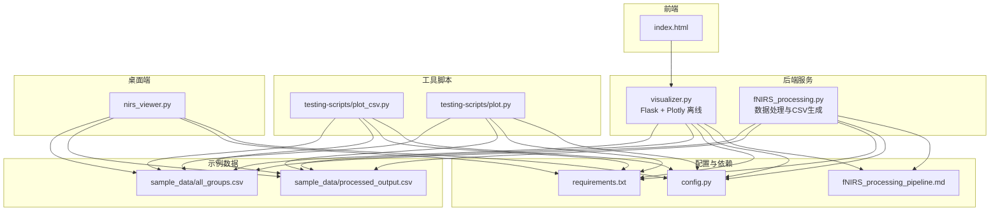
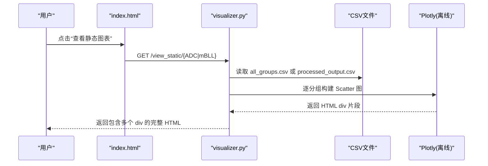
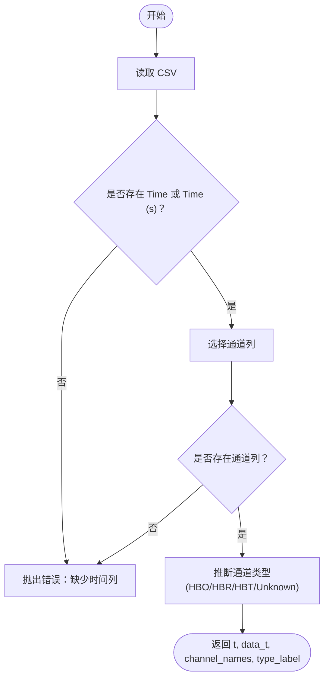
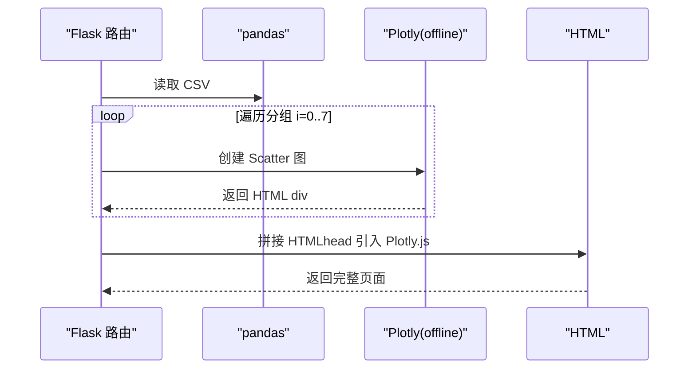
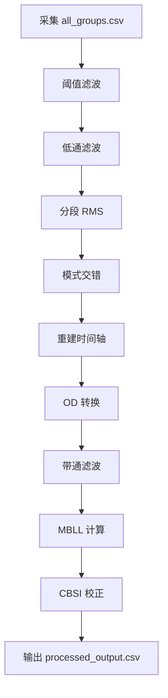
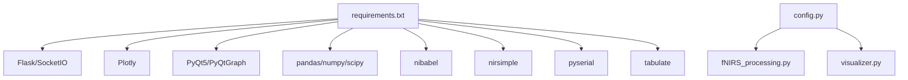

# 静态可视化

<cite>
**本文引用的文件**
- [visualizer.py](file://software/visualizer.py)
- [fNIRS_processing.py](file://software/fNIRS_processing.py)
- [plot_csv.py](file://software/testing-scripts/plot_csv.py)
- [plot.py](file://software/testing-scripts/plot.py)
- [nirs_viewer.py](file://software/nirs_viewer.py)
- [index.html](file://software/index.html)
- [config.py](file://software/config.py)
- [requirements.txt](file://software/requirements.txt)
- [fNIRS_processing_pipeline.md](file://software/fNIRS_processing_pipeline.md)
- [all_groups.csv](file://software/sample_data/all_groups.csv)
- [processed_output.csv](file://software/sample_data/processed_output.csv)
</cite>

## 目录
1. [简介](#简介)
2. [项目结构](#项目结构)
3. [核心组件](#核心组件)
4. [架构总览](#架构总览)
5. [详细组件分析](#详细组件分析)
6. [依赖分析](#依赖分析)
7. [性能考虑](#性能考虑)
8. [故障排除指南](#故障排除指南)
9. [结论](#结论)
10. [附录](#附录)

## 简介
本技术文档聚焦于静态可视化模块，涵盖以下能力：
- CSV 数据加载与解析：支持 Time/Time (s) 时间列、通道列自动识别、类型标注与缺失值处理策略。
- 静态图表生成：基于 Plotly 的离线 HTML 生成，包含 ADC 与 mBLL 数据的多分组图表。
- 批量数据处理与报表生成：从原始 ADC 数据到处理后 CSV 的完整流水线，含模板化输出。
- 图表导出：通过离线模式生成可嵌入的 HTML，便于 PNG/PDF 导出（依赖浏览器或工具链）。
- 统计与分析：提供基础统计量与趋势分析的实现思路与接口。
- 用户自定义：主题与参数配置（颜色、布局、滤波参数等）。
- Plotly 离线模式：HTML 文件生成与嵌入式图表创建。

## 项目结构
静态可视化相关代码主要分布在以下文件：
- Web 服务与静态图表路由：visualizer.py
- 数据处理与 CSV 生成：fNIRS_processing.py
- 离线脚本与示例：testing-scripts/plot_csv.py、testing-scripts/plot.py
- 桌面端 CSV 可视化：nirs_viewer.py
- 前端页面与交互：index.html
- 配置与依赖：config.py、requirements.txt
- 流水线说明：fNIRS_processing_pipeline.md
- 示例数据：sample_data/*.csv

**图表来源**
- [visualizer.py](file://software/visualizer.py#L589-L800)
- [fNIRS_processing.py](file://software/fNIRS_processing.py#L445-L496)
- [plot_csv.py](file://software/testing-scripts/plot_csv.py#L1-L192)
- [plot.py](file://software/testing-scripts/plot.py#L1-L105)
- [nirs_viewer.py](file://software/nirs_viewer.py#L150-L183)
- [index.html](file://software/index.html#L1-L200)
- [config.py](file://software/config.py#L1-L13)
- [requirements.txt](file://software/requirements.txt#L1-L15)
- [fNIRS_processing_pipeline.md](file://software/fNIRS_processing_pipeline.md#L1-L552)
- [all_groups.csv](file://software/sample_data/all_groups.csv#L1-L2)
- [processed_output.csv](file://software/sample_data/processed_output.csv#L1-L2)

**章节来源**
- [visualizer.py](file://software/visualizer.py#L589-L800)
- [fNIRS_processing.py](file://software/fNIRS_processing.py#L445-L496)
- [plot_csv.py](file://software/testing-scripts/plot_csv.py#L1-L192)
- [plot.py](file://software/testing-scripts/plot.py#L1-L105)
- [nirs_viewer.py](file://software/nirs_viewer.py#L150-L183)
- [index.html](file://software/index.html#L1-L200)
- [config.py](file://software/config.py#L1-L13)
- [requirements.txt](file://software/requirements.txt#L1-L15)
- [fNIRS_processing_pipeline.md](file://software/fNIRS_processing_pipeline.md#L1-L552)
- [all_groups.csv](file://software/sample_data/all_groups.csv#L1-L2)
- [processed_output.csv](file://software/sample_data/processed_output.csv#L1-L2)

## 核心组件
- 静态图表服务（Flask + Plotly 离线）
  - 路由：/view_static/ADC 与 /view_static/mBLL
  - 功能：读取 CSV，逐分组构建折线图，生成包含多个 HTML div 的完整页面，仅在 head 引入一次 Plotly.js。
- 数据处理流水线
  - 采集：串口读取 64 字节帧，解析为 8×5 的传感器数组，写入 all_groups.csv。
  - 预处理：阈值滤波、低通滤波、分段 RMS、模式交错、重建时间轴。
  - 后处理：OD 转换、带通滤波、MBLL 计算 HbO/HbR、CBSI 校正，输出 processed_output.csv。
- 离线脚本
  - plot_csv.py：生成 ADC 与 mBLL 的静态 HTML，使用 Plotly offline 模式。
  - plot.py：使用 PyQtGraph 生成本地图表（对比参考）。
- 桌面端 CSV 可视化
  - nirs_viewer.py：支持 .nirs 与 .csv，自动识别时间列与通道类型，提供交互式曲线绘制。
- 前端页面
  - index.html：提供模式选择、按钮组、下载与查看静态图表的入口。

**章节来源**
- [visualizer.py](file://software/visualizer.py#L732-L800)
- [fNIRS_processing.py](file://software/fNIRS_processing.py#L159-L496)
- [plot_csv.py](file://software/testing-scripts/plot_csv.py#L17-L192)
- [plot.py](file://software/testing-scripts/plot.py#L1-L105)
- [nirs_viewer.py](file://software/nirs_viewer.py#L150-L183)
- [index.html](file://software/index.html#L640-L750)

## 架构总览
静态可视化采用“数据处理 + 离线渲染”的双阶段架构：
- 数据阶段：采集原始 ADC 帧 → all_groups.csv → interleaved_output.csv → processed_output.csv。
- 渲染阶段：Web 服务或离线脚本读取 CSV → 构建 Plotly 图 → 生成 HTML。

**图表来源**
- [visualizer.py](file://software/visualizer.py#L732-L800)
- [index.html](file://software/index.html#L735-L738)

**章节来源**
- [visualizer.py](file://software/visualizer.py#L732-L800)
- [index.html](file://software/index.html#L735-L738)

## 详细组件分析

### CSV 数据加载与解析
- 时间列识别：优先 Time (s)，其次 Time，否则抛错。
- 通道列：除时间列外均为通道列，至少存在一条通道。
- 类型标注：根据列名后缀推断 HbO/HbR/HbT，未知则标记 Unknown。
- 缺失值处理：在数据处理阶段通过阈值滤波与分段 RMS 填充，保证后续分析可用性。

**图表来源**
- [nirs_viewer.py](file://software/nirs_viewer.py#L150-L183)

**章节来源**
- [nirs_viewer.py](file://software/nirs_viewer.py#L150-L183)

### 静态图表生成（Plotly 离线）
- ADC 静态图：遍历 8 个分组，分别为 Short/Long1/Long2 三条曲线，布局包含标题、坐标轴标题、边距与响应式配置。
- mBLL 静态图：遍历 8 个分组，分别为 D1/D2/D3 的 hbo/hbr 两条曲线，布局同上。
- HTML 生成：每个分组图生成一个 HTML div，仅在 head 引入一次 Plotly.js，减少体积与重复加载。

**图表来源**
- [visualizer.py](file://software/visualizer.py#L732-L800)

**章节来源**
- [visualizer.py](file://software/visualizer.py#L732-L800)

### 批量数据处理与报表生成
- 采集与解析：parse_packet 解析 64 字节帧，构造 8×5 的数组（组ID、三路测量、发射器状态）。
- 预处理：阈值滤波抑制异常值；低通滤波去除高频噪声；分段 RMS 基于发射器状态切段；模式交错将 mode1/mode2 块交错；重建时间轴并四舍五入。
- 后处理：OD 转换、smart_bandpass 带通滤波、MBLL 计算 HbO/HbR、CBSI 校正，输出 processed_output.csv。
- 模板化输出：按时间点逐行写入 CSV，列名形如 ChannelType_hbo/hbr。

**图表来源**
- [fNIRS_processing.py](file://software/fNIRS_processing.py#L159-L496)
- [fNIRS_processing_pipeline.md](file://software/fNIRS_processing_pipeline.md#L1-L552)

**章节来源**
- [fNIRS_processing.py](file://software/fNIRS_processing.py#L159-L496)
- [fNIRS_processing_pipeline.md](file://software/fNIRS_processing_pipeline.md#L1-L552)

### 图表导出（PNG/PDF）
- 离线 HTML：通过 Plotly offline 模式生成包含图表的 HTML，可在浏览器中另存为 PDF。
- PNG 导出：可通过浏览器打印功能或第三方工具（如 weasyprint、wkhtmltopdf）将 HTML 转换为 PNG/PDF。
- 注意：本仓库未内置专用导出 API，推荐结合浏览器或工具链完成导出。

**章节来源**
- [visualizer.py](file://software/visualizer.py#L732-L800)
- [plot_csv.py](file://software/testing-scripts/plot_csv.py#L178-L192)

### 数据统计与分析（实现思路）
- 基本统计量：可基于 pandas 的 describe、mean、std、min/max 等方法快速生成摘要统计。
- 趋势分析：使用移动平均、线性拟合或频域分析（FFT）识别周期性与趋势。
- 通道对比：按组聚合，计算均值/标准差，绘制箱线图或小提琴图辅助判断一致性。
- 注意：上述为通用实现思路，具体接口可根据业务需求扩展。

[本节为概念性说明，无需代码引用]

### 用户自定义选项（主题与参数）
- 主题与样式：通过 Plotly layout（标题、坐标轴、边距、响应式）与 CSS 控制整体风格。
- 参数设置：滤波参数（低通截止频率、带通范围）、RMS 分段策略、时间轴步长等均可在处理脚本中调整。
- 颜色与图例：可为不同曲线设置颜色，或使用默认调色板；图例位置与字体大小可配置。

**章节来源**
- [visualizer.py](file://software/visualizer.py#L766-L780)
- [fNIRS_processing.py](file://software/fNIRS_processing.py#L51-L82)
- [fNIRS_processing.py](file://software/fNIRS_processing.py#L128-L157)

### Plotly 离线模式使用
- offline.plot：生成 HTML div，include_plotlyjs=False 避免重复引入库。
- HTML 模板：在 head 引入 Plotly.js，在 body 拼接多个 div。
- 适用场景：无需网络即可展示图表，适合报表与归档。

**章节来源**
- [visualizer.py](file://software/visualizer.py#L774-L780)
- [plot_csv.py](file://software/testing-scripts/plot_csv.py#L58-L87)

## 依赖分析
- Python 包：Flask、Flask-SocketIO、Plotly、PyQt5/PyQtGraph、pandas、numpy、scipy、nibabel、nirsimple、pyserial、python-socketio、tabulate。
- 串口配置：SERIAL_PORT、BAUD_RATE、TIMEOUT 由 config.py 提供。
- 前端依赖：index.html 直接引入 CDN 的 Plotly.js 与 jQuery。

**图表来源**
- [requirements.txt](file://software/requirements.txt#L1-L15)
- [config.py](file://software/config.py#L1-L13)

**章节来源**
- [requirements.txt](file://software/requirements.txt#L1-L15)
- [config.py](file://software/config.py#L1-L13)

## 性能考虑
- 数据规模：CSV 读取与绘图在大数据量时可能成为瓶颈，建议分页或抽样显示。
- 滤波与变换：带通滤波与 FFT 等操作复杂度较高，可考虑并行化或降采样。
- HTML 体积：合并多个 div 时注意 head 中仅引入一次 Plotly.js，避免重复加载。
- I/O：CSV 写入应使用缓冲与批量写入，减少磁盘压力。

[本节为通用指导，无需代码引用]

## 故障排除指南
- 缺少时间列：CSV 必须包含 Time 或 Time (s) 列，否则加载失败。
- 通道列为空：CSV 至少包含一条通道列，否则无法生成图表。
- 串口通信：检查 SERIAL_PORT、BAUD_RATE、TIMEOUT 设置，确认设备连接与权限。
- 处理后 CSV 为空：检查 all_groups.csv 是否有效，确认 mode1/mode2 成对，以及时间戳重建逻辑。
- 导出问题：离线 HTML 需要在浏览器中另存为 PDF；如需 PNG，可借助工具链转换。

**章节来源**
- [nirs_viewer.py](file://software/nirs_viewer.py#L157-L163)
- [fNIRS_processing.py](file://software/fNIRS_processing.py#L548-L552)
- [config.py](file://software/config.py#L7-L13)

## 结论
静态可视化模块通过“数据处理 + 离线渲染”的方式，实现了从原始 ADC 到可导出 HTML 的完整链路。其优势在于：
- 离线模式稳定可靠，适合报表与归档；
- 多分组图表清晰展示多通道趋势；
- 参数化处理便于定制与扩展；
- 与前端页面无缝集成，支持一键下载与查看。

## 附录
- 示例数据：sample_data/all_groups.csv 与 processed_output.csv 作为演示数据，实际使用时请替换为真实数据。
- 文档与流水线：fNIRS_processing_pipeline.md 提供了完整的处理步骤与参数说明，便于二次开发与调试。

**章节来源**
- [all_groups.csv](file://software/sample_data/all_groups.csv#L1-L2)
- [processed_output.csv](file://software/sample_data/processed_output.csv#L1-L2)
- [fNIRS_processing_pipeline.md](file://software/fNIRS_processing_pipeline.md#L1-L552)