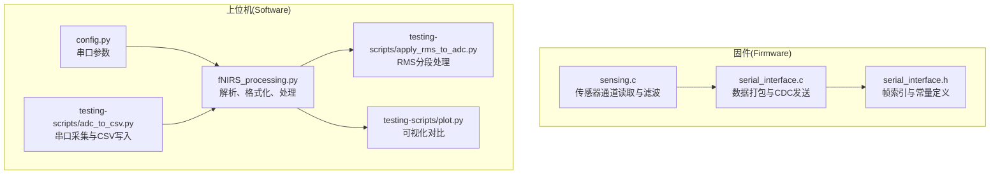
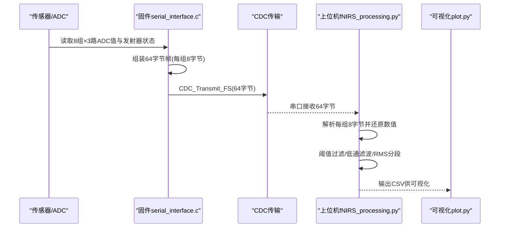
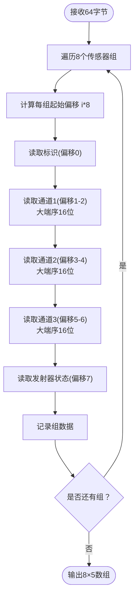
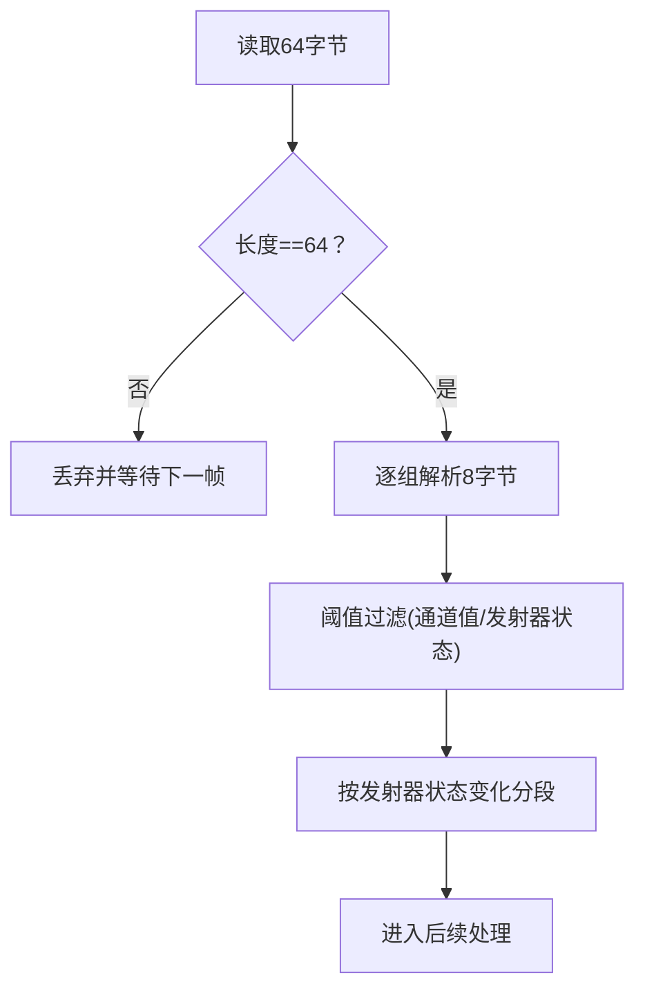
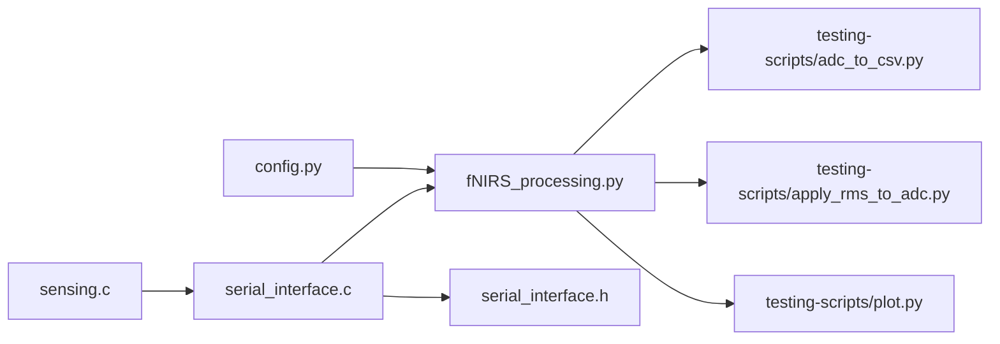

# ADC数据解析

<cite>
**本文引用的文件**
- [软件/fNIRS_processing.py](file://software/fNIRS_processing.py)
- [软件/testing-scripts/adc_to_csv.py](file://software/testing-scripts/adc_to_csv.py)
- [软件/config.py](file://software/config.py)
- [固件/STM32/fNIRS/Core/Src/serial_interface.c](file://firmware/STM32/fNIRS/Core/Src/serial_interface.c)
- [固件/STM32/fNIRS/Core/Inc/serial_interface.h](file://firmware/STM32/fNIRS/Core/Inc/serial_interface.h)
- [固件/STM32/fNIRS/Core/Src/sensing.c](file://firmware/STM32/fNIRS/Core/Src/sensing.c)
- [固件/STM32/fNIRS/Core/Inc/sensing.h](file://firmware/STM32/fNIRS/Core/Inc/sensing.h)
- [软件/testing-scripts/plot.py](file://software/testing-scripts/plot.py)
- [软件/testing-scripts/apply_rms_to_adc.py](file://software/testing-scripts/apply_rms_to_adc.py)
</cite>

## 目录
1. [引言](#引言)
2. [项目结构](#项目结构)
3. [核心组件](#核心组件)
4. [架构总览](#架构总览)
5. [详细组件分析](#详细组件分析)
6. [依赖关系分析](#依赖关系分析)
7. [性能考量](#性能考量)
8. [故障排查指南](#故障排查指南)
9. [结论](#结论)
10. [附录](#附录)

## 引言
本技术文档聚焦于ADC（模数转换器）数据解析模块，系统阐述从底层固件采集到上位机解析与后处理的完整流程。重点包括：
- 原始ADC数据包结构与64字节帧组织方式
- 每个传感器组的8字节编码规则（标识、三路传感器通道、发射器状态）
- 字节提取、数值转换与数据类型处理
- 数据验证与完整性检查机制（基于帧长度与字段范围）
- 数据格式化与标准化（阈值过滤、低通滤波、RMS分段统计）
- 数据质量评估与异常处理策略
- 实际代码示例与测试用例路径

## 项目结构
ADC数据解析涉及软硬件协同：固件侧负责采集、打包并通过USB CDC发送；上位机侧负责接收、解析、格式化与可视化。

图表来源
- [固件/STM32/fNIRS/Core/Src/sensing.c](file://firmware/STM32/fNIRS/Core/Src/sensing.c#L73-L84)
- [固件/STM32/fNIRS/Core/Src/serial_interface.c](file://firmware/STM32/fNIRS/Core/Src/serial_interface.c#L59-L81)
- [固件/STM32/fNIRS/Core/Inc/serial_interface.h](file://firmware/STM32/fNIRS/Core/Inc/serial_interface.h#L26-L38)
- [软件/fNIRS_processing.py](file://software/fNIRS_processing.py#L160-L185)
- [软件/testing-scripts/adc_to_csv.py](file://software/testing-scripts/adc_to_csv.py#L16-L37)
- [软件/testing-scripts/apply_rms_to_adc.py](file://software/testing-scripts/apply_rms_to_adc.py#L45-L63)
- [软件/testing-scripts/plot.py](file://software/testing-scripts/plot.py#L12-L21)

章节来源
- [固件/STM32/fNIRS/Core/Src/serial_interface.c](file://firmware/STM32/fNIRS/Core/Src/serial_interface.c#L59-L81)
- [固件/STM32/fNIRS/Core/Inc/serial_interface.h](file://firmware/STM32/fNIRS/Core/Inc/serial_interface.h#L26-L38)
- [软件/fNIRS_processing.py](file://software/fNIRS_processing.py#L160-L185)
- [软件/testing-scripts/adc_to_csv.py](file://software/testing-scripts/adc_to_csv.py#L16-L37)
- [软件/testing-scripts/apply_rms_to_adc.py](file://software/testing-scripts/apply_rms_to_adc.py#L45-L63)
- [软件/testing-scripts/plot.py](file://software/testing-scripts/plot.py#L12-L21)

## 核心组件
- 固件侧打包器：将8个传感器模块的三路ADC值与发射器状态打包为64字节帧，通过CDC发送。
- 上位机解析器：从串口读取64字节，按每组8字节解析，进行数值还原与格式化。
- 数据预处理管线：阈值过滤、低通滤波、RMS分段统计、模式块交错等。
- 可视化脚本：对比原始ADC与后处理结果。

章节来源
- [固件/STM32/fNIRS/Core/Src/serial_interface.c](file://firmware/STM32/fNIRS/Core/Src/serial_interface.c#L59-L81)
- [软件/fNIRS_processing.py](file://software/fNIRS_processing.py#L160-L185)
- [软件/testing-scripts/apply_rms_to_adc.py](file://software/testing-scripts/apply_rms_to_adc.py#L45-L63)
- [软件/testing-scripts/plot.py](file://software/testing-scripts/plot.py#L44-L72)

## 架构总览
下图展示从传感器到上位机解析与可视化的端到端流程。

图表来源
- [固件/STM32/fNIRS/Core/Src/serial_interface.c](file://firmware/STM32/fNIRS/Core/Src/serial_interface.c#L59-L81)
- [软件/fNIRS_processing.py](file://software/fNIRS_processing.py#L160-L185)
- [软件/testing-scripts/plot.py](file://software/testing-scripts/plot.py#L12-L21)

## 详细组件分析

### 1) 原始ADC数据包结构与编码规则
- 帧长度：64字节
- 分组方式：每8字节为一组，共8组，分别对应8个传感器模块
- 每组字段（偏移与含义）：
  - 偏移0：包标识（高6位保留，低2位为模块号）
  - 偏移1-2：通道1高/低字节（大端序16位整型）
  - 偏移3-4：通道2高/低字节（大端序16位整型）
  - 偏移5-6：通道3高/低字节（大端序16位整型）
  - 偏移7：发射器状态（bit1=940nm，bit0=660nm）

图表来源
- [固件/STM32/fNIRS/Core/Inc/serial_interface.h](file://firmware/STM32/fNIRS/Core/Inc/serial_interface.h#L26-L38)
- [固件/STM32/fNIRS/Core/Src/serial_interface.c](file://firmware/STM32/fNIRS/Core/Src/serial_interface.c#L70-L77)
- [软件/fNIRS_processing.py](file://software/fNIRS_processing.py#L160-L185)

章节来源
- [固件/STM32/fNIRS/Core/Inc/serial_interface.h](file://firmware/STM32/fNIRS/Core/Inc/serial_interface.h#L26-L38)
- [固件/STM32/fNIRS/Core/Src/serial_interface.c](file://firmware/STM32/fNIRS/Core/Src/serial_interface.c#L59-L81)
- [软件/fNIRS_processing.py](file://software/fNIRS_processing.py#L160-L185)

### 2) 字节提取、数值转换与数据类型处理
- 字节序：通道值采用大端序（网络字节序），使用结构化解包函数还原为16位无符号整型
- 数值还原：通道值为16位，范围通常为0–65535；部分上位机逻辑中存在“反转变换”以适配显示或后续处理
- 类型处理：解析后统一转为整型数组，便于后续阈值过滤与频域处理

章节来源
- [软件/fNIRS_processing.py](file://software/fNIRS_processing.py#L160-L185)
- [软件/testing-scripts/adc_to_csv.py](file://software/testing-scripts/adc_to_csv.py#L16-L37)

### 3) 数据验证与完整性检查
- 帧长校验：每次读取固定64字节，若不足则丢弃并重试
- 字段范围检查：对通道值与发射器状态进行阈值过滤，异常值替换为零线值
- 发射器状态一致性：根据状态变化分割数据段，用于RMS分段统计

图表来源
- [软件/fNIRS_processing.py](file://software/fNIRS_processing.py#L214-L231)
- [软件/fNIRS_processing.py](file://software/fNIRS_processing.py#L51-L66)
- [软件/testing-scripts/apply_rms_to_adc.py](file://software/testing-scripts/apply_rms_to_adc.py#L25-L40)

章节来源
- [软件/fNIRS_processing.py](file://software/fNIRS_processing.py#L214-L231)
- [软件/fNIRS_processing.py](file://software/fNIRS_processing.py#L51-L66)
- [软件/testing-scripts/apply_rms_to_adc.py](file://software/testing-scripts/apply_rms_to_adc.py#L25-L40)

### 4) 数据格式化与标准化
- 零线值与反转变换：在解析时使用零线值进行反转变换，使显示与后续处理一致
- 阈值过滤：对通道值设置上下限，超出范围的值替换为零线值
- 低通滤波：对通道值应用巴特沃斯低通滤波，抑制高频噪声
- RMS分段统计：依据发射器状态变化分段，对每段短时RMS进行统计，消除直流分量可选

章节来源
- [软件/fNIRS_processing.py](file://software/fNIRS_processing.py#L39-L49)
- [软件/fNIRS_processing.py](file://software/fNIRS_processing.py#L51-L82)
- [软件/fNIRS_processing.py](file://software/fNIRS_processing.py#L84-L126)
- [软件/testing-scripts/apply_rms_to_adc.py](file://software/testing-scripts/apply_rms_to_adc.py#L45-L63)

### 5) 数据质量评估与异常处理策略
- 质量指标：RMS值、均值、标准差；分段统计可观察信号稳定性
- 异常处理：
  - 丢弃长度不匹配的帧
  - 将越界值替换为零线值
  - 对短时间段内异常波动进行平滑（低通滤波）
- 可视化辅助：对比原始ADC与后处理曲线，定位异常时段

章节来源
- [软件/fNIRS_processing.py](file://software/fNIRS_processing.py#L214-L231)
- [软件/testing-scripts/plot.py](file://software/testing-scripts/plot.py#L44-L72)

### 6) 实际代码示例与测试用例
- 串口采集与CSV写入：将原始ADC数据写入CSV，便于后续处理
- RMS分段处理：对各组通道进行分段RMS统计
- 可视化对比：同时展示原始ADC与后处理结果

章节来源
- [软件/testing-scripts/adc_to_csv.py](file://software/testing-scripts/adc_to_csv.py#L16-L37)
- [软件/testing-scripts/apply_rms_to_adc.py](file://software/testing-scripts/apply_rms_to_adc.py#L45-L63)
- [软件/testing-scripts/plot.py](file://software/testing-scripts/plot.py#L44-L72)

## 依赖关系分析
ADC数据解析模块的关键依赖如下：

图表来源
- [软件/config.py](file://software/config.py#L7-L12)
- [软件/fNIRS_processing.py](file://software/fNIRS_processing.py#L18-L23)
- [固件/STM32/fNIRS/Core/Src/serial_interface.c](file://firmware/STM32/fNIRS/Core/Src/serial_interface.c#L59-L81)
- [固件/STM32/fNIRS/Core/Inc/serial_interface.h](file://firmware/STM32/fNIRS/Core/Inc/serial_interface.h#L26-L38)
- [固件/STM32/fNIRS/Core/Src/sensing.c](file://firmware/STM32/fNIRS/Core/Src/sensing.c#L73-L84)

章节来源
- [软件/config.py](file://software/config.py#L7-L12)
- [软件/fNIRS_processing.py](file://software/fNIRS_processing.py#L18-L23)
- [固件/STM32/fNIRS/Core/Src/serial_interface.c](file://firmware/STM32/fNIRS/Core/Src/serial_interface.c#L59-L81)
- [固件/STM32/fNIRS/Core/Inc/serial_interface.h](file://firmware/STM32/fNIRS/Core/Inc/serial_interface.h#L26-L38)
- [固件/STM32/fNIRS/Core/Src/sensing.c](file://firmware/STM32/fNIRS/Core/Src/sensing.c#L73-L84)

## 性能考量
- 采样率与缓冲：上位机根据时间戳估计采样率，确保后续滤波与重采样稳定
- 滤波参数：低通滤波阶数与截止频率需平衡噪声抑制与信号保真
- 分段处理：RMS分段减少长序列统计的漂移影响，提高鲁棒性
- I/O吞吐：串口波特率与帧率需匹配，避免溢出与丢帧

## 故障排查指南
- 串口无法读取：检查串口参数与设备路径，确认波特率与超时设置
- 数据全为零或异常：检查阈值过滤参数与零线值设置
- 显示异常：确认反转变换与显示范围设置
- 丢帧严重：检查USB CDC传输与固件打包速率

章节来源
- [软件/config.py](file://software/config.py#L7-L12)
- [软件/fNIRS_processing.py](file://software/fNIRS_processing.py#L51-L82)
- [软件/testing-scripts/plot.py](file://software/testing-scripts/plot.py#L44-L72)

## 结论
ADC数据解析模块通过固件与上位机的协同，实现了从原始ADC值到可分析信号的完整链路。其关键在于严格的帧结构定义、稳健的解析与验证流程、以及可扩展的数据格式化与质量评估策略。结合可视化工具，能够有效支撑fNIRS数据分析与研究应用。

## 附录
- 关键实现路径参考：
  - 打包与发送：[固件/STM32/fNIRS/Core/Src/serial_interface.c](file://firmware/STM32/fNIRS/Core/Src/serial_interface.c#L59-L81)
  - 帧索引与常量：[固件/STM32/fNIRS/Core/Inc/serial_interface.h](file://firmware/STM32/fNIRS/Core/Inc/serial_interface.h#L26-L38)
  - 解析与格式化：[软件/fNIRS_processing.py](file://software/fNIRS_processing.py#L160-L185)
  - 串口采集与CSV：[软件/testing-scripts/adc_to_csv.py](file://software/testing-scripts/adc_to_csv.py#L16-L37)
  - RMS分段处理：[软件/testing-scripts/apply_rms_to_adc.py](file://software/testing-scripts/apply_rms_to_adc.py#L45-L63)
  - 可视化对比：[软件/testing-scripts/plot.py](file://software/testing-scripts/plot.py#L44-L72)