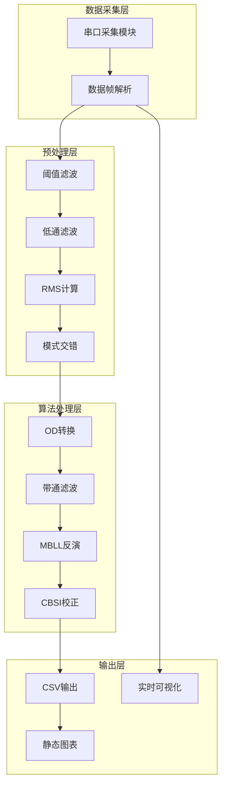
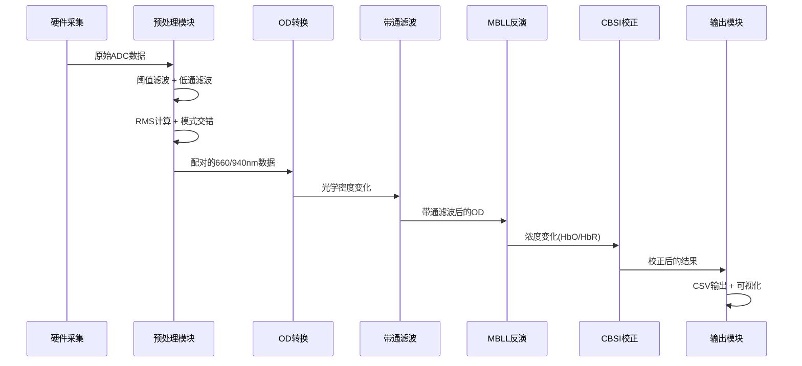
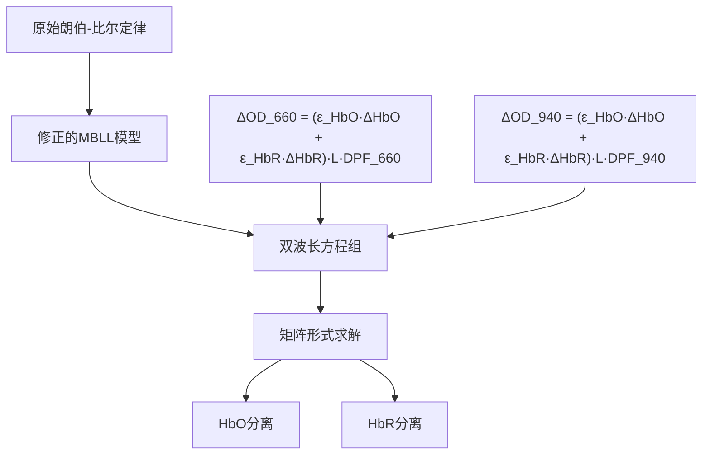
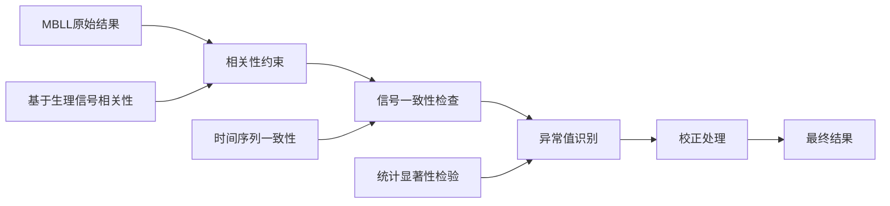
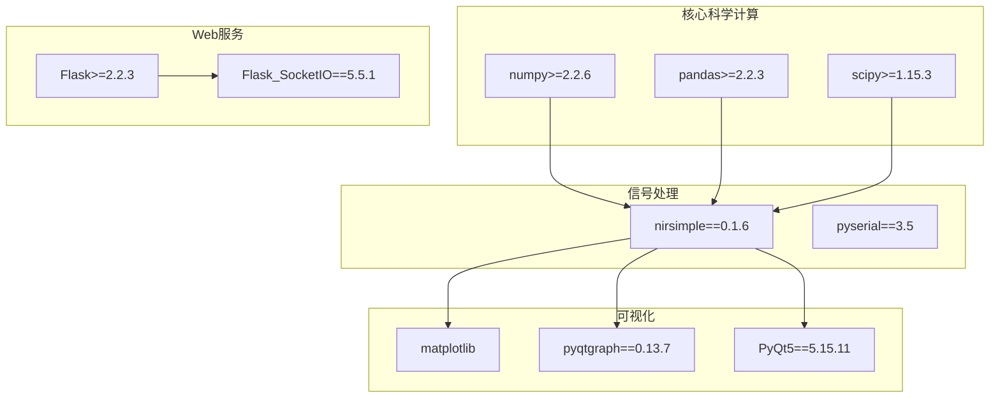
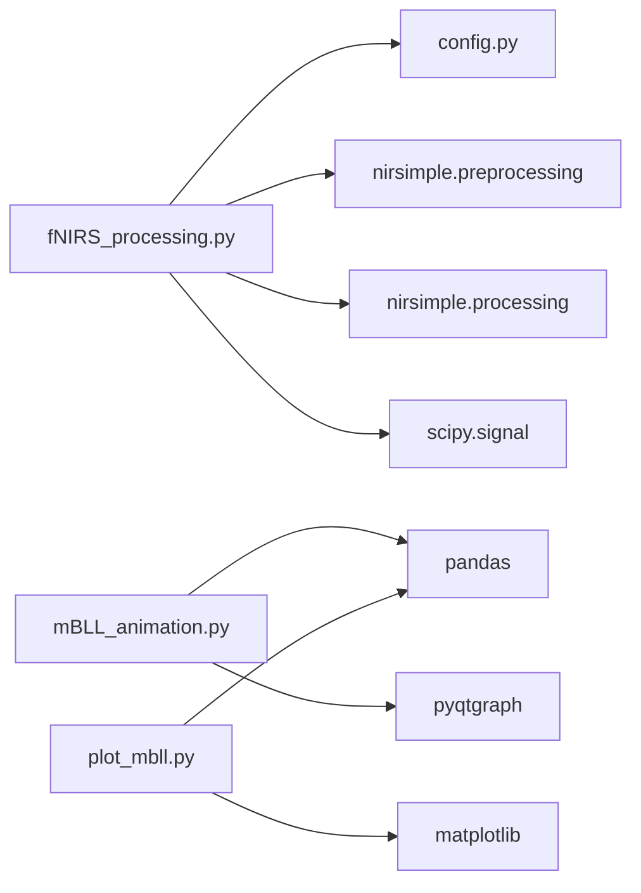
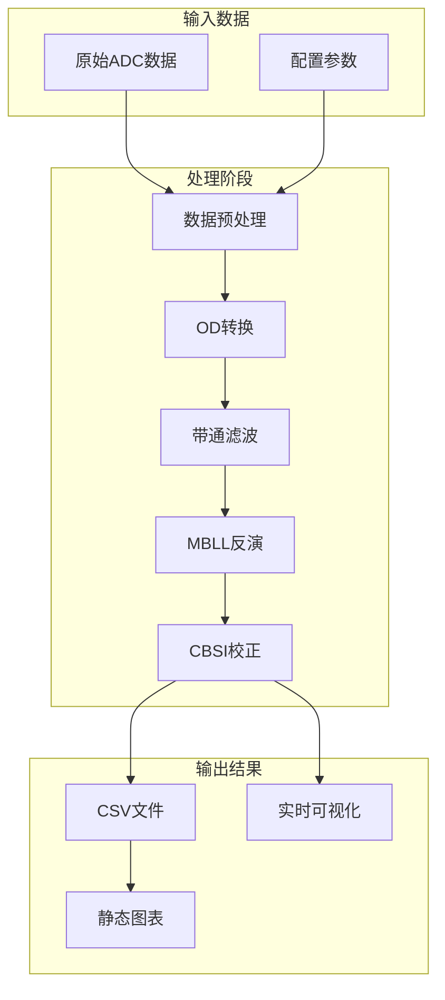

# MBLL算法实现

<cite>
**本文档引用的文件**
- [fNIRS_processing.py](file://software/fNIRS_processing.py)
- [mBLL_animation.py](file://software/mBLL_animation.py)
- [fNIRS_processing_csv.py](file://software/testing-scripts/fNIRS_processing_csv.py)
- [plot_mbll.py](file://software/testing-scripts/plot_mbll.py)
- [config.py](file://software/config.py)
- [fNIRS_processing_pipeline.md](file://software/fNIRS_processing_pipeline.md)
- [requirements.txt](file://software/requirements.txt)
</cite>

## 目录
1. [简介](#简介)
2. [项目结构](#项目结构)
3. [核心组件](#核心组件)
4. [架构概览](#架构概览)
5. [详细组件分析](#详细组件分析)
6. [依赖关系分析](#依赖关系分析)
7. [性能考虑](#性能考虑)
8. [故障排除指南](#故障排除指南)
9. [结论](#结论)
10. [附录](#附录)

## 简介

本文件详细阐述了Modified Beer-Lambert Law (MBLL)算法在fNIRS系统中的实现。MBLL是功能性近红外光谱(fNIRS)技术的核心算法，用于将光学密度变化转换为血红蛋白浓度变化。该实现基于双波长(660nm和940nm)双组分模型，结合带通滤波和CBSI校正机制，实现了从原始ADC数据到生理信号的完整处理链路。

## 项目结构

fNIRS项目采用分层架构设计，主要包含以下层次：



**图表来源**
- [fNIRS_processing.py](file://software/fNIRS_processing.py#L1-L496)
- [fNIRS_processing_csv.py](file://software/testing-scripts/fNIRS_processing_csv.py#L1-L497)

**章节来源**
- [fNIRS_processing.py](file://software/fNIRS_processing.py#L1-L50)
- [fNIRS_processing_csv.py](file://software/testing-scripts/fNIRS_processing_csv.py#L1-L50)

## 核心组件

### 1. 数据采集与预处理模块

系统支持两种数据处理模式：
- **实时采集模式**：通过串口直接采集原始ADC数据
- **离线处理模式**：处理已存储的CSV数据集

### 2. MBLL算法核心模块

MBLL算法实现包含以下关键步骤：
- 光学密度(OD)计算
- 带通滤波处理
- 双波长双组分反演
- CBSI相关性约束校正

### 3. 可视化与输出模块

提供多种输出格式和可视化方式：
- CSV格式的处理结果
- 实时mBLL数据可视化
- 静态图表分析

**章节来源**
- [fNIRS_processing.py](file://software/fNIRS_processing.py#L339-L443)
- [fNIRS_processing_csv.py](file://software/testing-scripts/fNIRS_processing_csv.py#L340-L444)

## 架构概览

MBLL算法的完整处理流程如下：



**图表来源**
- [fNIRS_processing.py](file://software/fNIRS_processing.py#L186-L235)
- [fNIRS_processing.py](file://software/fNIRS_processing.py#L339-L443)

## 详细组件分析

### MBLL理论基础与数学模型

MBLL算法基于朗伯-比尔定律的修正版本，考虑了生物组织中光散射的影响。其数学表达式为：



**图表来源**
- [fNIRS_processing_pipeline.md](file://software/fNIRS_processing_pipeline.md#L339-L399)

#### 光学密度(OD)计算

OD计算公式为：
```
ΔOD = -log10(I(t)/I₀)
```

其中：
- I(t)为测量强度
- I₀为参考强度
- 通过2*ZERO_LEVEL - raw的反相映射实现

#### 血红蛋白浓度变化计算

系统同时计算两种血红蛋白的变化：
- **HbO** (氧合血红蛋白)：ΔHbO
- **HbR** (脱氧血红蛋白)：ΔHbR

**章节来源**
- [fNIRS_processing.py](file://software/fNIRS_processing.py#L398-L418)
- [fNIRS_processing_csv.py](file://software/testing-scripts/fNIRS_processing_csv.py#L399-L418)

### CBSI校正机制

CBSI (Cross-Blood-Signal Interference)校正机制通过以下方式改进信号质量：



**图表来源**
- [fNIRS_processing.py](file://software/fNIRS_processing.py#L417-L418)
- [fNIRS_processing_csv.py](file://software/testing-scripts/fNIRS_processing_csv.py#L418-L418)

### 算法参数配置

#### 核心参数设置

| 参数类别 | 参数名称 | 默认值 | 说明 |
|---------|----------|--------|------|
| 光学参数 | sd_short | 0.6 cm | 短源探距 |
| 光学参数 | sd_long | 3.5 cm | 长源探距 |
| 光学参数 | age | 22岁 | 年龄参数(DPF计算) |
| 滤波参数 | bp_low | 0.05 Hz | 低通截止频率 |
| 滤波参数 | bp_high | 0.1 Hz | 高通截止频率 |
| 滤波参数 | bp_order | 4 | 滤波器阶数 |
| 光谱参数 | molar_ext_coeff_table | 'wray' | 摩尔消光系数表 |

#### 采样率与时间处理

系统支持动态采样率估计和时间戳重建：
- 采样率估计：fs = 1.0 / mean(diff(Time))
- 时间戳增量：0.001秒
- 浮点精度控制：四舍五入到毫秒级

**章节来源**
- [fNIRS_processing.py](file://software/fNIRS_processing.py#L342-L349)
- [fNIRS_processing.py](file://software/fNIRS_processing.py#L458-L485)

## 依赖关系分析

### 外部库依赖

系统依赖以下关键库：



**图表来源**
- [requirements.txt](file://software/requirements.txt#L1-L15)

### 内部模块依赖



**图表来源**
- [fNIRS_processing.py](file://software/fNIRS_processing.py#L10-L21)
- [mBLL_animation.py](file://software/mBLL_animation.py#L8-L16)
- [plot_mbll.py](file://software/testing-scripts/plot_mbll.py#L8-L10)

**章节来源**
- [requirements.txt](file://software/requirements.txt#L1-L15)
- [fNIRS_processing.py](file://software/fNIRS_processing.py#L10-L21)

## 性能考虑

### 计算复杂度分析

MBLL算法的时间复杂度为O(N)，其中N为采样点数量。空间复杂度为O(M)，其中M为通道数。

#### 优化策略

1. **内存管理**
   - 使用numpy数组进行向量化操作
   - 避免不必要的数据复制
   - 合理的数据类型选择(float32 vs float64)

2. **计算效率**
   - 预分配数组空间
   - 使用in-place操作减少内存分配
   - 合理的批处理大小

3. **实时性能**
   - 降采样策略：fs > target_fs + 1时进行重采样
   - 零相位滤波器：sosfiltfilt避免相位延迟
   - 并行处理：多通道独立处理

### 参数调优建议

#### 滤波器参数调优

| 参数 | 调优范围 | 影响 | 建议值 |
|------|----------|------|--------|
| bp_low | 0.01-0.1 Hz | 低频噪声抑制 | 0.05 Hz |
| bp_high | 0.05-0.5 Hz | 直流漂移去除 | 0.1 Hz |
| bp_order | 2-8 | 滤波器陡峭程度 | 4 |
| target_fs | 15-25 Hz | 计算负载 | 20 Hz |

#### 光学参数敏感性

- **DPF计算**：年龄参数对结果影响较大，建议准确测量
- **源探距**：短源探距(0.6cm)和长源探距(3.5cm)的准确性直接影响结果
- **摩尔消光系数**：wray表适用于大多数情况，可根据人群调整

**章节来源**
- [fNIRS_processing.py](file://software/fNIRS_processing.py#L128-L157)
- [fNIRS_processing.py](file://software/fNIRS_processing.py#L280-L302)

## 故障排除指南

### 常见问题与解决方案

#### 1. 数据采集问题

**问题**：串口通信失败
- 检查串口设备路径配置
- 验证波特率设置(9600)
- 确认超时设置(0.01秒)

**问题**：数据帧解析错误
- 验证64字节帧格式
- 检查字节序(大端序)
- 确认反相映射逻辑

#### 2. 算法处理问题

**问题**：OD计算异常
- 检查zero_level参数(2050)
- 验证强度值范围(200-4000)
- 确认阈值滤波设置

**问题**：MBLL反演失败
- 检查摩尔消光系数表
- 验证DPF计算参数
- 确认源探距设置

#### 3. 可视化问题

**问题**：实时数据显示异常
- 检查CSV文件路径
- 验证数据格式
- 确认时间戳同步

**章节来源**
- [config.py](file://software/config.py#L7-L12)
- [fNIRS_processing.py](file://software/fNIRS_processing.py#L23-L37)

### 调试工具

系统提供了多种调试和验证工具：

1. **数据完整性检查**：验证OD转换结果
2. **算法参数扫描**：测试不同参数组合
3. **可视化对比**：实时监控处理效果
4. **性能基准测试**：评估计算效率

## 结论

MBLL算法实现提供了完整的fNIRS数据分析解决方案，具有以下特点：

### 技术优势

1. **理论基础扎实**：基于修正的朗伯-比尔定律，考虑了生物组织光学特性
2. **算法稳健**：采用双波长双组分模型，提高分离精度
3. **工程实用**：提供完整的数据处理链路和可视化工具
4. **参数灵活**：支持多种参数配置，适应不同应用场景

### 应用价值

- **临床研究**：为fNIRS临床试验提供可靠的数据分析工具
- **教育演示**：直观展示fNIRS信号处理的各个环节
- **算法验证**：为新算法开发提供基准测试平台

### 改进方向

1. **自适应参数**：根据个体差异自动调整算法参数
2. **机器学习集成**：结合深度学习提高信号分离精度
3. **实时优化**：进一步提升实时处理性能
4. **多模态融合**：与其他脑成像技术结合

## 附录

### 算法参数完整列表

| 参数类别 | 参数名称 | 类型 | 默认值 | 说明 |
|---------|----------|------|--------|------|
| 光学参数 | age | int | 22 | 年龄(用于DPF计算) |
| 光学参数 | sd_short | float | 0.6 | 短源探距(cm) |
| 光学参数 | sd_long | float | 3.5 | 长源探距(cm) |
| 滤波参数 | bp_low | float | 0.05 | 低通截止频率(Hz) |
| 滤波参数 | bp_high | float | 0.1 | 高通截止频率(Hz) |
| 滤波参数 | bp_order | int | 4 | 滤波器阶数 |
| 光谱参数 | molar_ext_coeff_table | str | 'wray' | 摩尔消光系数表 |
| 输出参数 | unit | str | 'cm' | 距离单位 |
| 串口参数 | SERIAL_PORT | str | '/dev/tty.usbmodem...' | 串口设备路径 |
| 串口参数 | BAUD_RATE | int | 9600 | 波特率 |
| 串口参数 | TIMEOUT | float | 0.01 | 超时时间(秒) |

### 数据流图



**图表来源**
- [fNIRS_processing.py](file://software/fNIRS_processing.py#L445-L496)
- [fNIRS_processing_csv.py](file://software/testing-scripts/fNIRS_processing_csv.py#L446-L497)