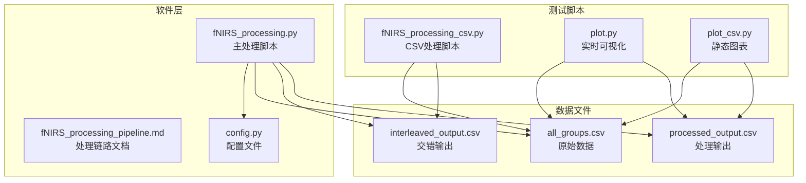
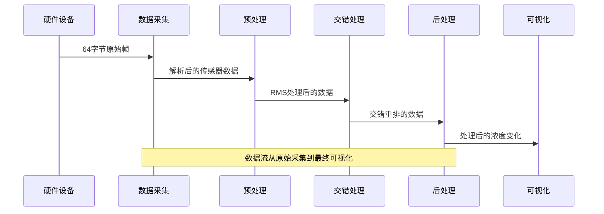
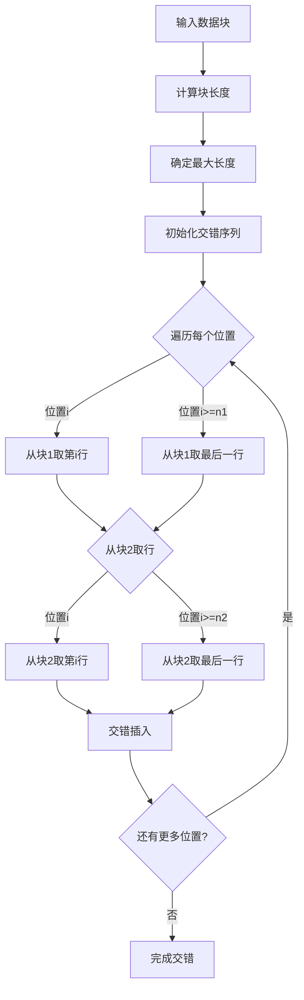
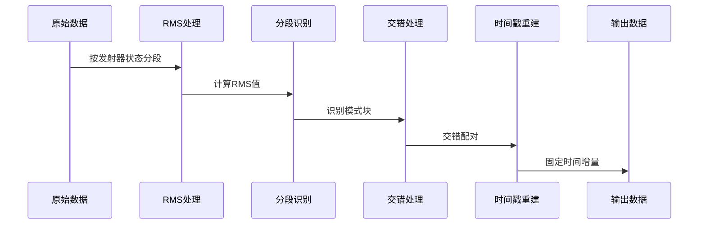
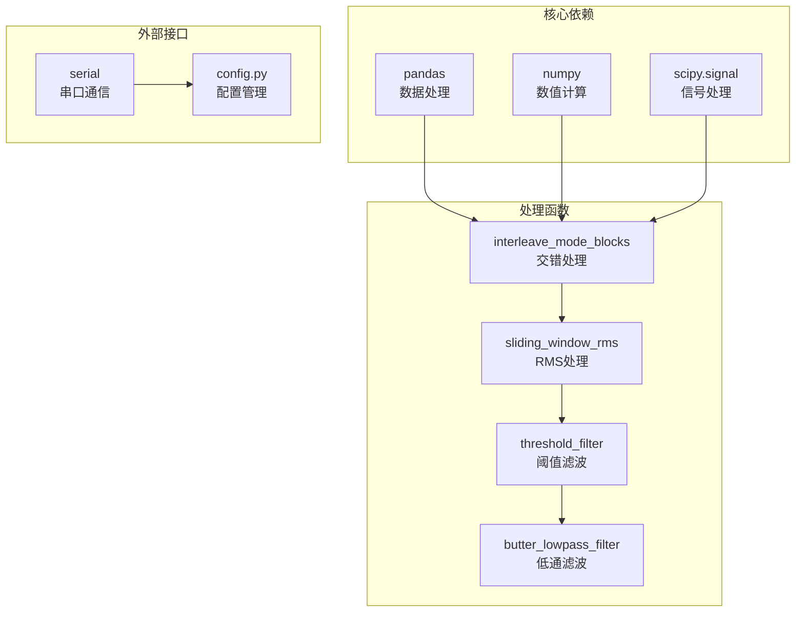

# 数据交错处理

<cite>
**本文档引用的文件**
- [fNIRS_processing.py](file://software/fNIRS_processing.py)
- [fNIRS_processing_pipeline.md](file://software/fNIRS_processing_pipeline.md)
- [fNIRS_processing_csv.py](file://software/testing-scripts/fNIRS_processing_csv.py)
- [plot.py](file://software/testing-scripts/plot.py)
- [plot_csv.py](file://software/testing-scripts/plot_csv.py)
- [config.py](file://software/config.py)
- [README.md](file://software/README.md)
</cite>

## 目录
1. [简介](#简介)
2. [项目结构](#项目结构)
3. [核心组件](#核心组件)
4. [架构概览](#架构概览)
5. [详细组件分析](#详细组件分析)
6. [依赖关系分析](#依赖关系分析)
7. [性能考虑](#性能考虑)
8. [故障排除指南](#故障排除指南)
9. [结论](#结论)
10. [附录](#附录)

## 简介

本文档深入解析fNIRS数据交错处理模块，重点阐述模式1和模式2数据块的识别与分割机制、发射器状态检测、数据块边界确定、交错算法实现原理、数据块配对策略、交错插入逻辑，以及数据块长度不一致时的处理方法。同时涵盖时间戳重新分配和同步机制，提供交错处理前后数据对比分析和质量评估方法，并包含实际交错处理示例和结果展示。

## 项目结构

fNIRS项目采用模块化设计，数据交错处理位于软件层，主要涉及以下文件：



**图表来源**
- [fNIRS_processing.py](file://software/fNIRS_processing.py#L1-L496)
- [fNIRS_processing_pipeline.md](file://software/fNIRS_processing_pipeline.md#L1-L592)
- [config.py](file://software/config.py#L1-L13)

**章节来源**
- [fNIRS_processing.py](file://software/fNIRS_processing.py#L1-L496)
- [fNIRS_processing_pipeline.md](file://software/fNIRS_processing_pipeline.md#L1-L592)
- [config.py](file://software/config.py#L1-L13)

## 核心组件

数据交错处理模块的核心组件包括：

### 1. 数据帧协议
系统采用固定的64字节数据帧协议，每帧包含8组传感器数据：
- 每组8字节：Group ID + Short + Long1 + Long2 + Emitter状态
- 发射器状态用于标识模式1或模式2

### 2. 模式识别与分割
基于发射器状态变化进行数据块分割：
- 使用np.diff()检测发射器状态变化
- 通过cumsum()创建连续模式块的分组标识
- 将连续相同模式的数据点归为同一块

### 3. 交错算法
实现模式1和模式2数据块的交错重排：
- 按块成对处理，奇数块和偶数块交错
- 逐行交错插入，保持时间序列连续性
- 支持不同长度数据块的智能处理

**章节来源**
- [fNIRS_processing.py](file://software/fNIRS_processing.py#L159-L184)
- [fNIRS_processing.py](file://software/fNIRS_processing.py#L235-L276)
- [fNIRS_processing_pipeline.md](file://software/fNIRS_processing_pipeline.md#L32-L42)

## 架构概览

数据交错处理采用分层架构，从硬件接口到数据处理再到可视化：



**图表来源**
- [fNIRS_processing.py](file://software/fNIRS_processing.py#L445-L495)
- [fNIRS_processing_pipeline.md](file://software/fNIRS_processing_pipeline.md#L8-L26)

## 详细组件分析

### 模式识别与分割机制

#### 发射器状态检测
系统通过检测发射器状态的变化来识别模式切换：

```mermaid
flowchart TD
A[原始数据] --> B[提取发射器状态列]
B --> C[计算差分np.diff()]
C --> D{状态变化?}
D --> |是| E[标记变化点]
D --> |否| F[继续扫描]
E --> G[累积求和cumsum()]
F --> G
G --> H[创建分组标识]
H --> I[分割数据块]
```

**图表来源**
- [fNIRS_processing.py](file://software/fNIRS_processing.py#L84-L125)
- [fNIRS_processing.py](file://software/fNIRS_processing.py#L244)

#### 数据块边界确定
数据块边界通过以下步骤确定：
1. 计算发射器状态的差分值
2. 识别非零差分的位置
3. 使用cumsum()创建连续分组
4. 按分组提取数据块

**章节来源**
- [fNIRS_processing.py](file://software/fNIRS_processing.py#L84-L125)
- [fNIRS_processing.py](file://software/fNIRS_processing.py#L243-L250)

### 交错算法实现原理

#### 数据块配对策略
交错算法采用相邻配对策略：
- 第1块与第2块配对
- 第3块与第4块配对
- 以此类推，形成交错序列

#### 交错插入逻辑
实现细节包括：
- 计算两个数据块的最大长度
- 逐行交错插入，越界时重复最后一行
- 保持数据完整性的同时实现时间同步



**图表来源**
- [fNIRS_processing.py](file://software/fNIRS_processing.py#L252-L276)

**章节来源**
- [fNIRS_processing.py](file://software/fNIRS_processing.py#L235-L276)

### 数据块长度不一致处理

系统采用智能填充策略处理不同长度的数据块：

#### 重复最后一个数据点
当一个数据块比另一个短时：
- 越界访问时重复最后一行数据
- 确保交错过程的连续性
- 维持时间序列的完整性

#### 边界填充策略
- 使用DataFrame的loc[]索引器处理越界访问
- 自动重复最后一行直到达到最大长度
- 保持交错序列的平衡性

**章节来源**
- [fNIRS_processing.py](file://software/fNIRS_processing.py#L262-L270)

### 时间戳重新分配和同步机制

#### 重建时间轴
系统采用固定步长的时间戳分配：
- 丢弃原始时间戳，避免硬件时间抖动
- 使用固定增量(0.001秒)重建时间序列
- 对时间戳进行四舍五入避免浮点误差

#### 同步机制
- 通过交错插入确保模式1和模式2数据的正确配对
- 固定时间增量保证数据流的时序一致性
- RMS处理后的数据块长度相对均衡，减少同步复杂度

**章节来源**
- [fNIRS_processing.py](file://software/fNIRS_processing.py#L479-L484)
- [fNIRS_processing.py](file://software/fNIRS_processing.py#L206-L208)

### 数据交错处理流程



**图表来源**
- [fNIRS_processing.py](file://software/fNIRS_processing.py#L474-L481)
- [fNIRS_processing.py](file://software/fNIRS_processing.py#L235-L276)

## 依赖关系分析

数据交错处理模块的依赖关系如下：



**图表来源**
- [fNIRS_processing.py](file://software/fNIRS_processing.py#L10-L21)
- [fNIRS_processing.py](file://software/fNIRS_processing.py#L235-L276)

**章节来源**
- [fNIRS_processing.py](file://software/fNIRS_processing.py#L10-L21)
- [fNIRS_processing.py](file://software/fNIRS_processing.py#L235-L276)

## 性能考虑

### 算法复杂度
- **时间复杂度**: O(n)，其中n为数据点总数
- **空间复杂度**: O(n)，用于存储处理后的数据
- **交错操作**: O(max(n1,n2))，其中n1和n2为两个数据块的长度

### 优化策略
1. **向量化操作**: 使用numpy的向量化操作提高计算效率
2. **内存管理**: 避免不必要的数据复制，使用in-place操作
3. **批处理**: 对大数据集采用分块处理策略
4. **缓存机制**: 复用计算结果，避免重复计算

### 性能监控
- 监控交错处理的时间消耗
- 分析内存使用情况
- 评估不同数据块长度对性能的影响

## 故障排除指南

### 常见问题及解决方案

#### 1. 模式识别失败
**症状**: 数据块分割错误或遗漏
**原因**: 发射器状态不稳定或噪声干扰
**解决**: 
- 检查硬件连接和信号质量
- 调整阈值滤波参数
- 验证发射器状态列的正确性

#### 2. 交错结果异常
**症状**: 输出数据长度不匹配或时间戳错误
**原因**: 数据块长度差异过大或时间戳重建问题
**解决**:
- 检查输入数据的完整性
- 验证交错算法的边界条件
- 确认时间戳重建参数设置

#### 3. 性能问题
**症状**: 处理速度慢或内存占用过高
**原因**: 大数据集处理或算法效率问题
**解决**:
- 优化数据结构和算法实现
- 实施分块处理策略
- 监控内存使用情况

**章节来源**
- [fNIRS_processing_pipeline.md](file://software/fNIRS_processing_pipeline.md#L546-L565)

## 结论

fNIRS数据交错处理模块通过精确的发射器状态检测和智能的数据块分割，实现了高效的模式1和模式2数据交错。系统采用的重复填充策略确保了不同长度数据块的兼容性，而固定时间戳重建机制提供了良好的时序同步。整体架构设计简洁高效，为后续的mBLL处理奠定了坚实基础。

## 附录

### 实际交错处理示例

#### 示例1：基本交错处理
1. **输入**: 包含G0_Emitter列的数据框
2. **处理**: 按发射器状态分割数据块
3. **输出**: 交错重排后的数据序列

#### 示例2：长度不一致处理
1. **输入**: 长度分别为10和15的数据块
2. **处理**: 前10个位置交错插入，后5个位置重复最后一行
3. **输出**: 长度为15的交错序列

### 质量评估方法

#### 1. 数据完整性检查
- 验证交错前后数据点总数的一致性
- 检查模式1和模式2数据的配对正确性
- 确认时间戳的连续性和唯一性

#### 2. 性能指标
- 处理时间统计
- 内存使用量监控
- 数据传输效率评估

#### 3. 可视化验证
- 使用plot.py进行实时数据可视化
- 通过plot_csv.py生成静态图表
- 对比交错前后的数据特征

**章节来源**
- [plot.py](file://software/testing-scripts/plot.py#L1-L105)
- [plot_csv.py](file://software/testing-scripts/plot_csv.py#L1-L192)