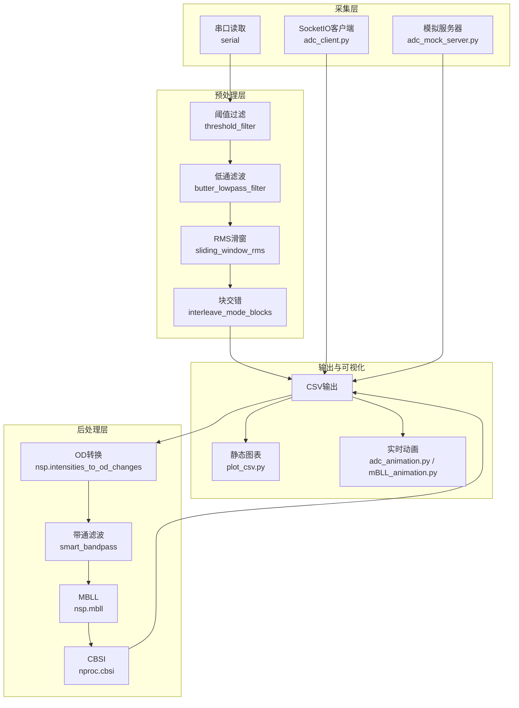
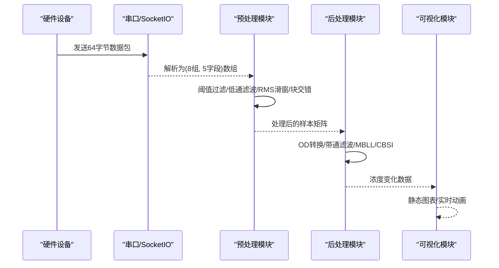
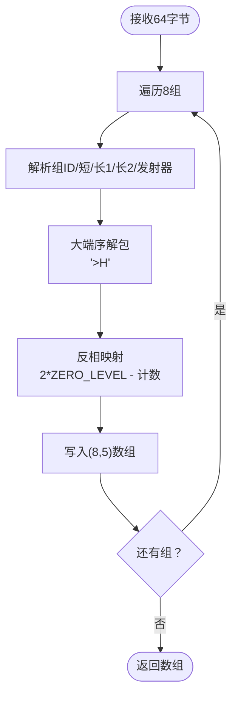
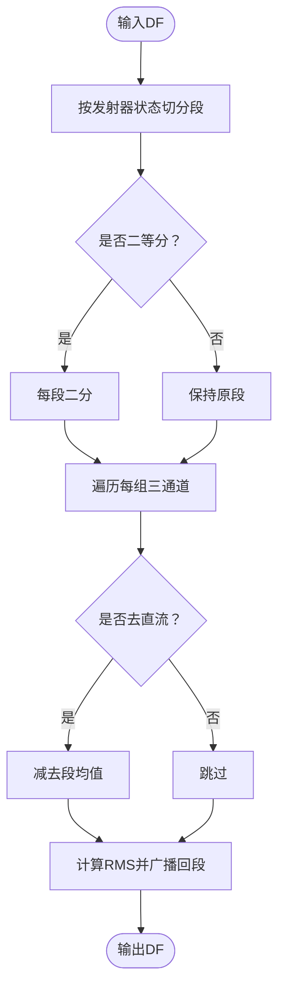
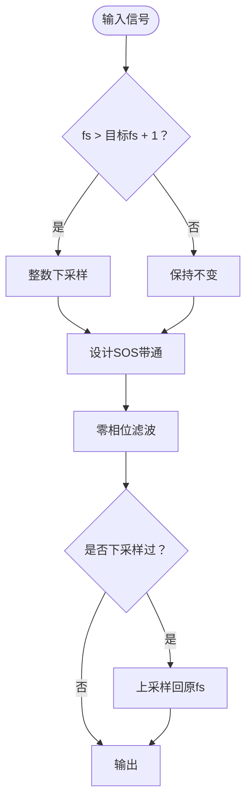
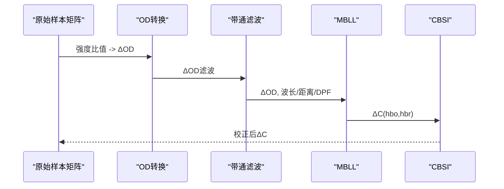
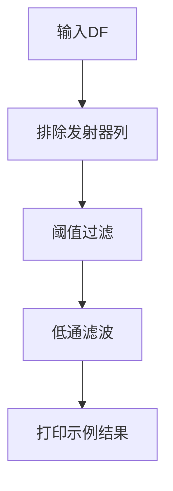
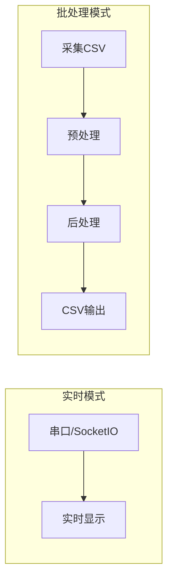
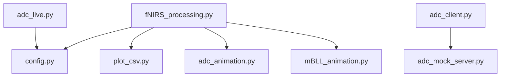

# 数据处理引擎

<cite>
**本文档引用的文件**
- [fNIRS_processing.py](file://software/fNIRS_processing.py)
- [config.py](file://software/config.py)
- [adc_live.py](file://software/adc_live.py)
- [adc_client.py](file://software/adc_client.py)
- [adc_mock_server.py](file://software/adc_mock_server.py)
- [fNIRS_processing_csv.py](file://software/testing-scripts/fNIRS_processing_csv.py)
- [plot.py](file://software/testing-scripts/plot.py)
- [plot_csv.py](file://software/testing-scripts/plot_csv.py)
- [adc_animation.py](file://software/adc_animation.py)
- [mBLL_animation.py](file://software/mBLL_animation.py)
- [README.md](file://README.md)
- [software/README.md](file://software/README.md)
- [requirements.txt](file://software/requirements.txt)
</cite>

## 目录
1. [简介](#简介)
2. [项目结构](#项目结构)
3. [核心组件](#核心组件)
4. [架构总览](#架构总览)
5. [详细组件分析](#详细组件分析)
6. [依赖关系分析](#依赖关系分析)
7. [性能考量](#性能考量)
8. [故障排查指南](#故障排查指南)
9. [结论](#结论)
10. [附录](#附录)

## 简介
本文件面向fNIRS数据处理引擎，系统性阐述从原始ADC数据采集到最终血红蛋白浓度变化输出的完整流程。重点覆盖：
- ADC数据包解析与格式化：数据包结构、字节序处理、数据类型转换
- 滑动窗口RMS计算：窗口划分、计算公式与性能优化
- 带通滤波与去噪：滤波器设计、参数调节与效果评估
- Modified Beer-Lambert Law（MBLL）：OD计算、血红蛋白浓度变化与CBSI校正
- 插值与重采样：方法选择与时间对齐策略
- 质量控制与异常检测：阈值过滤与离群点抑制
- 批处理与实时处理模式对比

## 项目结构
软件层采用模块化设计，围绕“采集-预处理-后处理-可视化”主线组织：
- 采集与通信：串口读取、SocketIO客户端、模拟服务器
- 预处理：阈值过滤、低通滤波、RMS滑窗、块交错
- 后处理：OD转换、带通滤波、MBLL、CBSI
- 可视化：静态图表、实时动画、3D脑图

**图表来源**
- [fNIRS_processing.py](file://software/fNIRS_processing.py#L160-L186)
- [fNIRS_processing.py](file://software/fNIRS_processing.py#L51-L83)
- [fNIRS_processing.py](file://software/fNIRS_processing.py#L84-L127)
- [fNIRS_processing.py](file://software/fNIRS_processing.py#L236-L278)
- [fNIRS_processing.py](file://software/fNIRS_processing.py#L398-L418)
- [fNIRS_processing.py](file://software/fNIRS_processing.py#L400-L405)
- [fNIRS_processing.py](file://software/fNIRS_processing.py#L407-L417)
- [plot_csv.py](file://software/testing-scripts/plot_csv.py#L17-L87)
- [adc_animation.py](file://software/adc_animation.py#L105-L132)
- [mBLL_animation.py](file://software/mBLL_animation.py#L103-L129)

**章节来源**
- [software/README.md](file://software/README.md#L1-L180)
- [README.md](file://README.md#L1-L19)

## 核心组件
- 串口数据采集与解析：负责从硬件读取固定长度数据包，按组解析短/长通道与发射器状态，并进行反相映射以还原原始计数值。
- 预处理流水线：包含阈值过滤、低通滤波、RMS滑窗与块交错，确保后续OD转换与滤波稳定。
- 后处理流水线：OD转换、智能带通滤波、MBLL与CBSI，生成血红蛋白浓度变化数据。
- 实时可视化：支持ADC与mBLL的实时动画展示，以及静态图表导出。

**章节来源**
- [fNIRS_processing.py](file://software/fNIRS_processing.py#L160-L186)
- [fNIRS_processing.py](file://software/fNIRS_processing.py#L51-L83)
- [fNIRS_processing.py](file://software/fNIRS_processing.py#L84-L127)
- [fNIRS_processing.py](file://software/fNIRS_processing.py#L236-L278)
- [fNIRS_processing.py](file://software/fNIRS_processing.py#L398-L418)

## 架构总览
系统分为两大运行模式：
- 实时模式（Live）：通过串口或SocketIO接收原始ADC数据，实时显示。
- 批处理模式（Record & Visualize）：记录一段时间的数据，执行完整的预处理与后处理流程，输出CSV并可视化。

**图表来源**
- [fNIRS_processing.py](file://software/fNIRS_processing.py#L160-L186)
- [fNIRS_processing.py](file://software/fNIRS_processing.py#L51-L83)
- [fNIRS_processing.py](file://software/fNIRS_processing.py#L84-L127)
- [fNIRS_processing.py](file://software/fNIRS_processing.py#L398-L418)
- [plot_csv.py](file://software/testing-scripts/plot_csv.py#L17-L87)
- [adc_animation.py](file://software/adc_animation.py#L105-L132)
- [mBLL_animation.py](file://software/mBLL_animation.py#L103-L129)

## 详细组件分析

### ADC数据包解析与格式化
- 数据包结构：每个64字节包含8个传感器组，每组8字节，布局为[组ID, 短通道2字节, 长通道1 2字节, 长通道2 2字节, 发射器状态 1字节]。
- 字节序处理：使用大端序解析短整型字段；发射器状态为单字节。
- 数据类型转换：将原始ADC计数转换为可逆的强度表示，随后进行反相映射以恢复近似原始计数用于调试。
- 输出格式：生成(8, 5)数组，便于后续按组处理与列名映射。

**图表来源**
- [fNIRS_processing.py](file://software/fNIRS_processing.py#L160-L186)

**章节来源**
- [fNIRS_processing.py](file://software/fNIRS_processing.py#L160-L186)

### 滑动窗口RMS计算
- 窗口划分：基于发射器状态变化分割段，可选将每段再二等分以提升时间分辨率。
- 计算公式：对每段内各通道（短/长1/长2）计算均方根，去除直流分量可选。
- 性能优化：向量化操作，避免显式循环；仅在非空段上执行计算。

**图表来源**
- [fNIRS_processing.py](file://software/fNIRS_processing.py#L84-L127)

**章节来源**
- [fNIRS_processing.py](file://software/fNIRS_processing.py#L84-L127)

### 带通滤波与去噪
- 低通滤波：对选定通道应用Butterworth低通，截止频率与阶数可配置，使用零相位滤波减少相位失真。
- 智能带通：先下采样至目标采样率，设计SOS带通滤波，零相位滤波后按需上采样回原采样率。
- 参数调节：低/高截止频率、滤波阶数、目标采样率；根据采样间隔自动推导采样率。

**图表来源**
- [fNIRS_processing.py](file://software/fNIRS_processing.py#L129-L158)
- [fNIRS_processing.py](file://software/fNIRS_processing.py#L68-L82)

**章节来源**
- [fNIRS_processing.py](file://software/fNIRS_processing.py#L129-L158)
- [fNIRS_processing.py](file://software/fNIRS_processing.py#L68-L82)

### Modified Beer-Lambert Law（MBLL）
- 光学密度（OD）计算：将两行（660nm/940nm）对应通道的强度比值转换为OD变化。
- 血红蛋白浓度变化：结合波长、源-探测器距离、路径因子与摩尔消光系数表，计算ΔHbO与ΔHbR。
- CBSI校正：对通道间一致性进行改进，提升信噪比与稳定性。

**图表来源**
- [fNIRS_processing.py](file://software/fNIRS_processing.py#L398-L418)

**章节来源**
- [fNIRS_processing.py](file://software/fNIRS_processing.py#L398-L418)

### 数据插值与重采样
- 时间对齐：批处理模式中，将交错后的块按固定增量重新分配时间戳，确保均匀采样。
- 插值策略：当前代码未直接实现插值，但通过下采样/上采样保证频域一致性，配合零相位滤波降低混叠风险。
- 建议：若需严格时间对齐，可在OD阶段引入线性或样条插值，并在滤波前完成。

**章节来源**
- [fNIRS_processing.py](file://software/fNIRS_processing.py#L479-L487)

### 质量控制与异常检测
- 阈值过滤：对通道值设定上下限，超出范围用零电平替代，抑制极端噪声。
- 低通滤波：进一步抑制高频噪声，保留有用信号。
- 结果验证：打印最后一时刻的浓度示例，便于人工核验。

**图表来源**
- [fNIRS_processing.py](file://software/fNIRS_processing.py#L51-L83)
- [fNIRS_processing.py](file://software/fNIRS_processing.py#L470-L471)
- [fNIRS_processing.py](file://software/fNIRS_processing.py#L436-L443)

**章节来源**
- [fNIRS_processing.py](file://software/fNIRS_processing.py#L51-L83)
- [fNIRS_processing.py](file://software/fNIRS_processing.py#L470-L471)
- [fNIRS_processing.py](file://software/fNIRS_processing.py#L436-L443)

### 批处理与实时处理模式对比
- 实时模式（adc_live.py/adc_client.py）：
  - 串口或SocketIO接收原始ADC数据，按组显示，无后处理。
  - 特点：低延迟、资源占用小，适合监控与调试。
- 批处理模式（fNIRS_processing.py + testing-scripts）：
  - 完整预处理与后处理链路，输出CSV供可视化。
  - 特点：计算开销较大，适合离线分析与科研验证。

**图表来源**
- [adc_live.py](file://software/adc_live.py#L48-L78)
- [adc_client.py](file://software/adc_client.py#L38-L86)
- [fNIRS_processing.py](file://software/fNIRS_processing.py#L446-L496)

**章节来源**
- [adc_live.py](file://software/adc_live.py#L48-L78)
- [adc_client.py](file://software/adc_client.py#L38-L86)
- [fNIRS_processing.py](file://software/fNIRS_processing.py#L446-L496)

## 依赖关系分析
- 核心库：numpy、pandas、scipy（信号处理）、pyqtgraph（实时可视化）、plotly（静态图表）、nirsimple（OD/MBLL/CBSI）、pyserial（串口通信）、Flask/SocketIO（网络服务）。
- 模块耦合：预处理与后处理通过中间样本矩阵耦合，可视化独立于处理逻辑，便于替换。

**图表来源**
- [fNIRS_processing.py](file://software/fNIRS_processing.py#L20-L21)
- [config.py](file://software/config.py#L7-L12)
- [adc_live.py](file://software/adc_live.py#L14-L14)
- [adc_client.py](file://software/adc_client.py#L13-L15)
- [adc_mock_server.py](file://software/adc_mock_server.py#L16-L16)
- [plot_csv.py](file://software/testing-scripts/plot_csv.py#L14-L15)
- [adc_animation.py](file://software/adc_animation.py#L13-L15)
- [mBLL_animation.py](file://software/mBLL_animation.py#L13-L15)

**章节来源**
- [requirements.txt](file://software/requirements.txt#L1-L15)
- [fNIRS_processing.py](file://software/fNIRS_processing.py#L20-L21)

## 性能考量
- 向量化优先：利用numpy数组与广播，避免Python循环。
- 零相位滤波：减少相位失真，提高频域保真度。
- 下/上采样：在满足奈奎斯特定理前提下降低计算复杂度。
- 内存管理：实时模式使用定长队列，批处理模式按需写入CSV。
- I/O优化：串口读取采用固定包长，减少缓冲区拼接开销。

[本节提供通用指导，无需具体文件分析]

## 故障排查指南
- 串口连接失败：检查端口号与权限，确认设备已连接且波特率匹配。
- 数据异常：启用阈值过滤与低通滤波，观察RMS滑窗前后差异。
- 滤波不稳定：调整带通参数（低/高截止频率、阶数），确保目标采样率设置合理。
- 可视化问题：确认依赖安装完整，实时模式与批处理模式分别使用不同脚本。
- 模拟数据：通过模拟服务器快速验证流程，定位问题环节。

**章节来源**
- [config.py](file://software/config.py#L7-L12)
- [fNIRS_processing.py](file://software/fNIRS_processing.py#L51-L83)
- [fNIRS_processing.py](file://software/fNIRS_processing.py#L129-L158)
- [adc_mock_server.py](file://software/adc_mock_server.py#L62-L64)

## 结论
该数据处理引擎以模块化方式实现了从原始ADC到血红蛋白浓度变化的完整链路，具备良好的可扩展性与可维护性。通过严格的预处理与后处理策略，系统在实时性与准确性之间取得平衡，适用于教学、研究与个人健康监测场景。

[本节为总结性内容，无需具体文件分析]

## 附录
- 关键函数路径参考：
  - [parse_packet](file://software/fNIRS_processing.py#L160-L186)
  - [threshold_filter](file://software/fNIRS_processing.py#L51-L67)
  - [butter_lowpass_filter](file://software/fNIRS_processing.py#L68-L82)
  - [sliding_window_rms](file://software/fNIRS_processing.py#L84-L127)
  - [interleave_mode_blocks](file://software/fNIRS_processing.py#L236-L278)
  - [smart_bandpass](file://software/fNIRS_processing.py#L137-L159)
  - [process_csv_dataset](file://software/fNIRS_processing.py#L339-L443)

[本节为索引性内容，无需具体文件分析]