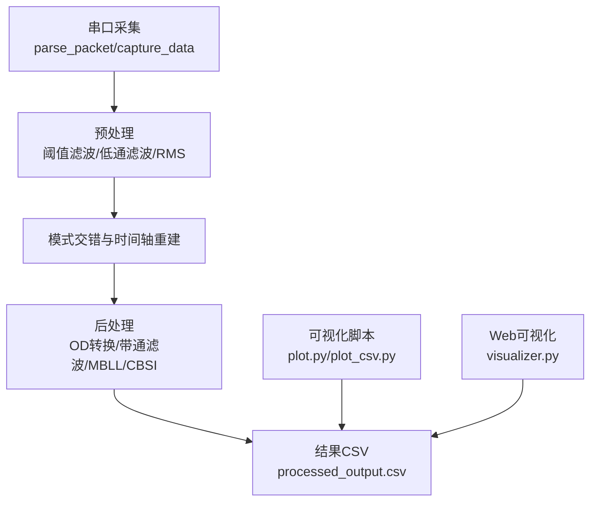
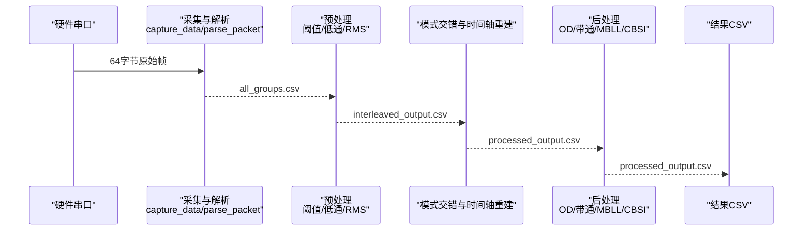
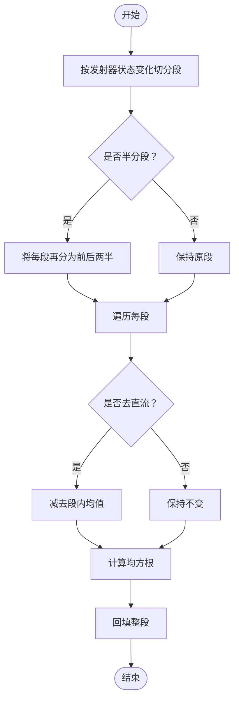
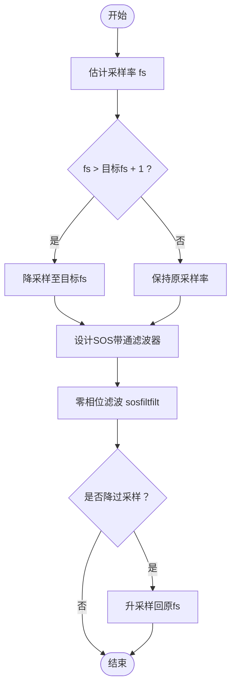
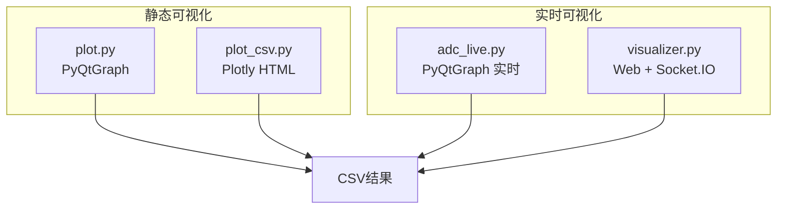
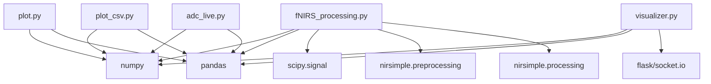

# 滤波算法

<cite>
**本文引用的文件**
- [fNIRS_processing.py](file://software/fNIRS_processing.py)
- [fNIRS_processing_pipeline.md](file://software/fNIRS_processing_pipeline.md)
- [visualizer.py](file://software/visualizer.py)
- [adc_live.py](file://software/adc_live.py)
- [config.py](file://software/config.py)
- [apply_rms_to_adc.py](file://software/testing-scripts/apply_rms_to_adc.py)
- [plot.py](file://software/testing-scripts/plot.py)
- [plot_csv.py](file://software/testing-scripts/plot_csv.py)
- [fNIRS_processing_csv.py](file://software/testing-scripts/fNIRS_processing_csv.py)
</cite>

## 目录
1. [简介](#简介)
2. [项目结构](#项目结构)
3. [核心组件](#核心组件)
4. [架构总览](#架构总览)
5. [详细组件分析](#详细组件分析)
6. [依赖关系分析](#依赖关系分析)
7. [性能考量](#性能考量)
8. [故障排查指南](#故障排查指南)
9. [结论](#结论)
10. [附录](#附录)

## 简介
本文件围绕滤波算法模块，系统梳理滑动窗口RMS计算、带通滤波器设计与实现、去噪策略、参数自适应调整思路，以及滤波效果的可视化与评估方法。文档基于仓库中的实际实现，结合处理链路说明，帮助读者快速理解并扩展滤波策略。

## 项目结构
滤波算法主要分布在以下文件：
- 数据采集与串口解析：fNIRS_processing.py、adc_live.py、config.py
- 预处理与后处理链路：fNIRS_processing.py、fNIRS_processing_pipeline.md
- 测试与可视化脚本：apply_rms_to_adc.py、plot.py、plot_csv.py、fNIRS_processing_csv.py
- Web可视化与交互：visualizer.py

**图表来源**
- [fNIRS_processing.py](file://software/fNIRS_processing.py#L159-L234)
- [fNIRS_processing.py](file://software/fNIRS_processing.py#L51-L82)
- [fNIRS_processing.py](file://software/fNIRS_processing.py#L84-L125)
- [fNIRS_processing.py](file://software/fNIRS_processing.py#L339-L443)
- [plot.py](file://software/testing-scripts/plot.py#L1-L105)
- [plot_csv.py](file://software/testing-scripts/plot_csv.py#L1-L192)
- [visualizer.py](file://software/visualizer.py#L587-L730)

**章节来源**
- [fNIRS_processing.py](file://software/fNIRS_processing.py#L1-L496)
- [fNIRS_processing_pipeline.md](file://software/fNIRS_processing_pipeline.md#L1-L592)

## 核心组件
- 阈值滤波：抑制异常值，将越界值替换为基线，减少异常点对后续处理的影响。
- 低通滤波：采用巴特沃斯低通滤波，零相位实现，抑制高频噪声。
- 分段RMS：按发射器状态变化进行事件驱动分段，计算每段均方根并回填整段。
- 带通滤波：设计稳定的SOS型带通滤波器，支持降采样-滤波-升采样流程，零相位滤波。
- 去噪与校正：OD域带通滤波后进行MBLL反演与CBSI校正，提升生理信号可解释性。

**章节来源**
- [fNIRS_processing.py](file://software/fNIRS_processing.py#L51-L82)
- [fNIRS_processing.py](file://software/fNIRS_processing.py#L84-L125)
- [fNIRS_processing.py](file://software/fNIRS_processing.py#L128-L157)
- [fNIRS_processing.py](file://software/fNIRS_processing.py#L339-L443)
- [fNIRS_processing_pipeline.md](file://software/fNIRS_processing_pipeline.md#L90-L176)

## 架构总览
滤波算法贯穿“串口采集→预处理→模式交错→后处理”的完整链路。预处理阶段完成阈值与低通滤波，随后进行RMS分段；后处理阶段在OD域进行带通滤波，再进行MBLL与CBSI，最终输出processed_output.csv。

**图表来源**
- [fNIRS_processing.py](file://software/fNIRS_processing.py#L159-L234)
- [fNIRS_processing.py](file://software/fNIRS_processing.py#L51-L82)
- [fNIRS_processing.py](file://software/fNIRS_processing.py#L84-L125)
- [fNIRS_processing.py](file://software/fNIRS_processing.py#L339-L443)

## 详细组件分析

### 滑动窗口RMS计算
- 实现方式：事件驱动分段，依据发射器状态变化切分数据段，对每段计算均方根并回填整段。
- 关键参数：
  - 发射器参考列：默认使用G0_Emitter
  - 组前缀与组数：默认G前缀、8组
  - 是否去除直流分量：可选
  - 是否将段半分：可选
- 计算公式：对每段内各通道数据，先可选去直流，再计算均方根并回填整段。
- 性能考虑：
  - 事件驱动分段避免固定窗口滑动带来的计算冗余
  - 分段质量依赖发射器切换的稳定性
  - 可选半分策略用于更细粒度的噪声估计

**图表来源**
- [fNIRS_processing.py](file://software/fNIRS_processing.py#L84-L125)
- [apply_rms_to_adc.py](file://software/testing-scripts/apply_rms_to_adc.py#L25-L62)

**章节来源**
- [fNIRS_processing.py](file://software/fNIRS_processing.py#L84-L125)
- [fNIRS_processing_pipeline.md](file://software/fNIRS_processing_pipeline.md#L146-L176)
- [apply_rms_to_adc.py](file://software/testing-scripts/apply_rms_to_adc.py#L1-L77)

### 带通滤波器设计与实现
- 滤波器类型：SOS（二阶节）形式的巴特沃斯带通滤波器，数值更稳定
- 参数设置：
  - 低截止频率：默认0.05 Hz
  - 高截止频率：默认0.1 Hz
  - 滤波器阶数：默认4
  - 目标采样率：默认20.0 Hz
- 频率响应分析：
  - 高通≥0.1 Hz抑制漂移
  - 低通≤0.05 Hz抑制脉搏与噪声
- 实现细节：
  - 高采样率时先降采样，滤波后再升采样，提高稳定性并降低计算量
  - 零相位滤波，避免相位失真

**图表来源**
- [fNIRS_processing.py](file://software/fNIRS_processing.py#L135-L157)
- [fNIRS_processing.py](file://software/fNIRS_processing.py#L128-L133)
- [fNIRS_processing_pipeline.md](file://software/fNIRS_processing_pipeline.md#L262-L290)

**章节来源**
- [fNIRS_processing.py](file://software/fNIRS_processing.py#L128-L157)
- [fNIRS_processing_pipeline.md](file://software/fNIRS_processing_pipeline.md#L262-L290)

### 去噪算法与策略
- 预处理去噪：
  - 阈值滤波：将越界值替换为基线，抑制异常点
  - 低通滤波：抑制高频噪声，保留慢变化
- 后处理去噪：
  - OD域带通滤波：在OD域进行带通滤波，抑制漂移与噪声
  - MBLL反演：将OD转换为生理量（HbO/HbR），提升信号可解释性
  - CBSI校正：对MBLL输出进行相关性约束校正，改善信号一致性

**图表来源**
- [fNIRS_processing.py](file://software/fNIRS_processing.py#L51-L82)
- [fNIRS_processing.py](file://software/fNIRS_processing.py#L84-L125)
- [fNIRS_processing.py](file://software/fNIRS_processing.py#L339-L443)

**章节来源**
- [fNIRS_processing.py](file://software/fNIRS_processing.py#L51-L82)
- [fNIRS_processing.py](file://software/fNIRS_processing.py#L339-L443)
- [fNIRS_processing_pipeline.md](file://software/fNIRS_processing_pipeline.md#L446-L475)

### 滤波参数的自适应调整机制
- 当前实现：
  - 阈值滤波参数：上下限与基线值
  - 低通滤波参数：截止频率与阶数
  - 带通滤波参数：低/高截止频率、阶数与目标采样率
- 自适应思路（概念性）：
  - 动态阈值：根据局部统计量（如标准差）自适应调整上下限
  - 自适应带通：基于功率谱估计或瞬时频率特性动态调整低/高截止频率
  - 自适应降采样：根据信号带宽与噪声水平动态选择降采样倍数
- 注意事项：
  - 自适应需保证实时性与稳定性，避免参数抖动导致不稳定
  - 建议在测试脚本中验证参数变化对滤波效果的影响

[本节为概念性说明，不直接分析具体文件]

### 滤波效果的可视化与评估
- 静态可视化：
  - plot.py：展示ADC与mBLL结果的PyQtGraph图表
  - plot_csv.py：生成Plotly静态HTML，分别展示ADC与mBLL的分组曲线
- 实时可视化：
  - adc_live.py：PyQt5 + pyqtgraph实时显示ADC曲线
  - visualizer.py：Flask + Socket.IO + Plotly的Web可视化，支持脑网格高亮与交互
- 评估方法：
  - 观察RMS前后曲线的平滑程度与异常点抑制效果
  - 对比带通滤波前后OD曲线的稳态与噪声水平
  - 通过processed_output.csv的HbO/HbR曲线评估生理信号质量

**图表来源**
- [plot.py](file://software/testing-scripts/plot.py#L1-L105)
- [plot_csv.py](file://software/testing-scripts/plot_csv.py#L1-L192)
- [adc_live.py](file://software/adc_live.py#L1-L220)
- [visualizer.py](file://software/visualizer.py#L587-L730)

**章节来源**
- [plot.py](file://software/testing-scripts/plot.py#L1-L105)
- [plot_csv.py](file://software/testing-scripts/plot_csv.py#L1-L192)
- [adc_live.py](file://software/adc_live.py#L1-L220)
- [visualizer.py](file://software/visualizer.py#L587-L730)

### 不同应用场景下的滤波策略对比
- 低噪声环境（高信噪比）：
  - 阈值滤波可适当放宽上下限，减少误剔除
  - 低通滤波可适度提高截止频率，保留更多有用细节
- 高噪声环境（低信噪比）：
  - 阈值滤波严格限制上下限，确保异常点被抑制
  - 低通滤波降低截止频率，更强抑制高频噪声
- 快速变化信号（如运动干扰）：
  - 带通滤波范围应更窄，抑制脉搏与运动伪影
  - 可考虑增加降采样以提升稳定性
- 长时间监测（漂移敏感）：
  - 带通滤波高通≥0.1 Hz，有效抑制漂移
  - CBSI校正有助于长期稳定性

[本节为概念性说明，不直接分析具体文件]

## 依赖关系分析
- 滤波算法依赖的外部库与模块：
  - numpy：数值计算与数组操作
  - pandas：数据框处理与CSV读写
  - scipy.signal：滤波器设计与零相位滤波
  - nirsimple.preprocessing/processing：OD转换、MBLL与CBSI
- 关键依赖关系：
  - 预处理阶段依赖numpy与scipy.signal
  - 后处理阶段依赖nirsimple库
  - 可视化脚本依赖pyqtgraph、plotly、flask与socket.io

**图表来源**
- [fNIRS_processing.py](file://software/fNIRS_processing.py#L1-L22)
- [plot.py](file://software/testing-scripts/plot.py#L1-L10)
- [plot_csv.py](file://software/testing-scripts/plot_csv.py#L1-L16)
- [visualizer.py](file://software/visualizer.py#L1-L29)
- [adc_live.py](file://software/adc_live.py#L1-L14)

**章节来源**
- [fNIRS_processing.py](file://software/fNIRS_processing.py#L1-L22)
- [plot.py](file://software/testing-scripts/plot.py#L1-L10)
- [plot_csv.py](file://software/testing-scripts/plot_csv.py#L1-L16)
- [visualizer.py](file://software/visualizer.py#L1-L29)
- [adc_live.py](file://software/adc_live.py#L1-L14)

## 性能考量
- 计算复杂度：
  - RMS分段：对每段进行均方根计算，整体复杂度与段数与通道数线性相关
  - 带通滤波：SOS滤波器的复杂度与采样点数和阶数相关，降采样可显著降低计算量
- 实时性：
  - 降采样-滤波-升采样的策略在高采样率场景下可提升实时性能
  - 零相位滤波避免相位延迟，适合实时监控
- 稳定性：
  - SOS形式的滤波器相比直接传递函数更稳定
  - 事件驱动的RMS分段避免固定窗口滑动的重复计算

[本节提供通用指导，不直接分析具体文件]

## 故障排查指南
- processed_output.csv为空或行数很少：
  - 检查all_groups.csv是否有效采集
  - 检查mode1/mode2是否成对
- 滤波报错或输出异常：
  - 检查fs=1/dt是否异常
  - 检查highcut是否小于奈奎斯特频率
  - 检查时间列是否存在大量重复时间戳
- 结果幅值不合理：
  - 确认sd_short/sd_long与硬件一致
  - 确认DPF计算所用age合理
  - 确认双波长配对顺序未错位

**章节来源**
- [fNIRS_processing_pipeline.md](file://software/fNIRS_processing_pipeline.md#L546-L566)

## 结论
本滤波算法模块以事件驱动的RMS分段、稳定的SOS带通滤波为核心，结合阈值与低通滤波，形成从原始ADC到生理信号的稳健处理链路。通过可视化工具与测试脚本，可直观评估滤波效果。针对不同应用场景，可通过参数调整与自适应策略进一步优化性能与鲁棒性。

## 附录
- 默认参数速查：
  - 阈值滤波：lower_threshold=200，upper_threshold=4000，zero_level=2050
  - 低通滤波：cutoff_hz=1.0，order=4
  - 带通滤波：lowcut=0.05，highcut=0.1，order=4，target_fs=20.0
  - MBLL：age=22，sd_short=0.6，sd_long=3.5，table='wray'

**章节来源**
- [fNIRS_processing_pipeline.md](file://software/fNIRS_processing_pipeline.md#L526-L543)