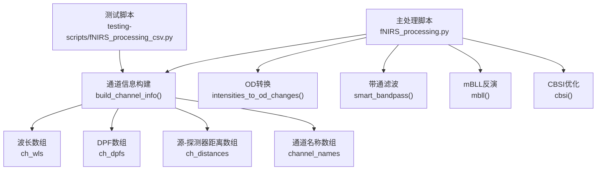
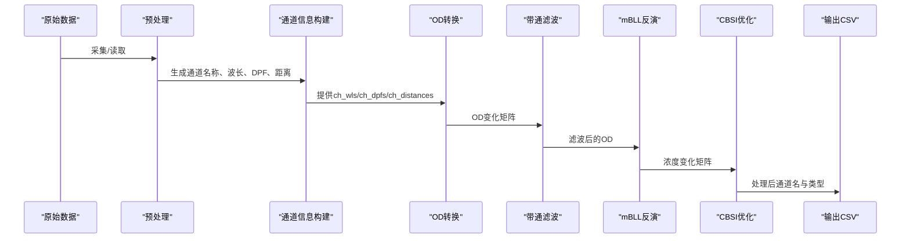
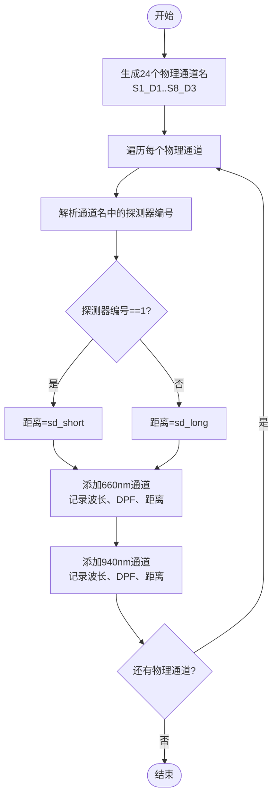
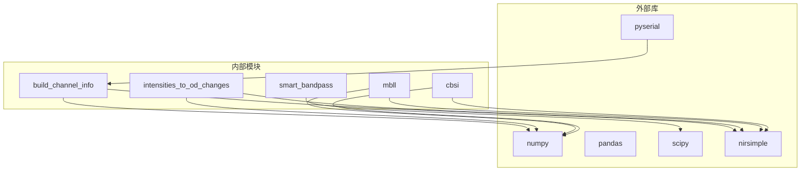

# 通道信息处理

<cite>
**本文档引用的文件**
- [fNIRS_processing.py](file://software/fNIRS_processing.py)
- [fNIRS_processing_csv.py](file://software/testing-scripts/fNIRS_processing_csv.py)
- [fNIRS_processing_pipeline.md](file://software/fNIRS_processing_pipeline.md)
- [config.py](file://software/config.py)
- [requirements.txt](file://software/requirements.txt)
- [README.md](file://software/README.md)
</cite>

## 目录
1. [简介](#简介)
2. [项目结构](#项目结构)
3. [核心组件](#核心组件)
4. [架构总览](#架构总览)
5. [详细组件分析](#详细组件分析)
6. [依赖关系分析](#依赖关系分析)
7. [性能考虑](#性能考虑)
8. [故障排除指南](#故障排除指南)
9. [结论](#结论)
10. [附录](#附录)

## 简介
本文件面向通道信息处理模块，系统性阐述从物理通道到光谱通道的映射关系，涵盖8个传感器组与3个探测器的组合方式、波长信息、DPF系数与源-探测器距离的构建流程、年龄相关的Doppler偏移因子(DPF)计算与应用、通道名称生成规则与数据结构组织、通道信息验证与一致性检查机制，以及通道配置的最佳实践与参数调优建议。目标是帮助开发者与使用者准确理解并正确配置通道信息，确保后续光学密度转换、带通滤波与改进的比尔-朗伯定律(mBLL)反演等处理步骤获得高质量输入。

## 项目结构
通道信息处理相关的核心代码位于软件目录下的两个脚本中：
- 主处理脚本：负责完整的数据采集、预处理、通道信息构建、OD转换、带通滤波、mBLL反演与CBSI优化，并输出CSV结果。
- 测试脚本：提供与主脚本一致的通道信息构建逻辑，便于独立验证与演示。

图表来源
- [fNIRS_processing.py](file://software/fNIRS_processing.py#L278-L302)
- [fNIRS_processing_csv.py](file://software/testing-scripts/fNIRS_processing_csv.py#L280-L303)

章节来源
- [fNIRS_processing.py](file://software/fNIRS_processing.py#L278-L302)
- [fNIRS_processing_csv.py](file://software/testing-scripts/fNIRS_processing_csv.py#L280-L303)

## 核心组件
- 物理通道到光谱通道映射
  - 8个传感器组 × 3个探测器 = 24个物理通道
  - 每个物理通道在两个波长（660 nm 与 940 nm）下测量，形成48条光谱通道
- 通道名称生成规则
  - 格式：Sg_Dd，其中g ∈ [1..8]为传感器组号，d ∈ [1..3]为探测器编号
  - 每个物理通道对应两条光谱通道，分别标记660 nm与940 nm
- 波长信息构建
  - 交替填充660.0与940.0，长度为48
- DPF系数构建
  - 通过年龄与波长计算得到，长度为48
- 源-探测器距离构建
  - 探测器1使用短距离sd_short，探测器2/3使用长距离sd_long，长度为48

章节来源
- [fNIRS_processing.py](file://software/fNIRS_processing.py#L278-L302)
- [fNIRS_processing_csv.py](file://software/testing-scripts/fNIRS_processing_csv.py#L280-L303)

## 架构总览
通道信息处理在整体数据流中的位置如下：

图表来源
- [fNIRS_processing.py](file://software/fNIRS_processing.py#L394-L418)
- [fNIRS_processing_csv.py](file://software/testing-scripts/fNIRS_processing_csv.py#L395-L418)

## 详细组件分析

### 组件A：通道信息构建（build_channel_info）
- 功能概述
  - 生成48条通道信息：通道名称、波长、DPF、源-探测器距离
  - 依据年龄计算DPF，依据探测器编号选择距离
- 数据结构
  - channel_names：长度48的字符串数组，形如"Sg_Dd"
  - ch_wls：长度48的浮点数组，交替为660.0与940.0
  - ch_dpfs：长度48的浮点数组，按年龄与波长计算
  - ch_distances：长度48的浮点数组，D1用sd_short，D2/D3用sd_long
- 关键流程
  - 生成24个物理通道名（S1_D1到S8_D3）
  - 对每个物理通道追加两条光谱通道（660 nm与940 nm）
  - 从通道名解析探测器编号，决定距离
  - 调用DPF计算函数，按波长与年龄生成DPF
- 错误处理与边界条件
  - 通道名格式必须符合"Sg_Dd"规范
  - 探测器编号解析失败时需进行异常处理（建议在调用方或工具函数中校验）

图表来源
- [fNIRS_processing.py](file://software/fNIRS_processing.py#L285-L302)
- [fNIRS_processing_csv.py](file://software/testing-scripts/fNIRS_processing_csv.py#L286-L303)

章节来源
- [fNIRS_processing.py](file://software/fNIRS_processing.py#L278-L302)
- [fNIRS_processing_csv.py](file://software/testing-scripts/fNIRS_processing_csv.py#L280-L303)

### 组件B：年龄相关的DPF计算与应用
- 计算来源
  - DPF通过外部库函数按波长与年龄计算，随后复制到两条光谱通道
- 影响范围
  - DPF参与mBLL反演，影响等效路径修正，进而影响反演量级与准确性
- 实践要点
  - 年龄输入应与被试实际年龄一致
  - 不同波长的DPF不同，需分别计算并存储

章节来源
- [fNIRS_processing.py](file://software/fNIRS_processing.py#L295-L301)
- [fNIRS_processing_csv.py](file://software/testing-scripts/fNIRS_processing_csv.py#L296-L302)
- [fNIRS_processing_pipeline.md](file://software/fNIRS_processing_pipeline.md#L412-L416)

### 组件C：波长与距离的构建策略
- 波长策略
  - 交替为660.0与940.0，保证每条物理通道的两个光谱通道相邻
- 距离策略
  - D1使用短距离（sd_short），D2/D3使用长距离（sd_long）
  - 该策略与硬件布局一致，确保mBLL反演的几何一致性

章节来源
- [fNIRS_processing.py](file://software/fNIRS_processing.py#L294-L301)
- [fNIRS_processing_csv.py](file://software/testing-scripts/fNIRS_processing_csv.py#L295-L302)

### 组件D：通道名称生成规则
- 规则
  - Sg_Dd：g为传感器组（1-8），d为探测器（1-3）
- 作用
  - 作为mBLL反演后的通道名保留，便于后续可视化与导出
  - 与数据结构中的索引顺序保持一致

章节来源
- [fNIRS_processing.py](file://software/fNIRS_processing.py#L285-L287)
- [fNIRS_processing_csv.py](file://software/testing-scripts/fNIRS_processing_csv.py#L286-L288)

### 组件E：数据结构组织与一致性检查
- 结构组织
  - 48元素数组：channel_names、ch_wls、ch_dpfs、ch_distances
  - 一一对应：每个物理通道的两条光谱通道共享同一组参数（除波长外）
- 一致性检查建议
  - 长度检查：确保四个数组长度均为48
  - 波长与DPF配对：660 nm与940 nm的DPF成对出现
  - 距离与探测器编号匹配：D1距离与D2/D3距离区分明确
  - 通道名格式校验：确保"Sg_Dd"格式正确
  - 年龄与DPF范围：DPF应在合理范围内（可结合外部库文档）

章节来源
- [fNIRS_processing.py](file://software/fNIRS_processing.py#L288-L302)
- [fNIRS_processing_csv.py](file://software/testing-scripts/fNIRS_processing_csv.py#L289-L303)

### 组件F：通道信息在处理流水线中的应用
- 应用点
  - OD转换：使用ch_wls与ch_distances
  - 带通滤波：基于采样率与频率设置
  - mBLL反演：使用ch_wls、ch_dpfs、ch_distances与摩尔消光系数表
  - CBSI优化：基于mBLL输出的通道名与类型
- 输入输出形状
  - 输入：OD变化矩阵约(48, N)
  - 输出：浓度变化矩阵约(48, N)，并返回新的通道名与类型

章节来源
- [fNIRS_processing.py](file://software/fNIRS_processing.py#L397-L418)
- [fNIRS_processing_csv.py](file://software/testing-scripts/fNIRS_processing_csv.py#L399-L418)
- [fNIRS_processing_pipeline.md](file://software/fNIRS_processing_pipeline.md#L402-L424)

## 依赖关系分析
- 外部库依赖
  - nirsimple：提供DPF计算、OD转换、mBLL反演、CBSI优化等核心功能
  - numpy/pandas/scipy：数据处理与信号处理
  - pyserial：串口通信（采集模式）
- 内部模块依赖
  - 通道信息构建函数被主处理脚本与测试脚本共同调用
  - OD转换、带通滤波、mBLL与CBSI在主处理脚本中串联使用

图表来源
- [requirements.txt](file://software/requirements.txt#L1-L15)
- [fNIRS_processing.py](file://software/fNIRS_processing.py#L16-L21)

章节来源
- [requirements.txt](file://software/requirements.txt#L1-L15)
- [fNIRS_processing.py](file://software/fNIRS_processing.py#L16-L21)

## 性能考虑
- 通道数量与内存占用
  - 48通道的OD矩阵与后续处理在内存中以(48, N)形式存储，N为时间点数
  - 建议在大规模数据时关注内存峰值与I/O瓶颈
- 滤波与降采样
  - 带通滤波采用零相位设计，避免相位失真
  - 当采样率较高时，先降采样再滤波可降低计算复杂度
- DPF计算
  - DPF按波长与年龄计算，计算量较小，但需确保输入年龄与波长数组严格对齐

## 故障排除指南
- 通道信息不一致
  - 现象：通道名、波长、DPF、距离长度不为48或不匹配
  - 排查：确认build_channel_info的循环是否覆盖所有24个物理通道，且每条通道追加两条光谱通道
- 探测器距离错误
  - 现象：D1与D2/D3距离混淆
  - 排查：检查通道名解析逻辑与距离选择分支
- DPF异常
  - 现象：DPF值异常或NaN
  - 排查：确认年龄输入有效，波长与年龄传参顺序正确
- OD转换与滤波失败
  - 现象：OD矩阵形状不匹配或滤波报错
  - 排查：确认输入样本矩阵形状为(48, N)，采样率dt/fs计算正确

章节来源
- [fNIRS_processing.py](file://software/fNIRS_processing.py#L288-L302)
- [fNIRS_processing.py](file://software/fNIRS_processing.py#L397-L404)

## 结论
通道信息处理模块通过严格的物理通道到光谱通道映射、明确的波长与距离构建策略、以及基于年龄的DPF计算，为后续的OD转换、带通滤波与mBLL反演提供了高质量的输入。遵循本文档的命名规则、数据结构组织与一致性检查机制，可显著提升系统的稳定性与可维护性。建议在实际部署中结合硬件参数与被试特征，对sd_short、sd_long与年龄输入进行校准与验证。

## 附录

### 最佳实践与参数调优建议
- 通道配置
  - 严格遵循"Sg_Dd"命名规范，确保与硬件布局一致
  - 确保每个物理通道的两条光谱通道相邻放置，便于后续处理
- 波长与距离
  - 660 nm与940 nm交替放置，保证mBLL系数矩阵的正确性
  - sd_short与sd_long应与硬件实际布局一致，避免几何误差
- 年龄与DPF
  - 年龄输入应与被试实际年龄一致，避免DPF偏差
  - 如需跨人群应用，建议参考外部库提供的年龄-DPF关系
- 数据结构与一致性
  - 在构建完成后进行长度与配对检查
  - 通道名、波长、DPF、距离四者必须严格一一对应
- 处理参数
  - 带通滤波的低通与高通截止频率可根据被试生理特性调整
  - 摩尔消光系数表可选择适合的数据库（默认wray）

章节来源
- [fNIRS_processing.py](file://software/fNIRS_processing.py#L278-L302)
- [fNIRS_processing.py](file://software/fNIRS_processing.py#L400-L404)
- [fNIRS_processing_pipeline.md](file://software/fNIRS_processing_pipeline.md#L402-L410)