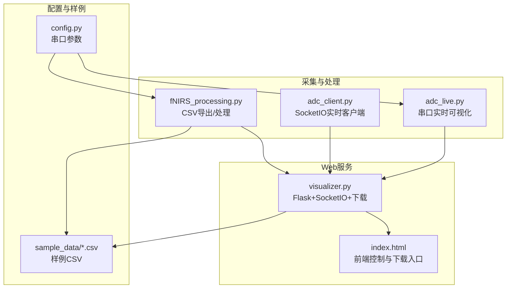
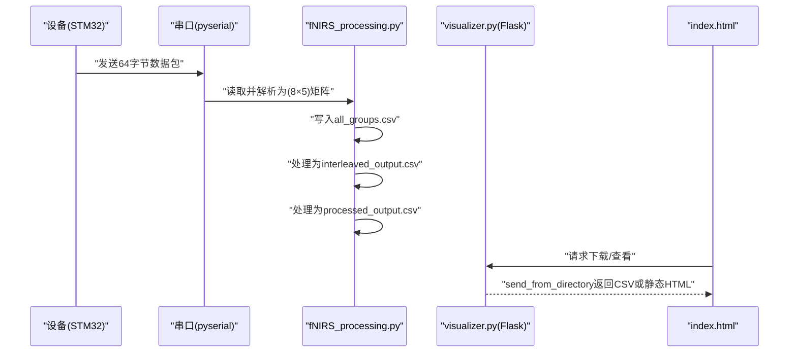
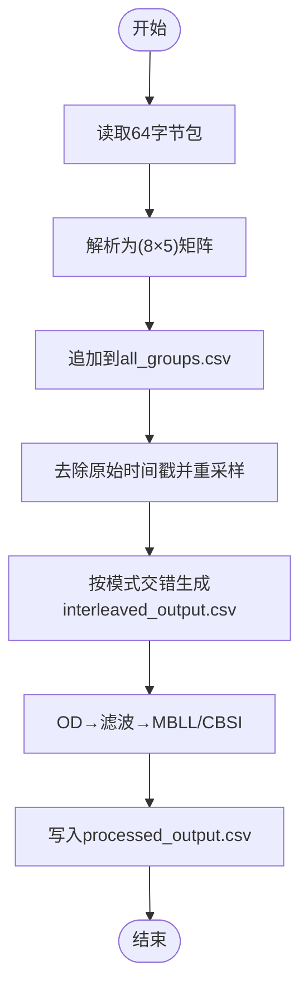
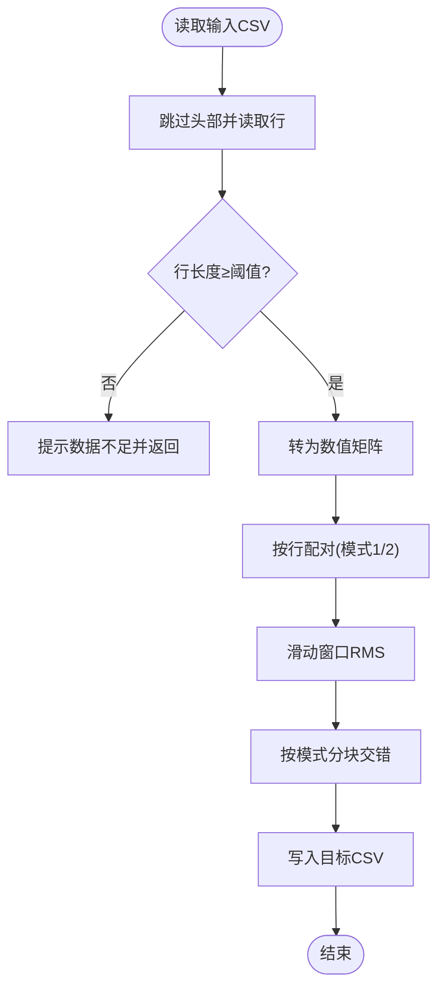
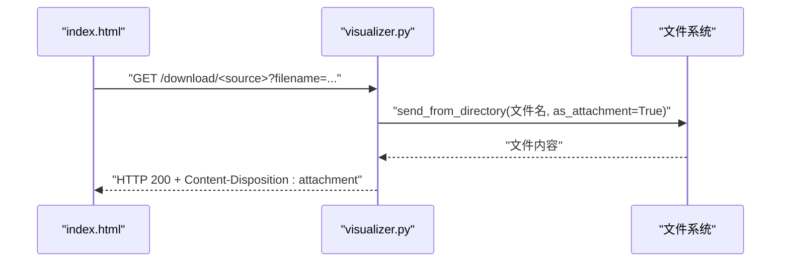
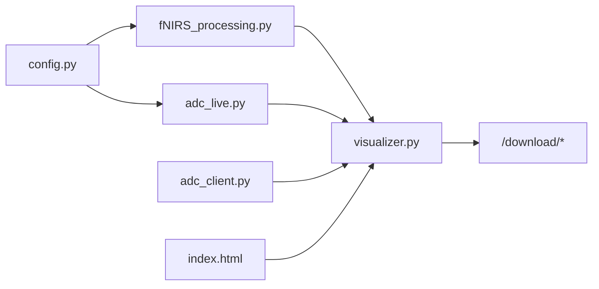

# 文件处理与存储

<cite>
**本文引用的文件**
- [fNIRS_processing.py](file://software/fNIRS_processing.py)
- [visualizer.py](file://software/visualizer.py)
- [config.py](file://software/config.py)
- [index.html](file://software/index.html)
- [adc_live.py](file://software/adc_live.py)
- [adc_client.py](file://software/adc_client.py)
- [fNIRS_processing_csv.py](file://software/testing-scripts/fNIRS_processing_csv.py)
- [all_groups.csv](file://software/sample_data/all_groups.csv)
- [interleaved_output.csv](file://software/sample_data/interleaved_output.csv)
- [processed_output.csv](file://software/sample_data/processed_output.csv)
</cite>

## 目录
1. [简介](#简介)
2. [项目结构](#项目结构)
3. [核心组件](#核心组件)
4. [架构总览](#架构总览)
5. [详细组件分析](#详细组件分析)
6. [依赖关系分析](#依赖关系分析)
7. [性能考量](#性能考量)
8. [故障排查指南](#故障排查指南)
9. [结论](#结论)
10. [附录](#附录)

## 简介
本文件聚焦于“文件处理与存储”模块，围绕 fNIRS 数据采集、CSV 格式设计、实时数据捕获、格式转换、文件写入、导入校验、下载与流式传输等能力进行系统化技术说明。文档同时覆盖数据导出流程（从原始 ADC 到处理后 CSV）、数据导入与验证（CSV 解析与错误处理）、文件命名与存储位置、以及大文件处理与压缩策略建议。

## 项目结构
软件侧主要由以下模块构成：
- 数据采集与处理：fNIRS_processing.py、adc_live.py、adc_client.py
- Web 可视化与控制：visualizer.py、index.html
- 配置：config.py
- 测试脚本与样例数据：testing-scripts/fNIRS_processing_csv.py、sample_data/*.csv

图表来源
- [fNIRS_processing.py](file://software/fNIRS_processing.py#L1-L496)
- [visualizer.py](file://software/visualizer.py#L1-L947)
- [config.py](file://software/config.py#L1-L13)
- [index.html](file://software/index.html#L1-L750)
- [adc_live.py](file://software/adc_live.py#L1-L210)
- [adc_client.py](file://software/adc_client.py#L1-L181)
- [fNIRS_processing_csv.py](file://software/testing-scripts/fNIRS_processing_csv.py#L1-L497)
- [all_groups.csv](file://software/sample_data/all_groups.csv#L1-L2)
- [interleaved_output.csv](file://software/sample_data/interleaved_output.csv#L1-L2)
- [processed_output.csv](file://software/sample_data/processed_output.csv#L1-L2)

章节来源
- [fNIRS_processing.py](file://software/fNIRS_processing.py#L1-L496)
- [visualizer.py](file://software/visualizer.py#L1-L947)
- [config.py](file://software/config.py#L1-L13)
- [index.html](file://software/index.html#L1-L750)
- [adc_live.py](file://software/adc_live.py#L1-L210)
- [adc_client.py](file://software/adc_client.py#L1-L181)
- [fNIRS_processing_csv.py](file://software/testing-scripts/fNIRS_processing_csv.py#L1-L497)
- [all_groups.csv](file://software/sample_data/all_groups.csv#L1-L2)
- [interleaved_output.csv](file://software/sample_data/interleaved_output.csv#L1-L2)
- [processed_output.csv](file://software/sample_data/processed_output.csv#L1-L2)

## 核心组件
- CSV 导出与处理管线：负责原始 ADC 数据捕获、模式切换块交错、阈值与滤波、RMS 能量计算、时间戳重采样与写入 CSV；随后执行 OD 转换、带通滤波与 MBLL/CBSI 计算，输出处理后 CSV。
- Web 下载与静态图：提供 CSV 下载接口、静态 ADC 图表生成、mBLL 激活区域高亮更新。
- 实时采集与可视化：串口线程读取、包解析、队列缓存、GUI 实时绘制。
- 配置中心：统一串口设备、波特率、超时设置。

章节来源
- [fNIRS_processing.py](file://software/fNIRS_processing.py#L187-L496)
- [visualizer.py](file://software/visualizer.py#L589-L733)
- [adc_live.py](file://software/adc_live.py#L48-L210)
- [config.py](file://software/config.py#L7-L13)

## 架构总览
整体流程自下而上分为三层：
- 设备层：STM32 通过 USB CDC 发送固定长度数据包（每包 64 字节）。
- 采集与处理层：Python 串口读取、包解析、CSV 写入、数据处理（滤波、RMS、MBLL/CBSI）。
- 展示与交互层：Flask 提供下载与静态图接口，前端页面触发下载、查看动画等。

图表来源
- [fNIRS_processing.py](file://software/fNIRS_processing.py#L160-L234)
- [visualizer.py](file://software/visualizer.py#L714-L733)
- [index.html](file://software/index.html#L725-L746)

## 详细组件分析

### CSV 数据格式设计与实现
- 文件结构定义
  - 原始 CSV（all_groups.csv）：首列为时间戳（秒），随后按组顺序排列四列（Short/Long1/Long2/Emitter），共 8 组 × 4 列。
  - 中间 CSV（interleaved_output.csv）：去除原始时间戳，新增“Time (s)”列，按固定增量重采样，便于后续处理。
  - 处理后 CSV（processed_output.csv）：以“通道名_类型”作为列名（如 hbo/hbr），逐行记录浓度变化。
- 字段规范与数据类型
  - 时间戳：浮点型（秒），用于同步与滤波计算。
  - ADC 强度：整型（12 位有效值范围），经反转变换后参与 RMS 与 OD 计算。
  - 模式列（Emitter）：整型（模式标识），用于分块与交错。
- 数据类型约束
  - 严格按 8×5 的包结构解析，缺失或不完整包将被丢弃。
  - 写入阶段使用 flush 保证落盘及时性；处理阶段采用 NumPy/SciPy 进行向量化运算。

章节来源
- [fNIRS_processing.py](file://software/fNIRS_processing.py#L202-L207)
- [fNIRS_processing.py](file://software/fNIRS_processing.py#L354-L357)
- [fNIRS_processing.py](file://software/fNIRS_processing.py#L421-L422)
- [fNIRS_processing_csv.py](file://software/testing-scripts/fNIRS_processing_csv.py#L204-L207)
- [fNIRS_processing_csv.py](file://software/testing-scripts/fNIRS_processing_csv.py#L354-L357)
- [fNIRS_processing_csv.py](file://software/testing-scripts/fNIRS_processing_csv.py#L421-L422)

### 数据导出实现（实时捕获、格式转换、文件写入）
- 实时数据捕获
  - 串口读取固定长度包，解析为 8 行 5 列矩阵，写入 all_groups.csv。
  - 支持信号停止标志，确保优雅退出。
- 格式转换
  - 去除原始时间戳，按固定增量插入新时间戳并四舍五入避免浮点误差。
  - RMS 能量计算与模式块交错，生成 interleaved_output.csv。
  - OD 转换、带通滤波、MBLL/CBSI 计算，生成 processed_output.csv。
- 文件写入
  - 使用 CSV Writer 写入头与逐行数据，flush 保障落盘。
  - 输出 CSV 采用“逐行写入”，避免一次性加载到内存。

图表来源
- [fNIRS_processing.py](file://software/fNIRS_processing.py#L187-L234)
- [fNIRS_processing.py](file://software/fNIRS_processing.py#L476-L496)
- [fNIRS_processing.py](file://software/fNIRS_processing.py#L397-L434)

章节来源
- [fNIRS_processing.py](file://software/fNIRS_processing.py#L187-L234)
- [fNIRS_processing.py](file://software/fNIRS_processing.py#L476-L496)
- [fNIRS_processing.py](file://software/fNIRS_processing.py#L397-L434)

### 数据导入机制（文件验证、格式解析、错误处理）
- 文件验证
  - 读取 CSV 时跳过头部，按行转为数值矩阵；过滤长度不足的行。
  - 若行数少于阈值，直接返回提示，避免无效处理。
- 格式解析
  - 按列顺序解析各组的 Short/Long1/Long2/Emitter，结合模式列进行分块与交错。
  - RMS 计算基于发射器状态变化的片段，支持半切分以提升分辨率。
- 错误处理
  - 串口读取异常捕获并打印；CSV 读取异常捕获并提示。
  - 模式切换与交错过程对越界行进行重复填充，保证输出完整性。

图表来源
- [fNIRS_processing.py](file://software/fNIRS_processing.py#L366-L378)
- [fNIRS_processing.py](file://software/fNIRS_processing.py#L380-L391)
- [fNIRS_processing.py](file://software/fNIRS_processing.py#L474-L477)

章节来源
- [fNIRS_processing.py](file://software/fNIRS_processing.py#L366-L378)
- [fNIRS_processing.py](file://software/fNIRS_processing.py#L380-L391)
- [fNIRS_processing.py](file://software/fNIRS_processing.py#L474-L477)

### 文件管理与备份策略
- 文件命名规则
  - all_groups.csv：原始 ADC 日志。
  - interleaved_output.csv：去时间戳、重采样、交错后的中间产物。
  - processed_output.csv：处理后 CSV（通道_类型列）。
- 存储位置
  - 默认在当前工作目录生成 CSV；Web 下载接口从当前目录返回文件。
- 清理机制
  - 当前实现未内置自动清理策略；建议在生产环境增加轮转与保留期策略（例如按天/周归档）。

章节来源
- [fNIRS_processing.py](file://software/fNIRS_processing.py#L487-L496)
- [visualizer.py](file://software/visualizer.py#L714-L733)

### 大文件处理优化（分块读取与内存管理）
- 分块读取
  - 串口读取采用固定包大小（64 字节），避免一次性读取大块导致阻塞。
  - CSV 写入采用逐行写入，避免将全部样本加载至内存。
- 内存管理
  - 处理阶段使用 NumPy 数组与 SciPy 滤波器，尽量保持向量化操作。
  - 对于长序列，可考虑分段处理（如分批 OD 转换、分批滤波）以降低峰值内存占用。

章节来源
- [fNIRS_processing.py](file://software/fNIRS_processing.py#L219-L227)
- [fNIRS_processing.py](file://software/fNIRS_processing.py#L397-L405)

### 数据压缩与存储格式选择（性能与容量权衡）
- 当前实现
  - 采用纯文本 CSV，便于人类阅读与工具链兼容。
- 压缩与格式建议
  - 压缩：gzip/bz2 可显著降低容量，但会增加 CPU 开销与 I/O 复杂度。
  - 二进制格式：如 HDF5/Parquet，适合大规模数据集，具备列式存储与索引能力，利于查询与分析。
  - 选择原则：若侧重易用性与跨平台互操作，优先 CSV；若侧重吞吐与容量，优先二进制格式并配套压缩。

[本节为通用指导，不直接分析具体文件]

### 文件下载功能实现（HTTP 响应与流式传输）
- 接口设计
  - /download/<source>：根据 source 返回对应 CSV 文件（ADC 或 mBLL）。
  - 前端通过 prompt 获取用户自定义文件名，再发起下载。
- HTTP 响应
  - 使用 Flask 的 send_from_directory，设置 as_attachment=True，触发浏览器下载。
  - 支持动态文件名参数，增强用户体验。
- 流式传输
  - 当前为一次性返回文件；对于超大 CSV，可考虑分块读取与流式响应以减少内存占用。

图表来源
- [index.html](file://software/index.html#L725-L733)
- [visualizer.py](file://software/visualizer.py#L714-L733)

章节来源
- [index.html](file://software/index.html#L725-L733)
- [visualizer.py](file://software/visualizer.py#L714-L733)

## 依赖关系分析
- fNIRS_processing.py 依赖 config.py 提供串口参数；负责 CSV 写入与处理。
- visualizer.py 依赖 Flask/SocketIO 提供下载与静态图接口；调用系统子进程启动采集与处理脚本。
- index.html 通过前端 AJAX 触发下载与查看，依赖后端路由。
- adc_live.py/adc_client.py 与 visualizer.py 协同，提供实时数据展示与控制。

图表来源
- [config.py](file://software/config.py#L7-L13)
- [fNIRS_processing.py](file://software/fNIRS_processing.py#L20-L23)
- [visualizer.py](file://software/visualizer.py#L40-L44)
- [index.html](file://software/index.html#L725-L733)

章节来源
- [config.py](file://software/config.py#L7-L13)
- [fNIRS_processing.py](file://software/fNIRS_processing.py#L20-L23)
- [visualizer.py](file://software/visualizer.py#L40-L44)
- [index.html](file://software/index.html#L725-L733)

## 性能考量
- 串口读取
  - 固定包大小与缓冲拼接，避免阻塞；线程睡眠可降低 CPU 占用。
- CSV 写入
  - flush 频率需平衡实时性与磁盘写入开销；可考虑批量写入策略。
- 处理阶段
  - 向量化与并行化（如多核/多进程）可加速滤波与变换；注意内存峰值。
- 下载阶段
  - 超大文件建议分块读取与流式响应，避免一次性加载至内存。

[本节为通用指导，不直接分析具体文件]

## 故障排查指南
- 串口无数据
  - 检查串口参数（端口、波特率、超时）是否正确；确认设备连接与驱动。
- CSV 写入异常
  - 检查磁盘空间与权限；确认路径存在且可写。
- 处理结果为空或异常
  - 检查 CSV 行长度与列数是否符合预期；确认模式列与发射器状态变化是否正确。
- 下载失败
  - 检查文件是否存在；确认路由参数与文件名编码；浏览器是否拦截下载。

章节来源
- [config.py](file://software/config.py#L7-L13)
- [fNIRS_processing.py](file://software/fNIRS_processing.py#L219-L234)
- [visualizer.py](file://software/visualizer.py#L714-L733)

## 结论
本模块围绕 CSV 数据格式与文件处理建立了完整的采集、转换、存储与下载链路。通过固定包解析、逐行写入与向量化处理，兼顾了实时性与可维护性。建议在生产环境中引入文件轮转、压缩与二进制格式选项，并对超大文件采用流式下载与分块处理，以进一步提升性能与可靠性。

## 附录
- 样例 CSV 文件
  - all_groups.csv、interleaved_output.csv、processed_output.csv 用于演示与测试。
- 相关脚本
  - testing-scripts/fNIRS_processing_csv.py 提供离线处理流程参考。

章节来源
- [all_groups.csv](file://software/sample_data/all_groups.csv#L1-L2)
- [interleaved_output.csv](file://software/sample_data/interleaved_output.csv#L1-L2)
- [processed_output.csv](file://software/sample_data/processed_output.csv#L1-L2)
- [fNIRS_processing_csv.py](file://software/testing-scripts/fNIRS_processing_csv.py#L446-L497)