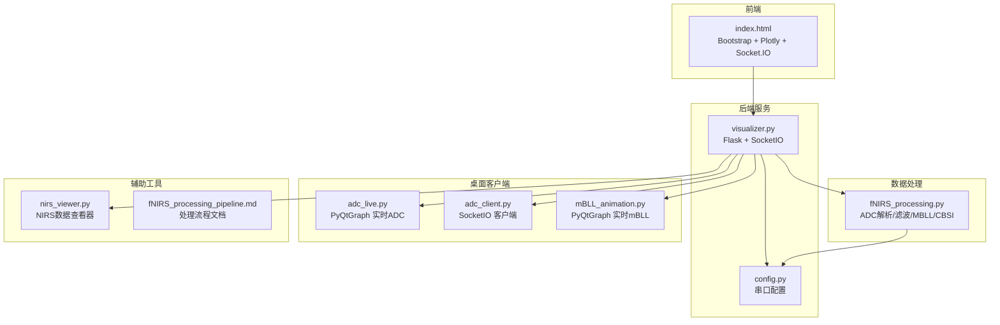
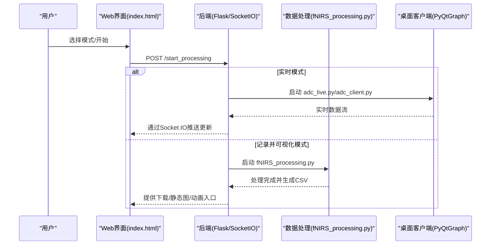
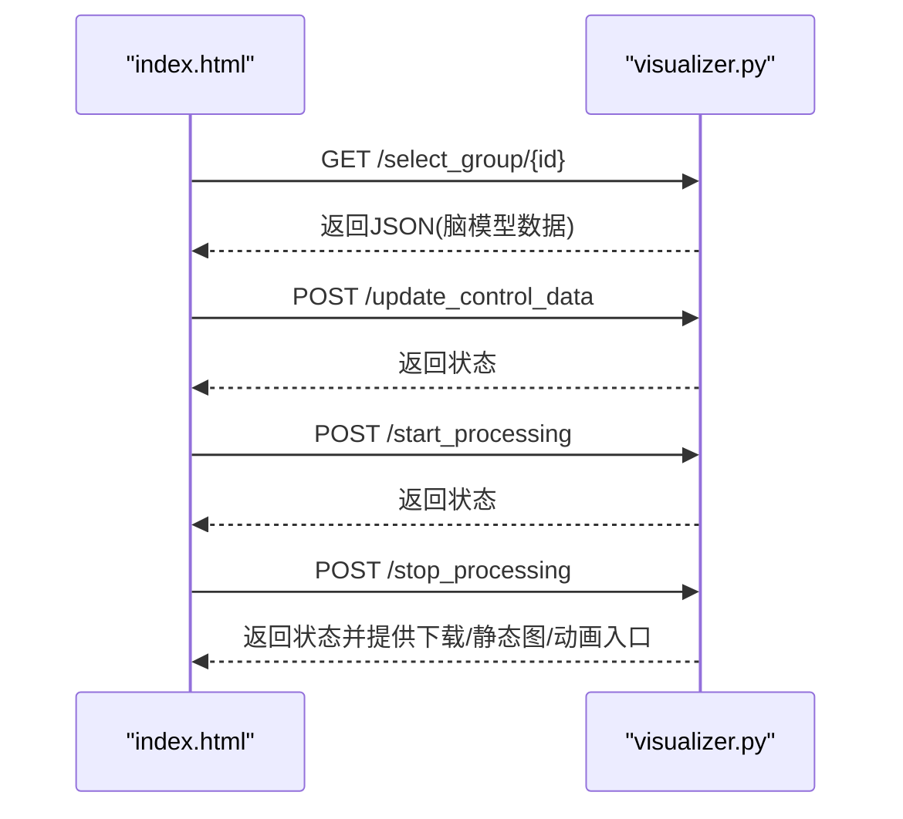
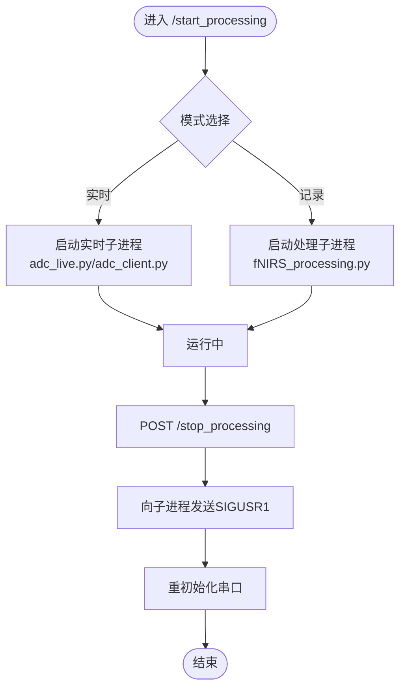
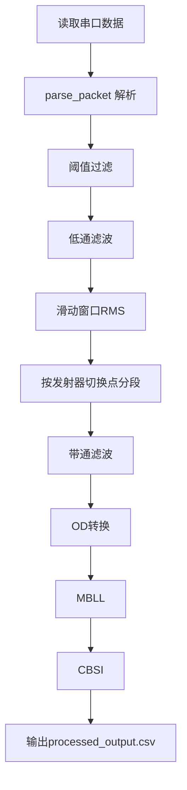
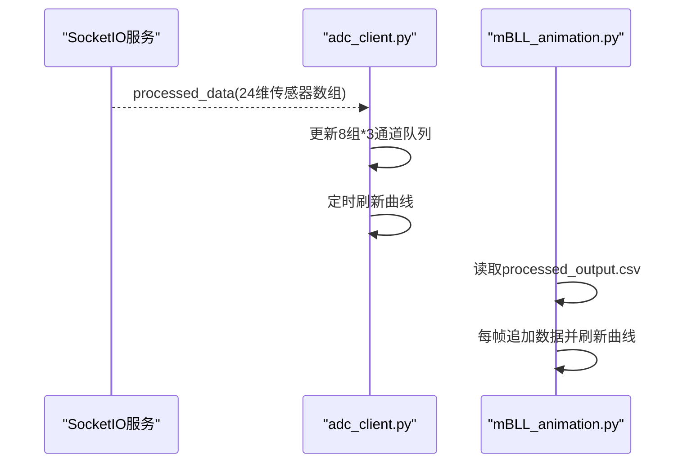
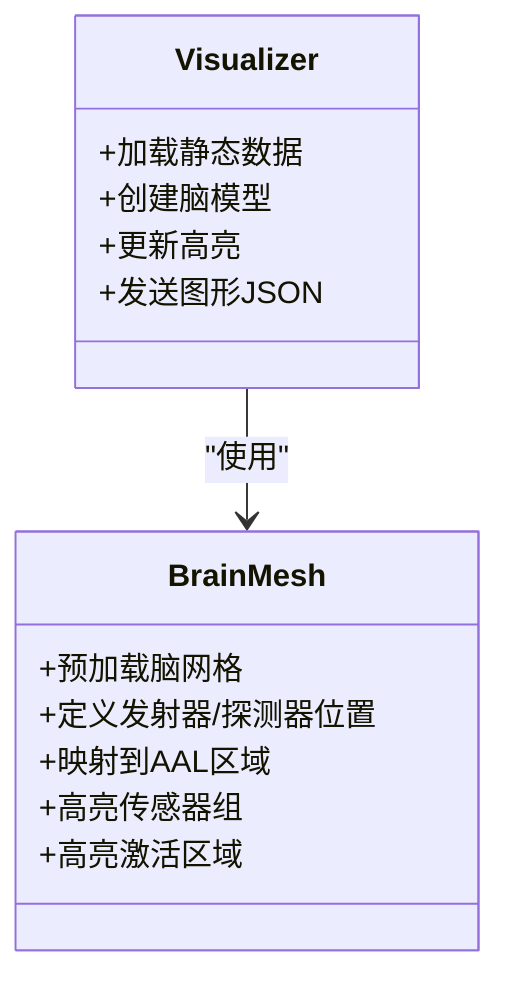
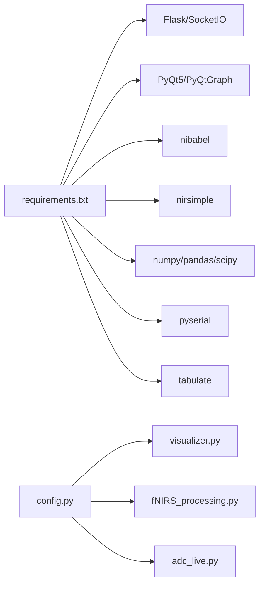

# 软件系统

<cite>
**本文引用的文件**
- [README.md](file://software/README.md)
- [index.html](file://software/index.html)
- [config.py](file://software/config.py)
- [fNIRS_processing.py](file://software/fNIRS_processing.py)
- [visualizer.py](file://software/visualizer.py)
- [nirs_viewer.py](file://software/nirs_viewer.py)
- [requirements.txt](file://software/requirements.txt)
- [adc_live.py](file://software/adc_live.py)
- [adc_client.py](file://software/adc_client.py)
- [adc_mock_server.py](file://software/adc_mock_server.py)
- [mBLL_animation.py](file://software/mBLL_animation.py)
- [fNIRS_processing_pipeline.md](file://software/fNIRS_processing_pipeline.md)
</cite>

## 目录
1. [简介](#简介)
2. [项目结构](#项目结构)
3. [核心组件](#核心组件)
4. [架构总览](#架构总览)
5. [详细组件分析](#详细组件分析)
6. [依赖关系分析](#依赖关系分析)
7. [性能考量](#性能考量)
8. [故障排查指南](#故障排查指南)
9. [结论](#结论)
10. [附录](#附录)

## 简介
本项目是一个基于 Python 的 Web 应用程序，用于采集、处理与可视化 fNIRS（近红外光谱）数据。系统采用 Flask + Socket.IO 实时通信，结合 Plotly 和 PyQtGraph 提供丰富的可视化能力；后端通过 ADC 数据解析、滑动窗口 RMS 计算、带通滤波以及 Modified Beer-Lambert Law（MBLL）等算法完成数据处理；前端提供响应式 Web 界面，支持 3D 脑模型渲染、实时图表与静态图表生成，并具备 CSV 导入导出能力。系统同时提供演示模式，便于在无硬件连接的情况下进行开发与测试。

## 项目结构
软件目录包含以下关键模块：
- Web 前端：index.html（Bootstrap + Plotly + Socket.IO）
- Web 后端：visualizer.py（Flask + SocketIO，负责控制、数据路由与下载）
- 数据处理：fNIRS_processing.py（ADC 解析、滑动窗口 RMS、滤波、MBLL/CBSI）
- 桌面客户端：adc_live.py、adc_client.py、mBLL_animation.py
- 辅助工具：nirs_viewer.py（NIRS 数据查看器）
- 配置与依赖：config.py、requirements.txt
- 文档与说明：README.md、fNIRS_processing_pipeline.md

**图示来源**
- [visualizer.py:589-595](file://software/visualizer.py#L589-L595)
- [index.html:305-306](file://software/index.html#L305-L306)
- [fNIRS_processing.py:20-23](file://software/fNIRS_processing.py#L20-L23)
- [config.py:7-12](file://software/config.py#L7-L12)
- [adc_live.py:18-18](file://software/adc_live.py#L18-L18)
- [adc_client.py:49-85](file://software/adc_client.py#L49-L85)
- [mBLL_animation.py:44-46](file://software/mBLL_animation.py#L44-L46)
- [nirs_viewer.py:185-367](file://software/nirs_viewer.py#L185-L367)

**章节来源**
- [README.md:1-180](file://software/README.md#L1-L180)
- [requirements.txt:1-15](file://software/requirements.txt#L1-L15)

## 核心组件
- Web 前端：基于 Bootstrap 与 Plotly 构建，通过 Socket.IO 实时接收 3D 脑模型更新，支持传感器组高亮、发射器状态可视化与模式切换。
- Web 后端：Flask + SocketIO 服务器，提供路由接口（开始/停止处理、下载 CSV、选择传感器组、更新控制数据），并管理子进程与串口连接。
- 数据处理引擎：ADC 数据解析、阈值过滤、低通滤波、滑动窗口 RMS、带通滤波、OD 转换、MBLL、CBSI，输出 CSV 并支持静态/动画可视化。
- 桌面客户端：PyQtGraph 实时显示 ADC 与 mBLL 数据，支持全屏展示与交互。
- 辅助工具：NIRS 数据查看器（支持 .nirs/.csv），处理流程文档（详细算法说明）。

**章节来源**
- [index.html:1-750](file://software/index.html#L1-L750)
- [visualizer.py:589-947](file://software/visualizer.py#L589-L947)
- [fNIRS_processing.py:1-496](file://software/fNIRS_processing.py#L1-L496)
- [adc_live.py:1-210](file://software/adc_live.py#L1-L210)
- [adc_client.py:1-181](file://software/adc_client.py#L1-L181)
- [mBLL_animation.py:1-140](file://software/mBLL_animation.py#L1-L140)
- [nirs_viewer.py:1-368](file://software/nirs_viewer.py#L1-L368)

## 架构总览
系统采用"Web 控制 + 后端服务 + 数据处理 + 可视化"的分层架构：
- 用户通过浏览器访问 Web 界面，选择模式（实时/记录并可视化），后端启动相应子进程或直接读取串口。
- 处理引擎对原始 ADC 数据进行多步处理，生成 mBLL 浓度变化数据。
- 后端通过 Socket.IO 将 3D 脑模型更新推送到前端，同时提供静态图表与动画入口。
- 桌面客户端可独立运行，用于实时 ADC 或 mBLL 数据可视化。

**图示来源**
- [visualizer.py:646-711](file://software/visualizer.py#L646-L711)
- [index.html:632-723](file://software/index.html#L632-L723)
- [fNIRS_processing.py:448-496](file://software/fNIRS_processing.py#L448-L496)
- [adc_live.py:191-210](file://software/adc_live.py#L191-L210)
- [adc_client.py:174-176](file://software/adc_client.py#L174-L176)

## 详细组件分析

### Web 前端（index.html）
- 使用 Bootstrap 构建响应式布局，左侧为 3D 脑模型容器，右侧为控制面板（传感器组映射、MUX/发射器控制、模式选择）。
- 通过 Socket.IO 连接后端，监听 brain_mesh_update 事件以刷新 3D 图形。
- 支持模式切换（实时/记录并可视化），记录模式下提供下载 CSV、查看静态图、查看动画按钮。
- 发送控制数据到后端 /update_control_data，更新发射器颜色与状态。

**图示来源**
- [index.html:468-723](file://software/index.html#L468-L723)
- [visualizer.py:609-711](file://software/visualizer.py#L609-L711)

**章节来源**
- [index.html:1-750](file://software/index.html#L1-L750)

### Web 后端（visualizer.py）
- Flask + SocketIO 服务，提供以下路由：
  - GET /：返回 index.html
  - GET /update_graphs：返回当前脑模型 JSON
  - GET /select_group/{id}：按传感器组高亮脑模型
  - POST /update_control_data：更新发射器/MUX 控制状态并写入串口（非演示模式）
  - POST /start_processing：根据模式启动子进程（实时/记录）
  - POST /stop_processing：发送 SIGUSR1 停止子进程并重初始化串口
  - GET /download/{source}：下载 CSV（ADC 或 mBLL）
  - GET /view_static/{source}：生成并返回静态 Plotly HTML
  - GET /view_animation/{source}：触发后端动画（演示用途）
- 内部维护全局变量（控制数据、当前模式、传感器组映射、区域映射等），并通过队列与锁同步数据流。

**图示来源**
- [visualizer.py:646-711](file://software/visualizer.py#L646-L711)

**章节来源**
- [visualizer.py:589-947](file://software/visualizer.py#L589-L947)

### 数据处理引擎（fNIRS_processing.py）
- 串口配置来自 config.py，使用 pyserial 读取 64 字节包。
- 关键处理步骤：
  - parse_packet：解析 8 组传感器数据（短/长通道、发射器状态）。
  - threshold_filter：异常值抑制。
  - butter_lowpass_filter：低通滤波。
  - sliding_window_rms：按发射器切换点切分段并计算 RMS。
  - smart_bandpass：带通滤波（零相位）。
  - process_csv_dataset：OD 转换、MBLL、CBSI，输出 processed_output.csv。
- 支持信号量停止（SIGUSR1）优雅退出。

**图示来源**
- [fNIRS_processing.py:160-434](file://software/fNIRS_processing.py#L160-L434)
- [config.py:7-12](file://software/config.py#L7-L12)

**章节来源**
- [fNIRS_processing.py:1-496](file://software/fNIRS_processing.py#L1-L496)
- [fNIRS_processing_pipeline.md:1-592](file://software/fNIRS_processing_pipeline.md#L1-L592)

### 桌面客户端（PyQtGraph）
- adc_live.py：实时读取串口数据，按组显示 ADC 曲线，支持全屏与重置。
- adc_client.py：通过 SocketIO 接收处理后的传感器数组，实时绘制曲线。
- mBLL_animation.py：从 processed_output.csv 逐行读取，实时绘制 ΔHbO/ΔHbR 动画。

**图示来源**
- [adc_client.py:59-85](file://software/adc_client.py#L59-L85)
- [mBLL_animation.py:103-133](file://software/mBLL_animation.py#L103-L133)

**章节来源**
- [adc_live.py:1-210](file://software/adc_live.py#L1-L210)
- [adc_client.py:1-181](file://software/adc_client.py#L1-L181)
- [mBLL_animation.py:1-140](file://software/mBLL_animation.py#L1-L140)

### 3D 脑模型渲染与可视化
- visualizer.py 预加载 BrainMesh_Ch2_smoothed.nv 与 aal.nii，构建静态脑模型与传感器节点（发射器/探测器）。
- 支持按传感器组高亮、按激活区域着色（基于 AAL 区域映射与 KDTree 过滤）。
- 通过 Socket.IO 将 Plotly 图形 JSON 推送至前端，前端使用 Plotly.react 更新视图。

**图示来源**
- [visualizer.py:191-559](file://software/visualizer.py#L191-L559)

**章节来源**
- [visualizer.py:191-559](file://software/visualizer.py#L191-L559)

### 文件处理与存储（CSV 导入/导出）
- 下载：/download/{source} 根据 source 返回 all_groups.csv 或 processed_output.csv。
- 导入：nirs_viewer.py 支持 .nirs 与 .csv，自动识别通道类型（HbO/HbR/HbT）与源-探测器配对信息。
- 示例脚本：plot.py 展示如何在同一窗口对比 ADC 与 mBLL 数据。

**章节来源**
- [visualizer.py:714-732](file://software/visualizer.py#L714-L732)
- [nirs_viewer.py:110-182](file://software/nirs_viewer.py#L110-L182)

### Web 界面交互与响应式布局
- Bootstrap 卡片与网格布局，左侧 3D 脑模型容器占 8 列，右侧控制面板占 4 列。
- 控制面板包含：
  - 传感器组映射按钮组（8 组）
  - MUX 控制与发射器控制（含 Override 开关与 PWM 映射）
  - 模式选择（实时/记录并可视化），记录模式下可选择 ADC/mBLL 源
- 交互逻辑：
  - 选择组：GET /select_group/{id}，返回更新后的脑模型 JSON
  - 更新控制：POST /update_control_data，写入串口（非演示）
  - 开始/停止：POST /start_processing / /stop_processing
  - 下载/静态图/动画：GET /download / /view_static / /view_animation

**章节来源**
- [index.html:144-298](file://software/index.html#L144-L298)
- [visualizer.py:609-732](file://software/visualizer.py#L609-L732)

## 依赖关系分析
- Python 依赖：Flask、Flask-SocketIO、PyQt5/PyQtGraph、nibabel、nirsimple、numpy、pandas、scipy、pyserial、python-socketio、tabulate、eventlet。
- 串口配置：SERIAL_PORT、BAUD_RATE、TIMEOUT 来自 config.py，被 visualizer.py、fNIRS_processing.py、adc_live.py 共同使用。
- 模块耦合：
  - visualizer.py 与 fNIRS_processing.py 通过子进程协作，通过信号量（SIGUSR1）协调停止。
  - 前端通过 Socket.IO 与后端解耦，后端与处理引擎通过文件系统 CSV 输出衔接。

**图示来源**
- [requirements.txt:1-15](file://software/requirements.txt#L1-L15)
- [config.py:7-12](file://software/config.py#L7-L12)
- [visualizer.py:32-44](file://software/visualizer.py#L32-L44)
- [fNIRS_processing.py:20-23](file://software/fNIRS_processing.py#L20-L23)
- [adc_live.py:14-18](file://software/adc_live.py#L14-L18)

**章节来源**
- [requirements.txt:1-15](file://software/requirements.txt#L1-L15)
- [config.py:1-13](file://software/config.py#L1-L13)

## 性能考量
- 实时性：
  - Socket.IO 异步模式（eventlet/threading）提升并发处理能力。
  - 前端使用 Plotly.react 与增量更新，避免全量重绘。
- 数据吞吐：
  - 串口读取采用缓冲与分包解析，减少阻塞。
  - 处理引擎使用向量化操作（numpy/scipy），降低循环开销。
- 内存与队列：
  - visualizer.py 使用 Queue(maxsize=20) 限制内存占用，必要时丢弃旧数据。
- I/O 与 CSV：
  - CSV 写入使用 flush 保证实时性；处理阶段按需写入中间文件，避免重复计算。
- 滤波与降采样：
  - smart_bandpass 在满足目标采样率前提下进行零相位滤波，减少相位失真。

**章节来源**
- [visualizer.py:58-96](file://software/visualizer.py#L58-L96)
- [fNIRS_processing.py:136-158](file://software/fNIRS_processing.py#L136-L158)

## 故障排查指南
- 串口连接问题：
  - 检查 SERIAL_PORT 是否正确（Windows/macOS/Linux 设备路径不同）。
  - 确认 BAUD_RATE 与 TIMEOUT 设置合理。
- 后端无法启动或端口占用：
  - 查看端口占用情况，确保 8050（默认）可用。
- Socket.IO 连接失败：
  - 确认前端与后端在同一主机，网络可达。
  - 检查 CORS 配置与异步模式设置。
- 处理进程卡住或无法停止：
  - 使用 /stop_processing 触发 SIGUSR1，等待子进程优雅退出。
- CSV 导出为空：
  - 确认记录模式已结束并生成相应 CSV 文件。
- 3D 脑模型不显示：
  - 检查 BrainMesh_Ch2_smoothed.nv 与 aal.nii 是否存在且可读。
- 桌面客户端无数据：
  - 确认实时模式已启动，或 SocketIO 服务正常运行。

**章节来源**
- [visualizer.py:690-711](file://software/visualizer.py#L690-L711)
- [config.py:7-12](file://software/config.py#L7-L12)
- [index.html:305-306](file://software/index.html#L305-L306)

## 结论
该系统通过清晰的分层架构实现了 fNIRS 数据的采集、处理与可视化：Web 前端提供直观的交互体验，后端服务负责控制与数据路由，处理引擎完成复杂的信号处理与算法应用，桌面客户端提供补充的实时可视化能力。系统具备良好的扩展性与可维护性，适合在科研与教学场景中部署与使用。

## 附录
- 演示模式：命令行参数 demo 启用，跳过真实串口读取，便于快速验证界面与流程。
- 处理流程文档：fNIRS_processing_pipeline.md 详细描述了数据处理链路与算法实现。

**章节来源**
- [README.md:45-100](file://software/README.md#L45-L100)
- [fNIRS_processing_pipeline.md:447-497](file://software/fNIRS_processing_pipeline.md#L447-L497)