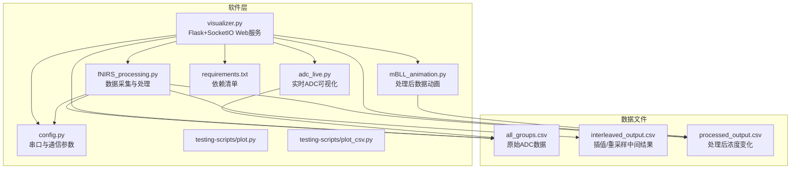
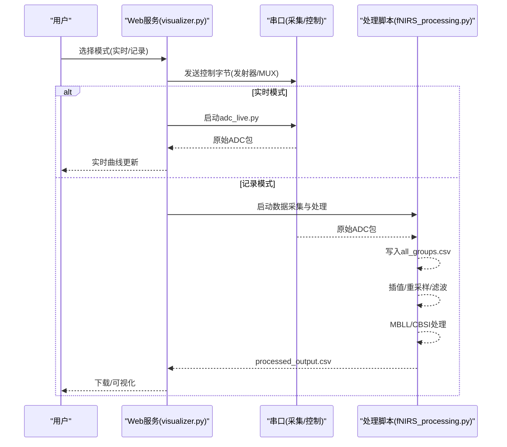
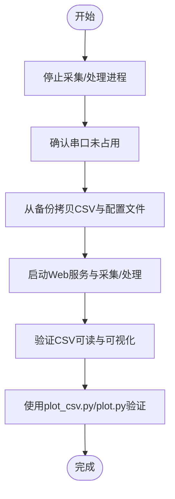
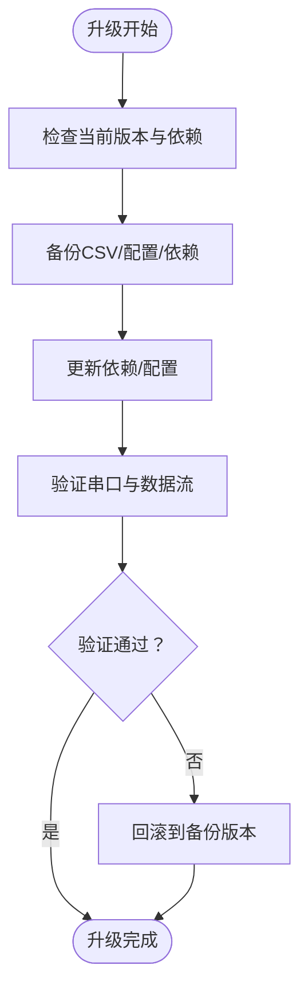
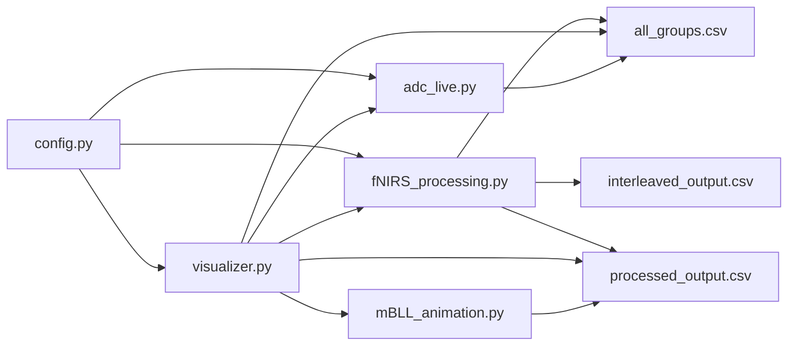

# 备份恢复与升级

<cite>
**本文引用的文件**
- [README.md](file://README.md)
- [software/README.md](file://software/README.md)
- [software/config.py](file://software/config.py)
- [software/visualizer.py](file://software/visualizer.py)
- [software/fNIRS_processing.py](file://software/fNIRS_processing.py)
- [software/adc_live.py](file://software/adc_live.py)
- [software/mBLL_animation.py](file://software/mBLL_animation.py)
- [software/requirements.txt](file://software/requirements.txt)
- [software/testing-scripts/plot.py](file://software/testing-scripts/plot.py)
- [software/testing-scripts/plot_csv.py](file://software/testing-scripts/plot_csv.py)
</cite>

## 目录
1. [简介](#简介)
2. [项目结构](#项目结构)
3. [核心组件](#核心组件)
4. [架构总览](#架构总览)
5. [详细组件分析](#详细组件分析)
6. [依赖关系分析](#依赖关系分析)
7. [性能考虑](#性能考虑)
8. [故障排查指南](#故障排查指南)
9. [结论](#结论)
10. [附录](#附录)

## 简介
本运维文档面向fNIRS系统的数据备份、恢复与系统升级，围绕以下目标展开：
- 数据备份策略：覆盖实时数据（ADC原始数据）、历史记录（CSV结果文件）与配置文件（软件配置与依赖清单）
- 存储管理：本地备份、远程备份与云存储的选型建议与实施要点
- 数据恢复：完整恢复与部分恢复的操作步骤与验证方法
- 系统升级：版本检查、升级准备、升级执行与回滚机制
- 配置迁移：新旧版本间配置兼容性处理
- 测试验证与风险评估：备份恢复测试与升级风险控制

## 项目结构
fNIRS系统由硬件固件、机械结构与软件三部分组成。软件侧负责数据采集、处理、可视化与Web交互，数据以CSV文件形式落盘，便于备份与恢复。

图表来源
- [software/visualizer.py](file://software/visualizer.py#L591-L733)
- [software/fNIRS_processing.py](file://software/fNIRS_processing.py#L187-L496)
- [software/adc_live.py](file://software/adc_live.py#L1-L210)
- [software/mBLL_animation.py](file://software/mBLL_animation.py#L1-L140)
- [software/config.py](file://software/config.py#L1-L13)
- [software/requirements.txt](file://software/requirements.txt#L1-L15)

章节来源
- [README.md](file://README.md#L1-L19)
- [software/README.md](file://software/README.md#L1-L180)

## 核心组件
- 配置模块：定义串口路径、波特率与超时等通信参数，被采集与处理脚本共享使用
- 可视化与Web服务：提供Web界面、模式切换、下载CSV与3D脑图渲染
- 数据采集与处理：从串口读取原始ADC包，写入CSV；进行滤波、插值、MBLL/CBSI处理，生成processed_output.csv
- 实时可视化：ADC实时曲线显示与处理后数据动画播放
- 依赖管理：通过requirements.txt统一声明Python依赖

章节来源
- [software/config.py](file://software/config.py#L1-L13)
- [software/visualizer.py](file://software/visualizer.py#L591-L733)
- [software/fNIRS_processing.py](file://software/fNIRS_processing.py#L187-L496)
- [software/adc_live.py](file://software/adc_live.py#L1-L210)
- [software/mBLL_animation.py](file://software/mBLL_animation.py#L1-L140)
- [software/requirements.txt](file://software/requirements.txt#L1-L15)

## 架构总览
系统采用“Web控制 + 串口采集 + CSV落盘”的架构。Web端负责用户交互与控制，采集端负责从设备读取原始数据并写入CSV，处理端负责数据后处理与导出。

图表来源
- [software/visualizer.py](file://software/visualizer.py#L646-L712)
- [software/fNIRS_processing.py](file://software/fNIRS_processing.py#L187-L496)
- [software/adc_live.py](file://software/adc_live.py#L1-L210)

## 详细组件分析

### 数据备份策略
- 实时数据（ADC原始数据）
  - 文件：all_groups.csv
  - 特点：按包写入，持续增长；可按会话切分或定期归档
  - 备份建议：增量备份（基于时间戳或大小阈值），保留最近N天全量+周/月快照
- 历史记录（处理后数据）
  - 文件：processed_output.csv、interleaved_output.csv
  - 特点：处理后数据，体积相对较小；便于长期保存与对比
  - 备份建议：全量备份，配合版本号命名
- 配置文件
  - 文件：config.py（串口与通信参数）、requirements.txt（依赖清单）
  - 特点：小而关键；变更需纳入版本控制
  - 备份建议：纳入版本控制仓库或独立备份

章节来源
- [software/README.md](file://software/README.md#L174-L180)
- [software/config.py](file://software/config.py#L1-L13)
- [software/requirements.txt](file://software/requirements.txt#L1-L15)

### 备份存储管理
- 本地备份
  - 使用外部硬盘/移动盘定期复制all_groups.csv、processed_output.csv与config.py
  - 建议：按日期建立子目录，保留近30天全量与近7天增量
- 远程备份
  - 将备份目录同步至网络附加存储（NAS）或跨机器共享
  - 建议：启用自动同步与校验（如rsync + 校验和）
- 云存储
  - 推荐对象存储（如OSS/MinIO）作为长期归档
  - 建议：开启版本控制与生命周期策略，设置访问权限与加密
- 存储介质选择
  - 高频访问：本地SSD
  - 常用检索：NAS
  - 长期归档：云冷存储

### 数据恢复流程
- 完整恢复
  - 步骤：停止所有数据采集进程；确认串口未被占用；将备份的all_groups.csv、processed_output.csv与config.py、requirements.txt拷贝回原位置；启动Web服务与采集/处理流程；验证CSV可读与可视化正常
  - 验证：使用plot_csv.py或Web界面查看静态图表；使用plot.py对比ADC与处理后数据
- 部分恢复
  - 步骤：仅替换缺失或损坏的CSV文件；若config.py变更，确保串口路径与波特率正确
  - 验证：针对受影响的CSV文件运行可视化脚本，确认数据可读且无异常

图表来源
- [software/visualizer.py](file://software/visualizer.py#L690-L712)
- [software/testing-scripts/plot_csv.py](file://software/testing-scripts/plot_csv.py#L1-L192)
- [software/testing-scripts/plot.py](file://software/testing-scripts/plot.py#L1-L105)

章节来源
- [software/visualizer.py](file://software/visualizer.py#L690-L712)
- [software/testing-scripts/plot_csv.py](file://software/testing-scripts/plot_csv.py#L1-L192)
- [software/testing-scripts/plot.py](file://software/testing-scripts/plot.py#L1-L105)

### 系统升级流程
- 版本检查
  - 检查当前Python版本与依赖版本；核对requirements.txt中各包版本
  - 检查config.py中的串口路径与通信参数是否与硬件匹配
- 升级准备
  - 备份：all_groups.csv、processed_output.csv、config.py、requirements.txt
  - 备份环境：导出当前依赖列表，便于回滚
- 升级执行
  - 更新依赖：pip install -r requirements.txt（建议在虚拟环境中）
  - 验证：启动visualizer.py与采集/处理流程，确认串口通信与数据流正常
- 回滚机制
  - 若升级导致兼容性问题，使用备份的requirements.txt与config.py恢复
  - 重新安装备份的依赖版本，重启服务

图表来源
- [software/requirements.txt](file://software/requirements.txt#L1-L15)
- [software/config.py](file://software/config.py#L1-L13)
- [software/visualizer.py](file://software/visualizer.py#L591-L733)

章节来源
- [software/requirements.txt](file://software/requirements.txt#L1-L15)
- [software/config.py](file://software/config.py#L1-L13)
- [software/visualizer.py](file://software/visualizer.py#L591-L733)

### 配置迁移
- 新旧版本兼容性
  - config.py：若新增字段，应提供默认值；读取时忽略未知键
  - requirements.txt：使用“>=”或“==”锁定版本，避免破坏性升级
- 迁移步骤
  - 生成新配置模板，保留旧配置关键项
  - 在新版本中运行一次初始化，生成默认配置
  - 手动合并差异项，确保串口路径与波特率一致
  - 通过单元测试或可视化脚本验证配置生效

章节来源
- [software/config.py](file://software/config.py#L1-L13)
- [software/requirements.txt](file://software/requirements.txt#L1-L15)

### 备份恢复测试与升级风险评估
- 备份恢复测试
  - 随机抽样：从备份中恢复部分CSV文件，验证plot_csv.py与plot.py可正常加载
  - 全量恢复：完整恢复后，启动visualizer.py，确认Web界面与数据流正常
- 升级风险评估
  - 依赖冲突：优先在隔离环境测试，逐步扩大范围
  - 配置漂移：严格版本控制，变更需评审与回归测试
  - 回滚窗口：确保回滚路径可用，回滚时间不超过业务容忍度

章节来源
- [software/testing-scripts/plot_csv.py](file://software/testing-scripts/plot_csv.py#L1-L192)
- [software/testing-scripts/plot.py](file://software/testing-scripts/plot.py#L1-L105)
- [software/visualizer.py](file://software/visualizer.py#L591-L733)

## 依赖关系分析
软件模块之间的依赖关系如下：

图表来源
- [software/config.py](file://software/config.py#L1-L13)
- [software/visualizer.py](file://software/visualizer.py#L591-L733)
- [software/fNIRS_processing.py](file://software/fNIRS_processing.py#L187-L496)
- [software/adc_live.py](file://software/adc_live.py#L1-L210)
- [software/mBLL_animation.py](file://software/mBLL_animation.py#L1-L140)

章节来源
- [software/config.py](file://software/config.py#L1-L13)
- [software/visualizer.py](file://software/visualizer.py#L591-L733)
- [software/fNIRS_processing.py](file://software/fNIRS_processing.py#L187-L496)
- [software/adc_live.py](file://software/adc_live.py#L1-L210)
- [software/mBLL_animation.py](file://software/mBLL_animation.py#L1-L140)

## 性能考虑
- 数据采集与处理
  - 串口读取与CSV写入为I/O密集型，建议使用缓冲与异步写入减少阻塞
  - 处理阶段的滤波与重采样计算量较大，建议在专用线程或子进程中执行
- 可视化
  - 实时曲线与3D脑图渲染对CPU/GPU有压力，建议限制同时渲染的图表数量与刷新频率
- 存储
  - 大文件（all_groups.csv）建议压缩归档，降低磁盘占用与传输成本

## 故障排查指南
- 串口无法打开
  - 检查config.py中的SERIAL_PORT是否正确；确认设备未被其他程序占用
  - 使用操作系统工具列出可用串口，必要时更换端口
- 数据为空或异常
  - 确认采集脚本已启动且正在写入CSV；检查CSV文件是否被外部程序锁定
  - 使用plot_csv.py或plot.py验证CSV可读性
- Web界面无法访问
  - 检查visualizer.py日志输出；确认端口未被占用
  - 临时关闭防火墙或放通对应端口
- 处理后数据缺失
  - 确认fNIRS_processing.py已完成处理并生成processed_output.csv
  - 检查依赖安装是否完整（nirsimple、nibabel、scipy等）

章节来源
- [software/config.py](file://software/config.py#L1-L13)
- [software/visualizer.py](file://software/visualizer.py#L591-L733)
- [software/fNIRS_processing.py](file://software/fNIRS_processing.py#L187-L496)
- [software/testing-scripts/plot_csv.py](file://software/testing-scripts/plot_csv.py#L1-L192)
- [software/testing-scripts/plot.py](file://software/testing-scripts/plot.py#L1-L105)

## 结论
通过明确的数据备份策略、规范的存储管理与严格的升级流程，fNIRS系统可在保证数据完整性的同时实现平滑演进。建议将备份纳入自动化流程，定期演练恢复与升级场景，并持续优化性能与稳定性。

## 附录
- 关键文件与用途
  - all_groups.csv：原始ADC数据
  - processed_output.csv：处理后浓度变化数据
  - interleaved_output.csv：插值/重采样中间结果
  - config.py：串口与通信参数
  - requirements.txt：Python依赖清单
  - visualizer.py：Web服务与控制入口
  - fNIRS_processing.py：采集与处理主流程
  - adc_live.py：实时ADC可视化
  - mBLL_animation.py：处理后数据动画
  - plot.py、plot_csv.py：数据可视化与验证脚本