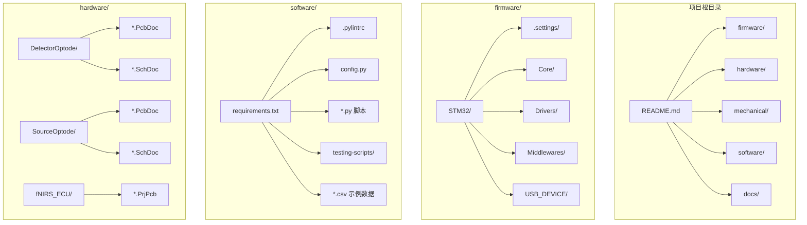
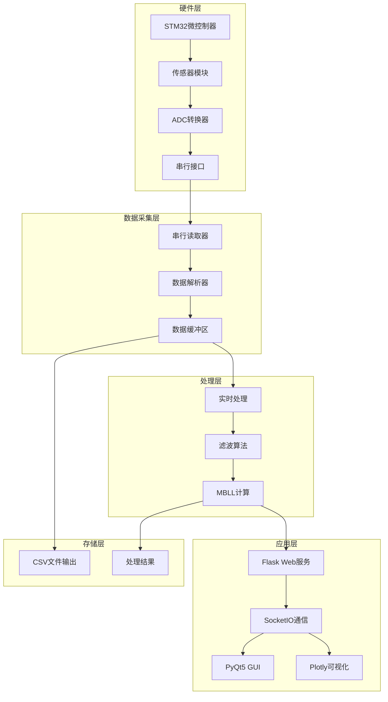
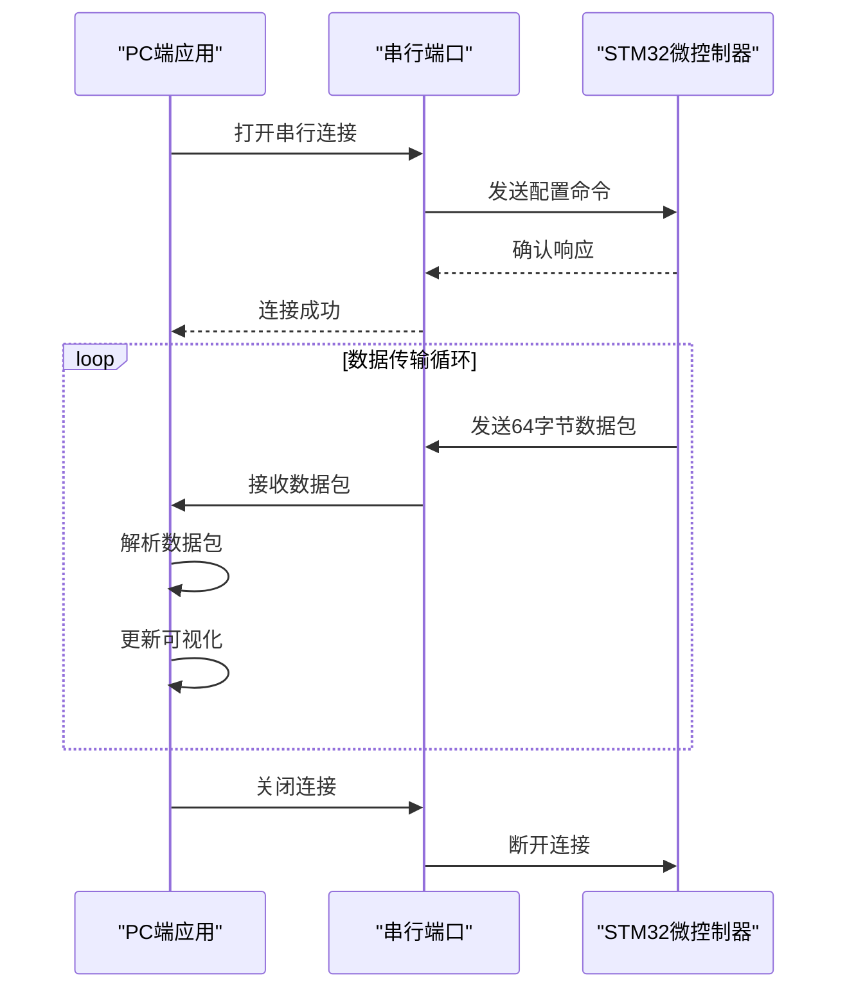
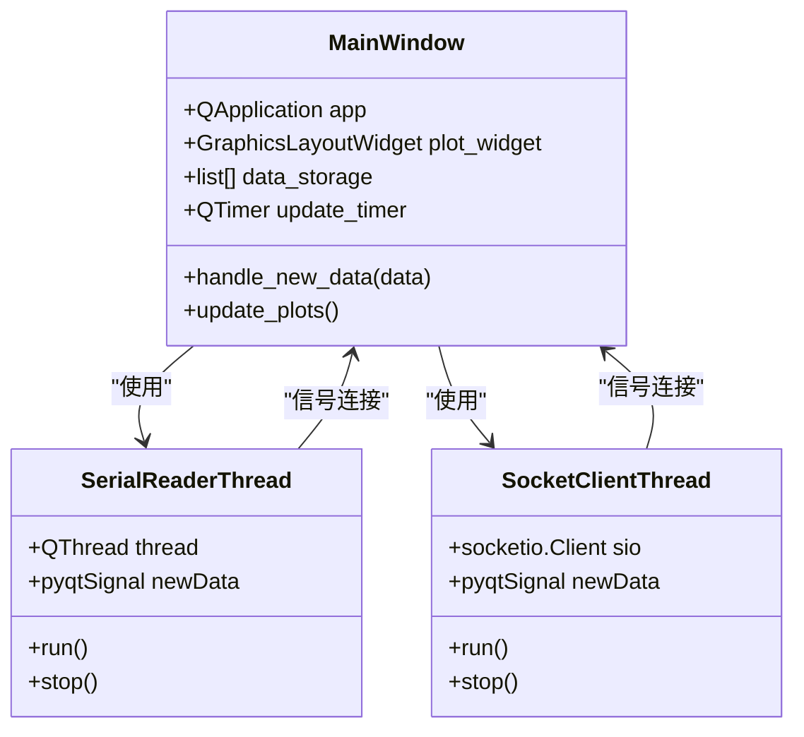
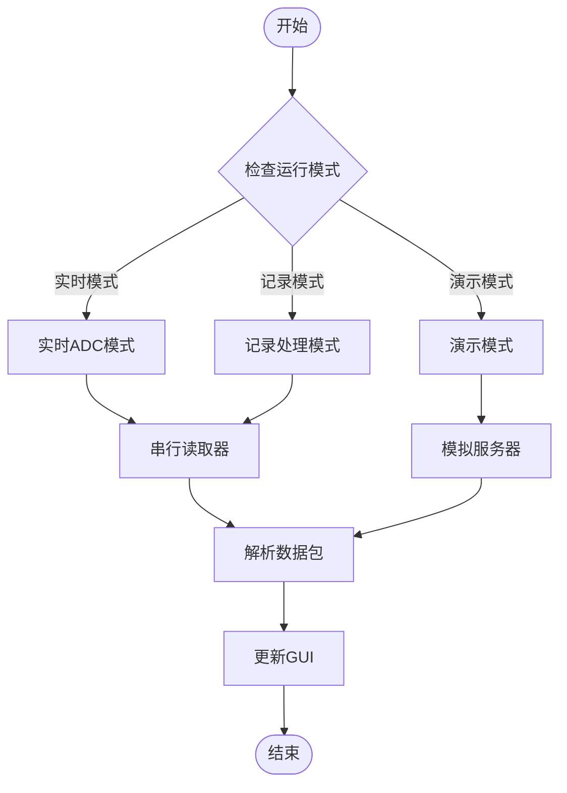
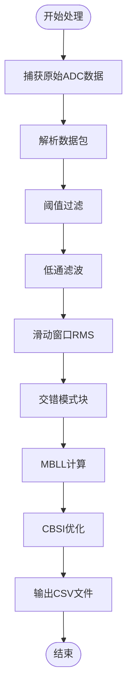
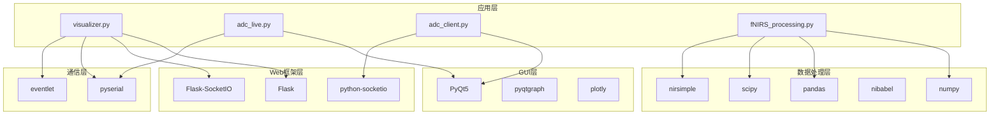
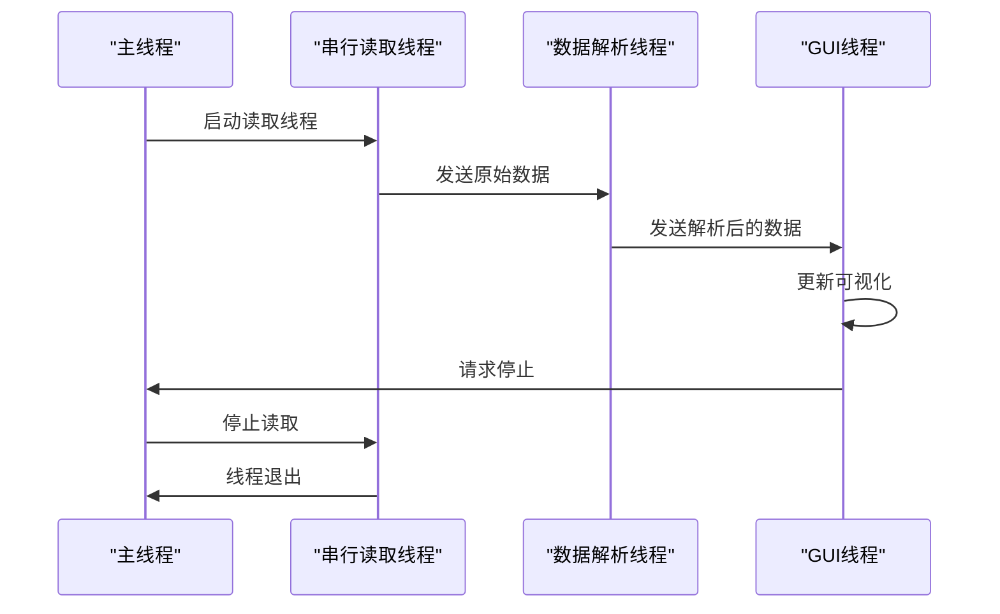

# 开发环境配置

<cite>
**本文档引用的文件**
- [requirements.txt](file://software/requirements.txt)
- [.pylintrc](file://software/.pylintrc)
- [config.py](file://software/config.py)
- [README.md](file://README.md)
- [adc_client.py](file://software/adc_client.py)
- [adc_live.py](file://software/adc_live.py)
- [adc_mock_server.py](file://software/adc_mock_server.py)
- [fNIRS_processing.py](file://software/fNIRS_processing.py)
- [visualizer.py](file://software/visualizer.py)
- [nirs_viewer.py](file://software/nirs_viewer.py)
- [adc_animation.py](file://software/adc_animation.py)
- [mBLL_animation.py](file://software/mBLL_animation.py)
- [plot.py](file://software/testing-scripts/plot.py)
- [plot_csv.py](file://software/testing-scripts/plot_csv.py)
- [plot_mbll.py](file://software/testing-scripts/plot_mbll.py)
- [adc_to_csv.py](file://software/testing-scripts/adc_to_csv.py)
</cite>

## 目录
1. [简介](#简介)
2. [项目结构](#项目结构)
3. [核心组件](#核心组件)
4. [架构概览](#架构概览)
5. [详细组件分析](#详细组件分析)
6. [依赖关系分析](#依赖关系分析)
7. [性能考虑](#性能考虑)
8. [故障排除指南](#故障排除指南)
9. [结论](#结论)

## 简介

fNIRS（功能性近红外光谱）项目是一个基于Python的实时脑成像系统，用于监测大脑活动。该项目包含硬件固件、机械设计和软件处理管道，提供了完整的从传感器数据采集到实时可视化的一体化解决方案。

本项目的核心特点包括：
- 24个定制传感器模块，支持24个探测器和8个双波长LED发射器（660nm和990nm）
- 基于低功耗STM32微控制器的自定义电气控制单元（ECU）
- 交互式Python GUI用于实时数据可视化、串行通信和模块控制
- 完整的数据处理管道，从原始ADC数据到修改的比尔-朗伯定律（MBLL）计算

## 项目结构

项目采用清晰的分层组织结构，主要分为以下几个部分：



**图表来源**
- [README.md](file://README.md#L1-L19)
- [requirements.txt](file://software/requirements.txt#L1-L15)

**章节来源**
- [README.md](file://README.md#L1-L19)

## 核心组件

### Python虚拟环境配置

项目支持两种Python虚拟环境创建方式：

#### 使用venv创建虚拟环境

```bash
# 创建虚拟环境
python -m venv fNIRS_env

# 激活虚拟环境（Windows）
fNIRS_env\Scripts\activate

# 激活虚拟环境（Linux/MacOS）
source fNIRS_env/bin/activate

# 验证Python版本
python --version
```

#### 使用conda创建虚拟环境

```bash
# 创建conda环境
conda create -n fNIRS_env python=3.11

# 激活环境
conda activate fNIRS_env

# 验证Python版本
python --version
```

### 依赖库安装

项目使用requirements.txt统一管理所有依赖库：

```bash
# 在激活的虚拟环境中安装依赖
pip install -r software/requirements.txt

# 或者逐个安装指定版本
pip install eventlet==0.40.0
pip install Flask>=2.2.3
pip install Flask_SocketIO==5.5.1
pip install nibabel==5.3.2
pip install nirsimple==0.1.6
pip install numpy==2.2.6
pip install pandas==2.2.3
pip install plotly==5.24.1
pip install PyQt5==5.15.11
pip install PyQt5_sip==12.17.0
pip install pyqtgraph==0.13.7
pip install pyserial==3.5
pip install python-socketio==5.13.0
pip install scipy==1.15.3
pip install tabulate==0.9.0
```

**章节来源**
- [requirements.txt](file://software/requirements.txt#L1-L15)

### 开发工具配置

#### Pylint配置

项目使用.pylintrc进行代码质量检查配置：

```ini
[MAIN]
py-version=3.11
fail-under=10

[BASIC]
argument-naming-style=snake_case
function-naming-style=snake_case
variable-naming-style=snake_case

[FORMAT]
max-line-length=100
indent-string='    '
```

#### IDE设置建议

对于PyCharm或VS Code等IDE：

1. **Python解释器**：指向虚拟环境中的Python可执行文件
2. **代码格式化**：配置自动导入和代码重排
3. **调试配置**：为每个主要脚本创建运行配置

**章节来源**
- [.pylintrc](file://software/.pylintrc#L96-L96)
- [.pylintrc](file://software/.pylintrc#L122-L122)
- [.pylintrc](file://software/.pylintrc#L185-L185)
- [.pylintrc](file://software/.pylintrc#L251-L251)

## 架构概览

系统采用分层架构设计，从底层硬件到上层应用形成完整的数据处理链路：



**图表来源**
- [visualizer.py](file://software/visualizer.py#L52-L53)
- [fNIRS_processing.py](file://software/fNIRS_processing.py#L10-L22)
- [adc_live.py](file://software/adc_live.py#L14-L14)

## 详细组件分析

### 串行通信配置

#### COM端口设置

系统通过config.py集中管理串行通信参数：

```python
# USB-串行设备路径
SERIAL_PORT = '/dev/tty.usbmodem205E386D47311'

# 串行通信设置
BAUD_RATE = 9600
TIMEOUT = 0.01
```

#### 波特率配置

不同组件使用不同的波特率设置：

| 组件 | 默认波特率 | 用途 |
|------|------------|------|
| 实时ADC监控 | 9600 | GUI实时显示 |
| 数据记录模式 | 115200 | 高速数据采集 |
| 模拟服务器 | 9600 | 开发测试 |

#### 串行通信流程



**图表来源**
- [config.py](file://software/config.py#L7-L12)
- [adc_live.py](file://software/adc_live.py#L18-L18)
- [fNIRS_processing.py](file://software/fNIRS_processing.py#L23-L23)

**章节来源**
- [config.py](file://software/config.py#L1-L13)
- [adc_live.py](file://software/adc_live.py#L14-L18)
- [fNIRS_processing.py](file://software/fNIRS_processing.py#L20-L23)

### 实时数据可视化

#### PyQt5 GUI架构

系统提供多种可视化选项：



**图表来源**
- [adc_live.py](file://software/adc_live.py#L80-L90)
- [adc_client.py](file://software/adc_client.py#L39-L46)

#### 数据流处理



**图表来源**
- [visualizer.py](file://software/visualizer.py#L646-L687)
- [adc_live.py](file://software/adc_live.py#L48-L78)

**章节来源**
- [adc_live.py](file://software/adc_live.py#L48-L90)
- [adc_client.py](file://software/adc_client.py#L39-L86)

### 数据处理管道

#### fNIRS处理流程

系统实现了完整的fNIRS数据处理管道：



**图表来源**
- [fNIRS_processing.py](file://software/fNIRS_processing.py#L187-L235)
- [fNIRS_processing.py](file://software/fNIRS_processing.py#L339-L434)

**章节来源**
- [fNIRS_processing.py](file://software/fNIRS_processing.py#L160-L185)
- [fNIRS_processing.py](file://software/fNIRS_processing.py#L445-L496)

### 测试和验证工具

#### 数据可视化工具

项目包含多个数据可视化工具：

| 工具 | 功能 | 技术栈 |
|------|------|--------|
| plot.py | ADC和MBLL数据对比可视化 | PyQtGraph, Pandas |
| plot_csv.py | 静态HTML图表生成 | Plotly, Pandas |
| plot_mbll.py | mBLL数据特定通道可视化 | Matplotlib, Pandas |
| adc_animation.py | ADC数据动画播放 | PyQtGraph, Pandas |
| mBLL_animation.py | mBLL数据动画播放 | PyQtGraph, Pandas |

**章节来源**
- [plot.py](file://software/testing-scripts/plot.py#L1-L105)
- [plot_csv.py](file://software/testing-scripts/plot_csv.py#L1-L192)
- [plot_mbll.py](file://software/testing-scripts/plot_mbll.py#L1-L113)
- [adc_animation.py](file://software/adc_animation.py#L1-L143)
- [mBLL_animation.py](file://software/mBLL_animation.py#L1-L140)

## 依赖关系分析

### 核心依赖层次



**图表来源**
- [requirements.txt](file://software/requirements.txt#L1-L15)
- [visualizer.py](file://software/visualizer.py#L22-L32)
- [adc_live.py](file://software/adc_live.py#L10-L14)
- [fNIRS_processing.py](file://software/fNIRS_processing.py#L10-L22)

### 版本兼容性

| 库名称 | 版本要求 | 最小版本 | 最大版本 |
|--------|----------|----------|----------|
| Python | 3.11 | 3.8 | 3.12 |
| numpy | 2.2.6 | 1.20.0 | 2.x |
| pandas | 2.2.3 | 1.3.0 | 2.x |
| scipy | 1.15.3 | 1.0.0 | 2.x |
| PyQt5 | 5.15.11 | 5.15.0 | 6.x |
| pyqtgraph | 0.13.7 | 0.12.0 | 1.x |
| plotly | 5.24.1 | 5.0.0 | 6.x |
| Flask | >=2.2.3 | 2.0.0 | 3.x |
| eventlet | 0.40.0 | 0.30.0 | 1.x |

**章节来源**
- [requirements.txt](file://software/requirements.txt#L1-L15)
- [.pylintrc](file://software/.pylintrc#L96-L96)

## 性能考虑

### 内存管理

系统采用高效的数据结构来处理大量传感器数据：

1. **双端队列（deque）**：限制数据存储大小，避免内存泄漏
2. **NumPy数组**：高效的数值计算和内存布局
3. **批处理机制**：减少频繁的GUI更新操作

### 并发处理



**图表来源**
- [adc_live.py](file://software/adc_live.py#L48-L78)
- [adc_client.py](file://software/adc_client.py#L39-L86)

### 优化建议

1. **批量更新**：减少GUI刷新频率，提高响应速度
2. **数据缓存**：对重复使用的数据进行缓存
3. **异步处理**：使用事件驱动架构处理I/O操作

## 故障排除指南

### 常见问题及解决方案

#### 依赖冲突

**问题**：安装依赖时出现版本冲突
**解决方案**：
```bash
# 清理损坏的包
pip uninstall -r requirements.txt

# 强制重新安装
pip install --force-reinstall -r requirements.txt

# 或使用隔离安装
pip install --no-cache-dir -r requirements.txt
```

#### 串行端口访问问题

**问题**：无法打开串行端口
**解决方案**：
```python
import serial
from serial.tools.list_ports import comports

# 查看可用的串行端口
available_ports = [port.device for port in comports()]
print("可用端口:", available_ports)

# 检查端口是否被占用
try:
    ser = serial.Serial('/dev/tty.usbmodem205E386D47311', 9600, timeout=1)
    ser.close()
    print("端口可用")
except OSError as e:
    print(f"端口不可用: {e}")
```

#### 权限问题（Linux/MacOS）

**问题**：权限不足访问串行端口
**解决方案**：
```bash
# 添加用户到dialout组（Linux）
sudo usermod -a -G dialout $USER

# 重新登录或执行
newgrp dialout

# 设置udev规则（Linux）
echo 'SUBSYSTEM=="tty", MODE="0666"' | sudo tee /etc/udev/rules.d/99-usb-serial.rules
sudo udevadm control --reload-rules
```

#### 内存不足

**问题**：长时间运行后内存使用增加
**解决方案**：
```python
import gc
import psutil

# 监控内存使用
process = psutil.Process()
memory_usage = process.memory_info().rss / 1024 / 1024  # MB

# 定期清理垃圾回收
if memory_usage > 500:  # 500MB阈值
    gc.collect()
```

#### 网络连接问题

**问题**：SocketIO连接失败
**解决方案**：
```python
import socketio
from socket import gaierror

try:
    sio = socketio.Client()
    sio.connect('http://localhost:5000')
except gaierror as e:
    print(f"网络连接错误: {e}")
    # 尝试其他端口或IP
    sio.connect('http://127.0.0.1:5000')
```

**章节来源**
- [config.py](file://software/config.py#L7-L12)
- [adc_live.py](file://software/adc_live.py#L18-L18)
- [fNIRS_processing.py](file://software/fNIRS_processing.py#L23-L23)

### 调试技巧

#### 日志配置

```python
import logging

# 配置日志级别
logging.basicConfig(
    level=logging.DEBUG,
    format='%(asctime)s - %(name)s - %(levelname)s - %(message)s'
)

# 在关键位置添加日志
logger = logging.getLogger(__name__)
logger.debug("数据包解析完成")
```

#### 错误处理最佳实践

```python
def safe_serial_operation():
    try:
        # 串行操作
        data = ser.read(64)
        return data
    except serial.SerialException as e:
        logger.error(f"串行通信错误: {e}")
        # 尝试重新连接
        reconnect_serial()
        return None
    except Exception as e:
        logger.error(f"未预期错误: {e}")
        return None
```

## 结论

fNIRS项目的开发环境配置相对完整且易于部署。通过使用Python虚拟环境和requirements.txt统一管理依赖，项目确保了开发环境的一致性和可重现性。

关键优势包括：
1. **清晰的架构分离**：硬件、软件和数据处理层职责明确
2. **灵活的可视化选项**：支持实时监控、离线分析和Web界面
3. **完善的测试工具**：包含多种数据可视化和验证工具
4. **良好的错误处理**：提供了robust的异常处理和故障恢复机制

建议在实际部署时：
- 根据具体硬件配置调整串行端口设置
- 监控系统资源使用情况，及时优化性能
- 建立完整的备份和版本控制系统
- 定期更新依赖库以获得最新的安全补丁和功能改进