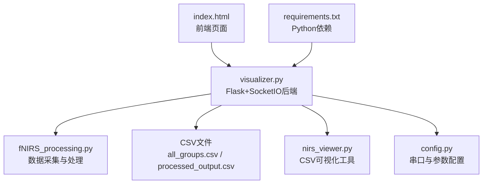
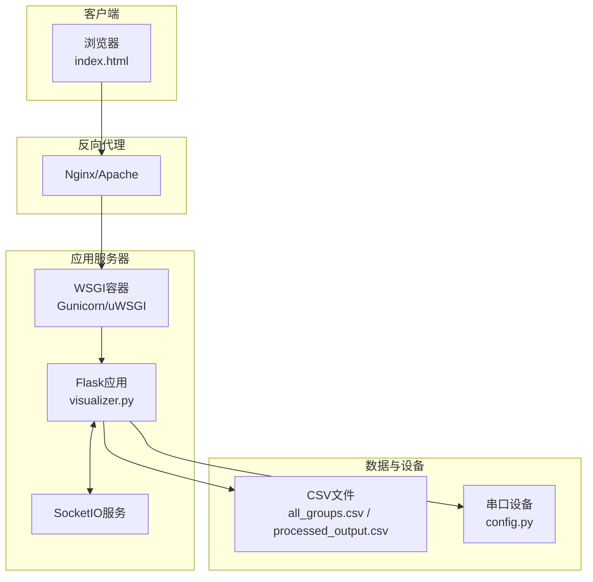
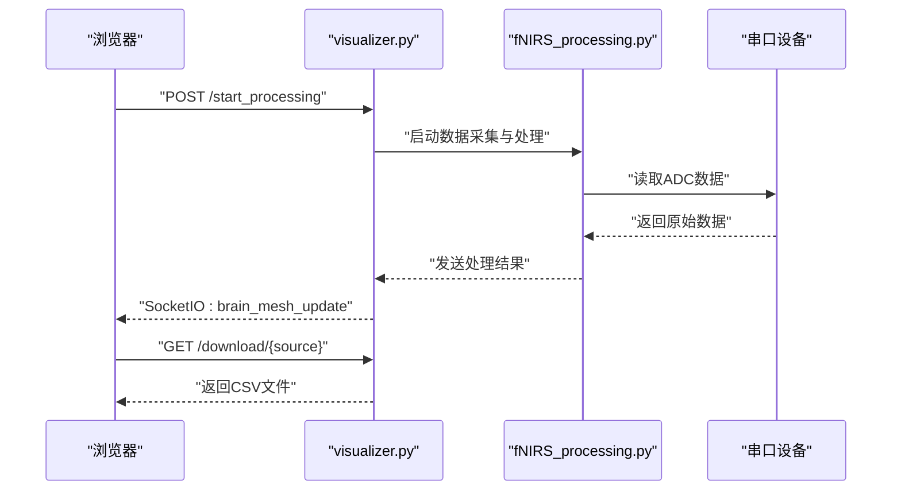
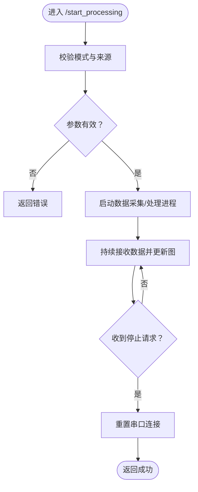
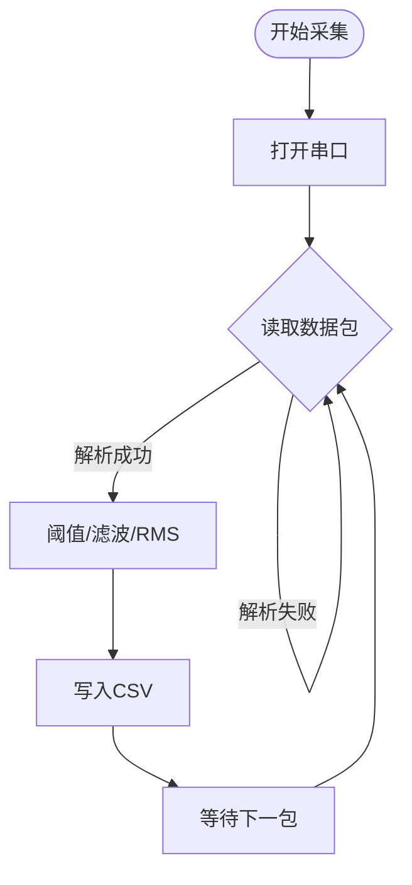
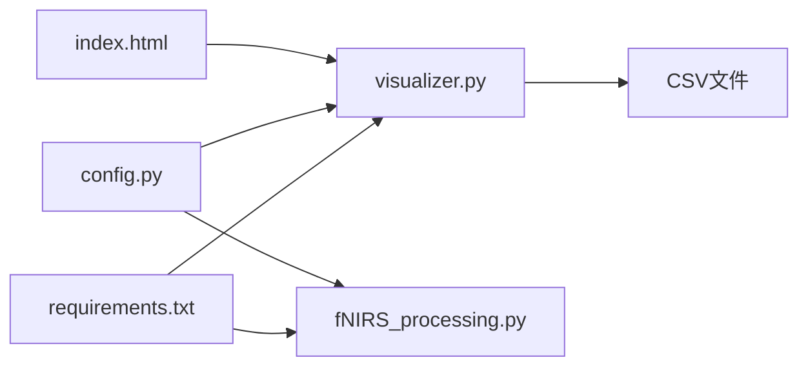

# 生产环境部署

<cite>
**本文档引用的文件**
- [README.md](file://README.md)
- [config.py](file://software/config.py)
- [requirements.txt](file://software/requirements.txt)
- [index.html](file://software/index.html)
- [visualizer.py](file://software/visualizer.py)
- [fNIRS_processing.py](file://software/fNIRS_processing.py)
- [adc_live.py](file://software/adc_live.py)
- [nirs_viewer.py](file://software/nirs_viewer.py)
- [adc_mock_server.py](file://software/adc_mock_server.py)
- [adc_client.py](file://software/adc_client.py)
- [all_groups.csv](file://software/sample_data/all_groups.csv)
- [interleaved_output.csv](file://software/sample_data/interleaved_output.csv)
- [processed_output.csv](file://software/sample_data/processed_output.csv)
</cite>

## 目录
1. [简介](#简介)
2. [项目结构](#项目结构)
3. [核心组件](#核心组件)
4. [架构总览](#架构总览)
5. [详细组件分析](#详细组件分析)
6. [依赖关系分析](#依赖关系分析)
7. [性能考虑](#性能考虑)
8. [故障排查指南](#故障排查指南)
9. [结论](#结论)
10. [附录](#附录)

## 简介
本指南面向fNIRS系统的生产环境部署，覆盖Web服务器（Apache/Nginx）、Flask应用（Gunicorn/uWSGI）部署、数据库与文件存储（CSV）、安全配置（HTTPS、访问控制、认证）、系统服务与开机自启、以及部署前后检查清单与验证步骤。文档基于仓库中的软件模块进行梳理，确保部署流程可操作、可追溯。

## 项目结构
- 软件层位于 software/ 目录，包含Web前端页面、Flask后端、数据处理与可视化脚本、以及示例数据。
- 前端入口为 index.html，后端主程序为 visualizer.py，负责实时数据接收、脑图渲染与CSV导出。
- 数据采集与处理由 fNIRS_processing.py 与相关脚本完成，CSV输出用于静态可视化与下载。
- 配置与依赖通过 config.py 与 requirements.txt 统一管理。

图表来源
- [index.html](file://software/index.html#L1-L750)
- [visualizer.py](file://software/visualizer.py#L1-L200)
- [fNIRS_processing.py](file://software/fNIRS_processing.py#L1-L200)
- [nirs_viewer.py](file://software/nirs_viewer.py#L1-L200)
- [config.py](file://software/config.py#L1-L13)
- [requirements.txt](file://software/requirements.txt#L1-L15)

章节来源
- [README.md](file://README.md#L1-L19)
- [index.html](file://software/index.html#L1-L750)
- [visualizer.py](file://software/visualizer.py#L1-L200)
- [fNIRS_processing.py](file://software/fNIRS_processing.py#L1-L200)
- [nirs_viewer.py](file://software/nirs_viewer.py#L1-L200)
- [config.py](file://software/config.py#L1-L13)
- [requirements.txt](file://software/requirements.txt#L1-L15)

## 核心组件
- Web前端：index.html 提供交互界面，支持模式切换、传感器组选择、控制面板与数据下载。
- 后端服务：visualizer.py 基于Flask与SocketIO，负责接收上游数据、渲染3D脑图、生成静态图表、启动动画脚本，并提供CSV下载接口。
- 数据处理：fNIRS_processing.py 实现原始ADC数据采集、预处理、滤波与CSV输出；配套脚本用于演示与测试。
- 配置与依赖：config.py 定义串口参数；requirements.txt 管理Python包版本。
- 可视化工具：nirs_viewer.py 支持加载与展示 .nirs 与 CSV 数据集。

章节来源
- [index.html](file://software/index.html#L1-L750)
- [visualizer.py](file://software/visualizer.py#L1-L200)
- [fNIRS_processing.py](file://software/fNIRS_processing.py#L1-L200)
- [nirs_viewer.py](file://software/nirs_viewer.py#L1-L200)
- [config.py](file://software/config.py#L1-L13)
- [requirements.txt](file://software/requirements.txt#L1-L15)

## 架构总览
下图展示了生产环境中的典型部署拓扑：反向代理（Nginx/Apache）作为入口，后端通过WSGI（Gunicorn/uWSGI）运行Flask应用，SocketIO用于实时数据推送，CSV文件作为持久化数据源，串口设备用于实时数据采集。

图表来源
- [index.html](file://software/index.html#L1-L750)
- [visualizer.py](file://software/visualizer.py#L50-L947)
- [config.py](file://software/config.py#L7-L13)

## 详细组件分析

### Web前端（index.html）
- 功能要点
  - 模式选择：实时ADC模式与记录/可视化模式。
  - 控制面板：MUX与发射器状态控制，PWM选项按组启用。
  - 数据下载：支持ADC与mBLL CSV下载，静态图表与动画查看。
- 关键交互
  - 通过AJAX调用后端接口触发/停止处理、下载CSV、打开静态/动画视图。
  - 使用SocketIO接收实时数据更新脑图。

图表来源
- [index.html](file://software/index.html#L632-L723)
- [visualizer.py](file://software/visualizer.py#L714-L732)
- [fNIRS_processing.py](file://software/fNIRS_processing.py#L187-L200)
- [config.py](file://software/config.py#L7-L13)

章节来源
- [index.html](file://software/index.html#L265-L750)
- [visualizer.py](file://software/visualizer.py#L714-L732)
- [fNIRS_processing.py](file://software/fNIRS_processing.py#L187-L200)
- [config.py](file://software/config.py#L7-L13)

### Flask后端（visualizer.py）
- 功能要点
  - SocketIO客户端：连接上游数据源，接收处理后的浓度数据，入队并触发图更新。
  - 脑图渲染：基于nibabel与Plotly构建3D脑图，支持交互视角与传感器节点高亮。
  - 文件服务：提供CSV下载、静态图表HTML生成、动画脚本启动。
  - 串口控制：在停止处理时重置串口连接，确保设备可用性。
- 关键路由
  - /download/<source>：下载ADC或mBLL CSV。
  - /view_static/<source>：生成并返回静态图表HTML。
  - /view_animation/<source>：启动对应动画脚本。
  - /start_processing、/stop_processing：控制采集与处理流程。
- Demo模式：通过命令行参数启用，使用示例数据与模拟服务器。

图表来源
- [visualizer.py](file://software/visualizer.py#L700-L711)
- [visualizer.py](file://software/visualizer.py#L714-L732)
- [visualizer.py](file://software/visualizer.py#L899-L920)

章节来源
- [visualizer.py](file://software/visualizer.py#L1-L200)
- [visualizer.py](file://software/visualizer.py#L700-L947)

### 数据采集与处理（fNIRS_processing.py）
- 功能要点
  - 串口读取：根据配置参数打开串口，解析64字节数据包。
  - 数据处理：阈值过滤、低通滤波、滑动窗口RMS、带通滤波与重采样。
  - CSV输出：生成interleaved_output.csv与processed_output.csv，供可视化与下载。
- 关键流程
  - 解析原始数据包为8×5矩阵。
  - 应用预处理与滤波，计算RMS，写入CSV。
  - 支持信号量优雅停止。

图表来源
- [fNIRS_processing.py](file://software/fNIRS_processing.py#L160-L186)
- [fNIRS_processing.py](file://software/fNIRS_processing.py#L51-L126)
- [fNIRS_processing.py](file://software/fNIRS_processing.py#L187-L200)

章节来源
- [fNIRS_processing.py](file://software/fNIRS_processing.py#L1-L200)

### 配置与依赖（config.py、requirements.txt）
- config.py
  - 定义SERIAL_PORT、BAUD_RATE、TIMEOUT等串口参数，被多个模块共享。
- requirements.txt
  - 包含Flask、Flask-SocketIO、numpy、pandas、plotly、pyserial、nibabel等生产所需依赖。

章节来源
- [config.py](file://software/config.py#L1-L13)
- [requirements.txt](file://software/requirements.txt#L1-L15)

### 示例与辅助工具
- adc_mock_server.py：模拟上游数据源，便于无硬件环境下的联调。
- adc_client.py：演示如何连接SocketIO服务器并接收数据。
- nirs_viewer.py：独立的CSV/.nirs可视化工具，便于离线分析。

章节来源
- [adc_mock_server.py](file://software/adc_mock_server.py#L1-L64)
- [adc_client.py](file://software/adc_client.py#L42-L83)
- [nirs_viewer.py](file://software/nirs_viewer.py#L1-L200)

## 依赖关系分析
- 组件耦合
  - visualizer.py 依赖 config.py 进行串口配置，依赖 SocketIO 接收上游数据，依赖CSV文件提供静态可视化与下载。
  - fNIRS_processing.py 依赖 config.py 读取串口参数，依赖numpy/pandas/scipy进行数据处理，输出CSV文件。
  - index.html 仅依赖后端HTTP接口与SocketIO事件，不直接依赖后端业务逻辑。
- 外部依赖
  - Python包通过requirements.txt统一管理，建议在生产环境中使用虚拟环境隔离。
  - 前端资源（Plotly、jQuery、Bootstrap）通过CDN引入，需确保网络可达。

图表来源
- [requirements.txt](file://software/requirements.txt#L1-L15)
- [visualizer.py](file://software/visualizer.py#L1-L200)
- [fNIRS_processing.py](file://software/fNIRS_processing.py#L1-L200)
- [config.py](file://software/config.py#L1-L13)
- [index.html](file://software/index.html#L1-L750)

章节来源
- [requirements.txt](file://software/requirements.txt#L1-L15)
- [visualizer.py](file://software/visualizer.py#L1-L200)
- [fNIRS_processing.py](file://software/fNIRS_processing.py#L1-L200)
- [config.py](file://software/config.py#L1-L13)
- [index.html](file://software/index.html#L1-L750)

## 性能考虑
- 数据流优化
  - 后端使用Queue与锁保护数据队列，避免并发竞争；建议限制队列长度以防止内存膨胀。
  - SocketIO异步模式选择需与WSGI容器兼容，推荐使用eventlet或gevent。
- 计算密集型处理
  - 滤波与重采样可能占用CPU，建议在专用采集机上运行数据处理脚本，后端仅做轻量级聚合与展示。
- 前端渲染
  - 3D脑图与多曲线图表对浏览器性能有要求，建议在高性能终端上使用，或提供降采样选项。
- 存储与I/O
  - CSV文件读写频繁，建议使用SSD与合适的缓冲策略；定期清理临时文件，避免磁盘占满。

## 故障排查指南
- 串口无法打开
  - 检查SERIAL_PORT路径与权限，确认设备已连接且驱动正常。
  - 在visualizer.py中调用重置串口逻辑，确保连接可用。
- 数据为空或延迟高
  - 检查BAUD_RATE与TIMEOUT配置是否与设备一致。
  - 确认上游数据源（模拟或真实设备）正常运行。
- CSV下载失败
  - 确认CSV文件存在且路径正确，检查后端路由与文件权限。
- SocketIO连接异常
  - 检查跨域配置与异步模式，确保与WSGI容器兼容。
- 前端页面空白或资源加载失败
  - 检查CDN连通性与HTTPS混合内容问题。

章节来源
- [visualizer.py](file://software/visualizer.py#L700-L711)
- [config.py](file://software/config.py#L7-L13)
- [visualizer.py](file://software/visualizer.py#L714-L732)

## 结论
本部署指南基于仓库现有代码，明确了生产环境的关键组件与部署要点。通过合理的反向代理、WSGI容器、SocketIO与文件存储配置，结合严格的权限与HTTPS策略，可实现稳定、可扩展的fNIRS可视化系统。

## 附录

### Apache配置要点（示例）
- 虚拟主机
  - 监听443端口，启用SSL与HSTS。
  - 将静态资源映射到软件目录。
- 反向代理
  - 将 / 代理至WSGI容器地址（如127.0.0.1:8000）。
  - 透传Origin与Host头，确保SocketIO握手成功。
- 安全
  - 限制HTTP方法，启用WAF规则，配置证书与密钥。
- 日志
  - 分离访问与错误日志，保留轮转策略。

### Nginx配置要点（示例）
- 服务器块
  - listen 443 ssl http2; 指定证书与私钥。
  - root 指向软件目录，location /static/ 指向静态资源。
- 反向代理
  - proxy_pass http://127.0.0.1:8000; 传递必要的头部。
  - proxy_http_version 1.1; proxy_set_header Upgrade $http_upgrade; proxy_set_header Connection "upgrade";
- 安全
  - 添加安全响应头（X-Frame-Options、Content-Security-Policy等）。
- 限流与监控
  - 为API端点配置限流，开启访问日志。

### Flask部署（Gunicorn/uWSGI）
- Gunicorn
  - 进程数：worker_class=gevent/eventlet，workers=2×CPU+1。
  - 绑定：127.0.0.1:8000（反代内网）。
  - 日志：accesslog与errorlog指向文件。
- uWSGI
  - 配置文件包含socket、module、callable、processes、threads等。
  - 与Nginx通过uwsgi协议通信。
- 启动脚本
  - 使用systemd或supervisor管理进程，自动重启与日志切割。

### 数据库与文件存储
- CSV文件存储
  - 所有CSV文件位于软件根目录，提供下载与静态图表功能。
  - 建议定期备份与归档，设置保留周期。
- 临时数据管理
  - 采集过程中产生的中间文件（如interleaved_output.csv）应定期清理，避免磁盘耗尽。
- 文件权限
  - 确保web用户对CSV目录具有读写权限，避免下载失败。

### 安全配置
- HTTPS
  - 使用Let’s Encrypt或企业CA签发证书，强制HSTS与TLS最小版本。
- 访问控制
  - 反代层添加IP白名单、速率限制与WAF。
- 用户认证
  - 若需要，可在反代层集成OIDC/SAML或Basic Auth。
- 传输安全
  - WebSocket升级必须走HTTPS，避免混合内容。

### 系统服务与开机自启
- systemd示例
  - 单元文件：描述ExecStart（Gunicorn/uWSGI）、WorkingDirectory、Environment、Restart策略。
  - 开机自启：systemctl enable fNIRS-visualizer。
- supervisor示例
  - 程序段：command、directory、user、autostart/autorestart、stdout_logfile等。
- 日志与监控
  - 配置日志轮转，接入集中式日志系统；设置健康检查端点。

### 部署前检查清单
- 硬件
  - 串口设备连接正常，权限正确。
- 软件
  - Python虚拟环境已创建，依赖安装完成。
  - 配置文件（SERIAL_PORT等）已按目标环境修改。
  - CSV示例文件存在或准备就绪。
- 网络
  - 反向代理端口开放，证书有效。
  - 内网WSGI端口仅本地监听。
- 安全
  - HTTPS已启用，安全头已配置。
  - 访问控制与认证策略已落地。

### 部署后验证步骤
- 功能验证
  - 打开前端页面，切换模式并确认数据更新。
  - 下载CSV并用nirs_viewer.py验证可视化。
- 性能验证
  - 压力测试不同并发下的响应时间与吞吐。
- 安全验证
  - HTTPS证书链与HSTS生效，非HTTPS访问被重定向。
  - 反代层WAF规则生效，异常请求被拦截。
- 运维验证
  - 日志轮转与告警配置正常，进程自启与健康检查工作。