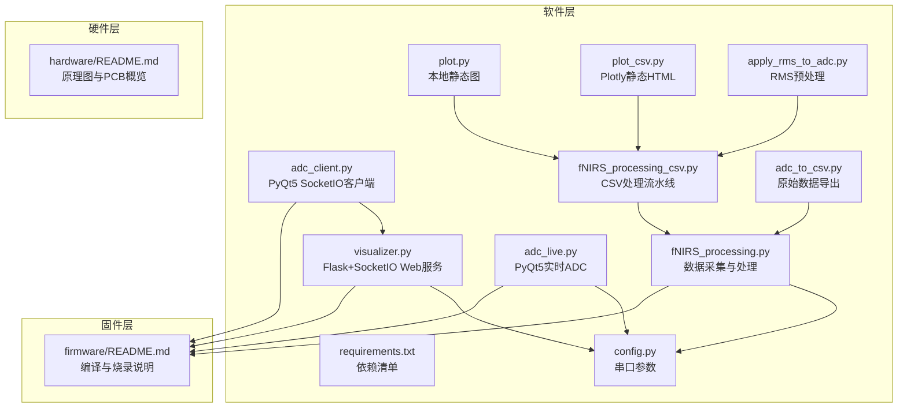
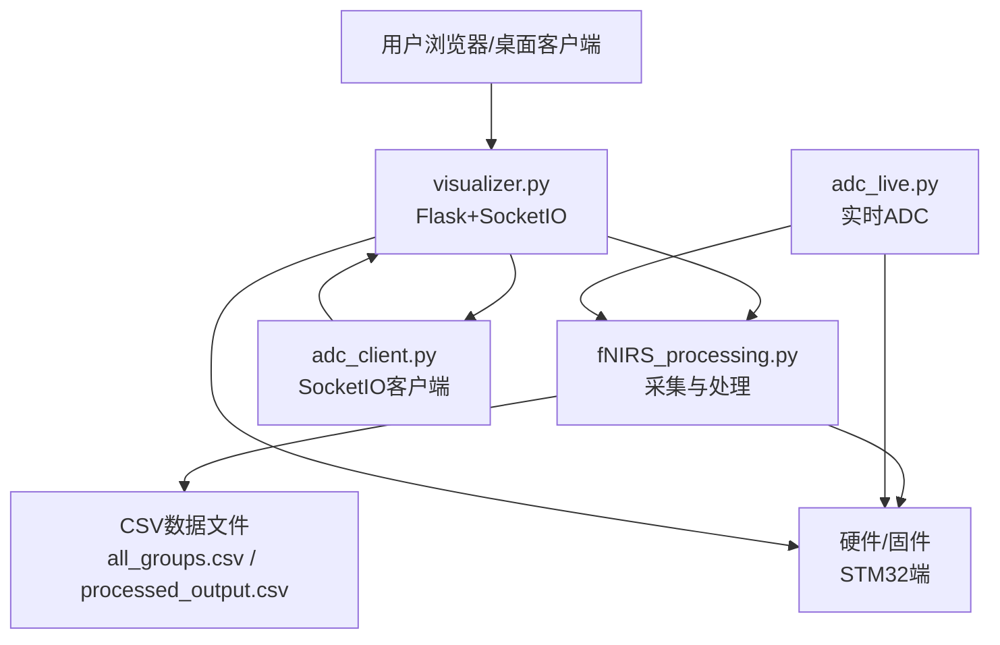
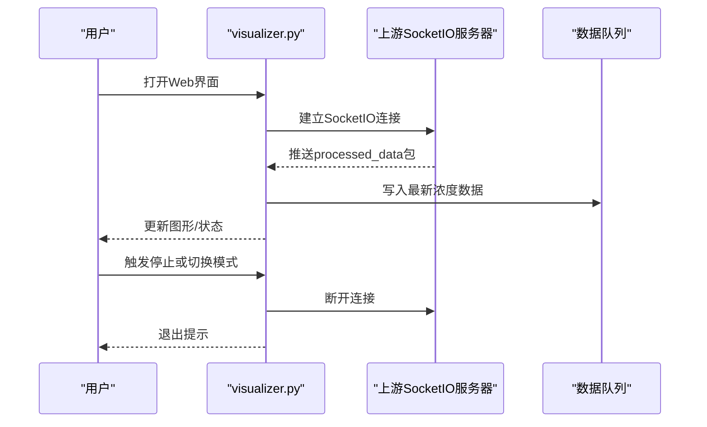
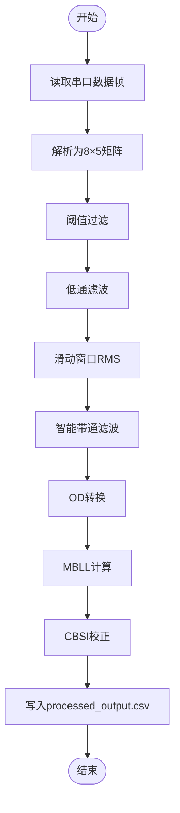
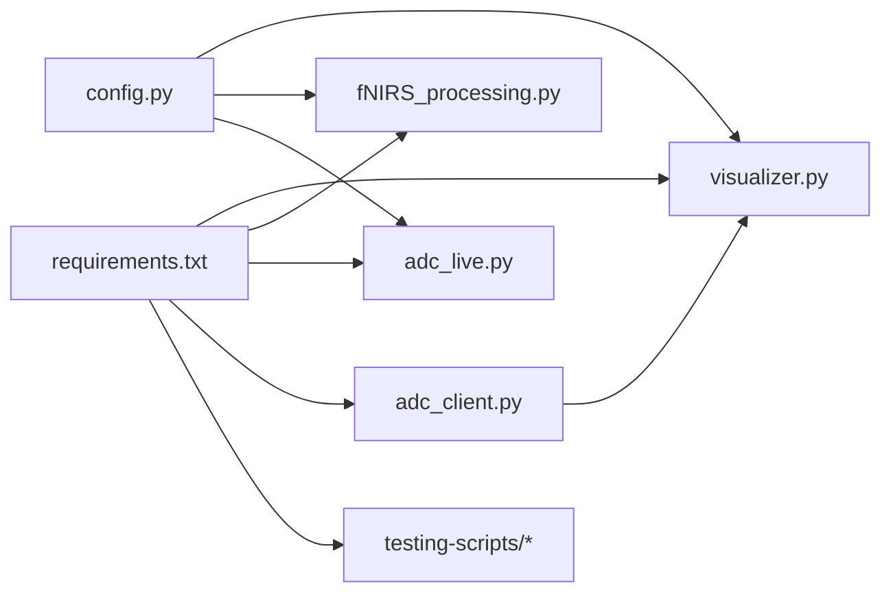

# 系统监控与维护

<cite>
**本文引用的文件**   
- [README.md（软件）](file://software/README.md)
- [config.py](file://software/config.py)
- [requirements.txt](file://software/requirements.txt)
- [visualizer.py](file://software/visualizer.py)
- [fNIRS_processing.py](file://software/fNIRS_processing.py)
- [adc_live.py](file://software/adc_live.py)
- [adc_client.py](file://software/adc_client.py)
- [plot.py](file://software/testing-scripts/plot.py)
- [plot_csv.py](file://software/testing-scripts/plot_csv.py)
- [fNIRS_processing_csv.py](file://software/testing-scripts/fNIRS_processing_csv.py)
- [adc_to_csv.py](file://software/testing-scripts/adc_to_csv.py)
- [apply_rms_to_adc.py](file://software/testing-scripts/apply_rms_to_adc.py)
- [README.md（固件）](file://firmware/README.md)
- [README.md（硬件）](file://hardware/README.md)
</cite>

## 目录
1. [简介](#简介)
2. [项目结构](#项目结构)
3. [核心组件](#核心组件)
4. [架构总览](#架构总览)
5. [详细组件分析](#详细组件分析)
6. [依赖关系分析](#依赖关系分析)
7. [性能考量](#性能考量)
8. [故障排除指南](#故障排除指南)
9. [结论](#结论)
10. [附录](#附录)

## 简介
本运维指南面向fNIRS系统的监控与维护，覆盖以下方面：
- 系统性能监控：CPU、内存、网络、磁盘空间的观测与告警建议
- 日志管理：日志级别、轮转策略、存储位置与归档
- 故障排除：硬件连接、软件运行、数据处理三类常见问题的诊断流程
- 定期维护：系统更新、数据备份、性能优化
- 应急响应与灾难恢复：断电、串口异常、数据丢失等场景的处置步骤
- 监控工具配置与自动化运维脚本：基于现有代码的可操作建议

## 项目结构
软件侧主要由“可视化与Web服务”“实时采集与处理”“测试与演示脚本”三部分组成；硬件与固件分别负责传感器与MCU端实现。

图表来源
- [visualizer.py](file://software/visualizer.py#L1-L120)
- [fNIRS_processing.py](file://software/fNIRS_processing.py#L1-L60)
- [config.py](file://software/config.py#L1-L13)
- [requirements.txt](file://software/requirements.txt#L1-L15)
- [adc_live.py](file://software/adc_live.py#L1-L60)
- [adc_client.py](file://software/adc_client.py#L1-L80)
- [plot.py](file://software/testing-scripts/plot.py#L1-L40)
- [plot_csv.py](file://software/testing-scripts/plot_csv.py#L1-L40)
- [fNIRS_processing_csv.py](file://software/testing-scripts/fNIRS_processing_csv.py#L1-L60)
- [adc_to_csv.py](file://software/testing-scripts/adc_to_csv.py#L1-L40)
- [apply_rms_to_adc.py](file://software/testing-scripts/apply_rms_to_adc.py#L1-L40)
- [README.md（固件）](file://firmware/README.md#L1-L17)
- [README.md（硬件）](file://hardware/README.md#L1-L19)

章节来源
- [README.md（软件）](file://software/README.md#L1-L180)
- [README.md（固件）](file://firmware/README.md#L1-L17)
- [README.md（硬件）](file://hardware/README.md#L1-L19)

## 核心组件
- 可视化与Web服务（visualizer.py）
  - 基于Flask与SocketIO提供Web界面与实时数据通道；支持演示模式与真实串口模式；内置日志记录与优雅退出信号处理。
- 数据采集与处理（fNIRS_processing.py）
  - 从串口读取原始ADC数据，进行阈值过滤、低通滤波、滑动窗口RMS、带通滤波、MBLL/CBSI等处理，并输出CSV结果。
- 实时显示（adc_live.py、adc_client.py）
  - 使用PyQt5与pyqtgraph展示实时ADC曲线；另一个客户端通过SocketIO接收上游服务器推送的处理后浓度数据。
- 测试与演示（testing-scripts）
  - 提供Plotly静态图生成、CSV处理流水线、RMS预处理、原始数据导出等脚本，便于离线验证与调试。

章节来源
- [visualizer.py](file://software/visualizer.py#L1-L120)
- [fNIRS_processing.py](file://software/fNIRS_processing.py#L1-L120)
- [adc_live.py](file://software/adc_live.py#L1-L120)
- [adc_client.py](file://software/adc_client.py#L1-L120)
- [plot_csv.py](file://software/testing-scripts/plot_csv.py#L1-L80)
- [fNIRS_processing_csv.py](file://software/testing-scripts/fNIRS_processing_csv.py#L1-L120)

## 架构总览
系统采用“前端Web/桌面客户端 + 后端服务 + 串口采集 + 处理流水线”的分层架构。Web服务负责控制与展示，实时采集脚本负责底层数据接入，处理脚本完成数据转换与输出。

图表来源
- [visualizer.py](file://software/visualizer.py#L1-L120)
- [fNIRS_processing.py](file://software/fNIRS_processing.py#L1-L120)
- [adc_live.py](file://software/adc_live.py#L1-L120)
- [adc_client.py](file://software/adc_client.py#L1-L120)
- [README.md（固件）](file://firmware/README.md#L1-L17)

## 详细组件分析

### 组件A：Web可视化与控制（visualizer.py）
- 职责
  - 启动Flask与SocketIO服务，提供Web界面与交互控制
  - 连接上游SocketIO服务器以接收处理后的浓度数据
  - 演示模式开关、日志级别配置、优雅退出信号处理
- 关键点
  - 串口参数来自config模块；日志默认开启DEBUG级别
  - 队列与锁用于多线程安全的数据传递
  - 支持SIGINT信号进行优雅退出

图表来源
- [visualizer.py](file://software/visualizer.py#L60-L120)

章节来源
- [visualizer.py](file://software/visualizer.py#L1-L120)
- [config.py](file://software/config.py#L1-L13)

### 组件B：数据采集与处理（fNIRS_processing.py）
- 职责
  - 从串口读取原始ADC数据帧，解析为结构化数组
  - 执行阈值过滤、低通滤波、滑动窗口RMS、智能带通滤波
  - 应用OD转换、MBLL、CBSI，输出processed_output.csv
- 关键点
  - 使用nirsimple库进行光学密度与浓度计算
  - 通过信号量控制采集循环的停止
  - 输出CSV文件路径与列名遵循系统约定

图表来源
- [fNIRS_processing.py](file://software/fNIRS_processing.py#L160-L220)
- [fNIRS_processing.py](file://software/fNIRS_processing.py#L340-L436)

章节来源
- [fNIRS_processing.py](file://software/fNIRS_processing.py#L1-L200)

### 组件C：实时显示（adc_live.py、adc_client.py）
- 职责
  - adc_live.py：PyQt5+pyqtgraph实时绘制ADC曲线
  - adc_client.py：PyQt5+pyqtgraph通过SocketIO接收处理后数据
- 关键点
  - 串口参数来自config；SocketIO默认连接本地5000端口
  - 使用线程与定时器避免阻塞UI

章节来源
- [adc_live.py](file://software/adc_live.py#L1-L200)
- [adc_client.py](file://software/adc_client.py#L1-L181)
- [config.py](file://software/config.py#L1-L13)

### 组件D：测试与演示（testing-scripts）
- 职责
  - plot.py：本地静态图对比ADC与mBLL
  - plot_csv.py：生成Plotly静态HTML页面
  - fNIRS_processing_csv.py：完整的CSV处理流水线
  - adc_to_csv.py：原始数据导出
  - apply_rms_to_adc.py：RMS预处理
- 关键点
  - 便于离线验证数据处理链路与可视化效果

章节来源
- [plot.py](file://software/testing-scripts/plot.py#L1-L105)
- [plot_csv.py](file://software/testing-scripts/plot_csv.py#L1-L192)
- [fNIRS_processing_csv.py](file://software/testing-scripts/fNIRS_processing_csv.py#L1-L120)
- [adc_to_csv.py](file://software/testing-scripts/adc_to_csv.py#L1-L67)
- [apply_rms_to_adc.py](file://software/testing-scripts/apply_rms_to_adc.py#L1-L77)

## 依赖关系分析
- 运行时依赖集中在requirements.txt中，涵盖Flask、SocketIO、Plotly、PyQt5、pyqtgraph、numpy、pandas、scipy、nirsimple等
- 串口参数统一在config.py中定义，被多个模块共享
- 处理脚本依赖nirsimple库进行OD与浓度计算

图表来源
- [requirements.txt](file://software/requirements.txt#L1-L15)
- [config.py](file://software/config.py#L1-L13)
- [visualizer.py](file://software/visualizer.py#L1-L60)
- [fNIRS_processing.py](file://software/fNIRS_processing.py#L1-L40)
- [adc_live.py](file://software/adc_live.py#L1-L40)
- [adc_client.py](file://software/adc_client.py#L1-L60)

章节来源
- [requirements.txt](file://software/requirements.txt#L1-L15)
- [config.py](file://software/config.py#L1-L13)

## 性能考量
- CPU与内存
  - 实时显示与数据处理均涉及大量数值计算与绘图，建议在专用工控机或高性能开发板上运行，避免与高负载应用共存
  - 对于长时间录制，建议限制历史数据长度（如PyQt5示例中的最大点数），防止内存膨胀
- 网络
  - Web与SocketIO通信在本机回环地址上进行，延迟极低；若跨主机部署，需评估带宽与丢包率
- 磁盘
  - CSV文件可能随时间增长，建议启用轮转策略与压缩归档
- 串口稳定性
  - 串口超时与波特率需与硬件匹配；在Windows/macOS/Linux上分别确认设备路径与权限

章节来源
- [adc_live.py](file://software/adc_live.py#L120-L190)
- [fNIRS_processing.py](file://software/fNIRS_processing.py#L1-L60)
- [visualizer.py](file://software/visualizer.py#L40-L60)

## 故障排除指南
- 硬件连接问题
  - 症状：无法打开串口、无数据到达
  - 步骤：
    - 确认操作系统已识别设备（Windows使用设备管理器，macOS/Linux使用ls /dev/tty.*）
    - 在config.py中修正SERIAL_PORT路径
    - 检查线缆与接口接触，必要时更换USB转串口线
- 软件运行异常
  - 症状：启动即退出、端口占用、依赖缺失
  - 步骤：
    - 使用虚拟环境安装requirements.txt
    - 若端口被占用，关闭其他占用进程或修改端口
    - 演示模式下跳过串口直接运行
- 数据处理错误
  - 症状：CSV列不匹配、处理中断、输出为空
  - 步骤：
    - 确保输入CSV列顺序与处理脚本预期一致
    - 检查采样率与时间戳一致性
    - 使用testing-scripts中的脚本进行单步验证

章节来源
- [README.md（软件）](file://software/README.md#L65-L100)
- [config.py](file://software/config.py#L1-L13)
- [fNIRS_processing_csv.py](file://software/testing-scripts/fNIRS_processing_csv.py#L340-L436)

## 结论
本指南基于仓库现有代码梳理了fNIRS系统的监控与维护要点。建议在生产环境中结合本指南完善日志轮转、资源监控与应急预案，并持续优化数据处理链路与可视化体验。

## 附录

### A. 系统性能监控实施方案（建议）
- CPU使用率
  - Linux：使用top/htop观察Python进程；Windows：任务管理器查看CPU占用
  - 建议：在峰值时段记录平均CPU使用率，超过阈值时触发降级策略（降低刷新频率或暂停非关键功能）
- 内存占用
  - 建议：对实时显示的最大点数进行上限控制，避免内存泄漏
- 网络流量
  - 本机回环通信，建议关注SocketIO消息大小与频率；跨主机部署时监控带宽与延迟
- 磁盘空间
  - 建议：对CSV输出目录启用自动轮转与压缩归档，保留最近N天数据

### B. 日志管理最佳实践（建议）
- 日志级别
  - 开发/测试：DEBUG；生产：INFO及以上
- 轮转策略
  - 按大小轮转（如100MB）与按时间轮转（每日/每周）结合
- 存储位置
  - 建议：独立挂载分区存放日志与数据，避免与系统盘争用
- 归档与保留
  - 建议：压缩归档到冷存储，保留周期根据法规要求设定

### C. 定期维护任务（建议）
- 系统更新
  - 定期升级Python与第三方库，关注nirsimple等依赖的安全补丁
- 数据备份
  - 建议：每日增量备份CSV与配置文件，每周全量备份
- 性能优化
  - 根据监控结果调整缓冲区大小、刷新频率与滤波参数

### D. 应急响应与灾难恢复（建议）
- 断电
  - 立即检查电源与UPS状态；重启后优先恢复Web服务与采集进程
- 串口异常
  - 更换线缆与端口；回滚至演示模式验证系统可用性
- 数据丢失
  - 从备份恢复；核对校验和；检查CSV完整性

### E. 监控工具配置示例（建议）
- 日志轮转（logrotate示例思路）
  - 目标：/var/log/fnirs/*.log
  - 条件：文件大小>100M或每晚轮转
  - 动作：压缩旧日志，保留最近7份
- 磁盘监控（告警阈值建议）
  - 使用系统自带告警或Prometheus+Grafana：磁盘使用率>80%触发预警，>90%触发停机保护

### F. 自动化运维脚本（建议）
- 采集与处理
  - 使用定时任务调用采集脚本与处理脚本，完成后发送通知邮件或Slack消息
- 备份
  - 使用rsync或cp命令配合计划任务，将CSV与日志复制到备份服务器
- 健康检查
  - 编写轻量探针脚本检测Web服务端口、SocketIO连通性与串口可用性