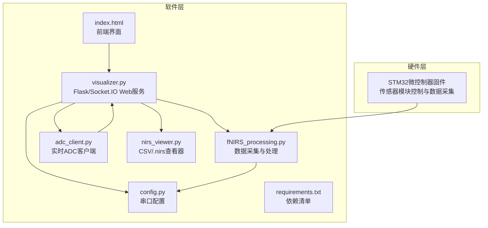
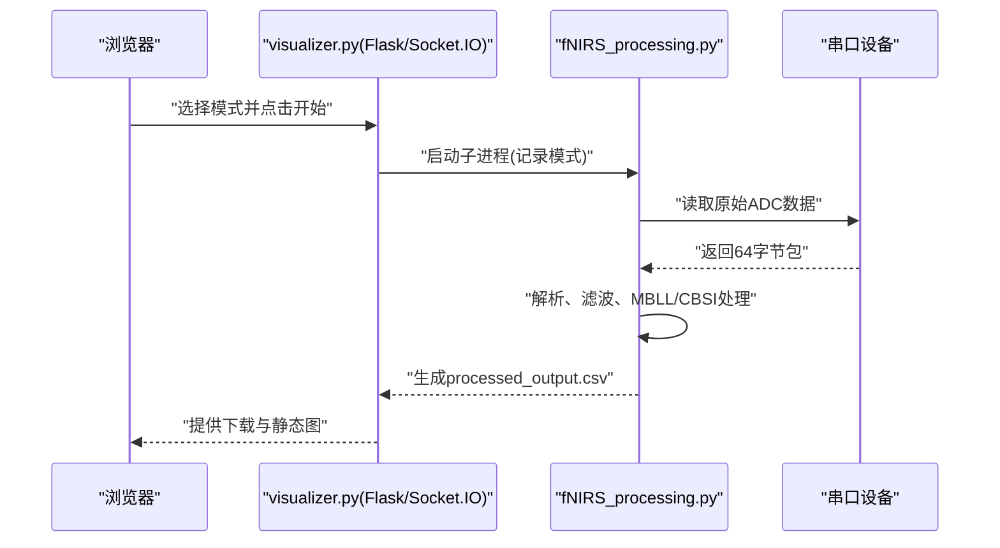
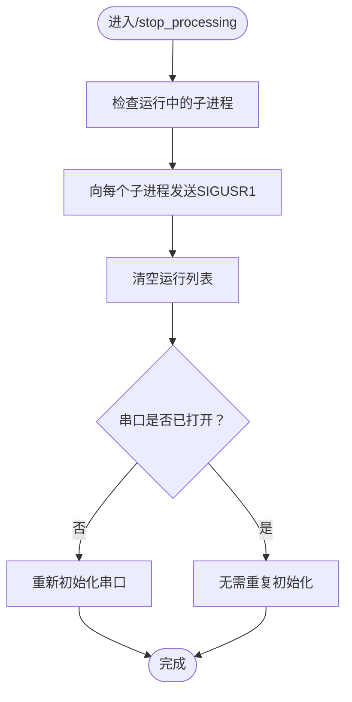
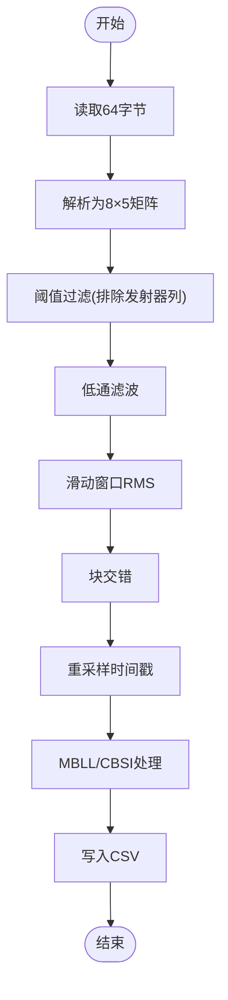
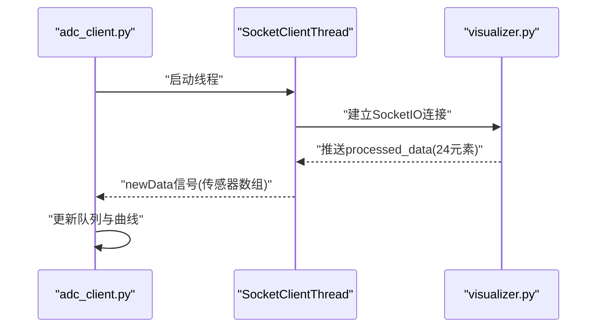
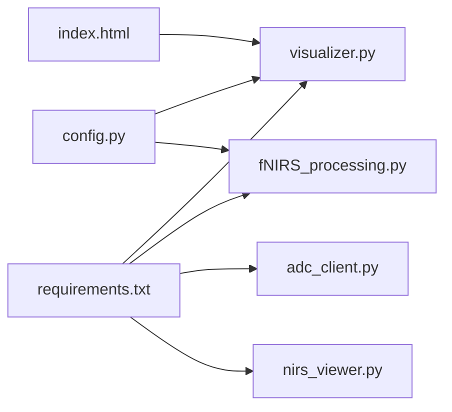

# 部署与运维

<cite>
**本文引用的文件**
- [README.md](file://README.md)
- [software/README.md](file://software/README.md)
- [software/requirements.txt](file://software/requirements.txt)
- [software/config.py](file://software/config.py)
- [software/visualizer.py](file://software/visualizer.py)
- [software/fNIRS_processing.py](file://software/fNIRS_processing.py)
- [software/adc_client.py](file://software/adc_client.py)
- [software/nirs_viewer.py](file://software/nirs_viewer.py)
- [software/index.html](file://software/index.html)
- [software/sample_data/all_groups.csv](file://software/sample_data/all_groups.csv)
</cite>

## 目录
1. [简介](#简介)
2. [项目结构](#项目结构)
3. [核心组件](#核心组件)
4. [架构总览](#架构总览)
5. [详细组件分析](#详细组件分析)
6. [依赖关系分析](#依赖关系分析)
7. [性能考虑](#性能考虑)
8. [故障排除指南](#故障排除指南)
9. [结论](#结论)
10. [附录](#附录)

## 简介
本文件面向fNIRS系统的部署与运维，提供从开发环境到生产部署、监控与维护、备份与恢复、版本升级与回滚、运维工具与自动化脚本的完整实践指南。系统由桌面端可视化界面（Flask + Socket.IO + Plotly）、实时数据采集与处理（PyQt5/PyQtGraph + 串口通信）、以及后处理流水线（MBLL/CBSI）组成，支持“实时ADC模式”和“记录与可视化模式”，并通过Web界面进行控制与展示。

## 项目结构
软件部分位于 software 目录，主要文件与职责如下：
- 运行时入口与Web服务：visualizer.py（Flask + Socket.IO）
- 实时数据采集与处理：fNIRS_processing.py（串口读取、数据处理、CSV输出）
- 实时客户端：adc_client.py（PyQt5 + Socket.IO + PyQtGraph）
- 数据查看器：nirs_viewer.py（CSV/.nirs可视化）
- 前端页面：index.html（Bootstrap + Plotly + Socket.IO）
- 配置：config.py（串口参数）
- 依赖：requirements.txt（Python第三方库）
- 示例数据：sample_data/*.csv（占位说明）

**图表来源**
- [software/visualizer.py](file://software/visualizer.py#L52-L53)
- [software/fNIRS_processing.py](file://software/fNIRS_processing.py#L20-L23)
- [software/adc_client.py](file://software/adc_client.py#L13-L15)
- [software/nirs_viewer.py](file://software/nirs_viewer.py#L1-L25)
- [software/config.py](file://software/config.py#L7-L12)
- [software/index.html](file://software/index.html#L1-L12)

**章节来源**
- [software/README.md](file://software/README.md#L1-L180)
- [software/requirements.txt](file://software/requirements.txt#L1-L15)
- [software/config.py](file://software/config.py#L1-L13)

## 核心组件
- Web可视化与控制服务（visualizer.py）
  - 提供Flask路由、Socket.IO事件、3D脑模型渲染、模式切换（实时/记录）、下载CSV等能力。
  - 支持演示模式，可启动模拟ADC与mBLL服务。
- 数据采集与处理流水线（fNIRS_processing.py）
  - 通过串口读取原始ADC数据，写入CSV；执行阈值过滤、低通滤波、滑动窗口RMS、块交错、带通滤波、MBLL与CBSI处理，并输出processed_output.csv。
- 实时ADC客户端（adc_client.py）
  - 使用Socket.IO连接Web服务，接收处理后的传感器数组，用PyQtGraph绘制8组通道曲线。
- 数据查看器（nirs_viewer.py）
  - 支持加载.mat（NIRS标准）与CSV，按通道类型与源-探测器映射进行可视化。
- 前端界面（index.html）
  - 提供传感器组高亮、MUX/发射器控制、模式选择（实时/记录）、计时器、下载与静态图查看等交互。
- 配置（config.py）
  - 定义串口设备路径、波特率、超时等参数。

**章节来源**
- [software/visualizer.py](file://software/visualizer.py#L52-L53)
- [software/fNIRS_processing.py](file://software/fNIRS_processing.py#L160-L234)
- [software/adc_client.py](file://software/adc_client.py#L39-L85)
- [software/nirs_viewer.py](file://software/nirs_viewer.py#L185-L368)
- [software/index.html](file://software/index.html#L265-L296)
- [software/config.py](file://software/config.py#L7-L12)

## 架构总览
系统采用“浏览器前端 + Flask/Socket.IO服务 + 串口数据采集 + 后处理流水线”的分层架构。Web服务负责控制、数据转发与可视化；实时模式下，前端直接接收处理后的浓度数据；记录模式下，后端启动子进程执行数据采集与处理，并在完成后提供下载与静态图查看。

**图表来源**
- [software/visualizer.py](file://software/visualizer.py#L646-L687)
- [software/fNIRS_processing.py](file://software/fNIRS_processing.py#L187-L234)

**章节来源**
- [software/visualizer.py](file://software/visualizer.py#L646-L711)
- [software/fNIRS_processing.py](file://software/fNIRS_processing.py#L445-L495)

## 详细组件分析

### 组件A：Web可视化与控制服务（visualizer.py）
- 功能要点
  - Flask路由：首页、更新图、组高亮、控制更新、启动/停止处理、下载CSV、静态图视图等。
  - Socket.IO：接收上游处理结果，推送3D脑模型更新。
  - 模式控制：实时ADC模式与记录/可视化模式；记录模式下可选择ADC与mBLL源。
  - 串口控制：接收前端控制数据，写入串口以控制MUX/发射器状态。
- 关键流程
  - 启动处理：根据模式启动子进程或模拟服务；记录模式关闭当前串口读取。
  - 停止处理：向子进程发送信号以优雅退出，并重新初始化串口。
  - 下载CSV：根据源映射返回对应文件名并触发下载。

**图表来源**
- [software/visualizer.py](file://software/visualizer.py#L690-L711)

**章节来源**
- [software/visualizer.py](file://software/visualizer.py#L591-L733)
- [software/visualizer.py](file://software/visualizer.py#L646-L711)

### 组件B：数据采集与处理流水线（fNIRS_processing.py）
- 功能要点
  - 串口读取：每次读取64字节，解析为8×5矩阵（组ID、短/长通道、发射器状态）。
  - 数据处理：阈值过滤、低通滤波、滑动窗口RMS、块交错、智能带通滤波、MBLL与CBSI。
  - 输出：生成interleaved_output.csv与processed_output.csv。
- 关键流程
  - 解析数据包：将原始字节转换为ADC值并反相至原始计数。
  - 处理步骤：按顺序执行滤波、RMS、块交错、时间戳重采样与四舍五入。
  - 最终输出：写入CSV并打印示例浓度表。

**图表来源**
- [software/fNIRS_processing.py](file://software/fNIRS_processing.py#L160-L185)
- [software/fNIRS_processing.py](file://software/fNIRS_processing.py#L445-L495)

**章节来源**
- [software/fNIRS_processing.py](file://software/fNIRS_processing.py#L160-L234)
- [software/fNIRS_processing.py](file://software/fNIRS_processing.py#L339-L443)

### 组件C：实时ADC客户端（adc_client.py）
- 功能要点
  - Socket.IO客户端：连接本地Web服务，监听processed_data事件。
  - PyQt5/PyQtGraph：8组通道曲线，每组3条迹线（短/长通道），实时刷新。
  - 线程化：SocketIO在独立线程中运行，避免阻塞GUI。
- 关键流程
  - 初始化：配置图形布局、颜色与图例。
  - 数据接收：校验长度为24，按组拆分并追加到队列。
  - 图形更新：定时器周期性将队列数据绘制成折线。

**图表来源**
- [software/adc_client.py](file://software/adc_client.py#L39-L85)
- [software/adc_client.py](file://software/adc_client.py#L144-L176)

**章节来源**
- [software/adc_client.py](file://software/adc_client.py#L39-L85)
- [software/adc_client.py](file://software/adc_client.py#L144-L176)

### 组件D：数据查看器（nirs_viewer.py）
- 功能要点
  - 支持加载.mat（NIRS标准）与CSV，自动推断通道类型（HbO/HbR/HbT）与源-探测器映射。
  - 可视化：按通道选择显示曲线，支持全选/清空。
- 关键流程
  - 文件加载：根据扩展名调用不同加载函数。
  - 类型推断：从元数据或列名推断血红蛋白类型。
  - 图像绘制：使用PyQtGraph绘制时间序列曲线。

**章节来源**
- [software/nirs_viewer.py](file://software/nirs_viewer.py#L110-L183)
- [software/nirs_viewer.py](file://software/nirs_viewer.py#L185-L368)

### 组件E：前端界面（index.html）
- 功能要点
  - 控制面板：MUX控制、发射器状态与PWM映射、覆盖开关。
  - 模式选择：实时ADC与记录/可视化（可选ADC/mBLL）。
  - 交互：3D脑模型、传感器组高亮、计时器、下载与静态图查看。
- 关键流程
  - 控制更新：收集表单数据，构造JSON并POST到/update_control_data。
  - 模式切换：根据选择启动/停止处理，记录模式完成后显示下载按钮。

**章节来源**
- [software/index.html](file://software/index.html#L166-L296)
- [software/index.html](file://software/index.html#L492-L746)

## 依赖关系分析
- Python依赖（requirements.txt）
  - Web框架与实时通信：Flask、Flask_SocketIO、python-socketio、eventlet
  - 数值与科学计算：numpy、pandas、scipy
  - 可视化：plotly、pyqtgraph、PyQt5
  - 串口通信：pyserial
  - 其他：nibabel（脑图谱）、nirsimple（fNIRS处理）、tabulate（表格打印）
- 内部模块依赖
  - visualizer.py 依赖 config.py（串口参数）、串口读取与子进程管理。
  - fNIRS_processing.py 依赖 config.py（串口参数）、信号处理与滤波库。
  - adc_client.py 依赖 socketio与pyqtgraph。
  - nirs_viewer.py 依赖 pandas、numpy、pyqtgraph、scipy.io。

**图表来源**
- [software/requirements.txt](file://software/requirements.txt#L1-L15)
- [software/config.py](file://software/config.py#L7-L12)
- [software/visualizer.py](file://software/visualizer.py#L32-L44)
- [software/fNIRS_processing.py](file://software/fNIRS_processing.py#L20-L23)
- [software/adc_client.py](file://software/adc_client.py#L13-L15)
- [software/nirs_viewer.py](file://software/nirs_viewer.py#L20-L24)
- [software/index.html](file://software/index.html#L1-L12)

**章节来源**
- [software/requirements.txt](file://software/requirements.txt#L1-L15)
- [software/visualizer.py](file://software/visualizer.py#L32-L44)
- [software/fNIRS_processing.py](file://software/fNIRS_processing.py#L20-L23)

## 性能考虑
- 实时性
  - Socket.IO异步模式与线程化串口读取，避免阻塞UI。
  - PyQtGraph按组绘制，定时器刷新频率可调，建议根据显示器刷新率与CPU负载调整。
- 计算密集度
  - MBLL/CBSI与滤波操作在记录模式下执行，建议在专用CPU上运行，避免与Web服务同机部署造成抖动。
- I/O与存储
  - CSV写入需定期flush，建议使用SSD与合理缓冲策略。
  - 大文件下载前可预生成静态HTML或压缩包，减少实时生成开销。
- 资源隔离
  - 将Web服务、数据采集与处理分别部署在不同进程/容器中，必要时使用独立CPU亲和性与内存限制。

## 故障排除指南
- 串口无法打开
  - 检查config.py中的SERIAL_PORT是否正确；Windows使用Get-WMIObject Win32_SerialPort查找COM端口；macOS/Linux使用ls /dev/tty.*。
  - 确认设备未被其他程序占用；重启串口驱动或更换USB转串口芯片。
- 数据为空或帧不完整
  - 检查TIMEOUT与BAUD_RATE；确认固件侧数据包格式为64字节；排查线缆与接触电阻。
- Web界面无法连接
  - 确认Flask服务监听地址与端口（默认5000）；检查防火墙与代理；浏览器控制台查看Socket.IO连接错误。
- 处理进程无法停止
  - 使用/stop_processing触发SIGUSR1信号；若仍无法停止，检查子进程列表与僵尸进程，必要时手动终止。
- 3D脑模型渲染异常
  - 确认BrainMesh与NIfTI文件存在且路径正确；浏览器网络面板检查资源加载；降低场景复杂度或禁用透明度。
- CSV下载为空
  - 确认记录模式已完成并生成目标CSV；检查文件权限与路径；尝试静态图页面验证数据存在。

**章节来源**
- [software/config.py](file://software/config.py#L7-L12)
- [software/visualizer.py](file://software/visualizer.py#L690-L711)
- [software/index.html](file://software/index.html#L305-L306)

## 结论
本指南提供了fNIRS系统从开发到生产的完整运维蓝图：明确的开发环境配置、清晰的部署流程、完善的监控与维护方案、可靠的备份与恢复策略、以及可落地的自动化脚本与应急响应流程。建议在生产环境中采用容器化与进程隔离、定期备份数据与模型文件、建立变更评审与回滚机制，确保系统稳定可靠。

## 附录

### A. 开发环境配置
- Python虚拟环境
  - 创建虚拟环境并激活，安装requirements.txt中的依赖。
- 串口配置
  - 在config.py中设置正确的SERIAL_PORT、BAUD_RATE与TIMEOUT。
- 运行方式
  - 正常模式：python visualizer.py；演示模式：python visualizer.py demo。
- 前端访问
  - 浏览器打开http://localhost:8050（Web服务默认端口）。

**章节来源**
- [software/README.md](file://software/README.md#L58-L100)
- [software/config.py](file://software/config.py#L7-L12)

### B. 生产环境部署流程
- 服务器准备
  - 操作系统：Linux（推荐Ubuntu/CentOS）；安装Python 3.8+与pip。
  - 硬件：具备USB接口与足够I/O性能；建议独立CPU用于数据处理。
- 依赖安装
  - 在虚拟环境中安装requirements.txt。
- Web服务配置
  - 使用WSGI服务器（如Gunicorn）与反向代理（如Nginx）；开启SSL与访问控制。
  - 将Flask端口绑定到内网IP或Unix Socket，避免直接暴露公网。
- 数据与文件存储
  - CSV输出目录与日志目录分离；设置磁盘配额与清理策略。
- 安全与权限
  - 串口设备加入用户组；最小权限原则；限制Web服务用户权限。
  - 防火墙放行必需端口；启用HTTPS与强密码认证。

**章节来源**
- [software/requirements.txt](file://software/requirements.txt#L1-L15)
- [software/visualizer.py](file://software/visualizer.py#L52-L53)

### C. 系统监控与维护
- 性能监控
  - CPU/内存/磁盘/网络：使用系统监控工具；针对数据处理阶段设置告警阈值。
  - Web服务：监控请求延迟、并发连接数、错误码分布。
- 日志管理
  - Flask/Socket.IO日志级别与轮转；串口读取与处理日志分离；保留最近30天日志。
- 故障排除
  - 快速定位：查看串口状态、进程列表、磁盘空间；复现演示模式验证问题。
  - 应急措施：降级到只读模式、临时关闭数据处理、回退到上一版本。

**章节来源**
- [software/visualizer.py](file://software/visualizer.py#L46-L47)

### D. 备份与恢复机制
- 备份范围
  - 用户数据（CSV文件）、配置文件（config.py）、3D模型文件（BrainMesh/aal.nii）、日志与缓存。
- 备份策略
  - 增量备份：每日全备+每小时增量；异地容灾。
  - 自动化：使用cron或调度系统执行备份任务。
- 恢复流程
  - 验证备份完整性；按顺序恢复配置、模型与数据；重启Web服务与数据处理进程。

**章节来源**
- [software/sample_data/all_groups.csv](file://software/sample_data/all_groups.csv#L1-L2)

### E. 版本升级与回滚
- 升级流程
  - 执行/stop_processing停止所有子进程；备份当前版本与数据；拉取新版本；安装依赖；重启服务。
- 回滚流程
  - 停止服务；恢复备份；回退依赖版本；启动服务；验证功能。

**章节来源**
- [software/visualizer.py](file://software/visualizer.py#L690-L711)

### F. 运维工具与自动化脚本
- 建议工具
  - 进程管理：systemd或Supervisor；日志轮转：logrotate；监控：Prometheus/Grafana；备份：Restic/Duplicity。
- 自动化脚本
  - 启动脚本：封装虚拟环境激活、依赖检查、服务启动。
  - 备份脚本：打包CSV、配置与模型文件，上传至对象存储。
  - 监控脚本：检测串口可用性、进程存活、磁盘空间与CPU负载。

**章节来源**
- [software/README.md](file://software/README.md#L58-L100)