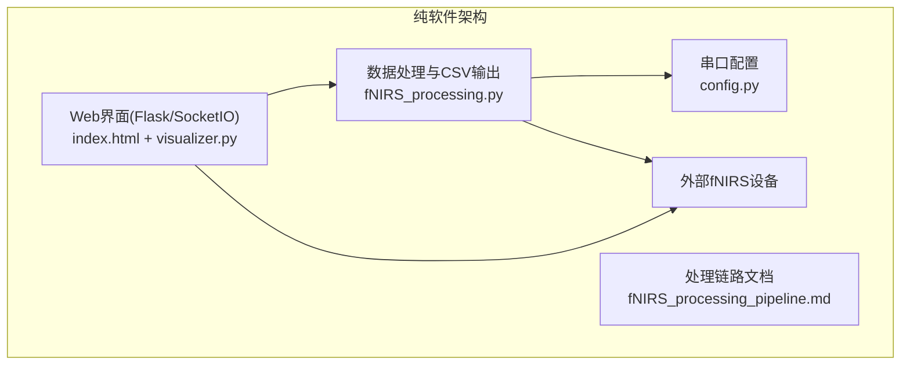
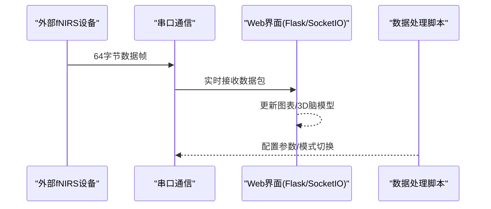
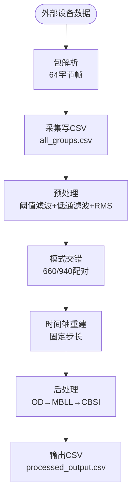
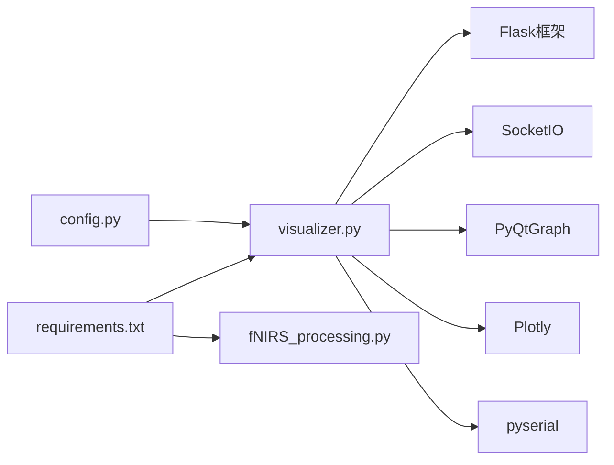

# 项目概述

<cite>
**本文引用的文件**
- [README.md](file://README.md)
- [software/README.md](file://software/README.md)
- [software/config.py](file://software/config.py)
- [software/visualizer.py](file://software/visualizer.py)
- [software/fNIRS_processing.py](file://software/fNIRS_processing.py)
- [software/fNIRS_processing_pipeline.md](file://software/fNIRS_processing_pipeline.md)
- [software/requirements.txt](file://software/requirements.txt)
- [software/index.html](file://software/index.html)
</cite>

## 更新摘要
**变更内容**
- 更新架构描述以反映从硬件-固件-软件生态系统到纯软件解决方案的转变
- 强调当前版本专注于fNIRS上位机软件功能
- 移除硬件和固件相关章节，新增纯软件架构说明
- 更新项目结构图以体现当前纯软件架构
- 调整技术特色和功能列表以匹配当前软件能力

## 目录
1. [简介](#简介)
2. [项目结构](#项目结构)
3. [核心组件](#核心组件)
4. [架构总览](#架构总览)
5. [详细组件分析](#详细组件分析)
6. [依赖关系分析](#依赖关系分析)
7. [性能考量](#性能考量)
8. [故障排查指南](#故障排查指南)
9. [结论](#结论)
10. [附录](#附录)

## 简介
本项目是一个基于功能性近红外光谱（fNIRS）的**纯软件上位机系统**，专注于通过串口连接外部设备，完成数据采集、预处理与血氧反演（MBLL/CBSI）等全流程处理。项目采用改进的比尔-朗伯定律（Modified Beer-Lambert Law, mBLL）进行信号处理，并通过Python图形界面提供实时ADC数据与处理后的浓度变化可视化。

**更新** 项目已从完整的硬件-固件-软件生态系统转变为专注于上位机软件的纯软件解决方案，不再包含硬件设计和固件开发相关内容。

系统主要亮点：
- **纯软件架构**：完全基于Python开发，无需专用硬件即可运行
- **实时数据处理**：支持串口通信、实时ADC显示与离线处理
- **完整的fNIRS处理链路**：从原始ADC数据到血红蛋白浓度变化的完整处理流程
- **交互式可视化**：支持实时曲线、静态图表、3D脑模型等多维度可视化
- **灵活的运行模式**：支持实时监控模式和记录分析模式

**章节来源**
- [README.md:1-12](file://README.md#L1-L12)

## 项目结构
项目当前为纯软件架构，主要包含上位机Python代码：
- **软件层**：基于Flask/SocketIO的Web界面与数据处理脚本，支持实时ADC显示、记录与mBLL处理
- **数据处理层**：完整的fNIRS数据处理链路，包含预处理、后处理和可视化功能
- **配置层**：串口配置、采样参数和系统设置

**图表来源**
- [software/visualizer.py:589-730](file://software/visualizer.py#L589-L730)
- [software/fNIRS_processing.py:1-50](file://software/fNIRS_processing.py#L1-L50)
- [software/config.py:7-13](file://software/config.py#L7-L13)

**章节来源**
- [software/README.md:1-180](file://software/README.md#L1-L180)

## 核心组件
- **Web界面系统**
  - Flask+SocketIO Web界面，支持实时ADC动画、静态图、3D脑模型与CSV导出
  - Bootstrap+jQuery+Plotly构建的用户友好的交互界面
- **数据处理引擎**
  - 完整的fNIRS数据处理链路：串口采集、预处理、后处理、可视化
  - 支持实时模式（ADC Only）和记录模式（ADC + mBLL）
- **配置管理系统**
  - 串口通信配置（COM端口、波特率、超时设置）
  - 采样参数和处理参数的集中管理
- **可视化组件**
  - 实时曲线显示（PyQtGraph）
  - 交互式静态图表（Plotly）
  - 3D脑模型可视化（基于NIfTI脑图谱）

**章节来源**
- [software/visualizer.py:1-100](file://software/visualizer.py#L1-L100)
- [software/fNIRS_processing.py:1-50](file://software/fNIRS_processing.py#L1-L50)
- [software/config.py:7-13](file://software/config.py#L7-L13)

## 架构总览
系统采用纯软件架构，通过串口与外部fNIRS设备通信，完成数据采集、处理和可视化。数据流从外部设备经串口传输到上位机，再由软件完成实时可视化与离线处理。

**图表来源**
- [software/visualizer.py:38-42](file://software/visualizer.py#L38-L42)
- [software/fNIRS_processing.py:23-24](file://software/fNIRS_processing.py#L23-L24)

## 详细组件分析

### 纯软件架构设计
- **Web界面层**：基于Flask框架构建，提供Bootstrap+jQuery+Plotly的现代化用户界面
- **数据处理层**：完整的fNIRS处理链路，包含数据采集、预处理、后处理和可视化
- **通信层**：通过pyserial库实现与外部设备的串口通信
- **可视化层**：支持实时动画、静态图表和3D脑模型的多维度可视化

**章节来源**
- [software/README.md:1-48](file://software/README.md#L1-L48)

### 数据处理链路详解
- **串口采集**：固定64字节帧格式，包含8组传感器数据和发射器状态
- **预处理阶段**：阈值滤波、低通滤波、分段RMS、模式交错、时间轴重建
- **后处理阶段**：双波长配对、OD转换、带通滤波、MBLL反演、CBSI校正
- **输出格式**：支持原始ADC数据和处理后的血红蛋白浓度变化数据

**图表来源**
- [software/fNIRS_processing_pipeline.md:8-26](file://software/fNIRS_processing_pipeline.md#L8-L26)
- [software/fNIRS_processing.py:159-184](file://software/fNIRS_processing.py#L159-L184)

**章节来源**
- [software/fNIRS_processing_pipeline.md:1-592](file://software/fNIRS_processing_pipeline.md#L1-L592)
- [software/fNIRS_processing.py:186-234](file://software/fNIRS_processing.py#L186-L234)

### fNIRS技术原理与应用价值
- **技术原理**
  - 利用近红外光穿透头皮与颅骨，检测血氧饱和度变化，反映神经元活动引起的局部血流动力学变化
  - 通过改进的比尔-朗伯定律将光强变化转换为组织中氧合/脱氧血红蛋白浓度变化
- **应用价值**
  - **教育与科研**：低成本、便携、易操作，适合课堂演示与小型实验
  - **个人健康监测**：长期佩戴下的脑功能状态跟踪
  - **人机交互**：结合脑活动信号的反馈训练与脑机接口探索

**章节来源**
- [README.md:9-11](file://README.md#L9-L11)

## 依赖关系分析
- **软件内部依赖**
  - visualizer.py依赖config.py中的串口配置，处理脚本依赖第三方库（如nirsimple、scipy、pandas）
  - Flask+SocketIO提供Web界面和实时通信功能
  - PyQtGraph和Plotly提供数据可视化支持
- **外部设备依赖**
  - 通过pyserial库与外部fNIRS设备进行串口通信
  - 需要符合64字节帧格式的数据协议

**图表来源**
- [software/config.py:7-13](file://software/config.py#L7-L13)
- [software/requirements.txt:1-15](file://software/requirements.txt#L1-L15)
- [software/visualizer.py:19-28](file://software/visualizer.py#L19-L28)

**章节来源**
- [software/requirements.txt:1-15](file://software/requirements.txt#L1-L15)
- [software/visualizer.py:19-30](file://software/visualizer.py#L19-L30)

## 性能考量
- **实时性优化**
  - 使用SocketIO实现实时数据传输，降低延迟
  - PyQtGraph提供高效的实时曲线渲染
  - 多线程架构支持并发数据处理和可视化
- **数据处理效率**
  - NumPy和SciPy提供高性能数值计算
  - Pandas优化CSV数据处理和分析
  - 智能带通滤波减少计算复杂度
- **内存管理**
  - 数据队列限制避免内存溢出
  - 流式处理支持大数据集处理

**章节来源**
- [software/visualizer.py:56-57](file://software/visualizer.py#L56-L57)
- [software/fNIRS_processing.py:68-82](file://software/fNIRS_processing.py#L68-L82)

## 故障排查指南
- **串口连接问题**
  - 确认config.py中的SERIAL_PORT路径正确（Windows示例：COM3；macOS/Linux示例：/dev/tty.usbmodem...）
  - 在终端工具中检查波特率与超时设置
- **Web界面访问问题**
  - 确认Flask服务正常启动，端口8050可用
  - 检查浏览器兼容性和网络连接
- **数据处理异常**
  - 验证外部设备数据格式符合64字节帧协议
  - 检查CSV文件读写权限和磁盘空间
  - 确认依赖库版本兼容性

**章节来源**
- [software/config.py:7-13](file://software/config.py#L7-L13)
- [software/README.md:65-86](file://software/README.md#L65-L86)

## 结论
本项目通过纯软件架构设计，构建了一个功能完整、用户友好的fNIRS数据处理系统。其核心优势在于：
- **纯软件设计**：无需专用硬件即可运行，降低了使用门槛和成本
- **完整的处理链路**：从原始数据到最终结果的全流程自动化处理
- **丰富的可视化功能**：支持实时监控和离线分析的多种可视化方式
- **灵活的运行模式**：可根据需求选择实时监控或深度分析模式

该系统既适合初学者快速上手，也为有经验的开发者提供了清晰的扩展点与优化空间。

## 附录
- **系统主要特性清单**
  - **纯软件架构**：基于Python开发，无需专用硬件
  - **实时数据处理**：支持串口通信、实时ADC显示与离线处理
  - **完整的fNIRS处理链路**：从原始ADC到血红蛋白浓度变化的完整流程
  - **交互式可视化**：实时曲线、静态图表、3D脑模型等多维度展示
  - **灵活的运行模式**：实时监控模式和记录分析模式
  - **Web界面**：Bootstrap+jQuery+Plotly构建的现代化用户界面
  - **模块化设计**：清晰的组件分离，便于维护和扩展

**章节来源**
- [software/README.md:11-48](file://software/README.md#L11-L48)
- [software/requirements.txt:1-15](file://software/requirements.txt#L1-L15)