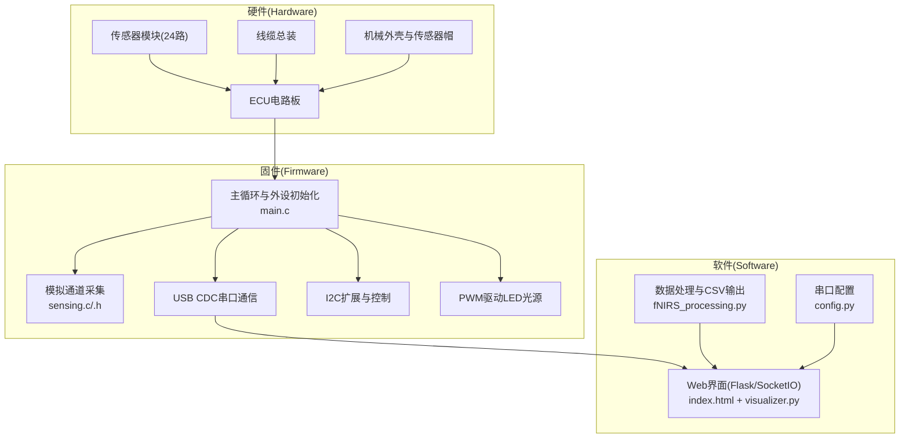
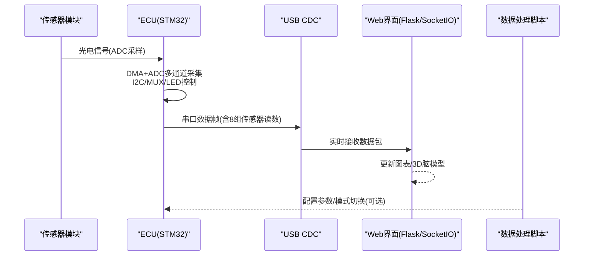
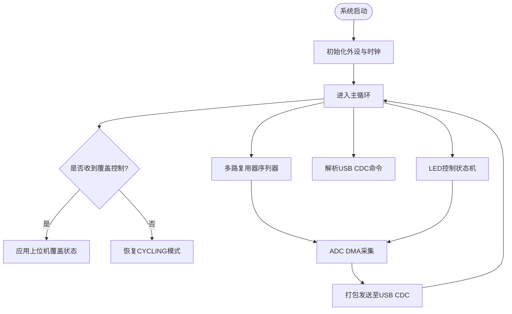
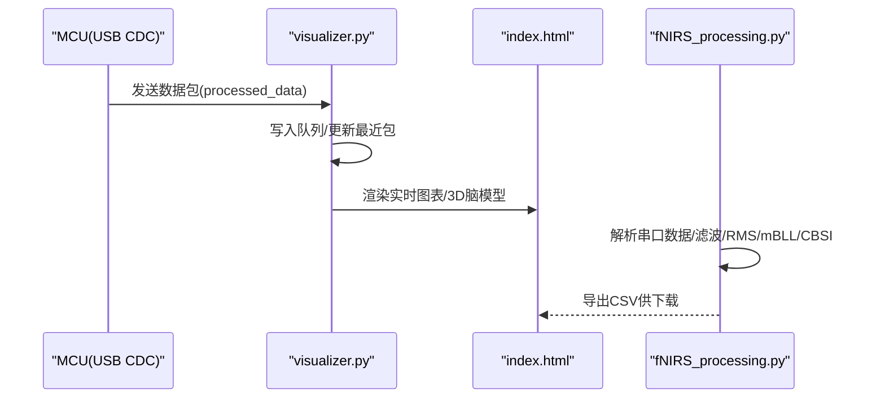
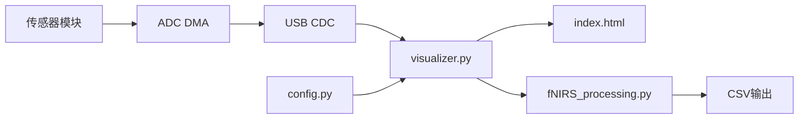

# 项目概述

<cite>
**本文引用的文件**
- [README.md](file://README.md)
- [hardware/README.md](file://hardware/README.md)
- [firmware/README.md](file://firmware/README.md)
- [software/README.md](file://software/README.md)
- [firmware/STM32/fNIRS/Core/Src/main.c](file://firmware/STM32/fNIRS/Core/Src/main.c)
- [firmware/STM32/fNIRS/Core/Inc/main.h](file://firmware/STM32/fNIRS/Core/Inc/main.h)
- [firmware/STM32/fNIRS/fNIRS.ioc](file://firmware/STM32/fNIRS/fNIRS.ioc)
- [software/visualizer.py](file://software/visualizer.py)
- [software/fNIRS_processing.py](file://software/fNIRS_processing.py)
- [software/config.py](file://software/config.py)
- [software/index.html](file://software/index.html)
- [firmware/STM32/fNIRS/Core/Src/sensing.c](file://firmware/STM32/fNIRS/Core/Src/sensing.c)
- [firmware/STM32/fNIRS/Core/Inc/sensing.h](file://firmware/STM32/fNIRS/Core/Inc/sensing.h)
</cite>

## 目录
1. [简介](#简介)
2. [项目结构](#项目结构)
3. [核心组件](#核心组件)
4. [架构总览](#架构总览)
5. [详细组件分析](#详细组件分析)
6. [依赖关系分析](#依赖关系分析)
7. [性能考量](#性能考量)
8. [故障排查指南](#故障排查指南)
9. [结论](#结论)
10. [附录](#附录)

## 简介
本项目是一个基于功能性近红外光谱（fNIRS）的可穿戴脑机接口系统，旨在以较低成本、良好的人体工学设计与用户友好性，实现对大脑活动的实时监测与可视化。项目采用改进的比尔-朗伯定律（Modified Beer-Lambert Law, mBLL）进行信号处理，并通过Python图形界面提供实时ADC数据与处理后的浓度变化可视化。

系统主要亮点：
- 24个传感器模块（支持24路检测器与8组双波长LED光源，波长660 nm与990 nm）
- 基于低功耗STM32微控制器（STM32L476RET6）的定制电气控制单元（ECU），负责同步控制与数据采集
- 人体工学机械结构，适合长时间佩戴
- 基于Web的交互式Python GUI，支持串口通信、实时可视化与模块控制

**章节来源**
- [README.md](file://README.md#L7-L19)

## 项目结构
项目分为硬件、固件与软件三层：
- 硬件层：包含探测器/光源/optode、线缆总装、ECU电路板与传感器模块等
- 固件层：运行在STM32上的嵌入式程序，负责ADC采集、I2C扩展、PWM控制、USB CDC串口通信与定时触发
- 软件层：基于Flask/SocketIO的Web界面与数据处理脚本，支持实时ADC显示、记录与mBLL处理

**图表来源**
- [firmware/STM32/fNIRS/Core/Src/main.c](file://firmware/STM32/fNIRS/Core/Src/main.c#L92-L181)
- [firmware/STM32/fNIRS/Core/Src/sensing.c](file://firmware/STM32/fNIRS/Core/Src/sensing.c#L50-L85)
- [software/visualizer.py](file://software/visualizer.py#L52-L96)
- [software/fNIRS_processing.py](file://software/fNIRS_processing.py#L10-L25)
- [software/config.py](file://software/config.py#L7-L13)

**章节来源**
- [hardware/README.md](file://hardware/README.md#L1-L19)
- [firmware/README.md](file://firmware/README.md#L1-L17)
- [software/README.md](file://software/README.md#L1-L180)

## 核心组件
- STM32 ECU主控与外设
  - 主循环与系统时钟配置、DMA+ADC多通道采集、I2C扩展、SPI、USB CDC、TIM定时器
- 感知与采集子系统
  - ADC DMA采集8路传感器通道，配合多路复用器选择输入通道；内置低通滤波与标定缓冲
- 控制与通信
  - I2C控制LED光源与多路复用器状态；USB CDC用于上位机交互与命令下发
- 上位机软件
  - Flask+SocketIO Web界面，支持实时ADC动画、静态图、3D脑模型与CSV导出
  - 数据处理脚本：解析串口包、RMS分段、滤波、插值、mBLL与CBSI处理

**章节来源**
- [firmware/STM32/fNIRS/Core/Src/main.c](file://firmware/STM32/fNIRS/Core/Src/main.c#L187-L257)
- [firmware/STM32/fNIRS/Core/Src/sensing.c](file://firmware/STM32/fNIRS/Core/Src/sensing.c#L50-L85)
- [software/visualizer.py](file://software/visualizer.py#L52-L96)
- [software/fNIRS_processing.py](file://software/fNIRS_processing.py#L160-L186)

## 架构总览
系统采用“硬件-固件-软件”分层架构，数据流从传感器模块经ECU采集与控制，通过USB CDC传输至上位机，再由软件完成实时可视化与离线处理。

**图表来源**
- [firmware/STM32/fNIRS/Core/Src/main.c](file://firmware/STM32/fNIRS/Core/Src/main.c#L146-L178)
- [software/visualizer.py](file://software/visualizer.py#L67-L96)
- [software/fNIRS_processing.py](file://software/fNIRS_processing.py#L187-L200)

## 详细组件分析

### 硬件组成与设计理念
- 探测器与光源optode：分别集成探测器与LED光源，形成完整的fNIRS传感链路
- ECU电路板：集成MCU、电源、I/O、USB接口与扩展接口，支撑多路传感器同步采集
- 线缆总装：连接各模块，确保信号完整性与机械可靠性
- 机械结构：头盔式或帽式设计，兼顾舒适性与稳定性

**章节来源**
- [hardware/README.md](file://hardware/README.md#L7-L15)

### 固件：STM32主控与外设协同
- 外设初始化与时钟配置
  - ADC1多通道扫描、DMA循环传输、I2C1/I2C2、SPI1、USART1、TIM3/TIM4、USB设备
- 主循环逻辑
  - 启动多路复用器与LED控制状态机，周期性执行采集与串口解析
  - 支持上位机下发覆盖控制（强制设置多路复用器与LED工作模式）
- 关键数据路径
  - ADC DMA缓冲区承载8路传感器原始ADC值，经低通滤波与标定后供上位机使用

**图表来源**
- [firmware/STM32/fNIRS/Core/Src/main.c](file://firmware/STM32/fNIRS/Core/Src/main.c#L132-L178)
- [firmware/STM32/fNIRS/fNIRS.ioc](file://firmware/STM32/fNIRS/fNIRS.ioc#L27-L43)

**章节来源**
- [firmware/STM32/fNIRS/Core/Src/main.c](file://firmware/STM32/fNIRS/Core/Src/main.c#L92-L181)
- [firmware/STM32/fNIRS/Core/Inc/main.h](file://firmware/STM32/fNIRS/Core/Inc/main.h#L60-L70)
- [firmware/STM32/fNIRS/fNIRS.ioc](file://firmware/STM32/fNIRS/fNIRS.ioc#L66-L83)

### 软件：实时可视化与数据处理
- Web界面与SocketIO
  - Flask服务端接收上游数据包，维护队列并触发图表更新
  - 支持ADC实时动画与处理后浓度数据的静态图
- 数据处理管线
  - 解析64字节数据包为8×5矩阵（组ID、短/长通道、发射器状态）
  - RMS分段计算、滤波、重采样与mBLL/CBSI处理，输出CSV
- 3D脑模型
  - 加载平滑脑表面网格与AAL图谱，映射传感器位置与激活区域高亮

**图表来源**
- [software/visualizer.py](file://software/visualizer.py#L67-L96)
- [software/fNIRS_processing.py](file://software/fNIRS_processing.py#L160-L186)
- [software/index.html](file://software/index.html#L1-L200)

**章节来源**
- [software/README.md](file://software/README.md#L1-L180)
- [software/visualizer.py](file://software/visualizer.py#L52-L96)
- [software/fNIRS_processing.py](file://software/fNIRS_processing.py#L160-L200)
- [software/config.py](file://software/config.py#L7-L13)

### fNIRS技术原理与应用价值
- 技术原理
  - 利用近红外光穿透头皮与颅骨，检测血氧饱和度变化，反映神经元活动引起的局部血流动力学变化
  - 通过改进的比尔-朗伯定律将光强变化转换为组织中氧合/脱氧血红蛋白浓度变化
- 应用价值
  - 教育与科研：低成本、便携、易操作，适合课堂演示与小型实验
  - 个人健康监测：长期佩戴下的脑功能状态跟踪
  - 人机交互：结合脑活动信号的反馈训练与脑机接口探索

**章节来源**
- [README.md](file://README.md#L9-L11)

## 依赖关系分析
- 硬件到固件
  - 传感器模块通过模拟通道接入ADC，经DMA搬运到内存缓冲
  - I2C控制多路复用器与LED光源，SPI用于扩展接口
- 固件到软件
  - USB CDC作为串口桥接，向主机发送结构化数据包
  - 上位机通过SocketIO订阅处理后的浓度数据，实现低延迟可视化
- 软件内部
  - visualizer.py依赖config.py中的串口配置，处理脚本依赖第三方库（如nirsimple、scipy、pandas）

**图表来源**
- [firmware/STM32/fNIRS/Core/Src/sensing.c](file://firmware/STM32/fNIRS/Core/Src/sensing.c#L50-L85)
- [software/visualizer.py](file://software/visualizer.py#L52-L96)
- [software/fNIRS_processing.py](file://software/fNIRS_processing.py#L10-L25)
- [software/config.py](file://software/config.py#L7-L13)

**章节来源**
- [firmware/STM32/fNIRS/Core/Src/sensing.c](file://firmware/STM32/fNIRS/Core/Src/sensing.c#L50-L85)
- [software/visualizer.py](file://software/visualizer.py#L52-L96)
- [software/fNIRS_processing.py](file://software/fNIRS_processing.py#L10-L25)

## 性能考量
- 采样与触发
  - 使用TIM3/TIM4配合ADC外部触发，保证8路通道同步采样
  - ADC配置为独立模式、扫描使能、DMA循环传输，降低CPU占用
- 数据通路
  - DMA搬运原始ADC值，减少中断开销；固件侧进行低通滤波，抑制噪声
- 可视化与处理
  - 上位机采用队列与锁保护，避免并发冲突；实时模式仅显示ADC，降低计算压力
  - 处理模式支持RMS分段、带通滤波与重采样，平衡精度与实时性

**章节来源**
- [firmware/STM32/fNIRS/fNIRS.ioc](file://firmware/STM32/fNIRS/fNIRS.ioc#L14-L16)
- [firmware/STM32/fNIRS/Core/Src/sensing.c](file://firmware/STM32/fNIRS/Core/Src/sensing.c#L45-L48)
- [software/visualizer.py](file://software/visualizer.py#L58-L60)

## 故障排查指南
- 串口连接问题
  - 确认config.py中的SERIAL_PORT路径正确（Windows示例：COM3；macOS/Linux示例：/dev/tty.usbmodem...）
  - 在终端工具中检查波特率与超时设置
- USB CDC无法通信
  - 检查USB CDC枚举与驱动安装；确认上位机未占用串口
- 数据异常或无响应
  - 观察MCU测试LED闪烁；检查I2C时序与器件地址；确认多路复用器与LED控制状态
- 处理结果不理想
  - 调整RMS分段窗口与滤波参数；检查采样率与目标频率匹配

**章节来源**
- [software/config.py](file://software/config.py#L7-L13)
- [software/README.md](file://software/README.md#L65-L86)
- [firmware/STM32/fNIRS/Core/Src/main.c](file://firmware/STM32/fNIRS/Core/Src/main.c#L176-L178)

## 结论
本项目通过硬件、固件与软件的协同设计，构建了一个低成本、便携且用户友好的fNIRS脑活动监测系统。其核心在于：
- 24路传感器模块与8组双波长光源，满足多通道同步采集需求
- STM32平台的高效外设组合与USB CDC通信，保障实时性与稳定性
- Python图形界面与数据处理管线，提供直观的可视化与可重复的离线分析流程

该系统既适合初学者快速上手，也为有经验的开发者提供了清晰的扩展点与优化空间。

## 附录
- 系统主要特性清单（摘自项目说明）
  - 24个传感器模块（24路检测器、8组双波长LED光源）
  - 基于STM32L476RET6的ECU，支持I2C、SPI、ADC、USB CDC与定时器
  - 人体工学机械设计，适合长时间佩戴
  - 交互式Python GUI，支持实时ADC可视化、记录与mBLL处理
  - Web界面（Bootstrap+Plotly+SocketIO），支持3D脑模型与控制面板

**章节来源**
- [README.md](file://README.md#L13-L19)
- [software/README.md](file://software/README.md#L11-L48)