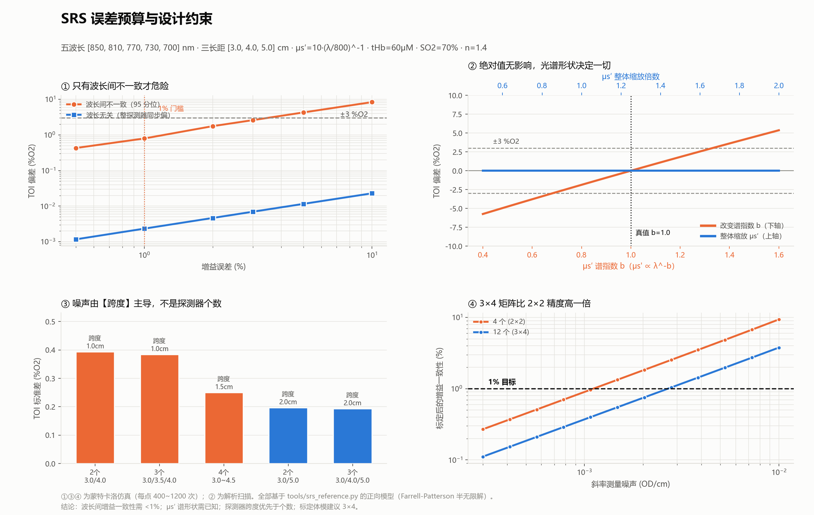

# 绝对脑血氧（SRS）技术路线

> 目标：在现有 MBLL 相对量路线之外，增加**空间分辨光谱（SRS）**通路，输出绝对组织氧饱和度 TOI/rSO₂。
>
> ⚠️ **本路线与现有送检主线相互独立。** `检验方法.md` 的附录 BB 体模试验、`软件验证报告.md` 的离线链路验证均不受影响；SRS 失败也不影响已有成果。

---

## 0. 结论摘要

| 项 | 结论 |
|---|---|
| **技术可行性** | ✅ 链路闭合，CW + 多距离 + SRS 可产出绝对血氧读数 |
| **硬件配置** | ✅ 拟定的 1 短 + 3 长、五波长 **优于商用基线**（NIRO/EGOS 均为 2 长距 + 3 波长） |
| **算法** | ✅ 原理公开，参考实现见 [`tools/srs_reference.py`](tools/srs_reference.py)，自检通过 |
| **最大门槛** | ⚠️ **波长间增益一致性 <1%** —— 标定工艺问题，非算法问题 |
| **第二门槛** | ⚠️ **μs′ 光谱形状**（§3.2）—— 固定假设时谱指数偏 ±0.4 → TOI 偏 ±3.7 %O₂；五波长可自解谱指数把该项降到 0.03 %O₂，代价是对幂律失配更敏感。**属生物变异，体模标定解决不了** |
| **体模** | ✅ 已询厂并逐条判定（§4.5）。逐波长认证**非必需**——3×4 二维矩阵可自标增益；但自标定会**静默失败**，须留独立参照 |
| **法规** | ❌ **无对应国标条款**（GB/T 44423 的"空间分辨率"指通道间距，非 SRS） |



---

## 1. 算法

### 1.1 公开与私有的分界

| 部分 | 状态 |
|---|---|
| 扩散方程半无限解（Farrell-Patterson） | ✅ 公开 |
| SRS 工作方程 | ✅ 公开 |
| μa 反演、ε → TOI | ✅ 公开 |
| **μs′(λ) 具体模型** | ❌ 厂商私有 —— **但本项目可绕过，见下** |
| **标定常数、温补、伪影抑制、信号质量判据** | ❌ 私有 |

> EGOS-600 验证论文原文：「...and **by assuming** the wavelength dependence of the reduced scattering coefficient, the ratio of the absorption coefficient under at least two wavelengths can be calculated.」
>
> 关键词是 **assuming** —— 连滨松也是假设，各家假设什么不公开。该论文亦承认两台 SRS 设备互比偏倚 8%，原因「**remains unknown**」。

**⇒ 两家商用设备的私有假设互相就不一致，且无人知道谁对——没有金标准可对齐。**
目标因此不是「拿到他们的模型」，而是「有一个自己能标定、能验证、能向审评说清楚的模型」。

#### 私有项的三类拆分与对策

| 类别 | 内容 | 对策 |
|---|---|---|
| **A 标定常数** | 增益归一化、系统偏差修正 | **本来就须自标**——常数与本机探头几何/LED/PD 绑定，他人的无法移植。§3.2.2 的 b 恒偏 **+0.10** 即此类典型，由 §4.6 体模矩阵产出 |
| **B μs′(λ) 模型** | 假设何种谱形 | ✅ **本项目绕过**——五波长超定可自解谱指数（§2.3、§3.2.2）。NIRO/EGOS 均为 3 波长（4 未知 / 3 方程，欠定），**其「必须假设」是硬件限制所迫，非藏有诀窍** |
| **C 工程 know-how** | 温补、伪影抑制、质量判据 | 无捷径但无门槛：温补为板载温度传感 + 标定扫温建表；伪影抑制与质量判据学术界方法公开，本项目贴肤检测已有同类基础 |

**注册角度**：私有模型对本项目是负担而非资产——审评要求算法可解释、可追溯。本路线正向模型全公开、谱指数自解（只需披露约束区间而非一个不可溯源的假设）、标定常数来自可溯源体模、参考实现附自检。

⚠️ **专利风险**：公式属公开文献，但**具体实现组合、探头结构、标定流程可能受专利保护**（如苏州爱琴，见 §5）。需在硬件定型前做专业 FTO 检索——**本文档不构成专利意见**。

### 1.2 完整公式

**① 半无限介质稳态漫反射**

$$R(\rho)=\frac{1}{4\pi}\left[z_0\left(\mu_{eff}+\frac{1}{r_1}\right)\frac{e^{-\mu_{eff}r_1}}{r_1^2}+(z_0+2z_b)\left(\mu_{eff}+\frac{1}{r_2}\right)\frac{e^{-\mu_{eff}r_2}}{r_2^2}\right]$$

$$z_0=\frac{1}{\mu_a+\mu_s'},\quad D=\frac{1}{3(\mu_a+\mu_s')},\quad z_b=2D\frac{1+R_{eff}}{1-R_{eff}}$$

$$r_1=\sqrt{\rho^2+z_0^2},\qquad r_2=\sqrt{\rho^2+(z_0+2z_b)^2}$$

`R_eff` 由折射率决定 —— **这是折射率进入结果的入口**，见 §4.2。

**② SRS 工作方程（大 ρ 渐近）**

$$\boxed{\frac{\partial A}{\partial\rho}=\frac{1}{\ln 10}\left(\mu_{eff}+\frac{2}{\rho}\right)}$$

**③ 反演**

$$\mu_{eff}=\ln 10\cdot\frac{\partial A}{\partial\rho}-\frac{2}{\bar\rho},\qquad \mu_a=\frac{\mu_{eff}^2}{3\mu_s'}$$

（严格式为 $\mu_{eff}=\sqrt{3\mu_a(\mu_a+\mu_s')}$，因 $\mu_a\ll\mu_s'$ 简化）

**④ 解色团**

$$\mu_a(\lambda)=\ln 10\left[\varepsilon_{HbO}(\lambda)c_{HbO}+\varepsilon_{HbR}(\lambda)c_{HbR}\right],\qquad \text{TOI}=\frac{c_{HbO}}{c_{HbO}+c_{HbR}}\times 100\%$$

### 1.3 一个必须理解的性质

⚠️ **SRS 给出绝对饱和度，但给不出绝对浓度。**

μs′ 整体缩放 k 倍 → μa 缩放 1/k → c_HbO 与 c_HbR 同步缩放 → **比值不变**。

实测（图 ②，蓝线）：μs′ ×0.7 / ×1.0 / ×1.5，TOI 偏差均为 **−0.00**。

这就是为什么 NIRO 报告 TOI（绝对）的同时只能报 nTHI（归一化，相对）。

### 1.4 参考实现自检

[`tools/srs_reference.py --selftest`](tools/srs_reference.py) 实测：

| 真值 SO₂ | 反演 TOI | 偏差 |
|---|---|---|
| 30% | 30.34% | +0.34 |
| 50% | 50.13% | +0.13 |
| 70% | 69.83% | −0.17 |
| 90% | 89.45% | −0.55 |

单调、线性、偏差 <0.6 %O₂。

⚠️ 但 μa 反演值系统性偏高约 **2.8%**（0.1424 vs 真值 0.1385）—— **渐近斜率法相对精确解的固有偏差**，在比值中大部分抵消，剩余需由体模标定吸收。

---

## 2. 硬件配置

### 2.1 探头布局

```
      [S1]  五波长 LED  850/810/770/730/700 nm
   ●     ●      ●      ●
  D_s   D1     D2     D3
  1.0   3.0    4.0    5.0 cm
   │     └──────┴──────┘
   │        SRS 三点
   └─ SSR（MBLL 通路，可选，失效自动退化）
```

**短距保留的理由**：供现有 MBLL/SSR 通路使用，并可作贴合质量监测。**对 SRS 无用**（ρ<2 cm 扩散近似不成立），但保留成本几乎为零。

这也是 NIRO-200NX 的双通路做法：SRS 出绝对 rSO₂，MBLL 出 Δ 量。

### 2.2 探测器数量与距离：跨度优先于个数

**斜率对各探测器的权重** $w_i=(\rho_i-\bar\rho)/\sum(\rho_j-\bar\rho)^2$：

| 距离配置 | 权重 w |
|---|---|
| 3.0 / 4.0 / 5.0 | **[−0.5, 0, +0.5]** |
| 3.0 / 3.5 / 4.0 | [−1, 0, +1] |
| 3.0 / 4.0 / 4.5 | [−0.714, +0.143, +0.571] |

⚠️ **等间距三点时中间探测器权重为 0** —— 其增益误差不影响斜率，但仍参与线性度自检。

**噪声实测**（逐探测器逐波长独立噪声 0.002 OD，图 ③）：

| 布局 | 跨度 | TOI 标准差 |
|---|---|---|
| 2 个 3.0/4.0 | 1.0 cm | 0.394 |
| 3 个 3.0/3.5/4.0 | 1.0 cm | 0.384 |
| 4 个 3.0~4.5 | 1.5 cm | 0.250 |
| 2 个 3.0/5.0 | 2.0 cm | **0.197** |
| **3 个 3.0/4.0/5.0** | **2.0 cm** | **0.193** |

**跨度 2.0 cm 的 2 个探测器优于跨度 1.5 cm 的 4 个。** 增加个数而不增加跨度几乎无收益。

**选 3 个而非 2 个的理由不是精度，是故障检测**：

| 单探测器耦合偏差 | 3 点拟合残差 RMS |
|---|---|
| 5% | 0.00577 OD |
| 10% | 0.01529 OD |
| 20% | 0.03311 OD |

⚠️ **2 个探测器时两点必共线，残差恒为 0，此类故障完全不可见。** 商用产品（NIRO/EGOS）用 2 个，靠的是绝对光强水平、饱和检测等其他质量指标补这个洞。

### 2.3 波长数：五波长优于商用基线

同样 3 探测器、斜率噪声 0.002 OD/cm：

| 配置 | 无噪偏差 | TOI 标准差 |
|---|---|---|
| **本项目 5 波长** | −0.17 | **0.277** |
| NIRO-200NX 3 波长 (735/810/850) | −0.39 | 0.486 |
| EGOS-600 3 波长 (760/810/850) | −0.03 | 0.428 |
| 最少 2 波长 | −0.09 | 0.455 |

**噪声低约 40%**，且三波长丢一个即无解，五波长可降级运行。

**更强的一条论据：只有 ≥4 波长才能自解 μs′ 谱指数**（§3.2）。自解需 4 个未知数（c_HbO、c_HbR、a、b）：

| 配置 | 未知数/方程 | 真实 b=0.6 / 1.0 / 1.4 下的 SO₂ | 波动 |
|---|---|---|---|
| NIRO 3 波长 | 4/3　**欠定** | 70.45 / 70.05 / 70.56 | 0.51 |
| EGOS 3 波长 | 4/3　**欠定** | 70.80 / 70.13 / 70.79 | 0.67 |
| 4 波长 | 4/4　恰定 | 70.47 / 70.48 / 70.47 | **0.01** |
| **本项目 5 波长** | 4/5　**超定** | 70.70 / 70.71 / 70.73 | **0.03** |

三波长虽形式上欠定，在生理边界约束下解仍收敛（b 不随起点漂移），但**对真实 b 变化的稳健性差一个数量级**。五波长在恰定之上还留有 1 个自由度用于抑制噪声。

### 2.4 ⚠️ 动态范围 50.6 dB

以 3.0 cm 为 0 dB（μs′=10, μa≈0.13 cm⁻¹）：

| 距离 | 相对 3.0 cm |
|---|---|
| **1.0 cm** | **+24.8 ~ +27.2 dB** |
| 3.0 cm | 0 dB |
| 4.0 cm | −10.1 ~ −11.4 dB |
| **5.0 cm** | **−19.7 ~ −22.1 dB** |

全组合（4 距离 × 5 波长）跨度 **50.6 dB = 11 万倍**。

**但逐探测器内部的波长间跨度很小**：

| 距离 | 波长间跨度 |
|---|---|
| 1.0 cm | 1.2 dB |
| 3.0 cm | 3.6 dB |
| 5.0 cm | 6.1 dB |

**⇒ 增益分配策略：每探测器一个独立增益档，档内五波长共用。** 只需 4 个增益档，不是 20 个。

而 SRS 要求的「波长间一致性 <1%」正好落在**档内**（同一 PD、同一跨阻），天然好做；**探测器之间的差异靠体模标定解决**。

⚠️ 这条使 `检验方法.md` 的判据 **R2（各探测器支持独立增益档位）从"建议"变为"必需"**。

### 2.5 探头尺寸

- 光源到 5.0 cm 探测器 + 封装边缘 → **总长约 6.0~6.5 cm**
- 成人前额（两颞线间）约 10~12 cm，可容纳但要求贴合面平整
- ⚠️ **儿童/新生儿放不下** —— EGOS-600 儿童档改用 20/30 mm 即此原因；覆盖儿科需第二种探头规格

### 2.6 采样率不受影响

多探测器**并行采样、共享时间戳**，增加探测器不延长时分周期。现有 1 Hz 配对率不变。

---

## 3. 误差预算

### 3.1 增益误差：只有波长间不一致才危险

（图 ①，蒙特卡洛 400 次/点）

| 误差 | 波长间不一致（95 分位） | 波长无关（整探测器同步偏） |
|---|---|---|
| 0.5% | 0.42 %O₂ | 0.001 |
| **1%** | **0.80** | 0.002 |
| **2%** | **1.77** | 0.005 |
| 3% | 2.9 | 0.007 |
| 5% | 4.28 ⚠️ | 0.011 |
| 10% | 8.5 ⚠️ | **0.023** |

**波长无关的增益误差在比值中约掉，10% 只带来 0.023 %O₂。**

**⇒ 门槛：波长间增益一致性 <1%**（对应 TOI 偏差 <1 %O₂，留 3 倍余量）。

### 3.2 μs′：绝对值无影响，谱形状可自解但有代价

（图 ②）

| 扰动 | TOI 偏差 |
|---|---|
| μs′ 整体 ×0.7 / ×1.5 | **−0.00 / −0.00** |
| μs′ ∝ λ^−0.6（真值 −1.0） | **−3.78** ⚠️ |
| μs′ ∝ λ^−1.4 | **+3.62** ⚠️ |

**固定假设一个谱指数 b 时，b 偏 ±0.4 → TOI 偏 ±3.7 %O₂。**

#### 3.2.1 根源：CW 的原理性简并

斜率法只给出一个 μeff，而 $\mu_{eff}=\sqrt{3\mu_a(\mu_a+\mu_s')}$ 把两者**乘在一起**：

| μs′ | 需配的 μa | 得到的 μeff |
|---|---|---|
| ×0.7 | ×1.43 | 2.0131 |
| ×1.0 | ×1.00 | 2.0005 |
| ×1.4 | ×0.71 | 1.9946 |

**一条简并线。** 单波长下 μa 与 μs′ 无法分离——这是 CW（连续波）光源的固有局限，频域（FD）/时域（TD）设备可独立测出 μs′，CW 不能。

#### 3.2.2 但五波长可以打破简并

加上「μs′(λ) = a·(λ/800)^−b」这一约束后，未知数为 4（c_HbO、c_HbR、a、b），而五波长给出 5 个 μeff，**超定**。

实测（`toi_fit_scattering()`，自检第 5 项）：

| 真实 μs′ 谱形 | 自解 b | 自解 SO₂ | 固定假设 b=1.0 |
|---|---|---|---|
| 纯幂律 b=0.6 | 0.70 | **70.70** ✅ | 73.45 ❌ |
| 纯幂律 b=1.0 | 1.10 | **70.71** ✅ | 69.83 ✅ |
| 纯幂律 b=1.4 | 1.50 | **70.73** ✅ | 66.05 ❌ |
| 两层混合（b=0.6 与 1.3 各半） | 1.05 | **70.68** ✅ | 70.25 ✅ |
| 幂律叠加 4% 正弦畸变 | 1.42 | 73.79 ❌ | **69.79** ✅ |

*（真值 70.00；b 从 0.6/1.0/1.8 三个不同起点出发均收敛到同一解）*

- 真实 b 在 0.6~1.4 变化时，**自解 SO₂ 波动仅 0.03 %O₂**，固定假设为 **7.40 %O₂**
- 自解 b 恒偏 **+0.10**（渐近近似导致的系统偏差，可由体模标定扣除）

⇒ **「μs′ 谱形状必须已知」这一说法过强。** 五波长配置本身即可解出谱指数。

**代价**：多一个自由参数既吸收真实变化，也吸收模型误差——上表末行，μs′ 偏离幂律时自解反而更差（+3.79 vs −0.21）。缓解手段是 `toi_fit_scattering(..., b_bounds=(0.5,1.6), b_weight=λ)`，将 b 限制在生理区间并加正则项；**不加约束时 b 会在畸变下顶到边界**（实测某些谱形下跑到 3.0）。

#### 3.2.3 剩余的不确定性是生物学的，不是仪器的

幂律成不成立，取决于：

| 来源 | 机理 |
|---|---|
| **分层结构** | 头皮/颅骨/脑各层谱指数不同，3~5 cm 采到的是加权混合 |
| **权重不固定** | 颅骨厚度、脑脊液层、贴合位置改变混合权重 |
| **水与脂质吸收** | 850 nm 一侧抬头，会被误读为散射谱畸变 |
| **个体与年龄** | 组织成分差异（髓鞘化程度等） |

⚠️ **与 §3.1 增益问题的关键区别：体模标定解决不了这一条。** 体模的 μs′ 谱是自己配的，病人的不是——标定校准的是**仪器**，不是**人**。

⚠️ **适用边界**：以上全部在**均匀半无限介质**下得到。「两层混合」仅混合了 μs′ 谱，非真实分层几何。分层头部下自解 b 的表现**未经验证**，需蒙特卡洛或分层扩散模型确认。

⇒ **建议**：采用自解谱指数并加生理区间约束；**说明书需披露所用 μs′(λ) 模型与 b 的约束范围**（与披露 DPF 公式同理）。体模端的要求见 §4.2 —— 逐波长认证并非必需，但需有独立参照以校验结构假设。

### 3.3 浅层抑制：3~11 倍，不是无穷大

两层模型，浅层光程参数化为 $L_1(\rho)=L_{1,0}\rho^\gamma$：

| γ | SRS 浅层灵敏度 | 单距 | 抑制倍数 |
|---|---|---|---|
| 0.0（理想） | 0.0000 | 0.1667 | ∞ |
| 0.1 | 0.0146 | 0.1667 | **11.4×** |
| 0.2 | 0.0296 | 0.1667 | **5.6×** |
| 0.3 | 0.0450 | 0.1667 | **3.7×** |
| 1.0 | 0.1667 | 0.1667 | 1.0× |

**机制**：光进出头皮各一次，浅层光程对 ρ 依赖弱，求导后被大幅压制。但 γ>0 使抑制不彻底。

⚠️ **γ 的真实取值需用自己的探头几何与组织参数确定**，上表为参数化演示。

⚠️ **均质体模验不出这个特性** —— 需分层体模。EGOS-600 论文亦承认此局限：「the sensor geometry in relation to the multi-layered structure of the human tissue-skin, scalp, and skull are not emulated」。

---

## 4. 体模与标定

### 4.1 ⚠️ 体模属性对两条路线的意义完全相反

| 参数 | SRS | MBLL / 附录 BB |
|---|---|---|
| **每波长 μa/μs′** | ⭐ 标定基准 | ❌ 完全不需要 |
| **折射率 n** | ⭐ 影响斜率 | ❌ 两状态间约掉 |
| 尺寸 | ⭐ 半无限解成立 | ⚠️ 需要，理由不同 |
| 温度/老化 | ⭐ 标定值会漂 | ❌ 相对测量不受影响 |

**根本原因**：MBLL 测 $\Delta A=\log_{10}(I_A/I_B)$，体模属性在两次测量中完全约掉，溯源靠孔径面积比（纯几何）。SRS 测绝对斜率，无比值可约。

⚠️ **推论：附录 BB 的变孔径体模对 SRS 完全无效** —— 孔径变化使所有探测器同步变暗，**斜率不变**。

### 4.2 增益标定：可自标，但会静默失败

增益与 μs′ 的**签名不同**，因而可分离：增益偏移是斜率上的**加性**常数（与体模光学性质无关），μs′ 误差是 μa 上的**乘性**偏差（随体模变化）。

⚠️ **斜率只受一个线性组合影响** ⇒ 每波长只需标定**一个**有效增益参数，五波长共 5 个，不是 15 个。

**实测：不知道 μa/μs′ 绝对值也能自标增益**（假设 μs′ 逐块幂律、μa 为同一吸收剂的不同浓度）：

| 体模矩阵 | 波长选择性残差 | 判定 |
|---|---|---|
| 3×4，噪声 5e-4 | 0.00146 | ✅ |
| 3×4，μs′ 幂律失配 3% | 0.00028 | ✅ 稳健 |
| **1×4（只变 μa）** | 0.03855 | ❌ |
| **3×1（只变 μs′）** | 0.14567 | ❌ |

⇒ **必须 μa 与 μs′ 二维都变化。** 残差 0.003 → TOI 0.56 %O₂；0.005 → 0.89 %O₂。

⚠️⚠️ **但自标定对「同一吸收剂谱形共享」假设极其敏感，且无法自诊断：**

| 情形 | 拟合残差 | 实际误差 |
|---|---|---|
| 噪声 1e-3、无漂移 | 8.90e−4 | 0.00284 ✅ |
| 噪声 5e-4、**谱形漂移 2%** | 9.63e−4 | **0.03809** ❌ |

**残差几乎相同，实际误差差 13 倍。** 而谱形漂移有真实机制：**TiO₂ 本身有吸收，各块散射档位不同 → 对 μa 的贡献随之变化** —— 这正是 3×4 矩阵必然发生的事。

⇒ **认证值的价值不是提高精度，而是提供独立交叉校验**（各块反推的 G 应一致，离散即报警）。**哪怕只有单一波长的准确认证值也有用。**

### 4.3 3×4 矩阵的必要性

（图 ④）

| 斜率噪声 | 4 个 (2×2) | **12 个 (3×4)** |
|---|---|---|
| 0.001 OD/cm | 0.36% | **0.16%** |
| **0.002** | 0.73% | **0.32%** ✅ |
| 0.005 | 1.82% ❌ | 0.80% ✅ |

**3×4 不是冗余，是刚好够。**

**国际依据**：MEDPHOT 协议（Pifferi 等，*Appl. Opt.* 2005, 44(11):2104）的标准体模集即为**二维网格**——μa 8 档（0~0.35 cm⁻¹）× μs′ 4 档（5~20 cm⁻¹）= 32 块，环氧树脂 + TiO₂ + 黑色碳粉，**标称仅在 800 nm 单一波长**。可直接引用其区间与结构与厂商议价。

### 4.4 尺寸与折射率

| 项 | 要求 | 厂商 Φ100×50mm | 判定 |
|---|---|---|---|
| 边缘余量 | > 3/μeff（最大 2.15 cm） | 2.5 cm | ✅ |
| 厚度 | > 3/μeff | 5.0 cm | ✅ |
| 折射率 | 越接近组织 1.40 越好 | **1.42** | ✅ 斜率仅偏 **0.069%** |

⚠️ **3×4 若为小块拼接，须确认每块单独满足**，否则探头压在某块上时旁边是不同材料，形成侧向边界。

### 4.5 体模厂家答复与待办

| # | 问题 | 答复 | 判定 |
|---|---|---|---|
| 1 | 五波长分别给值 | 仅 685/808/830/980 | ⚠️ **730/770 落在 123nm 空档内** |
| 2 | 折射率 | 1.42 | ✅ |
| 3 | 尺寸 | Φ100 × 50 mm | ✅ |
| 4 | 不确定度与方法 | 积分球 + 逆倍加法(IAD) | ⚠️ 方法可信，**数值未给** |
| 5 | 覆盖范围 | "能" | ⚠️ 其论文实例 μs′ 仅 6.3~7.6，低于目标 8~12，需书面确认 |
| 6 | 均一性 | 镜检 + 多点测量 | ⚠️ **无数值指标** |
| 7 | 温度系数 / 保质期 | 5 年，实验室追踪 8 年无变化，唯一追踪码，留样 | ⚠️ 保质期优秀，**温度系数未答** |
| 8 | 分层体模 | 有，每层厚度与光学参数可定制，**每层独立标定** | ✅✅ 超出预期 |
| 9 | 血液体模 | 留腔自灌 / 或固体模拟 | ⚠️ 见 §4.6 |

**波长容差**（体模 μa 标称误差 → TOI 偏差）：

| 全波长同偏 5% | 仅 730/770 偏 5% | 仅 730/770 偏 10% |
|---|---|---|
| **+0.21** ✅ 共模被约掉 | **−0.67** | **−1.34** ⚠️ |

⇒ **门槛是「波长选择性误差 <5%」，不是绝对精度。** 而 IAD 的典型不确定度为 **μa 4~5%、μs′ 11~12%**，恰压在容差线上。μs′ 那 11~12% 无妨（绝对值在比值中约掉，谱形自解）。

**待追问三条**：① μa/μs′ 各自的不确定度数值（是否 GUM 溯源）；② 块内均一性的百分数指标；③ 温度系数（%/°C）。

**波长问题的解法**：厂商称「提供激光器即可标定」。反直觉的好处是——**用本机 LED 标定比窄线宽激光更贴合实际**，体模认证值就在设备真实看到的光谱条件下测得。需确认其 IAD 系统能否接受 ~30nm 半宽光源；不行则采购 700/730/770/850 四支激光二极管（通用件）。

### 4.6 ⚠️ 血液体模必须是液体，不能是固体腔

厂商论文中的腔体为 Φ6mm × 27~35mm —— 那是 **DOT 的思路**：在均匀背景中放小异物再成像找出。

**SRS 不成像，测的是体块平均光学参数。** ρ=3~5 cm 的敏感区体积约十余 cm³，Φ6mm 腔仅 0.85 cm³（占比约 5%），**腔内血液降氧几乎不改变体块 μa**，标定曲线拉不开。

⇒ 需**液体体模系统**：Intralipid（散射）+ 全血（吸收）+ 容器 + 脱氧装置，探头贴壁测量。

**为何必需**（见 §3.2、§7）：ε 表误差只能由降氧曲线多点标定吸收（残差 0.05 %O₂），**单点标定无效**——误差随 SO₂ 从 +2.23 变到 +7.76 %O₂。固体模拟血改不了饱和度，做不了降氧曲线。

**需提供给厂商的血液光学参数**（wray 表，μa = ln10·(ε_HbO·SO₂ + ε_HbR·(1−SO₂))·tHb）：

| λ(nm) | 700 | 730 | 770 | 810 | 850 |
|---|---|---|---|---|---|
| ε_HbO | 419.3 | 510.0 | 701.0 | 914.3 | 1097.0 |
| ε_HbR | 1827.7 | 1296.5 | 1425.0 | 798.7 | 781.0 |

需覆盖 μa **0.052 ~ 0.291 cm⁻¹**（SO₂ 30~90%、tHb 40~90 μM）。

⏰ **时序提醒**：血液体模的验证在增益标定**之后**，但**腔体/容器几何与分层层厚是制造期决定的**，且分两次下单会引入批次差异与二次交期。**存在性与几何须现在定，参数与降氧方案可后定。**
---

## 5. 竞品实况

| 厂家 | 产品 | 路线 | 探头几何 | 光源 |
|---|---|---|---|---|
| **滨松** | NIRO-200NX | **SRS** | 2 探测器 **40/50 mm** | 激光二极管 735/810/850 nm |
| **苏州爱琴** | EGOS-600A/B/C | **SRS** | 2 探测器 **30/40 mm**（成人）/ **20/30 mm**（儿童） | **LED** 760/810/850 nm |
| 中科搏锐 | BRS-1 / BRS-100 | **朗伯比尔**（招标文档载明） | 未公开 | 五波长 |
| 丹阳慧创 | NirScan | fNIRS 相对量 | 32 源 + 30 探测器，全 3 cm | — |
| 博联众科 | MOC 系列 | MBLL | — | — |

⚠️ **爱琴与中科搏锐路线不同**，不可混为一谈。

**苏州爱琴与丹阳慧创均为 `GB/T 44423—2024` 起草单位。**

### 5.1 EGOS-600 的验证方法（可直接借鉴）

**体外**：液态血液体模

> 40 mL 人全血 + 25 mL 20% 脂肪乳 + 935 mL 磷酸缓冲液（pH 7.35–7.45）
> 通纯氧 300 mL/min 约 5 min → SO₂ 到 100%
> 逐次加**连二亚硫酸钠（Na₂S₂O₄）**每次 10 mg 逐级降氧
> 覆盖 SO₂ **20–100%**，取 11 对测量

**体内**：31 名儿童（0.7–61 月龄）+ 20 名成人（18–73 岁），心脏术后一周内，两台设备探头**先后**贴前额中部，每 2–3 小时一次，各 100 对，Bland-Altman 分析。

### 5.2 ⚠️ 设备间一致性的现实预期

**两台都用 SRS、都经过标定**，人体上互比：

> 临床范围 SO₂ 40–80%：**偏倚 −8%，一致性界限 +4% ~ −20%**（该范围内仅 5 对测量）

论文原文：「This might be due to some small difference in algorithm between the two oximeters that **remains unknown**.」

**⇒ 送检时不可按"与某进口设备一致"立判据，那是立不住的。**

---

## 6. 分阶段路线

| 阶段 | 内容 | 判据 | 风险 |
|---|---|---|---|
| **1** | 硬件加 2 个 PD（4.0/5.0 cm）+ 每探测器独立增益 | 50.6 dB 全覆盖不饱和；`R1/R2` 通过 | 低 |
| **2** | 单块体模验斜率线性度 | 3 点拟合残差稳定、可重复 | 低 |
| **3** | **3×4 矩阵标定** | **有效增益一致性 <1%** | ⭐ **成败分水岭** |
| **4** | 未参与标定的体模块交叉验证 | μa 反演误差 | 中 |
| **5** | **液体**血液体模降氧（SO₂ 20~100%，§4.6） | 两参数修正后残差；TOI vs 血气 | 中，需血液制品 |
| **6** | 决定是否投人体标定 | — | 高，成本另一量级 |

**第 3 步是分水岭。** 做到 <1% 则继续；做不到说明工艺不足（温补、器件筛选、光路一致性），此时往下走只是浪费血液体模的钱。

⚠️ 全程**不动现有 MBLL 路线与附录 BB 送检主线**。

---

## 7. 与现有工作的关系

| | MBLL 路线（现有） | SRS 路线（新增） |
|---|---|---|
| 输出 | ΔHbO / ΔHbR / ΔCyt（相对） | **TOI / rSO₂（绝对）** |
| 送检依据 | **GB 9706.271 附录 BB**（规范性，<5% 判据） | **无对应条款** |
| 体模 | 变孔径，光学属性不需要 | μa×μs′ 二维固态矩阵（认证值非必需，需独立参照）+ **液体降氧体模** |
| 溯源 | 孔径面积比 + 校准功率计 | 体模矩阵结构 + 血液降氧曲线 |
| 增益要求 | 宽松（比值约掉） | **波长间 <1%** |
| 软件验证状态 | ✅ 已完成（见 `软件验证报告.md`） | 参考实现已自检，未上真实硬件 |
| 短距 | SSR 必需 | 不使用 |

**两条路线共用 ε 表** —— 但 SRS 更敏感：MBLL 有"两侧用同一张表就抵消"的退路，SRS 出绝对值，没有。

⚠️ 前已查明 `wray.csv` 与 Prahl 表在 HbO 短波端差 **30~45%**（700/730 nm）。实测该量级误差使 TOI 偏 **+5.7~8.4 %O₂**，且**强烈随 SO₂ 变化**（30% 时 +2.23，90% 时 +7.76）——**单点标定无效**。

⇒ 解法不是「选对表」，而是**血液体模降氧曲线的两参数线性修正**（实测残差 0.05 %O₂；换 tHb 后 0.47~0.65）。这使 §4.6 的液体体模从可选变为**必需**。

---

## 附 A：工具

| 脚本 | 用途 |
|---|---|
| [`tools/srs_reference.py`](tools/srs_reference.py) | SRS 参考实现（正向模型 + 反演 + 自检） |

```bash
python tools/srs_reference.py        # 自检
```

⚠️ 该实现**未经临床验证，不可用于诊断**，仅供算法验证与体模标定实验。

## 附 B：出处

| 内容 | 出处 |
|---|---|
| EGOS-600 与 NIRO-200NX 对照验证、两者几何与波长、血液体模方法、8% 偏倚 | Han D, et al. *J Clin Exp Cardiolog* **7**:440 (2016), DOI [10.4172/2155-9880.1000440](https://doi.org/10.4172/2155-9880.1000440) |
| 苏州爱琴 / 丹阳慧创为标准起草单位 | GB/T 44423—2024 前言 |
| 中科搏锐 BRS 采用朗伯比尔 | 医价网 BRS-100 招标参数文档 |
| Prahl 消光系数表 | [omlc.org/spectra/hemoglobin](https://omlc.org/spectra/hemoglobin/summary.html) |
| Matcher 值 | GB 9706.271—2022 附录 BB.3.1 算例引用 |
| MEDPHOT 协议与 32 块二维体模网格 | Pifferi A, et al. *Appl Opt* **44**(11):2104 (2005), [optica.org](https://opg.optica.org/ao/abstract.cfm?uri=AO-44-11-2104) |
| IAD 典型不确定度 μa 4~5% / μs′ 11~12%；NIST 溯源标准件 | *Appl Opt* **54**(19):6118 (2015), [optica.org](https://opg.optica.org/ao/abstract.cfm?uri=ao-54-19-6118) |
| 体模厂家答复（§4.5）及其 IAD 方法 | BestView 邮件答复 2026-08；*J Biophotonics* **19**:e70289 (2026) |

## 附 C：本文数字的来源

除注明引自文献者外，全部为基于 [`tools/srs_reference.py`](tools/srs_reference.py) 正向模型的仿真结果：

- §2.2 权重与噪声、§2.3 波长数对比、§3.1 增益敏感度、§3.2 μs′ 敏感度、§4.3 标定精度 —— 蒙特卡洛，每点 120~1200 次
- §2.4 动态范围、§3.3 浅层抑制、§4.4 折射率与尺寸 —— 解析计算
- §4.2 自标定可行性与静默失败、§4.5 波长容差、§7 ε 表敏感度 —— 3×4 矩阵正向仿真 + 最小二乘反解，每点 6~8 次重复
- §3.2.2 自解谱指数 —— `toi_fit_scattering()` 确定性拟合，可由 `python tools/srs_reference.py` 自检第 5 项复现
- §3.3 的 γ 为参数化演示，**非实测值**，需用实际探头几何标定

⚠️ **全部结果的共同适用边界**：均匀半无限介质 + Farrell-Patterson 稳态扩散解。真实头部为分层结构，§3.2 的自解谱指数在分层几何下**未经验证**。
