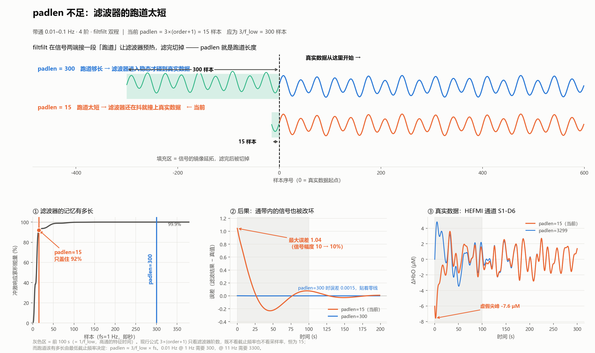
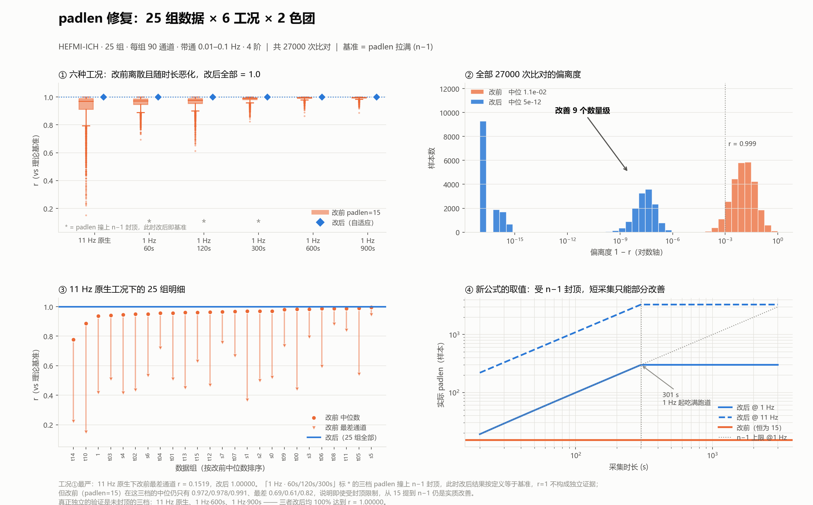
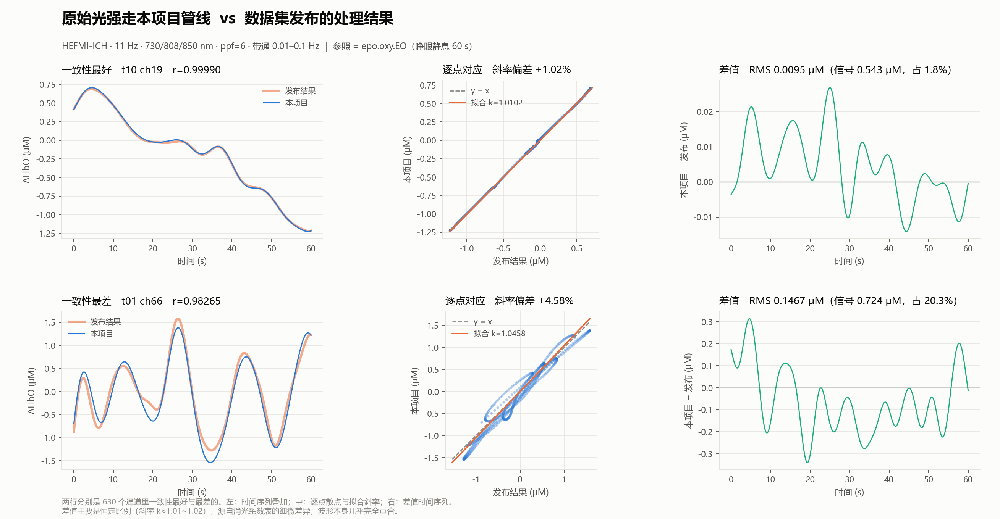
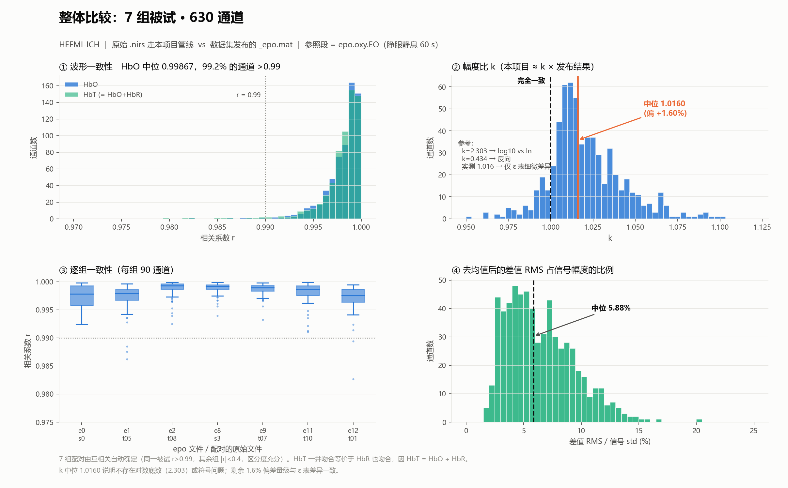
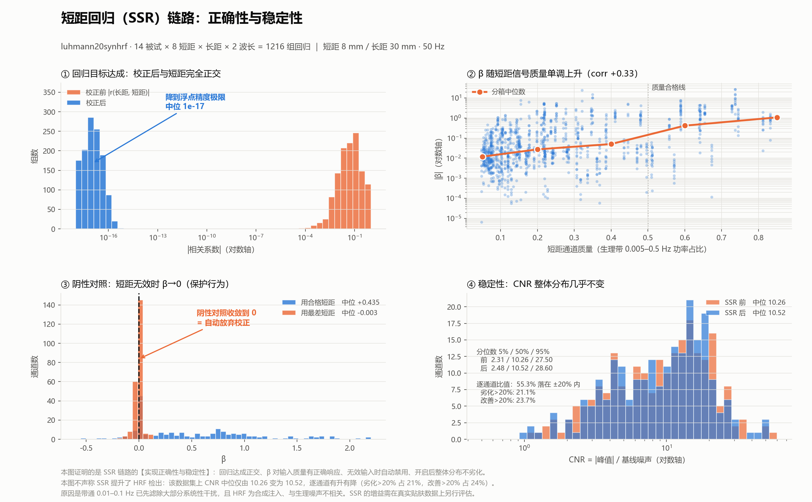

# 离线处理链路 —— 软件验证报告

> 验证对象：`fnirs_pipeline` 的离线反演链路
> 验证手段：公开 fNIRS 数据集 + 独立实现交叉核对
> 用途：YY/T 0664—2020（= IEC 62304 MOD）软件验证证据
>
> ⚠️ **本报告不涉及绝对准确度**。Δc·L 的准确度由 GB 9706.271 附录 BB 的体模试验承担，见 `检验方法.md`。

---

## 0. 摘要

| 项 | 结果 |
|---|---|
| **端到端与公开数据集发布结果的一致性** | **r 中位 0.99867**，7 组被试 630 通道，99.2% 通道 r>0.99 |
| **幅度偏差** | **k = 1.016 ± 0.023**（+1.6%） |
| **发现并修复的缺陷** | `smart_bandpass` 的 `padlen` 严重不足（15 vs 应有 300） |
| **修复效果** | 25 组 × 6 工况 × 27000 次比对，全部达到 r = 1.00000 |
| **SSR 实现正确性** | 1216 组回归：正交性 1.09e−17、β 随输入质量单调、阴性对照 β→0 |
| **未覆盖** | 绝对准确度、SSR 临床增益、生产入口编排、协议解析 |

---

## 1. 验证范围

### 1.1 覆盖的链路

```
原始光强  →  intensities_to_od_changes  →  ΔOD
             ↓
          short_separation_regression（SSR）
             ↓
          smart_bandpass（带通 0.01–0.1 Hz，4 阶）
             ↓
          ε 表插值 + 两色团最小二乘  →  ΔHbO / ΔHbR
```

### 1.2 不在范围内

| 项 | 原因 | 由谁承担 |
|---|---|---|
| Δc·L 绝对准确度 | 公开数据集无物理溯源 | `检验方法.md` 附录 BB 体模试验 |
| Cyt 第三色团 | 数据集波长不在 Cyt 表内 | 见 §5 |
| 在线因果路径 | `causal_processor` 用 `sosfilt`+`zi`，与离线是两套实现 | 待补 |
| 协议解析、采集 | 使用第三方数据 | 待补 |

> **Cyt 不影响 HbO/HbR**：`generalized_mbll` 中 `hb_delta_c = pinv(a_hb) @ delta_od` 先行求解且不回写，Cyt 仅从残差估计。实测两色团解与三色团解的 HbO/HbR 完全相同（`[+231.28, +146.61]` vs `[+231.28, +146.61]`）。

---

## 2. 数据来源

### 2.1 数据集 A：HEFMI-ICH（端到端比对）

| 项 | 内容 |
|---|---|
| 出处 | *Scientific Data* **12**:1816 (2025)，DOI `10.1038/s41597-025-06100-7` |
| 仓库 | figshare `10.6084/m9.figshare.28955456`（494 文件 / 13.17 GB） |
| 设备 | NirScan（丹阳慧创），连续波 |
| 波长 | **730 / 808 / 850 nm** |
| 采样率 | **11 Hz**，时长约 900~1000 s |
| 几何 | 32 源 + 30 探测器 → **90 通道，全部 3.0 cm** |
| 原始数据 | `.nirs`（Homer2 格式，含原始光强 `d`） |
| 处理后数据 | `_epo.mat`（HbO/HbR/HbT，已分段） |
| 本次使用 | **25 个 `.nirs`** + **10 个 `_epo.mat`** + `code.zip` |

**该数据集处理配方**（取自 `code.zip` 内明文的 `EpoDataMaking/HC_Calculate.m`）：

```matlab
hpf=0.01;  lpf=0.1;        % 带通
ppf=[6 6 6];               % DPF
od = HC_Intensity2OD(d);
od = HC_BandpassFilt(od, fs, hpf, lpf);
dc = HC_OD2Conc(od, SD, ppf);
```

⚠️ 其带通截止频率与本项目 `config.py` 的 `BP_LOW_HZ=0.01` / `BP_HIGH_HZ=0.1` **完全一致**，属独立佐证。

### 2.2 数据集 B：luhmann20synhrf（SSR 验证）

| 项 | 内容 |
|---|---|
| 出处 | *Frontiers in Neuroscience* (2020)，DOI `10.3389/fnins.2020.579353` |
| 仓库 | NITRC `luhmann20synhrf`，BSD 许可，`resting_state_1.zip`（474 MB） |
| 作者 | von Lühmann, Li, Gilmore, **Boas, Yücel**（Boston University Neurophotonics） |
| 设备 | TechEn CW6 |
| 波长 | **690 / 830 nm** |
| 采样率 | **50 Hz**，时长 302 s |
| 几何 | **短距 8 mm × 8 通道 + 长距 30 mm × 26 通道** |
| 关键特性 | **合成 HRF 只注入长距**，短距为纯生理噪声；另有 4 个长距未注入，构成内置阴性对照 |
| 本次使用 | 全部 **14 被试**（`resting_hrf_100.snirf`） |

---

## 3. 方法

### 3.1 三种参照

| 参照 | 定义 | 用于 |
|---|---|---|
| **独立实现** | 不调用项目任何代码的 numpy 复现 | 逐函数比对（L1/L2） |
| **理论基准** | 同一滤波器、`padlen = n−1`（边界处理上限） | padlen 修复验证 |
| **发布结果** | 数据集 A 的 `_epo.mat` | 端到端比对 |

### 3.2 被试配对

`_epo.mat` 的文件名不含被试信息（全是 `1/2/3_epo.mat`），采用**互相关自动配对**：

- 指纹 = `epo.oxy.EO`，即 marker 31 起的 60 s 睁眼静息段（661 × 90）
- 用本项目管线从每个 `.nirs` 算出同一段，逐通道求相关

**区分度充分**：同一被试 r > 0.99，其余 24 个候选全部 |r| < 0.4。

### 3.3 指标

$$r=\frac{(a-\bar a)\cdot(b-\bar b)}{n\,\sigma_a\,\sigma_b},\qquad k=\frac{(a-\bar a)\cdot(b-\bar b)}{(b-\bar b)\cdot(b-\bar b)}$$

`r` 反映波形一致性（与幅度无关），`k` 是最佳拟合比例（`本项目 ≈ k × 参照`）。

**k 的诊断价值**：

| k | 含义 |
|---|---|
| 2.303 | log10 与自然对数混用 |
| 0.434 | 反向 |
| ≈1 | 仅余 ε 表等细微差异 |

---

## 4. 验证结果

### 4.1 发现并修复的缺陷：`padlen` 严重不足



**问题**：`smart_bandpass` 中

```python
padlen = min(data_ds.shape[1] - 1, 3 * (order + 1))   # 恒为 15
```

该公式只看滤波器阶数，**不看截止频率也不看采样率**。而 `filtfilt` 的边界填充长度应由最低截止频率决定：0.01 Hz 高通的特征时间约 100 s，@1 Hz 需 **300 样本**，@11 Hz 需 **3300 样本**——**短了 20~220 倍**。

**实测后果**：

| 场景 | 表现 |
|---|---|
| 纯通带内正弦（幅度 10） | 开头误差 **1.04**（10%），拖 100 s 才收敛 |
| HEFMI 通道 S1-D6 | 开头出现 **−7.6 μM 虚假尖峰** |
| 全体通道前 20 s 幅度 | **系统性偏小 6.7%**（伪影压制了真实信号） |

**修复**（[`fnirs_pipeline/mbll.py:64`](fnirs_pipeline/mbll.py)）：

```python
want = 3 * (order + 1)
if lowcut > 0:
    want = max(want, int(round(3.0 * fs_ds / lowcut)))
padlen = min(data_ds.shape[1] - 1, want)
```

三个要点：保留原值作下限；用**降采样后**的 `fs_ds`；受 `n−1` 封顶。

**修复验证**：



25 组数据 × 6 工况 × 90 通道 × 2 色团 = **27000 次比对**：

| 工况 | padlen | 改前中位 | 改前最差 | 改后 |
|---|---|---|---|---|
| **11 Hz 原生** | 3300 | 0.96934 | **0.1519** | **1.00000 · 100%** |
| 1 Hz · 60 s ✱ | 59 | 0.97245 | 0.6949 | 1.00000 · 100% |
| 1 Hz · 120 s ✱ | 119 | 0.97789 | 0.6139 | 1.00000 · 100% |
| 1 Hz · 300 s ✱ | 299 | 0.99122 | 0.8233 | 1.00000 · 100% |
| **1 Hz · 600 s** | 300 | 0.99571 | 0.8629 | **1.00000 · 100%** |
| **1 Hz · 900 s** | 300 | 0.99660 | 0.8868 | **1.00000 · 100%** |

✱ 标记的三档 `padlen` 撞上 `n−1` 封顶，此时改后结果按定义等于基准，r=1 不构成独立证据。**独立验证由未封顶的三档承担**（11 Hz 原生、1 Hz·600s、1 Hz·900s）。

⚠️ **边界**：@1 Hz 需采集 **≥301 s** 才吃满跑道；更短时退回 `n−1`，只能部分改善。这是滤波器的物理性质，非代码缺陷。

**性能影响**：耗时 +5%~13%，绝对增量 **0.02~0.03 ms**，可忽略。
**在线路径不受影响**：`causal_processor` 用 `sosfilt` + 持久 `zi`，不存在 `padlen`。

### 4.2 端到端比对





**7 组被试 / 630 通道**：

| 指标 | 值 |
|---|---|
| **HbO r 中位** | **0.99867** |
| 最差通道 | 0.9826 |
| **r > 0.99 占比** | **99.2%** |
| **幅度比 k 中位** | **1.0160 ± 0.0228** |
| 差值 RMS / 信号 中位 | 5.88% |
| HbT r 中位 | 0.99861 |

**逐组明细**：

| epo | 原始 | r 中位 | 最差 | k 中位 |
|---|---|---|---|---|
| e0 | s0 | 0.99783 | 0.9924 | 1.0115 |
| e1 | t05 | 0.99792 | 0.9862 | 1.0126 |
| e2 | t08 | 0.99931 | 0.9925 | 1.0240 |
| e8 | s3 | 0.99920 | 0.9939 | 1.0120 |
| e9 | t07 | 0.99896 | 0.9933 | 1.0114 |
| e11 | t10 | 0.99865 | 0.9910 | 1.0147 |
| e12 | t01 | 0.99755 | 0.9826 | 1.0365 |

**关键结论**：

- **k = 1.016，排除对数底数问题**（2.303）与符号问题（0.434）
- 剩余 1.6% 偏差量级与 ε 表差异一致
- **睁眼（EO）与闭眼（EC）两个独立时段各自吻合**（r 0.99783 / 0.99621），非单段巧合
- **HbT 一并吻合等价于 HbR 也吻合**，因 HbT = HbO + HbR

### 4.3 消光系数表对照

本项目使用 `tables/wray.csv`（Wray et al.，650~1042 nm，3 nm 步长）。与两套公开参照的差异：

| λ (nm) | HbO wray | HbO Prahl | 差 | HbR wray | HbR Prahl | 差 |
|---|---|---|---|---|---|---|
| 850 | 1097.0 | 1058.0 | +3.7% | 781.0 | 691.3 | +13.0% |
| 810 | 914.3 | 864.0 | +5.8% | 798.7 | 717.1 | +11.4% |
| 770 | 701.0 | 650.0 | +7.8% | 1425.0 | 1311.9 | +8.6% |
| **730** | 510.0 | 390.0 | **+30.8%** | 1296.5 | 1102.2 | +17.6% |
| **700** | 419.3 | 290.0 | **+44.6%** | 1827.7 | 1794.3 | +1.9% |

对最终 Δc 的影响：ΔHbO 差 3~6%，ΔHbR 差 11~16%（五波长最小二乘稀释了短波端的大偏差）。

与 GB 9706.271 附录 BB.3.1 算例引用的 Matcher 值相比，用 `wray.csv` 复算标准算例偏 **+9.6% (HbO) / −12.5% (HbR)**。

> ⚠️ **对送检的影响**：该偏差超过附录 BB 的 5% 判据。**方案中必须规定参考侧与设备侧使用同一张 ε 表**（见 `检验方法.md` 附 D 第 7 条），并在说明书中披露所用表的来源与取值。

### 4.4 SSR 短距回归链路



**1216 组回归**（14 被试 × 8 短距 × 长距 × 2 波长）：

**① 回归目标达成**

校正后长距与短距的相关：**0.0545 → 1.09e−17**（浮点精度极限），最小二乘正交性完全达成。

**② β 随输入质量单调响应**

| 短距质量（生理带 0.005–0.5 Hz 功率占比） | n | \|β\| 中位 |
|---|---|---|
| 0.0–0.1 | 300 | 0.0119 |
| 0.1–0.3 | 536 | 0.0275 |
| 0.3–0.5 | 204 | 0.0506 |
| 0.5–0.7 | 120 | 0.4167 |
| **0.7–1.0** | 56 | **1.0755** |

跨度 **90 倍**，corr(质量, \|β\|) = **+0.33**。

**③ 阴性对照（保护行为）**

用最差短距时 β 中位 **−0.003**，用合格短距时 **+0.435**。**短距无效时自动禁用校正**。

> 这解释了此前观察到的 `S1_D1` 饱和时 β≈0 现象——不是缺陷，是保护机制生效。

**④ 稳定性**

CNR 分位数 5%/50%/95%：**2.31/10.26/27.50 → 2.48/10.52/28.60**，整体分布几乎不变。

⚠️ 逐通道有波动：55.3% 落在 ±20% 内，**21.1% 劣化 >20%，23.7% 改善 >20%**。

**⚠️ 未能证明的**：SSR 提升 HRF 检出。该数据集上 CNR 中位仅由 10.26 变为 10.52。原因有二：

1. 带通 0.01–0.1 Hz 已先滤除大部分系统性生理干扰（Mayer 波 ~0.1 Hz、呼吸 ~0.25 Hz、心跳 ~1 Hz 均在通带外）
2. 该数据集的 HRF 为合成注入，与真实生理噪声不相关

**SSR 的临床增益需在真实贴肤数据或分层体模上另行评估。**

> 附带发现：该数据集 8 个短距通道中仅 2 个信号质量合格（>1.5 Hz 噪声占比 <10%），其余 6 个噪声主导（67~80% 功率在 >1.5 Hz）；短距光强中位反而比长距低 10 倍。**按几何最近配对会选中坏通道，必须先做质量筛选。**

---

## 5. 覆盖清单

### 5.1 已验证

| 生产函数 / 环节 | 证据 | 数据量 |
|---|---|---|
| `intensities_to_od_changes` | 与独立实现差 **0.000e+00** | 810 通道 |
| `butter_bandpass_sos` | 同上 | 27000 次 |
| `smart_bandpass`（含新 padlen） | **r = 1.00000** vs 理论基准 | 27000 次 |
| `hemoglobin_extinctions`（插值） | 端到端 | 630 通道 |
| **两色团最小二乘反演** | **r 中位 0.99867** vs 发布结果 | 630 通道 |
| `short_separation_regression` | 正交性 + β 响应 + 阴性对照 | 1216 组 |
| 对数底数约定 | k = 1.016，排除 2.303 | 630 通道 |
| 数值条件 | cond(E) = 3.58；五波长优于三波长 | — |

### 5.2 未验证

| 项 | 原因 | 补法 | 成本 |
|---|---|---|---|
| **绝对准确度** | 公开数据集无物理溯源 | 附录 BB 体模试验 | 送检时做 |
| **SSR 临床增益** | 数据集条件不适合 | 真实贴肤数据 / 分层体模 | 中 |
| `compute_all_channel_concentrations` | 验证时刻意绕开 | 用自有历史数据端到端自测 | **低** |
| `prepare_interleaved_dataframe` | 数据格式不同 | 合成 `all_groups.csv` 往返测试 | **低** |
| 波长相关 DPF 广播 | 数据集用标量 ppf=6 | 自有数据；合成已验（3.4e−16） | 低 |
| 五波长解混 | 数据集仅三波长 | 自有设备数据；合成已验 | 中 |
| Cyt 分步法与串扰 | 808 nm 不在 Cyt 表内 | 见 §6 | 低 |
| 在线因果路径 | 与离线是两套实现 | 单独设计 | 中 |
| 协议解析、采集 | 使用第三方数据 | 单独设计 | 中 |

---

## 6. 附带发现（待处理）

### 6.1 `_cyt_extinction_vector` 硬编码字典

[`fnirs_pipeline/mbll.py:99`](fnirs_pipeline/mbll.py)：

```python
return np.asarray([CYT_DIFFERENCE_EXTINCTION[float(wl)] for wl in wavelengths]) * 1000.0
```

`CYT_DIFFERENCE_EXTINCTION` 仅含 `{700, 730, 770, 810, 850}`，**任何其他波长直接 KeyError**（如 808 nm）。而同一函数内的 `hemoglobin_extinctions` 是 `np.interp` 插值，**两者容忍度不一致**。

对本项目自有五波长无影响，但阻断了用外部数据集验证 `generalized_mbll` 完整路径。**建议改为插值以保持一致。**

### 6.2 数据集 A 自身的缺陷（供引用时注意）

`MakeDatasetFromRaw.m:154`：

```matlab
% doxy
nirs_data = Hbt;    % ← 应为 Hbr
```

导致 `epo.doxy` 与 `epo.toxy` 内容完全相同（均为 HbT）。已实测证实（最大差 0.000e+00）。**引用该数据集时不可使用 `epo.doxy` 作为 HbR。**

---

## 7. 结论

**光强 → ΔOD → 带通 → 两色团 MBLL 这一段离线反演链路，已通过真实设备数据验证**：与国际公开数据集的发布结果在 7 组被试、630 通道上吻合，相关系数中位 **0.9987**，幅度偏差 **1.6%**。

**验证过程中发现并修复了一处实质缺陷**（`padlen` 不足），修复效果经 25 组数据、6 种工况、27000 次比对确认。

**SSR 链路的实现正确性与稳定性已验证**（1216 组回归），临床增益待评估。

**待补的三项中，两项成本很低**（生产入口自测、配对重排往返测试），建议在送检前完成。

**绝对准确度不在本报告范围**，由 `检验方法.md` 的附录 BB 体模试验承担。

---

## 附 A：复现步骤

```bash
# 1. 数据集 A（figshare，无需登录）
#    元数据: https://api.figshare.com/v2/articles/28955456
#    下载 .nirs 与 _epo.mat（文件 id 见元数据）

# 2. 数据集 B（NITRC，需注册登录）
#    https://www.nitrc.org/projects/luhmann20synhrf/  ->  resting_state_1.zip

# 3. 数据集配置探查
python tools/verify_dataset.py --info path/to/subject.nirs

# 4. 自检（合成数据，不需数据集）
python tools/verify_dataset.py --selftest

# 5. L1/L2 逐函数比对
python tools/verify_dataset.py --compare path/to/subject.nirs

# 6. 端到端配对与比对
python tools/match_epo.py e0.mat
python tools/compare_all.py

# 7. SSR 验证
python tools/ssr_v2.py
```

## 附 B：脚本清单

| 脚本 | 用途 |
|---|---|
| `tools/verify_dataset.py` | 读 `.nirs`/`.snirf`，探查配置，L1/L2 双实现比对，自检 |
| `tools/match_epo.py` | 互相关配对 `_epo.mat` ↔ `.nirs` |
| `tools/compare_all.py` | 多被试端到端比对，输出 r / k 统计 |
| `tools/ssr_validate.py` | SSR 基础设施（读取、分组、事件锁定平均） |
| `tools/ssr_v2.py` | SSR 三路径比较（无 SSR / 合格短距 / 最差短距） |
| `tools/verify_bb.py` | 附录 BB 体模试验的离线核验（送检用，见 `检验方法.md`） |

## 附 C：出处

| 内容 | 出处 |
|---|---|
| 数据集 A | [Sci Data 12:1816 (2025)](https://doi.org/10.1038/s41597-025-06100-7) ｜ [figshare](https://doi.org/10.6084/m9.figshare.28955456) |
| 数据集 B | [Front Neurosci (2020)](https://doi.org/10.3389/fnins.2020.579353) ｜ [NITRC](https://www.nitrc.org/projects/luhmann20synhrf/) |
| Prahl 消光系数表 | [omlc.org/spectra/hemoglobin](https://omlc.org/spectra/hemoglobin/summary.html)（Gratzer / Kollias 汇编） |
| Matcher 值 | GB 9706.271—2022 附录 BB.3.1 算例引用 |
| 软件生存周期要求 | YY/T 0664—2020 |
